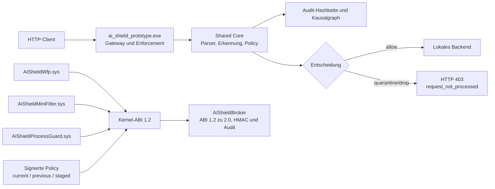

# CodeDump for Project: `AI_Shield_Developer_Full.zip`

_Generated on 2026-07-14T05:15:20.157Z_

No LLM call was made. Token/cost values are offline estimates only.

LLM Code Review Mode is enabled: generated/vendor/report/lockfile noise is filtered across languages.

## Repository Map

```text
.
└── AI_Shield_Developer_Full/
    ├── docs/
    │   ├── adr/
    │   │   └── 0001-shared-core-boundary.md
    │   ├── architecture/
    │   │   └── overview.md
    │   ├── ABI_2_0_DE.md
    │   ├── ABI_FREEZE_UND_HLK_DE.md
    │   ├── AI_Shield_Developer_Full.md
    │   ├── AKTUELLER_INSTALLATIONSSTAND_DE.md
    │   ├── ARCHITEKTUR_WHITEBOARD_DE.md
    │   ├── AUDIT_VIEWER_DE.md
    │   ├── DEVELOPER_FULL_HANDBUCH_DE.md
    │   ├── DRIVER_SECURITY_LAB_DE.md
    │   ├── EDITIONEN_UND_VERSIONEN_DE.md
    │   ├── ENTERPRISE_EDITION_HANDBUCH_DE.md
    │   ├── ENTERPRISE_SECURITY_INTEGRATIONS_DE.md
    │   ├── ENTWICKLER_SCHNELLSTART_DE.md
    │   ├── EXTERNER_SECURITY_REVIEW_AUFTRAG_DE.md
    │   ├── FEHLENDE_FUNKTIONEN_DE.md
    │   ├── JUNIOR_ENTERPRISE_INTEGRATION_SCHNELLSTART_DE.md
    │   ├── KERNEL_HARDWARE_SCHUTZ_DE.md
    │   ├── NETZWERKSCHUTZ_DE.md
    │   ├── overview.md
    │   ├── PRIVATE_DESKTOP_HANDBUCH_DE.md
    │   ├── PRODUKTQUALIFIKATION_DE.md
    │   ├── PROTOTYP_HANDBUCH_DE.md
    │   ├── RANSOMWARE_SCHUTZ_UND_RECOVERY_DE.md
    │   ├── RC8_RELEASE_NACHWEIS_DE.md
    │   ├── README.md
    │   ├── SCHUTZABDECKUNG_2_0_DE.md
    │   ├── SICHERHEITSABSCHLUSS_DE.md
    │   ├── Softwarebewertung.md
    │   ├── WHITEPAPER_DE.md
    │   └── WINDOWS_HARDENING_DE.md
    ├── editions/
    │   └── private_desktop/
    │       ├── developer_full/
    │       │   ├── Build_All_Release.cmd
    │       │   ├── Build_All_Release.ps1
    │       │   ├── Install_Precompiled_Desktop.cmd
    │       │   ├── Install_Precompiled_Desktop.ps1
    │       │   └── README_DE.md
    │       ├── ui/
    │       │   ├── AIShield.AuditViewer.xaml
    │       │   ├── AIShield.PrivateDesktop.UI.xaml
    │       │   ├── private_security_settings.ps1
    │       │   ├── README.md
    │       │   ├── start_private_ui.ps1
    │       │   └── verify_ui_contract.ps1
    │       ├── AI_Shield_Private_Desktop.md
    │       ├── AI_Shield_UI.cmd
    │       ├── Deinstallieren.cmd
    │       ├── edition.json
    │       ├── install_private_desktop.ps1
    │       ├── Installieren.cmd
    │       ├── msi_product_action.ps1
    │       ├── private_common.ps1
    │       ├── private_posture.ps1
    │       ├── QUALIFIKATIONSSTATUS.md
    │       ├── README.md
    │       ├── RELEASE_CONTRACT.json
    │       ├── Schutz_beenden.cmd
    │       ├── Schutz_starten.cmd
    │       ├── SOFTWAREBEWERTUNG_PRIVAT.md
    │       ├── start_private_desktop.ps1
    │       ├── Status_anzeigen.cmd
    │       ├── status_private_desktop.ps1
    │       ├── stop_private_desktop.ps1
    │       ├── uninstall_private_desktop.ps1
    │       └── validate_release_freeze.ps1
    ├── include/
    │   └── ai_shield/
    │       ├── abi_validation.hpp
    │       ├── abi.hpp
    │       ├── abi2.hpp
    │       ├── audit.hpp
    │       ├── backpressure.hpp
    │       ├── broker_runtime.hpp
    │       ├── build_attestation.hpp
    │       ├── campaign.hpp
    │       ├── causal_graph.hpp
    │       ├── checked.hpp
    │       ├── cloud_optin.hpp
    │       ├── compatibility_lab.hpp
    │       ├── consequence_detector.hpp
    │       ├── correlation.hpp
    │       ├── dataset_governance.hpp
    │       ├── detection.hpp
    │       ├── diagnostics.hpp
    │       ├── dns.hpp
    │       ├── egress_gate.hpp
    │       ├── fail_policy.hpp
    │       ├── features.hpp
    │       ├── flow_baseline.hpp
    │       ├── flow_control.hpp
    │       ├── flow_state.hpp
    │       ├── fuzz_plan.hpp
    │       ├── health.hpp
    │       ├── http_canonicalizer.hpp
    │       ├── http1.hpp
    │       ├── http2_preflight.hpp
    │       ├── incident_package.hpp
    │       ├── ipc_validator.hpp
    │       ├── ipv6_security.hpp
    │       ├── isolation_forest.hpp
    │       ├── json_preflight.hpp
    │       ├── learning_mode.hpp
    │       ├── maintenance_mode.hpp
    │       ├── model_registry.hpp
    │       ├── mutation_detector.hpp
    │       ├── package_manifest.hpp
    │       ├── pdf_preflight.hpp
    │       ├── pe_preflight.hpp
    │       ├── pending_decision.hpp
    │       ├── platform_uri.hpp
    │       ├── policy_authorization.hpp
    │       ├── policy_store.hpp
    │       ├── policy.hpp
    │       ├── privacy.hpp
    │       ├── process_consequence.hpp
    │       ├── process_guard.hpp
    │       ├── provenance.hpp
    │       ├── ransomware.hpp
    │       ├── recovery_plan.hpp
    │       ├── recovery_vault.hpp
    │       ├── release_gate.hpp
    │       ├── replay.hpp
    │       ├── response_normalizer.hpp
    │       ├── result.hpp
    │       ├── retention.hpp
    │       ├── ring_buffer.hpp
    │       ├── risk.hpp
    │       ├── sandbox_budget.hpp
    │       ├── sandbox.hpp
    │       ├── sequence_model.hpp
    │       ├── service_discovery.hpp
    │       ├── service_identity.hpp
    │       ├── service_registry.hpp
    │       ├── sha256.hpp
    │       ├── shadow_catalog.hpp
    │       ├── siem.hpp
    │       ├── signature_detector.hpp
    │       ├── support_package.hpp
    │       ├── system_preflight.hpp
    │       ├── tls_service_policy.hpp
    │       ├── tlsmeta.hpp
    │       ├── update_manager.hpp
    │       ├── worker_supervisor.hpp
    │       ├── xml_preflight.hpp
    │       └── zip_preflight.hpp
    ├── kernel/
    │   ├── filesystem/
    │   │   └── README.md
    │   ├── guard/
    │   │   └── README.md
    │   └── wfp/
    │       └── README.md
    ├── platform/
    │   └── windows/
    │       ├── admin/
    │       │   └── ai_shield_admin.ps1
    │       ├── asr/
    │       │   └── evaluate_asr_audit.ps1
    │       ├── browser_extension/
    │       │   ├── install_browser_sensor.ps1
    │       │   ├── manifest.json
    │       │   ├── service_worker.js
    │       │   └── sign_browser_host.ps1
    │       ├── common/
    │       │   ├── abi_translation.cpp
    │       │   ├── abi_translation.hpp
    │       │   ├── ai_shield_driver_protocol.h
    │       │   ├── ai_shield_event_queue.h
    │       │   └── README.md
    │       ├── firewall/
    │       │   └── firewall_baseline.ps1
    │       ├── installer/
    │       │   ├── ai_shield_minifilter.inf
    │       │   ├── ai_shield_process_guard.inf
    │       │   ├── ai_shield_wfp.inf
    │       │   ├── binary_update.ps1
    │       │   ├── deploy_current_prototype.ps1
    │       │   ├── enable_testsigning.ps1
    │       │   ├── install_broker.ps1
    │       │   ├── install_core_service.ps1
    │       │   ├── install_drivers.ps1
    │       │   ├── prepare_microsoft_submission.ps1
    │       │   ├── README.md
    │       │   ├── recover_pending_update.ps1
    │       │   ├── sign_driver_package.ps1
    │       │   ├── uninstall_drivers.ps1
    │       │   ├── uninstall_product.ps1
    │       │   ├── update_and_install_drivers.ps1
    │       │   └── verify_microsoft_signed_package.ps1
    │       ├── minifilter/
    │       │   ├── driver/
    │       │   │   ├── ai_shield_minifilter.c
    │       │   │   └── AIShieldMiniFilter.vcxproj
    │       │   ├── provenance_adapter.cpp
    │       │   ├── provenance_adapter.hpp
    │       │   └── README.md
    │       ├── msi/
    │       │   ├── AIShieldPrivateDesktop.wxs
    │       │   ├── build_msi.ps1
    │       │   ├── License.rtf
    │       │   └── README_DE.md
    │       ├── policy/
    │       │   └── ai_shield_policy.ps1
    │       ├── powershell_logging/
    │       │   └── powershell_privacy_forwarder.ps1
    │       ├── process_guard/
    │       │   ├── driver/
    │       │   │   ├── ai_shield_process_guard.c
    │       │   │   └── AIShieldProcessGuard.vcxproj
    │       │   └── README.md
    │       ├── qualification/
    │       │   └── recovery_drills.ps1
    │       ├── ransomware/
    │       │   └── ransomware_recovery.ps1
    │       ├── sandbox/
    │       │   ├── appcontainer_launcher.cpp
    │       │   ├── appcontainer_launcher.hpp
    │       │   ├── parser_pool.cpp
    │       │   ├── parser_pool.hpp
    │       │   └── README.md
    │       ├── security/
    │       │   ├── complete_local_security.ps1
    │       │   ├── defender_audit_baseline.ps1
    │       │   ├── kernel_hardware_hardening.ps1
    │       │   ├── prepare_bitlocker.ps1
    │       │   ├── secure_runtime_state.cpp
    │       │   ├── secure_runtime_state.hpp
    │       │   ├── system_security_posture.ps1
    │       │   ├── tpm_trust_anchor.cpp
    │       │   └── tpm_trust_anchor.hpp
    │       ├── sensors/
    │       │   ├── etw_amsi_adapter.cpp
    │       │   └── etw_amsi_adapter.hpp
    │       ├── service/
    │       │   ├── driver_channel.cpp
    │       │   ├── driver_channel.hpp
    │       │   └── README.md
    │       ├── siem/
    │       │   ├── syslog_connector.cpp
    │       │   └── syslog_connector.hpp
    │       ├── soc_ui/
    │       │   ├── app.js
    │       │   ├── index.html
    │       │   ├── start_soc_console.ps1
    │       │   └── style.css
    │       ├── uac/
    │       │   └── uac_hardening_assistant.ps1
    │       ├── verification/
    │       │   ├── driver_security_lab.ps1
    │       │   ├── prepare_hlk_lab.ps1
    │       │   └── validate_abi_freeze.ps1
    │       ├── wdac/
    │       │   └── wdac_audit_baseline.ps1
    │       ├── wef/
    │       │   └── configure_wef.ps1
    │       ├── wfp/
    │       │   ├── adapter/
    │       │   │   ├── wfp_enforcement.cpp
    │       │   │   ├── wfp_enforcement.hpp
    │       │   │   ├── wfp_telemetry.cpp
    │       │   │   └── wfp_telemetry.hpp
    │       │   ├── driver/
    │       │   │   ├── ai_shield_wfp.c
    │       │   │   └── AIShieldWfp.vcxproj
    │       │   └── README.md
    │       ├── build_drivers.ps1
    │       ├── drivers.props
    │       ├── protect_system.ps1
    │       ├── README.md
    │       ├── start_ai_shield.ps1
    │       └── stop_ai_shield.ps1
    ├── src/
    │   ├── abi_validation.cpp
    │   ├── abi2.cpp
    │   ├── audit.cpp
    │   ├── backpressure.cpp
    │   ├── broker_runtime.cpp
    │   ├── build_attestation.cpp
    │   ├── campaign.cpp
    │   ├── causal_graph.cpp
    │   ├── cloud_optin.cpp
    │   ├── compatibility_lab.cpp
    │   ├── consequence_detector.cpp
    │   ├── dataset_governance.cpp
    │   ├── detection.cpp
    │   ├── diagnostics.cpp
    │   ├── dns.cpp
    │   ├── egress_gate.cpp
    │   ├── fail_policy.cpp
    │   ├── features.cpp
    │   ├── flow_baseline.cpp
    │   ├── flow_control.cpp
    │   ├── fuzz_plan.cpp
    │   ├── health.cpp
    │   ├── http_canonicalizer.cpp
    │   ├── http1.cpp
    │   ├── http2_preflight.cpp
    │   ├── incident_package.cpp
    │   ├── ipc_validator.cpp
    │   ├── ipv6_security.cpp
    │   ├── isolation_forest.cpp
    │   ├── json_preflight.cpp
    │   ├── learning_mode.cpp
    │   ├── maintenance_mode.cpp
    │   ├── model_registry.cpp
    │   ├── mutation_detector.cpp
    │   ├── package_manifest.cpp
    │   ├── pdf_preflight.cpp
    │   ├── pe_preflight.cpp
    │   ├── pending_decision.cpp
    │   ├── platform_uri.cpp
    │   ├── policy_authorization.cpp
    │   ├── policy_store.cpp
    │   ├── policy.cpp
    │   ├── privacy.cpp
    │   ├── process_consequence.cpp
    │   ├── provenance.cpp
    │   ├── ransomware.cpp
    │   ├── recovery_plan.cpp
    │   ├── recovery_vault.cpp
    │   ├── release_gate.cpp
    │   ├── replay.cpp
    │   ├── response_normalizer.cpp
    │   ├── retention.cpp
    │   ├── risk.cpp
    │   ├── sandbox_budget.cpp
    │   ├── sandbox.cpp
    │   ├── sequence_model.cpp
    │   ├── service_discovery.cpp
    │   ├── service_identity.cpp
    │   ├── service_registry.cpp
    │   ├── sha256.cpp
    │   ├── shadow_catalog.cpp
    │   ├── siem.cpp
    │   ├── signature_detector.cpp
    │   ├── support_package.cpp
    │   ├── system_preflight.cpp
    │   ├── tls_service_policy.cpp
    │   ├── tlsmeta.cpp
    │   ├── update_manager.cpp
    │   ├── worker_supervisor.cpp
    │   ├── xml_preflight.cpp
    │   └── zip_preflight.cpp
    ├── tests/
    │   ├── unit/
    │   │   └── main.cpp
    │   ├── windows_platform/
    │   │   └── main.cpp
    │   ├── windows_download_content_protection.ps1
    │   ├── windows_private_desktop_qualification.ps1
    │   ├── windows_process_guard_rules.ps1
    │   ├── windows_product_qualification.ps1
    │   └── windows_ransomware_recovery.ps1
    ├── tools/
    │   ├── ai_shield_broker/
    │   │   └── main.cpp
    │   ├── ai_shield_browser_host/
    │   │   └── main.cpp
    │   ├── ai_shield_diag/
    │   │   └── main.cpp
    │   ├── ai_shield_driverctl/
    │   │   └── main.cpp
    │   ├── ai_shield_handle_probe/
    │   │   └── main.cpp
    │   ├── ai_shield_integrations/
    │   │   └── main.cpp
    │   ├── ai_shield_kernelctl/
    │   │   └── main.cpp
    │   ├── ai_shield_prototype/
    │   │   └── main.cpp
    │   ├── ai_shield_replay/
    │   │   └── main.cpp
    │   ├── ai_shield_service/
    │   │   └── main.cpp
    │   ├── build_private_release_candidate.ps1
    │   ├── check_shared_core_boundary.ps1
    │   ├── complete_private_rc_admin.ps1
    │   ├── deploy_download_content_protection.ps1
    │   ├── deploy_private_rc5_patch.ps1
    │   ├── package_developer_full.ps1
    │   ├── package_developer_release.ps1
    │   └── package_private_desktop.ps1
    ├── AI_Shield_Defender_Auditmodus.cmd
    ├── AI_Shield_Defender_Rollback.cmd
    ├── AI_Shield_Protect_System_Strict.cmd
    ├── AI_Shield_Protect_System.cmd
    ├── AI_Shield_Sicherheitsstatus.cmd
    ├── AI_Shield_Start_Demo.cmd
    ├── AI_Shield_Start.cmd
    ├── AI_Shield_Stop.cmd
    ├── AI_Shield_Update_Drivers.cmd
    ├── AI_Shield_Vollstaendiger_Entwicklungsplan.extracted.txt
    ├── AI_Shield_Vollstaendiger_Entwicklungsplan.md
    ├── Build_All_Release.cmd
    ├── Build_All_Release.ps1
    ├── CMakeLists.txt
    ├── FULL_PACKAGE_MANIFEST.json
    ├── Install_Precompiled_Desktop.cmd
    ├── Install_Precompiled_Desktop.ps1
    ├── planfortsetzung.txt
    ├── README_DE.md
    ├── README.md
    └── Softwarebewertung.md
```

## File: `AI_Shield_Developer_Full/docs/architecture/overview.md`  
- Path: `AI_Shield_Developer_Full/docs/architecture/overview.md`  
- Size: 9195 Bytes  
- Modified: 2026-07-13 16:30:00 UTC

```markdown
# AI Shield Architecture Foundation

Stand: 13. Juli 2026. Diese Datei beschreibt die Shared-Core-Grenze. Editions-, Betriebs- und
UI-Dokumentation beginnt eine Ebene höher in [`../README.md`](../README.md).

Der aktuelle Windows-Stand ergänzt den Shared Core um Private-Desktop-UI, Browser-Sensor,
DPAPI-geschützten Dateityp-Schutz, isolierte Downloadprüfung und einen AISHAD02-Audit-Viewer.

The current codebase implements the shared, platform-neutral core required before Windows driver
integration:

- `shared/abi`: represented by `include/ai_shield/abi.hpp`.
- `shared/checked`: represented by `include/ai_shield/checked.hpp`.
- `core/policy`: represented by `include/ai_shield/policy.hpp` and `src/policy.cpp`.
- `core/audit`: represented by `include/ai_shield/audit.hpp` and `src/audit.cpp`.
  The diagnostic CLI verifies exported audit chains offline through `audit-verify`.
- `core/provenance`: represented by `include/ai_shield/provenance.hpp` and `src/provenance.cpp`.
  This includes external-file execute gating and quarantine dispositions.
- `shared/abi_validation`: represented by `include/ai_shield/abi_validation.hpp` and `src/abi_validation.cpp`.
- `core/replay`: represented by `include/ai_shield/replay.hpp`, `src/replay.cpp` and `tools/ai_shield_replay/main.cpp`.
  The replay executable accepts legacy single-payload input and the `AISHRP02` event stream used for
  Integrated Core validation.
- `prototype/http_gateway`: represented by `tools/ai_shield_prototype/main.cpp`.
  It provides the first usable usermode vertical slice: listen, analyze, block or forward HTTP requests.
- `protocols/http1`: represented by `include/ai_shield/http1.hpp` and `src/http1.cpp`.
- `protocols/dns`: represented by `include/ai_shield/dns.hpp` and `src/dns.cpp`.
- `protocols/json`: represented by `include/ai_shield/json_preflight.hpp` and `src/json_preflight.cpp`.
- `protocols/tlsmeta`: represented by `include/ai_shield/tlsmeta.hpp` and `src/tlsmeta.cpp`.
- `protocols/xml`: represented by `include/ai_shield/xml_preflight.hpp` and `src/xml_preflight.cpp`.
- `protocols/pdf`: represented by `include/ai_shield/pdf_preflight.hpp` and `src/pdf_preflight.cpp`.
- `protocols/zip`: represented by `include/ai_shield/zip_preflight.hpp` and `src/zip_preflight.cpp`.
- `protocols/pe`: represented by `include/ai_shield/pe_preflight.hpp` and `src/pe_preflight.cpp`.
- `detection/campaign`: represented by `include/ai_shield/campaign.hpp` and `src/campaign.cpp`.
- `core/service_registry`: represented by `include/ai_shield/service_registry.hpp` and `src/service_registry.cpp`.
- `core/service_discovery`: represented by `include/ai_shield/service_discovery.hpp` and `src/service_discovery.cpp`.
  Observed listeners produce proposed policies and require explicit confirmation before admission.
- `core/policy_authorization`: represented by `include/ai_shield/policy_authorization.hpp` and `src/policy_authorization.cpp`.
- `core/process_consequence`: represented by `include/ai_shield/process_consequence.hpp` and `src/process_consequence.cpp`.
  `include/ai_shield/process_guard.hpp` remains a compatibility shim and does not own Windows process sensors.
- `core/package_manifest`: represented by `include/ai_shield/package_manifest.hpp` and `src/package_manifest.cpp`.
- `core/model_registry`: represented by `include/ai_shield/model_registry.hpp` and `src/model_registry.cpp`.
- `core/policy_store`: represented by `include/ai_shield/policy_store.hpp` and `src/policy_store.cpp`.
- `core/incident_package`: represented by `include/ai_shield/incident_package.hpp` and `src/incident_package.cpp`.
- `core/update_manager`: represented by `include/ai_shield/update_manager.hpp` and `src/update_manager.cpp`.
- `core/flow_control`: represented by `include/ai_shield/flow_control.hpp` and `src/flow_control.cpp`.
- `core/worker_supervisor`: represented by `include/ai_shield/worker_supervisor.hpp` and `src/worker_supervisor.cpp`.
- `core/privacy`: represented by `include/ai_shield/privacy.hpp` and `src/privacy.cpp`.
- `core/ipc_validator`: represented by `include/ai_shield/ipc_validator.hpp` and `src/ipc_validator.cpp`.
- `core/pending_decision`: represented by `include/ai_shield/pending_decision.hpp` and `src/pending_decision.cpp`.
- `core/platform_uri`: represented by `include/ai_shield/platform_uri.hpp` and `src/platform_uri.cpp`.
- `core/retention`: represented by `include/ai_shield/retention.hpp` and `src/retention.cpp`.
- `core/response_normalizer`: represented by `include/ai_shield/response_normalizer.hpp` and `src/response_normalizer.cpp`.
- `core/risk`: represented by `include/ai_shield/risk.hpp` and `src/risk.cpp`.
- `core/fail_policy`: represented by `include/ai_shield/fail_policy.hpp` and `src/fail_policy.cpp`.
- `core/learning`: represented by `include/ai_shield/learning_mode.hpp` and `src/learning_mode.cpp`.
- `core/recovery`: represented by `include/ai_shield/recovery_plan.hpp` and `src/recovery_plan.cpp`.
- `core/release_gate`: represented by `include/ai_shield/release_gate.hpp` and `src/release_gate.cpp`.
- `core/causal_graph`: represented by `include/ai_shield/causal_graph.hpp` and `src/causal_graph.cpp`.
- `core/diagnostics`: represented by `include/ai_shield/diagnostics.hpp` and `src/diagnostics.cpp`.
- `optional/cloud_connector`: represented by `include/ai_shield/cloud_optin.hpp` and `src/cloud_optin.cpp`
  when `AI_SHIELD_ENABLE_CLOUD=ON`. The default build keeps this connector out of `ai_shield_core`.
- `core/support_package`: represented by `include/ai_shield/support_package.hpp` and `src/support_package.cpp`.
- `broker/runtime`: represented by `include/ai_shield/broker_runtime.hpp` and `src/broker_runtime.cpp`.
- `broker/backpressure`: represented by `include/ai_shield/backpressure.hpp` and `src/backpressure.cpp`.
- `core/tls_service_policy`: represented by `include/ai_shield/tls_service_policy.hpp` and `src/tls_service_policy.cpp`.
- `core/egress_gate`: represented by `include/ai_shield/egress_gate.hpp` and `src/egress_gate.cpp`.
- `core/consequence_detector`: represented by `include/ai_shield/consequence_detector.hpp` and `src/consequence_detector.cpp`.
- `detection/dataset_governance`: represented by `include/ai_shield/dataset_governance.hpp` and `src/dataset_governance.cpp`.
- `release/build_attestation`: represented by `include/ai_shield/build_attestation.hpp` and `src/build_attestation.cpp`.
- `release/fuzz_plan`: represented by `include/ai_shield/fuzz_plan.hpp` and `src/fuzz_plan.cpp`.
- `release/compatibility_lab`: represented by `include/ai_shield/compatibility_lab.hpp` and `src/compatibility_lab.cpp`.
- `protocols/http2`: represented by `include/ai_shield/http2_preflight.hpp` and `src/http2_preflight.cpp`.
- `detection/signatures`: represented by `include/ai_shield/signature_detector.hpp` and `src/signature_detector.cpp`.
- `detection/baseline`: represented by `include/ai_shield/flow_baseline.hpp` and `src/flow_baseline.cpp`.
- `detection/sequence`: represented by `include/ai_shield/sequence_model.hpp` and `src/sequence_model.cpp`.
- `detection/features`: represented by `include/ai_shield/features.hpp` and `src/features.cpp`.
- `detection/mutation`: represented by `include/ai_shield/mutation_detector.hpp` and `src/mutation_detector.cpp`.
- `detection/isolation_forest`: represented by `include/ai_shield/isolation_forest.hpp` and `src/isolation_forest.cpp`.
- `protocols/http_canonicalizer`: represented by `include/ai_shield/http_canonicalizer.hpp` and `src/http_canonicalizer.cpp`.
- `sandbox/shadow_catalog`: represented by `include/ai_shield/shadow_catalog.hpp` and `src/shadow_catalog.cpp`.
- `sandbox/budget`: represented by `include/ai_shield/sandbox_budget.hpp` and `src/sandbox_budget.cpp`.
- `core/service_identity`: represented by `include/ai_shield/service_identity.hpp` and `src/service_identity.cpp`.
- `core/system_preflight`: represented by `include/ai_shield/system_preflight.hpp` and `src/system_preflight.cpp`.
- `core/maintenance`: represented by `include/ai_shield/maintenance_mode.hpp` and `src/maintenance_mode.cpp`.
- `sandbox/result`: represented by `include/ai_shield/sandbox.hpp` and `src/sandbox.cpp`.

Windows-specific WFP, minifilter, process guard, AppContainer, Hyper-V, protected-service and installer
integration must stay outside the shared core boundary. No `HANDLE`, `NTSTATUS`, `UNICODE_STRING`, WFP
or Filter Manager type is allowed in `include/ai_shield`.

Windows milestone artifacts now live under `platform/windows`:

- `common/abi_translation`: translates platform observations into validated Shared Core ABI records.
- `service/driver_channel`: validates monotone driver-channel events and one-shot pending completions.
- `wfp/adapter`: maps telemetry-only WFP observations and fast enforcement decisions.
- `wfp/driver`: contains the telemetry-only WFP driver entry and permit-only classify callback source.
- `minifilter/provenance_adapter`: maps file events into Shared Core provenance.
- `minifilter/driver`: contains the minifilter registration source.
- `process_guard/driver`: contains the process creation sensor registration source.
- `sandbox/appcontainer_launcher`: validates and launches the shadow parser in an AppContainer profile.

```

## File: `AI_Shield_Developer_Full/docs/overview.md`  
- Path: `AI_Shield_Developer_Full/docs/overview.md`  
- Size: 9580 Bytes  
- Modified: 2026-07-13 16:30:00 UTC

```markdown
# AI Shield Architecture Foundation

Stand: 13. Juli 2026. Der zentrale Dokumentationseinstieg und die Abgrenzung von Private Desktop,
Enterprise-Betriebsprofil, Developer Full und Gateway-Prototyp stehen in
[`README.md`](README.md) und [`EDITIONEN_UND_VERSIONEN_DE.md`](EDITIONEN_UND_VERSIONEN_DE.md).

Der aktuelle Windows-Stand ergänzt den Shared Core um eine installierbare WPF-Einzelplatzedition,
Browser-Native-Messaging, DPAPI-geschützten Dateityp-Schutz, isolierte Download-Inhaltsprüfung,
Quarantäneverfahren, einen integrierten AISHAD02-Audit-Viewer sowie einen SHA-256-adressierten
Recovery-Vault mit Ransomware-Korrelation und bestätigter Rücksicherung. Die Dateisystemiteration
folgt keinen Reparse Points und ist durch einen negativen Junction-Test abgesichert.

The current codebase implements the shared, platform-neutral core required before Windows driver
integration:

- `shared/abi`: represented by `include/ai_shield/abi.hpp`.
- `shared/checked`: represented by `include/ai_shield/checked.hpp`.
- `core/policy`: represented by `include/ai_shield/policy.hpp` and `src/policy.cpp`.
- `core/audit`: represented by `include/ai_shield/audit.hpp` and `src/audit.cpp`.
  The diagnostic CLI verifies exported audit chains offline through `audit-verify`.
- `core/provenance`: represented by `include/ai_shield/provenance.hpp` and `src/provenance.cpp`.
  This includes external-file execute gating and quarantine dispositions.
- `shared/abi_validation`: represented by `include/ai_shield/abi_validation.hpp` and `src/abi_validation.cpp`.
- `core/replay`: represented by `include/ai_shield/replay.hpp`, `src/replay.cpp` and `tools/ai_shield_replay/main.cpp`.
  The replay executable accepts legacy single-payload input and the `AISHRP02` event stream used for
  Integrated Core validation.
- `prototype/http_gateway`: represented by `tools/ai_shield_prototype/main.cpp`.
  It provides the first usable usermode vertical slice: listen, analyze, block or forward HTTP requests.
- `protocols/http1`: represented by `include/ai_shield/http1.hpp` and `src/http1.cpp`.
- `protocols/dns`: represented by `include/ai_shield/dns.hpp` and `src/dns.cpp`.
- `protocols/json`: represented by `include/ai_shield/json_preflight.hpp` and `src/json_preflight.cpp`.
- `protocols/tlsmeta`: represented by `include/ai_shield/tlsmeta.hpp` and `src/tlsmeta.cpp`.
- `protocols/xml`: represented by `include/ai_shield/xml_preflight.hpp` and `src/xml_preflight.cpp`.
- `protocols/pdf`: represented by `include/ai_shield/pdf_preflight.hpp` and `src/pdf_preflight.cpp`.
- `protocols/zip`: represented by `include/ai_shield/zip_preflight.hpp` and `src/zip_preflight.cpp`.
- `protocols/pe`: represented by `include/ai_shield/pe_preflight.hpp` and `src/pe_preflight.cpp`.
- `detection/campaign`: represented by `include/ai_shield/campaign.hpp` and `src/campaign.cpp`.
- `core/service_registry`: represented by `include/ai_shield/service_registry.hpp` and `src/service_registry.cpp`.
- `core/service_discovery`: represented by `include/ai_shield/service_discovery.hpp` and `src/service_discovery.cpp`.
  Observed listeners produce proposed policies and require explicit confirmation before admission.
- `core/policy_authorization`: represented by `include/ai_shield/policy_authorization.hpp` and `src/policy_authorization.cpp`.
- `core/process_consequence`: represented by `include/ai_shield/process_consequence.hpp` and `src/process_consequence.cpp`.
  `include/ai_shield/process_guard.hpp` remains a compatibility shim and does not own Windows process sensors.
- `core/package_manifest`: represented by `include/ai_shield/package_manifest.hpp` and `src/package_manifest.cpp`.
- `core/model_registry`: represented by `include/ai_shield/model_registry.hpp` and `src/model_registry.cpp`.
- `core/policy_store`: represented by `include/ai_shield/policy_store.hpp` and `src/policy_store.cpp`.
- `core/incident_package`: represented by `include/ai_shield/incident_package.hpp` and `src/incident_package.cpp`.
- `core/update_manager`: represented by `include/ai_shield/update_manager.hpp` and `src/update_manager.cpp`.
- `core/flow_control`: represented by `include/ai_shield/flow_control.hpp` and `src/flow_control.cpp`.
- `core/worker_supervisor`: represented by `include/ai_shield/worker_supervisor.hpp` and `src/worker_supervisor.cpp`.
- `core/privacy`: represented by `include/ai_shield/privacy.hpp` and `src/privacy.cpp`.
- `core/ipc_validator`: represented by `include/ai_shield/ipc_validator.hpp` and `src/ipc_validator.cpp`.
- `core/pending_decision`: represented by `include/ai_shield/pending_decision.hpp` and `src/pending_decision.cpp`.
- `core/platform_uri`: represented by `include/ai_shield/platform_uri.hpp` and `src/platform_uri.cpp`.
- `core/retention`: represented by `include/ai_shield/retention.hpp` and `src/retention.cpp`.
- `core/response_normalizer`: represented by `include/ai_shield/response_normalizer.hpp` and `src/response_normalizer.cpp`.
- `core/risk`: represented by `include/ai_shield/risk.hpp` and `src/risk.cpp`.
- `core/fail_policy`: represented by `include/ai_shield/fail_policy.hpp` and `src/fail_policy.cpp`.
- `core/learning`: represented by `include/ai_shield/learning_mode.hpp` and `src/learning_mode.cpp`.
- `core/recovery`: represented by `include/ai_shield/recovery_plan.hpp` and `src/recovery_plan.cpp`.
- `core/release_gate`: represented by `include/ai_shield/release_gate.hpp` and `src/release_gate.cpp`.
- `core/causal_graph`: represented by `include/ai_shield/causal_graph.hpp` and `src/causal_graph.cpp`.
- `core/diagnostics`: represented by `include/ai_shield/diagnostics.hpp` and `src/diagnostics.cpp`.
- `optional/cloud_connector`: represented by `include/ai_shield/cloud_optin.hpp` and `src/cloud_optin.cpp`
  when `AI_SHIELD_ENABLE_CLOUD=ON`. The default build keeps this connector out of `ai_shield_core`.
- `core/support_package`: represented by `include/ai_shield/support_package.hpp` and `src/support_package.cpp`.
- `broker/runtime`: represented by `include/ai_shield/broker_runtime.hpp` and `src/broker_runtime.cpp`.
- `broker/backpressure`: represented by `include/ai_shield/backpressure.hpp` and `src/backpressure.cpp`.
- `core/tls_service_policy`: represented by `include/ai_shield/tls_service_policy.hpp` and `src/tls_service_policy.cpp`.
- `core/egress_gate`: represented by `include/ai_shield/egress_gate.hpp` and `src/egress_gate.cpp`.
- `core/consequence_detector`: represented by `include/ai_shield/consequence_detector.hpp` and `src/consequence_detector.cpp`.
- `detection/dataset_governance`: represented by `include/ai_shield/dataset_governance.hpp` and `src/dataset_governance.cpp`.
- `release/build_attestation`: represented by `include/ai_shield/build_attestation.hpp` and `src/build_attestation.cpp`.
- `release/fuzz_plan`: represented by `include/ai_shield/fuzz_plan.hpp` and `src/fuzz_plan.cpp`.
- `release/compatibility_lab`: represented by `include/ai_shield/compatibility_lab.hpp` and `src/compatibility_lab.cpp`.
- `protocols/http2`: represented by `include/ai_shield/http2_preflight.hpp` and `src/http2_preflight.cpp`.
- `detection/signatures`: represented by `include/ai_shield/signature_detector.hpp` and `src/signature_detector.cpp`.
- `detection/baseline`: represented by `include/ai_shield/flow_baseline.hpp` and `src/flow_baseline.cpp`.
- `detection/sequence`: represented by `include/ai_shield/sequence_model.hpp` and `src/sequence_model.cpp`.
- `detection/features`: represented by `include/ai_shield/features.hpp` and `src/features.cpp`.
- `detection/mutation`: represented by `include/ai_shield/mutation_detector.hpp` and `src/mutation_detector.cpp`.
- `detection/isolation_forest`: represented by `include/ai_shield/isolation_forest.hpp` and `src/isolation_forest.cpp`.
- `protocols/http_canonicalizer`: represented by `include/ai_shield/http_canonicalizer.hpp` and `src/http_canonicalizer.cpp`.
- `sandbox/shadow_catalog`: represented by `include/ai_shield/shadow_catalog.hpp` and `src/shadow_catalog.cpp`.
- `sandbox/budget`: represented by `include/ai_shield/sandbox_budget.hpp` and `src/sandbox_budget.cpp`.
- `core/service_identity`: represented by `include/ai_shield/service_identity.hpp` and `src/service_identity.cpp`.
- `core/system_preflight`: represented by `include/ai_shield/system_preflight.hpp` and `src/system_preflight.cpp`.
- `core/maintenance`: represented by `include/ai_shield/maintenance_mode.hpp` and `src/maintenance_mode.cpp`.
- `sandbox/result`: represented by `include/ai_shield/sandbox.hpp` and `src/sandbox.cpp`.

Windows-specific WFP, minifilter, process guard, AppContainer, Hyper-V, protected-service and installer
integration must stay outside the shared core boundary. No `HANDLE`, `NTSTATUS`, `UNICODE_STRING`, WFP
or Filter Manager type is allowed in `include/ai_shield`.

Windows milestone artifacts now live under `platform/windows`:

- `common/abi_translation`: translates platform observations into validated Shared Core ABI records.
- `service/driver_channel`: validates monotone driver-channel events and one-shot pending completions.
- `wfp/adapter`: maps telemetry-only WFP observations and fast enforcement decisions.
- `wfp/driver`: contains the telemetry-only WFP driver entry and permit-only classify callback source.
- `minifilter/provenance_adapter`: maps file events into Shared Core provenance.
- `minifilter/driver`: contains the minifilter registration source.
- `process_guard/driver`: contains the process creation sensor registration source.
- `sandbox/appcontainer_launcher`: validates and launches the shadow parser in an AppContainer profile.

```

## File: `AI_Shield_Developer_Full/docs/README.md`  
- Path: `AI_Shield_Developer_Full/docs/README.md`  
- Size: 3327 Bytes  
- Modified: 2026-07-13 16:30:00 UTC

```markdown
# AI Shield Dokumentation

Stand: 13. Juli 2026, Release Candidate `2.0.0-rc.8`

Dieser Ordner ist der zentrale Einstieg in die Projekt-, Betriebs- und Entwicklungsdokumentation.
Der aktuelle Vertrag verwendet Kernel-Transport ABI `1.2` (Freeze-Revision `2`) und intern ABI
`2.0`. Die lokal gebauten Treiber sind Testsignaturen; eine öffentliche Auslieferung unter aktivem
Secure Boot setzt weiterhin Microsoft-signierte Treiber voraus.

## Editionen und Einstieg

| Zielgruppe | Einstieg | Zweck |
|---|---|---|
| Private Endanwender | [Private Desktop Handbuch](PRIVATE_DESKTOP_HANDBUCH_DE.md) | Installation, grafische Bedienung, Schutz, Audit und Quarantäne auf einem Einzelplatz-PC |
| Verwaltete Umgebung | [Enterprise-Betriebsprofil](ENTERPRISE_EDITION_HANDBUCH_DE.md) | WEF, SIEM, WDAC, Browserverwaltung, Policy- und Rolloutprozesse |
| Entwicklerteam | [Developer Full Handbuch](DEVELOPER_FULL_HANDBUCH_DE.md) | Vollständiger Build, Tests, Treiberpaket und Referenzinstallation |
| Sicherheitsanalyse | [Audit Viewer](AUDIT_VIEWER_DE.md) | AISHAD02 prüfen, anzeigen, filtern und als JSON dekodieren |
| Wiederherstellung | [Ransomware-Schutz und Recovery](RANSOMWARE_SCHUTZ_UND_RECOVERY_DE.md) | Versionsspeicher, Erkennung, externe Sicherung und bestätigte Rücksicherung |
| RC8-Systemnachweis | [RC8 Release- und Installationsnachweis](RC8_RELEASE_NACHWEIS_DE.md) | Verifizierte Tests, reale Baseline, Installation und Artefaktstatus vom 13. Juli 2026 |
| Architekturentscheidung | [Editionen und Versionen](EDITIONEN_UND_VERSIONEN_DE.md) | Gemeinsamer Core, Unterschiede und Freigabestatus |

## Technische Referenz

- [Architekturübersicht](overview.md) und [Architektur-Whiteboard](ARCHITEKTUR_WHITEBOARD_DE.md)
- [ABI 2.0](ABI_2_0_DE.md) und [ABI Freeze/HLK](ABI_FREEZE_UND_HLK_DE.md)
- [Entwickler-Schnellstart](ENTWICKLER_SCHNELLSTART_DE.md)
- [Windows-Prototyphandbuch](PROTOTYP_HANDBUCH_DE.md)
- [Netzwerkschutz](NETZWERKSCHUTZ_DE.md), [Schutzabdeckung](SCHUTZABDECKUNG_2_0_DE.md) und
  [Kernel-/Hardware-Schutz](KERNEL_HARDWARE_SCHUTZ_DE.md)
- [Ransomware-Schutz und Wiederherstellung](RANSOMWARE_SCHUTZ_UND_RECOVERY_DE.md)
- [RC8 Release- und Installationsnachweis](RC8_RELEASE_NACHWEIS_DE.md)
- [Windows-Hardening](WINDOWS_HARDENING_DE.md) und
  [Enterprise-Sicherheitsintegrationen](ENTERPRISE_SECURITY_INTEGRATIONS_DE.md)

## Produktstatus und Nachweise

- [Aktueller Build- und Installationsstand](AKTUELLER_INSTALLATIONSSTAND_DE.md)
- [Produktqualifikation](PRODUKTQUALIFIKATION_DE.md)
- [Noch auszuführende Produktnachweise](FEHLENDE_FUNKTIONEN_DE.md)
- [Softwarebewertung](Softwarebewertung.md) und [Whitepaper](WHITEPAPER_DE.md)
- [Auftrag für ein unabhängiges Security Review](EXTERNER_SECURITY_REVIEW_AUFTRAG_DE.md)

`AI_Shield.md` und `AI_Shield_Developer_Full.md` sind historische, generierte Quelltext-Snapshots
früherer Entwicklerpakete. Sie sind keine aktuellen Betriebshandbücher. Maßgeblich sind die oben
verlinkten Dokumente und die Verträge im Quellbaum.

## Sicherheitsregel

AI Shield ergänzt Windows Defender, Firewall, Secure Boot, HVCI, BitLocker, Updates und Backups. Es
ersetzt diese Kontrollen nicht und garantiert keinen Schutz vor sämtlichen denkbaren Angriffen.
Testsigning darf nur in einer kontrollierten Entwicklungs- oder Pilotumgebung eingesetzt werden.

```

## File: `AI_Shield_Developer_Full/editions/private_desktop/developer_full/README_DE.md`  
- Path: `AI_Shield_Developer_Full/editions/private_desktop/developer_full/README_DE.md`  
- Size: 3339 Bytes  
- Modified: 2026-07-13 16:30:00 UTC

```markdown
# AI Shield Developer Full

Dieses Paket kombiniert zwei getrennte Arbeitsabläufe:

1. **Quellcode bauen und testen:** `Build_All_Release.cmd` erzeugt den x64-Release-Build, führt alle
   CTest-Ziele aus und baut anschließend die drei Windows-Treiber mit dem WDK.
2. **Geprüfte Referenzversion installieren:** `Install_Precompiled_Desktop.cmd` entpackt das
   enthaltene Consumer-Paket nach `C:\Program Files\AI_Shield_Private_Desktop` und startet dessen
   Installer.

Die Desktop-Referenz enthält außerdem den signierten Native-Messaging-Host und die lokal ladbare
Manifest-V3-Erweiterung für Microsoft Edge und Google Chrome.

## Buildvoraussetzungen

- Windows 10/11 x64;
- Visual Studio 2022 mit C++-Desktopworkload;
- CMake unter `C:\Program Files\CMake\bin`;
- Windows SDK und Windows Driver Kit (WDK);
- PowerShell 5.1 oder neuer.

Der Build benötigt kein deaktiviertes Secure Boot. Das Laden lokal testsignierter Treiber dagegen
schon. Die vorkompilierte Referenzversion kann nur als Administrator und nur mit deaktiviertem
Secure Boot sowie aktiviertem `TESTSIGNING` installiert werden. Diese Einschränkung endet erst mit
einer Microsoft-Produktionssignatur.

## Neu bauen

```powershell
.\Build_All_Release.cmd
```

Der Ablauf entspricht:

```powershell
$cmake = "C:\Program Files\CMake\bin\cmake.exe"
$ctest = "C:\Program Files\CMake\bin\ctest.exe"
& $cmake -S . -B build_vs -G "Visual Studio 17 2022" -A x64
& $cmake --build build_vs --config Release --parallel
& $ctest --test-dir build_vs -C Release --output-on-failure
powershell -File platform\windows\build_drivers.ps1 -Configuration Release `
  -PackageDirectory driver_package\Release -Rebuild
```

Selbst gebaute Treiber sind zunächst nicht produktionssigniert. Für Laborzwecke müssen sie mit dem
lokalen Testzertifikat signiert werden. Das enthaltene vorkompilierte Consumer-Paket besitzt bereits
die für den Prototyp notwendigen Testsignaturen; ein privater Signierschlüssel ist nicht enthalten.

## Vorkompilierte Version installieren

Bevorzugt die signierte MSI per Doppelklick und UAC-Bestätigung installieren:

```powershell
msiexec.exe /i .\prebuilt\AI_Shield_Private_Desktop.msi /l*v .\msi-install.log
```

Sie erscheint anschließend unter **Installierte Apps** und entfernt bei der Deinstallation auch
Broker, Core und alle drei Treiber. Audit- und Quarantänedaten bleiben standardmäßig erhalten.
Der bisherige ZIP-Referenzpfad bleibt für Entwicklungstests verfügbar:

```powershell
.\Install_Precompiled_Desktop.cmd
```

Der Installer prüft den Hash des eingebetteten Consumer-ZIP gegen `FULL_PACKAGE_MANIFEST.json`,
entpackt es in einen stabilen Program-Files-Ordner und installiert Treiber, Broker, Core, Policy,
Windows-Baselines, Startmenüeintrag und WPF-Oberfläche.

## Paketstruktur

- `include`, `src`, `kernel`, `platform`, `tools`, `tests`: vollständiger Entwicklungsstand;
- `docs`, `editions`: Dokumentation und Private-Desktop-Edition;
- `prebuilt\AI_Shield_Private_Desktop.zip`: installierbare Referenzversion;
- `prebuilt\AI_Shield_Private_Desktop.msi`: per-machine x64-Installer mit vollständigem Rückbau;
- `FULL_PACKAGE_MANIFEST.json`: SHA-256 aller ausgelieferten Dateien.

Lokale Zertifikat-Private-Keys, PFX/PVK-Dateien, Buildverzeichnisse, Laufzeitprotokolle und
Maschinenzustände werden nicht ausgeliefert.

```

## File: `AI_Shield_Developer_Full/editions/private_desktop/README.md`  
- Path: `AI_Shield_Developer_Full/editions/private_desktop/README.md`  
- Size: 8253 Bytes  
- Modified: 2026-07-13 16:30:00 UTC

```markdown
# AI Shield Private Desktop

Release Candidate: `2.0.0-rc.8`. ABI-, Policy- und Funktionsumfang sind durch
[`RELEASE_CONTRACT.json`](RELEASE_CONTRACT.json) eingefroren. Änderungen an sicherheitsrelevanten
Verträgen werden von `validate_release_freeze.ps1` abgelehnt, bis ein bewusst neuer Vertrag erstellt
wird.

Ein installierbares RC-Paket darf nur aus dem frisch gebauten und anschließend testsignierten
Treiber-Staging erzeugt werden. `tools\complete_private_rc_admin.ps1` führt dieses erhöhte Gate aus;
der Packager lehnt unsignierte Treiber ab.

## Ziel dieser Edition

Diese Edition richtet sich ausschließlich an private Windows-Nutzer mit einem einzelnen PC. Sie
verwendet die gemeinsame AI-Shield-Sicherheitsengine, enthält im Bedien- und Auslieferungspaket aber
keine zentralen Collector-, Flottenverwaltungs- oder SOC-Funktionen. Ein Webserver, Test-Backend oder
freier Listener-Port ist für den normalen Schutzbetrieb nicht erforderlich.

Der Standardstart aktiviert:

- IPv4-/IPv6-WFP-Telemetrie und den lokalen Wurm-Egress-Schutz;
- Minifilter-Provenance und Quarantäneschutz;
- ProcessGuard gegen ausgewählte riskante Prozessketten;
- Broker, Core-Überwachung und signierte lokale Policy;
- Blockierung von Ausführung aus Quarantäne und Benutzer-Temp;
- Regeln gegen riskante Skriptbefehle und Office-Kindprozesse.

Die Installation aktiviert außerdem die Windows-Firewall mit `Inbound=Block` und `Outbound=Allow`
sowie Microsoft-Defender-, ASR-, Network-Protection- und Controlled-Folder-Access-Regeln im
Auditmodus. Vorherige Einstellungen werden gesichert und bei Deinstallation nur dann zurückgerollt,
wenn diese Edition die Transaktion selbst angelegt hat.

## Wichtige Prototypgrenze

Die aktuellen Treiber sind lokal testsigniert. Deshalb funktioniert diese Ausgabe nur mit
deaktiviertem Secure Boot und aktiviertem Windows-TESTSIGNING. Das ist für einen gewöhnlichen
privaten Produktiv-PC kein empfohlener Dauerzustand. Vor einer öffentlichen Endanwenderfreigabe
werden von Microsoft signierte Treiber benötigt; anschließend müssen Secure Boot aktiviert und
TESTSIGNING deaktiviert werden.

Für den lokalen Prototyptest muss zuerst im UEFI-Setup Secure Boot deaktiviert werden. Danach in
einer als Administrator gestarteten PowerShell ausführen und Windows neu starten:

```powershell
bcdedit.exe /set testsigning on
Restart-Computer
```

Falls Windows meldet, dass der Wert durch die Richtlinie für sicheres Starten geschützt ist, ist
Secure Boot noch aktiv. AI Shield umgeht diese Sperre nicht und ändert die Bootkonfiguration nicht
automatisch.

## Bedienung

1. Bevorzugt `AI_Shield_Private_Desktop.msi` doppelt anklicken. Alternativ das vollständige ZIP-Paket
   in einen lokalen Ordner entpacken.
2. `Installieren.cmd` doppelt anklicken und die UAC-Abfrage bestätigen.
   Nach der Installation startet die grafische Oberfläche automatisch und ist danach im Startmenü
   unter **AI Shield Private Desktop** erreichbar. Alternativ öffnet `AI_Shield_UI.cmd` die UI.
3. Nach erfolgreicher Installation mit `Status_anzeigen.cmd` prüfen, dass drei Treiber sowie Broker
   und Core laufen.
4. `Schutz_starten.cmd` aktiviert den Schutz nach einem manuellen Stopp erneut.
5. `Schutz_beenden.cmd` setzt die Policy in den Auditmodus und stoppt Sensoren und Broker.
6. `Deinstallieren.cmd` entfernt die Edition und rollt ihre eigenen Firewall-/Defender-Baselines
   zurück. Audit- und Quarantänedaten bleiben standardmäßig erhalten.

Der MSI-Eintrag unter **Installierte Apps** führt denselben vollständigen Rückbau aus: Browser-Host,
Broker, Core und alle drei Kernel-Treiber werden entfernt; von AI Shield angelegte Baselines werden
transaktional zurückgerollt. Details und Befehle stehen in
`platform\windows\msi\README_DE.md` des Entwicklerpakets.

Die Oberfläche bietet sechs Bereiche für Status, Schutzschalter, Auditprüfung/-export, Quarantäne,
Ransomware-Wiederherstellung und Windows-Sicherheit. HVCI und Credential Guard zeigen bei notwendigen Systemänderungen eine
Neustartschaltfläche. Die Erstinstallation erzeugt genau dann eine Recovery-Baseline für persönliche
Ordner, wenn noch kein Snapshot existiert. Weitere Snapshots, externe Sicherungen und jede
Rücksicherung sind bewusste Benutzeraktionen. Nach Bestätigung startet Windows neu; bei der nächsten Anmeldung öffnet eine
einmalige erhöhte Aufgabe die UI wieder und liest den wirksamen Zustand ein. Details stehen in
[`ui\README.md`](ui/README.md).

Der signierte Native-Messaging-Host für Edge und Chrome wird standardmäßig installiert. Die
Erweiterung benötigt ohne veröffentlichte HTTPS-Updatequelle je Browser einmalig den von der UI
geführten Schritt **Entpackte Erweiterung laden**. Übertragen werden nur Schema, Hostname, Port,
Pfadlänge, Query-Vorhandensein, Navigationsart und Downloadstatus; vollständige URLs, Inhalte,
Formulardaten und Cookies werden nicht aufgezeichnet.

Nach der Deinstallation kann der Testmodus in einer erhöhten PowerShell beendet werden:

```powershell
bcdedit.exe /set testsigning off
Restart-Computer
```

Anschließend Secure Boot im UEFI-Setup wieder aktivieren und den Status mit
`Confirm-SecureBootUEFI` prüfen. Diese Rückkehr zum normalen Windows-Vertrauensmodell ist für einen
privaten Alltags-PC wichtig.

Die Private-Desktop-Standardkonfiguration blockiert direkte Programmstarts aus `Downloads` sowie
Interpreterstarts, deren Befehlszeile ein Skript aus `Downloads` referenziert. Erfasst werden unter
anderem PowerShell, CMD, WSH, MSHTA, Bash, WSL, Python, Node, Perl und Ruby. Alle nach dem Brokerstart
neu angelegten Downloads mit Mark-of-the-Web werden zusätzlich unter festgehaltener Dateiidentität
in einem zeitlich begrenzten, isolierten Inhaltscanner mit Microsoft Defender/AMSI geprüft. PDF- und
ZIP-Inhalte erhalten dort eine lokale Strukturprüfung; aktive oder fehlerhafte PDFs,
gefährliche/verschlüsselte Archive, Malwarefunde und
nicht prüfbare risikoreiche Parserformate werden in die AI-Shield-Quarantäne verschoben. Saubere
Bilder, Medien und Dokumente bleiben benutzbar. Die Download-Härtung und weitere Optionen sind in der
UI einzeln schaltbar und zusätzlich per PowerShell verfügbar:

Unter **Schutzfunktionen > Dateityp-Schutz** lassen sich Dokumente, Archive, Bilder, Audio, Video
und Webdateien separat ein- oder ausschalten. Ein aktiver Schalter bedeutet Inhaltsprüfung; ein
deaktivierter Schalter gibt diese Gruppe ohne AI-Shield-Inhaltsprüfung frei. Die Option
**Bei Scanfehler sicher quarantänisieren** bestimmt das Fail-closed-Verhalten. Diese Richtlinie wird
atomar und mit DPAPI-Machine-Schutz gespeichert und vom Broker ohne Neustart neu geladen.

```powershell
powershell -ExecutionPolicy Bypass -File .\start_private_desktop.ps1 -HardenDownloads
powershell -ExecutionPolicy Bypass -File .\start_private_desktop.ps1 -StrictBrowser
powershell -ExecutionPolicy Bypass -File .\start_private_desktop.ps1 -BlockUnsolicitedInbound
```

Diese Optionen können legitime Installations-, Browser-, VPN-, Spiele- oder Heimnetzfunktionen
beeinträchtigen und müssen einzeln getestet werden.

## Schutzgrenzen

AI Shield ergänzt Defender, Windows-Firewall, Updates, UAC, BitLocker und sichere Backups. Die
Kernel-/Hardware-Baseline reduziert Angriffsflächen durch HVCI/VBS, die Microsoft-Blockliste
verwundbarer Treiber, TPM-Bindung und auf geeigneter Produktionshardware durch Secure Launch und
Kernel-DMA-Anforderungen. Sie kann eine bereits kompromittierte CPU, manipulierte Firmware oder
einen unbekannten Kernel-Fehler nicht mathematisch ausschließen.

Belastbare Produktformulierung: **Die Schutzfunktionen sind real und wirksam und decken alle von der
freigegebenen Policy definierten Netzwerk-, Prozess-, Datei-, Browser- und Windows-Härtungsbereiche
ab.** Eine Aussage über 100 Prozent aller denkbaren Angriffsvektoren wäre weder testbar noch
seriös; stattdessen weist der Posture-Bericht jede aktive, fehlende oder hardwareabhängige
Gegenmaßnahme einzeln nach.

Die technische Einzelplatzbewertung steht in
[`SOFTWAREBEWERTUNG_PRIVAT.md`](SOFTWAREBEWERTUNG_PRIVAT.md).
Der aktuelle Release-Candidate-Nachweis und seine noch offenen Gates stehen in
[`QUALIFIKATIONSSTATUS.md`](QUALIFIKATIONSSTATUS.md).

```

## File: `AI_Shield_Developer_Full/editions/private_desktop/ui/README.md`  
- Path: `AI_Shield_Developer_Full/editions/private_desktop/ui/README.md`  
- Size: 3124 Bytes  
- Modified: 2026-07-13 16:30:00 UTC

```markdown
# Grafische Oberfläche

`AI_Shield_UI.cmd` öffnet die lokale WPF-Oberfläche. Sie fordert Administratorrechte über UAC an;
nach der Bestätigung bleibt der PowerShell-Konsolenhost unsichtbar und nur die WPF-Oberfläche wird angezeigt.
weil Treiber, Dienste, signierte Policies und Windows-Sicherheitsfunktionen nicht mit normalen
Benutzerrechten verändert werden dürfen.

Die Oberfläche enthält sechs Ansichten:

- **Übersicht:** Zustand der drei Kernel-Treiber, des Brokers und des Core-Dienstes;
- **Schutzfunktionen:** Kernschutz sowie optionale Download-, Browser- und Inbound-Regeln;
- **Audit:** vorhandene Auditdateien anzeigen, kryptografisch prüfen und exportieren;
- **Quarantäne:** isolierte Dateien anzeigen und nur mit Zielpfad und Begründung freigeben;
- **Wiederherstellung:** Baseline-Snapshots, Ransomware-Prüfung, Vorfallplan, bestätigte
  Rücksicherung und externe hashmanifestierte Sicherung;
- **Windows-Sicherheit:** HVCI, Credential Guard, Firewall- und Defender-Auditbaseline.

HVCI, Credential Guard und die Kernel-/Hardware-Baseline werden transaktional verwaltet. Die UI sichert den vorherigen Registry-
Zustand und deaktiviert keine Einstellung, die sie nicht selbst aktiviert hat. Wenn Windows einen
Neustart benötigt, erscheint **Jetzt neu starten**. Vor dem Neustart wird eine einmalige, erhöhte
Anmeldeaufgabe registriert. Nach der Anmeldung öffnet sie die Oberfläche erneut, liest den
tatsächlichen Laufzeitstatus ein und entfernt sich selbst.

Firewall- und Defender-Schalter verwenden die vorhandenen Backup-/Rollback-Skripte. Die
Defender-Baseline bleibt bewusst im Auditmodus; die UI behauptet keine Durchsetzung, solange keine
Kompatibilitätsmessung und bewusste Freigabe für den Blockiermodus vorliegen.

Die Kernel-/Hardware-Baseline aktiviert VBS/HVCI und die Microsoft-Blockliste verwundbarer Treiber.
Secure Launch und die DMA-Plattformanforderung werden nur vorbereitet, wenn Windows aktives Secure
Boot, TPM und die jeweilige Hardwarefähigkeit meldet. BitLocker bleibt ein Assistent, weil der
Wiederherstellungsschlüssel vor Verschlüsselungsbeginn außerhalb des Rechners geprüft werden muss.

Der Edge-/Chrome-Sensor wird mit einem Authenticode-signierten Native-Messaging-Host und einer
stabilen lokalen Erweiterungs-ID bereitgestellt. Chromium-Browser erlauben ohne Store- oder
HTTPS-Updatequelle keine lautlose Endnutzerinstallation. Deshalb öffnet die UI die jeweilige
Erweiterungsseite, kopiert den geschützten Erweiterungsordner in die Zwischenablage und führt durch
den einmaligen Schritt **Entpackte Erweiterung laden**. Danach zeigt die UI den Zeitpunkt des
letzten tatsächlich empfangenen Browserereignisses an. Die Statusanzeige unterscheidet dabei
zwischen **Host installiert**, **Erweiterung geladen** und **Verbunden**. Im Edge-Auswahldialog muss
der Ordner selbst mit **Ordner auswählen** bestätigt werden; `manifest.json` darf nicht als einzelne
Datei geöffnet werden.

Die statische UI-Vertragsprüfung kann ohne Systemänderung ausgeführt werden:

```powershell
powershell -NoProfile -STA -File .\ui\verify_ui_contract.ps1
```

```

## File: `AI_Shield_Developer_Full/kernel/filesystem/README.md`  
- Path: `AI_Shield_Developer_Full/kernel/filesystem/README.md`  
- Size: 206 Bytes  
- Modified: 2026-07-13 16:30:00 UTC

```markdown
# ai_shield_fs.sys

The minifilter integration belongs here once the WDK toolchain is installed. The current shared
provenance store models the required execution-pending and verdict-invalidation behavior.

```

## File: `AI_Shield_Developer_Full/kernel/guard/README.md`  
- Path: `AI_Shield_Developer_Full/kernel/guard/README.md`  
- Size: 220 Bytes  
- Modified: 2026-07-13 16:30:00 UTC

```markdown
# ai_shield_guard.sys

Process, image and object callback integration belongs here once the WDK toolchain is installed. The
shared core provides platform-neutral decision and provenance contracts for the future adapter.

```

## File: `AI_Shield_Developer_Full/kernel/wfp/README.md`  
- Path: `AI_Shield_Developer_Full/kernel/wfp/README.md`  
- Size: 548 Bytes  
- Modified: 2026-07-13 16:30:00 UTC

```markdown
# ai_shield_wfp.sys

Product driver integration belongs here once the WDK toolchain is installed. The shared core already
defines the flow event ABI and policy decision ABI consumed by the future callout bridge.

The driver must remain a deterministic adapter:

- authorize and redirect flows through documented WFP layers;
- pend long decisions outside classify callbacks;
- validate ABI version, size, sequence, MAC and object references;
- enforce bounded queues with explicit fail policy;
- never call detection models directly in kernel mode.

```

## File: `AI_Shield_Developer_Full/platform/windows/common/README.md`  
- Path: `AI_Shield_Developer_Full/platform/windows/common/README.md`  
- Size: 134 Bytes  
- Modified: 2026-07-13 16:30:00 UTC

```markdown
# Common Windows Adapter

Shared helpers for Windows status mapping, Unicode normalization, security descriptors and ABI translation.

```

## File: `AI_Shield_Developer_Full/platform/windows/installer/README.md`  
- Path: `AI_Shield_Developer_Full/platform/windows/installer/README.md`  
- Size: 2335 Bytes  
- Modified: 2026-07-13 16:30:00 UTC

```markdown
# Windows Installer

Reserved for system preflight, driver package installation, protected-service setup and recovery wiring.

Current prototype installation assets:

- `ai_shield_wfp.inf`
- `ai_shield_minifilter.inf`
- `ai_shield_process_guard.inf`
- `install_drivers.ps1`
- `uninstall_drivers.ps1`
- `update_and_install_drivers.ps1`
- `install_broker.ps1`

The executable `ai_shield_driverctl.exe` installs driver services through the Windows Service Control
Manager. Installation and start/stop operations require an elevated PowerShell session.
Prototype driver signing and activation:

```powershell
powershell -ExecutionPolicy Bypass -File platform\windows\build_drivers.ps1 -Configuration Release
Start-Process powershell -Verb RunAs
Set-Location D:\AI_Shield
powershell -ExecutionPolicy Bypass -File platform\windows\installer\enable_testsigning.ps1 -State on
powershell -ExecutionPolicy Bypass -File platform\windows\installer\sign_driver_package.ps1 -PackageDir driver_package\Release
Restart-Computer
```

If Secure Boot is enabled, Windows protects the `TESTSIGNING` boot option and will later reject these
locally signed drivers with service error `577`. For prototype testing, disable Secure Boot in UEFI
firmware, enable test-signing again, and reboot before loading the drivers.

After reboot, install and start the prototype drivers from an elevated PowerShell:

```powershell
Set-Location D:\AI_Shield
powershell -ExecutionPolicy Bypass -File platform\windows\installer\install_drivers.ps1 -PackageDir D:\AI_Shield\driver_package\Release
build_vs\Release\ai_shield_driverctl.exe status
```

For a rebuilt package, the supported update path stops the broker and drivers, rebuilds, signs,
installs and restarts the complete kernel telemetry stack:

```powershell
powershell -ExecutionPolicy Bypass `
  -File platform\windows\installer\update_and_install_drivers.ps1 `
  -Configuration Release
```

The installed drivers use `SYSTEM_START`. `AIShieldBroker` uses delayed automatic start and depends
on all three drivers. Its data directories are restricted to `SYSTEM` and built-in administrators.
Signed runtime policy is managed separately by
`platform\windows\policy\ai_shield_policy.ps1`.

Stop and remove:

```powershell
powershell -ExecutionPolicy Bypass -File platform\windows\installer\uninstall_drivers.ps1
```

```

## File: `AI_Shield_Developer_Full/platform/windows/minifilter/README.md`  
- Path: `AI_Shield_Developer_Full/platform/windows/minifilter/README.md`  
- Size: 302 Bytes  
- Modified: 2026-07-13 16:30:00 UTC

```markdown
# Minifilter Adapter

Reserved for file identity and provenance event collection. Complex content analysis stays in userspace.

Current contents:

- `provenance_adapter.*`: CMake-built bridge into Shared Core provenance.
- `driver/`: WDK source for minifilter registration and create-path observation.

```

## File: `AI_Shield_Developer_Full/platform/windows/msi/README_DE.md`  
- Path: `AI_Shield_Developer_Full/platform/windows/msi/README_DE.md`  
- Size: 2306 Bytes  
- Modified: 2026-07-13 16:30:00 UTC

```markdown
# MSI-Installer fuer AI Shield Private Desktop

Der x64-MSI installiert die vollständige Private-Desktop-Ausgabe pro Computer nach
`C:\Program Files\AI_Shield_Private_Desktop`. Er registriert das Produkt in Windows, unterstützt
Major Upgrades und ruft die vorhandene erhöhte Produktinstallation auf. Dadurch werden zusätzlich
zu den Paketdateien folgende Windows-Ressourcen verwaltet:

- `AIShieldWfp`, `AIShieldMiniFilter` und `AIShieldProcessGuard` einschließlich SYS/INF-Paket;
- `AIShieldBroker` und `AIShieldCore` einschließlich Wiederanlaufkonfiguration;
- Browser-Native-Messaging-Host, lokale Policy sowie transaktionale Firewall-/Defender-Baselines;
- Startmenüeintrag und grafische Private-Desktop-Oberfläche.

## Bauen

Voraussetzungen sind das fertige `AI_Shield_Private_Desktop.zip`, WiX Toolset 3.14 und das Windows
SDK. Der normale Build signiert die MSI mit dem lokalen AI-Shield-Testzertifikat:

```powershell
Set-Location D:\AI_Shield
powershell -ExecutionPolicy Bypass -File platform\windows\msi\build_msi.ps1
```

Nur für einen internen, nicht verteilbaren Build kann `-SkipSigning` verwendet werden. Ausgabe:
`dist\msi\AI_Shield_Private_Desktop_2.0.0-rc.8_x64.msi` plus SHA-256-Datei.

## Installieren und deinstallieren

Die grafische Installation erfolgt per Doppelklick und UAC-Bestätigung. Für reproduzierbare Logs:

```powershell
msiexec.exe /i .\dist\msi\AI_Shield_Private_Desktop.msi /l*v .\runtime\msi-install.log
msiexec.exe /x .\dist\msi\AI_Shield_Private_Desktop.msi /l*v .\runtime\msi-uninstall.log
```

Eine stille Installation nutzt `/qn`. Die Deinstallation stoppt und entfernt beide Dienste und alle
drei Treiber, deregistriert den Browser-Host und rollt nur von dieser Installation angelegte
Baselines zurück. Audit-, Incident- und Quarantänedaten bleiben als Sicherheitsnachweis erhalten.
Der technische Aktionslog liegt unter
`C:\ProgramData\AIShield\installer\msi-product-action.log`.

Die lokal testsignierten Treiber benötigen weiterhin deaktiviertes Secure Boot, aktiviertes
`TESTSIGNING` und einen Neustart. Ein MSI kann diese Windows-Vertrauensgrenze weder seriös noch
sicher umgehen. Für einen öffentlichen Installer muss derselbe MSI-Build mit Microsoft-signierten
Treibern und einem vertrauenswürdigen Publisher-Zertifikat erzeugt werden.

```

## File: `AI_Shield_Developer_Full/platform/windows/process_guard/README.md`  
- Path: `AI_Shield_Developer_Full/platform/windows/process_guard/README.md`  
- Size: 140 Bytes  
- Modified: 2026-07-13 16:30:00 UTC

```markdown
# Process Guard Adapter

Reserved for Windows process sensors and enforcement. Shared Core process decisions live in
`process_consequence`.

```

## File: `AI_Shield_Developer_Full/platform/windows/README.md`  
- Path: `AI_Shield_Developer_Full/platform/windows/README.md`  
- Size: 328 Bytes  
- Modified: 2026-07-13 16:30:00 UTC

```markdown
# Windows Platform Boundary

This tree is reserved for Windows adapters and enforcement code. Shared Core code under
`include/ai_shield` and `src` must not include Windows headers or expose Windows object types.

Only `platform/windows/common/abi_translation.cpp` may translate Windows sensor data into Shared Core
ABI records.

```

## File: `AI_Shield_Developer_Full/platform/windows/sandbox/README.md`  
- Path: `AI_Shield_Developer_Full/platform/windows/sandbox/README.md`  
- Size: 269 Bytes  
- Modified: 2026-07-13 16:30:00 UTC

```markdown
# Windows Sandbox Adapters

Reserved for AppContainer and Hyper-V orchestration. Shared Core owns budgets, result contracts and policy.

Current contents:

- `appcontainer_launcher.*`: validates shadow-parser launch policy and creates a suspended AppContainer process.

```

## File: `AI_Shield_Developer_Full/platform/windows/service/README.md`  
- Path: `AI_Shield_Developer_Full/platform/windows/service/README.md`  
- Size: 175 Bytes  
- Modified: 2026-07-13 16:30:00 UTC

```markdown
# Windows Service

Owns service startup, driver channels, broker channels and service hardening. It must pass only validated
Shared Core ABI records across the core boundary.

```

## File: `AI_Shield_Developer_Full/platform/windows/wfp/README.md`  
- Path: `AI_Shield_Developer_Full/platform/windows/wfp/README.md`  
- Size: 1091 Bytes  
- Modified: 2026-07-13 16:30:00 UTC

```markdown
# WFP Adapter

Implements a versioned dual-stack audit and enforcement path for IPv4 and IPv6 WFP traffic.

Current contents:

- `adapter/`: CMake-built translation and fast-policy code.
- `driver/`: dynamically registers separate IPv4 and IPv6 callouts at ALE auth-connect,
  auth-receive/accept and connect-redirect. The default policy is audit-only. Redirects preserve
  the address family and target `127.0.0.1` or `::1` respectively.

The driver exposes `\\.\AIShieldWfp` with validated buffered IOCTLs. `ai_shield_kernelctl status`
reads aggregate kernel telemetry. Enforcement requires an explicit confirmation and at least one
port-scoped rule:

```powershell
ai_shield_kernelctl.exe audit
ai_shield_kernelctl.exe status
ai_shield_kernelctl.exe enforce --block-inbound 19000 --confirm-enforcement
ai_shield_kernelctl.exe enforce --redirect-port 18081 --proxy-port 18080 --exempt-pid PROXY_PID --confirm-enforcement
```

Connect redirection is intentionally restricted to one configured destination port and loopback
proxy port. Global redirection is not supported by this prototype.

```

## File: `AI_Shield_Developer_Full/README_DE.md`  
- Path: `AI_Shield_Developer_Full/README_DE.md`  
- Size: 3339 Bytes  
- Modified: 2026-07-13 16:30:00 UTC

```markdown
# AI Shield Developer Full

Dieses Paket kombiniert zwei getrennte Arbeitsabläufe:

1. **Quellcode bauen und testen:** `Build_All_Release.cmd` erzeugt den x64-Release-Build, führt alle
   CTest-Ziele aus und baut anschließend die drei Windows-Treiber mit dem WDK.
2. **Geprüfte Referenzversion installieren:** `Install_Precompiled_Desktop.cmd` entpackt das
   enthaltene Consumer-Paket nach `C:\Program Files\AI_Shield_Private_Desktop` und startet dessen
   Installer.

Die Desktop-Referenz enthält außerdem den signierten Native-Messaging-Host und die lokal ladbare
Manifest-V3-Erweiterung für Microsoft Edge und Google Chrome.

## Buildvoraussetzungen

- Windows 10/11 x64;
- Visual Studio 2022 mit C++-Desktopworkload;
- CMake unter `C:\Program Files\CMake\bin`;
- Windows SDK und Windows Driver Kit (WDK);
- PowerShell 5.1 oder neuer.

Der Build benötigt kein deaktiviertes Secure Boot. Das Laden lokal testsignierter Treiber dagegen
schon. Die vorkompilierte Referenzversion kann nur als Administrator und nur mit deaktiviertem
Secure Boot sowie aktiviertem `TESTSIGNING` installiert werden. Diese Einschränkung endet erst mit
einer Microsoft-Produktionssignatur.

## Neu bauen

```powershell
.\Build_All_Release.cmd
```

Der Ablauf entspricht:

```powershell
$cmake = "C:\Program Files\CMake\bin\cmake.exe"
$ctest = "C:\Program Files\CMake\bin\ctest.exe"
& $cmake -S . -B build_vs -G "Visual Studio 17 2022" -A x64
& $cmake --build build_vs --config Release --parallel
& $ctest --test-dir build_vs -C Release --output-on-failure
powershell -File platform\windows\build_drivers.ps1 -Configuration Release `
  -PackageDirectory driver_package\Release -Rebuild
```

Selbst gebaute Treiber sind zunächst nicht produktionssigniert. Für Laborzwecke müssen sie mit dem
lokalen Testzertifikat signiert werden. Das enthaltene vorkompilierte Consumer-Paket besitzt bereits
die für den Prototyp notwendigen Testsignaturen; ein privater Signierschlüssel ist nicht enthalten.

## Vorkompilierte Version installieren

Bevorzugt die signierte MSI per Doppelklick und UAC-Bestätigung installieren:

```powershell
msiexec.exe /i .\prebuilt\AI_Shield_Private_Desktop.msi /l*v .\msi-install.log
```

Sie erscheint anschließend unter **Installierte Apps** und entfernt bei der Deinstallation auch
Broker, Core und alle drei Treiber. Audit- und Quarantänedaten bleiben standardmäßig erhalten.
Der bisherige ZIP-Referenzpfad bleibt für Entwicklungstests verfügbar:

```powershell
.\Install_Precompiled_Desktop.cmd
```

Der Installer prüft den Hash des eingebetteten Consumer-ZIP gegen `FULL_PACKAGE_MANIFEST.json`,
entpackt es in einen stabilen Program-Files-Ordner und installiert Treiber, Broker, Core, Policy,
Windows-Baselines, Startmenüeintrag und WPF-Oberfläche.

## Paketstruktur

- `include`, `src`, `kernel`, `platform`, `tools`, `tests`: vollständiger Entwicklungsstand;
- `docs`, `editions`: Dokumentation und Private-Desktop-Edition;
- `prebuilt\AI_Shield_Private_Desktop.zip`: installierbare Referenzversion;
- `prebuilt\AI_Shield_Private_Desktop.msi`: per-machine x64-Installer mit vollständigem Rückbau;
- `FULL_PACKAGE_MANIFEST.json`: SHA-256 aller ausgelieferten Dateien.

Lokale Zertifikat-Private-Keys, PFX/PVK-Dateien, Buildverzeichnisse, Laufzeitprotokolle und
Maschinenzustände werden nicht ausgeliefert.

```

## File: `AI_Shield_Developer_Full/README.md`  
- Path: `AI_Shield_Developer_Full/README.md`  
- Size: 14131 Bytes  
- Modified: 2026-07-13 16:30:00 UTC

```markdown
# AI Shield

Die getrennte Ausgabe für private Windows-Einzelplatzrechner liegt unter
[`editions/private_desktop`](editions/private_desktop). Sie besitzt eigene Installations-, Start-,
Status-, Stopp- und Deinstallationspfade sowie eine ausschließlich auf private Endanwender bezogene
Softwarebewertung. Das Binärpaket wird mit `tools/package_private_desktop.ps1` erzeugt.

Die vollständige deutschsprachige Anleitung für Architektur, Build, Secure Boot, Testsigning,
Treiberinstallation und den End-to-End-Prototypstart steht in
[`docs/PROTOTYP_HANDBUCH_DE.md`](docs/PROTOTYP_HANDBUCH_DE.md).

Das deutschsprachige Whitepaper zu Zweck, Schutzmodell, aktueller Windows-Bedrohungslage und
Produktvision steht in [`docs/WHITEPAPER_DE.md`](docs/WHITEPAPER_DE.md).

Eine evidenzbasierte Einordnung von Funktionsumfang, Schutzwirkung und Produktreife steht in
[`Softwarebewertung.md`](Softwarebewertung.md).

Der Einstieg für neue Entwicklungsteams steht in
[`docs/ENTWICKLER_SCHNELLSTART_DE.md`](docs/ENTWICKLER_SCHNELLSTART_DE.md). Offen gebliebene
Produktfunktionen und externe Release-Gates werden in
[`docs/FEHLENDE_FUNKTIONEN_DE.md`](docs/FEHLENDE_FUNKTIONEN_DE.md) geführt.

Ausführbare Last-, Missbrauchs-, Installations-, Neustart- und Recovery-Gates sowie die Vorbereitung
der Microsoft-Treibersignierung beschreibt
[`docs/PRODUKTQUALIFIKATION_DE.md`](docs/PRODUKTQUALIFIKATION_DE.md).

Der eingefrorene Treiber-ABI-Vertrag und die Übergabe an ein separates HLK-Labor stehen in
[`docs/ABI_FREEZE_UND_HLK_DE.md`](docs/ABI_FREEZE_UND_HLK_DE.md).
Der interne ABI-2.0-Vertrag, seine HMAC-Prüfung und die kompatible Übersetzung vom
Treiber-ABI 1.2 sind in [`docs/ABI_2_0_DE.md`](docs/ABI_2_0_DE.md) dokumentiert. Der systemweite
IPv4-/IPv6-Netzwerkschutz und seine Grenzen sind in [`docs/NETZWERKSCHUTZ_DE.md`](docs/NETZWERKSCHUTZ_DE.md) beschrieben.
Die automatische, nicht-invasive Windows-Sicherheitspruefung ist in
[`docs/WINDOWS_HARDENING_DE.md`](docs/WINDOWS_HARDENING_DE.md) beschrieben.
Browser-Sensor, WEF-Zielpin, WDAC-Audit, datensparsames PowerShell-Logging, Firewall-Transaktion,
UAC-Assistent und ASR-Evidenz sind in
[`docs/ENTERPRISE_SECURITY_INTEGRATIONS_DE.md`](docs/ENTERPRISE_SECURITY_INTEGRATIONS_DE.md) dokumentiert.
Eine schrittweise Anleitung fuer Juniorentwickler steht in
[`docs/JUNIOR_ENTERPRISE_INTEGRATION_SCHNELLSTART_DE.md`](docs/JUNIOR_ENTERPRISE_INTEGRATION_SCHNELLSTART_DE.md).
Der aktuelle Aktivierungsstand und die noch benoetigten externen Werte stehen in
[`docs/SICHERHEITSABSCHLUSS_DE.md`](docs/SICHERHEITSABSCHLUSS_DE.md).
Der zuletzt verifizierte Build-, Signatur- und Installationsstand steht in
[`docs/AKTUELLER_INSTALLATIONSSTAND_DE.md`](docs/AKTUELLER_INSTALLATIONSSTAND_DE.md).
Eine kompakte Systemdarstellung steht in
[`docs/ARCHITEKTUR_WHITEBOARD_DE.md`](docs/ARCHITEKTUR_WHITEBOARD_DE.md).
ETW/AMSI, IPv6/QUIC, Parserpool, TPM, SIEM und SOC-Konsole beschreibt
[`docs/SCHUTZABDECKUNG_2_0_DE.md`](docs/SCHUTZABDECKUNG_2_0_DE.md).

Ein-Klick-Prototypstart unter Windows:

- `AI_Shield_Start.cmd` startet Treiber und Gateway für ein Backend auf `127.0.0.1:18081`.
- `AI_Shield_Start_Demo.cmd` startet Treiber und den integrierten Demo-Modus.
- `AI_Shield_Stop.cmd` beendet Gateway und Treiber.

Der Start richtet bei Bedarf eine lokal RSA-signierte Policy ein, aktiviert sie mit monotoner
Security-Version und startet den `LocalSystem`-Dienst `AIShieldBroker`. Der Broker persistiert
sequenzierte Kernelereignisse unter `C:\ProgramData\AIShield\audit`. Policyzustand und Rollback-
Slots liegen unter `C:\ProgramData\AIShield\policy`.

Der Ein-Klick-Backendmodus aktiviert eine portgebundene, transparente IPv4-/IPv6-WFP-Umleitung von
Backend-Port 18081 zum geschützten Listener 18080. Andere Ports und Protokolle werden nicht
automatisch umgeleitet.

This repository is the C++23 implementation foundation for the AI Shield development plan in
`AI_Shield_Vollstaendiger_Entwicklungsplan.docx`.

Implemented in this foundation:

- Standard-layout ABI records for flow events and policy decisions.
- Checked arithmetic and explicit result/status handling.
- Flow state machine with invalid-transition rejection.
- HTTP/1, DNS and JSON preflight for malformed, ambiguous and over-budget inputs.
- TLS metadata, XML, PDF, ZIP and PE preflight for downgrade, entity, active-content, archive and executable risks.
- Deterministic detection evidence and policy decisions.
- SHA-256 backed evidence hashes and append-only audit hash chain.
- Deterministic audit export/import plus offline `ai_shield_diag audit-verify` validation.
- File provenance store semantics for external execution pending and verdict invalidation.
- Bounded adapter queue primitive and sensor health degradation assessment.
- Service registry admission control, sandbox result handling and process consequence guard.
- Package manifest trust gate for ABI compatibility, monotone security versions and signer fingerprint checks.
- Archive provenance propagation and A/B update activation with rollback on failed boot health.
- Campaign and adaptive mutation correlation for distributed probing patterns.
- UDP/session limiting, token bucket rate control and proxy redirect loop detection.
- Parser worker crash isolation and privacy-preserving export sanitization.
- Immutable production model registry with online-learning rejection.
- Transactional policy store with rollback and privacy-preserving incident package generation.
- IPC flow event validation with ABI, sequence, time-window and keyed MAC checks.
- Pending decision timeout handling for asynchronous enforcement paths.
- Platform-neutral file URI normalization, retention decisions and external response normalization.
- Plan-aligned risk score bands, service fail-policy matrix, health aggregation and causal chain graph.
- Diagnostics snapshot degradation checks for operations/UI surfaces.
- Signature detection, robust flow baselines, N-gram sequence novelty and feature extraction.
- HTTP request canonicalization for stable parser/detection input.
- SimHash mutation detection, deterministic isolation-forest scoring, shadow-target routing and sandbox budgets.
- Service certificate pinning metadata for managed endpoints.
- Service discovery proposals with explicit confirmation before admission.
- Policy change authorization for admin and high-risk local confirmation gates.
- Quarantine and execute-gate semantics for external file provenance.
- Installer-facing system preflight and maintenance-mode uninstall/audit guards.
- Learning-mode enforcement with a 14-day cap and active hard-rule handling.
- Cloud transfer opt-in gates, support manifest hashing and recovery action plans.
- Release-gate checks for soak, corpus, false-block, campaign, performance and recovery metrics.
- Broker worker sizing, multi-level backpressure and managed TLS endpoint gates.
- Dataset governance, canary promotion checks and reproducible build attestation.
- HTTP/2 frame preflight, egress gating and runtime consequence detection.
- Parser corpus readiness and compatibility lab gate evaluation.
- Integrated Core replay path through parser, features, signatures, policy, audit and causal graph.
- Shared Core ABI validation, audit checkpoints, provenance copy/rename chains and bounded pending decisions.
- Windows platform adapter tree and Shared Core boundary scan.
- Windows platform adapters for WFP telemetry/enforcement, driver-channel validation,
  AppContainer shadow parser launch validation and Minifilter provenance events.
- WDK driver entry sources for telemetry-only WFP, Minifilter provenance observation and process sensor wiring.
- Dual-stack WFP callouts and transparent IPv4/IPv6 redirect enforcement.
- Bounded sequenced WFP, Minifilter and ProcessGuard event queues with a persistent LocalSystem broker.
- RSA-signed monotone Windows policies with staged activation, replay rejection and verified rollback.
- Automatic MOTW provenance classification, Authenticode trust checks and transactional SHA-256 quarantine.
- Configurable ProcessGuard gates for user-temp execution, downloads, risky script/LOLBin commands and Office child processes.
- HVCI state collection plus explicitly armed Driver Verifier and reboot laboratory workflows.
- Driver installation manager and INF package metadata for prototype driver services.
- Usable HTTP gateway prototype for local end-to-end request protection.
- Diagnostic CLI and unit tests.
- Internal ABI 2.0 sensor records with fixed layouts, deterministic HMAC-SHA-256 authentication and
  validated translation from the frozen kernel transport ABI 1.2.
- AppContainer parser launch with Job Object process-count, memory and lifecycle limits.
- Correlated `AISHAD02` audit records preserving ABI 2.0 object identity through incident and replay.
- DPAPI machine-protected runtime state with key rotation, legacy migration and recovery slot.
- TOCTOU-resistant same-volume quarantine by locked file handle and stable file/volume identity.
- `AIShieldCore` LocalSystem supervision with bounded restart backoff, audit-only Safe Mode and health state.
- Elevated local administration for health, key rotation, quarantine release, audit export and recovery.
- Detached-CMS and Authenticode verified A/B binary update activation with rollback.
- Confirmation-gated uninstall and executable recovery-drill workflows.
- ABI-2.0 ETW and AMSI sensor adapters with bounded AMSI scanning.
- IPv6 extension-chain, fragmentation, ICMPv6 and QUIC long-header metadata validation.
- Credential-access and persistence ProcessGuard rules with enforcement counters.
- Bounded AppContainer parser pool with local result pipe and deadline termination.
- Optional Microsoft Platform Crypto Provider TPM anchor and challenge signatures.
- JSON Lines, CEF and LEEF formatting plus dual-stack UDP/TCP syslog transport.
- Elevated loopback-only SOC console for health, Safe Mode and quarantine workflows.

Create a clean source package for another development team:

```powershell
powershell -ExecutionPolicy Bypass -File tools\package_developer_release.ps1
```

Build:

```powershell
$CMAKE_EXE = "C:\Program Files\CMake\bin\cmake.exe"
$CTEST_EXE = "C:\Program Files\CMake\bin\ctest.exe"
& $CMAKE_EXE -S . -B build_vs -G "Visual Studio 17 2022" -A x64
& $CMAKE_EXE --build build_vs --config Release --parallel
& $CTEST_EXE --test-dir build_vs -C Release --output-on-failure
```

Optional cloud export connector:

```powershell
& $CMAKE_EXE -S . -B build_vs_cloud -G "Visual Studio 17 2022" -A x64 -DAI_SHIELD_ENABLE_CLOUD=ON
```

Windows platform adapters are enabled by default on Windows:

```powershell
& $CMAKE_EXE -S . -B build_vs -G "Visual Studio 17 2022" -A x64 -DAI_SHIELD_ENABLE_WINDOWS_PLATFORM=ON
```

WDK driver sources live under `platform/windows/*/driver`. They are intentionally separate from the
normal CMake build because signing, INF packaging and driver verifier/HLK configuration belong to the
WDK pipeline.

Build prototype drivers:

```powershell
powershell -ExecutionPolicy Bypass -File platform\windows\build_drivers.ps1 -Configuration Release
```

Vollständiger administrativer Neuaufbau und Austausch des lokalen Prototyps:

```powershell
powershell -ExecutionPolicy Bypass -File platform\windows\installer\deploy_current_prototype.ps1
```

Test-sign the prototype drivers. Run these commands from an elevated PowerShell; reboot after enabling
Windows test-signing mode:

```powershell
Set-Location D:\AI_Shield
powershell -ExecutionPolicy Bypass -File platform\windows\installer\enable_testsigning.ps1 -State on
powershell -ExecutionPolicy Bypass -File platform\windows\installer\sign_driver_package.ps1 -PackageDir driver_package\Release
Restart-Computer
```

If `bcdedit` reports that the value is protected by Secure Boot, local test-signed kernel drivers cannot
be loaded on that boot configuration. Disable Secure Boot in UEFI firmware for prototype testing, run
`enable_testsigning.ps1 -State on` again, reboot, then install the drivers. `StartService failed error=577`
means Windows rejected the kernel driver signature under the current boot policy.

Driver control prototype:

```powershell
build_vs\Release\ai_shield_driverctl.exe status
build_vs\Release\ai_shield_driverctl.exe install --wfp D:\AI_Shield\driver_package\Release\AIShieldWfp.sys --minifilter D:\AI_Shield\driver_package\Release\AIShieldMiniFilter.sys --process D:\AI_Shield\driver_package\Release\AIShieldProcessGuard.sys
build_vs\Release\ai_shield_driverctl.exe start
build_vs\Release\ai_shield_driverctl.exe stop
build_vs\Release\ai_shield_driverctl.exe uninstall
```

`install`, `start`, `stop` and `uninstall` require an elevated PowerShell. The INF package metadata lives in
`platform/windows/installer`.

The three WDK projects produce installable `.sys` files. The package includes `.inf` metadata and
local test-signing automation. Production distribution still requires catalog generation,
Microsoft-compatible signing and the corresponding release qualification.

Signed policy status from an elevated PowerShell:

```powershell
powershell -ExecutionPolicy Bypass -File platform\windows\policy\ai_shield_policy.ps1 -Action status
Get-Service AIShieldBroker
```

Example:

```powershell
"GET /../../boot.ini HTTP/1.1`r`nHost: local`r`n`r`n" | build\ai_shield_diag.exe
```

Audit verification:

```powershell
build_vs\Release\ai_shield_diag.exe audit-verify path\to\audit.bin
```

Replay:

```powershell
build_vs\Release\ai_shield_replay.exe path\to\scenario.bin
```

Replay scenario formats:

- `AISHRPLY`: legacy single-payload scenario.
- `AISHRP02`: event-stream scenario with `FlowOpen`, `FlowData`, `ServiceIdentity`,
  `ProtocolHint`, `ProcessEvidence`, `FileEvidence` and `FlowClose` records.

Prototype gateway:

```powershell
build_vs\Release\ai_shield_prototype.exe --listen 127.0.0.1:18080 --demo
```

Try it from another shell:

```powershell
curl.exe http://127.0.0.1:18080/safe
curl.exe --path-as-is http://127.0.0.1:18080/../../secret
```

To protect a local backend:

```powershell
build_vs\Release\ai_shield_prototype.exe --listen 127.0.0.1:18080 --backend 127.0.0.1:8080
```

```

## File: `AI_Shield_Developer_Full/CMakeLists.txt`  
- Path: `AI_Shield_Developer_Full/CMakeLists.txt`  
- Size: 8857 Bytes  
- Modified: 2026-07-13 16:30:00 UTC

```
cmake_minimum_required(VERSION 3.24)
project(ai_shield LANGUAGES CXX)

set(CMAKE_CXX_STANDARD 23)
set(CMAKE_CXX_STANDARD_REQUIRED ON)
set(CMAKE_CXX_EXTENSIONS OFF)

option(AI_SHIELD_STRICT "Treat warnings as errors" ON)
option(AI_SHIELD_ENABLE_CLOUD "Build optional cloud export connector" OFF)
option(AI_SHIELD_ENABLE_WINDOWS_PLATFORM "Build Windows platform adapters" ON)

add_library(ai_shield_core
    src/abi2.cpp
    src/abi_validation.cpp
    src/audit.cpp
    src/backpressure.cpp
    src/broker_runtime.cpp
    src/build_attestation.cpp
    src/campaign.cpp
    src/compatibility_lab.cpp
    src/consequence_detector.cpp
    src/dataset_governance.cpp
    src/detection.cpp
    src/diagnostics.cpp
    src/dns.cpp
    src/fail_policy.cpp
    src/features.cpp
    src/flow_baseline.cpp
    src/flow_control.cpp
    src/egress_gate.cpp
    src/fuzz_plan.cpp
    src/http1.cpp
    src/http2_preflight.cpp
    src/http_canonicalizer.cpp
    src/ipc_validator.cpp
    src/ipv6_security.cpp
    src/json_preflight.cpp
    src/incident_package.cpp
    src/isolation_forest.cpp
    src/learning_mode.cpp
    src/maintenance_mode.cpp
    src/model_registry.cpp
    src/mutation_detector.cpp
    src/package_manifest.cpp
    src/pe_preflight.cpp
    src/policy.cpp
    src/policy_store.cpp
    src/pending_decision.cpp
    src/platform_uri.cpp
    src/process_consequence.cpp
    src/provenance.cpp
    src/privacy.cpp
    src/recovery_plan.cpp
    src/recovery_vault.cpp
    src/release_gate.cpp
    src/replay.cpp
    src/response_normalizer.cpp
    src/retention.cpp
    src/sandbox.cpp
    src/sandbox_budget.cpp
    src/service_discovery.cpp
    src/service_registry.cpp
    src/siem.cpp
    src/shadow_catalog.cpp
    src/sha256.cpp
    src/support_package.cpp
    src/sequence_model.cpp
    src/signature_detector.cpp
    src/service_identity.cpp
    src/tlsmeta.cpp
    src/health.cpp
    src/update_manager.cpp
    src/worker_supervisor.cpp
    src/xml_preflight.cpp
    src/zip_preflight.cpp
    src/pdf_preflight.cpp
    src/policy_authorization.cpp
    src/system_preflight.cpp
    src/tls_service_policy.cpp
    src/causal_graph.cpp
    src/risk.cpp
    src/ransomware.cpp
)
target_include_directories(ai_shield_core PUBLIC include)

if(AI_SHIELD_ENABLE_CLOUD)
    target_sources(ai_shield_core PRIVATE src/cloud_optin.cpp)
    target_compile_definitions(ai_shield_core PUBLIC AI_SHIELD_ENABLE_CLOUD=1)
else()
    target_compile_definitions(ai_shield_core PUBLIC AI_SHIELD_ENABLE_CLOUD=0)
endif()

if(MSVC)
    add_link_options(/Brepro "/PDBALTPATH:%_PDB%")
    target_compile_options(ai_shield_core PRIVATE /W4 /permissive- /sdl /GS)
    if(AI_SHIELD_STRICT)
        target_compile_options(ai_shield_core PRIVATE /WX)
    endif()
else()
    target_compile_options(ai_shield_core PRIVATE -Wall -Wextra -Wpedantic -Wconversion)
    if(AI_SHIELD_STRICT)
        target_compile_options(ai_shield_core PRIVATE -Werror)
    endif()
endif()

add_executable(ai_shield_diag tools/ai_shield_diag/main.cpp)
target_link_libraries(ai_shield_diag PRIVATE ai_shield_core)

add_executable(ai_shield_replay tools/ai_shield_replay/main.cpp)
target_link_libraries(ai_shield_replay PRIVATE ai_shield_core)

if(WIN32)
    add_executable(ai_shield_prototype tools/ai_shield_prototype/main.cpp)
    target_link_libraries(ai_shield_prototype PRIVATE ai_shield_core ws2_32)
    target_compile_definitions(ai_shield_prototype PRIVATE WIN32_LEAN_AND_MEAN NOMINMAX)
    if(MSVC)
        target_compile_options(ai_shield_prototype PRIVATE /W4 /permissive- /sdl /GS)
    endif()

    add_executable(ai_shield_driverctl tools/ai_shield_driverctl/main.cpp)
    target_compile_definitions(ai_shield_driverctl PRIVATE WIN32_LEAN_AND_MEAN NOMINMAX)
    if(MSVC)
        target_compile_options(ai_shield_driverctl PRIVATE /W4 /permissive- /sdl /GS)
    endif()

    add_executable(ai_shield_kernelctl tools/ai_shield_kernelctl/main.cpp)
    target_include_directories(ai_shield_kernelctl PRIVATE ${CMAKE_CURRENT_SOURCE_DIR})
    target_compile_definitions(ai_shield_kernelctl PRIVATE WIN32_LEAN_AND_MEAN NOMINMAX)
    if(MSVC)
        target_compile_options(ai_shield_kernelctl PRIVATE /W4 /permissive- /sdl /GS)
    endif()

    add_executable(ai_shield_broker tools/ai_shield_broker/main.cpp)
    target_include_directories(ai_shield_broker PRIVATE ${CMAKE_CURRENT_SOURCE_DIR})
    target_link_libraries(ai_shield_broker PRIVATE ai_shield_core advapi32 wintrust crypt32 bcrypt)
    target_compile_definitions(ai_shield_broker PRIVATE WIN32_LEAN_AND_MEAN NOMINMAX)
    if(MSVC)
        target_compile_options(ai_shield_broker PRIVATE /W4 /permissive- /sdl /GS)
        if(AI_SHIELD_STRICT)
            target_compile_options(ai_shield_broker PRIVATE /WX)
        endif()
    endif()

    add_executable(ai_shield_handle_probe tools/ai_shield_handle_probe/main.cpp)
    target_compile_definitions(ai_shield_handle_probe PRIVATE WIN32_LEAN_AND_MEAN NOMINMAX)
    if(MSVC)
        target_compile_options(ai_shield_handle_probe PRIVATE /W4 /permissive- /sdl /GS)
    endif()

    add_executable(ai_shield_service tools/ai_shield_service/main.cpp)
    target_include_directories(ai_shield_service PRIVATE ${CMAKE_CURRENT_SOURCE_DIR})
    target_link_libraries(ai_shield_service PRIVATE advapi32)
    target_compile_definitions(ai_shield_service PRIVATE WIN32_LEAN_AND_MEAN NOMINMAX)
    if(MSVC)
        target_compile_options(ai_shield_service PRIVATE /W4 /permissive- /sdl /GS)
    endif()
endif()

add_executable(ai_shield_unit_tests tests/unit/main.cpp)
target_link_libraries(ai_shield_unit_tests PRIVATE ai_shield_core)

enable_testing()
add_test(NAME ai_shield_unit_tests COMMAND ai_shield_unit_tests)

if(WIN32 AND AI_SHIELD_ENABLE_WINDOWS_PLATFORM)
    add_library(ai_shield_windows_platform
        platform/windows/common/abi_translation.cpp
        platform/windows/service/driver_channel.cpp
        platform/windows/wfp/adapter/wfp_telemetry.cpp
        platform/windows/wfp/adapter/wfp_enforcement.cpp
        platform/windows/sandbox/appcontainer_launcher.cpp
        platform/windows/sandbox/parser_pool.cpp
        platform/windows/minifilter/provenance_adapter.cpp
        platform/windows/security/secure_runtime_state.cpp
        platform/windows/security/tpm_trust_anchor.cpp
        platform/windows/sensors/etw_amsi_adapter.cpp
        platform/windows/siem/syslog_connector.cpp
    )
    target_include_directories(ai_shield_windows_platform PUBLIC include ${CMAKE_CURRENT_SOURCE_DIR})
    target_link_libraries(ai_shield_windows_platform PUBLIC ai_shield_core userenv crypt32 bcrypt ncrypt amsi ole32 advapi32 ws2_32)
    target_link_libraries(ai_shield_broker PRIVATE ai_shield_windows_platform)
    target_compile_definitions(ai_shield_windows_platform PUBLIC WIN32_LEAN_AND_MEAN NOMINMAX)
    if(MSVC)
        target_compile_options(ai_shield_windows_platform PRIVATE /W4 /permissive- /sdl /GS /wd4324)
        if(AI_SHIELD_STRICT)
            target_compile_options(ai_shield_windows_platform PRIVATE /WX)
        endif()
    endif()

    add_executable(ai_shield_windows_platform_tests tests/windows_platform/main.cpp)
    target_link_libraries(ai_shield_windows_platform_tests PRIVATE ai_shield_windows_platform)
    add_test(NAME ai_shield_windows_platform_tests COMMAND ai_shield_windows_platform_tests)

    add_executable(ai_shield_integrations tools/ai_shield_integrations/main.cpp)
    target_link_libraries(ai_shield_integrations PRIVATE ai_shield_windows_platform)
    if(MSVC)
        target_compile_options(ai_shield_integrations PRIVATE /W4 /permissive- /sdl /GS)
    endif()
endif()

if(WIN32)
    add_test(NAME ai_shield_prototype_self_test COMMAND ai_shield_prototype --self-test)
    add_test(NAME ai_shield_driverctl_self_test COMMAND ai_shield_driverctl self-test)
    add_test(NAME ai_shield_kernelctl_self_test COMMAND ai_shield_kernelctl self-test)
    add_test(NAME ai_shield_broker_self_test COMMAND ai_shield_broker self-test)
    add_test(NAME ai_shield_handle_probe_self_test COMMAND ai_shield_handle_probe self-test)
    add_test(NAME ai_shield_service_self_test COMMAND ai_shield_service self-test)
    add_test(NAME ai_shield_driverctl_status COMMAND ai_shield_driverctl status)
    add_test(NAME ai_shield_integrations_self_test COMMAND ai_shield_integrations self-test)

    add_executable(ai_shield_browser_host tools/ai_shield_browser_host/main.cpp)
    if(MSVC)
        target_compile_options(ai_shield_browser_host PRIVATE /W4 /WX /permissive- /sdl /GS)
    endif()
    add_test(NAME ai_shield_browser_host_self_test COMMAND ai_shield_browser_host self-test)
    add_test(NAME ai_shield_ransomware_recovery_test
        COMMAND powershell.exe -NoProfile -ExecutionPolicy Bypass -File
        ${CMAKE_CURRENT_SOURCE_DIR}/tests/windows_ransomware_recovery.ps1
        -RepositoryRoot ${CMAKE_CURRENT_SOURCE_DIR})
endif()

```

## File: `AI_Shield_Developer_Full/platform/windows/security/complete_local_security.ps1`  
- Path: `AI_Shield_Developer_Full/platform/windows/security/complete_local_security.ps1`  
- Size: 4483 Bytes  
- Modified: 2026-07-13 16:30:00 UTC

```powershell
param(
    [ValidateSet("inspect","apply","rollback")][string]$Action="inspect",
    [switch]$ConfirmSystemChange
)

$ErrorActionPreference="Stop"
$root=Join-Path $env:ProgramData "AIShield\security-completion"
$statePath=Join-Path $root "before.json"
$deviceGuardPath="HKLM:\SYSTEM\CurrentControlSet\Control\DeviceGuard"
$lsaPath="HKLM:\SYSTEM\CurrentControlSet\Control\Lsa"

function Read-Value([string]$Path,[string]$Name){
    $item=Get-ItemProperty -LiteralPath $Path -ErrorAction SilentlyContinue
    if($null-eq$item){return $null};return $item.$Name
}
function Snapshot {
    $preference=Get-MpPreference -ErrorAction SilentlyContinue
    return [ordered]@{
        enable_vbs=Read-Value $deviceGuardPath "EnableVirtualizationBasedSecurity"
        lsa_cfg_flags=Read-Value $lsaPath "LsaCfgFlags"
        maps_reporting=$(if($null-eq$preference){$null}else{[int]$preference.MAPSReporting})
        sample_consent=$(if($null-eq$preference){$null}else{[int]$preference.SubmitSamplesConsent})
        block_first_seen=$(if($null-eq$preference){$null}else{[bool]$preference.DisableBlockAtFirstSeen})
    }
}

if($Action-eq"inspect"){
    $deviceGuard=Get-CimInstance -Namespace root\Microsoft\Windows\DeviceGuard -ClassName Win32_DeviceGuard `
        -ErrorAction SilentlyContinue
    [ordered]@{current=(Snapshot);credential_guard_running=($null -ne $deviceGuard -and
        @($deviceGuard.SecurityServicesRunning) -contains 1);transaction=(Test-Path $statePath -ErrorAction SilentlyContinue);
        restart_required=((Read-Value $lsaPath "LsaCfgFlags") -eq 2 -and -not ($null -ne $deviceGuard -and
        @($deviceGuard.SecurityServicesRunning) -contains 1))}|ConvertTo-Json -Depth 5;exit 0
}
$principal=[Security.Principal.WindowsPrincipal][Security.Principal.WindowsIdentity]::GetCurrent()
if(-not$principal.IsInRole([Security.Principal.WindowsBuiltInRole]::Administrator)-or-not$ConfirmSystemChange){
    throw "Elevated execution and -ConfirmSystemChange are required."
}
if($Action-eq"rollback"){
    if(-not(Test-Path $statePath)){throw "No local security completion transaction exists."}
    $before=Get-Content $statePath -Raw|ConvertFrom-Json
    foreach($entry in @(
        @{path=$deviceGuardPath;name='EnableVirtualizationBasedSecurity';value=$before.enable_vbs},
        @{path=$lsaPath;name='LsaCfgFlags';value=$before.lsa_cfg_flags})){
        if($null-eq$entry.value){Remove-ItemProperty -Path $entry.path -Name $entry.name -ErrorAction SilentlyContinue}
        else{if(-not(Test-Path $entry.path)){New-Item -Path $entry.path|Out-Null};
            Set-ItemProperty -Path $entry.path -Name $entry.name -Value ([int]$entry.value)}
    }
    if($null-ne$before.maps_reporting){Set-MpPreference -MAPSReporting ([int]$before.maps_reporting)}
    if($null-ne$before.sample_consent){Set-MpPreference -SubmitSamplesConsent ([int]$before.sample_consent)}
    if($null-ne$before.block_first_seen){Set-MpPreference -DisableBlockAtFirstSeen ([bool]$before.block_first_seen)}
    Remove-Item $statePath -Force
    Write-Output "Local security completion rolled back; restart required for Credential Guard state change";exit 0
}
if(Test-Path $statePath){throw "A local security completion transaction already exists."}
New-Item -ItemType Directory -Force -Path $root|Out-Null
& icacls.exe $root /inheritance:r /grant:r "*S-1-5-18:(OI)(CI)F" "*S-1-5-32-544:(OI)(CI)F"|Out-Null
if($LASTEXITCODE-ne0){throw "Could not secure completion state."}
$before=Snapshot
[ordered]@{schema='AIShieldLocalSecurityBackup/1';created_utc=[DateTime]::UtcNow.ToString('o');
    enable_vbs=$before.enable_vbs;lsa_cfg_flags=$before.lsa_cfg_flags;maps_reporting=$before.maps_reporting;
    sample_consent=$before.sample_consent;block_first_seen=$before.block_first_seen}|ConvertTo-Json -Depth 4|
    Set-Content -LiteralPath $statePath -Encoding UTF8
if(-not(Test-Path $deviceGuardPath)){New-Item -Path $deviceGuardPath|Out-Null}
Set-ItemProperty -Path $deviceGuardPath -Name EnableVirtualizationBasedSecurity -Value 1
if(-not(Test-Path $lsaPath)){New-Item -Path $lsaPath|Out-Null}
Set-ItemProperty -Path $lsaPath -Name LsaCfgFlags -Value 2
Set-MpPreference -MAPSReporting Advanced
Set-MpPreference -SubmitSamplesConsent SendSafeSamples
Set-MpPreference -DisableBlockAtFirstSeen $false
$after=Snapshot
[ordered]@{action='local-security-completion-applied';credential_guard='enabled_without_uefi_lock_pending_restart';
    defender_cloud=$after;rollback=$statePath}|ConvertTo-Json -Depth 5

```

## File: `AI_Shield_Developer_Full/platform/windows/security/defender_audit_baseline.ps1`  
- Path: `AI_Shield_Developer_Full/platform/windows/security/defender_audit_baseline.ps1`  
- Size: 4423 Bytes  
- Modified: 2026-07-13 16:30:00 UTC

```powershell
param(
    [ValidateSet("inspect", "apply-audit", "rollback")]
    [string]$Action = "inspect",
    [switch]$ConfirmSystemChange
)

$ErrorActionPreference = "Stop"
$principal = [Security.Principal.WindowsPrincipal] [Security.Principal.WindowsIdentity]::GetCurrent()
$isAdmin = $principal.IsInRole([Security.Principal.WindowsBuiltInRole]::Administrator)
$stateRoot = Join-Path $env:ProgramData "AIShield\hardening"
$backupPath = Join-Path $stateRoot "defender-audit-backup.json"
$recommendedAsr = @(
    "01443614-cd74-433a-b99e-2ecdc07bfc25",
    "26190899-1602-49e8-8b27-eb1d0a1ce869",
    "3b576869-a4ec-4529-8536-b80a7769e899",
    "56a863a9-875e-4185-98a7-b882c64b5ce5",
    "5beb7efe-fd9a-4556-801d-275e5ffc04cc",
    "75668c1f-73b5-4cf0-bb93-3ecf5cb7cc84",
    "9e6c4e1f-7d60-472f-ba1a-a39ef669e4b2",
    "b2b3f03d-6a65-4f7b-a9c7-1c7ef74a9ba4",
    "be9ba2d9-53ea-4cdc-84e5-9b1eeee46550",
    "d3e037e1-3eb8-44c8-a917-57927947596d",
    "d4f940ab-401b-4efc-aadc-ad5f3c50688a",
    "e6db77e5-3df2-4cf1-b95a-636979351e5b"
)

function Get-DefenderSnapshot {
    $preference = Get-MpPreference -ErrorAction Stop
    $rules = [ordered]@{}
    $ids = @($preference.AttackSurfaceReductionRules_Ids | Where-Object { $null -ne $_ })
    $actions = @($preference.AttackSurfaceReductionRules_Actions | Where-Object { $null -ne $_ })
    for ($i=0; $i -lt $ids.Count -and $i -lt $actions.Count; $i++) {
        $rules[[string]$ids[$i].ToLowerInvariant()] = [int]$actions[$i]
    }
    return [ordered]@{
        network_protection = [int]$preference.EnableNetworkProtection
        controlled_folder_access = [int]$preference.EnableControlledFolderAccess
        pua_protection = [int]$preference.PUAProtection
        cloud_block_level = [int]$preference.CloudBlockLevel
        sample_submission = [int]$preference.SubmitSamplesConsent
        asr_rules = $rules
    }
}

if ($Action -eq "inspect") {
    Get-DefenderSnapshot | ConvertTo-Json -Depth 5
    exit 0
}
if (-not $isAdmin) { throw "This action requires an elevated PowerShell." }
if (-not $ConfirmSystemChange) {
    throw "Use -ConfirmSystemChange after reviewing the audit-only changes and rollback procedure."
}

New-Item -ItemType Directory -Force -Path $stateRoot | Out-Null
& icacls.exe $stateRoot /inheritance:r /grant:r "*S-1-5-18:(OI)(CI)F" "*S-1-5-32-544:(OI)(CI)F" | Out-Null
if ($LASTEXITCODE -ne 0) { throw "Could not secure hardening state directory." }

if ($Action -eq "apply-audit") {
    if (Test-Path -LiteralPath $backupPath) {
        throw "An audit-baseline transaction already exists. Roll it back before applying another one."
    }
    $before = Get-DefenderSnapshot
    $added = @($recommendedAsr | Where-Object { -not $before.asr_rules.Contains($_) })
    [ordered]@{ schema="AIShieldDefenderAuditBackup/1"; created_utc=[DateTime]::UtcNow.ToString('o');
        before=$before; added_asr_rules=$added } | ConvertTo-Json -Depth 7 |
        Set-Content -LiteralPath $backupPath -Encoding UTF8
    foreach ($id in $added) {
        Add-MpPreference -AttackSurfaceReductionRules_Ids $id -AttackSurfaceReductionRules_Actions 2
    }
    if ([int]$before.network_protection -eq 0) { Set-MpPreference -EnableNetworkProtection 2 }
    if ([int]$before.controlled_folder_access -eq 0) { Set-MpPreference -EnableControlledFolderAccess 2 }
    if ([int]$before.pua_protection -eq 0) { Set-MpPreference -PUAProtection 2 }
    $after = Get-DefenderSnapshot
    [ordered]@{ action="audit-baseline-applied"; backup=$backupPath; state=$after } | ConvertTo-Json -Depth 6
    exit 0
}

if (-not (Test-Path -LiteralPath $backupPath)) { throw "No Defender audit-baseline backup exists." }
$backup = Get-Content -LiteralPath $backupPath -Raw | ConvertFrom-Json
if ($backup.schema -ne "AIShieldDefenderAuditBackup/1") { throw "Defender backup schema is invalid." }
$addedRules = @($backup.added_asr_rules | Where-Object { $null -ne $_ })
if ($addedRules.Count -gt 0) {
    Remove-MpPreference -AttackSurfaceReductionRules_Ids $addedRules
}
Set-MpPreference -EnableNetworkProtection ([int]$backup.before.network_protection)
Set-MpPreference -EnableControlledFolderAccess ([int]$backup.before.controlled_folder_access)
Set-MpPreference -PUAProtection ([int]$backup.before.pua_protection)
$rolledBack = Get-DefenderSnapshot
Remove-Item -LiteralPath $backupPath -Force
[ordered]@{ action="audit-baseline-rolled-back"; state=$rolledBack } | ConvertTo-Json -Depth 6

```

## File: `AI_Shield_Developer_Full/platform/windows/security/kernel_hardware_hardening.ps1`  
- Path: `AI_Shield_Developer_Full/platform/windows/security/kernel_hardware_hardening.ps1`  
- Size: 7487 Bytes  
- Modified: 2026-07-13 16:30:00 UTC

```powershell
param(
    [ValidateSet("status","apply","rollback")][string]$Action = "status",
    [switch]$ConfirmSystemChange
)

$ErrorActionPreference = "Stop"
$repo = [IO.Path]::GetFullPath((Join-Path $PSScriptRoot "..\..\.."))
$stateRoot = Join-Path $env:ProgramData "AIShield\hardening"
$statePath = Join-Path $stateRoot "kernel-hardware-before.json"
$deviceGuardPath = "HKLM:\SYSTEM\CurrentControlSet\Control\DeviceGuard"
$hvciPath = Join-Path $deviceGuardPath "Scenarios\HypervisorEnforcedCodeIntegrity"
$systemGuardPath = Join-Path $deviceGuardPath "Scenarios\SystemGuard"
$ciPath = "HKLM:\SYSTEM\CurrentControlSet\Control\CI\Config"
$integrations = Join-Path $repo "build_vs\Release\ai_shield_integrations.exe"

function Read-Value([string]$Path,[string]$Name) {
    $item = Get-ItemProperty -LiteralPath $Path -ErrorAction SilentlyContinue
    if ($null -eq $item) { return $null }
    return $item.$Name
}
function Write-Value([string]$Path,[string]$Name,[int]$Value) {
    if (-not (Test-Path -LiteralPath $Path)) { New-Item -Path $Path -Force | Out-Null }
    New-ItemProperty -Path $Path -Name $Name -Value $Value -PropertyType DWord -Force | Out-Null
}
function Restore-Value([string]$Path,[string]$Name,$Value) {
    if ($null -eq $Value) { Remove-ItemProperty -LiteralPath $Path -Name $Name -ErrorAction SilentlyContinue }
    else { Write-Value $Path $Name ([int]$Value) }
}
function Get-TpmAnchorStatus {
    if (-not (Test-Path -LiteralPath $integrations -PathType Leaf)) { return "unavailable" }
    $output = (& $integrations tpm-status 2>$null) -join ";"
    if ($LASTEXITCODE -ne 0) { return "unavailable" }
    return $output
}
function Test-TransactionState {
    try { $present = Test-Path -LiteralPath $statePath -ErrorAction Stop; return [bool]$present }
    catch { return $false }
}
function Get-Status {
    $deviceGuard = Get-CimInstance -Namespace root\Microsoft\Windows\DeviceGuard `
        -ClassName Win32_DeviceGuard -ErrorAction SilentlyContinue
    $available = @($(if($null-ne$deviceGuard){$deviceGuard.AvailableSecurityProperties}else{@()}))
    $running = @($(if($null-ne$deviceGuard){$deviceGuard.SecurityServicesRunning}else{@()}))
    $configured = @($(if($null-ne$deviceGuard){$deviceGuard.SecurityServicesConfigured}else{@()}))
    $secureBootValue = Read-Value "HKLM:\SYSTEM\CurrentControlSet\Control\SecureBoot\State" "UEFISecureBootEnabled"
    $secureBoot = $secureBootValue -eq 1
    $tpm = Get-Tpm -ErrorAction SilentlyContinue
    $tpmReady = $null-ne$tpm-and$tpm.TpmPresent-and$tpm.TpmReady-and$tpm.TpmEnabled
    $anchor = Get-TpmAnchorStatus
    if (-not $tpmReady -and $anchor -match "provider=1" -and $anchor -match "hardware=1") { $tpmReady = $true }
    $bitlocker = @(Get-BitLockerVolume -ErrorAction SilentlyContinue | Where-Object VolumeType -eq OperatingSystem | Select-Object -First 1)
    $hvciConfigured = (Read-Value $hvciPath "Enabled") -eq 1
    $secureLaunchConfigured = (Read-Value $systemGuardPath "Enabled") -eq 1
    [ordered]@{
        schema="AIShieldKernelHardwareStatus/1"; transaction=(Test-TransactionState);
        secure_boot=$secureBoot; test_signing=([string](Read-Value "HKLM:\SYSTEM\CurrentControlSet\Control" "SystemStartOptions") -match "(?i)TESTSIGNING");
        tpm_ready=$tpmReady; tpm_anchor=($anchor -match "key=1"); tpm_observed=$anchor;
        vbs_configured=((Read-Value $deviceGuardPath "EnableVirtualizationBasedSecurity") -eq 1);
        hvci_configured=$hvciConfigured; hvci_running=($running -contains 2);
        vulnerable_driver_blocklist=((Read-Value $ciPath "VulnerableDriverBlocklistEnable") -eq 1);
        dma_protection_available=($available -contains 3); dma_required=((Read-Value $deviceGuardPath "RequirePlatformSecurityFeatures") -eq 3);
        secure_launch_configured=$secureLaunchConfigured; secure_launch_running=($running -contains 3);
        smm_firmware_measurement_running=($running -contains 4);
        kernel_stack_protection_running=($running -contains 5 -or $running -contains 6);
        bitlocker_active=($bitlocker.Count -gt 0 -and [string]$bitlocker[0].ProtectionStatus -eq "On");
        hardware_rooted_chain=($secureBoot -and $tpmReady -and ($running -contains 2));
        restart_required=(($hvciConfigured -and -not ($running -contains 2)) -or
            ($secureLaunchConfigured -and -not ($running -contains 3)));
        available_security_properties=$available; configured_security_services=$configured; running_security_services=$running;
        limitation="Mitigates kernel and firmware attack classes; cannot guarantee detection of unknown silicon, firmware or supply-chain compromise."
    }
}

if ($Action -eq "status") { Get-Status | ConvertTo-Json -Depth 6 -Compress; exit 0 }
$principal = [Security.Principal.WindowsPrincipal][Security.Principal.WindowsIdentity]::GetCurrent()
if (-not $principal.IsInRole([Security.Principal.WindowsBuiltInRole]::Administrator) -or
    -not $ConfirmSystemChange) { throw "Elevated execution and -ConfirmSystemChange are required." }

if ($Action -eq "rollback") {
    if (-not (Test-Path -LiteralPath $statePath)) { throw "No AI Shield kernel/hardware transaction exists." }
    $before = Get-Content -LiteralPath $statePath -Raw | ConvertFrom-Json
    Restore-Value $deviceGuardPath "EnableVirtualizationBasedSecurity" $before.enable_vbs
    Restore-Value $deviceGuardPath "RequirePlatformSecurityFeatures" $before.require_platform
    Restore-Value $hvciPath "Enabled" $before.hvci_enabled
    Restore-Value $hvciPath "Locked" $before.hvci_locked
    Restore-Value $systemGuardPath "Enabled" $before.system_guard_enabled
    Restore-Value $ciPath "VulnerableDriverBlocklistEnable" $before.driver_blocklist
    Remove-Item -LiteralPath $statePath -Force
    Get-Status | ConvertTo-Json -Depth 6 -Compress
    exit 0
}

if (Test-Path -LiteralPath $statePath) { Get-Status | ConvertTo-Json -Depth 6 -Compress; exit 0 }
New-Item -ItemType Directory -Force -Path $stateRoot | Out-Null
& icacls.exe $stateRoot /inheritance:r /grant:r "*S-1-5-18:(OI)(CI)F" "*S-1-5-32-544:(OI)(CI)F" | Out-Null
if ($LASTEXITCODE -ne 0) { throw "Could not protect kernel/hardware rollback state." }
$before = [ordered]@{schema="AIShieldKernelHardwareBackup/1";created_utc=[DateTime]::UtcNow.ToString("o");
    enable_vbs=Read-Value $deviceGuardPath "EnableVirtualizationBasedSecurity";
    require_platform=Read-Value $deviceGuardPath "RequirePlatformSecurityFeatures";
    hvci_enabled=Read-Value $hvciPath "Enabled";hvci_locked=Read-Value $hvciPath "Locked";
    system_guard_enabled=Read-Value $systemGuardPath "Enabled";
    driver_blocklist=Read-Value $ciPath "VulnerableDriverBlocklistEnable"}
[IO.File]::WriteAllText($statePath, ($before|ConvertTo-Json -Depth 4), [Text.UTF8Encoding]::new($false))

$preflight = Get-Status
Write-Value $deviceGuardPath "EnableVirtualizationBasedSecurity" 1
Write-Value $hvciPath "Enabled" 1
Write-Value $hvciPath "Locked" 0
Write-Value $ciPath "VulnerableDriverBlocklistEnable" 1
if ($preflight.secure_boot -and $preflight.dma_protection_available) {
    Write-Value $deviceGuardPath "RequirePlatformSecurityFeatures" 3
}
if ($preflight.secure_boot -and $preflight.tpm_ready) {
    Write-Value $systemGuardPath "Enabled" 1
}
if ($preflight.tpm_ready -and -not $preflight.tpm_anchor -and (Test-Path $integrations)) {
    & $integrations tpm-provision | Out-Null
    if ($LASTEXITCODE -ne 0) { throw "TPM trust-anchor provisioning failed." }
}
Get-Status | ConvertTo-Json -Depth 6 -Compress

```

## File: `AI_Shield_Developer_Full/platform/windows/security/prepare_bitlocker.ps1`  
- Path: `AI_Shield_Developer_Full/platform/windows/security/prepare_bitlocker.ps1`  
- Size: 2652 Bytes  
- Modified: 2026-07-13 16:30:00 UTC

```powershell
param(
    [ValidateSet("inspect","enable")][string]$Action="inspect",
    [string]$RecoveryDirectory="",
    [switch]$ConfirmEncryption
)

$ErrorActionPreference="Stop"
$os=Get-BitLockerVolume|Where-Object VolumeType -eq OperatingSystem|Select-Object -First 1
if($null-eq$os){throw "Operating-system BitLocker volume was not found."}
if($Action-eq"inspect"){
    [ordered]@{mount_point=$os.MountPoint;volume_status=[string]$os.VolumeStatus;
        protection_status=[string]$os.ProtectionStatus;encryption_percentage=$os.EncryptionPercentage;
        protectors=@($os.KeyProtector|Select-Object KeyProtectorType,KeyProtectorId)}|ConvertTo-Json -Depth 5;exit 0
}
$principal=[Security.Principal.WindowsPrincipal][Security.Principal.WindowsIdentity]::GetCurrent()
if(-not$principal.IsInRole([Security.Principal.WindowsBuiltInRole]::Administrator)-or-not$ConfirmEncryption){
    throw "Elevated execution and -ConfirmEncryption are required."
}
if([string]::IsNullOrWhiteSpace($RecoveryDirectory)){throw "RecoveryDirectory is required."}
$recovery=[IO.Path]::GetFullPath($RecoveryDirectory)
$osRoot=[IO.Path]::GetPathRoot([IO.Path]::GetFullPath($os.MountPoint))
if(-not(Test-Path $recovery -PathType Container)){throw "RecoveryDirectory does not exist."}
if([IO.Path]::GetPathRoot($recovery) -eq $osRoot -and -not $recovery.StartsWith('\\')){
    throw "Recovery material must not be stored on the operating-system volume."
}
if($os.VolumeStatus-ne'FullyDecrypted'){throw "BitLocker volume is not in the expected decrypted state."}
$protector=Add-BitLockerKeyProtector -MountPoint $os.MountPoint -RecoveryPasswordProtector
$recoveryProtector=@($protector.KeyProtector|Where-Object KeyProtectorType -eq RecoveryPassword)|Select-Object -Last 1
if($null -eq $recoveryProtector -or [string]::IsNullOrWhiteSpace($recoveryProtector.RecoveryPassword)){
    throw "Recovery password creation failed."
}
$computer=($env:COMPUTERNAME-replace'[^A-Za-z0-9_-]','_')
$file=Join-Path $recovery ("AIShield-BitLocker-$computer-"+[DateTime]::UtcNow.ToString('yyyyMMddTHHmmssZ')+'.txt')
[IO.File]::WriteAllText($file,("MountPoint: {0}`r`nProtectorId: {1}`r`nRecoveryPassword: {2}`r`n" -f
    $os.MountPoint,$recoveryProtector.KeyProtectorId,$recoveryProtector.RecoveryPassword),[Text.UTF8Encoding]::new($false))
if(-not (Test-Path $file) -or (Get-Item $file).Length -lt 80){throw "Recovery material verification failed."}
Enable-BitLocker -MountPoint $os.MountPoint -EncryptionMethod XtsAes256 -UsedSpaceOnly -TpmProtector
Write-Output "BitLocker staged with TPM and verified recovery password; hardware test and restart remain required"
Write-Output "recovery_file=$file"

```

## File: `AI_Shield_Developer_Full/platform/windows/security/secure_runtime_state.cpp`  
- Path: `AI_Shield_Developer_Full/platform/windows/security/secure_runtime_state.cpp`  
- Size: 8751 Bytes  
- Modified: 2026-07-13 16:30:00 UTC  
- Condensed: comments and repeated blank lines reduced

```cpp
#include "platform/windows/security/secure_runtime_state.hpp"

#include <windows.h>
#include <bcrypt.h>
#include <dpapi.h>

#include <array>
#include <cstring>
#include <fstream>
#include <span>
#include <vector>

namespace ai_shield::platform::windows::security {
namespace {

constexpr std::array<unsigned char, 8> kMagic{'A', 'I', 'S', 'H', 'R', 'T', '0', '2'};
constexpr std::size_t kPlainSize = 8U + 4U * sizeof(std::uint64_t) + 64U;

void append_u64(std::vector<unsigned char>& bytes, std::uint64_t value) {
    for (std::size_t index = 0; index < 8U; ++index)
        bytes.push_back(static_cast<unsigned char>((value >> (index * 8U)) & 0xffU));
}

Result<std::uint64_t> read_u64(std::span<const unsigned char> bytes, std::size_t& offset) {
    if (offset + 8U > bytes.size()) return Status::malformed_input;
    std::uint64_t value = 0;
    for (std::size_t index = 0; index < 8U; ++index)
        value |= static_cast<std::uint64_t>(bytes[offset + index]) << (index * 8U);
    offset += 8U;
    return value;
}

std::vector<unsigned char> serialize(const RuntimeState& state) {
    std::vector<unsigned char> bytes(kMagic.begin(), kMagic.end());
    bytes.reserve(kPlainSize);
    append_u64(bytes, state.generation);
    append_u64(bytes, state.policy_version);
    append_u64(bytes, state.model_version);
    append_u64(bytes, state.previous_generation);
    for (const auto value : state.channel_key) bytes.push_back(std::to_integer<unsigned char>(value));
    for (const auto value : state.previous_channel_key) bytes.push_back(std::to_integer<unsigned char>(value));
    return bytes;
}

Result<RuntimeState> deserialize(std::span<const unsigned char> bytes) {
    if (bytes.size() != kPlainSize || !std::equal(kMagic.begin(), kMagic.end(), bytes.begin()))
        return Status::malformed_input;
    std::size_t offset = kMagic.size();
    const auto generation = read_u64(bytes, offset);
    const auto policy = read_u64(bytes, offset);
    const auto model = read_u64(bytes, offset);
    const auto previous = read_u64(bytes, offset);
    if (!generation.ok() || !policy.ok() || !model.ok() || !previous.ok() ||
        generation.value() == 0U || model.value() == 0U) return Status::integrity_failure;
    RuntimeState state{generation.value(), policy.value(), model.value(), previous.value()};
    for (auto& value : state.channel_key) value = static_cast<std::byte>(bytes[offset++]);
    for (auto& value : state.previous_channel_key) value = static_cast<std::byte>(bytes[offset++]);
    return state;
}

bool random_key(crypto::Sha256Digest& key) {
    std::array<unsigned char, 32> random{};
    if (BCryptGenRandom(nullptr, random.data(), static_cast<ULONG>(random.size()),
                        BCRYPT_USE_SYSTEM_PREFERRED_RNG) != 0) return false;
    std::memcpy(key.data(), random.data(), key.size());
    SecureZeroMemory(random.data(), random.size());
    return true;
}

bool atomic_write(const std::filesystem::path& path, std::span<const unsigned char> bytes) {
    const auto temporary = path.wstring() + L".tmp";
    HANDLE file = CreateFileW(temporary.c_str(), GENERIC_WRITE, 0, nullptr, CREATE_ALWAYS,
                              FILE_ATTRIBUTE_NORMAL | FILE_FLAG_WRITE_THROUGH, nullptr);
    if (file == INVALID_HANDLE_VALUE || bytes.size() > MAXDWORD) return false;
    DWORD written = 0;
    const bool ok = WriteFile(file, bytes.data(), static_cast<DWORD>(bytes.size()), &written, nullptr) &&
                    written == bytes.size() && FlushFileBuffers(file);
    CloseHandle(file);
    if (!ok) { DeleteFileW(temporary.c_str()); return false; }
    return MoveFileExW(temporary.c_str(), path.c_str(), MOVEFILE_REPLACE_EXISTING | MOVEFILE_WRITE_THROUGH) != FALSE;
}

}

SecureRuntimeStore::SecureRuntimeStore(std::filesystem::path directory) : directory_(std::move(directory)) {}

Result<RuntimeState> SecureRuntimeStore::load() const {
    const auto read_protected = [](const std::filesystem::path& path) -> Result<RuntimeState> {
        std::ifstream input(path, std::ios::binary);
        if (!input) return Status::not_found;
        std::vector<unsigned char> encrypted((std::istreambuf_iterator<char>(input)), {});
        if (encrypted.empty() || encrypted.size() > MAXDWORD) return Status::malformed_input;
        DATA_BLOB source{static_cast<DWORD>(encrypted.size()), encrypted.data()};
        DATA_BLOB plain{};
        if (!CryptUnprotectData(&source, nullptr, nullptr, nullptr, nullptr, CRYPTPROTECT_LOCAL_MACHINE, &plain))
            return Status::integrity_failure;
        const auto state = deserialize(std::span<const unsigned char>(plain.pbData, plain.cbData));
        SecureZeroMemory(plain.pbData, plain.cbData);
        LocalFree(plain.pbData);
        return state;
    };
    auto state = read_protected(directory_ / L"runtime-state.dpapi");
    if (state.ok()) return state;
    state = read_protected(directory_ / L"runtime-state.recovery.dpapi");
    if (state.ok()) {
        std::error_code error;
        std::filesystem::remove(directory_ / L"runtime-state.dpapi", error);
        if (error) return Status::integrity_failure;
        const auto restored = save(state.value());
        if (!restored.ok()) return restored.status();
    }
    return state;
}

Result<void> SecureRuntimeStore::save(const RuntimeState& state) const {
    auto plain = serialize(state);
    DATA_BLOB source{static_cast<DWORD>(plain.size()), plain.data()};
    DATA_BLOB encrypted{};
    if (!CryptProtectData(&source, L"AI Shield Runtime State v2", nullptr, nullptr, nullptr,
                          CRYPTPROTECT_LOCAL_MACHINE, &encrypted)) return Status::integrity_failure;
    std::error_code error;
    std::filesystem::create_directories(directory_, error);
    const auto primary = directory_ / L"runtime-state.dpapi";
    const auto recovery = directory_ / L"runtime-state.recovery.dpapi";
    bool ok = true;
    if (std::filesystem::exists(primary, error)) {
        std::filesystem::copy_file(primary, recovery, std::filesystem::copy_options::overwrite_existing, error);
        ok = !error;
    }
    if (ok) ok = atomic_write(primary, std::span<const unsigned char>(encrypted.pbData, encrypted.cbData));
    SecureZeroMemory(encrypted.pbData, encrypted.cbData);
    LocalFree(encrypted.pbData);
    return ok ? Result<void>{} : Result<void>{Status::integrity_failure};
}

Result<RuntimeState> SecureRuntimeStore::load_or_create() const {
    auto loaded = load();
    if (loaded.ok()) return loaded;
    if (std::filesystem::exists(directory_ / L"runtime-state.dpapi") ||
        std::filesystem::exists(directory_ / L"runtime-state.recovery.dpapi"))
        return Status::integrity_failure;
    RuntimeState state{};
    const auto legacy = directory_ / L"channel.key";
    std::ifstream input(legacy, std::ios::binary);
    std::array<char, 32> legacy_bytes{};
    if (input.read(legacy_bytes.data(), legacy_bytes.size()) && input.peek() == EOF)
        std::memcpy(state.channel_key.data(), legacy_bytes.data(), state.channel_key.size());
    else if (!random_key(state.channel_key)) return Status::integrity_failure;
    SecureZeroMemory(legacy_bytes.data(), legacy_bytes.size());
    const auto saved = save(state);
    if (!saved.ok()) return saved.status();
    if (std::filesystem::exists(legacy)) {
        std::error_code error;
        std::filesystem::remove(legacy, error);
        if (error) return Status::integrity_failure;
    }
    return state;
}

Result<RuntimeState> SecureRuntimeStore::update_versions(std::uint64_t policy_version,
                                                         std::uint64_t model_version) const {
    if (policy_version == 0U || model_version == 0U) return Status::invalid_argument;
    auto state = load_or_create();
    if (!state.ok() || policy_version < state.value().policy_version || model_version < state.value().model_version)
        return Status::integrity_failure;
    state.value().policy_version = policy_version;
    state.value().model_version = model_version;
    const auto saved = save(state.value());
    return saved.ok() ? state : Result<RuntimeState>{saved.status()};
}

Result<RuntimeState> SecureRuntimeStore::rotate_key() const {
    auto state = load_or_create();
    if (!state.ok() || state.value().generation == UINT64_MAX) return Status::integrity_failure;
    state.value().previous_generation = state.value().generation;
    state.value().previous_channel_key = state.value().channel_key;
    ++state.value().generation;
    if (!random_key(state.value().channel_key)) return Status::integrity_failure;
    const auto saved = save(state.value());
    return saved.ok() ? state : Result<RuntimeState>{saved.status()};
}

}

```

## File: `AI_Shield_Developer_Full/platform/windows/security/secure_runtime_state.hpp`  
- Path: `AI_Shield_Developer_Full/platform/windows/security/secure_runtime_state.hpp`  
- Size: 1081 Bytes  
- Modified: 2026-07-13 16:30:00 UTC  
- Condensed: comments and repeated blank lines reduced

```
#pragma once

#include <cstdint>
#include <filesystem>

#include "ai_shield/result.hpp"
#include "ai_shield/sha256.hpp"

namespace ai_shield::platform::windows::security {

struct RuntimeState final {
    std::uint64_t generation = 1;
    std::uint64_t policy_version = 0;
    std::uint64_t model_version = 1;
    std::uint64_t previous_generation = 0;
    crypto::Sha256Digest channel_key{};
    crypto::Sha256Digest previous_channel_key{};
};

class SecureRuntimeStore final {
public:
    explicit SecureRuntimeStore(std::filesystem::path directory);
    [[nodiscard]] Result<RuntimeState> load_or_create() const;
    [[nodiscard]] Result<RuntimeState> update_versions(std::uint64_t policy_version,
                                                       std::uint64_t model_version) const;
    [[nodiscard]] Result<RuntimeState> rotate_key() const;

private:
    [[nodiscard]] Result<RuntimeState> load() const;
    [[nodiscard]] Result<void> save(const RuntimeState& state) const;
    std::filesystem::path directory_;
};

}

```

## File: `AI_Shield_Developer_Full/platform/windows/security/system_security_posture.ps1`  
- Path: `AI_Shield_Developer_Full/platform/windows/security/system_security_posture.ps1`  
- Size: 15637 Bytes  
- Modified: 2026-07-13 16:30:00 UTC

```powershell
param(
    [string]$OutputPath = "",
    [switch]$FailOnCritical
)

$ErrorActionPreference = "Stop"
$repo = Resolve-Path (Join-Path $PSScriptRoot "..\..\..")
if ([string]::IsNullOrWhiteSpace($OutputPath)) {
    $OutputPath = Join-Path $repo "runtime\security-posture.json"
}

function Read-RegistryValue([string]$Path, [string]$Name) {
    $item = Get-ItemProperty -LiteralPath $Path -ErrorAction SilentlyContinue
    if ($null -eq $item) { return $null }
    return $item.$Name
}

function Add-Check([Collections.Generic.List[object]]$Checks, [string]$Id, [string]$Severity,
                   [bool]$Passed, [string]$Observed, [string]$Remediation) {
    $Checks.Add([ordered]@{ id=$Id; severity=$Severity; passed=$Passed; observed=$Observed;
        remediation=$Remediation })
}

$checks = [Collections.Generic.List[object]]::new()
$secureBootValue = Read-RegistryValue "HKLM:\SYSTEM\CurrentControlSet\Control\SecureBoot\State" "UEFISecureBootEnabled"
$secureBoot = if ($null -eq $secureBootValue) { $null } else { $secureBootValue -eq 1 }
Add-Check $checks "secure_boot" "critical" ($secureBoot -eq $true) `
    $(if ($null -eq $secureBoot) { "unsupported_or_unavailable" } else { [string]$secureBoot }) `
    "Use Microsoft-signed production drivers and enable Secure Boot after prototype qualification."

$startOptions = [string](Read-RegistryValue "HKLM:\SYSTEM\CurrentControlSet\Control" "SystemStartOptions")
$testSigning = $startOptions -match '(?i)(^|\s)TESTSIGNING(\s|$)'
Add-Check $checks "test_signing_disabled" "critical" (-not $testSigning) ([string]$testSigning) `
    "Disable TESTSIGNING only after installing Microsoft-signed AI Shield drivers."

$tpm = Get-Tpm -ErrorAction SilentlyContinue
$tpmReady = $null -ne $tpm -and $tpm.TpmPresent -and $tpm.TpmReady -and $tpm.TpmEnabled
$tpmObserved = if ($null -eq $tpm) { "unavailable" } else {
    "present=$($tpm.TpmPresent);ready=$($tpm.TpmReady);enabled=$($tpm.TpmEnabled)"
}
$integrations = Join-Path $repo "build_vs\Release\ai_shield_integrations.exe"
$anchorStatus = "unavailable"
if (Test-Path -LiteralPath $integrations) {
    $candidate = (& $integrations tpm-status 2>$null) -join ';'
    if ($LASTEXITCODE -eq 0) {
        $anchorStatus = $candidate
        if (-not $tpmReady -and $anchorStatus -match 'provider=1' -and
            $anchorStatus -match 'hardware=1') {
            $tpmReady = $true
            $tpmObserved = $anchorStatus
        }
    }
}
Add-Check $checks "tpm_ready" "high" $tpmReady `
    $tpmObserved `
    "Enable and provision TPM 2.0 in UEFI and Windows."
$anchorReady = $anchorStatus -match 'key=1'
Add-Check $checks "ai_shield_tpm_anchor" "high" $anchorReady $anchorStatus `
    "Provision the AI Shield TPM anchor from an elevated deployment; non-administrative queries may not see the machine key."

$deviceGuard = Get-CimInstance -Namespace root\Microsoft\Windows\DeviceGuard `
    -ClassName Win32_DeviceGuard -ErrorAction SilentlyContinue
$hvci = $null -ne $deviceGuard -and @($deviceGuard.SecurityServicesRunning) -contains 2
$credentialGuard = $null -ne $deviceGuard -and @($deviceGuard.SecurityServicesRunning) -contains 1
Add-Check $checks "hvci_memory_integrity" "critical" $hvci ([string]$hvci) `
    "Enable Memory Integrity only after driver compatibility testing and a recovery plan."
Add-Check $checks "credential_guard" "high" $credentialGuard ([string]$credentialGuard) `
    "Enable Credential Guard through supported Windows security policy after compatibility testing."
$availableSecurity = @($(if($null-ne$deviceGuard){$deviceGuard.AvailableSecurityProperties}else{@()}))
$runningSecurity = @($(if($null-ne$deviceGuard){$deviceGuard.SecurityServicesRunning}else{@()}))
Add-Check $checks "kernel_dma_protection_capability" "high" ($availableSecurity -contains 3) `
    ("available="+($availableSecurity-join',')) `
    "Enable firmware virtualization and Kernel DMA Protection on supported hardware."
Add-Check $checks "system_guard_secure_launch" "high" ($runningSecurity -contains 3) `
    ("running="+($runningSecurity-join',')) `
    "Use Secure Boot, TPM 2.0 and supported DRTM firmware, then enable System Guard Secure Launch."
Add-Check $checks "smm_firmware_measurement" "medium" ($runningSecurity -contains 4) `
    ("running="+($runningSecurity-join',')) `
    "Use firmware and hardware that expose SMM firmware measurement to Windows System Guard."
Add-Check $checks "kernel_stack_protection" "medium" `
    ($runningSecurity -contains 5 -or $runningSecurity -contains 6) `
    ("running="+($runningSecurity-join',')) `
    "Enable hardware-enforced kernel-mode stack protection after driver compatibility validation."

$defender = Get-MpComputerStatus -ErrorAction SilentlyContinue
$defenderActive = $null -ne $defender -and $defender.AntivirusEnabled -and $defender.RealTimeProtectionEnabled
Add-Check $checks "defender_realtime" "critical" $defenderActive `
    $(if ($null -eq $defender) { "unavailable_or_third_party_av" } else { "av=$($defender.AntivirusEnabled);realtime=$($defender.RealTimeProtectionEnabled)" }) `
    "Enable Microsoft Defender real-time protection or verify the registered third-party EDR."
$tamperProtected = $null -ne $defender -and $defender.IsTamperProtected
Add-Check $checks "defender_tamper_protection" "high" $tamperProtected ([string]$tamperProtected) `
    "Enable Defender Tamper Protection through Windows Security or centrally managed policy."

$firewallProfiles = @(Get-NetFirewallProfile -ErrorAction SilentlyContinue)
$firewallActive = $firewallProfiles.Count -ge 3 -and @($firewallProfiles | Where-Object { -not $_.Enabled }).Count -eq 0
Add-Check $checks "windows_firewall" "critical" $firewallActive `
    $(if ($firewallProfiles.Count -eq 0) { "unavailable" } else { ($firewallProfiles | ForEach-Object { "$($_.Name)=$($_.Enabled)" }) -join ';' }) `
    "Enable Windows Firewall for Domain, Private and Public profiles."

$blocklist = Read-RegistryValue "HKLM:\SYSTEM\CurrentControlSet\Control\CI\Config" "VulnerableDriverBlocklistEnable"
Add-Check $checks "vulnerable_driver_blocklist" "high" ($blocklist -eq 1) ([string]$blocklist) `
    "Enable the Microsoft vulnerable driver blocklist after compatibility validation."

$asrRules = @{}
$preferences = Get-MpPreference -ErrorAction SilentlyContinue
if ($null -ne $preferences) {
    $asrIds = @($preferences.AttackSurfaceReductionRules_Ids | Where-Object { $null -ne $_ })
    $asrActions = @($preferences.AttackSurfaceReductionRules_Actions | Where-Object { $null -ne $_ })
    for ($i=0; $i -lt $asrIds.Count -and $i -lt $asrActions.Count; $i++) {
        $asrRules[[string]$asrIds[$i]] = [int]$asrActions[$i]
    }
}
$asrEnabled = @($asrRules.Values | Where-Object { $_ -eq 1 }).Count
$asrAudited = @($asrRules.Values | Where-Object { $_ -eq 2 }).Count
Add-Check $checks "asr_enforced_rules" "medium" ($asrEnabled -gt 0) ("enabled={0};configured={1}" -f $asrEnabled,$asrRules.Count) `
    "Deploy Microsoft-recommended ASR rules in audit mode first, then enforce measured low-noise rules."
Add-Check $checks "asr_audit_coverage" "medium" ($asrAudited -gt 0) `
    ("audit={0};configured={1}" -f $asrAudited,$asrRules.Count) `
    "Keep the audit baseline active until representative compatibility and false-positive evidence exists."
$networkProtection = if ($null -eq $preferences) { 0 } else { [int]$preferences.EnableNetworkProtection }
$controlledFolders = if ($null -eq $preferences) { 0 } else { [int]$preferences.EnableControlledFolderAccess }
$puaProtection = if ($null -eq $preferences) { 0 } else { [int]$preferences.PUAProtection }
$cloudReporting = if ($null -eq $preferences) { 0 } else { [int]$preferences.MAPSReporting }
Add-Check $checks "defender_network_protection" "high" ($networkProtection -in @(1,2)) ([string]$networkProtection) `
    "Stage Defender Network Protection in audit mode and enforce it after compatibility measurement."
Add-Check $checks "controlled_folder_access" "medium" ($controlledFolders -in @(1,2)) ([string]$controlledFolders) `
    "Stage Controlled Folder Access in audit mode before enforcement."
Add-Check $checks "pua_protection" "medium" ($puaProtection -in @(1,2)) ([string]$puaProtection) `
    "Enable potentially unwanted application protection in audit or enforcement mode."
Add-Check $checks "defender_cloud_reporting" "medium" ($cloudReporting -gt 0) ([string]$cloudReporting) `
    "Enable Defender cloud-delivered protection according to the organization's privacy policy."

$bitLocker = @(Get-BitLockerVolume -ErrorAction SilentlyContinue | Where-Object VolumeType -eq 'OperatingSystem')
$bitLockerActive = $bitLocker.Count -gt 0 -and $bitLocker[0].ProtectionStatus -eq 'On'
Add-Check $checks "os_volume_encryption" "high" $bitLockerActive `
    $(if ($bitLocker.Count -eq 0) { "unavailable" } else { [string]$bitLocker[0].ProtectionStatus }) `
    "Enable BitLocker or equivalent full-volume encryption and escrow the recovery key."

$lsaPpl = Read-RegistryValue "HKLM:\SYSTEM\CurrentControlSet\Control\Lsa" "RunAsPPL"
Add-Check $checks "lsa_protected_process" "high" ($lsaPpl -in @(1,2)) ([string]$lsaPpl) `
    "Enable LSA protection after validating authentication packages and recovery access."
$enableLua = Read-RegistryValue "HKLM:\SOFTWARE\Microsoft\Windows\CurrentVersion\Policies\System" "EnableLUA"
$uacPrompt = Read-RegistryValue "HKLM:\SOFTWARE\Microsoft\Windows\CurrentVersion\Policies\System" "ConsentPromptBehaviorAdmin"
Add-Check $checks "uac_admin_consent" "critical" ($enableLua -eq 1 -and $uacPrompt -ne 0) `
    "EnableLUA=$enableLua;ConsentPromptBehaviorAdmin=$uacPrompt" `
    "Keep UAC enabled and require consent or credentials for administrator elevation."

$smb = Get-SmbServerConfiguration -ErrorAction SilentlyContinue
$smb1Disabled = $null -ne $smb -and -not $smb.EnableSMB1Protocol
Add-Check $checks "smb1_disabled" "high" $smb1Disabled `
    $(if ($null -eq $smb) { "unavailable" } else { [string]$smb.EnableSMB1Protocol }) `
    "Disable SMB1 and remove the optional SMB1 feature after compatibility validation."
$nla = Read-RegistryValue "HKLM:\SYSTEM\CurrentControlSet\Control\Terminal Server\WinStations\RDP-Tcp" "UserAuthentication"
Add-Check $checks "rdp_network_level_authentication" "high" ($nla -eq 1) ([string]$nla) `
    "Require Network Level Authentication wherever Remote Desktop is enabled."

$scriptBlock = Read-RegistryValue "HKLM:\SOFTWARE\Policies\Microsoft\Windows\PowerShell\ScriptBlockLogging" "EnableScriptBlockLogging"
$moduleLog = Read-RegistryValue "HKLM:\SOFTWARE\Policies\Microsoft\Windows\PowerShell\ModuleLogging" "EnableModuleLogging"
Add-Check $checks "powershell_script_block_logging" "medium" ($scriptBlock -eq 1) ([string]$scriptBlock) `
    "Enable protected central collection of PowerShell Script Block Logging."
Add-Check $checks "powershell_module_logging" "medium" ($moduleLog -eq 1) ([string]$moduleLog) `
    "Enable selected PowerShell Module Logging and forward the event channel externally."

$services = @(Get-CimInstance Win32_Service -Filter "Name='AIShieldBroker' OR Name='AIShieldCore'" `
    -ErrorAction SilentlyContinue)
$secureServiceRoot = ([IO.Path]::Combine($env:ProgramFiles, "AIShield", "bin") + "\").ToLowerInvariant()
$secureServices = $services.Count -eq 2 -and @($services | Where-Object {
    $path = ([string]$_.PathName).Trim('"').ToLowerInvariant()
    -not $path.StartsWith($secureServiceRoot)
}).Count -eq 0
Add-Check $checks "ai_shield_secure_service_path" "critical" $secureServices `
    $(if ($services.Count -eq 0) { "services_unavailable" } else { ($services | ForEach-Object { "$($_.Name)=$($_.PathName)" }) -join ';' }) `
    "Reinstall Broker and Core so binaries run from the ACL-protected Program Files directory."

$browserHost=Join-Path $env:ProgramFiles "AIShield\browser\ai_shield_browser_host.exe"
$browserChromeRegistry=Get-Item "HKLM:\SOFTWARE\Google\Chrome\NativeMessagingHosts\de.ai_shield.browser" `
    -ErrorAction SilentlyContinue
$browserEdgeRegistry=Get-Item "HKLM:\SOFTWARE\Microsoft\Edge\NativeMessagingHosts\de.ai_shield.browser" `
    -ErrorAction SilentlyContinue
$browserExtension=Join-Path $env:ProgramFiles "AIShield\browser\extension\manifest.json"
$browserHostPresent=Test-Path -LiteralPath $browserHost -ErrorAction SilentlyContinue
$browserSignature=if($browserHostPresent){Get-AuthenticodeSignature $browserHost}else{$null}
$browserReady=$null-ne$browserChromeRegistry-and$null-ne$browserEdgeRegistry-and
    (Test-Path -LiteralPath $browserExtension -ErrorAction SilentlyContinue)-and
    $null-ne$browserSignature-and$browserSignature.Status-eq'Valid'
Add-Check $checks "signed_browser_sensor" "medium" $browserReady `
    $(if(-not$browserHostPresent){"not_installed"}else{"signature=$($browserSignature.Status);chrome=$($null-ne$browserChromeRegistry);edge=$($null-ne$browserEdgeRegistry)"}) `
    "Install the managed extension and its publisher-pinned signed Native Messaging host."
$wefState=Join-Path $env:ProgramData "AIShield\wef\collector-state.json"
$wefTask=Get-ScheduledTask -TaskName "AIShieldWefPinValidation" -ErrorAction SilentlyContinue
$wefStatePresent=Test-Path -LiteralPath $wefState -ErrorAction SilentlyContinue
Add-Check $checks "pinned_wef_forwarding" "high" ($wefStatePresent-and$null-ne$wefTask) `
    $(if($wefStatePresent){"configured"}else{"not_configured"}) `
    "Configure an HTTPS Windows Event Collector and pin its SHA-256 certificate identity."
$wdacStatePath=Join-Path $env:ProgramData "AIShield\wdac\state.json"
$wdacState=if(Test-Path $wdacStatePath -ErrorAction SilentlyContinue){
    Get-Content $wdacStatePath -Raw -ErrorAction SilentlyContinue|ConvertFrom-Json}else{$null}
Add-Check $checks "wdac_audit_policy" "medium" ($null-ne$wdacState-and$wdacState.deployed-eq$true) `
    $(if($null-eq$wdacState){"not_configured"}else{"deployed=$($wdacState.deployed)"}) `
    "Deploy the AI Shield WDAC policy in audit mode and evaluate Code Integrity event 3076."
$psPrivacyState=Join-Path $env:ProgramData "AIShield\powershell-logging\state.json"
$psTask=Get-ScheduledTask -TaskName "AIShieldPowerShellPrivacyForwarder" -ErrorAction SilentlyContinue
$psPrivacyStatePresent=Test-Path -LiteralPath $psPrivacyState -ErrorAction SilentlyContinue
Add-Check $checks "powershell_privacy_forwarding" "medium" ($psPrivacyStatePresent-and$null-ne$psTask) `
    $(if($psPrivacyStatePresent){"configured"}else{"not_configured"}) `
    "Configure a pinned HTTPS endpoint for metadata-only PowerShell event forwarding."

$criticalFailures = @($checks | Where-Object { $_.severity -eq 'critical' -and -not $_.passed }).Count
$report = [ordered]@{
    schema = "AIShieldSecurityPosture/1"
    generated_utc = [DateTime]::UtcNow.ToString('o')
    computer = $env:COMPUTERNAME
    critical_failures = $criticalFailures
    passed = @($checks | Where-Object passed).Count
    total = $checks.Count
    checks = $checks
}
$json = $report | ConvertTo-Json -Depth 6
$directory = Split-Path -Parent $OutputPath
New-Item -ItemType Directory -Force -Path $directory | Out-Null
$temporary = "$OutputPath.$PID.tmp"
[IO.File]::WriteAllText($temporary, $json, [Text.UTF8Encoding]::new($false))
Move-Item -LiteralPath $temporary -Destination $OutputPath -Force
$digest = (Get-FileHash -LiteralPath $OutputPath -Algorithm SHA256).Hash
[IO.File]::WriteAllText("$OutputPath.sha256", "$digest  $([IO.Path]::GetFileName($OutputPath))`r`n",
    [Text.ASCIIEncoding]::new())
Write-Output ("security posture: passed={0}/{1} critical_failures={2}" -f $report.passed,$report.total,$criticalFailures)
Write-Output "report: $OutputPath"
if ($FailOnCritical -and $criticalFailures -gt 0) { exit 3 }

```

## File: `AI_Shield_Developer_Full/platform/windows/security/tpm_trust_anchor.cpp`  
- Path: `AI_Shield_Developer_Full/platform/windows/security/tpm_trust_anchor.cpp`  
- Size: 3479 Bytes  
- Modified: 2026-07-13 16:30:00 UTC  
- Condensed: comments and repeated blank lines reduced

```cpp
#include "platform/windows/security/tpm_trust_anchor.hpp"

#include <windows.h>
#include <ncrypt.h>
#include <bcrypt.h>

#include <array>
#include <bit>

namespace ai_shield::platform::windows::security {
namespace {

constexpr wchar_t kKeyName[] = L"AIShield.Runtime.Attestation.v2";

struct Provider final {
    NCRYPT_PROV_HANDLE handle = 0;
    ~Provider() { if (handle != 0) NCryptFreeObject(handle); }
};

struct Key final {
    NCRYPT_KEY_HANDLE handle = 0;
    ~Key() { if (handle != 0) NCryptFreeObject(handle); }
};

bool open_provider(Provider& provider) {
    return NCryptOpenStorageProvider(&provider.handle, MS_PLATFORM_CRYPTO_PROVIDER, 0U) == ERROR_SUCCESS;
}

bool open_key(Provider& provider, Key& key) {
    return NCryptOpenKey(provider.handle, &key.handle, kKeyName, 0U,
                         NCRYPT_MACHINE_KEY_FLAG | NCRYPT_SILENT_FLAG) == ERROR_SUCCESS;
}

}

TpmStatus tpm_status() noexcept {
    Provider provider{};
    if (!open_provider(provider)) return {};
    DWORD implementation = 0;
    DWORD bytes = 0;
    const bool hardware = NCryptGetProperty(provider.handle, NCRYPT_IMPL_TYPE_PROPERTY,
                                             std::bit_cast<PBYTE>(&implementation), sizeof(implementation),
                                             &bytes, 0U) == ERROR_SUCCESS &&
                          (implementation & NCRYPT_IMPL_HARDWARE_FLAG) != 0U;
    Key key{};
    return {.provider_available = true, .hardware_backed = hardware, .key_available = open_key(provider, key)};
}

Result<void> ensure_tpm_anchor() noexcept {
    Provider provider{};
    if (!open_provider(provider)) return Status::not_found;
    Key existing{};
    if (open_key(provider, existing)) return {};
    Key key{};
    if (NCryptCreatePersistedKey(provider.handle, &key.handle, NCRYPT_RSA_ALGORITHM, kKeyName, 0U,
                                 NCRYPT_MACHINE_KEY_FLAG | NCRYPT_SILENT_FLAG) != ERROR_SUCCESS)
        return Status::integrity_failure;
    DWORD length = 2048U;
    if (NCryptSetProperty(key.handle, NCRYPT_LENGTH_PROPERTY, std::bit_cast<PBYTE>(&length), sizeof(length), 0U) !=
            ERROR_SUCCESS ||
        NCryptFinalizeKey(key.handle, NCRYPT_SILENT_FLAG) != ERROR_SUCCESS) return Status::integrity_failure;
    return {};
}

Result<std::vector<std::byte>> sign_tpm_challenge(std::span<const std::byte> challenge_hash) noexcept {
    if (challenge_hash.size() != 32U) return Status::invalid_argument;
    Provider provider{};
    Key key{};
    if (!open_provider(provider) || !open_key(provider, key)) return Status::not_found;
    BCRYPT_PKCS1_PADDING_INFO padding{BCRYPT_SHA256_ALGORITHM};
    DWORD size = 0;
    if (NCryptSignHash(key.handle, &padding, std::bit_cast<PBYTE>(challenge_hash.data()),
                       static_cast<DWORD>(challenge_hash.size()), nullptr, 0U, &size,
                       NCRYPT_PAD_PKCS1_FLAG | NCRYPT_SILENT_FLAG) != ERROR_SUCCESS || size == 0U)
        return Status::integrity_failure;
    std::vector<std::byte> signature(size);
    if (NCryptSignHash(key.handle, &padding, std::bit_cast<PBYTE>(challenge_hash.data()),
                       static_cast<DWORD>(challenge_hash.size()), std::bit_cast<PBYTE>(signature.data()), size,
                       &size, NCRYPT_PAD_PKCS1_FLAG | NCRYPT_SILENT_FLAG) != ERROR_SUCCESS)
        return Status::integrity_failure;
    signature.resize(size);
    return signature;
}

}

```

## File: `AI_Shield_Developer_Full/platform/windows/security/tpm_trust_anchor.hpp`  
- Path: `AI_Shield_Developer_Full/platform/windows/security/tpm_trust_anchor.hpp`  
- Size: 562 Bytes  
- Modified: 2026-07-13 16:30:00 UTC  
- Condensed: comments and repeated blank lines reduced

```
#pragma once

#include <cstddef>
#include <span>
#include <vector>

#include "ai_shield/result.hpp"

namespace ai_shield::platform::windows::security {

struct TpmStatus final {
    bool provider_available = false;
    bool hardware_backed = false;
    bool key_available = false;
};

[[nodiscard]] TpmStatus tpm_status() noexcept;
[[nodiscard]] Result<void> ensure_tpm_anchor() noexcept;
[[nodiscard]] Result<std::vector<std::byte>> sign_tpm_challenge(std::span<const std::byte> challenge_hash) noexcept;

}

```

## File: `AI_Shield_Developer_Full/platform/windows/service/driver_channel.cpp`  
- Path: `AI_Shield_Developer_Full/platform/windows/service/driver_channel.cpp`  
- Size: 1478 Bytes  
- Modified: 2026-07-13 16:30:00 UTC  
- Condensed: comments and repeated blank lines reduced

```cpp
#include "platform/windows/service/driver_channel.hpp"

namespace ai_shield::platform::windows::service {

ai_shield::Result<void> accept_flow_event(DriverChannelState& state,
                                         const ai_shield::abi::FlowEvent& event) noexcept {
    const auto valid = ai_shield::abi_validation::validate_flow_event(
        event,
        ai_shield::abi_validation::ValidationContext{.expected_next_sequence = state.next_sequence,
                                                     .now_monotonic_ns = state.now_monotonic_ns,
                                                     .max_clock_skew_ns = state.limits.max_clock_skew_ns,
                                                     .known_flow_id = 0});
    if (!valid.ok()) {
        return valid.status();
    }
    if (event.sequence != state.next_sequence) {
        return ai_shield::Status::integrity_failure;
    }
    ++state.next_sequence;
    return {};
}

ai_shield::Result<ai_shield::pending::Completion> complete_pending(ai_shield::pending::Manager& pending,
                                                                   std::uint64_t flow_id,
                                                                   ai_shield::abi::ShieldAction action,
                                                                   std::uint64_t now_monotonic_ns) noexcept {
    return pending.complete_at(flow_id, action, now_monotonic_ns);
}

}

```

## File: `AI_Shield_Developer_Full/platform/windows/service/driver_channel.hpp`  
- Path: `AI_Shield_Developer_Full/platform/windows/service/driver_channel.hpp`  
- Size: 997 Bytes  
- Modified: 2026-07-13 16:30:00 UTC

```
#pragma once

#include <cstdint>

#include "ai_shield/abi.hpp"
#include "ai_shield/abi_validation.hpp"
#include "ai_shield/pending_decision.hpp"
#include "ai_shield/result.hpp"

namespace ai_shield::platform::windows::service {

struct ChannelLimits final {
    std::uint64_t max_clock_skew_ns = 1'000'000'000ULL;
    std::uint64_t decision_budget_ns = 250'000'000ULL;
};

struct DriverChannelState final {
    std::uint64_t next_sequence = 1;
    std::uint64_t now_monotonic_ns = 0;
    ChannelLimits limits{};
};

[[nodiscard]] ai_shield::Result<void> accept_flow_event(DriverChannelState& state,
                                                       const ai_shield::abi::FlowEvent& event) noexcept;
[[nodiscard]] ai_shield::Result<ai_shield::pending::Completion> complete_pending(
    ai_shield::pending::Manager& pending,
    std::uint64_t flow_id,
    ai_shield::abi::ShieldAction action,
    std::uint64_t now_monotonic_ns) noexcept;

}  // namespace ai_shield::platform::windows::service

```

## File: `AI_Shield_Developer_Full/src/abi_validation.cpp`  
- Path: `AI_Shield_Developer_Full/src/abi_validation.cpp`  
- Size: 3073 Bytes  
- Modified: 2026-07-13 16:30:00 UTC  
- Condensed: comments and repeated blank lines reduced

```cpp
#include "ai_shield/abi_validation.hpp"

#include <type_traits>

namespace ai_shield::abi_validation {

namespace {

constexpr std::uint16_t kKnownFlowFlags = 0x0003U;

[[nodiscard]] bool valid_action(abi::ShieldAction action) noexcept {
    switch (action) {
    case abi::ShieldAction::allow:
    case abi::ShieldAction::allow_monitored:
    case abi::ShieldAction::rate_limit:
    case abi::ShieldAction::redirect_sandbox:
    case abi::ShieldAction::quarantine:
    case abi::ShieldAction::drop_flow:
    case abi::ShieldAction::block_origin:
    case abi::ShieldAction::suspend_target:
        return true;
    }
    return false;
}

}

static_assert(std::is_standard_layout_v<abi::FlowEvent>);
static_assert(std::is_trivially_copyable_v<abi::FlowEvent>);
static_assert(std::is_standard_layout_v<abi::ShieldDecision>);
static_assert(std::is_trivially_copyable_v<abi::ShieldDecision>);
static_assert(sizeof(abi::FlowEvent) <= 256U);
static_assert(sizeof(abi::ShieldDecision) <= 256U);

Result<void> validate_flow_event_header(std::uint32_t abi_version,
                                        std::uint32_t structure_size,
                                        std::uint16_t flags) noexcept {
    if (abi_version != abi::kAbiVersion) {
        return Status::incompatible_version;
    }
    if (structure_size < sizeof(abi::FlowEvent) || structure_size > sizeof(abi::FlowEvent)) {
        return Status::malformed_input;
    }
    if ((flags & ~kKnownFlowFlags) != 0U) {
        return Status::malformed_input;
    }
    return {};
}

Result<void> validate_flow_event(const abi::FlowEvent& event, ValidationContext context) noexcept {
    const auto header = validate_flow_event_header(event.abi_version, event.structure_size, event.flags);
    if (!header.ok()) {
        return header.status();
    }
    if (event.sequence < context.expected_next_sequence) {
        return Status::integrity_failure;
    }
    if (event.flow_id == 0U || (context.known_flow_id != 0U && event.flow_id != context.known_flow_id)) {
        return Status::not_found;
    }
    if (event.monotonic_ns + context.max_clock_skew_ns < context.now_monotonic_ns) {
        return Status::invalid_state_transition;
    }
    return {};
}

Result<void> validate_shield_decision(const abi::ShieldDecision& decision, ValidationContext context) noexcept {
    if (decision.abi_version != abi::kAbiVersion) {
        return Status::incompatible_version;
    }
    if (decision.structure_size < sizeof(abi::ShieldDecision) || decision.structure_size > sizeof(abi::ShieldDecision)) {
        return Status::malformed_input;
    }
    if (!valid_action(decision.action)) {
        return Status::malformed_input;
    }
    if (decision.flow_id == 0U || (context.known_flow_id != 0U && decision.flow_id != context.known_flow_id)) {
        return Status::not_found;
    }
    if (decision.valid_until_monotonic_ns + context.max_clock_skew_ns < context.now_monotonic_ns) {
        return Status::invalid_state_transition;
    }
    return {};
}

}

```

## File: `AI_Shield_Developer_Full/src/abi2.cpp`  
- Path: `AI_Shield_Developer_Full/src/abi2.cpp`  
- Size: 4651 Bytes  
- Modified: 2026-07-13 16:30:00 UTC  
- Condensed: comments and repeated blank lines reduced

```cpp
#include "ai_shield/abi2.hpp"

#include <vector>

namespace ai_shield::abi2 {
namespace {

template <typename T>
void append(std::vector<std::byte>& bytes, T value) {
    const auto converted = static_cast<std::uint64_t>(value);
    for (std::size_t index = 0; index < sizeof(T); ++index)
        bytes.push_back(static_cast<std::byte>((converted >> (index * 8U)) & 0xffU));
}

template <std::size_t N>
void append_array(std::vector<std::byte>& bytes, const std::array<std::byte, N>& value) {
    bytes.insert(bytes.end(), value.begin(), value.end());
}

std::vector<std::byte> authenticated_bytes(const SensorEvent& event) {
    std::vector<std::byte> bytes;
    bytes.reserve(216U);
    const auto& header = event.header;
    append(bytes, header.magic); append(bytes, header.abi_major); append(bytes, header.abi_minor);
    append(bytes, header.message_type); append(bytes, header.header_size); append(bytes, header.structure_size);
    append(bytes, header.sequence); append(bytes, header.monotonic_ns); append(bytes, header.payload_length);
    append(bytes, header.flags); append(bytes, header.flow_id); append(bytes, header.object_id);
    append(bytes, header.policy_version); append(bytes, header.model_version);
    append(bytes, event.sensor); append(bytes, event.kind); append(bytes, event.process_id);
    append(bytes, event.parent_process_id); append(bytes, event.provenance_id); append(bytes, event.volume_id);
    append(bytes, event.file_id); append(bytes, event.subject_id); append(bytes, event.local_port);
    append(bytes, event.remote_port); append(bytes, event.address_family); append(bytes, event.protocol);
    append(bytes, event.decision); append(bytes, event.event_flags); append_array(bytes, event.source_address);
    append_array(bytes, event.target_address); append_array(bytes, event.evidence_hash);
    return bytes;
}

crypto::Sha256Digest hmac_sha256(std::span<const std::byte> message, const crypto::Sha256Digest& key) {
    std::array<std::byte, 64> inner_key{};
    std::array<std::byte, 64> outer_key{};
    for (std::size_t index = 0; index < key.size(); ++index) {
        inner_key[index] = key[index] ^ std::byte{0x36};
        outer_key[index] = key[index] ^ std::byte{0x5c};
    }
    for (std::size_t index = key.size(); index < inner_key.size(); ++index) {
        inner_key[index] = std::byte{0x36};
        outer_key[index] = std::byte{0x5c};
    }
    std::vector<std::byte> inner(inner_key.begin(), inner_key.end());
    inner.insert(inner.end(), message.begin(), message.end());
    const auto inner_hash = crypto::sha256(inner);
    std::vector<std::byte> outer(outer_key.begin(), outer_key.end());
    outer.insert(outer.end(), inner_hash.begin(), inner_hash.end());
    return crypto::sha256(outer);
}

}

crypto::Sha256Digest compute_mac(const SensorEvent& event, const crypto::Sha256Digest& key) {
    return hmac_sha256(authenticated_bytes(event), key);
}

void seal(SensorEvent& event, const crypto::Sha256Digest& key) {
    event.header.magic = kMagic;
    event.header.abi_major = kMajor;
    event.header.abi_minor = kMinor;
    event.header.message_type = MessageType::sensor_event;
    event.header.header_size = sizeof(MessageHeader);
    event.header.structure_size = sizeof(SensorEvent);
    event.header.payload_length = sizeof(SensorEvent) - sizeof(MessageHeader);
    event.header.message_mac = compute_mac(event, key);
}

Result<void> validate(const SensorEvent& event, const ValidationContext& context) noexcept {
    const auto& header = event.header;
    if (header.magic != kMagic || header.abi_major != kMajor || header.abi_minor > kMinor ||
        header.message_type != MessageType::sensor_event || header.header_size != sizeof(MessageHeader) ||
        header.structure_size != sizeof(SensorEvent) ||
        header.payload_length != sizeof(SensorEvent) - sizeof(MessageHeader) ||
        (header.flags & ~kKnownHeaderFlags) != 0U || (event.event_flags & ~kKnownEventFlags) != 0U ||
        header.sequence != context.expected_sequence || event.sensor == 0U || event.kind == 0U) {
        return Status::integrity_failure;
    }
    const auto lower = context.now_monotonic_ns > context.maximum_clock_skew_ns
                           ? context.now_monotonic_ns - context.maximum_clock_skew_ns : 0ULL;
    if (header.monotonic_ns < lower || header.monotonic_ns > context.now_monotonic_ns + context.maximum_clock_skew_ns)
        return Status::integrity_failure;
    if (!crypto::constant_time_equal(compute_mac(event, context.channel_key), header.message_mac))
        return Status::integrity_failure;
    return {};
}

}

```

## File: `AI_Shield_Developer_Full/src/audit.cpp`  
- Path: `AI_Shield_Developer_Full/src/audit.cpp`  
- Size: 12156 Bytes  
- Modified: 2026-07-13 16:30:00 UTC  
- Condensed: comments and repeated blank lines reduced

```cpp
#include "ai_shield/audit.hpp"

#include <array>
#include <cstring>
#include <span>
#include <type_traits>

namespace ai_shield::audit {
namespace {

template <typename T>
void append_scalar(std::vector<std::byte>& bytes, T value) {
    static_assert(std::is_integral_v<T>);
    for (std::size_t i = 0; i < sizeof(T); ++i) {
        bytes.push_back(static_cast<std::byte>((static_cast<std::uint64_t>(value) >> (i * 8U)) & 0xffU));
    }
}

void append_u32(std::vector<std::byte>& bytes, std::uint32_t value) {
    append_scalar(bytes, value);
}

void append_u64(std::vector<std::byte>& bytes, std::uint64_t value) {
    append_scalar(bytes, value);
}

void append_digest(std::vector<std::byte>& bytes, const crypto::Sha256Digest& digest) {
    bytes.insert(bytes.end(), digest.begin(), digest.end());
}

[[nodiscard]] Result<std::uint32_t> read_u32(std::span<const std::byte> bytes, std::size_t& offset) noexcept {
    if (offset + sizeof(std::uint32_t) > bytes.size()) {
        return Status::malformed_input;
    }
    std::uint32_t value = 0;
    for (std::size_t i = 0; i < sizeof(std::uint32_t); ++i) {
        value |= std::to_integer<std::uint32_t>(bytes[offset + i]) << (i * 8U);
    }
    offset += sizeof(std::uint32_t);
    return value;
}

[[nodiscard]] Result<std::uint64_t> read_u64(std::span<const std::byte> bytes, std::size_t& offset) noexcept {
    if (offset + sizeof(std::uint64_t) > bytes.size()) {
        return Status::malformed_input;
    }
    std::uint64_t value = 0;
    for (std::size_t i = 0; i < sizeof(std::uint64_t); ++i) {
        value |= std::to_integer<std::uint64_t>(bytes[offset + i]) << (i * 8U);
    }
    offset += sizeof(std::uint64_t);
    return value;
}

[[nodiscard]] Result<crypto::Sha256Digest> read_digest(std::span<const std::byte> bytes, std::size_t& offset) noexcept {
    if (offset + 32U > bytes.size()) {
        return Status::malformed_input;
    }
    crypto::Sha256Digest digest{};
    for (std::size_t i = 0; i < digest.size(); ++i) {
        digest[i] = bytes[offset + i];
    }
    offset += digest.size();
    return digest;
}

}

crypto::Sha256Digest hash_record(const AuditRecord& record) noexcept {
    std::vector<std::byte> bytes;
    bytes.reserve(8U + 8U + 4U + 32U);
    append_scalar(bytes, record.sequence);
    append_scalar(bytes, record.monotonic_ns);
    append_scalar(bytes, record.reason_mask);
    bytes.insert(bytes.end(), record.evidence_hash.begin(), record.evidence_hash.end());
    const auto& context = record.correlation;
    if (context.flow_id != 0U || context.object_id != 0U || context.file_id != 0U || context.volume_id != 0U ||
        context.provenance_id != 0U || context.process_id != 0U || context.parent_process_id != 0U ||
        context.policy_version != 0U || context.model_version != 0U) {
        append_u64(bytes, context.flow_id); append_u64(bytes, context.object_id); append_u64(bytes, context.file_id);
        append_u64(bytes, context.volume_id); append_u64(bytes, context.provenance_id);
        append_u64(bytes, context.process_id); append_u64(bytes, context.parent_process_id);
        append_u64(bytes, context.policy_version); append_u64(bytes, context.model_version);
    }
    return crypto::sha256(bytes);
}

crypto::Sha256Digest hash_segment(const crypto::Sha256Digest& previous, std::span<const AuditRecord> records) noexcept {
    std::vector<std::byte> bytes;
    bytes.reserve(32U + records.size() * 76U);
    bytes.insert(bytes.end(), previous.begin(), previous.end());
    for (const auto& record : records) {
        const auto digest = hash_record(record);
        bytes.insert(bytes.end(), digest.begin(), digest.end());
    }
    return crypto::sha256(bytes);
}

crypto::Sha256Digest hash_checkpoint(std::uint64_t sequence,
                                      const crypto::Sha256Digest& segment_root,
                                      const crypto::Sha256Digest& signer_fingerprint) noexcept {
    std::vector<std::byte> bytes;
    bytes.reserve(8U + 32U + 32U);
    append_scalar(bytes, sequence);
    append_digest(bytes, segment_root);
    append_digest(bytes, signer_fingerprint);
    return crypto::sha256(bytes);
}

Result<void> AuditChain::append(AuditRecord record) {
    const std::uint64_t next_sequence = segments_.empty() ? 1ULL : segments_.back().sequence + 1ULL;
    if (record.sequence != next_sequence) {
        return Status::integrity_failure;
    }
    AuditSegment segment{};
    segment.sequence = record.sequence;
    if (!segments_.empty()) {
        segment.previous_hash = segments_.back().segment_hash;
    }
    segment.records.push_back(record);
    segment.segment_hash = hash_segment(segment.previous_hash, segment.records);
    segments_.push_back(segment);
    return {};
}

Result<Checkpoint> AuditChain::checkpoint(crypto::Sha256Digest signer_fingerprint) const noexcept {
    if (segments_.empty()) {
        return Status::not_found;
    }
    const auto& last = segments_.back();
    return Checkpoint{.sequence = last.sequence,
                      .segment_root = last.segment_hash,
                      .signer_fingerprint = signer_fingerprint,
                      .checkpoint_hash = hash_checkpoint(last.sequence, last.segment_hash, signer_fingerprint)};
}

Result<void> AuditChain::verify_checkpoint(const Checkpoint& checkpoint) const noexcept {
    if (segments_.empty()) {
        return Status::not_found;
    }
    const auto& last = segments_.back();
    if (checkpoint.sequence != last.sequence || !crypto::constant_time_equal(checkpoint.segment_root, last.segment_hash)) {
        return Status::integrity_failure;
    }
    const auto actual = hash_checkpoint(checkpoint.sequence, checkpoint.segment_root, checkpoint.signer_fingerprint);
    if (!crypto::constant_time_equal(actual, checkpoint.checkpoint_hash)) {
        return Status::integrity_failure;
    }
    return {};
}

Result<void> AuditChain::verify() const noexcept {
    crypto::Sha256Digest previous{};
    std::uint64_t expected = 1ULL;
    for (const auto& segment : segments_) {
        if (segment.sequence != expected || !crypto::constant_time_equal(segment.previous_hash, previous)) {
            return Status::integrity_failure;
        }
        const auto actual = hash_segment(segment.previous_hash, segment.records);
        if (!crypto::constant_time_equal(actual, segment.segment_hash)) {
            return Status::integrity_failure;
        }
        previous = segment.segment_hash;
        ++expected;
    }
    return {};
}

std::vector<std::byte> serialize(const AuditChain& chain) {
    std::vector<std::byte> bytes;
    bytes.reserve(16U + chain.segments().size() * 128U);
    const std::array<std::byte, 8> magic = {static_cast<std::byte>('A'), static_cast<std::byte>('I'),
                                           static_cast<std::byte>('S'), static_cast<std::byte>('H'),
                                           static_cast<std::byte>('A'), static_cast<std::byte>('D'),
                                           static_cast<std::byte>('0'), static_cast<std::byte>('2')};
    bytes.insert(bytes.end(), magic.begin(), magic.end());
    append_u64(bytes, static_cast<std::uint64_t>(chain.segments().size()));
    for (const auto& segment : chain.segments()) {
        append_u64(bytes, segment.sequence);
        append_digest(bytes, segment.previous_hash);
        append_digest(bytes, segment.segment_hash);
        append_u64(bytes, static_cast<std::uint64_t>(segment.records.size()));
        for (const auto& record : segment.records) {
            append_u64(bytes, record.sequence);
            append_u64(bytes, record.monotonic_ns);
            append_u32(bytes, record.reason_mask);
            append_digest(bytes, record.evidence_hash);
            append_u64(bytes, record.correlation.flow_id);
            append_u64(bytes, record.correlation.object_id);
            append_u64(bytes, record.correlation.file_id);
            append_u64(bytes, record.correlation.volume_id);
            append_u64(bytes, record.correlation.provenance_id);
            append_u64(bytes, record.correlation.process_id);
            append_u64(bytes, record.correlation.parent_process_id);
            append_u64(bytes, record.correlation.policy_version);
            append_u64(bytes, record.correlation.model_version);
        }
    }
    return bytes;
}

Result<AuditChain> deserialize(std::span<const std::byte> bytes) {
    const std::array<std::byte, 8> magic = {static_cast<std::byte>('A'), static_cast<std::byte>('I'),
                                           static_cast<std::byte>('S'), static_cast<std::byte>('H'),
                                           static_cast<std::byte>('A'), static_cast<std::byte>('D'),
                                           static_cast<std::byte>('0'), static_cast<std::byte>('2')};
    if (bytes.size() < magic.size() + sizeof(std::uint64_t)) {
        return Status::malformed_input;
    }
    for (std::size_t index = 0; index < magic.size(); ++index)
        if (bytes[index] != magic[index]) return Status::malformed_input;
    std::size_t offset = magic.size();
    const auto segment_count = read_u64(bytes, offset);
    if (!segment_count.ok() || segment_count.value() > 1'000'000ULL) {
        return Status::malformed_input;
    }

    AuditChain chain;
    chain.segments_.reserve(static_cast<std::size_t>(segment_count.value()));
    for (std::uint64_t i = 0; i < segment_count.value(); ++i) {
        AuditSegment segment{};
        auto sequence = read_u64(bytes, offset);
        auto previous = read_digest(bytes, offset);
        auto segment_hash = read_digest(bytes, offset);
        auto record_count = read_u64(bytes, offset);
        if (!sequence.ok() || !previous.ok() || !segment_hash.ok() || !record_count.ok() || record_count.value() > 4096ULL) {
            return Status::malformed_input;
        }
        segment.sequence = sequence.value();
        segment.previous_hash = previous.value();
        segment.segment_hash = segment_hash.value();
        segment.records.reserve(static_cast<std::size_t>(record_count.value()));
        for (std::uint64_t r = 0; r < record_count.value(); ++r) {
            AuditRecord record{};
            auto record_sequence = read_u64(bytes, offset);
            auto monotonic = read_u64(bytes, offset);
            auto reason = read_u32(bytes, offset);
            auto evidence = read_digest(bytes, offset);
            if (!record_sequence.ok() || !monotonic.ok() || !reason.ok() || !evidence.ok()) {
                return Status::malformed_input;
            }
            record.sequence = record_sequence.value();
            record.monotonic_ns = monotonic.value();
            record.reason_mask = reason.value();
            record.evidence_hash = evidence.value();
            const auto flow = read_u64(bytes, offset); const auto object = read_u64(bytes, offset);
            const auto file = read_u64(bytes, offset); const auto volume = read_u64(bytes, offset);
            const auto provenance = read_u64(bytes, offset); const auto process = read_u64(bytes, offset);
            const auto parent = read_u64(bytes, offset); const auto policy = read_u64(bytes, offset);
            const auto model = read_u64(bytes, offset);
            if (!flow.ok() || !object.ok() || !file.ok() || !volume.ok() || !provenance.ok() ||
                !process.ok() || !parent.ok() || !policy.ok() || !model.ok()) return Status::malformed_input;
            record.correlation = {.flow_id = flow.value(), .object_id = object.value(), .file_id = file.value(),
                .volume_id = volume.value(), .provenance_id = provenance.value(), .process_id = process.value(),
                .parent_process_id = parent.value(), .policy_version = policy.value(), .model_version = model.value()};
            segment.records.push_back(record);
        }
        chain.segments_.push_back(segment);
    }
    if (offset != bytes.size()) {
        return Status::malformed_input;
    }
    const auto verified = chain.verify();
    if (!verified.ok()) {
        return verified.status();
    }
    return chain;
}

}

```

## File: `AI_Shield_Developer_Full/src/backpressure.cpp`  
- Path: `AI_Shield_Developer_Full/src/backpressure.cpp`  
- Size: 911 Bytes  
- Modified: 2026-07-13 16:30:00 UTC  
- Condensed: comments and repeated blank lines reduced

```cpp
#include "ai_shield/backpressure.hpp"

namespace ai_shield::backpressure {

Decision decide(Limits limits, Usage usage) noexcept {
    const bool over_flow = limits.per_flow_bytes != 0U && usage.flow_bytes > limits.per_flow_bytes;
    const bool over_source = limits.per_source_flows != 0U && usage.source_flows > limits.per_source_flows;
    const bool over_service = limits.per_service_flows != 0U && usage.service_flows > limits.per_service_flows;
    const bool over_global = limits.global_flows != 0U && usage.total_flows > limits.global_flows;
    if (over_flow || over_source || over_service || over_global) {
        return Decision{.action = abi::ShieldAction::rate_limit,
                        .reason_mask = abi::ReasonCode::queue_overflow | abi::ReasonCode::rate_limited};
    }
    return Decision{.action = abi::ShieldAction::allow, .reason_mask = 0};
}

}

```

## File: `AI_Shield_Developer_Full/src/broker_runtime.cpp`  
- Path: `AI_Shield_Developer_Full/src/broker_runtime.cpp`  
- Size: 533 Bytes  
- Modified: 2026-07-13 16:30:00 UTC  
- Condensed: comments and repeated blank lines reduced

```cpp
#include "ai_shield/broker_runtime.hpp"

namespace ai_shield::broker {

RuntimePlan plan_workers(HostCapacity capacity) noexcept {
    std::uint32_t usable = capacity.logical_cores > capacity.reserved_cores
                               ? capacity.logical_cores - capacity.reserved_cores
                               : 0U;
    if (usable < 2U) {
        usable = 2U;
    }
    if (usable > 16U) {
        usable = 16U;
    }
    return RuntimePlan{.worker_count = usable, .iocp_model = true};
}

}

```

## File: `AI_Shield_Developer_Full/src/build_attestation.cpp`  
- Path: `AI_Shield_Developer_Full/src/build_attestation.cpp`  
- Size: 1328 Bytes  
- Modified: 2026-07-13 16:30:00 UTC  
- Condensed: comments and repeated blank lines reduced

```cpp
#include "ai_shield/build_attestation.hpp"

#include <cstddef>
#include <vector>

namespace ai_shield::build {
namespace {

void append_u64(std::vector<std::byte>& out, std::uint64_t value) {
    for (std::size_t i = 0; i < 8U; ++i) {
        out.push_back(static_cast<std::byte>((value >> (i * 8U)) & 0xffU));
    }
}

void append_hash(std::vector<std::byte>& out, const crypto::Sha256Digest& digest) {
    for (const auto byte : digest) {
        out.push_back(byte);
    }
}

}

Result<crypto::Sha256Digest> attest(BuildManifest manifest, std::span<const ArtifactHash> artifacts) noexcept {
    if (manifest.build_id == 0U || artifacts.empty() || !manifest.pdbs_archived ||
        !manifest.reproducible_flags_enabled) {
        return Status::invalid_argument;
    }

    std::vector<std::byte> bytes;
    append_u64(bytes, manifest.build_id);
    append_hash(bytes, manifest.compiler_manifest_hash);
    append_hash(bytes, manifest.sdk_manifest_hash);
    append_hash(bytes, manifest.sbom_hash);
    for (const auto& artifact : artifacts) {
        if (artifact.artifact_id == 0U) {
            return Status::invalid_argument;
        }
        append_u64(bytes, artifact.artifact_id);
        append_hash(bytes, artifact.sha256);
    }
    return crypto::sha256(bytes);
}

}

```

## File: `AI_Shield_Developer_Full/src/campaign.cpp`  
- Path: `AI_Shield_Developer_Full/src/campaign.cpp`  
- Size: 1487 Bytes  
- Modified: 2026-07-13 16:30:00 UTC  
- Condensed: comments and repeated blank lines reduced

```cpp
#include "ai_shield/campaign.hpp"

#include "ai_shield/abi.hpp"

namespace ai_shield::campaign {

detection::Evidence Tracker::observe(const Observation& observation) noexcept {
    detection::Evidence evidence{};
    std::uint32_t same_target_count = 0;
    std::uint32_t source_spread = 0;
    bool response_adaptive = false;
    for (std::uint32_t i = 0; i < count_ && i < ring_.size(); ++i) {
        const auto& previous = ring_[i];
        if (previous.target_service_id == observation.target_service_id) {
            ++same_target_count;
            if (previous.source_id != observation.source_id) {
                ++source_spread;
            }
            if (observation.follows_previous_response && previous.response_class == observation.response_class &&
                observation.mutation_distance > previous.mutation_distance) {
                response_adaptive = true;
            }
        }
    }
    if (same_target_count >= 3U && source_spread >= 2U) {
        evidence.campaign = 80;
        evidence.reason_mask |= abi::ReasonCode::campaign_correlation;
    }
    if (response_adaptive || observation.mutation_distance > 50U) {
        evidence.adaptivity = 80;
        evidence.reason_mask |= abi::ReasonCode::adaptive_mutation;
    }
    ring_[cursor_] = observation;
    cursor_ = (cursor_ + 1U) % static_cast<std::uint32_t>(ring_.size());
    if (count_ < ring_.size()) {
        ++count_;
    }
    return evidence;
}

}

```

## File: `AI_Shield_Developer_Full/src/causal_graph.cpp`  
- Path: `AI_Shield_Developer_Full/src/causal_graph.cpp`  
- Size: 1652 Bytes  
- Modified: 2026-07-13 16:30:00 UTC  
- Condensed: comments and repeated blank lines reduced

```cpp
#include "ai_shield/causal_graph.hpp"

#include <algorithm>

namespace ai_shield::causal {

const Node* Graph::find_node(std::uint64_t id) const noexcept {
    for (const auto& node : nodes_) {
        if (node.id == id) {
            return &node;
        }
    }
    return nullptr;
}

Result<void> Graph::add_node(Node node) {
    if (node.id == 0U || find_node(node.id) != nullptr) {
        return Status::invalid_argument;
    }
    nodes_.push_back(node);
    return {};
}

Result<void> Graph::add_edge(std::uint64_t from, std::uint64_t to) {
    if (find_node(from) == nullptr || find_node(to) == nullptr || from == to) {
        return Status::invalid_argument;
    }
    edges_.push_back(Edge{from, to});
    return {};
}

Result<std::vector<Node>> Graph::chain_to(std::uint64_t node_id) const {
    std::vector<Node> chain;
    auto current = find_node(node_id);
    if (current == nullptr) {
        return Status::not_found;
    }
    chain.push_back(*current);
    while (true) {
        const Edge* parent_edge = nullptr;
        for (const auto& edge : edges_) {
            if (edge.to == current->id) {
                parent_edge = &edge;
                break;
            }
        }
        if (parent_edge == nullptr) {
            break;
        }
        current = find_node(parent_edge->from);
        if (current == nullptr) {
            return Status::integrity_failure;
        }
        chain.push_back(*current);
        if (chain.size() > nodes_.size()) {
            return Status::integrity_failure;
        }
    }
    std::reverse(chain.begin(), chain.end());
    return chain;
}

}

```

## File: `AI_Shield_Developer_Full/src/cloud_optin.cpp`  
- Path: `AI_Shield_Developer_Full/src/cloud_optin.cpp`  
- Size: 526 Bytes  
- Modified: 2026-07-13 16:30:00 UTC  
- Condensed: comments and repeated blank lines reduced

```cpp
#include "ai_shield/cloud_optin.hpp"

namespace ai_shield::cloud {

Result<void> authorize_transfer(TransferRequest request) noexcept {
    if (!request.admin_opt_in) {
        return Status::integrity_failure;
    }
    if (request.requested_bytes == 0U || request.requested_bytes > request.max_bytes) {
        return Status::out_of_budget;
    }
    if (request.contains_payload && !request.payload_export_enabled) {
        return Status::invalid_state_transition;
    }
    return {};
}

}

```

## File: `AI_Shield_Developer_Full/src/compatibility_lab.cpp`  
- Path: `AI_Shield_Developer_Full/src/compatibility_lab.cpp`  
- Size: 647 Bytes  
- Modified: 2026-07-13 16:30:00 UTC  
- Condensed: comments and repeated blank lines reduced

```cpp
#include "ai_shield/compatibility_lab.hpp"

namespace ai_shield::compat {

Gate evaluate(LabResult result) noexcept {
    std::uint32_t failed = 0;
    failed += result.hvci_enabled ? 0U : 1U;
    failed += result.secure_boot_enabled ? 0U : 1U;
    failed += result.verifier_72h_passed ? 0U : 1U;
    failed += result.hlk_passed ? 0U : 1U;
    failed += result.vpn_clients_passed ? 0U : 1U;
    failed += result.hyperv_passed ? 0U : 1U;
    failed += result.defender_passed ? 0U : 1U;
    failed += result.hardware_profiles >= 10U ? 0U : 1U;
    return Gate{.accepted = failed == 0U, .failed_checks = failed};
}

}

```

## File: `AI_Shield_Developer_Full/src/consequence_detector.cpp`  
- Path: `AI_Shield_Developer_Full/src/consequence_detector.cpp`  
- Size: 929 Bytes  
- Modified: 2026-07-13 16:30:00 UTC  
- Condensed: comments and repeated blank lines reduced

```cpp
#include "ai_shield/consequence_detector.hpp"

#include "ai_shield/abi.hpp"

namespace ai_shield::consequence {

detection::Evidence evaluate(RuntimeEvent event) noexcept {
    detection::Evidence evidence{};
    const bool any = event.child_process || event.executable_file_created || event.executable_memory ||
                     event.sensitive_token_access || event.registry_persistence || event.unexpected_egress;
    if (!any) {
        return evidence;
    }
    evidence.consequence = 100;
    evidence.hard_rule = 100;
    evidence.reason_mask = abi::ReasonCode::consequence_detected;
    if (event.child_process || event.executable_file_created || event.executable_memory) {
        evidence.reason_mask |= abi::ReasonCode::command_execution;
    }
    if (event.unexpected_egress) {
        evidence.reason_mask |= abi::ReasonCode::degraded_mode;
    }
    return evidence;
}

}

```

## File: `AI_Shield_Developer_Full/src/dataset_governance.cpp`  
- Path: `AI_Shield_Developer_Full/src/dataset_governance.cpp`  
- Size: 898 Bytes  
- Modified: 2026-07-13 16:30:00 UTC  
- Condensed: comments and repeated blank lines reduced

```cpp
#include "ai_shield/dataset_governance.hpp"

namespace ai_shield::dataset {

Result<void> accept_dataset(DatasetVersion dataset) noexcept {
    if (dataset.version == 0U) {
        return Status::invalid_argument;
    }
    if (!dataset.privacy_filter_applied || !dataset.human_reviewed_edge_cases) {
        return Status::integrity_failure;
    }
    return {};
}

Result<void> approve_canary_promotion(CanaryEvaluation evaluation) noexcept {
    if (evaluation.canary_model_version <= evaluation.production_model_version) {
        return Status::downgrade_attempt;
    }
    if (!evaluation.monitor_mode_only || !evaluation.rollback_available) {
        return Status::invalid_state_transition;
    }
    if (evaluation.attack_detection_percent < 100U || evaluation.false_block_ppm >= 100U) {
        return Status::integrity_failure;
    }
    return {};
}

}

```

## File: `AI_Shield_Developer_Full/src/detection.cpp`  
- Path: `AI_Shield_Developer_Full/src/detection.cpp`  
- Size: 2087 Bytes  
- Modified: 2026-07-13 16:30:00 UTC  
- Condensed: comments and repeated blank lines reduced

```cpp
#include "ai_shield/detection.hpp"

#include <algorithm>
#include <array>
#include <cctype>
#include <cstddef>
#include <string>

namespace ai_shield::detection {

std::uint16_t clipped_score(std::uint32_t value) noexcept {
    return static_cast<std::uint16_t>(std::min<std::uint32_t>(value, 100U));
}

Evidence inspect_text(std::string_view payload) noexcept {
    Evidence evidence{};
    std::string lower;
    lower.reserve(payload.size());
    for (const unsigned char ch : payload) {
        lower.push_back(static_cast<char>(std::tolower(ch)));
    }

    const auto contains = [&](std::string_view needle) noexcept {
        return lower.find(needle) != std::string::npos;
    };

    if (contains("../") || contains("..%2f") || contains("%2e%2e")) {
        evidence.hard_rule = 100;
        evidence.protocol = clipped_score(evidence.protocol + 45U);
        evidence.reason_mask |= abi::ReasonCode::path_traversal;
    }
    if (contains("cmd.exe") || contains("powershell") || contains("/bin/sh") || contains("mshta")) {
        evidence.hard_rule = 100;
        evidence.consequence = clipped_score(evidence.consequence + 80U);
        evidence.reason_mask |= abi::ReasonCode::command_execution;
    }
    if (contains("content-length:") && contains("transfer-encoding: chunked")) {
        evidence.protocol = clipped_score(evidence.protocol + 70U);
        evidence.reason_mask |= abi::ReasonCode::proto_ambiguous;
    }
    if (contains("jndi:ldap") || contains("meterpreter") || contains("mimikatz")) {
        evidence.signature = 100;
        evidence.reason_mask |= abi::ReasonCode::signature_match;
    }
    if (payload.size() > 64U * 1024U) {
        evidence.novelty = clipped_score(evidence.novelty + 20U);
    }
    return evidence;
}

Evidence inspect_payload(std::span<const std::byte> payload) noexcept {
    std::string text;
    text.reserve(payload.size());
    for (const auto byte : payload) {
        text.push_back(static_cast<char>(std::to_integer<unsigned char>(byte)));
    }
    return inspect_text(text);
}

}

```

## File: `AI_Shield_Developer_Full/src/diagnostics.cpp`  
- Path: `AI_Shield_Developer_Full/src/diagnostics.cpp`  
- Size: 320 Bytes  
- Modified: 2026-07-13 16:30:00 UTC  
- Condensed: comments and repeated blank lines reduced

```cpp
#include "ai_shield/diagnostics.hpp"

namespace ai_shield::diagnostics {

bool protection_degraded(const Snapshot& snapshot) noexcept {
    return snapshot.health.sensor_integrity_score >= 70U || snapshot.sandbox_capacity == 0U ||
           snapshot.worker_circuits_open > 0U;
}

}

```

## File: `AI_Shield_Developer_Full/src/dns.cpp`  
- Path: `AI_Shield_Developer_Full/src/dns.cpp`  
- Size: 4844 Bytes  
- Modified: 2026-07-13 16:30:00 UTC  
- Condensed: comments and repeated blank lines reduced

```cpp
#include "ai_shield/dns.hpp"

#include <algorithm>

namespace ai_shield::protocols::dns {
namespace {

[[nodiscard]] std::uint16_t read_be16(std::span<const std::byte> packet, std::size_t offset) noexcept {
    return static_cast<std::uint16_t>((std::to_integer<std::uint16_t>(packet[offset]) << 8U) |
                                      std::to_integer<std::uint16_t>(packet[offset + 1U]));
}

[[nodiscard]] Result<std::size_t> skip_name(std::span<const std::byte> packet,
                                            std::size_t offset,
                                            ParseSummary& summary) noexcept {
    std::uint16_t depth = 0;
    while (offset < packet.size()) {
        if (++depth > 64U) {
            summary.compression_loop_risk = true;
            return Status::out_of_budget;
        }
        summary.max_name_depth = std::max(summary.max_name_depth, depth);
        const auto len = std::to_integer<std::uint8_t>(packet[offset]);
        if ((len & 0xC0U) == 0xC0U) {
            if (offset + 1U >= packet.size()) {
                summary.malformed = true;
                return Status::malformed_input;
            }
            const auto pointer = static_cast<std::uint16_t>(((len & 0x3FU) << 8U) |
                                                            std::to_integer<std::uint8_t>(packet[offset + 1U]));
            summary.compression_pointer_seen = true;
            if (pointer >= offset || pointer >= packet.size()) {
                summary.compression_loop_risk = true;
                return Status::ambiguous_input;
            }
            return offset + 2U;
        }
        if ((len & 0xC0U) != 0U) {
            summary.malformed = true;
            return Status::malformed_input;
        }
        ++offset;
        if (len == 0U) {
            return offset;
        }
        if (len > 63U || offset + len > packet.size()) {
            summary.malformed = true;
            return Status::malformed_input;
        }
        offset += len;
    }
    summary.malformed = true;
    return Status::malformed_input;
}

}

Result<ParseSummary> parse_message(std::span<const std::byte> packet) noexcept {
    ParseSummary summary{};
    if (packet.size() < 12U || packet.size() > 4096U) {
        return Status::malformed_input;
    }
    summary.question_count = read_be16(packet, 4);
    summary.answer_count = read_be16(packet, 6);
    summary.authority_count = read_be16(packet, 8);
    summary.additional_count = read_be16(packet, 10);
    if (summary.question_count > 16U || summary.answer_count > 64U || summary.authority_count > 64U ||
        summary.additional_count > 64U) {
        summary.malformed = true;
        return summary;
    }

    std::size_t offset = 12U;
    for (std::uint16_t i = 0; i < summary.question_count; ++i) {
        auto name = skip_name(packet, offset, summary);
        if (!name.ok()) {
            return summary;
        }
        offset = name.value();
        if (offset + 4U > packet.size()) {
            summary.malformed = true;
            return summary;
        }
        offset += 4U;
    }

    const auto skip_rr = [&](std::uint16_t count) noexcept -> Result<void> {
        for (std::uint16_t i = 0; i < count; ++i) {
            auto name = skip_name(packet, offset, summary);
            if (!name.ok()) {
                return name.status();
            }
            offset = name.value();
            if (offset + 10U > packet.size()) {
                summary.malformed = true;
                return Status::malformed_input;
            }
            const auto rdlength = read_be16(packet, offset + 8U);
            offset += 10U;
            if (offset + rdlength > packet.size()) {
                summary.malformed = true;
                return Status::malformed_input;
            }
            offset += rdlength;
        }
        return {};
    };

    auto rr = skip_rr(summary.answer_count);
    if (!rr.ok()) {
        return summary;
    }
    rr = skip_rr(summary.authority_count);
    if (!rr.ok()) {
        return summary;
    }
    rr = skip_rr(summary.additional_count);
    if (!rr.ok()) {
        return summary;
    }
    summary.trailing_bytes = offset != packet.size();
    return summary;
}

detection::Evidence evidence_from(const ParseSummary& summary) noexcept {
    detection::Evidence evidence{};
    if (summary.malformed) {
        evidence.protocol = 80;
        evidence.reason_mask |= abi::ReasonCode::proto_malformed;
    }
    if (summary.compression_loop_risk || summary.trailing_bytes) {
        evidence.hard_rule = 100;
        evidence.protocol = 100;
        evidence.reason_mask |= abi::ReasonCode::proto_ambiguous;
    }
    if (summary.max_name_depth > 32U) {
        evidence.novelty = 40;
    }
    return evidence;
}

}

```

## File: `AI_Shield_Developer_Full/src/egress_gate.cpp`  
- Path: `AI_Shield_Developer_Full/src/egress_gate.cpp`  
- Size: 822 Bytes  
- Modified: 2026-07-13 16:30:00 UTC  
- Condensed: comments and repeated blank lines reduced

```cpp
#include "ai_shield/egress_gate.hpp"

namespace ai_shield::egress {

Decision decide(Request request, std::span<const Rule> rules) noexcept {
    for (const auto& rule : rules) {
        if (rule.service_id == request.service_id && rule.destination_ipv4_be == request.destination_ipv4_be &&
            rule.destination_port_be == request.destination_port_be) {
            return Decision{.action = abi::ShieldAction::allow, .reason_mask = 0};
        }
    }
    if (request.externally_influenced) {
        return Decision{.action = abi::ShieldAction::drop_flow,
                        .reason_mask = abi::ReasonCode::consequence_detected};
    }
    return Decision{.action = abi::ShieldAction::allow_monitored,
                    .reason_mask = abi::ReasonCode::degraded_mode};
}

}

```

## File: `AI_Shield_Developer_Full/src/fail_policy.cpp`  
- Path: `AI_Shield_Developer_Full/src/fail_policy.cpp`  
- Size: 1337 Bytes  
- Modified: 2026-07-13 16:30:00 UTC  
- Condensed: comments and repeated blank lines reduced

```cpp
#include "ai_shield/fail_policy.hpp"

namespace ai_shield::fail_policy {

FailureDecision decide(ServiceClass service_class, FailureKind failure, std::uint16_t current_risk) noexcept {
    FailureDecision decision{};
    decision.reason_mask = abi::ReasonCode::degraded_mode;
    if (service_class == ServiceClass::unregistered) {
        decision.action = abi::ShieldAction::block_origin;
        decision.reason_mask |= abi::ReasonCode::unregistered_service;
        return decision;
    }
    if (failure == FailureKind::core) {
        decision.action = service_class == ServiceClass::media_game ? abi::ShieldAction::allow_monitored
                                                                    : abi::ShieldAction::block_origin;
        return decision;
    }
    if (service_class == ServiceClass::admin_management || service_class == ServiceClass::file_download) {
        decision.action = abi::ShieldAction::quarantine;
        return decision;
    }
    if (service_class == ServiceClass::web_api) {
        decision.action = current_risk >= 50U ? abi::ShieldAction::drop_flow : abi::ShieldAction::allow_monitored;
        return decision;
    }
    decision.action = current_risk >= 75U ? abi::ShieldAction::rate_limit : abi::ShieldAction::allow_monitored;
    return decision;
}

}

```

## File: `AI_Shield_Developer_Full/src/features.cpp`  
- Path: `AI_Shield_Developer_Full/src/features.cpp`  
- Size: 1067 Bytes  
- Modified: 2026-07-13 16:30:00 UTC  
- Condensed: comments and repeated blank lines reduced

```cpp
#include "ai_shield/features.hpp"

namespace ai_shield::features {

NetworkFeatures extract_network(std::span<const std::byte> payload) noexcept {
    NetworkFeatures features{};
    features.payload_bytes = static_cast<std::uint32_t>(payload.size() > 0xffffffffULL ? 0xffffffffULL : payload.size());
    std::uint32_t printable = 0;
    for (const auto byte : payload) {
        const auto v = std::to_integer<unsigned char>(byte);
        if (v == 0U) {
            ++features.zero_byte_count;
        }
        if (v >= 0x80U) {
            ++features.high_byte_count;
        }
        if (v >= 0x20U && v <= 0x7eU) {
            ++printable;
        }
    }
    features.printable_ratio_percent = payload.empty() ? 0U : (printable * 100U) / static_cast<std::uint32_t>(payload.size());
    return features;
}

ProtocolFeatures extract_http(const protocols::http1::ParseSummary& summary) noexcept {
    return ProtocolFeatures{summary.header_count, summary.content_length, summary.ambiguous_framing, summary.path_traversal};
}

}

```

## File: `AI_Shield_Developer_Full/src/flow_baseline.cpp`  
- Path: `AI_Shield_Developer_Full/src/flow_baseline.cpp`  
- Size: 2310 Bytes  
- Modified: 2026-07-13 16:30:00 UTC  
- Condensed: comments and repeated blank lines reduced

```cpp
#include "ai_shield/flow_baseline.hpp"

#include <cmath>

namespace ai_shield::baseline {
namespace {

[[nodiscard]] std::uint32_t total_bytes(const FlowSample& sample) noexcept {
    return sample.bytes_in + sample.bytes_out;
}

}

FlowBaseline::State* FlowBaseline::find(std::uint64_t service_id) noexcept {
    for (auto& state : states_) {
        if (state.service_id == service_id) {
            return &state;
        }
    }
    return nullptr;
}

const FlowBaseline::State* FlowBaseline::find(std::uint64_t service_id) const noexcept {
    for (const auto& state : states_) {
        if (state.service_id == service_id) {
            return &state;
        }
    }
    return nullptr;
}

Result<void> FlowBaseline::learn(const FlowSample& sample) {
    if (sample.service_id == 0U) {
        return Status::invalid_argument;
    }
    auto* state = find(sample.service_id);
    if (state == nullptr) {
        states_.push_back(State{.service_id = sample.service_id,
                                .mean_bytes = static_cast<double>(total_bytes(sample)),
                                .mean_segments = static_cast<double>(sample.segment_count),
                                .count = 1});
        return {};
    }
    constexpr double alpha = 0.2;
    state->mean_bytes = (1.0 - alpha) * state->mean_bytes + alpha * static_cast<double>(total_bytes(sample));
    state->mean_segments = (1.0 - alpha) * state->mean_segments + alpha * static_cast<double>(sample.segment_count);
    ++state->count;
    return {};
}

detection::Evidence FlowBaseline::score(const FlowSample& sample) const {
    detection::Evidence evidence{};
    const auto* state = find(sample.service_id);
    if (state == nullptr || state->count < 3U) {
        evidence.novelty = 25;
        return evidence;
    }
    const auto bytes_ratio = state->mean_bytes > 0.0 ? static_cast<double>(total_bytes(sample)) / state->mean_bytes : 1.0;
    const auto segments_ratio = state->mean_segments > 0.0 ? static_cast<double>(sample.segment_count) / state->mean_segments : 1.0;
    const auto deviation = std::abs(bytes_ratio - 1.0) + std::abs(segments_ratio - 1.0);
    evidence.novelty = detection::clipped_score(static_cast<std::uint32_t>(deviation * 50.0));
    return evidence;
}

}

```

## File: `AI_Shield_Developer_Full/src/flow_control.cpp`  
- Path: `AI_Shield_Developer_Full/src/flow_control.cpp`  
- Size: 2768 Bytes  
- Modified: 2026-07-13 16:30:00 UTC  
- Condensed: comments and repeated blank lines reduced

```cpp
#include "ai_shield/flow_control.hpp"

#include <algorithm>

namespace ai_shield::flow_control {
namespace {

[[nodiscard]] bool same_key(const UdpFlowKey& a, const UdpFlowKey& b) noexcept {
    return a.source_id == b.source_id && a.target_service_id == b.target_service_id &&
           a.source_port_be == b.source_port_be && a.target_port_be == b.target_port_be;
}

}

Result<void> TokenBucket::consume(std::uint64_t now_ns, std::uint32_t cost) noexcept {
    if (capacity_ == 0U || refill_per_second_ == 0U || cost > capacity_) {
        return Status::invalid_argument;
    }
    if (last_refill_ns_ == 0U) {
        last_refill_ns_ = now_ns;
    }
    if (now_ns > last_refill_ns_) {
        const auto elapsed = now_ns - last_refill_ns_;
        const auto refill = static_cast<std::uint32_t>(std::min<std::uint64_t>(
            capacity_, (elapsed * static_cast<std::uint64_t>(refill_per_second_)) / 1'000'000'000ULL));
        tokens_ = std::min<std::uint32_t>(capacity_, tokens_ + refill);
        if (refill > 0U) {
            last_refill_ns_ = now_ns;
        }
    }
    if (tokens_ < cost) {
        return Status::out_of_budget;
    }
    tokens_ -= cost;
    return {};
}

UdpSessionLimiter::UdpSessionLimiter(std::uint32_t max_sessions, std::uint64_t idle_timeout_ns) noexcept
    : max_sessions_(max_sessions), idle_timeout_ns_(idle_timeout_ns) {}

FlowAdmission UdpSessionLimiter::admit(const UdpFlowKey& key, std::uint64_t now_ns) {
    sessions_.erase(std::remove_if(sessions_.begin(),
                                   sessions_.end(),
                                   [&](const Session& session) {
                                       return now_ns > session.last_seen_ns &&
                                              now_ns - session.last_seen_ns > idle_timeout_ns_;
                                   }),
                    sessions_.end());
    for (auto& session : sessions_) {
        if (same_key(session.key, key)) {
            session.last_seen_ns = now_ns;
            return {};
        }
    }
    if (sessions_.size() >= max_sessions_) {
        return FlowAdmission{abi::ShieldAction::rate_limit, abi::ReasonCode::rate_limited};
    }
    sessions_.push_back(Session{key, now_ns});
    return {};
}

FlowAdmission RedirectTracker::record_redirect(std::uint64_t flow_id) noexcept {
    for (auto& redirect : redirects_) {
        if (redirect.flow_id == flow_id) {
            ++redirect.count;
            if (redirect.count > max_redirects_) {
                return FlowAdmission{abi::ShieldAction::drop_flow, abi::ReasonCode::proxy_loop};
            }
            return {};
        }
    }
    redirects_.push_back(FlowRedirect{flow_id, 1});
    return {};
}

}  // namespace ai_shield::flow_control

```

## File: `AI_Shield_Developer_Full/src/fuzz_plan.cpp`  
- Path: `AI_Shield_Developer_Full/src/fuzz_plan.cpp`  
- Size: 624 Bytes  
- Modified: 2026-07-13 16:30:00 UTC

```cpp
#include "ai_shield/fuzz_plan.hpp"

namespace ai_shield::fuzz_plan {

Readiness assess(CorpusStatus status) noexcept {
    std::uint32_t missing = 0;
    missing += status.has_seed_corpus ? 0U : 1U;
    missing += status.has_roundtrip_invariants ? 0U : 1U;
    missing += status.has_length_offset_invariants ? 0U : 1U;
    missing += status.has_unicode_cases ? 0U : 1U;
    const bool volume_ok = status.aggregate_test_cases >= 1'000'000'000ULL || status.cpu_days >= 30U;
    missing += volume_ok ? 0U : 1U;
    return Readiness{.accepted = missing == 0U, .missing_checks = missing};
}

}  // namespace ai_shield::fuzz_plan

```

## File: `AI_Shield_Developer_Full/src/health.cpp`  
- Path: `AI_Shield_Developer_Full/src/health.cpp`  
- Size: 1670 Bytes  
- Modified: 2026-07-13 16:30:00 UTC  
- Condensed: comments and repeated blank lines reduced

```cpp
#include "ai_shield/health.hpp"

namespace ai_shield::health {

Degradation assess(const SensorReport& report) noexcept {
    Degradation degradation{};
    if (report.missing_sequences > 0U) {
        degradation.sensor_integrity_score = 60;
        degradation.reason_mask |= abi::ReasonCode::sensor_integrity_gap;
    }
    switch (report.state) {
        case SensorState::healthy:
            break;
        case SensorState::delayed:
            degradation.sensor_integrity_score = degradation.sensor_integrity_score < 35U ? 35U : degradation.sensor_integrity_score;
            degradation.reason_mask |= abi::ReasonCode::degraded_mode;
            break;
        case SensorState::degraded:
            degradation.sensor_integrity_score = degradation.sensor_integrity_score < 70U ? 70U : degradation.sensor_integrity_score;
            degradation.reason_mask |= abi::ReasonCode::degraded_mode;
            break;
        case SensorState::failed:
            degradation.sensor_integrity_score = 100;
            degradation.reason_mask |= abi::ReasonCode::degraded_mode | abi::ReasonCode::sensor_integrity_gap;
            break;
    }
    return degradation;
}

Degradation aggregate(std::span<const SensorReport> reports) noexcept {
    Degradation aggregate_result{};
    for (const auto& report : reports) {
        const auto one = assess(report);
        if (one.sensor_integrity_score > aggregate_result.sensor_integrity_score) {
            aggregate_result.sensor_integrity_score = one.sensor_integrity_score;
        }
        aggregate_result.reason_mask |= one.reason_mask;
    }
    return aggregate_result;
}

}

```

## File: `AI_Shield_Developer_Full/src/http_canonicalizer.cpp`  
- Path: `AI_Shield_Developer_Full/src/http_canonicalizer.cpp`  
- Size: 2494 Bytes  
- Modified: 2026-07-13 16:30:00 UTC  
- Condensed: comments and repeated blank lines reduced

```cpp
#include "ai_shield/http_canonicalizer.hpp"

#include <algorithm>
#include <cctype>
#include <string>
#include <vector>

namespace ai_shield::protocols::http1 {
namespace {

[[nodiscard]] std::string trim_lower(std::string_view text) {
    while (!text.empty() && (text.front() == ' ' || text.front() == '\t')) {
        text.remove_prefix(1);
    }
    while (!text.empty() && (text.back() == ' ' || text.back() == '\t')) {
        text.remove_suffix(1);
    }
    std::string out;
    out.reserve(text.size());
    for (const unsigned char ch : text) {
        out.push_back(static_cast<char>(std::tolower(ch)));
    }
    return out;
}

struct Header final {
    std::string name;
    std::string value;
};

}

Result<std::string> canonicalize_request(std::string_view request) {
    if (request.size() > 1024U * 1024U) {
        return Status::out_of_budget;
    }
    const auto header_end = request.find("\r\n\r\n");
    if (header_end == std::string_view::npos) {
        return Status::malformed_input;
    }
    const auto head = request.substr(0, header_end);
    const auto first_end = head.find("\r\n");
    if (first_end == std::string_view::npos) {
        return Status::malformed_input;
    }
    std::string canonical = trim_lower(head.substr(0, first_end));
    canonical.push_back('\n');
    std::vector<Header> headers;
    std::size_t cursor = first_end + 2U;
    while (cursor < head.size()) {
        const auto next = head.find("\r\n", cursor);
        const auto line = head.substr(cursor, next == std::string_view::npos ? std::string_view::npos : next - cursor);
        if (line.empty()) {
            break;
        }
        const auto colon = line.find(':');
        if (colon == std::string_view::npos || colon == 0U) {
            return Status::malformed_input;
        }
        headers.push_back(Header{trim_lower(line.substr(0, colon)), trim_lower(line.substr(colon + 1U))});
        if (next == std::string_view::npos) {
            break;
        }
        cursor = next + 2U;
    }
    std::sort(headers.begin(), headers.end(), [](const Header& a, const Header& b) {
        if (a.name == b.name) {
            return a.value < b.value;
        }
        return a.name < b.name;
    });
    for (const auto& header : headers) {
        canonical += header.name;
        canonical.push_back(':');
        canonical += header.value;
        canonical.push_back('\n');
    }
    return canonical;
}

}

```

## File: `AI_Shield_Developer_Full/src/http1.cpp`  
- Path: `AI_Shield_Developer_Full/src/http1.cpp`  
- Size: 4345 Bytes  
- Modified: 2026-07-13 16:30:00 UTC  
- Condensed: comments and repeated blank lines reduced

```cpp
#include "ai_shield/http1.hpp"

#include <algorithm>
#include <charconv>
#include <cctype>
#include <string>

namespace ai_shield::protocols::http1 {
namespace {

[[nodiscard]] std::string lower_copy(std::string_view v) {
    std::string out;
    out.reserve(v.size());
    for (const unsigned char ch : v) {
        out.push_back(static_cast<char>(std::tolower(ch)));
    }
    return out;
}

[[nodiscard]] bool has_ctl(std::string_view v) noexcept {
    for (const unsigned char ch : v) {
        if (ch < 0x20U && ch != '\t' && ch != '\r' && ch != '\n') {
            return true;
        }
    }
    return false;
}

}

Result<ParseSummary> parse_request(std::string_view data) noexcept {
    ParseSummary summary{};
    if (data.size() > 128U * 1024U) {
        return Status::out_of_budget;
    }
    const auto header_end = data.find("\r\n\r\n");
    if (header_end == std::string_view::npos) {
        return Status::malformed_input;
    }
    const auto head = data.substr(0, header_end);
    if (has_ctl(head)) {
        summary.malformed = true;
        return summary;
    }

    const auto first_line_end = head.find("\r\n");
    if (first_line_end == std::string_view::npos) {
        return Status::malformed_input;
    }
    const auto request_line = head.substr(0, first_line_end);
    if (request_line.find("..") != std::string_view::npos || request_line.find("%2e") != std::string_view::npos ||
        request_line.find("%2E") != std::string_view::npos) {
        summary.path_traversal = true;
    }
    if (request_line.find("cmd") != std::string_view::npos || request_line.find("powershell") != std::string_view::npos) {
        summary.command_marker = true;
    }

    std::size_t cursor = first_line_end + 2U;
    while (cursor < head.size()) {
        const auto next = head.find("\r\n", cursor);
        const auto line = head.substr(cursor, next == std::string_view::npos ? std::string_view::npos : next - cursor);
        if (line.empty()) {
            break;
        }
        ++summary.header_count;
        const auto colon = line.find(':');
        if (colon == std::string_view::npos || colon == 0U) {
            summary.malformed = true;
            break;
        }
        const auto name = lower_copy(line.substr(0, colon));
        auto value = line.substr(colon + 1U);
        while (!value.empty() && (value.front() == ' ' || value.front() == '\t')) {
            value.remove_prefix(1);
        }
        if (name == "content-length") {
            ++summary.content_length_count;
            std::uint64_t parsed = 0;
            const auto [ptr, ec] = std::from_chars(value.data(), value.data() + value.size(), parsed);
            if (ec != std::errc{} || ptr != value.data() + value.size()) {
                summary.malformed = true;
            } else if (summary.content_length_count == 1U) {
                summary.content_length = parsed;
            } else if (summary.content_length != parsed) {
                summary.ambiguous_framing = true;
            }
        } else if (name == "transfer-encoding") {
            const auto lv = lower_copy(value);
            if (lv.find("chunked") != std::string::npos) {
                summary.chunked = true;
            }
        }
        if (next == std::string_view::npos) {
            break;
        }
        cursor = next + 2U;
    }
    if (summary.chunked && summary.content_length_count > 0U) {
        summary.ambiguous_framing = true;
    }
    return summary;
}

detection::Evidence evidence_from(const ParseSummary& summary) noexcept {
    detection::Evidence evidence{};
    if (summary.malformed) {
        evidence.protocol = detection::clipped_score(evidence.protocol + 60U);
        evidence.reason_mask |= abi::ReasonCode::proto_malformed;
    }
    if (summary.ambiguous_framing) {
        evidence.hard_rule = 100;
        evidence.protocol = 100;
        evidence.reason_mask |= abi::ReasonCode::proto_ambiguous;
    }
    if (summary.path_traversal) {
        evidence.hard_rule = 100;
        evidence.reason_mask |= abi::ReasonCode::path_traversal;
    }
    if (summary.command_marker) {
        evidence.hard_rule = 100;
        evidence.consequence = 80;
        evidence.reason_mask |= abi::ReasonCode::command_execution;
    }
    return evidence;
}

}

```

## File: `AI_Shield_Developer_Full/src/http2_preflight.cpp`  
- Path: `AI_Shield_Developer_Full/src/http2_preflight.cpp`  
- Size: 2811 Bytes  
- Modified: 2026-07-13 16:30:00 UTC  
- Condensed: comments and repeated blank lines reduced

```cpp
#include "ai_shield/http2_preflight.hpp"

#include "ai_shield/abi.hpp"

namespace ai_shield::protocols::http2 {
namespace {

std::uint32_t read24(std::span<const std::byte> data, std::size_t offset) noexcept {
    return (static_cast<std::uint32_t>(std::to_integer<unsigned char>(data[offset])) << 16U) |
           (static_cast<std::uint32_t>(std::to_integer<unsigned char>(data[offset + 1U])) << 8U) |
           static_cast<std::uint32_t>(std::to_integer<unsigned char>(data[offset + 2U]));
}

std::uint32_t read31(std::span<const std::byte> data, std::size_t offset) noexcept {
    return ((static_cast<std::uint32_t>(std::to_integer<unsigned char>(data[offset])) & 0x7fU) << 24U) |
           (static_cast<std::uint32_t>(std::to_integer<unsigned char>(data[offset + 1U])) << 16U) |
           (static_cast<std::uint32_t>(std::to_integer<unsigned char>(data[offset + 2U])) << 8U) |
           static_cast<std::uint32_t>(std::to_integer<unsigned char>(data[offset + 3U]));
}

}

Result<FrameSummary> preflight(std::span<const std::byte> data,
                               std::uint32_t header_budget_bytes,
                               std::uint32_t max_stream_id) noexcept {
    FrameSummary summary{};
    std::size_t offset = 0;
    while (offset < data.size()) {
        if (data.size() - offset < 9U) {
            summary.malformed = true;
            return summary;
        }
        const std::uint32_t length = read24(data, offset);
        const auto type = std::to_integer<unsigned char>(data[offset + 3U]);
        const std::uint32_t stream_id = read31(data, offset + 5U);
        offset += 9U;
        if (length > data.size() - offset) {
            summary.malformed = true;
            return summary;
        }
        ++summary.frame_count;
        if (stream_id > summary.max_stream_id) {
            summary.max_stream_id = stream_id;
        }
        if (stream_id > max_stream_id) {
            summary.stream_state_anomaly = true;
        }
        if (type == 0x01U || type == 0x09U) {
            summary.header_bytes += length;
            if (summary.header_bytes > header_budget_bytes) {
                summary.header_budget_exceeded = true;
            }
        }
        offset += length;
    }
    return summary;
}

detection::Evidence evidence_from(const FrameSummary& summary) noexcept {
    detection::Evidence evidence{};
    if (summary.malformed) {
        evidence.protocol = 100;
        evidence.reason_mask |= abi::ReasonCode::proto_malformed;
    }
    if (summary.header_budget_exceeded || summary.stream_state_anomaly) {
        evidence.protocol = detection::clipped_score(evidence.protocol + 70U);
        evidence.reason_mask |= abi::ReasonCode::proto_ambiguous;
    }
    return evidence;
}

}

```

## File: `AI_Shield_Developer_Full/src/incident_package.cpp`  
- Path: `AI_Shield_Developer_Full/src/incident_package.cpp`  
- Size: 3794 Bytes  
- Modified: 2026-07-13 16:30:00 UTC  
- Condensed: comments and repeated blank lines reduced

```cpp
#include "ai_shield/incident_package.hpp"

#include "ai_shield/abi.hpp"

namespace ai_shield::incident {
namespace {

template <typename T>
void append_le(std::vector<std::byte>& out, T value) {
    const auto u = static_cast<std::uint64_t>(value);
    for (std::size_t i = 0; i < sizeof(std::uint64_t); ++i) {
        out.push_back(static_cast<std::byte>((u >> (i * 8U)) & 0xffU));
    }
}

void append_digest(std::vector<std::byte>& out, const crypto::Sha256Digest& digest) {
    out.insert(out.end(), digest.begin(), digest.end());
}

}

Result<Package> build(std::uint64_t incident_id,
                      const audit::AuditChain& audit_chain,
                      std::span<const sandbox::ResultSummary> sandbox_results,
                      std::span<const std::byte> payload,
                      const privacy::ExportPolicy& export_policy) {
    return build_correlated(incident_id, {}, audit_chain, sandbox_results, payload, export_policy);
}

Result<Package> build_correlated(std::uint64_t incident_id,
                                 const correlation::Context& correlation,
                                 const audit::AuditChain& audit_chain,
                                 std::span<const sandbox::ResultSummary> sandbox_results,
                                 std::span<const std::byte> payload,
                                 const privacy::ExportPolicy& export_policy) {
    const auto audit_verify = audit_chain.verify();
    if (!audit_verify.ok()) {
        return audit_verify.status();
    }
    Package package{};
    package.incident_id = incident_id;
    package.correlation = correlation;
    const auto audit_bytes = audit::serialize(audit_chain);
    package.audit_export_hash = crypto::sha256(audit_bytes);
    package.payload = privacy::sanitize_payload(payload, export_policy);
    package.aggregate_reason_mask = package.payload.reason_mask;

    for (const auto& segment : audit_chain.segments()) {
        for (const auto& record : segment.records) {
            const auto& event_correlation = record.correlation.flow_id != 0U || record.correlation.object_id != 0U
                                                ? record.correlation : correlation;
            package.events.push_back(IncidentEvent{record.monotonic_ns, record.reason_mask,
                                                   record.evidence_hash, event_correlation});
            package.aggregate_reason_mask |= record.reason_mask;
        }
    }
    if (!package.events.empty() && package.correlation.flow_id == 0U && package.correlation.object_id == 0U)
        package.correlation = package.events.front().correlation;
    for (const auto& sandbox_result : sandbox_results) {
        const auto evidence = sandbox::evidence_from(sandbox_result);
        package.aggregate_reason_mask |= evidence.reason_mask;
    }
    std::vector<std::byte> timeline;
    timeline.reserve(package.events.size() * 48U);
    for (const auto& event : package.events) {
        append_le(timeline, event.monotonic_ns);
        append_le(timeline, event.reason_mask);
        append_digest(timeline, event.evidence_hash);
        append_le(timeline, event.correlation.flow_id);
        append_le(timeline, event.correlation.object_id);
        append_le(timeline, event.correlation.file_id);
        append_le(timeline, event.correlation.volume_id);
        append_le(timeline, event.correlation.provenance_id);
        append_le(timeline, event.correlation.process_id);
        append_le(timeline, event.correlation.parent_process_id);
        append_le(timeline, event.correlation.policy_version);
        append_le(timeline, event.correlation.model_version);
    }
    package.timeline_hash = crypto::sha256(timeline);
    return package;
}

}

```

## File: `AI_Shield_Developer_Full/src/ipc_validator.cpp`  
- Path: `AI_Shield_Developer_Full/src/ipc_validator.cpp`  
- Size: 2302 Bytes  
- Modified: 2026-07-13 16:30:00 UTC  
- Condensed: comments and repeated blank lines reduced

```cpp
#include "ai_shield/ipc_validator.hpp"

#include <vector>

namespace ai_shield::ipc {
namespace {

template <typename T>
void append_le(std::vector<std::byte>& out, T value) {
    const auto u = static_cast<std::uint64_t>(value);
    for (std::size_t i = 0; i < sizeof(std::uint64_t); ++i) {
        out.push_back(static_cast<std::byte>((u >> (i * 8U)) & 0xffU));
    }
}

void append_digest(std::vector<std::byte>& out, const crypto::Sha256Digest& digest) {
    out.insert(out.end(), digest.begin(), digest.end());
}

}

crypto::Sha256Digest compute_flow_event_mac(const abi::FlowEvent& event, const crypto::Sha256Digest& key) {
    std::vector<std::byte> bytes;
    bytes.reserve(160U);
    bytes.insert(bytes.end(), key.begin(), key.end());
    append_le(bytes, event.abi_version);
    append_le(bytes, event.structure_size);
    append_le(bytes, event.sequence);
    append_le(bytes, event.flow_id);
    append_le(bytes, event.monotonic_ns);
    append_le(bytes, event.source_ipv4_be);
    append_le(bytes, event.target_ipv4_be);
    append_le(bytes, event.source_port_be);
    append_le(bytes, event.target_port_be);
    append_le(bytes, event.protocol);
    append_le(bytes, event.flags);
    append_digest(bytes, event.payload_hash);
    return crypto::sha256(bytes);
}

Result<void> validate_flow_event(const abi::FlowEvent& event, const ValidationContext& context) noexcept {
    if (!abi::valid_header(event.abi_version, event.structure_size, sizeof(abi::FlowEvent))) {
        return Status::integrity_failure;
    }
    if (event.sequence != context.expected_next_sequence) {
        return Status::integrity_failure;
    }
    const auto lower_bound = context.now_monotonic_ns > context.max_clock_skew_ns
                                 ? context.now_monotonic_ns - context.max_clock_skew_ns
                                 : 0ULL;
    const auto upper_bound = context.now_monotonic_ns + context.max_clock_skew_ns;
    if (event.monotonic_ns < lower_bound || event.monotonic_ns > upper_bound) {
        return Status::integrity_failure;
    }
    const auto mac = compute_flow_event_mac(event, context.mac_key);
    if (!crypto::constant_time_equal(mac, event.message_mac)) {
        return Status::integrity_failure;
    }
    return {};
}

}

```

## File: `AI_Shield_Developer_Full/src/ipv6_security.cpp`  
- Path: `AI_Shield_Developer_Full/src/ipv6_security.cpp`  
- Size: 4905 Bytes  
- Modified: 2026-07-13 16:30:00 UTC  
- Condensed: comments and repeated blank lines reduced

```cpp
#include "ai_shield/ipv6_security.hpp"

namespace ai_shield::ipv6_security {
namespace {

std::uint16_t be16(std::span<const std::byte> bytes, std::size_t offset) {
    return static_cast<std::uint16_t>((std::to_integer<std::uint16_t>(bytes[offset]) << 8U) |
                                      std::to_integer<std::uint16_t>(bytes[offset + 1U]));
}

std::uint32_t be32(std::span<const std::byte> bytes, std::size_t offset) {
    return (std::to_integer<std::uint32_t>(bytes[offset]) << 24U) |
           (std::to_integer<std::uint32_t>(bytes[offset + 1U]) << 16U) |
           (std::to_integer<std::uint32_t>(bytes[offset + 2U]) << 8U) |
           std::to_integer<std::uint32_t>(bytes[offset + 3U]);
}

Result<std::uint64_t> quic_varint(std::span<const std::byte> bytes, std::size_t& offset) {
    if (offset >= bytes.size()) return Status::malformed_input;
    const auto first = std::to_integer<std::uint8_t>(bytes[offset]);
    const std::size_t length = std::size_t{1} << (first >> 6U);
    if (offset + length > bytes.size()) return Status::malformed_input;
    std::uint64_t value = first & 0x3fU;
    for (std::size_t index = 1; index < length; ++index)
        value = (value << 8U) | std::to_integer<std::uint8_t>(bytes[offset + index]);
    offset += length;
    return value;
}

}

Result<Metadata> inspect_ipv6(std::span<const std::byte> packet) noexcept {
    if (packet.size() < 40U || (std::to_integer<std::uint8_t>(packet[0]) >> 4U) != 6U)
        return Status::malformed_input;
    const auto payload_length = be16(packet, 4U);
    if (payload_length != 0U && packet.size() != 40U + payload_length) return Status::malformed_input;
    Metadata result{};
    std::uint8_t next = std::to_integer<std::uint8_t>(packet[6]);
    std::size_t offset = 40U;
    while (next == 0U || next == 43U || next == 44U || next == 60U || next == 51U) {
        if (++result.extension_count > 8U || offset + 2U > packet.size()) return Status::out_of_budget;
        const auto current = next;
        next = std::to_integer<std::uint8_t>(packet[offset]);
        std::size_t length = 0;
        if (current == 44U) {
            length = 8U;
            if (offset + length > packet.size()) return Status::malformed_input;
            const auto fragment = be16(packet, offset + 2U);
            result.fragment_offset = static_cast<std::uint16_t>((fragment & 0xfff8U) >> 3U);
            result.more_fragments = (fragment & 1U) != 0U;
            result.fragment_id = be32(packet, offset + 4U);
            result.atomic_fragment = result.fragment_offset == 0U && !result.more_fragments;
        } else if (current == 51U) {
            length = (static_cast<std::size_t>(std::to_integer<std::uint8_t>(packet[offset + 1U])) + 2U) * 4U;
        } else {
            length = (static_cast<std::size_t>(std::to_integer<std::uint8_t>(packet[offset + 1U])) + 1U) * 8U;
        }
        if (length < 8U || offset + length > packet.size()) return Status::malformed_input;
        if (current == 43U) result.routing_header = true;
        if (current == 60U) result.destination_options = true;
        offset += length;
    }
    result.terminal_protocol = next;
    if (next == 58U) {
        if (offset + 4U > packet.size()) return Status::malformed_input;
        result.icmpv6_type = std::to_integer<std::uint8_t>(packet[offset]);
        result.icmpv6_code = std::to_integer<std::uint8_t>(packet[offset + 1U]);
    }
    return result;
}

Result<QuicMetadata> inspect_quic(std::span<const std::byte> datagram) noexcept {
    if (datagram.size() < 7U) return Status::malformed_input;
    const auto first = std::to_integer<std::uint8_t>(datagram[0]);
    if ((first & 0x80U) == 0U || (first & 0x40U) == 0U) return Status::malformed_input;
    QuicMetadata result{};
    result.long_header = true;
    result.packet_type = static_cast<std::uint8_t>((first >> 4U) & 0x03U);
    result.version = be32(datagram, 1U);
    std::size_t offset = 5U;
    result.destination_connection_id_length = std::to_integer<std::uint8_t>(datagram[offset++]);
    if (result.destination_connection_id_length > 20U || offset + result.destination_connection_id_length >= datagram.size())
        return Status::malformed_input;
    offset += result.destination_connection_id_length;
    result.source_connection_id_length = std::to_integer<std::uint8_t>(datagram[offset++]);
    if (result.source_connection_id_length > 20U || offset + result.source_connection_id_length > datagram.size())
        return Status::malformed_input;
    offset += result.source_connection_id_length;
    if (result.packet_type == 0U && result.version != 0U) {
        const auto token = quic_varint(datagram, offset);
        if (!token.ok() || token.value() > datagram.size() - offset) return Status::malformed_input;
        result.token_length = token.value();
    }
    return result;
}

}

```

## File: `AI_Shield_Developer_Full/src/isolation_forest.cpp`  
- Path: `AI_Shield_Developer_Full/src/isolation_forest.cpp`  
- Size: 1569 Bytes  
- Modified: 2026-07-13 16:30:00 UTC  
- Condensed: comments and repeated blank lines reduced

```cpp
#include "ai_shield/isolation_forest.hpp"

#include <algorithm>

namespace ai_shield::isolation_forest {
namespace {

[[nodiscard]] std::uint32_t path_length(const Tree& tree, std::span<const float> features) noexcept {
    std::uint32_t depth = 0;
    std::int32_t index = 0;
    while (index >= 0 && static_cast<std::size_t>(index) < tree.nodes.size()) {
        const auto& node = tree.nodes[static_cast<std::size_t>(index)];
        if (node.leaf) {
            return depth;
        }
        if (node.feature_index >= features.size()) {
            return depth;
        }
        index = features[node.feature_index] < node.threshold ? node.left : node.right;
        ++depth;
        if (depth > 64U) {
            return depth;
        }
    }
    return depth;
}

}

Result<void> Forest::add_tree(Tree tree) {
    if (tree.nodes.empty()) {
        return Status::invalid_argument;
    }
    trees_.push_back(std::move(tree));
    return {};
}

detection::Evidence Forest::score(std::span<const float> features) const noexcept {
    detection::Evidence evidence{};
    if (trees_.empty() || features.empty()) {
        evidence.novelty = 50;
        return evidence;
    }
    std::uint32_t total_depth = 0;
    for (const auto& tree : trees_) {
        total_depth += path_length(tree, features);
    }
    const auto average_depth = total_depth / static_cast<std::uint32_t>(trees_.size());
    evidence.novelty = average_depth <= 1U ? 90U : (average_depth <= 3U ? 55U : 15U);
    return evidence;
}

}

```

## File: `AI_Shield_Developer_Full/src/json_preflight.cpp`  
- Path: `AI_Shield_Developer_Full/src/json_preflight.cpp`  
- Size: 3355 Bytes  
- Modified: 2026-07-13 16:30:00 UTC  
- Condensed: comments and repeated blank lines reduced

```cpp
#include "ai_shield/json_preflight.hpp"

#include <cctype>

namespace ai_shield::protocols::json {

Result<ParseSummary> preflight(std::string_view input, std::uint32_t depth_budget) noexcept {
    ParseSummary summary{};
    if (depth_budget == 0U || input.size() > 1024U * 1024U) {
        return Status::out_of_budget;
    }

    std::uint32_t depth = 0;
    bool in_string = false;
    bool escaped = false;
    bool expecting_key = false;
    bool key_has_colon = false;

    for (const unsigned char ch : input) {
        if (in_string) {
            if (escaped) {
                escaped = false;
                continue;
            }
            if (ch == '\\') {
                escaped = true;
                continue;
            }
            if (ch == '"') {
                in_string = false;
                ++summary.string_count;
                if (expecting_key && !key_has_colon) {
                    key_has_colon = true;
                }
                continue;
            }
            if (ch < 0x20U) {
                summary.control_character = true;
                summary.malformed = true;
            }
            continue;
        }

        if (ch == '"') {
            in_string = true;
            continue;
        }
        if (ch == '{' || ch == '[') {
            ++depth;
            if (depth > summary.max_depth) {
                summary.max_depth = depth;
            }
            if (depth > depth_budget) {
                summary.depth_budget_exceeded = true;
                summary.malformed = true;
                return summary;
            }
            expecting_key = ch == '{';
            key_has_colon = false;
            continue;
        }
        if (ch == '}' || ch == ']') {
            if (depth == 0U) {
                summary.malformed = true;
                return summary;
            }
            --depth;
            expecting_key = false;
            key_has_colon = false;
            continue;
        }
        if (ch == ':') {
            key_has_colon = true;
            continue;
        }
        if (ch == ',') {
            if (expecting_key && !key_has_colon) {
                summary.duplicate_object_key_risk = true;
            }
            key_has_colon = false;
            continue;
        }
        if (std::isdigit(ch) != 0) {
            ++summary.number_count;
            continue;
        }
        if (std::isspace(ch) != 0 || ch == '-' || ch == '.' || ch == 't' || ch == 'f' || ch == 'n' ||
            ch == 'r' || ch == 'u' || ch == 'e' || ch == 'a' || ch == 'l' || ch == 's') {
            continue;
        }
        summary.malformed = true;
        return summary;
    }
    if (in_string || depth != 0U) {
        summary.malformed = true;
    }
    return summary;
}

detection::Evidence evidence_from(const ParseSummary& summary) noexcept {
    detection::Evidence evidence{};
    if (summary.malformed) {
        evidence.protocol = 70;
        evidence.reason_mask |= abi::ReasonCode::proto_malformed;
    }
    if (summary.depth_budget_exceeded) {
        evidence.hard_rule = 100;
        evidence.reason_mask |= abi::ReasonCode::proto_ambiguous;
    }
    if (summary.duplicate_object_key_risk || summary.max_depth > 32U) {
        evidence.novelty = 35;
    }
    return evidence;
}

}

```

## File: `AI_Shield_Developer_Full/src/learning_mode.cpp`  
- Path: `AI_Shield_Developer_Full/src/learning_mode.cpp`  
- Size: 1736 Bytes  
- Modified: 2026-07-13 16:30:00 UTC  
- Condensed: comments and repeated blank lines reduced

```cpp
#include "ai_shield/learning_mode.hpp"

namespace ai_shield::learning {

DecisionOverride apply(LearningWindow window, std::uint32_t reason_mask, std::uint16_t risk_score) noexcept {
    const bool expired = window.now_monotonic_ns < window.started_monotonic_ns ||
                         (window.now_monotonic_ns - window.started_monotonic_ns) > kMaxLearningDurationNs;
    if (!window.enabled || window.mode == LearningMode::disabled || window.mode == LearningMode::offline_validation || expired) {
        return DecisionOverride{.action = abi::ShieldAction::allow_monitored,
                                .hard_rules_remain_active = true,
                                .expired = expired};
    }
    constexpr std::uint32_t hard_reasons = abi::ReasonCode::signature_match | abi::ReasonCode::command_execution |
                                           abi::ReasonCode::sandbox_escape_signal |
                                           abi::ReasonCode::policy_signature_invalid |
                                           abi::ReasonCode::model_signature_invalid |
                                           abi::ReasonCode::executable_format_anomaly |
                                           abi::ReasonCode::document_active_content;
    if ((reason_mask & hard_reasons) != 0U || risk_score >= 100U) {
        return DecisionOverride{.action = abi::ShieldAction::quarantine,
                                .hard_rules_remain_active = true,
                                .expired = false};
    }
    return DecisionOverride{.action = abi::ShieldAction::allow_monitored,
                            .hard_rules_remain_active = true,
                            .expired = false};
}

}

```

## File: `AI_Shield_Developer_Full/src/maintenance_mode.cpp`  
- Path: `AI_Shield_Developer_Full/src/maintenance_mode.cpp`  
- Size: 356 Bytes  
- Modified: 2026-07-13 16:30:00 UTC  
- Condensed: comments and repeated blank lines reduced

```cpp
#include "ai_shield/maintenance_mode.hpp"

namespace ai_shield::maintenance {

bool can_uninstall(MaintenanceGuard guard) noexcept {
    return guard.local_admin && guard.maintenance_mode;
}

bool can_delete_audit(MaintenanceGuard guard) noexcept {
    return can_uninstall(guard) && guard.audit_delete_confirmed;
}

}

```

## File: `AI_Shield_Developer_Full/src/model_registry.cpp`  
- Path: `AI_Shield_Developer_Full/src/model_registry.cpp`  
- Size: 902 Bytes  
- Modified: 2026-07-13 16:30:00 UTC  
- Condensed: comments and repeated blank lines reduced

```cpp
#include "ai_shield/model_registry.hpp"

#include "ai_shield/abi.hpp"

namespace ai_shield::model {

Result<void> Registry::load_production_model(const package::Manifest& manifest,
                                             const package::TrustAnchor& trust,
                                             const ModelMetadata& metadata) {
    if (manifest.kind != package::PackageKind::model || metadata.model_version == 0U) {
        return Status::invalid_argument;
    }
    const auto verified = package::verify_manifest(manifest, trust);
    if (!verified.ok()) {
        return verified.status();
    }
    if (metadata.model_version != manifest.model_version) {
        return Status::integrity_failure;
    }
    active_ = metadata;
    return {};
}

Result<void> Registry::observe_live_sample() const noexcept {
    return Status::invalid_state_transition;
}

}

```

## File: `AI_Shield_Developer_Full/src/mutation_detector.cpp`  
- Path: `AI_Shield_Developer_Full/src/mutation_detector.cpp`  
- Size: 1565 Bytes  
- Modified: 2026-07-13 16:30:00 UTC  
- Condensed: comments and repeated blank lines reduced

```cpp
#include "ai_shield/mutation_detector.hpp"

#include <array>

namespace ai_shield::mutation {

std::uint64_t simhash64(std::span<const std::byte> payload) noexcept {
    std::array<std::int32_t, 64> weights{};
    std::uint64_t rolling = 1469598103934665603ULL;
    for (const auto byte : payload) {
        rolling ^= std::to_integer<std::uint64_t>(byte);
        rolling *= 1099511628211ULL;
        for (std::size_t bit = 0; bit < weights.size(); ++bit) {
            weights[bit] += ((rolling >> bit) & 1ULL) != 0ULL ? 1 : -1;
        }
    }
    std::uint64_t result = 0;
    for (std::size_t bit = 0; bit < weights.size(); ++bit) {
        if (weights[bit] > 0) {
            result |= (1ULL << bit);
        }
    }
    return result;
}

std::uint32_t hamming_distance(std::uint64_t a, std::uint64_t b) noexcept {
    std::uint64_t v = a ^ b;
    std::uint32_t count = 0;
    while (v != 0ULL) {
        v &= (v - 1ULL);
        ++count;
    }
    return count;
}

detection::Evidence compare_payloads(std::span<const std::byte> previous, std::span<const std::byte> current) noexcept {
    detection::Evidence evidence{};
    const auto distance = hamming_distance(simhash64(previous), simhash64(current));
    if (distance >= 8U && distance <= 32U) {
        evidence.adaptivity = detection::clipped_score(distance * 3U);
        evidence.reason_mask |= abi::ReasonCode::adaptive_mutation;
    } else if (distance > 32U) {
        evidence.novelty = detection::clipped_score(distance * 2U);
    }
    return evidence;
}

}

```

## File: `AI_Shield_Developer_Full/src/package_manifest.cpp`  
- Path: `AI_Shield_Developer_Full/src/package_manifest.cpp`  
- Size: 2865 Bytes  
- Modified: 2026-07-13 16:30:00 UTC  
- Condensed: comments and repeated blank lines reduced

```cpp
#include "ai_shield/package_manifest.hpp"

#include <algorithm>
#include <span>
#include <vector>

namespace ai_shield::package {
namespace {

template <typename T>
void append_le(std::vector<std::byte>& out, T value) {
    const auto u = static_cast<std::uint64_t>(value);
    for (std::size_t i = 0; i < sizeof(std::uint64_t); ++i) {
        out.push_back(static_cast<std::byte>((u >> (i * 8U)) & 0xffU));
    }
}

void append_bytes(std::vector<std::byte>& out, std::string_view text) {
    const auto bytes = std::as_bytes(std::span<const char>(text.data(), text.size()));
    out.insert(out.end(), bytes.begin(), bytes.end());
}

}

crypto::Sha256Digest compute_manifest_digest(const Manifest& manifest) {
    std::vector<std::byte> bytes;
    bytes.reserve(128U + manifest.files.size() * 96U);
    append_le(bytes, manifest.kind);
    append_le(bytes, manifest.manifest_version);
    append_le(bytes, manifest.min_abi_version);
    append_le(bytes, manifest.security_version);
    append_le(bytes, manifest.policy_version);
    append_le(bytes, manifest.model_version);
    append_le(bytes, static_cast<std::uint64_t>(manifest.files.size()));
    for (const auto& file : manifest.files) {
        append_le(bytes, static_cast<std::uint64_t>(file.path.size()));
        append_bytes(bytes, file.path);
        bytes.insert(bytes.end(), file.sha256.begin(), file.sha256.end());
    }
    return crypto::sha256(bytes);
}

Result<VerificationReport> verify_manifest(const Manifest& manifest, const TrustAnchor& trust) {
    VerificationReport report{};
    if (manifest.kind != trust.kind || manifest.manifest_version == 0U || manifest.files.empty()) {
        report.reason_mask |= abi::ReasonCode::policy_signature_invalid;
        return Status::invalid_argument;
    }
    if (manifest.min_abi_version > abi::kAbiVersion) {
        report.reason_mask |= abi::ReasonCode::abi_violation;
        return Status::incompatible_version;
    }
    if (manifest.security_version <= trust.current_security_version) {
        report.reason_mask |= abi::ReasonCode::policy_signature_invalid;
        return Status::downgrade_attempt;
    }
    const auto digest = compute_manifest_digest(manifest);
    if (!crypto::constant_time_equal(digest, manifest.manifest_digest)) {
        report.reason_mask |= abi::ReasonCode::policy_signature_invalid;
        return Status::integrity_failure;
    }
    if (!crypto::constant_time_equal(manifest.signature_fingerprint, trust.expected_signature_fingerprint)) {
        report.reason_mask |= manifest.kind == PackageKind::model ? abi::ReasonCode::model_signature_invalid
                                                                  : abi::ReasonCode::policy_signature_invalid;
        return Status::integrity_failure;
    }
    report.accepted = true;
    return report;
}

}

```

## File: `AI_Shield_Developer_Full/src/pdf_preflight.cpp`  
- Path: `AI_Shield_Developer_Full/src/pdf_preflight.cpp`  
- Size: 1978 Bytes  
- Modified: 2026-07-13 16:30:00 UTC  
- Condensed: comments and repeated blank lines reduced

```cpp
#include "ai_shield/pdf_preflight.hpp"

#include "ai_shield/abi.hpp"

#include <string>

namespace ai_shield::protocols::pdf {

Result<ParseSummary> preflight(std::span<const std::byte> data) noexcept {
    ParseSummary summary{};
    if (data.size() < 8U || data.size() > 256U * 1024U * 1024U) {
        return Status::malformed_input;
    }
    std::string text;
    text.reserve(data.size());
    for (const auto byte : data) {
        text.push_back(static_cast<char>(std::to_integer<unsigned char>(byte)));
    }
    if (text.rfind("%PDF-", 0U) != 0U) {
        summary.malformed = true;
        return summary;
    }
    std::size_t pos = 0;
    while ((pos = text.find(" obj", pos)) != std::string::npos) {
        ++summary.object_count;
        pos += 4U;
    }
    summary.javascript = text.find("/JavaScript") != std::string::npos || text.find("/JS") != std::string::npos;
    summary.launch_action = text.find("/Launch") != std::string::npos;
    summary.embedded_file = text.find("/EmbeddedFile") != std::string::npos;
    summary.open_action = text.find("/OpenAction") != std::string::npos;
    summary.xref_missing = text.find("xref") == std::string::npos;
    summary.eof_missing = text.find("%%EOF") == std::string::npos;
    summary.malformed = summary.object_count == 0U || summary.eof_missing;
    return summary;
}

detection::Evidence evidence_from(const ParseSummary& summary) noexcept {
    detection::Evidence evidence{};
    if (summary.malformed || summary.xref_missing) {
        evidence.protocol = 60;
        evidence.reason_mask |= abi::ReasonCode::proto_malformed;
    }
    if (summary.javascript || summary.launch_action || summary.embedded_file || summary.open_action) {
        evidence.consequence = detection::clipped_score(evidence.consequence + 80U);
        evidence.reason_mask |= abi::ReasonCode::document_active_content | abi::ReasonCode::consequence_detected;
    }
    return evidence;
}

}

```

## File: `AI_Shield_Developer_Full/src/pe_preflight.cpp`  
- Path: `AI_Shield_Developer_Full/src/pe_preflight.cpp`  
- Size: 4008 Bytes  
- Modified: 2026-07-13 16:30:00 UTC  
- Condensed: comments and repeated blank lines reduced

```cpp
#include "ai_shield/pe_preflight.hpp"

#include "ai_shield/abi.hpp"

namespace ai_shield::protocols::pe {
namespace {

[[nodiscard]] std::uint16_t read_le16(std::span<const std::byte> data, std::size_t offset) noexcept {
    return static_cast<std::uint16_t>(std::to_integer<std::uint16_t>(data[offset]) |
                                      (std::to_integer<std::uint16_t>(data[offset + 1U]) << 8U));
}

[[nodiscard]] std::uint32_t read_le32(std::span<const std::byte> data, std::size_t offset) noexcept {
    std::uint32_t value = 0;
    for (std::size_t i = 0; i < 4U; ++i) {
        value |= std::to_integer<std::uint32_t>(data[offset + i]) << (i * 8U);
    }
    return value;
}

}

Result<ImageSummary> preflight(std::span<const std::byte> data) noexcept {
    ImageSummary summary{};
    if (data.size() < 0x100U || std::to_integer<unsigned char>(data[0]) != 'M' || std::to_integer<unsigned char>(data[1]) != 'Z') {
        return Status::malformed_input;
    }
    const auto pe_offset = read_le32(data, 0x3CU);
    if (pe_offset > data.size() || pe_offset + 0x18U > data.size()) {
        summary.malformed = true;
        return summary;
    }
    if (std::to_integer<unsigned char>(data[pe_offset]) != 'P' || std::to_integer<unsigned char>(data[pe_offset + 1U]) != 'E' ||
        data[pe_offset + 2U] != std::byte{0} || data[pe_offset + 3U] != std::byte{0}) {
        summary.malformed = true;
        return summary;
    }
    summary.machine = read_le16(data, pe_offset + 4U);
    summary.section_count = read_le16(data, pe_offset + 6U);
    const auto optional_size = read_le16(data, pe_offset + 20U);
    const auto characteristics = read_le16(data, pe_offset + 22U);
    const auto optional_offset = pe_offset + 24U;
    if (optional_size < 0x60U || optional_offset + optional_size > data.size() || summary.section_count == 0U ||
        summary.section_count > 96U) {
        summary.malformed = true;
        return summary;
    }
    summary.optional_magic = read_le16(data, optional_offset);
    summary.size_of_image = read_le32(data, optional_offset + 56U);
    summary.executable = (characteristics & 0x0002U) != 0U;
    summary.dll = (characteristics & 0x2000U) != 0U;
    summary.driver_like = summary.machine == 0x8664U && summary.executable && !summary.dll && summary.section_count <= 3U;
    summary.unusual_sections = summary.section_count > 32U || summary.size_of_image == 0U;
    const auto section_table = optional_offset + optional_size;
    std::uint32_t max_end = 0;
    for (std::uint16_t i = 0; i < summary.section_count; ++i) {
        const auto section = section_table + static_cast<std::size_t>(i) * 40U;
        if (section + 40U > data.size()) {
            summary.malformed = true;
            return summary;
        }
        const auto raw_size = read_le32(data, section + 16U);
        const auto raw_ptr = read_le32(data, section + 20U);
        if (raw_size > 0U && raw_ptr + raw_size > data.size()) {
            summary.malformed = true;
            return summary;
        }
        if (raw_ptr + raw_size > max_end) {
            max_end = raw_ptr + raw_size;
        }
    }
    summary.overlay_present = max_end > 0U && max_end + 1024U < data.size();
    return summary;
}

detection::Evidence evidence_from(const ImageSummary& summary) noexcept {
    detection::Evidence evidence{};
    if (summary.malformed) {
        evidence.protocol = 80;
        evidence.reason_mask |= abi::ReasonCode::proto_malformed;
    }
    if (summary.executable || summary.dll || summary.driver_like) {
        evidence.consequence = detection::clipped_score(evidence.consequence + 70U);
        evidence.reason_mask |= abi::ReasonCode::external_exec_pending;
    }
    if (summary.unusual_sections || summary.overlay_present) {
        evidence.novelty = detection::clipped_score(evidence.novelty + 40U);
        evidence.reason_mask |= abi::ReasonCode::executable_format_anomaly;
    }
    return evidence;
}

}

```

## File: `AI_Shield_Developer_Full/src/pending_decision.cpp`  
- Path: `AI_Shield_Developer_Full/src/pending_decision.cpp`  
- Size: 2502 Bytes  
- Modified: 2026-07-13 16:30:00 UTC  
- Condensed: comments and repeated blank lines reduced

```cpp
#include "ai_shield/pending_decision.hpp"

#include <algorithm>

namespace ai_shield::pending {

Result<void> Manager::pend(std::uint64_t flow_id, std::uint64_t now_ns, std::uint64_t budget_ns) {
    return pend_for_service(flow_id, 0U, now_ns, budget_ns, 0U);
}

Result<void> Manager::pend_for_service(std::uint64_t flow_id,
                                       std::uint64_t service_id,
                                       std::uint64_t now_ns,
                                       std::uint64_t budget_ns,
                                       std::uint64_t reserved_bytes) {
    if (flow_id == 0U || budget_ns == 0U || budget_ns > limits_.max_budget_ns ||
        budget_ns > limits_.max_service_budget_ns || reserved_bytes > limits_.max_reserved_bytes) {
        return Status::invalid_argument;
    }
    if (pending_.size() >= limits_.max_pending) {
        return Status::out_of_budget;
    }
    for (const auto& pending : pending_) {
        if (pending.flow_id == flow_id) {
            return Status::invalid_state_transition;
        }
    }
    pending_.push_back(PendingFlow{.flow_id = flow_id,
                                   .service_id = service_id,
                                   .deadline_ns = now_ns + budget_ns,
                                   .bytes_reserved = reserved_bytes,
                                   .completed = false});
    return {};
}

Result<Completion> Manager::complete(std::uint64_t flow_id, abi::ShieldAction action) {
    return complete_at(flow_id, action, 0U);
}

Result<Completion> Manager::complete_at(std::uint64_t flow_id, abi::ShieldAction action, std::uint64_t now_ns) {
    for (auto it = pending_.begin(); it != pending_.end(); ++it) {
        if (it->flow_id == flow_id) {
            if (now_ns != 0U && now_ns >= it->deadline_ns) {
                pending_.erase(it);
                return Status::invalid_state_transition;
            }
            pending_.erase(it);
            return Completion{action, 0U};
        }
    }
    return Status::not_found;
}

std::vector<Completion> Manager::expire(std::uint64_t now_ns) {
    std::vector<Completion> expired;
    auto it = pending_.begin();
    while (it != pending_.end()) {
        if (now_ns >= it->deadline_ns) {
            expired.push_back(Completion{abi::ShieldAction::drop_flow, abi::ReasonCode::decision_timeout});
            it = pending_.erase(it);
        } else {
            ++it;
        }
    }
    return expired;
}

}

```

## File: `AI_Shield_Developer_Full/src/platform_uri.cpp`  
- Path: `AI_Shield_Developer_Full/src/platform_uri.cpp`  
- Size: 1561 Bytes  
- Modified: 2026-07-13 16:30:00 UTC  
- Condensed: comments and repeated blank lines reduced

```cpp
#include "ai_shield/platform_uri.hpp"

#include <cctype>
#include <vector>

namespace ai_shield::platform {

Result<std::string> normalize_path_uri(std::string_view platform_path) {
    if (platform_path.empty() || platform_path.size() > 4096U) {
        return Status::invalid_argument;
    }
    std::string path;
    path.reserve(platform_path.size());
    for (const unsigned char ch : platform_path) {
        path.push_back(ch == '\\' ? '/' : static_cast<char>(std::tolower(ch)));
    }
    std::size_t start = 0;
    if (path.size() >= 2U && path[1] == ':') {
        start = 2U;
    }
    while (start < path.size() && path[start] == '/') {
        ++start;
    }
    std::vector<std::string> parts;
    std::size_t cursor = start;
    while (cursor <= path.size()) {
        const auto next = path.find('/', cursor);
        const auto part = path.substr(cursor, next == std::string::npos ? std::string::npos : next - cursor);
        if (part == "..") {
            return Status::ambiguous_input;
        }
        if (!part.empty() && part != ".") {
            parts.push_back(part);
        }
        if (next == std::string::npos) {
            break;
        }
        cursor = next + 1U;
    }
    std::string uri = "file:///";
    if (path.size() >= 2U && path[1] == ':') {
        uri.push_back(path[0]);
        uri.push_back('/');
    }
    for (std::size_t i = 0; i < parts.size(); ++i) {
        if (i > 0U) {
            uri.push_back('/');
        }
        uri += parts[i];
    }
    return uri;
}

}

```

## File: `AI_Shield_Developer_Full/src/policy_authorization.cpp`  
- Path: `AI_Shield_Developer_Full/src/policy_authorization.cpp`  
- Size: 424 Bytes  
- Modified: 2026-07-13 16:30:00 UTC  
- Condensed: comments and repeated blank lines reduced

```cpp
#include "ai_shield/policy_authorization.hpp"

namespace ai_shield::policy_authorization {

Result<void> authorize(PolicyChange change) noexcept {
    if (change.actor_id == 0U || !change.admin) {
        return Status::integrity_failure;
    }
    if (change.high_risk && !change.local_confirmation) {
        return Status::invalid_state_transition;
    }
    return {};
}

}

```

## File: `AI_Shield_Developer_Full/src/policy_store.cpp`  
- Path: `AI_Shield_Developer_Full/src/policy_store.cpp`  
- Size: 1412 Bytes  
- Modified: 2026-07-13 16:30:00 UTC  
- Condensed: comments and repeated blank lines reduced

```cpp
#include "ai_shield/policy_store.hpp"

namespace ai_shield::policy_store {

Result<void> Store::stage(const package::Manifest& manifest, const package::TrustAnchor& trust) {
    if (manifest.kind != package::PackageKind::policy) {
        return Status::invalid_argument;
    }
    const auto verified = package::verify_manifest(manifest, trust);
    if (!verified.ok()) {
        return verified.status();
    }
    staged_ = ActivePolicy{.policy_version = manifest.policy_version, .security_version = manifest.security_version};
    staged_state_ = PolicySlotState::staged;
    return {};
}

Result<void> Store::activate(std::uint64_t expected_current_policy_version) noexcept {
    if (staged_state_ != PolicySlotState::staged || staged_.policy_version == 0U) {
        return Status::invalid_state_transition;
    }
    if (active_.policy_version != expected_current_policy_version) {
        staged_state_ = PolicySlotState::rolled_back;
        return Status::integrity_failure;
    }
    previous_ = active_;
    active_ = staged_;
    staged_ = {};
    staged_state_ = PolicySlotState::active;
    return {};
}

Result<void> Store::rollback() noexcept {
    if (active_.policy_version == previous_.policy_version) {
        return Status::invalid_state_transition;
    }
    active_ = previous_;
    staged_state_ = PolicySlotState::rolled_back;
    return {};
}

}

```

## File: `AI_Shield_Developer_Full/src/policy.cpp`  
- Path: `AI_Shield_Developer_Full/src/policy.cpp`  
- Size: 3254 Bytes  
- Modified: 2026-07-13 16:30:00 UTC

```cpp
#include "ai_shield/policy.hpp"

#include <algorithm>

#include "ai_shield/risk.hpp"

namespace ai_shield::policy {

DecisionBand band_for_score(std::uint16_t risk_score) noexcept {
    if (risk_score >= 150U) {
        return DecisionBand::block_origin;
    }
    if (risk_score >= 100U) {
        return DecisionBand::quarantine_or_drop;
    }
    if (risk_score >= 75U) {
        return DecisionBand::redirect_sandbox;
    }
    if (risk_score >= 50U) {
        return DecisionBand::deep_inspection;
    }
    if (risk_score >= 25U) {
        return DecisionBand::allow_monitored;
    }
    return DecisionBand::allow;
}

abi::ShieldDecision decide(const PolicyContext& context,
                           const detection::Evidence& evidence,
                           const crypto::Sha256Digest& evidence_hash) noexcept {
    abi::ShieldDecision decision{};
    decision.abi_version = abi::kAbiVersion;
    decision.structure_size = sizeof(abi::ShieldDecision);
    decision.decision_id = context.decision_id;
    decision.flow_id = context.flow_id;
    const auto risk_score = risk::score(evidence);
    decision.risk_score = risk_score.total;
    decision.confidence = evidence.reason_mask == 0U ? 70U : 95U;
    decision.reason_mask = evidence.reason_mask;
    decision.valid_until_monotonic_ns = context.now_monotonic_ns + 5'000'000'000ULL;
    decision.evidence_hash = evidence_hash;

    const bool inconclusive = (evidence.reason_mask & abi::ReasonCode::sandbox_inconclusive) != 0U;

    if ((evidence.reason_mask & (abi::ReasonCode::policy_signature_invalid | abi::ReasonCode::model_signature_invalid |
                                 abi::ReasonCode::abi_violation)) != 0U) {
        decision.action = abi::ShieldAction::block_origin;
    } else if (risk_score.hard_block) {
        decision.action = abi::ShieldAction::quarantine;
    } else if (inconclusive && context.critical_service) {
        decision.action = abi::ShieldAction::quarantine;
    } else if (inconclusive && context.runtime_gate_active) {
        decision.action = abi::ShieldAction::allow_monitored;
    } else {
        switch (band_for_score(decision.risk_score)) {
            case DecisionBand::allow:
                decision.action = abi::ShieldAction::allow;
                break;
            case DecisionBand::allow_monitored:
                decision.action = abi::ShieldAction::allow_monitored;
                break;
            case DecisionBand::deep_inspection:
                decision.action = context.mode == ProtectionMode::strict ? abi::ShieldAction::redirect_sandbox
                                                                         : abi::ShieldAction::rate_limit;
                break;
            case DecisionBand::redirect_sandbox:
                decision.action = abi::ShieldAction::redirect_sandbox;
                break;
            case DecisionBand::quarantine_or_drop:
                decision.action = context.critical_service ? abi::ShieldAction::quarantine : abi::ShieldAction::drop_flow;
                break;
            case DecisionBand::block_origin:
                decision.action = abi::ShieldAction::block_origin;
                break;
        }
    }
    return decision;
}

}  // namespace ai_shield::policy

```

## File: `AI_Shield_Developer_Full/src/privacy.cpp`  
- Path: `AI_Shield_Developer_Full/src/privacy.cpp`  
- Size: 1273 Bytes  
- Modified: 2026-07-13 16:30:00 UTC  
- Condensed: comments and repeated blank lines reduced

```cpp
#include "ai_shield/privacy.hpp"

#include <algorithm>

namespace ai_shield::privacy {

crypto::Sha256Digest stable_pseudonym(const crypto::Sha256Digest& key, std::string_view value) {
    std::vector<std::byte> bytes;
    bytes.reserve(key.size() + value.size());
    bytes.insert(bytes.end(), key.begin(), key.end());
    const auto value_bytes = std::as_bytes(std::span<const char>(value.data(), value.size()));
    bytes.insert(bytes.end(), value_bytes.begin(), value_bytes.end());
    return crypto::sha256(bytes);
}

SanitizedPayload sanitize_payload(std::span<const std::byte> payload, const ExportPolicy& policy) {
    SanitizedPayload sanitized{};
    sanitized.full_payload_hash = crypto::sha256(payload);
    if (policy.include_payload_excerpt && policy.max_excerpt_bytes > 0U) {
        const auto count = std::min<std::size_t>(payload.size(), policy.max_excerpt_bytes);
        sanitized.excerpt.insert(sanitized.excerpt.end(), payload.begin(), payload.begin() + count);
        if (count < payload.size()) {
            sanitized.reason_mask |= abi::ReasonCode::privacy_redacted;
        }
    } else if (!payload.empty()) {
        sanitized.reason_mask |= abi::ReasonCode::privacy_redacted;
    }
    return sanitized;
}

}

```

## File: `AI_Shield_Developer_Full/src/process_consequence.cpp`  
- Path: `AI_Shield_Developer_Full/src/process_consequence.cpp`  
- Size: 1790 Bytes  
- Modified: 2026-07-13 16:30:00 UTC  
- Condensed: comments and repeated blank lines reduced

```cpp
#include "ai_shield/process_consequence.hpp"

#include <algorithm>
#include <cctype>
#include <string>

#include "ai_shield/abi.hpp"

namespace ai_shield::process_consequence {
namespace {

[[nodiscard]] std::string lower_copy(std::string_view text) {
    std::string out;
    out.reserve(text.size());
    for (const unsigned char ch : text) {
        out.push_back(static_cast<char>(std::tolower(ch)));
    }
    return out;
}

[[nodiscard]] bool contains_forbidden_interpreter(std::string_view image, std::string_view command) {
    const auto haystack = lower_copy(std::string(image) + " " + std::string(command));
    return haystack.find("powershell") != std::string::npos || haystack.find("cmd.exe") != std::string::npos ||
           haystack.find("mshta") != std::string::npos || haystack.find("wscript") != std::string::npos ||
           haystack.find("cscript") != std::string::npos || haystack.find("rundll32") != std::string::npos;
}

}

detection::Evidence evaluate_create_process(const ProcessEvidence& event) noexcept {
    detection::Evidence evidence{};
    if (!event.parent_external_influenced) {
        return evidence;
    }
    if (contains_forbidden_interpreter(event.image_path, event.command_line)) {
        evidence.hard_rule = 100;
        evidence.consequence = 100;
        evidence.reason_mask |= abi::ReasonCode::command_execution | abi::ReasonCode::consequence_detected;
    }
    if (event.child_signature == SignatureState::unsigned_image || event.child_signature == SignatureState::invalid_signature) {
        evidence.consequence = detection::clipped_score(evidence.consequence + 70U);
        evidence.reason_mask |= abi::ReasonCode::external_exec_pending;
    }
    return evidence;
}

}

```

## File: `AI_Shield_Developer_Full/src/provenance.cpp`  
- Path: `AI_Shield_Developer_Full/src/provenance.cpp`  
- Size: 3646 Bytes  
- Modified: 2026-07-13 16:30:00 UTC  
- Condensed: comments and repeated blank lines reduced

```cpp
#include "ai_shield/provenance.hpp"

#include "ai_shield/abi.hpp"

namespace ai_shield::provenance {

bool same_file_version(const FileIdentity& a, const FileIdentity& b) noexcept {
    return a.volume_id == b.volume_id && a.file_id == b.file_id && a.stream_id == b.stream_id &&
           a.provenance_id == b.provenance_id && crypto::constant_time_equal(a.content_hash, b.content_hash);
}

Result<void> Store::record_external(FileIdentity identity) noexcept {
    entries_.push_back(FileVerdict{identity, FileDisposition::execution_pending, abi::ReasonCode::external_exec_pending});
    return {};
}

Result<void> Store::propagate_archive(FileIdentity archive, FileIdentity extracted_child) noexcept {
    const auto parent = lookup(archive);
    if (!parent.ok()) {
        return parent.status();
    }
    if (parent.value().disposition == FileDisposition::trusted) {
        return {};
    }
    entries_.push_back(FileVerdict{extracted_child,
                                   FileDisposition::execution_pending,
                                   parent.value().reason_mask | abi::ReasonCode::external_exec_pending});
    return {};
}

Result<void> Store::propagate_copy(FileIdentity source, FileIdentity destination) noexcept {
    const auto parent = lookup(source);
    if (!parent.ok()) {
        return parent.status();
    }
    destination.parent_provenance_id = source.provenance_id;
    entries_.push_back(FileVerdict{destination, parent.value().disposition, parent.value().reason_mask});
    return {};
}

Result<void> Store::propagate_rename(FileIdentity source, FileIdentity destination) noexcept {
    for (auto& entry : entries_) {
        if (same_file_version(entry.identity, source)) {
            destination.parent_provenance_id = source.parent_provenance_id;
            entry.identity = destination;
            return {};
        }
    }
    return Status::not_found;
}

Result<void> Store::approve(FileIdentity identity) noexcept {
    for (auto& entry : entries_) {
        if (same_file_version(entry.identity, identity)) {
            entry.disposition = FileDisposition::allowed;
            entry.reason_mask = 0;
            return {};
        }
    }
    return Status::not_found;
}

Result<void> Store::quarantine(FileIdentity identity, std::uint32_t reason_mask) noexcept {
    for (auto& entry : entries_) {
        if (same_file_version(entry.identity, identity)) {
            entry.disposition = FileDisposition::quarantined;
            entry.reason_mask = reason_mask;
            return {};
        }
    }
    entries_.push_back(FileVerdict{identity, FileDisposition::quarantined, reason_mask});
    return {};
}

Result<bool> Store::execution_allowed(const FileIdentity& identity) const noexcept {
    const auto verdict = lookup(identity);
    if (!verdict.ok()) {
        return verdict.status();
    }
    return verdict.value().disposition == FileDisposition::allowed ||
           verdict.value().disposition == FileDisposition::trusted;
}

Result<FileVerdict> Store::lookup(const FileIdentity& identity) const noexcept {
    for (const auto& entry : entries_) {
        if (same_file_version(entry.identity, identity)) {
            return entry;
        }
        if (entry.identity.volume_id == identity.volume_id && entry.identity.file_id == identity.file_id &&
            entry.identity.stream_id == identity.stream_id && entry.identity.provenance_id == identity.provenance_id) {
            return FileVerdict{identity, FileDisposition::execution_pending, abi::ReasonCode::external_exec_pending};
        }
    }
    return Status::not_found;
}

}

```

## File: `AI_Shield_Developer_Full/src/ransomware.cpp`  
- Path: `AI_Shield_Developer_Full/src/ransomware.cpp`  
- Size: 3805 Bytes  
- Modified: 2026-07-13 16:30:00 UTC  
- Condensed: comments and repeated blank lines reduced

```cpp
#include "ai_shield/ransomware.hpp"

#include <algorithm>
#include <set>

namespace ai_shield::ransomware {

Detector::Detector(Policy policy) : policy_(policy) {
    if (policy_.window_ns == 0U) policy_.window_ns = 1U;
    if (policy_.write_threshold == 0U) policy_.write_threshold = 1U;
    if (policy_.destructive_threshold == 0U) policy_.destructive_threshold = 1U;
    if (policy_.distinct_object_threshold == 0U) policy_.distinct_object_threshold = 1U;
    if (policy_.suspicious_score > 100U) policy_.suspicious_score = 100U;
    if (policy_.containment_score < policy_.suspicious_score) policy_.containment_score = policy_.suspicious_score;
    if (policy_.containment_score > 100U) policy_.containment_score = 100U;
}

Verdict Detector::observe(const Observation& observation) {
    if (observation.process_id == 0U || observation.monotonic_ns == 0U) return {};
    auto& values = windows_[observation.process_id].observations;
    const auto oldest = observation.monotonic_ns > policy_.window_ns ? observation.monotonic_ns - policy_.window_ns : 0U;
    std::erase_if(values, [oldest, &observation](const Observation& item) {
        return item.monotonic_ns < oldest || item.monotonic_ns > observation.monotonic_ns;
    });
    values.push_back(observation);

    Verdict verdict{};
    std::set<std::uint64_t> objects;
    bool canary = false;
    bool recovery_tamper = false;
    bool entropy = false;
    bool trusted = true;
    for (const auto& item : values) {
        trusted = trusted && item.trusted_process;
        if (item.object_id != 0U) objects.insert(item.object_id);
        if (item.kind == MutationKind::write || item.kind == MutationKind::truncate) ++verdict.writes;
        if (item.kind == MutationKind::rename || item.kind == MutationKind::remove || item.kind == MutationKind::truncate)
            ++verdict.destructive_operations;
        canary = canary || item.kind == MutationKind::canary;
        recovery_tamper = recovery_tamper || item.kind == MutationKind::recovery_tamper;
        entropy = entropy || (item.entropy_after_milli > item.entropy_before_milli &&
            item.entropy_after_milli - item.entropy_before_milli >= policy_.entropy_delta_milli);
    }
    verdict.distinct_objects = static_cast<std::uint32_t>(objects.size());
    if (verdict.writes >= policy_.write_threshold) {
        verdict.score += 30U;
        verdict.reason_mask |= Reason::write_burst;
    }
    if (verdict.destructive_operations >= policy_.destructive_threshold) {
        verdict.score += 35U;
        verdict.reason_mask |= Reason::destructive_burst;
    }
    if (verdict.distinct_objects >= policy_.distinct_object_threshold) {
        verdict.score += 20U;
        verdict.reason_mask |= Reason::broad_target_set;
    }
    if (entropy) {
        verdict.score += 25U;
        verdict.reason_mask |= Reason::entropy_increase;
    }
    if (canary) {
        verdict.score = std::max(verdict.score, 90U);
        verdict.reason_mask |= Reason::canary_modified;
    }
    if (recovery_tamper) {
        verdict.score = 100U;
        verdict.reason_mask |= Reason::recovery_tamper;
    }
    verdict.score = std::min(verdict.score, 100U);
    if (trusted && !canary && !recovery_tamper) verdict.score = verdict.score > 25U ? verdict.score - 25U : 0U;
    if (verdict.score >= policy_.containment_score) verdict.severity = Severity::confirmed;
    else if (verdict.score >= policy_.suspicious_score) verdict.severity = Severity::suspicious;
    verdict.create_incident = verdict.severity != Severity::normal;
    verdict.contain_process_tree = verdict.severity == Severity::confirmed && (!trusted || canary || recovery_tamper);
    return verdict;
}

void Detector::reset(std::uint64_t process_id) { windows_.erase(process_id); }

}

```

## File: `AI_Shield_Developer_Full/src/recovery_plan.cpp`  
- Path: `AI_Shield_Developer_Full/src/recovery_plan.cpp`  
- Size: 1056 Bytes  
- Modified: 2026-07-13 16:30:00 UTC  
- Condensed: comments and repeated blank lines reduced

```cpp
#include "ai_shield/recovery_plan.hpp"

namespace ai_shield::recovery {

ActionPlan plan_for(Severity severity) noexcept {
    switch (severity) {
    case Severity::informational:
        return ActionPlan{.flow_action = abi::ShieldAction::allow_monitored};
    case Severity::suspicious:
        return ActionPlan{.flow_action = abi::ShieldAction::rate_limit};
    case Severity::high:
        return ActionPlan{.flow_action = abi::ShieldAction::drop_flow,
                          .create_incident = true,
                          .suspend_target = true};
    case Severity::critical:
        return ActionPlan{.flow_action = abi::ShieldAction::block_origin,
                          .create_incident = true,
                          .reduce_network_access = true,
                          .suspend_target = true,
                          .lock_updates = true,
                          .local_alarm = true};
    }
    return ActionPlan{.flow_action = abi::ShieldAction::drop_flow, .create_incident = true};
}

}

```

## File: `AI_Shield_Developer_Full/src/recovery_vault.cpp`  
- Path: `AI_Shield_Developer_Full/src/recovery_vault.cpp`  
- Size: 1824 Bytes  
- Modified: 2026-07-13 16:30:00 UTC  
- Condensed: comments and repeated blank lines reduced

```cpp
#include "ai_shield/recovery_vault.hpp"

#include <limits>

namespace ai_shield::recovery_vault {

Catalog::Catalog(std::uint64_t maximum_bytes) : maximum_bytes_(maximum_bytes) {}

Result<void> Catalog::add(Version version) {
    if (version.snapshot_id == 0U || version.captured_ns == 0U || version.path.empty()) return Status::invalid_argument;
    if (version.bytes > maximum_bytes_ || stored_bytes_ > maximum_bytes_ - version.bytes) return Status::out_of_budget;
    for (const auto& existing : versions_) {
        if (existing.snapshot_id == version.snapshot_id && existing.path == version.path) return Status::invalid_state_transition;
    }
    stored_bytes_ += version.bytes;
    versions_.push_back(std::move(version));
    return {};
}

Result<Version> Catalog::latest_before(std::string_view path, std::uint64_t cutoff_ns) const {
    const Version* selected = nullptr;
    for (const auto& version : versions_) {
        if (version.path == path && version.captured_ns <= cutoff_ns &&
            (selected == nullptr || version.captured_ns > selected->captured_ns)) selected = &version;
    }
    return selected == nullptr ? Result<Version>(Status::not_found) : Result<Version>(*selected);
}

RestorePlan Catalog::plan(std::span<const std::string> paths, std::uint64_t cutoff_ns) const {
    RestorePlan result{};
    for (const auto& path : paths) {
        const auto selected = latest_before(path, cutoff_ns);
        if (!selected.ok()) {
            result.missing_paths.push_back(path);
            continue;
        }
        if (result.total_bytes <= std::numeric_limits<std::uint64_t>::max() - selected.value().bytes)
            result.total_bytes += selected.value().bytes;
        result.versions.push_back(selected.value());
    }
    return result;
}

}

```

## File: `AI_Shield_Developer_Full/src/release_gate.cpp`  
- Path: `AI_Shield_Developer_Full/src/release_gate.cpp`  
- Size: 911 Bytes  
- Modified: 2026-07-13 16:30:00 UTC  
- Condensed: comments and repeated blank lines reduced

```cpp
#include "ai_shield/release_gate.hpp"

namespace ai_shield::release_gate {

GateReport evaluate(Metrics metrics) noexcept {
    std::uint32_t failed = 0;
    failed += metrics.soak_days >= 30U ? 0U : 1U;
    failed += metrics.hardware_profiles >= 10U ? 0U : 1U;
    failed += metrics.bugcheck_free ? 0U : 1U;
    failed += metrics.deadlock_free ? 0U : 1U;
    failed += metrics.known_attack_corpus_blocked ? 0U : 1U;
    failed += metrics.benign_false_block_ppm < 100U ? 0U : 1U;
    failed += metrics.mutation_campaign_detection_percent >= 95U ? 0U : 1U;
    failed += metrics.consequence_guard_complete ? 0U : 1U;
    failed += metrics.throughput_percent >= 90U ? 0U : 1U;
    failed += metrics.p99_fastpath_us <= 250U ? 0U : 1U;
    failed += metrics.recovery_drill_passed ? 0U : 1U;
    return GateReport{.release_allowed = failed == 0U, .failed_checks = failed};
}

}

```

## File: `AI_Shield_Developer_Full/src/replay.cpp`  
- Path: `AI_Shield_Developer_Full/src/replay.cpp`  
- Size: 20073 Bytes  
- Modified: 2026-07-13 16:30:00 UTC  
- Condensed: comments and repeated blank lines reduced

```cpp
#include "ai_shield/replay.hpp"

#include <cstddef>
#include <string>
#include <vector>

#include "ai_shield/audit.hpp"
#include "ai_shield/causal_graph.hpp"
#include "ai_shield/detection.hpp"
#include "ai_shield/features.hpp"
#include "ai_shield/http2_preflight.hpp"
#include "ai_shield/http1.hpp"
#include "ai_shield/http_canonicalizer.hpp"
#include "ai_shield/policy.hpp"
#include "ai_shield/policy_authorization.hpp"
#include "ai_shield/process_consequence.hpp"
#include "ai_shield/signature_detector.hpp"

namespace ai_shield::replay {
namespace {

constexpr std::uint64_t kMaxReplayPayload = 1024ULL * 1024ULL;
constexpr std::uint64_t kMaxReplayEvents = 4096ULL;
constexpr std::uint32_t kMaxReplayEventBytes = 1024U * 1024U;

Result<std::uint32_t> read_u32(std::span<const std::byte> bytes, std::size_t& offset) noexcept {
    if (offset + 4U > bytes.size()) {
        return Status::malformed_input;
    }
    std::uint32_t value = 0;
    for (std::size_t i = 0; i < 4U; ++i) {
        value |= std::to_integer<std::uint32_t>(bytes[offset + i]) << (i * 8U);
    }
    offset += 4U;
    return value;
}

Result<std::uint64_t> read_u64(std::span<const std::byte> bytes, std::size_t& offset) noexcept {
    const auto low = read_u32(bytes, offset);
    const auto high = read_u32(bytes, offset);
    if (!low.ok() || !high.ok()) {
        return Status::malformed_input;
    }
    return static_cast<std::uint64_t>(low.value()) | (static_cast<std::uint64_t>(high.value()) << 32U);
}

detection::Evidence merge(detection::Evidence left, const detection::Evidence& right) noexcept {
    left.hard_rule = detection::clipped_score(left.hard_rule + right.hard_rule);
    left.signature = detection::clipped_score(left.signature + right.signature);
    left.protocol = detection::clipped_score(left.protocol + right.protocol);
    left.novelty = detection::clipped_score(left.novelty + right.novelty);
    left.adaptivity = detection::clipped_score(left.adaptivity + right.adaptivity);
    left.campaign = detection::clipped_score(left.campaign + right.campaign);
    left.consequence = detection::clipped_score(left.consequence + right.consequence);
    left.reason_mask |= right.reason_mask;
    return left;
}

Result<EventKind> event_kind_from(std::uint32_t value) noexcept {
    switch (static_cast<EventKind>(value)) {
    case EventKind::flow_open:
    case EventKind::flow_data:
    case EventKind::service_identity:
    case EventKind::protocol_hint:
    case EventKind::process_evidence:
    case EventKind::file_evidence:
    case EventKind::flow_close:
    case EventKind::correlation_context:
        return static_cast<EventKind>(value);
    }
    return Status::malformed_input;
}

Result<ProtocolHint> protocol_hint_from(std::uint32_t value) noexcept {
    switch (static_cast<ProtocolHint>(value)) {
    case ProtocolHint::unknown:
    case ProtocolHint::http1:
    case ProtocolHint::http2:
        return static_cast<ProtocolHint>(value);
    }
    return Status::malformed_input;
}

Result<process_consequence::SignatureState> signature_from(std::uint32_t value) noexcept {
    switch (static_cast<process_consequence::SignatureState>(value)) {
    case process_consequence::SignatureState::unknown:
    case process_consequence::SignatureState::unsigned_image:
    case process_consequence::SignatureState::trusted_signed:
    case process_consequence::SignatureState::invalid_signature:
        return static_cast<process_consequence::SignatureState>(value);
    }
    return Status::malformed_input;
}

}

Result<ReplayResult> execute(const Scenario& scenario) noexcept {
    if (scenario.flow_id == 0U || scenario.service_id == 0U || scenario.policy_version == 0U ||
        scenario.payload.empty() || scenario.payload.size() > kMaxReplayPayload) {
        return Status::invalid_argument;
    }

    std::string payload_text;
    payload_text.reserve(scenario.payload.size());
    for (const auto byte : scenario.payload) {
        payload_text.push_back(static_cast<char>(std::to_integer<unsigned char>(byte)));
    }

    detection::Evidence evidence = detection::inspect_payload(scenario.payload);
    if (!scenario.service_identity_verified) {
        evidence.sensor_integrity = 100;
        evidence.reason_mask |= abi::ReasonCode::unregistered_service;
    }
    if (scenario.file_external) {
        evidence.consequence = detection::clipped_score(evidence.consequence + 50U);
        evidence.reason_mask |= abi::ReasonCode::external_exec_pending;
    }
    if (scenario.process.parent_process_id != 0U || scenario.process.child_process_id != 0U) {
        evidence = merge(evidence, process_consequence::evaluate_create_process(scenario.process));
    }

    if (scenario.protocol_hint == ProtocolHint::http2) {
        const auto parsed_h2 = protocols::http2::preflight(scenario.payload, 16U * 1024U, 1'000'000U);
        if (parsed_h2.ok()) {
            evidence = merge(evidence, protocols::http2::evidence_from(parsed_h2.value()));
        }
    } else {
        const auto parsed = protocols::http1::parse_request(payload_text);
        if (parsed.ok()) {
            evidence = merge(evidence, protocols::http1::evidence_from(parsed.value()));
        }
    }
    const auto canonical = protocols::http1::canonicalize_request(payload_text);
    const auto evidence_hash = canonical.ok() ? crypto::sha256(canonical.value()) : crypto::sha256(scenario.payload);

    signatures::Detector detector;
    const bool rule_added = detector.add_rule(signatures::Rule{
        .rule_id = 1, .kind = signatures::RuleKind::substring, .severity = 100, .pattern = "../"});
    if (!rule_added) {
        return Status::integrity_failure;
    }
    evidence = merge(evidence, detector.inspect(scenario.payload));

    const auto feature_sample = features::extract_network(scenario.payload);
    if (feature_sample.payload_bytes > 512U) {
        evidence.novelty = detection::clipped_score(evidence.novelty + 20U);
    }

    const auto authorized = policy_authorization::authorize(policy_authorization::PolicyChange{
        .actor_id = 1, .admin = true, .high_risk = evidence.hard_rule >= 100U, .local_confirmation = true});
    if (!authorized.ok()) {
        return authorized.status();
    }

    const auto decision = policy::decide(policy::PolicyContext{.decision_id = scenario.flow_id,
                                                               .flow_id = scenario.flow_id,
                                                               .now_monotonic_ns = 1'000'000ULL,
                                                               .critical_service = scenario.critical_service},
                                         evidence,
                                         evidence_hash);

    audit::AuditChain audit_chain;
    const auto appended = audit_chain.append(audit::AuditRecord{
        .sequence = 1, .monotonic_ns = 1'000'000ULL, .reason_mask = decision.reason_mask, .evidence_hash = evidence_hash});
    if (!appended.ok()) {
        return appended.status();
    }

    causal::Graph graph;
    correlation::Context context = scenario.correlation;
    context.flow_id = scenario.flow_id;
    context.policy_version = scenario.policy_version;
    if (context.model_version == 0U) context.model_version = 1U;
    if (context.process_id == 0U) context.process_id = scenario.process.child_process_id;
    if (context.parent_process_id == 0U) context.parent_process_id = scenario.process.parent_process_id;
    const auto flow_node = graph.add_node(causal::Node{.id = scenario.flow_id,
                                                       .kind = causal::NodeKind::flow,
                                                       .identity_hash = crypto::sha256("flow"),
                                                       .correlation = context});
    const auto process_id = context.process_id != 0U ? context.process_id : scenario.flow_id + 1U;
    const auto process_node = graph.add_node(causal::Node{.id = process_id,
                                                          .kind = causal::NodeKind::process,
                                                          .identity_hash = crypto::sha256("process"),
                                                          .correlation = context});
    const auto edge = graph.add_edge(scenario.flow_id, process_id);
    if (!flow_node.ok() || !process_node.ok() || !edge.ok()) {
        return Status::integrity_failure;
    }

    const auto audit_verified = audit_chain.verify();
    const auto graph_chain = graph.chain_to(process_id);

    return ReplayResult{.decision = decision,
                        .audit_root = audit_chain.segments().back().segment_hash,
                        .audit_records = 1,
                        .causal_nodes = static_cast<std::uint64_t>(graph.node_count()),
                        .causal_edges = static_cast<std::uint64_t>(graph.edge_count()),
                        .policy_version = scenario.policy_version,
                        .audit_verifiable = audit_verified.ok(),
                        .causal_graph_complete = graph_chain.ok() && graph_chain.value().size() == 2U,
                        .correlation = context};
}

Result<ReplayResult> parse_and_execute(std::span<const std::byte> bytes) noexcept {
    if (bytes.size() >= 24U && bytes[0] == std::byte{'A'} && bytes[1] == std::byte{'I'} &&
        bytes[2] == std::byte{'S'} && bytes[3] == std::byte{'H'} && bytes[4] == std::byte{'R'} &&
        bytes[5] == std::byte{'P'} && bytes[6] == std::byte{'0'} && bytes[7] == std::byte{'2'}) {
        constexpr char magic[] = {'A', 'I', 'S', 'H', 'R', 'P', '0', '2'};
        for (std::size_t i = 0; i < 8U; ++i) {
            if (bytes[i] != static_cast<std::byte>(magic[i])) {
                return Status::malformed_input;
            }
        }
        std::size_t offset = 8U;
        const auto policy_version = read_u64(bytes, offset);
        const auto event_count = read_u64(bytes, offset);
        if (!policy_version.ok() || !event_count.ok() || policy_version.value() == 0U ||
            event_count.value() == 0U || event_count.value() > kMaxReplayEvents) {
            return Status::malformed_input;
        }

        std::uint64_t flow_id = 0;
        std::uint64_t service_id = 0;
        bool critical_service = true;
        bool service_identity_verified = false;
        bool flow_opened = false;
        bool flow_closed = false;
        bool file_external = false;
        ProtocolHint protocol_hint = ProtocolHint::unknown;
        process_consequence::ProcessEvidence process{};
        correlation::Context correlation{};
        std::vector<std::byte> payload;

        for (std::uint64_t index = 0; index < event_count.value(); ++index) {
            const auto raw_kind = read_u32(bytes, offset);
            const auto raw_size = read_u32(bytes, offset);
            if (!raw_kind.ok() || !raw_size.ok() || raw_size.value() > kMaxReplayEventBytes ||
                offset + raw_size.value() > bytes.size()) {
                return Status::malformed_input;
            }
            const auto kind = event_kind_from(raw_kind.value());
            if (!kind.ok()) {
                return kind.status();
            }
            auto body = bytes.subspan(offset, raw_size.value());
            offset += raw_size.value();
            std::size_t body_offset = 0;

            switch (kind.value()) {
            case EventKind::flow_open: {
                if (flow_opened || raw_size.value() != 32U) {
                    return Status::invalid_state_transition;
                }
                const auto parsed_flow = read_u64(body, body_offset);
                const auto parsed_service = read_u64(body, body_offset);
                const auto critical = read_u64(body, body_offset);
                const auto monotonic = read_u64(body, body_offset);
                if (!parsed_flow.ok() || !parsed_service.ok() || !critical.ok() || !monotonic.ok() ||
                    parsed_flow.value() == 0U || parsed_service.value() == 0U) {
                    return Status::malformed_input;
                }
                flow_id = parsed_flow.value();
                service_id = parsed_service.value();
                critical_service = critical.value() != 0U;
                flow_opened = true;
                break;
            }
            case EventKind::flow_data:
                if (!flow_opened || flow_closed || payload.size() + body.size() > kMaxReplayPayload) {
                    return Status::invalid_state_transition;
                }
                payload.insert(payload.end(), body.begin(), body.end());
                break;
            case EventKind::service_identity: {
                if (!flow_opened || raw_size.value() != 16U) {
                    return Status::invalid_state_transition;
                }
                const auto parsed_service = read_u64(body, body_offset);
                const auto verified = read_u64(body, body_offset);
                if (!parsed_service.ok() || !verified.ok() || parsed_service.value() != service_id) {
                    return Status::integrity_failure;
                }
                service_identity_verified = verified.value() != 0U;
                break;
            }
            case EventKind::protocol_hint: {
                if (raw_size.value() != 4U) {
                    return Status::malformed_input;
                }
                const auto parsed_hint = read_u32(body, body_offset);
                if (!parsed_hint.ok()) {
                    return parsed_hint.status();
                }
                const auto hint = protocol_hint_from(parsed_hint.value());
                if (!hint.ok()) {
                    return hint.status();
                }
                protocol_hint = hint.value();
                break;
            }
            case EventKind::process_evidence: {
                if (!flow_opened || raw_size.value() != 40U) {
                    return Status::invalid_state_transition;
                }
                const auto parent = read_u64(body, body_offset);
                const auto child = read_u64(body, body_offset);
                const auto external = read_u64(body, body_offset);
                const auto signature = read_u32(body, body_offset);
                const auto reserved = read_u32(body, body_offset);
                const auto command_marker = read_u64(body, body_offset);
                if (!parent.ok() || !child.ok() || !external.ok() || !signature.ok() || !reserved.ok() ||
                    !command_marker.ok()) {
                    return Status::malformed_input;
                }
                const auto sig = signature_from(signature.value());
                if (!sig.ok() || reserved.value() != 0U) {
                    return Status::malformed_input;
                }
                process.parent_process_id = parent.value();
                process.child_process_id = child.value();
                process.inherited_flow_id = flow_id;
                process.parent_external_influenced = external.value() != 0U;
                process.child_signature = sig.value();
                process.image_path = command_marker.value() != 0U ? "powershell.exe" : "service.exe";
                process.command_line = command_marker.value() != 0U ? "powershell -EncodedCommand AAAA" : "service";
                break;
            }
            case EventKind::file_evidence: {
                if (!flow_opened || raw_size.value() != 8U) {
                    return Status::invalid_state_transition;
                }
                const auto external = read_u64(body, body_offset);
                if (!external.ok()) {
                    return Status::malformed_input;
                }
                file_external = external.value() != 0U;
                break;
            }
            case EventKind::flow_close:
                if (!flow_opened || flow_closed || raw_size.value() != 8U) {
                    return Status::invalid_state_transition;
                }
                flow_closed = true;
                break;
            case EventKind::correlation_context: {
                if (!flow_opened || raw_size.value() != sizeof(correlation::Context))
                    return Status::invalid_state_transition;
                const auto object_id = read_u64(body, body_offset);
                const auto file_id = read_u64(body, body_offset);
                const auto volume_id = read_u64(body, body_offset);
                const auto provenance_id = read_u64(body, body_offset);
                const auto process_id = read_u64(body, body_offset);
                const auto parent_process_id = read_u64(body, body_offset);
                const auto correlated_policy = read_u64(body, body_offset);
                const auto model_version = read_u64(body, body_offset);
                const auto correlated_flow = read_u64(body, body_offset);
                if (!object_id.ok() || !file_id.ok() || !volume_id.ok() || !provenance_id.ok() ||
                    !process_id.ok() || !parent_process_id.ok() || !correlated_policy.ok() ||
                    !model_version.ok() || !correlated_flow.ok() || correlated_flow.value() != flow_id ||
                    correlated_policy.value() != policy_version.value() || model_version.value() == 0U)
                    return Status::integrity_failure;
                correlation = {.flow_id = correlated_flow.value(), .object_id = object_id.value(),
                               .file_id = file_id.value(), .volume_id = volume_id.value(),
                               .provenance_id = provenance_id.value(), .process_id = process_id.value(),
                               .parent_process_id = parent_process_id.value(),
                               .policy_version = correlated_policy.value(), .model_version = model_version.value()};
                break;
            }
            }
        }

        if (offset != bytes.size() || !flow_opened || !flow_closed || payload.empty()) {
            return Status::malformed_input;
        }
        Scenario scenario{.flow_id = flow_id,
                          .service_id = service_id,
                          .policy_version = policy_version.value(),
                          .critical_service = critical_service,
                          .payload = std::span<const std::byte>{payload.data(), payload.size()},
                          .protocol_hint = protocol_hint == ProtocolHint::unknown ? ProtocolHint::http1 : protocol_hint,
                          .service_identity_verified = service_identity_verified,
                          .file_external = file_external,
                          .process = process,
                          .correlation = correlation};
        return execute(scenario);
    }

    constexpr char magic[] = {'A', 'I', 'S', 'H', 'R', 'P', 'L', 'Y'};
    if (bytes.size() < 8U + 8U + 8U + 8U + 8U) {
        return Status::malformed_input;
    }
    for (std::size_t i = 0; i < 8U; ++i) {
        if (bytes[i] != static_cast<std::byte>(magic[i])) {
            return Status::malformed_input;
        }
    }
    std::size_t offset = 8U;
    const auto flow_id = read_u64(bytes, offset);
    const auto service_id = read_u64(bytes, offset);
    const auto policy_version = read_u64(bytes, offset);
    const auto payload_size = read_u64(bytes, offset);
    if (!flow_id.ok() || !service_id.ok() || !policy_version.ok() || !payload_size.ok() ||
        payload_size.value() > kMaxReplayPayload || offset + payload_size.value() != bytes.size()) {
        return Status::malformed_input;
    }
    return execute(Scenario{.flow_id = flow_id.value(),
                            .service_id = service_id.value(),
                            .policy_version = policy_version.value(),
                            .critical_service = true,
                            .payload = bytes.subspan(offset, static_cast<std::size_t>(payload_size.value()))});
}

}

```

## File: `AI_Shield_Developer_Full/src/response_normalizer.cpp`  
- Path: `AI_Shield_Developer_Full/src/response_normalizer.cpp`  
- Size: 729 Bytes  
- Modified: 2026-07-13 16:30:00 UTC  
- Condensed: comments and repeated blank lines reduced

```cpp
#include "ai_shield/response_normalizer.hpp"

namespace ai_shield::response {

std::string external_response_for(abi::ShieldAction action) noexcept {
    switch (action) {
        case abi::ShieldAction::allow:
        case abi::ShieldAction::allow_monitored:
            return "ok";
        case abi::ShieldAction::rate_limit:
            return "temporary_unavailable";
        case abi::ShieldAction::redirect_sandbox:
        case abi::ShieldAction::quarantine:
        case abi::ShieldAction::drop_flow:
        case abi::ShieldAction::block_origin:
        case abi::ShieldAction::suspend_target:
            return "request_not_processed";
    }
    return "request_not_processed";
}

}

```

## File: `AI_Shield_Developer_Full/src/retention.cpp`  
- Path: `AI_Shield_Developer_Full/src/retention.cpp`  
- Size: 1176 Bytes  
- Modified: 2026-07-13 16:30:00 UTC

```cpp
#include "ai_shield/retention.hpp"

namespace ai_shield::retention {
namespace {

constexpr std::uint64_t kDayNs = 24ULL * 60ULL * 60ULL * 1'000'000'000ULL;

}  // namespace

std::uint64_t default_retention_ns(DataClass data_class) noexcept {
    switch (data_class) {
        case DataClass::flow_metadata:
            return 30ULL * kDayNs;
        case DataClass::security_incident:
            return 90ULL * kDayNs;
        case DataClass::sandbox_report:
            return 30ULL * kDayNs;
        case DataClass::full_payload:
            return 0ULL;
        case DataClass::health_performance:
            return 14ULL * kDayNs;
    }
    return 0ULL;
}

Decision decide(DataClass data_class, std::uint64_t age_ns, bool incident_context, bool explicit_payload_opt_in) noexcept {
    if (data_class == DataClass::full_payload) {
        return Decision{explicit_payload_opt_in, !explicit_payload_opt_in};
    }
    auto retention = default_retention_ns(data_class);
    if (data_class == DataClass::sandbox_report && incident_context) {
        retention = 90ULL * kDayNs;
    }
    return Decision{age_ns <= retention, false};
}

}  // namespace ai_shield::retention

```

## File: `AI_Shield_Developer_Full/src/risk.cpp`  
- Path: `AI_Shield_Developer_Full/src/risk.cpp`  
- Size: 680 Bytes  
- Modified: 2026-07-13 16:30:00 UTC  
- Condensed: comments and repeated blank lines reduced

```cpp
#include "ai_shield/risk.hpp"

namespace ai_shield::risk {

RiskScore score(const detection::Evidence& evidence) noexcept {
    const std::uint32_t total = static_cast<std::uint32_t>(evidence.hard_rule) + evidence.signature + evidence.protocol +
                                evidence.novelty + evidence.adaptivity + evidence.campaign + evidence.consequence +
                                evidence.target_criticality + evidence.sensor_integrity;
    return RiskScore{static_cast<std::uint16_t>(total > 65535U ? 65535U : total),
                     evidence.hard_rule >= 100U || evidence.signature >= 100U || evidence.consequence >= 100U};
}

}

```

## File: `AI_Shield_Developer_Full/src/sandbox_budget.cpp`  
- Path: `AI_Shield_Developer_Full/src/sandbox_budget.cpp`  
- Size: 804 Bytes  
- Modified: 2026-07-13 16:30:00 UTC

```cpp
#include "ai_shield/sandbox_budget.hpp"

namespace ai_shield::sandbox_budget {

Budget budget_for(sandbox::Tier tier, std::uint16_t risk_score) noexcept {
    if (tier == sandbox::Tier::hyperv_isolated) {
        return Budget{risk_score >= 90U ? 2'000'000'000ULL : 750'000'000ULL,
                      1536ULL * 1024ULL * 1024ULL,
                      8,
                      false};
    }
    return Budget{risk_score >= 75U ? 250'000'000ULL : 80'000'000ULL, 512ULL * 1024ULL * 1024ULL, 4, false};
}

bool exceeded(const Budget& budget, std::uint64_t elapsed_ns, std::uint64_t memory_bytes, std::uint32_t process_count) noexcept {
    return elapsed_ns > budget.wall_time_ns || memory_bytes > budget.memory_bytes || process_count > budget.max_processes;
}

}  // namespace ai_shield::sandbox_budget

```

## File: `AI_Shield_Developer_Full/src/sandbox.cpp`  
- Path: `AI_Shield_Developer_Full/src/sandbox.cpp`  
- Size: 1321 Bytes  
- Modified: 2026-07-13 16:30:00 UTC

```cpp
#include "ai_shield/sandbox.hpp"

namespace ai_shield::sandbox {

detection::Evidence evidence_from(const ResultSummary& summary) noexcept {
    detection::Evidence evidence{};
    switch (summary.outcome) {
        case Outcome::clean:
            break;
        case Outcome::suspicious:
            evidence.consequence = 60;
            evidence.reason_mask |= abi::ReasonCode::consequence_detected;
            break;
        case Outcome::exploit_signal:
            evidence.hard_rule = 100;
            evidence.consequence = 100;
            evidence.reason_mask |= abi::ReasonCode::sandbox_escape_signal | abi::ReasonCode::consequence_detected;
            break;
        case Outcome::timeout:
        case Outcome::crash:
        case Outcome::instrumentation_gap:
            evidence.reason_mask |= abi::ReasonCode::sandbox_inconclusive;
            evidence.sensor_integrity = 60;
            break;
    }
    if (summary.attempted_network || summary.attempted_host_profile || summary.created_executable) {
        evidence.consequence = detection::clipped_score(evidence.consequence + 50U);
        evidence.reason_mask |= abi::ReasonCode::consequence_detected;
    }
    if (summary.event_count > 10'000U) {
        evidence.novelty = 30;
    }
    return evidence;
}

}  // namespace ai_shield::sandbox

```

## File: `AI_Shield_Developer_Full/src/sequence_model.cpp`  
- Path: `AI_Shield_Developer_Full/src/sequence_model.cpp`  
- Size: 1885 Bytes  
- Modified: 2026-07-13 16:30:00 UTC  
- Condensed: comments and repeated blank lines reduced

```cpp
#include "ai_shield/sequence_model.hpp"

#include <algorithm>

namespace ai_shield::sequence {

const NGramModel::NGram* NGramModel::find(std::span<const std::uint32_t> ngram) const noexcept {
    for (const auto& known : grams_) {
        if (known.tokens.size() == ngram.size() && std::equal(known.tokens.begin(), known.tokens.end(), ngram.begin())) {
            return &known;
        }
    }
    return nullptr;
}

NGramModel::NGram* NGramModel::find(std::span<const std::uint32_t> ngram) noexcept {
    for (auto& known : grams_) {
        if (known.tokens.size() == ngram.size() && std::equal(known.tokens.begin(), known.tokens.end(), ngram.begin())) {
            return &known;
        }
    }
    return nullptr;
}

Result<void> NGramModel::learn(std::span<const std::uint32_t> tokens) {
    if (order_ == 0U || tokens.size() < order_) {
        return Status::invalid_argument;
    }
    for (std::size_t i = 0; i + order_ <= tokens.size(); ++i) {
        const auto gram = tokens.subspan(i, order_);
        auto* existing = find(gram);
        if (existing != nullptr) {
            ++existing->count;
        } else {
            grams_.push_back(NGram{std::vector<std::uint32_t>(gram.begin(), gram.end()), 1});
        }
    }
    return {};
}

detection::Evidence NGramModel::score(std::span<const std::uint32_t> tokens) const {
    detection::Evidence evidence{};
    if (order_ == 0U || tokens.size() < order_) {
        evidence.novelty = 50;
        return evidence;
    }
    std::uint32_t unknown = 0;
    std::uint32_t total = 0;
    for (std::size_t i = 0; i + order_ <= tokens.size(); ++i) {
        ++total;
        if (find(tokens.subspan(i, order_)) == nullptr) {
            ++unknown;
        }
    }
    evidence.novelty = total == 0U ? 50 : detection::clipped_score((unknown * 100U) / total);
    return evidence;
}

}

```

## File: `AI_Shield_Developer_Full/src/service_discovery.cpp`  
- Path: `AI_Shield_Developer_Full/src/service_discovery.cpp`  
- Size: 1065 Bytes  
- Modified: 2026-07-13 16:30:00 UTC  
- Condensed: comments and repeated blank lines reduced

```cpp
#include "ai_shield/service_discovery.hpp"

namespace ai_shield::service_discovery {

Result<service_registry::ServicePolicy> propose(ObservedListener listener) noexcept {
    if (listener.port_be == 0U || listener.protocol_id == 0U) {
        return Status::invalid_argument;
    }

    return service_registry::ServicePolicy{.port_be = listener.port_be,
                                           .transport = listener.transport,
                                           .protocol_id = listener.protocol_id,
                                           .externally_reachable = listener.externally_reachable,
                                           .critical_service = true,
                                           .fail_policy = service_registry::FailPolicy::fail_closed,
                                           .max_payload_bytes = 64U * 1024U};
}

Result<void> confirm(service_registry::Registry& registry, service_registry::ServicePolicy policy) noexcept {
    return registry.register_service(policy);
}

}

```

## File: `AI_Shield_Developer_Full/src/service_identity.cpp`  
- Path: `AI_Shield_Developer_Full/src/service_identity.cpp`  
- Size: 607 Bytes  
- Modified: 2026-07-13 16:30:00 UTC  
- Condensed: comments and repeated blank lines reduced

```cpp
#include "ai_shield/service_identity.hpp"

namespace ai_shield::service_identity {

Result<void> PinStore::add(CertificatePin pin) {
    if (pin.service_id == 0U) {
        return Status::invalid_argument;
    }
    pins_.push_back(pin);
    return {};
}

bool PinStore::verify(std::uint64_t service_id, const crypto::Sha256Digest& presented_spki) const noexcept {
    for (const auto& pin : pins_) {
        if (pin.service_id == service_id) {
            return crypto::constant_time_equal(pin.spki_sha256, presented_spki);
        }
    }
    return false;
}

}

```

## File: `AI_Shield_Developer_Full/src/service_registry.cpp`  
- Path: `AI_Shield_Developer_Full/src/service_registry.cpp`  
- Size: 997 Bytes  
- Modified: 2026-07-13 16:30:00 UTC  
- Condensed: comments and repeated blank lines reduced

```cpp
#include "ai_shield/service_registry.hpp"

namespace ai_shield::service_registry {

Result<void> Registry::register_service(ServicePolicy policy) {
    if (policy.port_be == 0U || policy.max_payload_bytes == 0U) {
        return Status::invalid_argument;
    }
    for (auto& existing : policies_) {
        if (existing.port_be == policy.port_be && existing.transport == policy.transport) {
            existing = policy;
            return {};
        }
    }
    policies_.push_back(policy);
    return {};
}

Admission Registry::admit(Transport transport, std::uint16_t port_be) const noexcept {
    for (const auto& policy : policies_) {
        if (policy.transport == transport && policy.port_be == port_be && policy.externally_reachable) {
            return Admission{abi::ShieldAction::allow_monitored, 0U, policy};
        }
    }
    return Admission{abi::ShieldAction::drop_flow, abi::ReasonCode::unregistered_service, ServicePolicy{}};
}

}

```

## File: `AI_Shield_Developer_Full/src/sha256.cpp`  
- Path: `AI_Shield_Developer_Full/src/sha256.cpp`  
- Size: 4586 Bytes  
- Modified: 2026-07-13 16:30:00 UTC  
- Condensed: comments and repeated blank lines reduced

```cpp
#include "ai_shield/sha256.hpp"

#include <array>
#include <bit>
#include <cstring>
#include <span>

namespace ai_shield::crypto {
namespace {

constexpr std::array<std::uint32_t, 64> kRound = {
    0x428a2f98U, 0x71374491U, 0xb5c0fbcfU, 0xe9b5dba5U, 0x3956c25bU, 0x59f111f1U, 0x923f82a4U, 0xab1c5ed5U,
    0xd807aa98U, 0x12835b01U, 0x243185beU, 0x550c7dc3U, 0x72be5d74U, 0x80deb1feU, 0x9bdc06a7U, 0xc19bf174U,
    0xe49b69c1U, 0xefbe4786U, 0x0fc19dc6U, 0x240ca1ccU, 0x2de92c6fU, 0x4a7484aaU, 0x5cb0a9dcU, 0x76f988daU,
    0x983e5152U, 0xa831c66dU, 0xb00327c8U, 0xbf597fc7U, 0xc6e00bf3U, 0xd5a79147U, 0x06ca6351U, 0x14292967U,
    0x27b70a85U, 0x2e1b2138U, 0x4d2c6dfcU, 0x53380d13U, 0x650a7354U, 0x766a0abbU, 0x81c2c92eU, 0x92722c85U,
    0xa2bfe8a1U, 0xa81a664bU, 0xc24b8b70U, 0xc76c51a3U, 0xd192e819U, 0xd6990624U, 0xf40e3585U, 0x106aa070U,
    0x19a4c116U, 0x1e376c08U, 0x2748774cU, 0x34b0bcb5U, 0x391c0cb3U, 0x4ed8aa4aU, 0x5b9cca4fU, 0x682e6ff3U,
    0x748f82eeU, 0x78a5636fU, 0x84c87814U, 0x8cc70208U, 0x90befffaU, 0xa4506cebU, 0xbef9a3f7U, 0xc67178f2U};

[[nodiscard]] constexpr std::uint32_t load_be(const std::byte* p) noexcept {
    return (std::to_integer<std::uint32_t>(p[0]) << 24U) | (std::to_integer<std::uint32_t>(p[1]) << 16U) |
           (std::to_integer<std::uint32_t>(p[2]) << 8U) | std::to_integer<std::uint32_t>(p[3]);
}

void store_be(std::uint32_t v, std::byte* p) noexcept {
    p[0] = static_cast<std::byte>((v >> 24U) & 0xffU);
    p[1] = static_cast<std::byte>((v >> 16U) & 0xffU);
    p[2] = static_cast<std::byte>((v >> 8U) & 0xffU);
    p[3] = static_cast<std::byte>(v & 0xffU);
}

}

Sha256Digest sha256(std::span<const std::byte> data) noexcept {
    std::array<std::uint32_t, 8> h = {0x6a09e667U, 0xbb67ae85U, 0x3c6ef372U, 0xa54ff53aU,
                                     0x510e527fU, 0x9b05688cU, 0x1f83d9abU, 0x5be0cd19U};
    std::array<std::byte, 64> block{};
    std::array<std::uint32_t, 64> w{};

    auto process = [&](const std::byte* chunk) noexcept {
        for (std::size_t i = 0; i < 16; ++i) {
            w[i] = load_be(chunk + i * 4U);
        }
        for (std::size_t i = 16; i < 64; ++i) {
            const auto s0 = std::rotr(w[i - 15], 7) ^ std::rotr(w[i - 15], 18) ^ (w[i - 15] >> 3U);
            const auto s1 = std::rotr(w[i - 2], 17) ^ std::rotr(w[i - 2], 19) ^ (w[i - 2] >> 10U);
            w[i] = w[i - 16] + s0 + w[i - 7] + s1;
        }
        auto a = h[0];
        auto b = h[1];
        auto c = h[2];
        auto d = h[3];
        auto e = h[4];
        auto f = h[5];
        auto g = h[6];
        auto hh = h[7];
        for (std::size_t i = 0; i < 64; ++i) {
            const auto s1 = std::rotr(e, 6) ^ std::rotr(e, 11) ^ std::rotr(e, 25);
            const auto ch = (e & f) ^ ((~e) & g);
            const auto temp1 = hh + s1 + ch + kRound[i] + w[i];
            const auto s0 = std::rotr(a, 2) ^ std::rotr(a, 13) ^ std::rotr(a, 22);
            const auto maj = (a & b) ^ (a & c) ^ (b & c);
            const auto temp2 = s0 + maj;
            hh = g;
            g = f;
            f = e;
            e = d + temp1;
            d = c;
            c = b;
            b = a;
            a = temp1 + temp2;
        }
        h[0] += a;
        h[1] += b;
        h[2] += c;
        h[3] += d;
        h[4] += e;
        h[5] += f;
        h[6] += g;
        h[7] += hh;
    };

    std::size_t offset = 0;
    while (data.size() - offset >= 64) {
        process(data.data() + offset);
        offset += 64;
    }

    const std::size_t remaining = data.size() - offset;
    if (remaining != 0) {
        std::memcpy(block.data(), data.data() + offset, remaining);
    }
    block[remaining] = std::byte{0x80};
    if (remaining >= 56) {
        process(block.data());
        block.fill(std::byte{0});
    }
    const auto bit_len = static_cast<std::uint64_t>(data.size()) * 8ULL;
    for (std::size_t i = 0; i < 8; ++i) {
        block[63U - i] = static_cast<std::byte>((bit_len >> (i * 8U)) & 0xffU);
    }
    process(block.data());

    Sha256Digest digest{};
    for (std::size_t i = 0; i < h.size(); ++i) {
        store_be(h[i], digest.data() + i * 4U);
    }
    return digest;
}

Sha256Digest sha256(std::string_view text) noexcept {
    return sha256(std::as_bytes(std::span<const char>(text.data(), text.size())));
}

bool constant_time_equal(const Sha256Digest& a, const Sha256Digest& b) noexcept {
    std::byte diff{0};
    for (std::size_t i = 0; i < a.size(); ++i) {
        diff |= a[i] ^ b[i];
    }
    return diff == std::byte{0};
}

}

```

## File: `AI_Shield_Developer_Full/src/shadow_catalog.cpp`  
- Path: `AI_Shield_Developer_Full/src/shadow_catalog.cpp`  
- Size: 857 Bytes  
- Modified: 2026-07-13 16:30:00 UTC  
- Condensed: comments and repeated blank lines reduced

```cpp
#include "ai_shield/shadow_catalog.hpp"

namespace ai_shield::shadow {

Result<void> Catalog::add(Target target) {
    if (target.service_id == 0U || target.p99_budget_ns == 0U) {
        return Status::invalid_argument;
    }
    targets_.push_back(target);
    return {};
}

Result<Target> Catalog::select(std::uint64_t service_id, std::uint16_t risk_score) const noexcept {
    for (const auto& target : targets_) {
        if (target.service_id == service_id) {
            auto selected = target;
            if (risk_score >= 90U) {
                selected.tier = sandbox::Tier::hyperv_isolated;
                selected.p99_budget_ns = selected.p99_budget_ns < 2'000'000'000ULL ? 2'000'000'000ULL : selected.p99_budget_ns;
            }
            return selected;
        }
    }
    return Status::not_found;
}

}

```

## File: `AI_Shield_Developer_Full/src/siem.cpp`  
- Path: `AI_Shield_Developer_Full/src/siem.cpp`  
- Size: 2416 Bytes  
- Modified: 2026-07-13 16:30:00 UTC  
- Condensed: comments and repeated blank lines reduced

```cpp
#include "ai_shield/siem.hpp"

#include <algorithm>

namespace ai_shield::siem {
namespace {

std::string escape(std::string value, char separator) {
    value.erase(std::remove_if(value.begin(), value.end(), [](unsigned char character) {
        return character < 0x20U || character == 0x7fU;
    }), value.end());
    std::string result;
    for (const char character : value) {
        if (character == '\\' || character == separator || character == '=') result.push_back('\\');
        result.push_back(character);
    }
    return result;
}

std::string fields(const Event& event, char separator) {
    const std::string delimiter(1U, separator);
    return "act=" + escape(event.action, separator) + delimiter + "risk=" + std::to_string(event.risk_score) +
           delimiter + "reason=" + std::to_string(event.reason_mask) + delimiter +
           "flow=" + std::to_string(event.correlation.flow_id) + delimiter +
           "file=" + std::to_string(event.correlation.file_id) + delimiter +
           "process=" + std::to_string(event.correlation.process_id) + delimiter +
           "policy=" + std::to_string(event.correlation.policy_version) + delimiter +
           "model=" + std::to_string(event.correlation.model_version);
}

}

std::string format(const Event& event, Format output_format) {
    if (output_format == Format::cef)
        return "CEF:0|AI Shield|AI Shield|2.0|" + std::to_string(event.reason_mask) +
               "|Security decision|" + std::to_string((std::min)(10U, event.risk_score / 26U)) + "|" + fields(event, ' ');
    if (output_format == Format::leef)
        return "LEEF:2.0|AI Shield|AI Shield|2.0|" + std::to_string(event.reason_mask) + "|" + fields(event, '\t');
    return "{\"schema\":2,\"time_ns\":" + std::to_string(event.monotonic_ns) +
           ",\"action\":\"" + escape(event.action, '|') + "\",\"risk\":" + std::to_string(event.risk_score) +
           ",\"reason\":" + std::to_string(event.reason_mask) + ",\"flow_id\":" +
           std::to_string(event.correlation.flow_id) + ",\"file_id\":" +
           std::to_string(event.correlation.file_id) + ",\"process_id\":" +
           std::to_string(event.correlation.process_id) + ",\"policy_version\":" +
           std::to_string(event.correlation.policy_version) + ",\"model_version\":" +
           std::to_string(event.correlation.model_version) + "}";
}

}

```

## File: `AI_Shield_Developer_Full/src/signature_detector.cpp`  
- Path: `AI_Shield_Developer_Full/src/signature_detector.cpp`  
- Size: 1396 Bytes  
- Modified: 2026-07-13 16:30:00 UTC  
- Condensed: comments and repeated blank lines reduced

```cpp
#include "ai_shield/signature_detector.hpp"

#include <string>

namespace ai_shield::signatures {

bool Detector::add_rule(Rule rule) {
    if (rule.rule_id == 0U || rule.severity == 0U) {
        return false;
    }
    if (rule.kind == RuleKind::substring && rule.pattern.empty()) {
        return false;
    }
    rules_.push_back(rule);
    return true;
}

detection::Evidence Detector::inspect(std::span<const std::byte> payload) const {
    detection::Evidence evidence{};
    std::string text;
    text.reserve(payload.size());
    for (const auto byte : payload) {
        text.push_back(static_cast<char>(std::to_integer<unsigned char>(byte)));
    }
    const auto payload_hash = crypto::sha256(payload);
    for (const auto& rule : rules_) {
        bool matched = false;
        if (rule.kind == RuleKind::payload_hash) {
            matched = crypto::constant_time_equal(payload_hash, rule.hash);
        } else {
            matched = text.find(rule.pattern) != std::string::npos;
        }
        if (matched) {
            evidence.signature = detection::clipped_score(static_cast<std::uint32_t>(evidence.signature) + rule.severity);
            evidence.reason_mask |= abi::ReasonCode::signature_match;
            if (rule.severity >= 100U) {
                evidence.hard_rule = 100;
            }
        }
    }
    return evidence;
}

}

```

## File: `AI_Shield_Developer_Full/src/support_package.cpp`  
- Path: `AI_Shield_Developer_Full/src/support_package.cpp`  
- Size: 2084 Bytes  
- Modified: 2026-07-13 16:30:00 UTC  
- Condensed: comments and repeated blank lines reduced

```cpp
#include "ai_shield/support_package.hpp"

#include <array>
#include <cstddef>
#include <vector>

namespace ai_shield::support {
namespace {

void append_u64(std::vector<std::byte>& out, std::uint64_t value) {
    for (std::size_t i = 0; i < 8U; ++i) {
        out.push_back(static_cast<std::byte>((value >> (i * 8U)) & 0xffU));
    }
}

void append_u32(std::vector<std::byte>& out, std::uint32_t value) {
    for (std::size_t i = 0; i < 4U; ++i) {
        out.push_back(static_cast<std::byte>((value >> (i * 8U)) & 0xffU));
    }
}

void append_hash(std::vector<std::byte>& out, const crypto::Sha256Digest& digest) {
    for (const auto byte : digest) {
        out.push_back(byte);
    }
}

}

SupportManifest build_manifest(std::uint64_t package_id,
                               const diagnostics::Snapshot& snapshot,
                               const incident::Package& incident_package) noexcept {
    std::vector<std::byte> diagnostics_bytes;
    append_u32(diagnostics_bytes, snapshot.active_flows);
    append_u32(diagnostics_bytes, snapshot.pending_decisions);
    append_u32(diagnostics_bytes, snapshot.sandbox_capacity);
    append_u32(diagnostics_bytes, snapshot.worker_circuits_open);
    append_u32(diagnostics_bytes, snapshot.health.reason_mask);

    std::vector<std::byte> incident_bytes;
    append_u64(incident_bytes, incident_package.incident_id);
    append_u32(incident_bytes, incident_package.aggregate_reason_mask);
    append_hash(incident_bytes, incident_package.timeline_hash);
    append_hash(incident_bytes, incident_package.audit_export_hash);

    return SupportManifest{.package_id = package_id,
                           .diagnostics_hash = crypto::sha256(diagnostics_bytes),
                           .incident_hash = crypto::sha256(incident_bytes),
                           .reason_mask = snapshot.health.reason_mask | incident_package.aggregate_reason_mask,
                           .payload_redacted = (incident_package.payload.reason_mask & abi::ReasonCode::privacy_redacted) != 0U};
}

}

```

## File: `AI_Shield_Developer_Full/src/system_preflight.cpp`  
- Path: `AI_Shield_Developer_Full/src/system_preflight.cpp`  
- Size: 636 Bytes  
- Modified: 2026-07-13 16:30:00 UTC  
- Condensed: comments and repeated blank lines reduced

```cpp
#include "ai_shield/system_preflight.hpp"

namespace ai_shield::system_preflight {

PreflightReport evaluate(SystemFacts facts) noexcept {
    std::uint32_t failures = 0;
    failures += facts.supported_edition ? 0U : 1U;
    failures += facts.secure_boot ? 0U : 1U;
    failures += facts.tpm2 ? 0U : 1U;
    failures += facts.virtualization ? 0U : 1U;
    failures += facts.hvci_compatible ? 0U : 1U;
    failures += facts.enough_disk ? 0U : 1U;
    failures += facts.conflicting_driver ? 1U : 0U;
    return PreflightReport{.install_allowed = failures == 0U, .failure_count = failures};
}

}

```

## File: `AI_Shield_Developer_Full/src/tls_service_policy.cpp`  
- Path: `AI_Shield_Developer_Full/src/tls_service_policy.cpp`  
- Size: 679 Bytes  
- Modified: 2026-07-13 16:30:00 UTC  
- Condensed: comments and repeated blank lines reduced

```cpp
#include "ai_shield/tls_service_policy.hpp"

namespace ai_shield::tls_service {

Result<void> authorize_managed_endpoint(const ManagedEndpoint& endpoint,
                                        const service_identity::PinStore& pins) noexcept {
    if (endpoint.service_id == 0U || endpoint.policy.port_be == 0U || !endpoint.policy.externally_reachable) {
        return Status::invalid_argument;
    }
    if (!endpoint.administrator_provided_certificate) {
        return Status::integrity_failure;
    }
    if (!pins.verify(endpoint.service_id, endpoint.spki_sha256)) {
        return Status::integrity_failure;
    }
    return {};
}

}

```

## File: `AI_Shield_Developer_Full/src/tlsmeta.cpp`  
- Path: `AI_Shield_Developer_Full/src/tlsmeta.cpp`  
- Size: 3767 Bytes  
- Modified: 2026-07-13 16:30:00 UTC  
- Condensed: comments and repeated blank lines reduced

```cpp
#include "ai_shield/tlsmeta.hpp"

#include "ai_shield/abi.hpp"

namespace ai_shield::protocols::tlsmeta {
namespace {

[[nodiscard]] std::uint16_t read_be16(std::span<const std::byte> data, std::size_t offset) noexcept {
    return static_cast<std::uint16_t>((std::to_integer<std::uint16_t>(data[offset]) << 8U) |
                                      std::to_integer<std::uint16_t>(data[offset + 1U]));
}

}

Result<ClientHelloSummary> parse_client_hello(std::span<const std::byte> record) noexcept {
    ClientHelloSummary summary{};
    if (record.size() < 5U || std::to_integer<unsigned char>(record[0]) != 0x16U) {
        return Status::malformed_input;
    }
    const auto record_len = read_be16(record, 3U);
    if (record_len + 5U > record.size() || record_len < 42U) {
        summary.malformed = true;
        return summary;
    }
    if (std::to_integer<unsigned char>(record[5]) != 0x01U) {
        summary.malformed = true;
        return summary;
    }
    summary.legacy_version = read_be16(record, 9U);
    summary.weak_legacy_version = summary.legacy_version < 0x0303U;
    std::size_t offset = 11U + 32U;
    if (offset >= record.size()) {
        summary.malformed = true;
        return summary;
    }
    const auto session_len = std::to_integer<std::uint8_t>(record[offset]);
    offset += 1U + session_len;
    if (offset + 2U > record.size()) {
        summary.malformed = true;
        return summary;
    }
    const auto cipher_bytes = read_be16(record, offset);
    offset += 2U;
    if ((cipher_bytes % 2U) != 0U || offset + cipher_bytes + 1U > record.size()) {
        summary.malformed = true;
        return summary;
    }
    summary.cipher_count = static_cast<std::uint16_t>(cipher_bytes / 2U);
    offset += cipher_bytes;
    const auto compression_len = std::to_integer<std::uint8_t>(record[offset]);
    offset += 1U + compression_len;
    if (offset == 5U + record_len) {
        summary.missing_sni = true;
        summary.missing_supported_versions = true;
        return summary;
    }
    if (offset + 2U > record.size()) {
        summary.malformed = true;
        return summary;
    }
    const auto extensions_len = read_be16(record, offset);
    offset += 2U;
    const auto extensions_end = offset + extensions_len;
    if (extensions_end > record.size()) {
        summary.malformed = true;
        return summary;
    }
    while (offset + 4U <= extensions_end) {
        const auto type = read_be16(record, offset);
        const auto len = read_be16(record, offset + 2U);
        offset += 4U;
        if (offset + len > extensions_end) {
            summary.malformed = true;
            return summary;
        }
        ++summary.extension_count;
        if (type == 0U) {
            summary.missing_sni = false;
        }
        if (type == 43U) {
            summary.missing_supported_versions = false;
        }
        offset += len;
    }
    summary.missing_sni = summary.extension_count > 0U && summary.missing_sni;
    summary.downgrade_marker = summary.weak_legacy_version || summary.missing_supported_versions;
    return summary;
}

detection::Evidence evidence_from(const ClientHelloSummary& summary) noexcept {
    detection::Evidence evidence{};
    if (summary.malformed) {
        evidence.protocol = 80;
        evidence.reason_mask |= abi::ReasonCode::proto_malformed;
    }
    if (summary.downgrade_marker || summary.weak_legacy_version) {
        evidence.protocol = detection::clipped_score(evidence.protocol + 60U);
        evidence.reason_mask |= abi::ReasonCode::tls_downgrade;
    }
    if (summary.missing_sni) {
        evidence.novelty = detection::clipped_score(evidence.novelty + 20U);
    }
    return evidence;
}

}

```

## File: `AI_Shield_Developer_Full/src/update_manager.cpp`  
- Path: `AI_Shield_Developer_Full/src/update_manager.cpp`  
- Size: 1738 Bytes  
- Modified: 2026-07-13 16:30:00 UTC  
- Condensed: comments and repeated blank lines reduced

```cpp
#include "ai_shield/update_manager.hpp"

#include "ai_shield/abi.hpp"

namespace ai_shield::update {
namespace {

[[nodiscard]] std::size_t index_of(Slot slot) noexcept {
    return slot == Slot::a ? 0U : (slot == Slot::b ? 1U : 2U);
}

[[nodiscard]] bool healthy(const BootHealth& health) noexcept {
    return health.drivers_loaded && health.core_started && health.audit_writable && health.policy_loaded;
}

}

Result<void> Manager::stage(const package::Manifest& manifest, const package::TrustAnchor& trust) {
    const auto verified = package::verify_manifest(manifest, trust);
    if (!verified.ok()) {
        return verified.status();
    }
    const auto target = active_ == Slot::a ? Slot::b : Slot::a;
    staged_ = target;
    auto& slot = slots_[index_of(target)];
    slot.state = SlotState::staged;
    slot.security_version = manifest.security_version;
    return {};
}

Result<void> Manager::activate_staged() noexcept {
    auto& staged = slots_[index_of(staged_)];
    if (staged.state != SlotState::staged) {
        return Status::invalid_state_transition;
    }
    previous_active_ = active_;
    slots_[index_of(active_)].state = SlotState::empty;
    active_ = staged_;
    staged.state = SlotState::active;
    return {};
}

Result<void> Manager::commit_boot(const BootHealth& health) noexcept {
    if (healthy(health)) {
        previous_active_ = active_;
        return {};
    }
    slots_[index_of(active_)].state = SlotState::failed;
    active_ = previous_active_;
    slots_[index_of(active_)].state = SlotState::active;
    return Status::integrity_failure;
}

SlotInfo Manager::slot_info(Slot slot) const noexcept {
    return slots_[index_of(slot)];
}

}

```

## File: `AI_Shield_Developer_Full/src/worker_supervisor.cpp`  
- Path: `AI_Shield_Developer_Full/src/worker_supervisor.cpp`  
- Size: 1685 Bytes  
- Modified: 2026-07-13 16:30:00 UTC  
- Condensed: comments and repeated blank lines reduced

```cpp
#include "ai_shield/worker_supervisor.hpp"

namespace ai_shield::worker {

Supervisor::Supervisor(std::uint32_t crash_limit, std::uint64_t window_ns) noexcept
    : crash_limit_(crash_limit), window_ns_(window_ns) {}

Supervisor::State& Supervisor::state_for(WorkerKind kind) {
    for (auto& state : states_) {
        if (state.kind == kind) {
            return state;
        }
    }
    states_.push_back(State{.kind = kind});
    return states_.back();
}

detection::Evidence Supervisor::observe(const WorkerReport& report) {
    detection::Evidence evidence{};
    auto& state = state_for(report.kind);
    if (report.event == WorkerEvent::completed) {
        state.crashes = 0;
        state.open = false;
        state.window_start_ns = report.monotonic_ns;
        return evidence;
    }
    if (report.event != WorkerEvent::crashed && report.event != WorkerEvent::timed_out) {
        return evidence;
    }
    if (state.window_start_ns == 0U || report.monotonic_ns - state.window_start_ns > window_ns_) {
        state.window_start_ns = report.monotonic_ns;
        state.crashes = 0;
        state.open = false;
    }
    ++state.crashes;
    evidence.sensor_integrity = 60;
    evidence.reason_mask |= abi::ReasonCode::worker_crash;
    if (state.crashes >= crash_limit_) {
        state.open = true;
        evidence.hard_rule = 100;
        evidence.reason_mask |= abi::ReasonCode::degraded_mode;
    }
    return evidence;
}

bool Supervisor::circuit_open(WorkerKind kind) const noexcept {
    for (const auto& state : states_) {
        if (state.kind == kind) {
            return state.open;
        }
    }
    return false;
}

}

```

## File: `AI_Shield_Developer_Full/src/xml_preflight.cpp`  
- Path: `AI_Shield_Developer_Full/src/xml_preflight.cpp`  
- Size: 2917 Bytes  
- Modified: 2026-07-13 16:30:00 UTC  
- Condensed: comments and repeated blank lines reduced

```cpp
#include "ai_shield/xml_preflight.hpp"

#include "ai_shield/abi.hpp"

#include <algorithm>
#include <cctype>
#include <string>

namespace ai_shield::protocols::xml {
namespace {

[[nodiscard]] std::string lower_copy(std::string_view text) {
    std::string out;
    out.reserve(text.size());
    for (const unsigned char ch : text) {
        out.push_back(static_cast<char>(std::tolower(ch)));
    }
    return out;
}

}

Result<ParseSummary> preflight(std::string_view input, std::uint32_t depth_budget) noexcept {
    ParseSummary summary{};
    if (depth_budget == 0U || input.size() > 2U * 1024U * 1024U) {
        return Status::out_of_budget;
    }
    const auto lower = lower_copy(input);
    summary.doctype_seen = lower.find("<!doctype") != std::string::npos;
    summary.external_entity_risk = lower.find("system") != std::string::npos || lower.find("public") != std::string::npos;
    std::uint32_t depth = 0;
    for (std::size_t i = 0; i < input.size(); ++i) {
        if (input[i] == '&') {
            ++summary.entity_reference_count;
        }
        if (input[i] != '<') {
            continue;
        }
        if (i + 1U >= input.size()) {
            summary.malformed = true;
            return summary;
        }
        const char next = input[i + 1U];
        if (next == '?' || next == '!') {
            continue;
        }
        if (next == '/') {
            if (depth == 0U) {
                summary.malformed = true;
                return summary;
            }
            --depth;
            continue;
        }
        ++summary.element_count;
        ++depth;
        summary.max_depth = std::max(summary.max_depth, depth);
        if (depth > depth_budget) {
            summary.depth_budget_exceeded = true;
            summary.malformed = true;
            return summary;
        }
        const auto close = input.find('>', i + 1U);
        if (close == std::string_view::npos) {
            summary.malformed = true;
            return summary;
        }
        if (close > i && input[close - 1U] == '/') {
            --depth;
        }
        i = close;
    }
    summary.entity_expansion_risk = summary.doctype_seen && summary.entity_reference_count > 16U;
    if (depth != 0U) {
        summary.malformed = true;
    }
    return summary;
}

detection::Evidence evidence_from(const ParseSummary& summary) noexcept {
    detection::Evidence evidence{};
    if (summary.malformed) {
        evidence.protocol = 70;
        evidence.reason_mask |= abi::ReasonCode::proto_malformed;
    }
    if (summary.entity_expansion_risk || summary.external_entity_risk) {
        evidence.hard_rule = 100;
        evidence.reason_mask |= abi::ReasonCode::xml_entity_expansion;
    }
    if (summary.depth_budget_exceeded) {
        evidence.reason_mask |= abi::ReasonCode::proto_ambiguous;
    }
    return evidence;
}

}

```

## File: `AI_Shield_Developer_Full/src/zip_preflight.cpp`  
- Path: `AI_Shield_Developer_Full/src/zip_preflight.cpp`  
- Size: 3631 Bytes  
- Modified: 2026-07-13 16:30:00 UTC  
- Condensed: comments and repeated blank lines reduced

```cpp
#include "ai_shield/zip_preflight.hpp"

#include "ai_shield/abi.hpp"

#include <algorithm>
#include <string>

namespace ai_shield::protocols::zip {
namespace {

[[nodiscard]] std::uint16_t read_le16(std::span<const std::byte> data, std::size_t offset) noexcept {
    return static_cast<std::uint16_t>(std::to_integer<std::uint16_t>(data[offset]) |
                                      (std::to_integer<std::uint16_t>(data[offset + 1U]) << 8U));
}

[[nodiscard]] std::uint32_t read_le32(std::span<const std::byte> data, std::size_t offset) noexcept {
    std::uint32_t value = 0;
    for (std::size_t i = 0; i < 4U; ++i) {
        value |= std::to_integer<std::uint32_t>(data[offset + i]) << (i * 8U);
    }
    return value;
}

[[nodiscard]] bool unsafe_name(std::string_view name) noexcept {
    return name.find("..") != std::string_view::npos || name.find(':') != std::string_view::npos ||
           (!name.empty() && (name.front() == '/' || name.front() == '\\')) || name.find("\\\\") != std::string_view::npos;
}

}

Result<EntrySummary> preflight(std::span<const std::byte> data) noexcept {
    EntrySummary summary{};
    if (data.size() < 30U || data.size() > 128U * 1024U * 1024U) {
        return Status::malformed_input;
    }
    std::size_t offset = 0;
    while (offset + 30U <= data.size()) {
        if (read_le32(data, offset) != 0x04034b50U) {
            break;
        }
        const auto flags = read_le16(data, offset + 6U);
        const auto compressed = read_le32(data, offset + 18U);
        const auto uncompressed = read_le32(data, offset + 22U);
        const auto name_len = read_le16(data, offset + 26U);
        const auto extra_len = read_le16(data, offset + 28U);
        const auto name_start = offset + 30U;
        const auto data_start = name_start + name_len + extra_len;
        if (name_len == 0U || data_start > data.size() || data_start + compressed > data.size()) {
            summary.malformed = true;
            return summary;
        }
        std::string name;
        name.reserve(name_len);
        for (std::size_t i = 0; i < name_len; ++i) {
            name.push_back(static_cast<char>(std::to_integer<unsigned char>(data[name_start + i])));
        }
        summary.path_escape = summary.path_escape || unsafe_name(name);
        summary.encrypted_entry = summary.encrypted_entry || ((flags & 0x0001U) != 0U);
        summary.compressed_bytes += compressed;
        summary.uncompressed_bytes += uncompressed;
        ++summary.entry_count;
        if (summary.entry_count > 10000U || (compressed > 0U && uncompressed / compressed > 100U) ||
            summary.uncompressed_bytes > 2ULL * 1024ULL * 1024ULL * 1024ULL) {
            summary.bomb_risk = true;
        }
        offset = data_start + compressed;
    }
    if (summary.entry_count == 0U) {
        summary.malformed = true;
    }
    return summary;
}

detection::Evidence evidence_from(const EntrySummary& summary) noexcept {
    detection::Evidence evidence{};
    if (summary.malformed) {
        evidence.protocol = 80;
        evidence.reason_mask |= abi::ReasonCode::proto_malformed;
    }
    if (summary.path_escape) {
        evidence.hard_rule = 100;
        evidence.reason_mask |= abi::ReasonCode::archive_path_escape | abi::ReasonCode::path_traversal;
    }
    if (summary.bomb_risk) {
        evidence.hard_rule = 100;
        evidence.reason_mask |= abi::ReasonCode::archive_bomb_risk;
    }
    if (summary.encrypted_entry) {
        evidence.novelty = detection::clipped_score(evidence.novelty + 30U);
    }
    return evidence;
}

}

```

## File: `AI_Shield_Developer_Full/tests/unit/main.cpp`  
- Path: `AI_Shield_Developer_Full/tests/unit/main.cpp`  
- Size: 90664 Bytes  
- Modified: 2026-07-13 16:30:00 UTC

```cpp
#include <cstddef>
#include <cstdlib>
#include <string_view>
#include <cstdint>
#include <iostream>
#include <limits>
#include <span>
#include <vector>

#include "ai_shield/abi_validation.hpp"
#include "ai_shield/abi2.hpp"
#include "ai_shield/audit.hpp"
#include "ai_shield/backpressure.hpp"
#include "ai_shield/broker_runtime.hpp"
#include "ai_shield/build_attestation.hpp"
#include "ai_shield/campaign.hpp"
#include "ai_shield/causal_graph.hpp"
#include "ai_shield/checked.hpp"
#include "ai_shield/cloud_optin.hpp"
#include "ai_shield/compatibility_lab.hpp"
#include "ai_shield/consequence_detector.hpp"
#include "ai_shield/dataset_governance.hpp"
#include "ai_shield/diagnostics.hpp"
#include "ai_shield/dns.hpp"
#include "ai_shield/egress_gate.hpp"
#include "ai_shield/fail_policy.hpp"
#include "ai_shield/features.hpp"
#include "ai_shield/flow_baseline.hpp"
#include "ai_shield/flow_control.hpp"
#include "ai_shield/flow_state.hpp"
#include "ai_shield/fuzz_plan.hpp"
#include "ai_shield/http1.hpp"
#include "ai_shield/http2_preflight.hpp"
#include "ai_shield/http_canonicalizer.hpp"
#include "ai_shield/health.hpp"
#include "ai_shield/incident_package.hpp"
#include "ai_shield/ipv6_security.hpp"
#include "ai_shield/isolation_forest.hpp"
#include "ai_shield/ipc_validator.hpp"
#include "ai_shield/json_preflight.hpp"
#include "ai_shield/learning_mode.hpp"
#include "ai_shield/maintenance_mode.hpp"
#include "ai_shield/model_registry.hpp"
#include "ai_shield/mutation_detector.hpp"
#include "ai_shield/package_manifest.hpp"
#include "ai_shield/pe_preflight.hpp"
#include "ai_shield/pdf_preflight.hpp"
#include "ai_shield/policy.hpp"
#include "ai_shield/policy_authorization.hpp"
#include "ai_shield/policy_store.hpp"
#include "ai_shield/pending_decision.hpp"
#include "ai_shield/platform_uri.hpp"
#include "ai_shield/privacy.hpp"
#include "ai_shield/response_normalizer.hpp"
#include "ai_shield/recovery_plan.hpp"
#include "ai_shield/recovery_vault.hpp"
#include "ai_shield/release_gate.hpp"
#include "ai_shield/replay.hpp"
#include "ai_shield/retention.hpp"
#include "ai_shield/risk.hpp"
#include "ai_shield/ransomware.hpp"
#include "ai_shield/process_guard.hpp"
#include "ai_shield/provenance.hpp"
#include "ai_shield/ring_buffer.hpp"
#include "ai_shield/sandbox.hpp"
#include "ai_shield/sandbox_budget.hpp"
#include "ai_shield/service_discovery.hpp"
#include "ai_shield/service_registry.hpp"
#include "ai_shield/service_identity.hpp"
#include "ai_shield/sha256.hpp"
#include "ai_shield/shadow_catalog.hpp"
#include "ai_shield/sequence_model.hpp"
#include "ai_shield/signature_detector.hpp"
#include "ai_shield/siem.hpp"
#include "ai_shield/support_package.hpp"
#include "ai_shield/system_preflight.hpp"
#include "ai_shield/tls_service_policy.hpp"
#include "ai_shield/tlsmeta.hpp"
#include "ai_shield/update_manager.hpp"
#include "ai_shield/worker_supervisor.hpp"
#include "ai_shield/xml_preflight.hpp"
#include "ai_shield/zip_preflight.hpp"

namespace {

void check(bool condition, std::string_view expression, const char* file, int line) {
    if (!condition) {
        std::cerr << "check failed: " << expression << " at " << file << ":" << line << "\n";
        std::exit(1);
    }
}

#define AI_SHIELD_CHECK(expr) check(static_cast<bool>(expr), #expr, __FILE__, __LINE__)

void test_abi() {
    using ai_shield::abi::FlowEvent;
    using ai_shield::abi::ShieldDecision;
    static_assert(std::is_standard_layout_v<ShieldDecision>);
    static_assert(std::is_trivially_copyable_v<ShieldDecision>);
    static_assert(std::is_standard_layout_v<FlowEvent>);
    static_assert(std::is_trivially_copyable_v<FlowEvent>);
    AI_SHIELD_CHECK(ai_shield::abi::valid_header(ai_shield::abi::kAbiVersion, sizeof(ShieldDecision), sizeof(ShieldDecision)));
}

void test_checked() {
    const auto ok = ai_shield::checked::add<std::uint32_t>(2, 3);
    AI_SHIELD_CHECK(ok.ok() && ok.value() == 5);
    const auto overflow = ai_shield::checked::add<std::uint32_t>(std::numeric_limits<std::uint32_t>::max(), 1);
    AI_SHIELD_CHECK(!overflow.ok() && overflow.status() == ai_shield::Status::overflow);
}

void test_flow_state() {
    ai_shield::FlowStateMachine machine;
    AI_SHIELD_CHECK(machine.transition(ai_shield::FlowState::authorized).ok());
    AI_SHIELD_CHECK(machine.transition(ai_shield::FlowState::allowed).status() == ai_shield::Status::invalid_state_transition);
    AI_SHIELD_CHECK(machine.transition(ai_shield::FlowState::classifying).ok());
    AI_SHIELD_CHECK(machine.transition(ai_shield::FlowState::blocked).ok());
    AI_SHIELD_CHECK(machine.transition(ai_shield::FlowState::active).status() == ai_shield::Status::invalid_state_transition);
    AI_SHIELD_CHECK(machine.transition(ai_shield::FlowState::closed).ok());
}

void test_http_policy() {
    const std::string request =
        "POST /a HTTP/1.1\r\nHost: x\r\nContent-Length: 4\r\nTransfer-Encoding: chunked\r\n\r\n0\r\n\r\n";
    const auto parsed = ai_shield::protocols::http1::parse_request(request);
    AI_SHIELD_CHECK(parsed.ok());
    const auto evidence = ai_shield::protocols::http1::evidence_from(parsed.value());
    AI_SHIELD_CHECK((evidence.reason_mask & ai_shield::abi::ReasonCode::proto_ambiguous) != 0U);
    const auto decision = ai_shield::policy::decide(
        ai_shield::policy::PolicyContext{.decision_id = 7, .flow_id = 9, .critical_service = true},
        evidence,
        ai_shield::crypto::sha256(request));
    AI_SHIELD_CHECK(decision.action == ai_shield::abi::ShieldAction::quarantine);
    AI_SHIELD_CHECK(decision.risk_score >= 100);
}

void test_audit_chain() {
    ai_shield::audit::AuditChain chain;
    const auto hash = ai_shield::crypto::sha256("evidence");
    AI_SHIELD_CHECK(chain.append(ai_shield::audit::AuditRecord{.sequence = 1, .monotonic_ns = 10, .reason_mask = 1, .evidence_hash = hash}).ok());
    AI_SHIELD_CHECK(chain.append(ai_shield::audit::AuditRecord{.sequence = 2, .monotonic_ns = 11, .reason_mask = 2, .evidence_hash = hash}).ok());
    AI_SHIELD_CHECK(chain.verify().ok());
    AI_SHIELD_CHECK(chain.append(ai_shield::audit::AuditRecord{.sequence = 4, .monotonic_ns = 12, .reason_mask = 3, .evidence_hash = hash}).status() ==
           ai_shield::Status::integrity_failure);
}

void test_audit_export_roundtrip_and_tamper() {
    ai_shield::audit::AuditChain chain;
    AI_SHIELD_CHECK(chain.append(ai_shield::audit::AuditRecord{
               .sequence = 1,
               .monotonic_ns = 100,
               .reason_mask = ai_shield::abi::ReasonCode::proto_malformed,
               .evidence_hash = ai_shield::crypto::sha256("audit-1")})
               .ok());
    AI_SHIELD_CHECK(chain.append(ai_shield::audit::AuditRecord{
               .sequence = 2,
               .monotonic_ns = 101,
               .reason_mask = ai_shield::abi::ReasonCode::command_execution,
               .evidence_hash = ai_shield::crypto::sha256("audit-2")})
               .ok());

    const auto bytes = ai_shield::audit::serialize(chain);
    const auto parsed = ai_shield::audit::deserialize(bytes);
    AI_SHIELD_CHECK(parsed.ok());
    AI_SHIELD_CHECK(parsed.value().segments().size() == 2U);

    auto tampered = bytes;
    tampered.back() ^= std::byte{0x01};
    AI_SHIELD_CHECK(ai_shield::audit::deserialize(tampered).status() == ai_shield::Status::integrity_failure);
    auto obsolete_format = bytes;
    obsolete_format[7] = std::byte{'1'};
    AI_SHIELD_CHECK(ai_shield::audit::deserialize(obsolete_format).status() == ai_shield::Status::malformed_input);
}

void test_provenance() {
    ai_shield::provenance::Store store;
    ai_shield::provenance::FileIdentity id{.volume_id = 1,
                                           .file_id = 2,
                                           .stream_id = 3,
                                           .content_hash = ai_shield::crypto::sha256("file-v1"),
                                           .provenance_id = 4};
    AI_SHIELD_CHECK(store.record_external(id).ok());
    const auto pending = store.lookup(id);
    AI_SHIELD_CHECK(pending.ok());
    AI_SHIELD_CHECK(pending.value().disposition == ai_shield::provenance::FileDisposition::execution_pending);
    AI_SHIELD_CHECK(store.approve(id).ok());
    const auto allowed = store.lookup(id);
    AI_SHIELD_CHECK(allowed.ok());
    AI_SHIELD_CHECK(allowed.value().disposition == ai_shield::provenance::FileDisposition::allowed);
    id.content_hash = ai_shield::crypto::sha256("file-v2");
    const auto changed = store.lookup(id);
    AI_SHIELD_CHECK(changed.ok());
    AI_SHIELD_CHECK(changed.value().disposition == ai_shield::provenance::FileDisposition::execution_pending);
}

void test_bounded_ring() {
    ai_shield::BoundedRing<std::uint32_t, 2> ring;
    AI_SHIELD_CHECK(ring.push(10).ok());
    AI_SHIELD_CHECK(ring.push(20).ok());
    AI_SHIELD_CHECK(ring.push(30).status() == ai_shield::Status::out_of_budget);
    const auto first = ring.pop();
    const auto second = ring.pop();
    AI_SHIELD_CHECK(first.ok() && first.value() == 10);
    AI_SHIELD_CHECK(second.ok() && second.value() == 20);
    AI_SHIELD_CHECK(ring.pop().status() == ai_shield::Status::not_found);
}

void test_health_degradation() {
    const auto degraded = ai_shield::health::assess(ai_shield::health::SensorReport{
        .kind = ai_shield::health::SensorKind::etw,
        .state = ai_shield::health::SensorState::failed,
        .last_sequence = 5,
        .missing_sequences = 2,
        .last_monotonic_ns = 100});
    AI_SHIELD_CHECK(degraded.sensor_integrity_score == 100);
    AI_SHIELD_CHECK((degraded.reason_mask & ai_shield::abi::ReasonCode::sensor_integrity_gap) != 0U);
    AI_SHIELD_CHECK((degraded.reason_mask & ai_shield::abi::ReasonCode::degraded_mode) != 0U);
}

void test_service_registry_default_deny() {
    ai_shield::service_registry::Registry registry;
    const auto unknown = registry.admit(ai_shield::service_registry::Transport::udp, 0x3500U);
    AI_SHIELD_CHECK(unknown.action == ai_shield::abi::ShieldAction::drop_flow);
    AI_SHIELD_CHECK((unknown.reason_mask & ai_shield::abi::ReasonCode::unregistered_service) != 0U);

    AI_SHIELD_CHECK(registry.register_service(ai_shield::service_registry::ServicePolicy{
               .port_be = 0x5000U,
               .transport = ai_shield::service_registry::Transport::tcp,
               .protocol_id = 1,
               .externally_reachable = true,
               .critical_service = true,
               .fail_policy = ai_shield::service_registry::FailPolicy::fail_closed,
               .max_payload_bytes = 8192})
               .ok());
    const auto known = registry.admit(ai_shield::service_registry::Transport::tcp, 0x5000U);
    AI_SHIELD_CHECK(known.action == ai_shield::abi::ShieldAction::allow_monitored);
}

void test_dns_compression_loop_risk() {
    std::vector<std::byte> packet = {
        std::byte{0x12}, std::byte{0x34}, std::byte{0x01}, std::byte{0x00}, std::byte{0x00}, std::byte{0x01},
        std::byte{0x00}, std::byte{0x00}, std::byte{0x00}, std::byte{0x00}, std::byte{0x00}, std::byte{0x00},
        std::byte{0xC0}, std::byte{0x0C}, std::byte{0x00}, std::byte{0x01}, std::byte{0x00}, std::byte{0x01}};
    const auto parsed = ai_shield::protocols::dns::parse_message(packet);
    AI_SHIELD_CHECK(parsed.ok());
    const auto evidence = ai_shield::protocols::dns::evidence_from(parsed.value());
    AI_SHIELD_CHECK((evidence.reason_mask & ai_shield::abi::ReasonCode::proto_ambiguous) != 0U);
    AI_SHIELD_CHECK(evidence.hard_rule == 100);
}

void test_json_depth_budget() {
    const auto parsed = ai_shield::protocols::json::preflight("[[[{\"a\":1}]]]", 2);
    AI_SHIELD_CHECK(parsed.ok());
    AI_SHIELD_CHECK(parsed.value().depth_budget_exceeded);
    const auto evidence = ai_shield::protocols::json::evidence_from(parsed.value());
    AI_SHIELD_CHECK((evidence.reason_mask & ai_shield::abi::ReasonCode::proto_ambiguous) != 0U);
}

void test_sandbox_inconclusive_policy() {
    const auto evidence = ai_shield::sandbox::evidence_from(ai_shield::sandbox::ResultSummary{
        .tier = ai_shield::sandbox::Tier::appcontainer_fast,
        .outcome = ai_shield::sandbox::Outcome::timeout,
        .attempted_network = false,
        .attempted_host_profile = false,
        .created_executable = false,
        .event_count = 1});
    AI_SHIELD_CHECK((evidence.reason_mask & ai_shield::abi::ReasonCode::sandbox_inconclusive) != 0U);
    const auto decision = ai_shield::policy::decide(
        ai_shield::policy::PolicyContext{.decision_id = 11, .flow_id = 12, .critical_service = true},
        evidence,
        ai_shield::crypto::sha256("sandbox-timeout"));
    AI_SHIELD_CHECK(decision.action == ai_shield::abi::ShieldAction::quarantine);
}

void test_process_guard_blocks_forbidden_child() {
    const auto evidence = ai_shield::process_guard::evaluate_create_process(ai_shield::process_guard::ProcessEvent{
        .parent_process_id = 100,
        .child_process_id = 101,
        .inherited_flow_id = 12,
        .parent_external_influenced = true,
        .child_signature = ai_shield::process_guard::SignatureState::trusted_signed,
        .image_path = "C:\\Windows\\System32\\WindowsPowerShell\\v1.0\\powershell.exe",
        .command_line = "powershell -EncodedCommand AAAA"});
    AI_SHIELD_CHECK((evidence.reason_mask & ai_shield::abi::ReasonCode::command_execution) != 0U);
    const auto decision = ai_shield::policy::decide(
        ai_shield::policy::PolicyContext{.decision_id = 20, .flow_id = 12, .critical_service = true},
        evidence,
        ai_shield::crypto::sha256("process-child"));
    AI_SHIELD_CHECK(decision.action == ai_shield::abi::ShieldAction::quarantine);
}

void test_package_manifest_trust_gate() {
    const auto signature = ai_shield::crypto::sha256("trusted-policy-signer");
    const std::vector<ai_shield::package::FileEntry> files = {
        ai_shield::package::FileEntry{.path = "policy/rules.bin", .sha256 = ai_shield::crypto::sha256("rules-v2")},
        ai_shield::package::FileEntry{.path = "policy/metadata.bin", .sha256 = ai_shield::crypto::sha256("metadata-v2")}};
    ai_shield::package::Manifest manifest{.kind = ai_shield::package::PackageKind::policy,
                                          .manifest_version = 1,
                                          .min_abi_version = ai_shield::abi::kAbiVersion,
                                          .security_version = 2,
                                          .policy_version = 20,
                                          .model_version = 0,
                                          .files = files,
                                          .manifest_digest = {},
                                          .signature_fingerprint = signature};
    manifest.manifest_digest = ai_shield::package::compute_manifest_digest(manifest);
    const ai_shield::package::TrustAnchor trust{.kind = ai_shield::package::PackageKind::policy,
                                                .current_security_version = 1,
                                                .expected_signature_fingerprint = signature};
    const auto accepted = ai_shield::package::verify_manifest(manifest, trust);
    AI_SHIELD_CHECK(accepted.ok());
    AI_SHIELD_CHECK(accepted.value().accepted);

    auto downgrade = manifest;
    downgrade.security_version = 1;
    downgrade.manifest_digest = ai_shield::package::compute_manifest_digest(downgrade);
    AI_SHIELD_CHECK(ai_shield::package::verify_manifest(downgrade, trust).status() == ai_shield::Status::downgrade_attempt);

    auto tampered = manifest;
    tampered.policy_version = 21;
    AI_SHIELD_CHECK(ai_shield::package::verify_manifest(tampered, trust).status() == ai_shield::Status::integrity_failure);
}

void test_zip_preflight_path_escape_and_bomb() {
    std::vector<std::byte> zip(30U + 13U);
    const auto put16 = [&](std::size_t offset, std::uint16_t value) {
        zip[offset] = static_cast<std::byte>(value & 0xffU);
        zip[offset + 1U] = static_cast<std::byte>((value >> 8U) & 0xffU);
    };
    const auto put32 = [&](std::size_t offset, std::uint32_t value) {
        for (std::size_t i = 0; i < 4U; ++i) {
            zip[offset + i] = static_cast<std::byte>((value >> (i * 8U)) & 0xffU);
        }
    };
    put32(0, 0x04034b50U);
    put32(18, 1U);
    put32(22, 1000U);
    put16(26, 13U);
    const std::string name = "../evil.exe";
    for (std::size_t i = 0; i < name.size(); ++i) {
        zip[30U + i] = static_cast<std::byte>(static_cast<unsigned char>(name[i]));
    }
    zip.push_back(std::byte{0});
    const auto parsed = ai_shield::protocols::zip::preflight(zip);
    AI_SHIELD_CHECK(parsed.ok());
    const auto evidence = ai_shield::protocols::zip::evidence_from(parsed.value());
    AI_SHIELD_CHECK((evidence.reason_mask & ai_shield::abi::ReasonCode::archive_path_escape) != 0U);
    AI_SHIELD_CHECK((evidence.reason_mask & ai_shield::abi::ReasonCode::archive_bomb_risk) != 0U);
}

void test_pe_preflight_marks_executable_pending() {
    std::vector<std::byte> pe(0x400U);
    pe[0] = static_cast<std::byte>('M');
    pe[1] = static_cast<std::byte>('Z');
    pe[0x3C] = static_cast<std::byte>(0x80U);
    pe[0x80] = static_cast<std::byte>('P');
    pe[0x81] = static_cast<std::byte>('E');
    pe[0x84] = static_cast<std::byte>(0x64U);
    pe[0x85] = static_cast<std::byte>(0x86U);
    pe[0x86] = static_cast<std::byte>(0x01U);
    pe[0x94] = static_cast<std::byte>(0xF0U);
    pe[0x96] = static_cast<std::byte>(0x02U);
    pe[0x98] = static_cast<std::byte>(0x0BU);
    pe[0x99] = static_cast<std::byte>(0x02U);
    pe[0xD0] = static_cast<std::byte>(0x00U);
    pe[0xD1] = static_cast<std::byte>(0x20U);
    const auto section = 0x80U + 24U + 0xF0U;
    pe[section + 16U] = static_cast<std::byte>(0x20U);
    pe[section + 20U] = static_cast<std::byte>(0x00U);
    pe[section + 21U] = static_cast<std::byte>(0x02U);
    const auto parsed = ai_shield::protocols::pe::preflight(pe);
    AI_SHIELD_CHECK(parsed.ok());
    AI_SHIELD_CHECK(parsed.value().executable);
    const auto evidence = ai_shield::protocols::pe::evidence_from(parsed.value());
    AI_SHIELD_CHECK((evidence.reason_mask & ai_shield::abi::ReasonCode::external_exec_pending) != 0U);
}

void test_archive_provenance_propagation() {
    ai_shield::provenance::Store store;
    const ai_shield::provenance::FileIdentity archive{.volume_id = 7,
                                                      .file_id = 8,
                                                      .stream_id = 1,
                                                      .content_hash = ai_shield::crypto::sha256("archive"),
                                                      .provenance_id = 9};
    const ai_shield::provenance::FileIdentity child{.volume_id = 7,
                                                    .file_id = 10,
                                                    .stream_id = 1,
                                                    .content_hash = ai_shield::crypto::sha256("child"),
                                                    .provenance_id = 9};
    AI_SHIELD_CHECK(store.record_external(archive).ok());
    AI_SHIELD_CHECK(store.propagate_archive(archive, child).ok());
    const auto verdict = store.lookup(child);
    AI_SHIELD_CHECK(verdict.ok());
    AI_SHIELD_CHECK(verdict.value().disposition == ai_shield::provenance::FileDisposition::execution_pending);
}

void test_update_manager_rolls_back_failed_boot() {
    const auto signature = ai_shield::crypto::sha256("trusted-update-signer");
    const std::vector<ai_shield::package::FileEntry> files = {
        ai_shield::package::FileEntry{.path = "core/ai_shield_core.exe", .sha256 = ai_shield::crypto::sha256("core-v2")}};
    ai_shield::package::Manifest manifest{.kind = ai_shield::package::PackageKind::update,
                                          .manifest_version = 1,
                                          .min_abi_version = ai_shield::abi::kAbiVersion,
                                          .security_version = 2,
                                          .policy_version = 2,
                                          .model_version = 2,
                                          .files = files,
                                          .manifest_digest = {},
                                          .signature_fingerprint = signature};
    manifest.manifest_digest = ai_shield::package::compute_manifest_digest(manifest);
    const ai_shield::package::TrustAnchor trust{.kind = ai_shield::package::PackageKind::update,
                                                .current_security_version = 1,
                                                .expected_signature_fingerprint = signature};
    ai_shield::update::Manager manager;
    AI_SHIELD_CHECK(manager.stage(manifest, trust).ok());
    AI_SHIELD_CHECK(manager.staged_slot() == ai_shield::update::Slot::b);
    AI_SHIELD_CHECK(manager.activate_staged().ok());
    AI_SHIELD_CHECK(manager.active_slot() == ai_shield::update::Slot::b);
    AI_SHIELD_CHECK(manager.commit_boot(ai_shield::update::BootHealth{
               .drivers_loaded = true, .core_started = true, .audit_writable = false, .policy_loaded = true})
               .status() == ai_shield::Status::integrity_failure);
    AI_SHIELD_CHECK(manager.active_slot() == ai_shield::update::Slot::a);
    AI_SHIELD_CHECK(manager.slot_info(ai_shield::update::Slot::b).state == ai_shield::update::SlotState::failed);
}

void test_tlsmeta_detects_downgrade() {
    std::vector<std::byte> hello(52U);
    hello[0] = std::byte{0x16};
    hello[1] = std::byte{0x03};
    hello[2] = std::byte{0x01};
    hello[4] = std::byte{0x2FU};
    hello[5] = std::byte{0x01};
    hello[8] = std::byte{0x2BU};
    hello[9] = std::byte{0x03};
    hello[10] = std::byte{0x01};
    hello[43] = std::byte{0x00};
    hello[45] = std::byte{0x02};
    hello[46] = std::byte{0x13};
    hello[47] = std::byte{0x01};
    hello[48] = std::byte{0x01};
    hello[50] = std::byte{0x00};
    hello[51] = std::byte{0x00};
    const auto parsed = ai_shield::protocols::tlsmeta::parse_client_hello(hello);
    AI_SHIELD_CHECK(parsed.ok());
    const auto evidence = ai_shield::protocols::tlsmeta::evidence_from(parsed.value());
    AI_SHIELD_CHECK((evidence.reason_mask & ai_shield::abi::ReasonCode::tls_downgrade) != 0U);
}

void test_xml_external_entity_risk() {
    const std::string xml = "<!DOCTYPE a [ <!ENTITY x SYSTEM \"file:///secret\"> ]><a>&x;&x;&x;&x;&x;&x;&x;&x;&x;&x;&x;&x;&x;&x;&x;&x;&x;</a>";
    const auto parsed = ai_shield::protocols::xml::preflight(xml);
    AI_SHIELD_CHECK(parsed.ok());
    const auto evidence = ai_shield::protocols::xml::evidence_from(parsed.value());
    AI_SHIELD_CHECK((evidence.reason_mask & ai_shield::abi::ReasonCode::xml_entity_expansion) != 0U);
    AI_SHIELD_CHECK(evidence.hard_rule == 100);
}

void test_pdf_active_content() {
    const std::string pdf = "%PDF-1.7\n1 0 obj << /OpenAction 2 0 R /JavaScript 3 0 R >> endobj\nxref\n%%EOF";
    std::vector<std::byte> bytes;
    for (const unsigned char ch : pdf) {
        bytes.push_back(static_cast<std::byte>(ch));
    }
    const auto parsed = ai_shield::protocols::pdf::preflight(bytes);
    AI_SHIELD_CHECK(parsed.ok());
    const auto evidence = ai_shield::protocols::pdf::evidence_from(parsed.value());
    AI_SHIELD_CHECK((evidence.reason_mask & ai_shield::abi::ReasonCode::document_active_content) != 0U);
}

void test_campaign_adaptive_correlation() {
    ai_shield::campaign::Tracker tracker;
    const auto hash = ai_shield::crypto::sha256("normalized");
    AI_SHIELD_CHECK(tracker.observe(ai_shield::campaign::Observation{.source_id = 1, .target_service_id = 9, .normalized_payload_hash = hash, .response_class = 200, .mutation_distance = 10}).reason_mask == 0U);
    AI_SHIELD_CHECK(tracker.observe(ai_shield::campaign::Observation{.source_id = 2, .target_service_id = 9, .normalized_payload_hash = hash, .response_class = 200, .mutation_distance = 20}).reason_mask == 0U);
    AI_SHIELD_CHECK(tracker.observe(ai_shield::campaign::Observation{.source_id = 3, .target_service_id = 9, .normalized_payload_hash = hash, .response_class = 200, .mutation_distance = 30}).reason_mask == 0U);
    const auto evidence = tracker.observe(ai_shield::campaign::Observation{
        .source_id = 4,
        .target_service_id = 9,
        .normalized_payload_hash = hash,
        .response_class = 200,
        .mutation_distance = 60,
        .follows_previous_response = true});
    AI_SHIELD_CHECK((evidence.reason_mask & ai_shield::abi::ReasonCode::campaign_correlation) != 0U);
    AI_SHIELD_CHECK((evidence.reason_mask & ai_shield::abi::ReasonCode::adaptive_mutation) != 0U);
}

void test_flow_control_rate_and_redirect_limits() {
    ai_shield::flow_control::TokenBucket bucket(2, 1);
    AI_SHIELD_CHECK(bucket.consume(1'000'000'000ULL, 1).ok());
    AI_SHIELD_CHECK(bucket.consume(1'000'000'000ULL, 1).ok());
    AI_SHIELD_CHECK(bucket.consume(1'000'000'000ULL, 1).status() == ai_shield::Status::out_of_budget);
    AI_SHIELD_CHECK(bucket.consume(2'000'000'000ULL, 1).ok());

    ai_shield::flow_control::UdpSessionLimiter limiter(1, 10'000'000'000ULL);
    AI_SHIELD_CHECK(limiter.admit(ai_shield::flow_control::UdpFlowKey{.source_id = 1, .target_service_id = 2, .source_port_be = 10, .target_port_be = 53}, 1).action ==
           ai_shield::abi::ShieldAction::allow);
    const auto denied = limiter.admit(ai_shield::flow_control::UdpFlowKey{.source_id = 3, .target_service_id = 2, .source_port_be = 11, .target_port_be = 53}, 2);
    AI_SHIELD_CHECK(denied.action == ai_shield::abi::ShieldAction::rate_limit);
    AI_SHIELD_CHECK((denied.reason_mask & ai_shield::abi::ReasonCode::rate_limited) != 0U);

    ai_shield::flow_control::RedirectTracker tracker(2);
    AI_SHIELD_CHECK(tracker.record_redirect(42).action == ai_shield::abi::ShieldAction::allow);
    AI_SHIELD_CHECK(tracker.record_redirect(42).action == ai_shield::abi::ShieldAction::allow);
    const auto loop = tracker.record_redirect(42);
    AI_SHIELD_CHECK(loop.action == ai_shield::abi::ShieldAction::drop_flow);
    AI_SHIELD_CHECK((loop.reason_mask & ai_shield::abi::ReasonCode::proxy_loop) != 0U);
}

void test_worker_supervisor_crash_isolation() {
    ai_shield::worker::Supervisor supervisor(2, 1'000'000'000ULL);
    const auto first = supervisor.observe(ai_shield::worker::WorkerReport{
        .kind = ai_shield::worker::WorkerKind::json,
        .event = ai_shield::worker::WorkerEvent::crashed,
        .worker_id = 1,
        .monotonic_ns = 10});
    AI_SHIELD_CHECK((first.reason_mask & ai_shield::abi::ReasonCode::worker_crash) != 0U);
    AI_SHIELD_CHECK(!supervisor.circuit_open(ai_shield::worker::WorkerKind::json));
    const auto second = supervisor.observe(ai_shield::worker::WorkerReport{
        .kind = ai_shield::worker::WorkerKind::json,
        .event = ai_shield::worker::WorkerEvent::timed_out,
        .worker_id = 2,
        .monotonic_ns = 20});
    AI_SHIELD_CHECK((second.reason_mask & ai_shield::abi::ReasonCode::degraded_mode) != 0U);
    AI_SHIELD_CHECK(supervisor.circuit_open(ai_shield::worker::WorkerKind::json));
    const auto recovered = supervisor.observe(ai_shield::worker::WorkerReport{
        .kind = ai_shield::worker::WorkerKind::json,
        .event = ai_shield::worker::WorkerEvent::completed,
        .worker_id = 3,
        .monotonic_ns = 30});
    AI_SHIELD_CHECK(recovered.reason_mask == 0U);
    AI_SHIELD_CHECK(!supervisor.circuit_open(ai_shield::worker::WorkerKind::json));
}

void test_privacy_payload_sanitization() {
    const std::string payload = "secret-user-token-and-large-payload";
    std::vector<std::byte> bytes;
    for (const unsigned char ch : payload) {
        bytes.push_back(static_cast<std::byte>(ch));
    }
    const auto sanitized = ai_shield::privacy::sanitize_payload(
        bytes,
        ai_shield::privacy::ExportPolicy{
            .include_payload_excerpt = true,
            .max_excerpt_bytes = 6,
            .pseudonym_key = ai_shield::crypto::sha256("export-key")});
    AI_SHIELD_CHECK(sanitized.excerpt.size() == 6U);
    AI_SHIELD_CHECK((sanitized.reason_mask & ai_shield::abi::ReasonCode::privacy_redacted) != 0U);
    const auto p1 = ai_shield::privacy::stable_pseudonym(ai_shield::crypto::sha256("k"), "10.0.0.1");
    const auto p2 = ai_shield::privacy::stable_pseudonym(ai_shield::crypto::sha256("k"), "10.0.0.1");
    AI_SHIELD_CHECK(ai_shield::crypto::constant_time_equal(p1, p2));
}

void test_model_registry_blocks_online_learning() {
    const auto signature = ai_shield::crypto::sha256("trusted-model-signer");
    const std::vector<ai_shield::package::FileEntry> files = {
        ai_shield::package::FileEntry{.path = "model/model.bin", .sha256 = ai_shield::crypto::sha256("model-v3")}};
    ai_shield::package::Manifest manifest{.kind = ai_shield::package::PackageKind::model,
                                          .manifest_version = 1,
                                          .min_abi_version = ai_shield::abi::kAbiVersion,
                                          .security_version = 3,
                                          .policy_version = 0,
                                          .model_version = 30,
                                          .files = files,
                                          .manifest_digest = {},
                                          .signature_fingerprint = signature};
    manifest.manifest_digest = ai_shield::package::compute_manifest_digest(manifest);
    const ai_shield::package::TrustAnchor trust{.kind = ai_shield::package::PackageKind::model,
                                                .current_security_version = 2,
                                                .expected_signature_fingerprint = signature};
    ai_shield::model::Registry registry;
    AI_SHIELD_CHECK(registry.load_production_model(
                       manifest,
                       trust,
                       ai_shield::model::ModelMetadata{.model_version = 30,
                                                       .feature_schema_hash = ai_shield::crypto::sha256("schema"),
                                                       .training_data_fingerprint = ai_shield::crypto::sha256("training-set")})
               .ok());
    AI_SHIELD_CHECK(registry.has_active_model());
    AI_SHIELD_CHECK(registry.observe_live_sample().status() == ai_shield::Status::invalid_state_transition);
}

void test_policy_store_transaction_and_rollback() {
    const auto signature = ai_shield::crypto::sha256("trusted-policy-signer-2");
    const std::vector<ai_shield::package::FileEntry> files = {
        ai_shield::package::FileEntry{.path = "policy/rules-v3.bin", .sha256 = ai_shield::crypto::sha256("rules-v3")}};
    ai_shield::package::Manifest manifest{.kind = ai_shield::package::PackageKind::policy,
                                          .manifest_version = 1,
                                          .min_abi_version = ai_shield::abi::kAbiVersion,
                                          .security_version = 3,
                                          .policy_version = 3,
                                          .model_version = 0,
                                          .files = files,
                                          .manifest_digest = {},
                                          .signature_fingerprint = signature};
    manifest.manifest_digest = ai_shield::package::compute_manifest_digest(manifest);
    const ai_shield::package::TrustAnchor trust{.kind = ai_shield::package::PackageKind::policy,
                                                .current_security_version = 2,
                                                .expected_signature_fingerprint = signature};
    ai_shield::policy_store::Store store;
    AI_SHIELD_CHECK(store.stage(manifest, trust).ok());
    AI_SHIELD_CHECK(store.activate(1).ok());
    AI_SHIELD_CHECK(store.active().policy_version == 3);
    AI_SHIELD_CHECK(store.rollback().ok());
    AI_SHIELD_CHECK(store.active().policy_version == 1);
}

void test_incident_package_redacts_payload_and_hashes_timeline() {
    ai_shield::audit::AuditChain chain;
    AI_SHIELD_CHECK(chain.append(ai_shield::audit::AuditRecord{
               .sequence = 1,
               .monotonic_ns = 55,
               .reason_mask = ai_shield::abi::ReasonCode::document_active_content,
               .evidence_hash = ai_shield::crypto::sha256("doc-js")})
               .ok());
    const std::vector<ai_shield::sandbox::ResultSummary> sandbox_results = {
        ai_shield::sandbox::ResultSummary{.outcome = ai_shield::sandbox::Outcome::suspicious, .attempted_network = true}};
    const std::string payload = "private payload that must not be fully exported";
    std::vector<std::byte> payload_bytes;
    for (const unsigned char ch : payload) {
        payload_bytes.push_back(static_cast<std::byte>(ch));
    }
    const ai_shield::correlation::Context correlation{.flow_id = 7, .object_id = 8, .file_id = 9,
        .volume_id = 10, .provenance_id = 11, .process_id = 12, .parent_process_id = 13,
        .policy_version = 14, .model_version = 15};
    const auto package = ai_shield::incident::build_correlated(
        99,
        correlation,
        chain,
        sandbox_results,
        payload_bytes,
        ai_shield::privacy::ExportPolicy{.include_payload_excerpt = true,
                                         .max_excerpt_bytes = 8,
                                         .pseudonym_key = ai_shield::crypto::sha256("incident-key")});
    AI_SHIELD_CHECK(package.ok());
    AI_SHIELD_CHECK(package.value().events.size() == 1U);
    AI_SHIELD_CHECK(package.value().payload.excerpt.size() == 8U);
    AI_SHIELD_CHECK((package.value().aggregate_reason_mask & ai_shield::abi::ReasonCode::privacy_redacted) != 0U);
    AI_SHIELD_CHECK((package.value().aggregate_reason_mask & ai_shield::abi::ReasonCode::consequence_detected) != 0U);
    AI_SHIELD_CHECK(!ai_shield::crypto::constant_time_equal(package.value().timeline_hash, ai_shield::crypto::Sha256Digest{}));
    AI_SHIELD_CHECK(package.value().events[0].correlation.provenance_id == 11U);
    AI_SHIELD_CHECK(package.value().correlation.model_version == 15U);
}

void test_ipc_flow_event_validation() {
    const auto key = ai_shield::crypto::sha256("ipc-key");
    ai_shield::abi::FlowEvent event{};
    event.abi_version = ai_shield::abi::kAbiVersion;
    event.structure_size = sizeof(ai_shield::abi::FlowEvent);
    event.sequence = 10;
    event.flow_id = 100;
    event.monotonic_ns = 1'000;
    event.protocol = 6;
    event.payload_hash = ai_shield::crypto::sha256("payload");
    event.message_mac = ai_shield::ipc::compute_flow_event_mac(event, key);
    AI_SHIELD_CHECK(ai_shield::ipc::validate_flow_event(
               event,
               ai_shield::ipc::ValidationContext{.expected_next_sequence = 10,
                                                 .now_monotonic_ns = 1'000,
                                                 .max_clock_skew_ns = 100,
                                                 .mac_key = key})
               .ok());
    event.sequence = 11;
    AI_SHIELD_CHECK(ai_shield::ipc::validate_flow_event(
               event,
               ai_shield::ipc::ValidationContext{.expected_next_sequence = 10,
                                                 .now_monotonic_ns = 1'000,
                                                 .max_clock_skew_ns = 100,
                                                 .mac_key = key})
               .status() == ai_shield::Status::integrity_failure);
}

void test_pending_decision_timeout() {
    ai_shield::pending::Manager manager;
    AI_SHIELD_CHECK(manager.pend(42, 1'000, 100).ok());
    AI_SHIELD_CHECK(manager.pending_count() == 1U);
    const auto none = manager.expire(1'050);
    AI_SHIELD_CHECK(none.empty());
    const auto expired = manager.expire(1'100);
    AI_SHIELD_CHECK(expired.size() == 1U);
    AI_SHIELD_CHECK(expired[0].action == ai_shield::abi::ShieldAction::drop_flow);
    AI_SHIELD_CHECK((expired[0].reason_mask & ai_shield::abi::ReasonCode::decision_timeout) != 0U);
}

void test_platform_uri_normalization() {
    const auto uri = ai_shield::platform::normalize_path_uri("C:\\Users\\Alice\\Downloads\\File.EXE");
    AI_SHIELD_CHECK(uri.ok());
    AI_SHIELD_CHECK(uri.value() == "file:///c/users/alice/downloads/file.exe");
    AI_SHIELD_CHECK(ai_shield::platform::normalize_path_uri("C:\\Temp\\..\\secret.txt").status() == ai_shield::Status::ambiguous_input);
}

void test_retention_policy() {
    constexpr std::uint64_t day = 24ULL * 60ULL * 60ULL * 1'000'000'000ULL;
    AI_SHIELD_CHECK(ai_shield::retention::decide(ai_shield::retention::DataClass::flow_metadata, 29ULL * day, false, false).keep);
    AI_SHIELD_CHECK(!ai_shield::retention::decide(ai_shield::retention::DataClass::flow_metadata, 31ULL * day, false, false).keep);
    const auto payload = ai_shield::retention::decide(ai_shield::retention::DataClass::full_payload, 0, false, false);
    AI_SHIELD_CHECK(!payload.keep);
    AI_SHIELD_CHECK(payload.requires_explicit_admin_payload_opt_in);
    AI_SHIELD_CHECK(ai_shield::retention::decide(ai_shield::retention::DataClass::sandbox_report, 60ULL * day, true, false).keep);
}

void test_response_normalizer_does_not_leak_scores() {
    const auto response = ai_shield::response::external_response_for(ai_shield::abi::ShieldAction::quarantine);
    AI_SHIELD_CHECK(response == "request_not_processed");
    AI_SHIELD_CHECK(response.find("score") == std::string::npos);
    AI_SHIELD_CHECK(response.find("rule") == std::string::npos);
}

void test_risk_bands_and_policy_actions() {
    AI_SHIELD_CHECK(ai_shield::policy::band_for_score(24) == ai_shield::policy::DecisionBand::allow);
    AI_SHIELD_CHECK(ai_shield::policy::band_for_score(25) == ai_shield::policy::DecisionBand::allow_monitored);
    AI_SHIELD_CHECK(ai_shield::policy::band_for_score(50) == ai_shield::policy::DecisionBand::deep_inspection);
    AI_SHIELD_CHECK(ai_shield::policy::band_for_score(75) == ai_shield::policy::DecisionBand::redirect_sandbox);
    AI_SHIELD_CHECK(ai_shield::policy::band_for_score(100) == ai_shield::policy::DecisionBand::quarantine_or_drop);
    AI_SHIELD_CHECK(ai_shield::policy::band_for_score(150) == ai_shield::policy::DecisionBand::block_origin);

    const auto decision = ai_shield::policy::decide(
        ai_shield::policy::PolicyContext{.decision_id = 77, .flow_id = 88, .critical_service = false},
        ai_shield::detection::Evidence{.protocol = 60},
        ai_shield::crypto::sha256("risk"));
    AI_SHIELD_CHECK(decision.action == ai_shield::abi::ShieldAction::rate_limit);
}

void test_fail_policy_matrix() {
    const auto admin = ai_shield::fail_policy::decide(
        ai_shield::fail_policy::ServiceClass::admin_management, ai_shield::fail_policy::FailureKind::sandbox, 10);
    AI_SHIELD_CHECK(admin.action == ai_shield::abi::ShieldAction::quarantine);

    const auto web_low = ai_shield::fail_policy::decide(
        ai_shield::fail_policy::ServiceClass::web_api, ai_shield::fail_policy::FailureKind::sandbox, 20);
    AI_SHIELD_CHECK(web_low.action == ai_shield::abi::ShieldAction::allow_monitored);

    const auto web_high = ai_shield::fail_policy::decide(
        ai_shield::fail_policy::ServiceClass::web_api, ai_shield::fail_policy::FailureKind::sandbox, 80);
    AI_SHIELD_CHECK(web_high.action == ai_shield::abi::ShieldAction::drop_flow);

    const auto unregistered = ai_shield::fail_policy::decide(
        ai_shield::fail_policy::ServiceClass::unregistered, ai_shield::fail_policy::FailureKind::ai, 0);
    AI_SHIELD_CHECK(unregistered.action == ai_shield::abi::ShieldAction::block_origin);
}

void test_health_aggregation_and_diagnostics() {
    const std::vector<ai_shield::health::SensorReport> reports = {
        ai_shield::health::SensorReport{.kind = ai_shield::health::SensorKind::wfp,
                                        .state = ai_shield::health::SensorState::healthy},
        ai_shield::health::SensorReport{.kind = ai_shield::health::SensorKind::audit,
                                        .state = ai_shield::health::SensorState::degraded,
                                        .missing_sequences = 1}};
    const auto aggregate = ai_shield::health::aggregate(reports);
    AI_SHIELD_CHECK(aggregate.sensor_integrity_score == 70);
    AI_SHIELD_CHECK((aggregate.reason_mask & ai_shield::abi::ReasonCode::degraded_mode) != 0U);
    AI_SHIELD_CHECK(ai_shield::diagnostics::protection_degraded(ai_shield::diagnostics::Snapshot{
        .active_flows = 3, .pending_decisions = 1, .sandbox_capacity = 0, .worker_circuits_open = 0, .health = aggregate}));
}

void test_causal_chain_flow_file_process() {
    ai_shield::causal::Graph graph;
    AI_SHIELD_CHECK(graph.add_node(ai_shield::causal::Node{.id = 1,
                                                  .kind = ai_shield::causal::NodeKind::flow,
                                                  .identity_hash = ai_shield::crypto::sha256("flow")})
               .ok());
    AI_SHIELD_CHECK(graph.add_node(ai_shield::causal::Node{.id = 2,
                                                  .kind = ai_shield::causal::NodeKind::file,
                                                  .identity_hash = ai_shield::crypto::sha256("file")})
               .ok());
    AI_SHIELD_CHECK(graph.add_node(ai_shield::causal::Node{.id = 3,
                                                  .kind = ai_shield::causal::NodeKind::process,
                                                  .identity_hash = ai_shield::crypto::sha256("process")})
               .ok());
    AI_SHIELD_CHECK(graph.add_edge(1, 2).ok());
    AI_SHIELD_CHECK(graph.add_edge(2, 3).ok());
    const auto chain = graph.chain_to(3);
    AI_SHIELD_CHECK(chain.ok());
    AI_SHIELD_CHECK(chain.value().size() == 3U);
    AI_SHIELD_CHECK(chain.value()[0].kind == ai_shield::causal::NodeKind::flow);
    AI_SHIELD_CHECK(chain.value()[2].kind == ai_shield::causal::NodeKind::process);
}

void test_signature_detector_hash_and_substring() {
    ai_shield::signatures::Detector detector;
    const std::string payload = "GET /jndi:ldap://x HTTP/1.1\r\n\r\n";
    std::vector<std::byte> bytes;
    for (const unsigned char ch : payload) {
        bytes.push_back(static_cast<std::byte>(ch));
    }
    AI_SHIELD_CHECK(detector.add_rule(ai_shield::signatures::Rule{
        .rule_id = 1, .kind = ai_shield::signatures::RuleKind::substring, .severity = 80, .pattern = "jndi:ldap"}));
    AI_SHIELD_CHECK(detector.add_rule(ai_shield::signatures::Rule{
        .rule_id = 2, .kind = ai_shield::signatures::RuleKind::payload_hash, .severity = 100, .hash = ai_shield::crypto::sha256(bytes)}));
    const auto evidence = detector.inspect(bytes);
    AI_SHIELD_CHECK((evidence.reason_mask & ai_shield::abi::ReasonCode::signature_match) != 0U);
    AI_SHIELD_CHECK(evidence.hard_rule == 100);
}

void test_flow_baseline_scores_deviation() {
    ai_shield::baseline::FlowBaseline baseline;
    AI_SHIELD_CHECK(baseline.learn(ai_shield::baseline::FlowSample{.service_id = 4, .bytes_in = 100, .bytes_out = 100, .segment_count = 4}).ok());
    AI_SHIELD_CHECK(baseline.learn(ai_shield::baseline::FlowSample{.service_id = 4, .bytes_in = 110, .bytes_out = 90, .segment_count = 4}).ok());
    AI_SHIELD_CHECK(baseline.learn(ai_shield::baseline::FlowSample{.service_id = 4, .bytes_in = 100, .bytes_out = 120, .segment_count = 5}).ok());
    const auto evidence = baseline.score(ai_shield::baseline::FlowSample{.service_id = 4, .bytes_in = 5000, .bytes_out = 1000, .segment_count = 40});
    AI_SHIELD_CHECK(evidence.novelty >= 80);
}

void test_sequence_model_novelty() {
    ai_shield::sequence::NGramModel model(2);
    const std::vector<std::uint32_t> known = {1, 2, 3, 4};
    AI_SHIELD_CHECK(model.learn(known).ok());
    const std::vector<std::uint32_t> novel = {1, 9, 9, 4};
    const auto evidence = model.score(novel);
    AI_SHIELD_CHECK(evidence.novelty >= 50);
}

void test_feature_extraction_and_http_canonicalizer() {
    const std::string request_a = "GET /A HTTP/1.1\r\nHost: Example\r\nUser-Agent: X\r\n\r\n";
    const std::string request_b = "get /a http/1.1\r\nuser-agent: x\r\nhost: example\r\n\r\n";
    std::vector<std::byte> bytes;
    for (const unsigned char ch : request_a) {
        bytes.push_back(static_cast<std::byte>(ch));
    }
    const auto network = ai_shield::features::extract_network(bytes);
    AI_SHIELD_CHECK(network.payload_bytes == request_a.size());
    AI_SHIELD_CHECK(network.printable_ratio_percent > 80U);
    const auto parsed = ai_shield::protocols::http1::parse_request(request_a);
    AI_SHIELD_CHECK(parsed.ok());
    const auto protocol = ai_shield::features::extract_http(parsed.value());
    AI_SHIELD_CHECK(protocol.header_count == 2);
    const auto canon_a = ai_shield::protocols::http1::canonicalize_request(request_a);
    const auto canon_b = ai_shield::protocols::http1::canonicalize_request(request_b);
    AI_SHIELD_CHECK(canon_a.ok());
    AI_SHIELD_CHECK(canon_b.ok());
    AI_SHIELD_CHECK(canon_a.value() == canon_b.value());
}

void test_mutation_detector_simhash() {
    const std::string a = "GET /api/item?id=100 HTTP/1.1\r\n\r\n";
    const std::string b = "GET /api/item?id=101 HTTP/1.1\r\n\r\n";
    std::vector<std::byte> aa;
    std::vector<std::byte> bb;
    for (const unsigned char ch : a) {
        aa.push_back(static_cast<std::byte>(ch));
    }
    for (const unsigned char ch : b) {
        bb.push_back(static_cast<std::byte>(ch));
    }
    const auto evidence = ai_shield::mutation::compare_payloads(aa, bb);
    AI_SHIELD_CHECK((evidence.reason_mask & ai_shield::abi::ReasonCode::adaptive_mutation) != 0U || evidence.novelty > 0U);
}

void test_isolation_forest_scores_short_paths() {
    ai_shield::isolation_forest::Forest forest;
    AI_SHIELD_CHECK(forest.add_tree(ai_shield::isolation_forest::Tree{.nodes = {
                               ai_shield::isolation_forest::Node{.feature_index = 0, .threshold = 10.0F, .left = 1, .right = 2, .leaf = false},
                               ai_shield::isolation_forest::Node{.leaf = true},
                               ai_shield::isolation_forest::Node{.leaf = true}}})
               .ok());
    const std::vector<float> features = {100.0F};
    const auto evidence = forest.score(features);
    AI_SHIELD_CHECK(evidence.novelty >= 55);
}

void test_shadow_catalog_and_sandbox_budget() {
    ai_shield::shadow::Catalog catalog;
    AI_SHIELD_CHECK(catalog.add(ai_shield::shadow::Target{
                           .service_id = 5,
                           .kind = ai_shield::shadow::TargetKind::download,
                           .tier = ai_shield::sandbox::Tier::appcontainer_fast,
                           .p99_budget_ns = 250'000'000ULL})
               .ok());
    const auto selected = catalog.select(5, 95);
    AI_SHIELD_CHECK(selected.ok());
    AI_SHIELD_CHECK(selected.value().tier == ai_shield::sandbox::Tier::hyperv_isolated);
    const auto budget = ai_shield::sandbox_budget::budget_for(selected.value().tier, 95);
    AI_SHIELD_CHECK(budget.memory_bytes >= 1536ULL * 1024ULL * 1024ULL);
    AI_SHIELD_CHECK(ai_shield::sandbox_budget::exceeded(budget, budget.wall_time_ns + 1U, 1U, 1U));
}

void test_service_certificate_pinning() {
    ai_shield::service_identity::PinStore pins;
    const auto cert = ai_shield::crypto::sha256("spki");
    AI_SHIELD_CHECK(pins.add(ai_shield::service_identity::CertificatePin{.service_id = 7, .spki_sha256 = cert}).ok());
    AI_SHIELD_CHECK(pins.verify(7, cert));
    AI_SHIELD_CHECK(!pins.verify(7, ai_shield::crypto::sha256("other-spki")));
}

void test_service_discovery_requires_confirmation() {
    ai_shield::service_registry::Registry registry;
    const auto proposed = ai_shield::service_discovery::propose(ai_shield::service_discovery::ObservedListener{
        .port_be = 0x3905U,
        .transport = ai_shield::service_registry::Transport::tcp,
        .protocol_id = 443,
        .externally_reachable = true});
    AI_SHIELD_CHECK(proposed.ok());
    const auto before = registry.admit(ai_shield::service_registry::Transport::tcp, 0x3905U);
    AI_SHIELD_CHECK(before.action == ai_shield::abi::ShieldAction::drop_flow);
    AI_SHIELD_CHECK(ai_shield::service_discovery::confirm(registry, proposed.value()).ok());
    const auto after = registry.admit(ai_shield::service_registry::Transport::tcp, 0x3905U);
    AI_SHIELD_CHECK(after.action == ai_shield::abi::ShieldAction::allow_monitored);
}

void test_policy_authorization_admin_and_local_confirmation() {
    AI_SHIELD_CHECK(ai_shield::policy_authorization::authorize(ai_shield::policy_authorization::PolicyChange{
               .actor_id = 10, .admin = false, .high_risk = false, .local_confirmation = false})
               .status() == ai_shield::Status::integrity_failure);
    AI_SHIELD_CHECK(ai_shield::policy_authorization::authorize(ai_shield::policy_authorization::PolicyChange{
               .actor_id = 10, .admin = true, .high_risk = true, .local_confirmation = false})
               .status() == ai_shield::Status::invalid_state_transition);
    AI_SHIELD_CHECK(ai_shield::policy_authorization::authorize(ai_shield::policy_authorization::PolicyChange{
               .actor_id = 10, .admin = true, .high_risk = true, .local_confirmation = true})
               .ok());
}

void test_provenance_quarantine_and_execute_gate() {
    ai_shield::provenance::Store store;
    ai_shield::provenance::FileIdentity id{.volume_id = 11,
                                           .file_id = 12,
                                           .stream_id = 1,
                                           .content_hash = ai_shield::crypto::sha256("download-v1"),
                                           .provenance_id = 13};
    AI_SHIELD_CHECK(store.record_external(id).ok());
    const auto pending = store.execution_allowed(id);
    AI_SHIELD_CHECK(pending.ok() && !pending.value());
    AI_SHIELD_CHECK(store.approve(id).ok());
    const auto allowed = store.execution_allowed(id);
    AI_SHIELD_CHECK(allowed.ok() && allowed.value());
    id.content_hash = ai_shield::crypto::sha256("download-v2");
    const auto changed = store.execution_allowed(id);
    AI_SHIELD_CHECK(changed.ok() && !changed.value());
    AI_SHIELD_CHECK(store.quarantine(id, ai_shield::abi::ReasonCode::external_exec_pending).ok());
    const auto blocked = store.execution_allowed(id);
    AI_SHIELD_CHECK(blocked.ok() && !blocked.value());
}

void test_system_preflight_and_maintenance_mode() {
    const auto good = ai_shield::system_preflight::evaluate(ai_shield::system_preflight::SystemFacts{
        .supported_edition = true,
        .secure_boot = true,
        .tpm2 = true,
        .virtualization = true,
        .hvci_compatible = true,
        .enough_disk = true,
        .conflicting_driver = false});
    AI_SHIELD_CHECK(good.install_allowed);
    AI_SHIELD_CHECK(good.failure_count == 0U);
    const auto blocked = ai_shield::system_preflight::evaluate(ai_shield::system_preflight::SystemFacts{
        .supported_edition = true,
        .secure_boot = true,
        .tpm2 = true,
        .virtualization = true,
        .hvci_compatible = false,
        .enough_disk = true,
        .conflicting_driver = true});
    AI_SHIELD_CHECK(!blocked.install_allowed);
    AI_SHIELD_CHECK(blocked.failure_count == 2U);
    AI_SHIELD_CHECK(!ai_shield::maintenance::can_uninstall(ai_shield::maintenance::MaintenanceGuard{
        .maintenance_mode = false, .local_admin = true, .audit_delete_confirmed = true}));
    AI_SHIELD_CHECK(ai_shield::maintenance::can_uninstall(ai_shield::maintenance::MaintenanceGuard{
        .maintenance_mode = true, .local_admin = true, .audit_delete_confirmed = false}));
    AI_SHIELD_CHECK(ai_shield::maintenance::can_delete_audit(ai_shield::maintenance::MaintenanceGuard{
        .maintenance_mode = true, .local_admin = true, .audit_delete_confirmed = true}));
}

void test_learning_mode_limits_and_hard_rules() {
    const auto monitored = ai_shield::learning::apply(ai_shield::learning::LearningWindow{
        .enabled = true,
        .mode = ai_shield::learning::LearningMode::observation_only,
        .started_monotonic_ns = 10,
        .now_monotonic_ns = 20},
                                                      ai_shield::abi::ReasonCode::proto_ambiguous,
                                                      40);
    AI_SHIELD_CHECK(monitored.action == ai_shield::abi::ShieldAction::allow_monitored);
    AI_SHIELD_CHECK(monitored.hard_rules_remain_active);
    AI_SHIELD_CHECK(!monitored.expired);
    const auto hard = ai_shield::learning::apply(ai_shield::learning::LearningWindow{
        .enabled = true,
        .mode = ai_shield::learning::LearningMode::observation_only,
        .started_monotonic_ns = 10,
        .now_monotonic_ns = 20},
                                                 ai_shield::abi::ReasonCode::command_execution,
                                                 100);
    AI_SHIELD_CHECK(hard.action == ai_shield::abi::ShieldAction::quarantine);
    const auto expired = ai_shield::learning::apply(ai_shield::learning::LearningWindow{
        .enabled = true,
        .mode = ai_shield::learning::LearningMode::shadow_candidate_generation,
        .started_monotonic_ns = 0,
        .now_monotonic_ns = ai_shield::learning::kMaxLearningDurationNs + 1U},
                                                    0,
                                                    0);
    AI_SHIELD_CHECK(expired.expired);
}

void test_cloud_optin_transfer_gate() {
#if AI_SHIELD_ENABLE_CLOUD
    AI_SHIELD_CHECK(ai_shield::cloud::authorize_transfer(ai_shield::cloud::TransferRequest{
               .admin_opt_in = false, .contains_payload = false, .payload_export_enabled = false, .max_bytes = 100, .requested_bytes = 10})
               .status() == ai_shield::Status::integrity_failure);
    AI_SHIELD_CHECK(ai_shield::cloud::authorize_transfer(ai_shield::cloud::TransferRequest{
               .admin_opt_in = true, .contains_payload = true, .payload_export_enabled = false, .max_bytes = 100, .requested_bytes = 10})
               .status() == ai_shield::Status::invalid_state_transition);
    AI_SHIELD_CHECK(ai_shield::cloud::authorize_transfer(ai_shield::cloud::TransferRequest{
               .admin_opt_in = true, .contains_payload = false, .payload_export_enabled = false, .max_bytes = 100, .requested_bytes = 200})
               .status() == ai_shield::Status::out_of_budget);
    AI_SHIELD_CHECK(ai_shield::cloud::authorize_transfer(ai_shield::cloud::TransferRequest{
               .admin_opt_in = true, .contains_payload = true, .payload_export_enabled = true, .max_bytes = 100, .requested_bytes = 10})
               .ok());
#else
    static_assert(AI_SHIELD_ENABLE_CLOUD == 0);
#endif
}

void test_recovery_plan_and_release_gate() {
    const auto critical = ai_shield::recovery::plan_for(ai_shield::recovery::Severity::critical);
    AI_SHIELD_CHECK(critical.flow_action == ai_shield::abi::ShieldAction::block_origin);
    AI_SHIELD_CHECK(critical.reduce_network_access);
    AI_SHIELD_CHECK(critical.lock_updates);
    AI_SHIELD_CHECK(critical.local_alarm);

    const auto pass = ai_shield::release_gate::evaluate(ai_shield::release_gate::Metrics{
        .soak_days = 30,
        .hardware_profiles = 10,
        .bugcheck_free = true,
        .deadlock_free = true,
        .known_attack_corpus_blocked = true,
        .benign_false_block_ppm = 99,
        .mutation_campaign_detection_percent = 95,
        .consequence_guard_complete = true,
        .throughput_percent = 90,
        .p99_fastpath_us = 250,
        .recovery_drill_passed = true});
    AI_SHIELD_CHECK(pass.release_allowed);
    const auto fail = ai_shield::release_gate::evaluate(ai_shield::release_gate::Metrics{
        .soak_days = 29,
        .hardware_profiles = 9,
        .bugcheck_free = false,
        .deadlock_free = true,
        .known_attack_corpus_blocked = true,
        .benign_false_block_ppm = 100,
        .mutation_campaign_detection_percent = 94,
        .consequence_guard_complete = true,
        .throughput_percent = 89,
        .p99_fastpath_us = 251,
        .recovery_drill_passed = false});
    AI_SHIELD_CHECK(!fail.release_allowed);
    AI_SHIELD_CHECK(fail.failed_checks == 8U);
}

void test_support_package_manifest_hashes_and_redaction() {
    ai_shield::incident::Package incident{.incident_id = 77,
                                          .timeline_hash = ai_shield::crypto::sha256("timeline"),
                                          .audit_export_hash = ai_shield::crypto::sha256("audit"),
                                          .aggregate_reason_mask = ai_shield::abi::ReasonCode::command_execution,
                                          .payload = ai_shield::privacy::SanitizedPayload{
                                              .reason_mask = ai_shield::abi::ReasonCode::privacy_redacted}};
    const auto manifest = ai_shield::support::build_manifest(
        88,
        ai_shield::diagnostics::Snapshot{.active_flows = 1,
                                         .pending_decisions = 2,
                                         .sandbox_capacity = 3,
                                         .worker_circuits_open = 4,
                                         .health = ai_shield::health::Degradation{
                                             .sensor_integrity_score = 70,
                                             .reason_mask = ai_shield::abi::ReasonCode::degraded_mode}},
        incident);
    AI_SHIELD_CHECK(manifest.package_id == 88U);
    AI_SHIELD_CHECK(manifest.payload_redacted);
    AI_SHIELD_CHECK((manifest.reason_mask & ai_shield::abi::ReasonCode::command_execution) != 0U);
    AI_SHIELD_CHECK((manifest.reason_mask & ai_shield::abi::ReasonCode::degraded_mode) != 0U);
    AI_SHIELD_CHECK(!ai_shield::crypto::constant_time_equal(manifest.diagnostics_hash, ai_shield::crypto::Sha256Digest{}));
    AI_SHIELD_CHECK(!ai_shield::crypto::constant_time_equal(manifest.incident_hash, ai_shield::crypto::Sha256Digest{}));
}

void test_broker_runtime_and_backpressure() {
    const auto low = ai_shield::broker::plan_workers(ai_shield::broker::HostCapacity{.logical_cores = 1, .reserved_cores = 0});
    AI_SHIELD_CHECK(low.worker_count == 2U);
    AI_SHIELD_CHECK(low.iocp_model);
    const auto capped = ai_shield::broker::plan_workers(ai_shield::broker::HostCapacity{.logical_cores = 32, .reserved_cores = 2});
    AI_SHIELD_CHECK(capped.worker_count == 16U);

    const auto allow = ai_shield::backpressure::decide(
        ai_shield::backpressure::Limits{.per_flow_bytes = 100, .per_source_flows = 3, .per_service_flows = 10, .global_flows = 20},
        ai_shield::backpressure::Usage{.flow_bytes = 90, .source_flows = 3, .service_flows = 9, .total_flows = 20});
    AI_SHIELD_CHECK(allow.action == ai_shield::abi::ShieldAction::allow);
    const auto limited = ai_shield::backpressure::decide(
        ai_shield::backpressure::Limits{.per_flow_bytes = 100, .per_source_flows = 3, .per_service_flows = 10, .global_flows = 20},
        ai_shield::backpressure::Usage{.flow_bytes = 101, .source_flows = 3, .service_flows = 9, .total_flows = 20});
    AI_SHIELD_CHECK(limited.action == ai_shield::abi::ShieldAction::rate_limit);
    AI_SHIELD_CHECK((limited.reason_mask & ai_shield::abi::ReasonCode::queue_overflow) != 0U);
}

void test_tls_managed_endpoint_requires_admin_cert_and_pin() {
    ai_shield::service_identity::PinStore pins;
    const auto spki = ai_shield::crypto::sha256("managed-cert");
    AI_SHIELD_CHECK(pins.add(ai_shield::service_identity::CertificatePin{.service_id = 40, .spki_sha256 = spki}).ok());
    const ai_shield::service_registry::ServicePolicy policy{.port_be = 0xBB01U,
                                                            .transport = ai_shield::service_registry::Transport::tcp,
                                                            .protocol_id = 443,
                                                            .externally_reachable = true,
                                                            .critical_service = true,
                                                            .fail_policy = ai_shield::service_registry::FailPolicy::fail_closed,
                                                            .max_payload_bytes = 65536};
    AI_SHIELD_CHECK(ai_shield::tls_service::authorize_managed_endpoint(ai_shield::tls_service::ManagedEndpoint{
               .service_id = 40, .policy = policy, .spki_sha256 = spki, .administrator_provided_certificate = true},
                                                              pins)
               .ok());
    AI_SHIELD_CHECK(ai_shield::tls_service::authorize_managed_endpoint(ai_shield::tls_service::ManagedEndpoint{
               .service_id = 40,
               .policy = policy,
               .spki_sha256 = ai_shield::crypto::sha256("other"),
               .administrator_provided_certificate = true},
                                                              pins)
               .status() == ai_shield::Status::integrity_failure);
}

void test_dataset_and_canary_governance() {
    AI_SHIELD_CHECK(ai_shield::dataset::accept_dataset(ai_shield::dataset::DatasetVersion{
               .version = 1,
               .source_fingerprint = ai_shield::crypto::sha256("dataset"),
               .privacy_filter_applied = true,
               .human_reviewed_edge_cases = true})
               .ok());
    AI_SHIELD_CHECK(ai_shield::dataset::accept_dataset(ai_shield::dataset::DatasetVersion{
               .version = 1,
               .source_fingerprint = ai_shield::crypto::sha256("dataset"),
               .privacy_filter_applied = false,
               .human_reviewed_edge_cases = true})
               .status() == ai_shield::Status::integrity_failure);
    AI_SHIELD_CHECK(ai_shield::dataset::approve_canary_promotion(ai_shield::dataset::CanaryEvaluation{
               .production_model_version = 3,
               .canary_model_version = 4,
               .monitor_mode_only = true,
               .attack_detection_percent = 100,
               .false_block_ppm = 99,
               .rollback_available = true})
               .ok());
    AI_SHIELD_CHECK(ai_shield::dataset::approve_canary_promotion(ai_shield::dataset::CanaryEvaluation{
               .production_model_version = 4,
               .canary_model_version = 4,
               .monitor_mode_only = true,
               .attack_detection_percent = 100,
               .false_block_ppm = 99,
               .rollback_available = true})
               .status() == ai_shield::Status::downgrade_attempt);
}

void test_build_attestation_requires_repro_inputs() {
    const std::vector<ai_shield::build::ArtifactHash> artifacts = {
        ai_shield::build::ArtifactHash{.artifact_id = 1, .sha256 = ai_shield::crypto::sha256("core.exe")},
        ai_shield::build::ArtifactHash{.artifact_id = 2, .sha256 = ai_shield::crypto::sha256("driver.sys")}};
    const auto attestation = ai_shield::build::attest(
        ai_shield::build::BuildManifest{.build_id = 55,
                                        .compiler_manifest_hash = ai_shield::crypto::sha256("compiler"),
                                        .sdk_manifest_hash = ai_shield::crypto::sha256("sdk"),
                                        .sbom_hash = ai_shield::crypto::sha256("sbom"),
                                        .pdbs_archived = true,
                                        .reproducible_flags_enabled = true},
        artifacts);
    AI_SHIELD_CHECK(attestation.ok());
    AI_SHIELD_CHECK(!ai_shield::crypto::constant_time_equal(attestation.value(), ai_shield::crypto::Sha256Digest{}));
    AI_SHIELD_CHECK(ai_shield::build::attest(ai_shield::build::BuildManifest{
                                        .build_id = 55,
                                        .compiler_manifest_hash = ai_shield::crypto::sha256("compiler"),
                                        .sdk_manifest_hash = ai_shield::crypto::sha256("sdk"),
                                        .sbom_hash = ai_shield::crypto::sha256("sbom"),
                                        .pdbs_archived = false,
                                        .reproducible_flags_enabled = true},
                                    artifacts)
               .status() == ai_shield::Status::invalid_argument);
}

void test_http2_preflight_header_and_stream_limits() {
    std::vector<std::byte> frame(9U + 5U);
    frame[2] = std::byte{0x05};
    frame[3] = std::byte{0x01};
    frame[8] = std::byte{0x03};
    const auto parsed = ai_shield::protocols::http2::preflight(frame, 4, 1);
    AI_SHIELD_CHECK(parsed.ok());
    AI_SHIELD_CHECK(parsed.value().frame_count == 1U);
    AI_SHIELD_CHECK(parsed.value().header_budget_exceeded);
    AI_SHIELD_CHECK(parsed.value().stream_state_anomaly);
    const auto evidence = ai_shield::protocols::http2::evidence_from(parsed.value());
    AI_SHIELD_CHECK((evidence.reason_mask & ai_shield::abi::ReasonCode::proto_ambiguous) != 0U);

    const std::vector<std::byte> broken = {std::byte{0x00}, std::byte{0x00}, std::byte{0x02}};
    const auto malformed = ai_shield::protocols::http2::preflight(broken, 4, 1);
    AI_SHIELD_CHECK(malformed.ok());
    AI_SHIELD_CHECK(malformed.value().malformed);
}

void test_egress_gate_allowlist_and_external_block() {
    const std::vector<ai_shield::egress::Rule> rules = {
        ai_shield::egress::Rule{.service_id = 7, .destination_ipv4_be = 0x0a000001U, .destination_port_be = 0x01BBU}};
    const auto allowed = ai_shield::egress::decide(ai_shield::egress::Request{
                                                       .service_id = 7,
                                                       .destination_ipv4_be = 0x0a000001U,
                                                       .destination_port_be = 0x01BBU,
                                                       .externally_influenced = true},
                                                   rules);
    AI_SHIELD_CHECK(allowed.action == ai_shield::abi::ShieldAction::allow);
    const auto blocked = ai_shield::egress::decide(ai_shield::egress::Request{
                                                       .service_id = 7,
                                                       .destination_ipv4_be = 0x08080808U,
                                                       .destination_port_be = 0x0035U,
                                                       .externally_influenced = true},
                                                   rules);
    AI_SHIELD_CHECK(blocked.action == ai_shield::abi::ShieldAction::drop_flow);
    AI_SHIELD_CHECK((blocked.reason_mask & ai_shield::abi::ReasonCode::consequence_detected) != 0U);
}

void test_consequence_detector_runtime_signals() {
    const auto none = ai_shield::consequence::evaluate(ai_shield::consequence::RuntimeEvent{});
    AI_SHIELD_CHECK(none.reason_mask == 0U);
    const auto evidence = ai_shield::consequence::evaluate(ai_shield::consequence::RuntimeEvent{
        .child_process = true,
        .executable_file_created = false,
        .executable_memory = true,
        .sensitive_token_access = true,
        .registry_persistence = true,
        .unexpected_egress = true});
    AI_SHIELD_CHECK(evidence.hard_rule == 100);
    AI_SHIELD_CHECK((evidence.reason_mask & ai_shield::abi::ReasonCode::consequence_detected) != 0U);
    AI_SHIELD_CHECK((evidence.reason_mask & ai_shield::abi::ReasonCode::command_execution) != 0U);
}

void test_fuzz_plan_and_compatibility_lab_gates() {
    const auto ready = ai_shield::fuzz_plan::assess(ai_shield::fuzz_plan::CorpusStatus{
        .has_seed_corpus = true,
        .has_roundtrip_invariants = true,
        .has_length_offset_invariants = true,
        .has_unicode_cases = true,
        .aggregate_test_cases = 1'000'000'000ULL,
        .cpu_days = 1});
    AI_SHIELD_CHECK(ready.accepted);
    const auto missing = ai_shield::fuzz_plan::assess(ai_shield::fuzz_plan::CorpusStatus{
        .has_seed_corpus = true,
        .has_roundtrip_invariants = false,
        .has_length_offset_invariants = true,
        .has_unicode_cases = false,
        .aggregate_test_cases = 1,
        .cpu_days = 1});
    AI_SHIELD_CHECK(!missing.accepted);
    AI_SHIELD_CHECK(missing.missing_checks == 3U);

    const auto lab = ai_shield::compat::evaluate(ai_shield::compat::LabResult{
        .hvci_enabled = true,
        .secure_boot_enabled = true,
        .verifier_72h_passed = true,
        .hlk_passed = true,
        .vpn_clients_passed = true,
        .hyperv_passed = true,
        .defender_passed = true,
        .hardware_profiles = 10});
    AI_SHIELD_CHECK(lab.accepted);
    const auto failed = ai_shield::compat::evaluate(ai_shield::compat::LabResult{
        .hvci_enabled = false,
        .secure_boot_enabled = true,
        .verifier_72h_passed = false,
        .hlk_passed = true,
        .vpn_clients_passed = false,
        .hyperv_passed = true,
        .defender_passed = true,
        .hardware_profiles = 9});
    AI_SHIELD_CHECK(!failed.accepted);
    AI_SHIELD_CHECK(failed.failed_checks == 4U);
}

void test_abi_validation_negative_cases() {
    ai_shield::abi::FlowEvent event{};
    event.abi_version = ai_shield::abi::kAbiVersion;
    event.structure_size = sizeof(ai_shield::abi::FlowEvent);
    event.sequence = 5;
    event.flow_id = 77;
    event.monotonic_ns = 1'000;
    AI_SHIELD_CHECK(ai_shield::abi_validation::validate_flow_event(
               event,
               ai_shield::abi_validation::ValidationContext{.expected_next_sequence = 5,
                                                            .now_monotonic_ns = 1'000,
                                                            .max_clock_skew_ns = 100,
                                                            .known_flow_id = 77})
               .ok());
    event.abi_version = 0;
    AI_SHIELD_CHECK(ai_shield::abi_validation::validate_flow_event(
               event,
               ai_shield::abi_validation::ValidationContext{.expected_next_sequence = 5,
                                                            .now_monotonic_ns = 1'000,
                                                            .max_clock_skew_ns = 100,
                                                            .known_flow_id = 77})
               .status() == ai_shield::Status::incompatible_version);
    event.abi_version = ai_shield::abi::kAbiVersion;
    event.flags = 0x8000U;
    AI_SHIELD_CHECK(ai_shield::abi_validation::validate_flow_event(
               event,
               ai_shield::abi_validation::ValidationContext{.expected_next_sequence = 5,
                                                            .now_monotonic_ns = 1'000,
                                                            .max_clock_skew_ns = 100,
                                                            .known_flow_id = 77})
               .status() == ai_shield::Status::malformed_input);
}

void test_audit_checkpoint_external_anchor() {
    ai_shield::audit::AuditChain chain;
    AI_SHIELD_CHECK(chain.append(ai_shield::audit::AuditRecord{
               .sequence = 1,
               .monotonic_ns = 10,
               .reason_mask = ai_shield::abi::ReasonCode::proto_malformed,
               .evidence_hash = ai_shield::crypto::sha256("anchored")})
               .ok());
    const auto checkpoint = chain.checkpoint(ai_shield::crypto::sha256("checkpoint-signer"));
    AI_SHIELD_CHECK(checkpoint.ok());
    AI_SHIELD_CHECK(chain.verify_checkpoint(checkpoint.value()).ok());
    auto tampered = checkpoint.value();
    tampered.sequence = 2;
    AI_SHIELD_CHECK(chain.verify_checkpoint(tampered).status() == ai_shield::Status::integrity_failure);
}

void test_provenance_copy_and_rename_chains() {
    ai_shield::provenance::Store store;
    const ai_shield::provenance::FileIdentity downloaded{.volume_id = 1,
                                                         .file_id = 2,
                                                         .stream_id = 1,
                                                         .content_hash = ai_shield::crypto::sha256("download"),
                                                         .provenance_id = 100,
                                                         .creation_sequence = 1,
                                                         .parent_provenance_id = 0};
    const ai_shield::provenance::FileIdentity copied{.volume_id = 1,
                                                     .file_id = 3,
                                                     .stream_id = 1,
                                                     .content_hash = ai_shield::crypto::sha256("download"),
                                                     .provenance_id = 101,
                                                     .creation_sequence = 2,
                                                     .parent_provenance_id = 0};
    const ai_shield::provenance::FileIdentity renamed{.volume_id = 1,
                                                      .file_id = 4,
                                                      .stream_id = 1,
                                                      .content_hash = ai_shield::crypto::sha256("download"),
                                                      .provenance_id = 102,
                                                      .creation_sequence = 3,
                                                      .parent_provenance_id = 0};
    AI_SHIELD_CHECK(store.record_external(downloaded).ok());
    AI_SHIELD_CHECK(store.propagate_copy(downloaded, copied).ok());
    const auto copy_verdict = store.lookup(copied);
    AI_SHIELD_CHECK(copy_verdict.ok());
    AI_SHIELD_CHECK(copy_verdict.value().identity.parent_provenance_id == downloaded.provenance_id);
    AI_SHIELD_CHECK(store.propagate_rename(copied, renamed).ok());
    AI_SHIELD_CHECK(store.lookup(copied).status() == ai_shield::Status::not_found);
    const auto renamed_verdict = store.lookup(renamed);
    AI_SHIELD_CHECK(renamed_verdict.ok());
    AI_SHIELD_CHECK(renamed_verdict.value().disposition == ai_shield::provenance::FileDisposition::execution_pending);
}

void test_pending_decision_limits_and_late_completion() {
    ai_shield::pending::Manager manager(ai_shield::pending::Manager::Limits{
        .max_pending = 1, .max_budget_ns = 100, .max_service_budget_ns = 100, .max_reserved_bytes = 64});
    AI_SHIELD_CHECK(manager.pend_for_service(1, 7, 1'000, 50, 32).ok());
    AI_SHIELD_CHECK(manager.pend_for_service(2, 7, 1'000, 50, 32).status() == ai_shield::Status::out_of_budget);
    AI_SHIELD_CHECK(manager.complete_at(1, ai_shield::abi::ShieldAction::allow, 1'049).ok());
    AI_SHIELD_CHECK(manager.pend_for_service(3, 7, 1'000, 50, 32).ok());
    AI_SHIELD_CHECK(manager.complete_at(3, ai_shield::abi::ShieldAction::allow, 1'050).status() ==
           ai_shield::Status::invalid_state_transition);
}

void test_replay_path_is_deterministic_and_bounded() {
    const std::string request = "GET /../../secret HTTP/1.1\r\nHost: local\r\n\r\n";
    std::vector<std::byte> payload;
    for (const unsigned char ch : request) {
        payload.push_back(static_cast<std::byte>(ch));
    }
    const auto first = ai_shield::replay::execute(ai_shield::replay::Scenario{
        .flow_id = 44, .service_id = 9, .policy_version = 3, .critical_service = true, .payload = payload,
        .correlation = {.file_id = 55, .volume_id = 66, .provenance_id = 77, .process_id = 88,
                        .parent_process_id = 87, .model_version = 4}});
    const auto second = ai_shield::replay::execute(ai_shield::replay::Scenario{
        .flow_id = 44, .service_id = 9, .policy_version = 3, .critical_service = true, .payload = payload});
    AI_SHIELD_CHECK(first.ok());
    AI_SHIELD_CHECK(second.ok());
    AI_SHIELD_CHECK(first.value().decision.action == second.value().decision.action);
    AI_SHIELD_CHECK(first.value().decision.reason_mask == second.value().decision.reason_mask);
    AI_SHIELD_CHECK(ai_shield::crypto::constant_time_equal(first.value().audit_root, second.value().audit_root));
    AI_SHIELD_CHECK(first.value().audit_records == 1U);
    AI_SHIELD_CHECK(first.value().causal_nodes == 2U);
    AI_SHIELD_CHECK(first.value().causal_edges == 1U);
    AI_SHIELD_CHECK(first.value().policy_version == 3U);
    AI_SHIELD_CHECK(first.value().correlation.file_id == 55U);
    AI_SHIELD_CHECK(first.value().correlation.process_id == 88U);
    AI_SHIELD_CHECK(first.value().correlation.model_version == 4U);
}

void test_abi2_hmac_and_validation() {
    const auto key = ai_shield::crypto::sha256("abi2-channel-key");
    ai_shield::abi2::SensorEvent event{};
    event.header.sequence = 7;
    event.header.monotonic_ns = 1'000;
    event.header.flow_id = 11;
    event.header.object_id = 12;
    event.header.policy_version = 5;
    event.sensor = 1;
    event.kind = 3;
    event.process_id = 44;
    event.evidence_hash = ai_shield::crypto::sha256("abi2-evidence");
    ai_shield::abi2::seal(event, key);
    AI_SHIELD_CHECK(ai_shield::abi2::validate(event, ai_shield::abi2::ValidationContext{
        .expected_sequence = 7, .now_monotonic_ns = 1'000, .maximum_clock_skew_ns = 10, .channel_key = key}).ok());
    event.process_id++;
    AI_SHIELD_CHECK(ai_shield::abi2::validate(event, ai_shield::abi2::ValidationContext{
        .expected_sequence = 7, .now_monotonic_ns = 1'000, .maximum_clock_skew_ns = 10, .channel_key = key}).status() ==
                    ai_shield::Status::integrity_failure);
}

void append_u32_le(std::vector<std::byte>& bytes, std::uint32_t value) {
    for (std::size_t i = 0; i < 4U; ++i) {
        bytes.push_back(static_cast<std::byte>((value >> (i * 8U)) & 0xffU));
    }
}

void append_u64_le(std::vector<std::byte>& bytes, std::uint64_t value) {
    for (std::size_t i = 0; i < 8U; ++i) {
        bytes.push_back(static_cast<std::byte>((value >> (i * 8U)) & 0xffU));
    }
}

void append_replay_event(std::vector<std::byte>& bytes,
                         ai_shield::replay::EventKind kind,
                         const std::vector<std::byte>& body) {
    append_u32_le(bytes, static_cast<std::uint32_t>(kind));
    append_u32_le(bytes, static_cast<std::uint32_t>(body.size()));
    bytes.insert(bytes.end(), body.begin(), body.end());
}

std::vector<std::byte> replay_body_u64(std::span<const std::uint64_t> values) {
    std::vector<std::byte> body;
    for (const auto value : values) {
        append_u64_le(body, value);
    }
    return body;
}

void test_replay_event_stream_covers_plan_events() {
    std::vector<std::byte> scenario;
    for (const char ch : std::string_view{"AISHRP02"}) {
        scenario.push_back(static_cast<std::byte>(static_cast<unsigned char>(ch)));
    }
    append_u64_le(scenario, 9);
    append_u64_le(scenario, 8);

    const std::uint64_t flow_open_values[] = {101, 77, 1, 1'000};
    append_replay_event(scenario, ai_shield::replay::EventKind::flow_open, replay_body_u64(flow_open_values));

    const std::uint64_t identity_values[] = {77, 1};
    append_replay_event(scenario, ai_shield::replay::EventKind::service_identity, replay_body_u64(identity_values));

    std::vector<std::byte> protocol;
    append_u32_le(protocol, static_cast<std::uint32_t>(ai_shield::replay::ProtocolHint::http1));
    append_replay_event(scenario, ai_shield::replay::EventKind::protocol_hint, protocol);

    const std::string request = "GET /safe HTTP/1.1\r\nHost: local\r\n\r\n";
    std::vector<std::byte> data;
    for (const unsigned char ch : request) {
        data.push_back(static_cast<std::byte>(ch));
    }
    append_replay_event(scenario, ai_shield::replay::EventKind::flow_data, data);

    const std::uint64_t process_a[] = {10, 11, 1};
    std::vector<std::byte> process_body = replay_body_u64(process_a);
    append_u32_le(process_body, static_cast<std::uint32_t>(ai_shield::process_consequence::SignatureState::trusted_signed));
    append_u32_le(process_body, 0);
    append_u64_le(process_body, 1);
    append_replay_event(scenario, ai_shield::replay::EventKind::process_evidence, process_body);

    const std::uint64_t file_values[] = {1};
    append_replay_event(scenario, ai_shield::replay::EventKind::file_evidence, replay_body_u64(file_values));

    const std::uint64_t correlation_values[] = {201, 202, 203, 204, 205, 206, 9, 3, 101};
    append_replay_event(scenario, ai_shield::replay::EventKind::correlation_context,
                        replay_body_u64(correlation_values));
    const std::uint64_t close_values[] = {2'000};
    append_replay_event(scenario, ai_shield::replay::EventKind::flow_close, replay_body_u64(close_values));

    const auto result = ai_shield::replay::parse_and_execute(scenario);
    AI_SHIELD_CHECK(result.ok());
    AI_SHIELD_CHECK(result.value().policy_version == 9U);
    AI_SHIELD_CHECK(result.value().audit_verifiable);
    AI_SHIELD_CHECK(result.value().causal_graph_complete);
    AI_SHIELD_CHECK(result.value().audit_records == 1U);
    AI_SHIELD_CHECK(result.value().causal_nodes == 2U);
    AI_SHIELD_CHECK(result.value().correlation.file_id == 202U);
    AI_SHIELD_CHECK(result.value().correlation.provenance_id == 204U);
    AI_SHIELD_CHECK(result.value().correlation.model_version == 3U);
    AI_SHIELD_CHECK((result.value().decision.reason_mask & ai_shield::abi::ReasonCode::command_execution) != 0U);
    AI_SHIELD_CHECK((result.value().decision.reason_mask & ai_shield::abi::ReasonCode::external_exec_pending) != 0U);
}

void test_ipv6_quic_and_siem_metadata() {
    std::array<std::byte, 52> packet{};
    packet[0] = std::byte{0x60};
    packet[5] = std::byte{12};
    packet[6] = std::byte{44};
    packet[40] = std::byte{58};
    packet[43] = std::byte{1};
    packet[47] = std::byte{7};
    packet[48] = std::byte{128};
    const auto ipv6 = ai_shield::ipv6_security::inspect_ipv6(packet);
    AI_SHIELD_CHECK(ipv6.ok());
    AI_SHIELD_CHECK(ipv6.value().terminal_protocol == 58U);
    AI_SHIELD_CHECK(ipv6.value().more_fragments);
    AI_SHIELD_CHECK(ipv6.value().icmpv6_type == 128U);

    const std::array<std::byte, 9> quic{std::byte{0xc0}, std::byte{0}, std::byte{0}, std::byte{0},
        std::byte{1}, std::byte{1}, std::byte{0xaa}, std::byte{0}, std::byte{0}};
    const auto metadata = ai_shield::ipv6_security::inspect_quic(quic);
    AI_SHIELD_CHECK(metadata.ok());
    AI_SHIELD_CHECK(metadata.value().version == 1U);
    AI_SHIELD_CHECK(metadata.value().destination_connection_id_length == 1U);

    const ai_shield::siem::Event event{.monotonic_ns = 5, .reason_mask = 7, .risk_score = 200,
        .action = "block", .correlation = {.flow_id = 9, .file_id = 10, .process_id = 11,
                                            .policy_version = 12, .model_version = 13}};
    AI_SHIELD_CHECK(ai_shield::siem::format(event, ai_shield::siem::Format::cef).starts_with("CEF:0|AI Shield"));
    AI_SHIELD_CHECK(ai_shield::siem::format(event, ai_shield::siem::Format::leef).starts_with("LEEF:2.0|"));
    AI_SHIELD_CHECK(ai_shield::siem::format(event, ai_shield::siem::Format::json_lines).find("\"flow_id\":9") !=
                    std::string::npos);
}

void test_ransomware_detector_requires_correlated_behavior() {
    ai_shield::ransomware::Detector detector{};
    ai_shield::ransomware::Verdict verdict{};
    for (std::uint64_t index = 1; index <= 96; ++index) {
        verdict = detector.observe({.process_id = 42, .parent_process_id = 7, .object_id = index,
            .monotonic_ns = index * 10'000'000ULL, .kind = ai_shield::ransomware::MutationKind::write});
    }
    AI_SHIELD_CHECK(verdict.severity == ai_shield::ransomware::Severity::suspicious);
    AI_SHIELD_CHECK(!verdict.contain_process_tree);
    AI_SHIELD_CHECK((verdict.reason_mask & ai_shield::ransomware::Reason::write_burst) != 0U);
    AI_SHIELD_CHECK((verdict.reason_mask & ai_shield::ransomware::Reason::broad_target_set) != 0U);
    for (std::uint64_t index = 97; index <= 120; ++index) {
        verdict = detector.observe({.process_id = 42, .parent_process_id = 7, .object_id = index,
            .monotonic_ns = index * 10'000'000ULL, .kind = ai_shield::ransomware::MutationKind::rename});
    }
    AI_SHIELD_CHECK(verdict.severity == ai_shield::ransomware::Severity::confirmed);
    AI_SHIELD_CHECK(verdict.contain_process_tree);
    AI_SHIELD_CHECK((verdict.reason_mask & ai_shield::ransomware::Reason::destructive_burst) != 0U);

    detector.reset(42);
    verdict = detector.observe({.process_id = 42, .object_id = 500, .monotonic_ns = 2'000'000'000ULL,
        .kind = ai_shield::ransomware::MutationKind::canary});
    AI_SHIELD_CHECK(verdict.score >= 90U);
    AI_SHIELD_CHECK(verdict.contain_process_tree);
}

void test_recovery_vault_builds_cutoff_restore_plan() {
    ai_shield::recovery_vault::Catalog catalog{1024};
    const auto first_hash = ai_shield::crypto::sha256("first");
    const auto second_hash = ai_shield::crypto::sha256("second");
    AI_SHIELD_CHECK(catalog.add({.snapshot_id = 1, .captured_ns = 100, .bytes = 100,
        .path = "C:/Users/test/Documents/a.txt", .content_hash = first_hash}).ok());
    AI_SHIELD_CHECK(catalog.add({.snapshot_id = 2, .captured_ns = 200, .bytes = 120,
        .path = "C:/Users/test/Documents/a.txt", .content_hash = second_hash}).ok());
    AI_SHIELD_CHECK(catalog.add({.snapshot_id = 2, .captured_ns = 200, .bytes = 80,
        .path = "C:/Users/test/Documents/b.txt", .content_hash = first_hash}).ok());
    const std::array<std::string, 3> paths{
        "C:/Users/test/Documents/a.txt", "C:/Users/test/Documents/b.txt", "C:/Users/test/Documents/missing.txt"};
    const auto plan = catalog.plan(paths, 150);
    AI_SHIELD_CHECK(plan.versions.size() == 1U);
    AI_SHIELD_CHECK(plan.versions[0].snapshot_id == 1U);
    AI_SHIELD_CHECK(plan.total_bytes == 100U);
    AI_SHIELD_CHECK(plan.missing_paths.size() == 2U);
    AI_SHIELD_CHECK(!catalog.add({.snapshot_id = 3, .captured_ns = 300, .bytes = 900,
        .path = "C:/Users/test/Documents/large.bin", .content_hash = second_hash}).ok());
}

}  // namespace

int main() {
    test_abi();
    test_checked();
    test_flow_state();
    test_http_policy();
    test_audit_chain();
    test_audit_export_roundtrip_and_tamper();
    test_provenance();
    test_bounded_ring();
    test_health_degradation();
    test_service_registry_default_deny();
    test_dns_compression_loop_risk();
    test_json_depth_budget();
    test_sandbox_inconclusive_policy();
    test_process_guard_blocks_forbidden_child();
    test_package_manifest_trust_gate();
    test_zip_preflight_path_escape_and_bomb();
    test_pe_preflight_marks_executable_pending();
    test_archive_provenance_propagation();
    test_update_manager_rolls_back_failed_boot();
    test_tlsmeta_detects_downgrade();
    test_xml_external_entity_risk();
    test_pdf_active_content();
    test_campaign_adaptive_correlation();
    test_flow_control_rate_and_redirect_limits();
    test_worker_supervisor_crash_isolation();
    test_privacy_payload_sanitization();
    test_model_registry_blocks_online_learning();
    test_policy_store_transaction_and_rollback();
    test_incident_package_redacts_payload_and_hashes_timeline();
    test_ipc_flow_event_validation();
    test_pending_decision_timeout();
    test_platform_uri_normalization();
    test_retention_policy();
    test_response_normalizer_does_not_leak_scores();
    test_risk_bands_and_policy_actions();
    test_fail_policy_matrix();
    test_health_aggregation_and_diagnostics();
    test_causal_chain_flow_file_process();
    test_signature_detector_hash_and_substring();
    test_flow_baseline_scores_deviation();
    test_sequence_model_novelty();
    test_feature_extraction_and_http_canonicalizer();
    test_mutation_detector_simhash();
    test_isolation_forest_scores_short_paths();
    test_shadow_catalog_and_sandbox_budget();
    test_service_certificate_pinning();
    test_service_discovery_requires_confirmation();
    test_policy_authorization_admin_and_local_confirmation();
    test_provenance_quarantine_and_execute_gate();
    test_system_preflight_and_maintenance_mode();
    test_learning_mode_limits_and_hard_rules();
    test_cloud_optin_transfer_gate();
    test_recovery_plan_and_release_gate();
    test_support_package_manifest_hashes_and_redaction();
    test_broker_runtime_and_backpressure();
    test_tls_managed_endpoint_requires_admin_cert_and_pin();
    test_dataset_and_canary_governance();
    test_build_attestation_requires_repro_inputs();
    test_http2_preflight_header_and_stream_limits();
    test_egress_gate_allowlist_and_external_block();
    test_consequence_detector_runtime_signals();
    test_fuzz_plan_and_compatibility_lab_gates();
    test_abi_validation_negative_cases();
    test_audit_checkpoint_external_anchor();
    test_abi2_hmac_and_validation();
    test_provenance_copy_and_rename_chains();
    test_pending_decision_limits_and_late_completion();
    test_replay_path_is_deterministic_and_bounded();
    test_replay_event_stream_covers_plan_events();
    test_ipv6_quic_and_siem_metadata();
    test_ransomware_detector_requires_correlated_behavior();
    test_recovery_vault_builds_cutoff_restore_plan();
    std::cout << "ai_shield_unit_tests passed\n";
    return 0;
}

```

## File: `AI_Shield_Developer_Full/tests/windows_download_content_protection.ps1`  
- Path: `AI_Shield_Developer_Full/tests/windows_download_content_protection.ps1`  
- Size: 2821 Bytes  
- Modified: 2026-07-13 16:30:00 UTC

```powershell
param([int]$TimeoutSeconds=150)
$ErrorActionPreference='Stop'
if(-not([Security.Principal.WindowsPrincipal][Security.Principal.WindowsIdentity]::GetCurrent()).IsInRole(
    [Security.Principal.WindowsBuiltInRole]::Administrator)){throw 'Run this test from an elevated PowerShell.'}
if((Get-Service AIShieldBroker -ErrorAction Stop).Status-ne'Running'){throw 'AIShieldBroker is not running.'}
$downloads=Join-Path ([Environment]::GetFolderPath('UserProfile')) 'Downloads'
$run=[Guid]::NewGuid().ToString('N')
$safe=Join-Path $downloads "ai-shield-safe-$run.png"
$dangerous=Join-Path $downloads "ai-shield-active-$run.pdf"
$journal=Join-Path $env:ProgramData 'AIShield\quarantine\journal.jsonl'
$provenance=Join-Path $env:ProgramData 'AIShield\quarantine\provenance.jsonl'
$cleanupDestination=Join-Path $env:TEMP "ai-shield-content-test-$run.pdf"
$quarantineId=$null
try {
    [IO.File]::WriteAllBytes($safe,[byte[]](137,80,78,71,13,10,26,10,0,0,0,0))
    [IO.File]::WriteAllText($dangerous,"%PDF-1.7`n1 0 obj`n<</OpenAction<</S/JavaScript/JS(alert(1))>>>>`nendobj`nxref`n%%EOF",[Text.UTF8Encoding]::new($false))
    foreach($path in @($safe,$dangerous)){Set-Content -LiteralPath ($path+':Zone.Identifier') -Value "[ZoneTransfer]`r`nZoneId=3" -Encoding ASCII}
    $deadline=[DateTime]::UtcNow.AddSeconds($TimeoutSeconds)
    do {
        Start-Sleep -Seconds 2
        $dangerousMoved=-not(Test-Path -LiteralPath $dangerous)
        $safeRecorded=(Test-Path $provenance) -and [bool](Get-Content $provenance -ErrorAction SilentlyContinue|Where-Object{$_-like"*$run*external_content_scanned_safe*"})
    } until(($dangerousMoved-and$safeRecorded)-or[DateTime]::UtcNow-ge$deadline)
    $quarantineRecord=Get-Content $journal -ErrorAction SilentlyContinue|Where-Object{$_-like"*$run*suspicious_file_structure*committed*"}|Select-Object -Last 1
    $quarantined=[bool]$quarantineRecord
    if($quarantined){$quarantineId=($quarantineRecord|ConvertFrom-Json).id}
    if(-not(Test-Path -LiteralPath $safe)){throw 'Safe image was not retained.'}
    if(-not$dangerousMoved-or-not$quarantined-or-not$safeRecorded){
        throw "Content protection failed: dangerous_moved=$dangerousMoved quarantined=$quarantined safe_recorded=$safeRecorded"
    }
    Write-Output 'safe_image_retained=true'
    Write-Output 'active_pdf_quarantined=true'
    Write-Output 'provenance_recorded=true'
} finally {
    Remove-Item -LiteralPath $safe,$dangerous -Force -ErrorAction SilentlyContinue
    if($quarantineId){
        $broker=(Get-CimInstance Win32_Service -Filter "Name='AIShieldBroker'").PathName.Trim('"')
        & $broker quarantine-restore $quarantineId $cleanupDestination 'Automated content-protection qualification cleanup'|Out-Null
        Remove-Item -LiteralPath $cleanupDestination -Force -ErrorAction SilentlyContinue
    }
}

```

## File: `AI_Shield_Developer_Full/tests/windows_platform/main.cpp`  
- Path: `AI_Shield_Developer_Full/tests/windows_platform/main.cpp`  
- Size: 12962 Bytes  
- Modified: 2026-07-13 16:30:00 UTC

```cpp
#include <cstdlib>
#include <filesystem>
#include <fstream>
#include <iostream>
#include <string_view>

#include "ai_shield/abi.hpp"
#include "ai_shield/provenance.hpp"
#include "ai_shield/sandbox.hpp"
#include "ai_shield/sandbox_budget.hpp"
#include "ai_shield/service_registry.hpp"
#include "ai_shield/sha256.hpp"
#include "platform/windows/common/abi_translation.hpp"
#include "platform/windows/minifilter/provenance_adapter.hpp"
#include "platform/windows/sandbox/appcontainer_launcher.hpp"
#include "platform/windows/sandbox/parser_pool.hpp"
#include "platform/windows/security/tpm_trust_anchor.hpp"
#include "platform/windows/sensors/etw_amsi_adapter.hpp"
#include "platform/windows/service/driver_channel.hpp"
#include "platform/windows/security/secure_runtime_state.hpp"
#include "platform/windows/wfp/adapter/wfp_enforcement.hpp"
#include "platform/windows/wfp/adapter/wfp_telemetry.hpp"

namespace {

void check(bool condition, std::string_view expression, const char* file, int line) {
    if (!condition) {
        std::cerr << "check failed: " << expression << " at " << file << ":" << line << "\n";
        std::exit(1);
    }
}

#define AI_SHIELD_WIN_CHECK(expr) check(static_cast<bool>(expr), #expr, __FILE__, __LINE__)

void test_wfp_telemetry_translation() {
    ai_shield::platform::windows::WinFlowObservation observation{
        .sequence = 1,
        .flow_id = 10,
        .monotonic_ns = 100,
        .local_ipv4_be = 0x0a000002U,
        .remote_ipv4_be = 0x0a000001U,
        .local_port_be = 0x1f90U,
        .remote_port_be = 0xd204U,
        .transport = ai_shield::platform::windows::WinTransport::tcp,
        .flags = 0,
        .payload_hash = ai_shield::crypto::sha256("telemetry")};
    const auto inbound = ai_shield::platform::windows::wfp::translate_telemetry(
        ai_shield::platform::windows::wfp::TelemetryEvent{
            .layer = ai_shield::platform::windows::wfp::LayerEvent::ale_auth_recv_accept,
            .observation = observation,
            .inbound = true});
    AI_SHIELD_WIN_CHECK(inbound.ok());
    AI_SHIELD_WIN_CHECK(inbound.value().source_ipv4_be == 0x0a000001U);
    AI_SHIELD_WIN_CHECK(inbound.value().target_port_be == 0x1f90U);

    const auto outbound = ai_shield::platform::windows::wfp::translate_telemetry(
        ai_shield::platform::windows::wfp::TelemetryEvent{
            .layer = ai_shield::platform::windows::wfp::LayerEvent::ale_auth_connect,
            .observation = observation,
            .inbound = false});
    AI_SHIELD_WIN_CHECK(outbound.ok());
    AI_SHIELD_WIN_CHECK(outbound.value().source_ipv4_be == 0x0a000002U);
    AI_SHIELD_WIN_CHECK(outbound.value().target_ipv4_be == 0x0a000001U);
}

void test_driver_channel_sequence_validation() {
    ai_shield::platform::windows::service::DriverChannelState state{.next_sequence = 1, .now_monotonic_ns = 100};
    ai_shield::abi::FlowEvent event{};
    event.abi_version = ai_shield::abi::kAbiVersion;
    event.structure_size = sizeof(ai_shield::abi::FlowEvent);
    event.sequence = 1;
    event.flow_id = 50;
    event.monotonic_ns = 100;
    AI_SHIELD_WIN_CHECK(ai_shield::platform::windows::service::accept_flow_event(state, event).ok());
    AI_SHIELD_WIN_CHECK(state.next_sequence == 2U);
    AI_SHIELD_WIN_CHECK(ai_shield::platform::windows::service::accept_flow_event(state, event).status() ==
                        ai_shield::Status::integrity_failure);
}

void test_driver_event_to_abi2_translation() {
    ai_shield::platform::windows::DriverEventObservation source{
        .version = 0x00010002U, .size = 72U, .sensor = 3U, .kind = 9U, .sequence = 9U,
        .timestamp_100ns = 50U, .process_id = 42U, .subject_id = 88U};
    const auto key = ai_shield::crypto::sha256("windows-abi2-key");
    const auto translated = ai_shield::platform::windows::to_sensor_event_v2(source, 5, 3, key);
    AI_SHIELD_WIN_CHECK(translated.ok());
    AI_SHIELD_WIN_CHECK(translated.value().header.policy_version == 5U);
    AI_SHIELD_WIN_CHECK(translated.value().header.object_id == 88U);
    AI_SHIELD_WIN_CHECK(ai_shield::abi2::validate(translated.value(), ai_shield::abi2::ValidationContext{
        .expected_sequence = 9, .now_monotonic_ns = 5'000, .maximum_clock_skew_ns = 0, .channel_key = key}).ok());

    ai_shield::platform::windows::DriverEventObservation wfp{
        .version = 0x00010002U, .size = 72U, .sensor = 1U, .kind = 1U, .sequence = 10U,
        .timestamp_100ns = 51U, .process_id = 43U, .subject_id = 89U,
        .local_port = 53000U, .remote_port = 443U, .reserved = 17U};
    const auto flow = ai_shield::platform::windows::to_sensor_event_v2(wfp, 5, 3, key);
    AI_SHIELD_WIN_CHECK(flow.ok());
    AI_SHIELD_WIN_CHECK(flow.value().protocol == 17U);
    AI_SHIELD_WIN_CHECK(flow.value().header.flow_id != 0U);
    AI_SHIELD_WIN_CHECK(flow.value().remote_port == 443U);
}

void test_wfp_enforcement_fast_policy() {
    const auto unknown = ai_shield::platform::windows::wfp::decide_fast_path(
        ai_shield::platform::windows::wfp::FastPolicyInput{
            .admission = ai_shield::service_registry::Admission{
                .action = ai_shield::abi::ShieldAction::drop_flow,
                .reason_mask = ai_shield::abi::ReasonCode::unregistered_service},
            .broker_available = true,
            .known_blocked_source = false,
            .pending_capacity_available = true,
            .service_class = ai_shield::fail_policy::ServiceClass::unregistered});
    AI_SHIELD_WIN_CHECK(unknown.action == ai_shield::platform::windows::wfp::KernelAction::block);

    const auto pend = ai_shield::platform::windows::wfp::decide_fast_path(
        ai_shield::platform::windows::wfp::FastPolicyInput{
            .admission = ai_shield::service_registry::Admission{.action = ai_shield::abi::ShieldAction::allow_monitored},
            .broker_available = true,
            .known_blocked_source = false,
            .pending_capacity_available = true,
            .service_class = ai_shield::fail_policy::ServiceClass::web_api});
    AI_SHIELD_WIN_CHECK(pend.action == ai_shield::platform::windows::wfp::KernelAction::pend);
}

void test_appcontainer_launch_spec_validation() {
    const auto budget = ai_shield::sandbox_budget::budget_for(ai_shield::sandbox::Tier::appcontainer_fast, 50);
    const auto valid = ai_shield::platform::windows::sandbox::validate_launch_spec(
        ai_shield::platform::windows::sandbox::AppContainerLaunchSpec{
            .analysis_id = 1,
            .parser_id = 2,
            .budget = budget,
            .allow_network = false,
            .allow_child_processes = false,
            .executable_path = L"C:\\Windows\\System32\\notepad.exe",
            .work_directory = L"C:\\Windows\\Temp"});
    AI_SHIELD_WIN_CHECK(valid.ok());
    const auto invalid = ai_shield::platform::windows::sandbox::validate_launch_spec(
        ai_shield::platform::windows::sandbox::AppContainerLaunchSpec{
            .analysis_id = 1,
            .parser_id = 2,
            .budget = budget,
            .allow_network = true,
            .allow_child_processes = false,
            .executable_path = L"C:\\Windows\\System32\\notepad.exe",
            .work_directory = L"C:\\Windows\\Temp"});
    AI_SHIELD_WIN_CHECK(invalid.status() == ai_shield::Status::invalid_state_transition);
}

void test_minifilter_provenance_adapter() {
    ai_shield::provenance::Store store;
    const ai_shield::provenance::FileIdentity source{.volume_id = 1,
                                                     .file_id = 2,
                                                     .stream_id = 1,
                                                     .content_hash = ai_shield::crypto::sha256("downloaded"),
                                                     .provenance_id = 10};
    AI_SHIELD_WIN_CHECK(ai_shield::platform::windows::minifilter::apply_file_event(
                            store,
                            ai_shield::platform::windows::minifilter::FileEvent{
                                .operation = ai_shield::platform::windows::minifilter::FileOperation::external_create,
                                .target = source})
                            .ok());
    AI_SHIELD_WIN_CHECK(ai_shield::platform::windows::minifilter::apply_file_event(
                            store,
                            ai_shield::platform::windows::minifilter::FileEvent{
                                .operation = ai_shield::platform::windows::minifilter::FileOperation::image_load,
                                .target = source})
                            .status() == ai_shield::Status::invalid_state_transition);
    AI_SHIELD_WIN_CHECK(store.approve(source).ok());
    AI_SHIELD_WIN_CHECK(ai_shield::platform::windows::minifilter::apply_file_event(
                            store,
                            ai_shield::platform::windows::minifilter::FileEvent{
                                .operation = ai_shield::platform::windows::minifilter::FileOperation::image_load,
                                .target = source})
                            .ok());
}

void test_secure_runtime_state_rotation_and_recovery() {
    const auto directory = std::filesystem::temp_directory_path() /
                           (L"AIShieldRuntimeTest-" + std::to_wstring(GetCurrentProcessId()));
    std::error_code error;
    std::filesystem::remove_all(directory, error);
    ai_shield::platform::windows::security::SecureRuntimeStore store(directory);
    const auto initial = store.load_or_create();
    AI_SHIELD_WIN_CHECK(initial.ok());
    AI_SHIELD_WIN_CHECK(initial.value().generation == 1U);
    const auto versioned = store.update_versions(9U, 4U);
    AI_SHIELD_WIN_CHECK(versioned.ok());
    const auto rotated = store.rotate_key();
    AI_SHIELD_WIN_CHECK(rotated.ok());
    AI_SHIELD_WIN_CHECK(rotated.value().generation == 2U);
    AI_SHIELD_WIN_CHECK(rotated.value().previous_generation == 1U);
    AI_SHIELD_WIN_CHECK(rotated.value().channel_key != rotated.value().previous_channel_key);
    {
        std::ofstream corrupt(directory / L"runtime-state.dpapi", std::ios::binary | std::ios::trunc);
        corrupt << "invalid";
    }
    const auto recovered = store.load_or_create();
    AI_SHIELD_WIN_CHECK(recovered.ok());
    AI_SHIELD_WIN_CHECK(recovered.value().policy_version == 9U);
    AI_SHIELD_WIN_CHECK(recovered.value().model_version == 4U);
    AI_SHIELD_WIN_CHECK(store.update_versions(8U, 4U).status() == ai_shield::Status::integrity_failure);
    {
        std::ofstream primary(directory / L"runtime-state.dpapi", std::ios::binary | std::ios::trunc);
        primary << "invalid-primary";
        std::ofstream recovery(directory / L"runtime-state.recovery.dpapi", std::ios::binary | std::ios::trunc);
        recovery << "invalid-recovery";
    }
    AI_SHIELD_WIN_CHECK(store.load_or_create().status() == ai_shield::Status::integrity_failure);
    std::filesystem::remove_all(directory, error);
}

void test_etw_amsi_translation_and_parser_pool_limits() {
    const auto key = ai_shield::crypto::sha256("sensor-key");
    const auto etw = ai_shield::platform::windows::sensors::translate_etw({
        .sequence = 1, .monotonic_ns = 10, .event_id = 7,
        .correlation = {.flow_id = 2, .file_id = 3, .process_id = 4, .policy_version = 5, .model_version = 6},
        .evidence_hash = ai_shield::crypto::sha256("etw")}, key);
    AI_SHIELD_WIN_CHECK(etw.ok());
    AI_SHIELD_WIN_CHECK(etw.value().sensor == ai_shield::platform::windows::sensors::kEtwSensor);
    AI_SHIELD_WIN_CHECK(etw.value().file_id == 3U);
    const auto amsi = ai_shield::platform::windows::sensors::translate_amsi({
        .sequence = 2, .monotonic_ns = 11, .process_id = 4, .scan_result = 1,
        .policy_version = 5, .model_version = 6, .content_hash = ai_shield::crypto::sha256("amsi")}, key);
    AI_SHIELD_WIN_CHECK(amsi.ok());
    AI_SHIELD_WIN_CHECK(amsi.value().sensor == ai_shield::platform::windows::sensors::kAmsiSensor);
    ai_shield::platform::windows::sandbox::ParserPool pool(0U);
    AI_SHIELD_WIN_CHECK(pool.start({.analysis_id = 1, .parser_id = 1,
        .budget = {.wall_time_ns = 1, .memory_bytes = 1, .max_processes = 1},
        .executable_path = L"C:\\Windows\\System32\\notepad.exe", .work_directory = L"C:\\Windows\\Temp"})
        .status() == ai_shield::Status::out_of_budget);
    const auto tpm = ai_shield::platform::windows::security::tpm_status();
    AI_SHIELD_WIN_CHECK(!tpm.key_available || tpm.provider_available);
}

}  // namespace

int main() {
    test_wfp_telemetry_translation();
    test_driver_channel_sequence_validation();
    test_driver_event_to_abi2_translation();
    test_wfp_enforcement_fast_policy();
    test_appcontainer_launch_spec_validation();
    test_minifilter_provenance_adapter();
    test_secure_runtime_state_rotation_and_recovery();
    test_etw_amsi_translation_and_parser_pool_limits();
    std::cout << "ai_shield_windows_platform_tests passed\n";
    return 0;
}

```

## File: `AI_Shield_Developer_Full/tests/windows_private_desktop_qualification.ps1`  
- Path: `AI_Shield_Developer_Full/tests/windows_private_desktop_qualification.ps1`  
- Size: 10488 Bytes  
- Modified: 2026-07-13 16:30:00 UTC

```powershell
param(
    [ValidateRange(5, 86400)][int]$DurationSeconds = 30,
    [ValidateRange(1, 1048576)][int]$PayloadBytes = 4096,
    [ValidateRange(64, 4096)][int]$MaximumServiceWorkingSetMiB = 512,
    [ValidateRange(1, 100)][int]$MaximumAverageCpuPercent = 25,
    [string]$OutputPath = ""
)

$ErrorActionPreference = "Stop"
$repo = Resolve-Path (Join-Path $PSScriptRoot "..")
$driverctl = Join-Path $repo "build_vs\Release\ai_shield_driverctl.exe"
$runId = [DateTime]::UtcNow.ToString("yyyyMMddTHHmmssZ")
if ([string]::IsNullOrWhiteSpace($OutputPath)) {
    $OutputPath = Join-Path $repo "runtime\private-release\qualification-$runId.json"
}
$checks = [Collections.Generic.List[object]]::new()

function Add-Check([string]$Name, [string]$Status, [string]$Evidence) {
    $checks.Add([ordered]@{name=$Name;status=$Status;evidence=$Evidence})
    Write-Output "[$($Status.ToUpperInvariant())] $Name - $Evidence"
}

function Read-KernelStatus {
    $previousErrorAction=$ErrorActionPreference
    $ErrorActionPreference="Continue"
    try {
        $text = (& $driverctl status 2>&1) -join "`n"
        $running = ([regex]::Matches($text, "state=4 win32_exit=0")).Count
        $kernelText = (& (Join-Path $repo "build_vs\Release\ai_shield_kernelctl.exe") status 2>&1) -join "`n"
    } finally {
        $ErrorActionPreference=$previousErrorAction
    }
    $processBlocked = [regex]::Match($kernelText, "process_guard[^\r\n]*blocked=(\d+)")
    return [ordered]@{driver_text=$text;kernel_text=$kernelText;running=$running;
        process_blocked=$(if($processBlocked.Success){[uint64]$processBlocked.Groups[1].Value}else{$null})}
}

function Read-ServiceMetrics {
    $rows = foreach ($name in @("AIShieldBroker","AIShieldCore")) {
        $service = Get-CimInstance Win32_Service -Filter "Name='$name'" -ErrorAction SilentlyContinue
        if ($null -eq $service -or [uint32]$service.ProcessId -eq 0) { continue }
        $cimProcess = Get-CimInstance Win32_Process -Filter "ProcessId=$($service.ProcessId)" -ErrorAction SilentlyContinue
        if ($null -ne $cimProcess) {
            [ordered]@{name=$name;pid=[uint32]$service.ProcessId;
                cpu_ms=([double]$cimProcess.KernelModeTime+[double]$cimProcess.UserModeTime)/10000.0;
                working_set=[uint64]$cimProcess.WorkingSetSize;
                read_bytes=[uint64]$cimProcess.ReadTransferCount;
                write_bytes=[uint64]$cimProcess.WriteTransferCount}
        }
    }
    return @($rows)
}

function Invoke-LoopbackLoad {
    $addresses = @([Net.IPAddress]::Loopback,[Net.IPAddress]::IPv6Loopback)
    $pairs=@()
    try {
        $payload = [byte[]]::new($PayloadBytes)
        $random=[Security.Cryptography.RandomNumberGenerator]::Create()
        try{$random.GetBytes($payload)}finally{$random.Dispose()}
        foreach($address in $addresses){
            $listener=[Net.Sockets.TcpListener]::new($address,0);$listener.Start()
            $accept=$listener.AcceptTcpClientAsync()
            $client=[Net.Sockets.TcpClient]::new($address.AddressFamily)
            $connect=$client.ConnectAsync($address,([Net.IPEndPoint]$listener.LocalEndpoint).Port)
            if(-not$connect.Wait(2000)-or-not$accept.Wait(2000)){
                $client.Dispose();$listener.Stop();throw "dual-stack loopback setup deadline exceeded"
            }
            $server=$accept.Result;$server.ReceiveTimeout=2000;$client.SendTimeout=2000
            $pairs+=[pscustomobject]@{listener=$listener;client=$client;server=$server;
                family=$(if($address.AddressFamily-eq[Net.Sockets.AddressFamily]::InterNetwork){'ipv4'}else{'ipv6'})}
        }
        $deadline = [DateTime]::UtcNow.AddSeconds($DurationSeconds)
        $transfers=0L;$bytes=0L;$failures=0L;$latencyTotal=0.0
        while ([DateTime]::UtcNow -lt $deadline) {
            foreach ($pair in $pairs) {
                $stopwatch=[Diagnostics.Stopwatch]::StartNew()
                try {
                    $pair.client.GetStream().Write($payload,0,$payload.Length)
                    $received=[byte[]]::new($payload.Length)
                    $offset=0
                    while($offset-lt$received.Length){$read=$pair.server.GetStream().Read($received,$offset,$received.Length-$offset);if($read-le0){break};$offset+=$read}
                    if($offset-ne$payload.Length){$failures++}else{$transfers++;$bytes+=$offset;$latencyTotal+=$stopwatch.Elapsed.TotalMilliseconds}
                } catch {$failures++};$stopwatch.Stop()
            }
        }
        return [ordered]@{connections=$pairs.Count;transfers=$transfers;bytes=$bytes;failures=$failures;
            average_latency_ms=$(if($transfers){[math]::Round($latencyTotal/$transfers,3)}else{0});
            families=@($pairs.family)}
    } finally {
        foreach($pair in $pairs){$pair.client.Dispose();$pair.server.Dispose();$pair.listener.Stop()}
    }
}

function Get-CompatibilityInventory {
    $uninstallRoots=@("HKLM:\SOFTWARE\Microsoft\Windows\CurrentVersion\Uninstall\*",
        "HKLM:\SOFTWARE\WOW6432Node\Microsoft\Windows\CurrentVersion\Uninstall\*",
        "HKCU:\SOFTWARE\Microsoft\Windows\CurrentVersion\Uninstall\*")
    $apps=@(Get-ItemProperty $uninstallRoots -ErrorAction SilentlyContinue | Where-Object DisplayName |
        Select-Object -ExpandProperty DisplayName -Unique)
    $patterns=[ordered]@{browsers='Chrome|Firefox|Edge|Brave|Opera';vpn='VPN|WireGuard|OpenVPN|Tailscale|NordVPN';
        games='Steam|Epic Games|GOG|Xbox';installers='Windows Installer|App Installer|WinGet';
        scripting='PowerShell|Python|Node.js|Git'}
    $result=[ordered]@{}
    foreach($key in $patterns.Keys){$result[$key]=@($apps|Where-Object{$_-match$patterns[$key]}|Sort-Object)}
    $result.network_adapters=@(Get-NetAdapter -ErrorAction SilentlyContinue | Where-Object Status -eq 'Up' |
        Select-Object Name,InterfaceDescription,LinkSpeed)
    return $result
}

$before = Read-KernelStatus
Add-Check "three-kernel-drivers" $(if($before.running-eq3){"pass"}else{"fail"}) `
    ($before.driver_text -replace "`r?`n","; ")
$services = @(Get-Service AIShieldBroker,AIShieldCore -ErrorAction SilentlyContinue)
$runningServices=@($services|Where-Object { $_.Status -eq [ServiceProcess.ServiceControllerStatus]::Running }).Count
Add-Check "local-services" $(if($runningServices-eq2){"pass"}else{"fail"}) "running=$runningServices/2"

$safeCommands=@(
    [ordered]@{name='cmd-echo';file="$env:SystemRoot\System32\cmd.exe";arguments=@('/d','/c','echo AI-Shield-safe-command')},
    [ordered]@{name='powershell-literal';file="$env:SystemRoot\System32\WindowsPowerShell\v1.0\powershell.exe";arguments=@('-NoProfile','-NonInteractive','-Command','Write-Output AI-Shield-safe-command')},
    [ordered]@{name='where-system';file="$env:SystemRoot\System32\where.exe";arguments=@('cmd.exe')}
)
foreach($command in $safeCommands){
    $process=Start-Process -FilePath $command.file -ArgumentList $command.arguments -Wait -PassThru -WindowStyle Hidden
    Add-Check "safe-process-$($command.name)" $(if($process.ExitCode-eq0){"pass"}else{"fail"}) "exit=$($process.ExitCode)"
}

$safeFiles=@()
try {
    foreach($extension in @('txt','json')){
        $path=Join-Path ([Environment]::GetFolderPath('UserProfile')) "Downloads\ai-shield-safe-$runId.$extension"
        [IO.File]::WriteAllText($path,"AI Shield benign compatibility corpus",[Text.UTF8Encoding]::new($false))
        Set-Content -Path ($path+':Zone.Identifier') -Value "[ZoneTransfer]`r`nZoneId=3" -Encoding ASCII
        $safeFiles+=$path
    }
    Start-Sleep -Seconds 7
    Add-Check "benign-download-types" $(if(@($safeFiles|Where-Object{-not(Test-Path -LiteralPath $_)}).Count-eq0){"pass"}else{"fail"}) `
        "files=$($safeFiles.Count)"
} finally {
    foreach($path in $safeFiles){Remove-Item -LiteralPath $path,($path+':Zone.Identifier') -Force -ErrorAction SilentlyContinue}
}

$metricBefore=Read-ServiceMetrics
$load=Invoke-LoopbackLoad
$metricAfter=Read-ServiceMetrics
Add-Check "dual-stack-loopback-load" $(if($load.connections-gt0-and$load.failures-eq0-and$load.families.Count-eq2){"pass"}else{"fail"}) `
    ($load|ConvertTo-Json -Compress)
$resourceRows=@()
foreach($end in $metricAfter){
    $start=$metricBefore|Where-Object { $_.name -eq $end.name }|Select-Object -First 1
    if($null-eq$start){continue}
    $cpuPercent=[math]::Round((($end.cpu_ms-$start.cpu_ms)/($DurationSeconds*1000*[Environment]::ProcessorCount))*100,3)
    $resourceRows+=[ordered]@{name=$end.name;average_cpu_percent=$cpuPercent;
        working_set_mib=[math]::Round($end.working_set/1MB,2);
        read_delta=[uint64]($end.read_bytes-$start.read_bytes);write_delta=[uint64]($end.write_bytes-$start.write_bytes)}
}
$resourcePass=$resourceRows.Count-eq2-and@($resourceRows|Where-Object{$_.average_cpu_percent-gt$MaximumAverageCpuPercent-or$_.working_set_mib-gt$MaximumServiceWorkingSetMiB}).Count-eq0
Add-Check "service-resource-budget" $(if($resourcePass){"pass"}else{"fail"}) ($resourceRows|ConvertTo-Json -Compress)

$after=Read-KernelStatus
$blockedDelta=if($null-ne$before.process_blocked-and$null-ne$after.process_blocked){$after.process_blocked-$before.process_blocked}else{$null}
Add-Check "safe-corpus-false-blocks" $(if($blockedDelta-eq0){"pass"}elseif($null-eq$blockedDelta){"inconclusive"}else{"fail"}) `
    "process_guard_blocked_delta=$blockedDelta"
$inventory=Get-CompatibilityInventory
$coveredCategories=@($inventory.GetEnumerator()|Where-Object{$_.Key-ne'network_adapters'-and@($_.Value).Count-gt0}).Count
Add-Check "installed-application-inventory" $(if($coveredCategories-ge3){"pass"}else{"inconclusive"}) "categories=$coveredCategories/5"

$failed=@($checks|Where-Object { $_.status -eq 'fail' }).Count
$inconclusive=@($checks|Where-Object { $_.status -eq 'inconclusive' }).Count
$report=[ordered]@{schema="AIShieldPrivateQualification/1";run_id=$runId;
    started_utc=$runId;completed_utc=[DateTime]::UtcNow.ToString('o');duration_seconds=$DurationSeconds;
    passed=($failed-eq0);failed=$failed;inconclusive=$inconclusive;checks=$checks;
    load=$load;resources=$resourceRows;compatibility_inventory=$inventory;
    limitation="Inventory is not an interactive compatibility or independent penetration test."}
New-Item -ItemType Directory -Force -Path (Split-Path ([IO.Path]::GetFullPath($OutputPath)) -Parent)|Out-Null
[IO.File]::WriteAllText($OutputPath,($report|ConvertTo-Json -Depth 8),[Text.UTF8Encoding]::new($false))
Write-Output "result=$OutputPath"
if($failed){exit 2}

```

## File: `AI_Shield_Developer_Full/tests/windows_process_guard_rules.ps1`  
- Path: `AI_Shield_Developer_Full/tests/windows_process_guard_rules.ps1`  
- Size: 1348 Bytes  
- Modified: 2026-07-13 16:30:00 UTC

```powershell
$ErrorActionPreference="Continue"
$tempExe=Join-Path $env:TEMP "ai-shield-temp-execution-test.exe"
Copy-Item "$env:SystemRoot\System32\whoami.exe" $tempExe -Force
$tempBlocked=$false
try { & $tempExe | Out-Null; $tempBlocked=-not $? } catch { $tempBlocked=$true }
Remove-Item $tempExe -Force -ErrorAction SilentlyContinue

$payload=[Convert]::ToBase64String([Text.Encoding]::Unicode.GetBytes("Write-Output ai-shield-risky-command-test"))
$scriptBlocked=$false
try { & powershell.exe -NoProfile -EncodedCommand $payload | Out-Null; $scriptBlocked=-not $? } catch { $scriptBlocked=$true }

$downloadScript=Join-Path $env:USERPROFILE "Downloads\ai-shield-interpreter-test.ps1"
Set-Content -LiteralPath $downloadScript -Value "Write-Output ai-shield-download-interpreter-test"
$downloadInterpreterBlocked=$false
try { & powershell.exe -NoProfile -File $downloadScript | Out-Null; $downloadInterpreterBlocked=-not $? } catch { $downloadInterpreterBlocked=$true }
Remove-Item $downloadScript -Force -ErrorAction SilentlyContinue

$result="temp_execution_blocked=$tempBlocked`r`nrisky_script_blocked=$scriptBlocked`r`ndownload_interpreter_blocked=$downloadInterpreterBlocked"
$result|Set-Content "D:\AI_Shield\runtime\process_guard_rules.log"
Write-Output $result
if(-not $tempBlocked -or -not $scriptBlocked -or -not $downloadInterpreterBlocked){exit 2}

```

## File: `AI_Shield_Developer_Full/tests/windows_product_qualification.ps1`  
- Path: `AI_Shield_Developer_Full/tests/windows_product_qualification.ps1`  
- Size: 10168 Bytes  
- Modified: 2026-07-13 16:30:00 UTC

```powershell
param(
    [ValidateSet("quick", "soak", "recovery", "install", "reboot-resume")]
    [string]$Suite = "quick",
    [ValidateRange(1, 1440)]
    [int]$DurationMinutes = 1,
    [ValidateRange(1, 64)]
    [int]$Concurrency = 4,
    [switch]$ArmReboot,
    [switch]$ConfirmInstallCycle
)

$ErrorActionPreference = "Stop"
$repo = Resolve-Path (Join-Path $PSScriptRoot "..")
$resultsDir = Join-Path $repo "runtime\qualification"
$runId = [DateTime]::UtcNow.ToString("yyyyMMddTHHmmssZ")
$runDir = Join-Path $resultsDir $runId
$resultFile = Join-Path $runDir "result.json"
$driverctl = Join-Path $repo "build_vs\Release\ai_shield_driverctl.exe"
$kernelctl = Join-Path $repo "build_vs\Release\ai_shield_kernelctl.exe"
$diag = Join-Path $repo "build_vs\Release\ai_shield_diag.exe"
$policy = Join-Path $repo "platform\windows\policy\ai_shield_policy.ps1"
$installer = Join-Path $repo "platform\windows\installer\update_and_install_drivers.ps1"
$uninstaller = Join-Path $repo "platform\windows\installer\uninstall_drivers.ps1"
$processRuleTest = Join-Path $repo "tests\windows_process_guard_rules.ps1"
$resumeState = Join-Path $env:ProgramData "AIShield\qualification-reboot.json"
$resumeTask = "AIShieldQualificationResume"
$checks = [Collections.Generic.List[object]]::new()

New-Item -ItemType Directory -Force -Path $runDir | Out-Null

function Add-Check([string]$Name, [bool]$Passed, [string]$Evidence) {
    $checks.Add([ordered]@{ name=$Name; passed=$Passed; evidence=$Evidence })
    Write-Output "[$(if ($Passed) { 'PASS' } else { 'FAIL' })] $Name - $Evidence"
}

function Test-Administrator {
    $principal = [Security.Principal.WindowsPrincipal] [Security.Principal.WindowsIdentity]::GetCurrent()
    return $principal.IsInRole([Security.Principal.WindowsBuiltInRole]::Administrator)
}

function Get-DriverHealth {
    $text = (& $driverctl status 2>&1) -join "`n"
    return [ordered]@{ passed=($LASTEXITCODE -eq 0 -and ([regex]::Matches($text,"state=4 win32_exit=0")).Count -eq 3); text=$text }
}

function Get-KernelHealth {
    $text = (& $kernelctl status 2>&1) -join "`n"
    $dropped = [regex]::Matches($text,"telemetry_dropped=(\d+)") | ForEach-Object { [uint64]$_.Groups[1].Value }
    return [ordered]@{ passed=($LASTEXITCODE -eq 0 -and $dropped.Count -eq 3); text=$text; dropped=[uint64](($dropped | Measure-Object -Sum).Sum) }
}

function Invoke-HttpCorpus([int]$Workers, [int]$Minutes) {
    $deadline = [DateTime]::UtcNow.AddMinutes($Minutes)
    $jobs = @()
    for ($worker = 0; $worker -lt $Workers; $worker++) {
        $jobs += Start-Job -ArgumentList $deadline,$worker -ScriptBlock {
            param($Deadline,$Worker)
            $allowed=0;$blocked=0;$failed=0
            $paths=@("/","/safe","/health","/%2e%2e/%2e%2e/secret","/..%2f..%2fsecret","/../../secret")
            while ([DateTime]::UtcNow -lt $Deadline) {
                foreach ($path in $paths) {
                    $body = & curl.exe -g -s --max-time 5 --path-as-is "http://127.0.0.1:18081$path"
                    if ($LASTEXITCODE -ne 0) { $failed++ }
                    elseif (($body -join "`n") -match "request_not_processed") { $blocked++ }
                    else { $allowed++ }
                }
            }
            [pscustomobject]@{worker=$Worker;allowed=$allowed;blocked=$blocked;failed=$failed}
        }
    }
    $rows = $jobs | Wait-Job | Receive-Job
    $jobs | Remove-Job -Force
    return [ordered]@{
        allowed=[uint64](($rows.allowed | Measure-Object -Sum).Sum)
        blocked=[uint64](($rows.blocked | Measure-Object -Sum).Sum)
        failed=[uint64](($rows.failed | Measure-Object -Sum).Sum)
    }
}

function Test-AuditSegments {
    $script = @"
`$bad=0;`$count=0
Get-ChildItem 'C:\ProgramData\AIShield\audit' -Filter *.bin | Sort-Object LastWriteTime | Select-Object -Last 20 | ForEach-Object {
  & '$diag' audit-verify `$_.FullName | Out-Null
  `$count++
  if (`$LASTEXITCODE -ne 0) { `$bad++ }
}
Write-Output "count=`$count bad=`$bad"
if (`$count -eq 0 -or `$bad -ne 0) { exit 2 }
"@
    $output = & powershell.exe -NoProfile -ExecutionPolicy Bypass -Command $script 2>&1
    return [ordered]@{ passed=($LASTEXITCODE -eq 0); text=($output -join " ") }
}

function Invoke-RecoveryDrill {
    $before = Get-Service AIShieldBroker
    Stop-Service AIShieldBroker -Force
    Start-Service AIShieldBroker
    Start-Sleep -Seconds 2
    $after = Get-Service AIShieldBroker
    $policyText = (& powershell.exe -NoProfile -ExecutionPolicy Bypass -File $policy -Action status 2>&1) -join "`n"
    $passed = $before.Status -eq "Running" -and $after.Status -eq "Running" -and
        $LASTEXITCODE -eq 0 -and $policyText -match "signature=valid" -and $policyText -match "recovery_required=False"
    Add-Check "broker-policy-recovery" $passed ($policyText -replace "`r?`n","; ")
}

function Invoke-ProvenanceDrill {
    $source=Join-Path $env:USERPROFILE "Downloads\ai-shield-$runId.cmd"
    $restored=Join-Path $runDir "restored-provenance-test.cmd"
    Set-Content -LiteralPath $source -Value "@echo provenance-test"
    Set-Content -LiteralPath ($source+":Zone.Identifier") -Value "[ZoneTransfer]`r`nZoneId=3"
    Start-Sleep -Seconds 7
    $moved=-not (Test-Path -LiteralPath $source)
    $record=Get-Content "C:\ProgramData\AIShield\quarantine\journal.jsonl" | ForEach-Object { $_|ConvertFrom-Json } |
        Where-Object { $_.source -eq $source -and $_.state -eq "committed" } | Select-Object -Last 1
    $restoredOk=$false
    if($record){
        & (Join-Path $repo "build_vs\Release\ai_shield_broker.exe") quarantine-restore $record.id $restored
        $restoredOk=$LASTEXITCODE -eq 0 -and (Test-Path -LiteralPath $restored)
    }
    Add-Check "automatic-provenance-quarantine" ($moved -and $restoredOk) "moved=$moved restored=$restoredOk id=$($record.id)"
}

function Complete-Run {
    $failed = @($checks | Where-Object { -not $_.passed }).Count
    $result = [ordered]@{ schema=1; run_id=$runId; suite=$Suite; started_utc=$runId;
        completed_utc=[DateTime]::UtcNow.ToString("o"); passed=($failed -eq 0); checks=$checks }
    [IO.File]::WriteAllText($resultFile,($result|ConvertTo-Json -Depth 6),[Text.UTF8Encoding]::new($false))
    Write-Output "result=$resultFile"
    if ($failed -ne 0) { exit 2 }
}

if (-not (Test-Administrator)) { throw "Run product qualification from an elevated PowerShell." }

if ($Suite -eq "install") {
    if (-not $ConfirmInstallCycle) { throw "Install qualification requires -ConfirmInstallCycle." }
    Stop-Service AIShieldBroker -Force -ErrorAction SilentlyContinue
    & powershell.exe -NoProfile -ExecutionPolicy Bypass -File $uninstaller
    Add-Check "driver-uninstall" ($LASTEXITCODE -eq 0) "uninstaller exit=$LASTEXITCODE"
    $removedText=(& $driverctl status 2>&1)-join "`n"
    Add-Check "services-removed" (([regex]::Matches($removedText,"not installed")).Count -eq 3) ($removedText -replace "`r?`n","; ")
    & powershell.exe -NoProfile -ExecutionPolicy Bypass -File $installer -Configuration Release
    Add-Check "driver-update-install" ($LASTEXITCODE -eq 0) "update installer exit=$LASTEXITCODE"
    $health=Get-DriverHealth;Add-Check "driver-services" $health.passed ($health.text -replace "`r?`n","; ")
    Add-Check "broker-service" ((Get-Service AIShieldBroker).Status -eq "Running") "service queried after install"
    Complete-Run
    exit 0
}

if ($Suite -eq "reboot-resume") {
    if (-not (Test-Path $resumeState)) { throw "Reboot qualification state is missing." }
    $state=Get-Content $resumeState -Raw|ConvertFrom-Json
    $health=Get-DriverHealth;Add-Check "drivers-after-reboot" $health.passed ($health.text -replace "`r?`n","; ")
    Add-Check "broker-after-reboot" ((Get-Service AIShieldBroker).Status -eq "Running") "boot_id=$($state.boot_id)"
    & powershell.exe -NoProfile -ExecutionPolicy Bypass -File $policy -Action recover | Out-Null
    Add-Check "policy-recovery-after-reboot" ($LASTEXITCODE -eq 0) "recover exit=$LASTEXITCODE"
    Remove-Item $resumeState -Force
    Unregister-ScheduledTask -TaskName $resumeTask -Confirm:$false -ErrorAction SilentlyContinue
    Complete-Run
    exit 0
}

$driverHealth=Get-DriverHealth;Add-Check "driver-services" $driverHealth.passed ($driverHealth.text -replace "`r?`n","; ")
Add-Check "broker-service" ((Get-Service AIShieldBroker).Status -eq "Running") "LocalSystem broker running"
$kernelBefore=Get-KernelHealth
$load=Invoke-HttpCorpus $Concurrency $DurationMinutes
Add-Check "http-load" ($load.allowed -gt 0 -and $load.blocked -gt 0 -and $load.failed -eq 0) (($load|ConvertTo-Json -Compress))
$kernelHealth=Get-KernelHealth
Add-Check "kernel-health" $kernelHealth.passed ($kernelHealth.text -replace "`r?`n","; ")
$droppedDelta=$kernelHealth.dropped-$kernelBefore.dropped
Add-Check "telemetry-loss" ($droppedDelta -eq 0) "before=$($kernelBefore.dropped) after=$($kernelHealth.dropped) delta=$droppedDelta"
$audit=Test-AuditSegments;Add-Check "audit-integrity" $audit.passed $audit.text
$deviceGuard=Get-CimInstance -ClassName Win32_DeviceGuard -Namespace root\Microsoft\Windows\DeviceGuard -ErrorAction SilentlyContinue
Add-Check "hvci-runtime" (@($deviceGuard.SecurityServicesRunning) -contains 2) "services_running=$(@($deviceGuard.SecurityServicesRunning)-join ',')"

if ($Suite -in @("recovery","soak")) {
    Invoke-RecoveryDrill
    & powershell.exe -ExecutionPolicy Bypass -File $processRuleTest | Out-Null
    Add-Check "process-guard-rules" ($LASTEXITCODE -eq 0) "rule test exit=$LASTEXITCODE"
    Invoke-ProvenanceDrill
}

if ($ArmReboot) {
    $state=[ordered]@{schema=1;boot_id=$runId;armed_utc=[DateTime]::UtcNow.ToString("o")}
    [IO.File]::WriteAllText($resumeState,($state|ConvertTo-Json -Compress),[Text.UTF8Encoding]::new($false))
    $action=New-ScheduledTaskAction -Execute "powershell.exe" -Argument "-NoProfile -ExecutionPolicy Bypass -File `"$PSCommandPath`" -Suite reboot-resume"
    $trigger=New-ScheduledTaskTrigger -AtStartup
    Register-ScheduledTask -TaskName $resumeTask -Action $action -Trigger $trigger -User "SYSTEM" -RunLevel Highest -Force | Out-Null
    Add-Check "reboot-resume-armed" $true "scheduled task=$resumeTask; reboot was not initiated"
}

Complete-Run

```

## File: `AI_Shield_Developer_Full/tests/windows_ransomware_recovery.ps1`  
- Path: `AI_Shield_Developer_Full/tests/windows_ransomware_recovery.ps1`  
- Size: 3243 Bytes  
- Modified: 2026-07-13 16:30:00 UTC

```powershell
param([string]$RepositoryRoot = '')
$ErrorActionPreference = 'Stop'
$repo = if ($RepositoryRoot) { [IO.Path]::GetFullPath($RepositoryRoot) } else { [IO.Path]::GetFullPath((Join-Path $PSScriptRoot '..')) }
$run = Join-Path $repo ('runtime\ransomware-test-' + [guid]::NewGuid().ToString('N'))
$protected = Join-Path $run 'protected'
$vault = Join-Path $run 'vault'
New-Item -ItemType Directory -Force $protected | Out-Null
$file = Join-Path $protected 'important.txt'
[IO.File]::WriteAllText($file, 'known-good', [Text.UTF8Encoding]::new($false))
$brokenJunction = Join-Path $protected 'broken-junction'
& cmd.exe /d /c "mklink /J `"$brokenJunction`" `"$(Join-Path $run 'missing-target')`"" | Out-Null
if ($LASTEXITCODE -ne 0) { throw 'Broken junction test fixture could not be created.' }
$script = Join-Path $repo 'platform\windows\ransomware\ransomware_recovery.ps1'
try {
    $snapshot = & $script -Action initialize -ProtectedRoot $protected -VaultRoot $vault -MaximumVaultBytes 10485760 | ConvertFrom-Json
    if (-not $snapshot.snapshot_id) { throw 'Snapshot was not created.' }
    [IO.File]::WriteAllText($file, ('encrypted-' + 'x' * 4096), [Text.UTF8Encoding]::new($false))
    Remove-Item -LiteralPath (Join-Path $protected '.ai-shield-recovery-canary.dat') -Force
    $incident = & $script -Action detect -ProtectedRoot $protected -VaultRoot $vault -ChangeThreshold 1 -DestructiveThreshold 1 | ConvertFrom-Json
    if ($incident.state -ne 'confirmed' -or -not $incident.incident_id) {
        throw "Canary incident was not confirmed: snapshot=$($snapshot | ConvertTo-Json -Compress) incident=$($incident | ConvertTo-Json -Compress)"
    }
    $plan = & $script -Action restore-plan -ProtectedRoot $protected -VaultRoot $vault -IncidentId $incident.incident_id | ConvertFrom-Json
    if ($plan.items.Count -lt 1 -or -not $plan.requires_confirmation) { throw 'Restore plan is incomplete.' }
    & $script -Action restore -ProtectedRoot $protected -VaultRoot $vault -IncidentId $incident.incident_id -ConfirmRestore | Out-Null
    if ((Get-Content -LiteralPath $file -Raw) -ne 'known-good') { throw 'Restored content does not match baseline.' }
    $external = Join-Path $run 'external'
    New-Item -ItemType Directory -Force $external | Out-Null
    $backup = & $script -Action backup -ProtectedRoot $protected -VaultRoot $vault -BackupRoot $external | ConvertFrom-Json
    $verification = & $script -Action verify-backup -ProtectedRoot $protected -VaultRoot $vault -BackupRoot $backup.backup_root | ConvertFrom-Json
    if (-not $verification.valid -or $verification.checked -lt 1) { throw 'External recovery backup verification failed.' }
    Write-Output 'ransomware_recovery_snapshot=true'
    Write-Output 'ransomware_recovery_detection=true'
    Write-Output 'ransomware_recovery_restore=true'
    Write-Output 'ransomware_recovery_external_backup=true'
    Write-Output 'ransomware_recovery_reparse_guard=true'
} finally {
    $full = [IO.Path]::GetFullPath($run)
    $runtime = [IO.Path]::GetFullPath((Join-Path $repo 'runtime')).TrimEnd('\') + '\'
    if ($full.StartsWith($runtime, [StringComparison]::OrdinalIgnoreCase) -and (Test-Path -LiteralPath $full)) {
        Remove-Item -LiteralPath $full -Recurse -Force
    }
}

```

## File: `AI_Shield_Developer_Full/AI_Shield_Defender_Auditmodus.cmd`  
- Path: `AI_Shield_Developer_Full/AI_Shield_Defender_Auditmodus.cmd`  
- Size: 315 Bytes  
- Modified: 2026-07-13 16:30:00 UTC  
- Condensed: comments and repeated blank lines reduced

```
@echo off
setlocal
powershell.exe -NoProfile -ExecutionPolicy Bypass -Command ^
  "Start-Process powershell.exe -Verb RunAs -Wait -ArgumentList '-NoProfile -ExecutionPolicy Bypass -File ""%~dp0platform\windows\security\defender_audit_baseline.ps1"" -Action apply-audit -ConfirmSystemChange'"
if errorlevel 1 pause

```

## File: `AI_Shield_Developer_Full/AI_Shield_Defender_Rollback.cmd`  
- Path: `AI_Shield_Developer_Full/AI_Shield_Defender_Rollback.cmd`  
- Size: 312 Bytes  
- Modified: 2026-07-13 16:30:00 UTC  
- Condensed: comments and repeated blank lines reduced

```
@echo off
setlocal
powershell.exe -NoProfile -ExecutionPolicy Bypass -Command ^
  "Start-Process powershell.exe -Verb RunAs -Wait -ArgumentList '-NoProfile -ExecutionPolicy Bypass -File ""%~dp0platform\windows\security\defender_audit_baseline.ps1"" -Action rollback -ConfirmSystemChange'"
if errorlevel 1 pause

```

## File: `AI_Shield_Developer_Full/AI_Shield_Protect_System_Strict.cmd`  
- Path: `AI_Shield_Developer_Full/AI_Shield_Protect_System_Strict.cmd`  
- Size: 219 Bytes  
- Modified: 2026-07-13 16:30:00 UTC

```
@echo off
setlocal
powershell.exe -NoProfile -ExecutionPolicy Bypass -File "%~dp0platform\windows\protect_system.ps1" -StrictBrowser -BlockUnsolicitedInbound -HardenDownloads -HardenKernelHardware
if errorlevel 1 pause

```

## File: `AI_Shield_Developer_Full/AI_Shield_Protect_System.cmd`  
- Path: `AI_Shield_Developer_Full/AI_Shield_Protect_System.cmd`  
- Size: 140 Bytes  
- Modified: 2026-07-13 16:30:00 UTC

```
@echo off
setlocal
powershell.exe -NoProfile -ExecutionPolicy Bypass -File "%~dp0platform\windows\protect_system.ps1"
if errorlevel 1 pause

```

## File: `AI_Shield_Developer_Full/AI_Shield_Sicherheitsstatus.cmd`  
- Path: `AI_Shield_Developer_Full/AI_Shield_Sicherheitsstatus.cmd`  
- Size: 159 Bytes  
- Modified: 2026-07-13 16:30:00 UTC  
- Condensed: comments and repeated blank lines reduced

```
@echo off
setlocal
powershell.exe -NoProfile -ExecutionPolicy Bypass -File "%~dp0platform\windows\security\system_security_posture.ps1"
if errorlevel 1 pause

```

## File: `AI_Shield_Developer_Full/AI_Shield_Start_Demo.cmd`  
- Path: `AI_Shield_Developer_Full/AI_Shield_Start_Demo.cmd`  
- Size: 171 Bytes  
- Modified: 2026-07-13 16:30:00 UTC  
- Condensed: comments and repeated blank lines reduced

```
@echo off
setlocal
powershell.exe -NoProfile -ExecutionPolicy Bypass -File "%~dp0platform\windows\start_ai_shield.ps1" -Mode Demo -ListenPort 18080
if errorlevel 1 pause

```

## File: `AI_Shield_Developer_Full/AI_Shield_Start.cmd`  
- Path: `AI_Shield_Developer_Full/AI_Shield_Start.cmd`  
- Size: 140 Bytes  
- Modified: 2026-07-13 16:30:00 UTC

```
@echo off
setlocal
powershell.exe -NoProfile -ExecutionPolicy Bypass -File "%~dp0platform\windows\protect_system.ps1"
if errorlevel 1 pause

```

## File: `AI_Shield_Developer_Full/AI_Shield_Stop.cmd`  
- Path: `AI_Shield_Developer_Full/AI_Shield_Stop.cmd`  
- Size: 141 Bytes  
- Modified: 2026-07-13 16:30:00 UTC  
- Condensed: comments and repeated blank lines reduced

```
@echo off
setlocal
powershell.exe -NoProfile -ExecutionPolicy Bypass -File "%~dp0platform\windows\stop_ai_shield.ps1"
if errorlevel 1 pause

```

## File: `AI_Shield_Developer_Full/AI_Shield_Update_Drivers.cmd`  
- Path: `AI_Shield_Developer_Full/AI_Shield_Update_Drivers.cmd`  
- Size: 272 Bytes  
- Modified: 2026-07-13 16:30:00 UTC

```
@echo off
setlocal
powershell.exe -NoProfile -Command "Start-Process powershell.exe -Verb RunAs -Wait -ArgumentList '-NoProfile -ExecutionPolicy Bypass -File ""%~dp0platform\windows\installer\update_and_install_drivers.ps1"" -Configuration Release'"
if errorlevel 1 pause

```

## File: `AI_Shield_Developer_Full/AI_Shield_Vollstaendiger_Entwicklungsplan.docx`  
- Path: `AI_Shield_Developer_Full/AI_Shield_Vollstaendiger_Entwicklungsplan.docx`  
- Size: 77678 Bytes  
- Modified: 2026-07-13 16:30:00 UTC  
- Nested ZIP/archive payload skipped; recursive archive scanning is disabled by policy.

```

```

## File: `AI_Shield_Developer_Full/AI_Shield_Vollstaendiger_Entwicklungsplan.extracted.txt`  
- Path: `AI_Shield_Developer_Full/AI_Shield_Vollstaendiger_Entwicklungsplan.extracted.txt`  
- Size: 67944 Bytes  
- Modified: 2026-07-13 16:30:00 UTC  
- Condensed: comments and repeated blank lines reduced

```
AI SHIELD
Vollständiger Entwicklungsplan für Windows-first Zero-Trust-Exploit-Containment
Kernelnahe Netzwerkschutzschicht · Spekulative Sandbox-Ausführung · Kausale Herkunftsverfolgung · Adaptive Angriffserkennung
Leitprinzip: Externe Daten dürfen erst wirken, nachdem ihre Struktur, Herkunft und mögliche Wirkung bewertet wurden.
Dokumentlenkung und verbindliche Lesart
Dieses Dokument ist keine Ideensammlung und kein unverbindliches Konzept. Es ist die verbindliche technische und organisatorische Entwicklungsgrundlage für das vollständige Produkt AI Shield. Alle als „muss“, „wird“, „verbindlich“ oder „nicht zulässig“ formulierten Aussagen sind Abnahmekriterien. Abweichungen benötigen einen dokumentierten Architecture Decision Record, zwei Senior-Freigaben und die Zustimmung des Security Architecture Leads.
Die Entwicklung erfolgt in einer festgelegten Reihenfolge, aber alle beschriebenen Produktkomponenten sind Bestandteil des Gesamtprogramms. Ein früher funktionsfähiger Stand ist ein Integrationsmeilenstein und kein Ersatz für das vollständige Zielsystem.
Inhaltsübersicht
1. 1. Verbindliche Produktentscheidungen
2. 2. Zielbild, Nutzen und Nicht-Ziele
3. 3. Bedrohungsmodell
4. 4. Vertrauensmodell und Umgang mit unbekannten Windows-Lücken
5. 5. Zielplattform und Systemvoraussetzungen
6. 6. Gesamtarchitektur
7. 7. Daten- und Entscheidungsfluss
8. 8. Komponentenspezifikation
9. 9. ABI, Datenmodelle und Protokolle
10. 10. Sichere C++-Entwicklungsregeln
11. 11. Speicher-, Thread- und Ressourcenmodell
12. 12. Erkennungs- und KI-Architektur
13. 13. Sandbox- und Shadow-Target-Architektur
14. 14. Policy, Risiko und Blockierentscheidungen
15. 15. Audit, Datenschutz und Nachvollziehbarkeit
16. 16. Funktionale Anforderungen
17. 17. Nichtfunktionale Anforderungen
18. 18. Repository und Buildsystem
19. 19. Arbeitspakete
20. 20. Teammodell für Junior und Senior Developer
21. 21. Zeit- und Integrationsplan
22. 22. Test-, Fuzzing- und Zertifizierungsplan
23. 23. Installation, Update und Betrieb
24. 24. Incident Response und Forensik
25. 25. Linux-Erweiterbarkeit
26. 26. Sovereign Mode
27. 27. Risikoregister
28. 28. Definition of Done und finale Abnahme
29. Anhänge und Referenzen
1. Verbindliche Produktentscheidungen
1.1 Produkteditionen
2. Zielbild, Nutzen und Nicht-Ziele
AI Shield ist eine lokale, kernelnahe und später hardwareisolierte Sicherheitsbarriere. Sie erfasst extern beeinflusste Daten, rekonstruiert und normalisiert sie, bewertet bekannte und neuartige Angriffsmuster, führt risikoreiche Eingaben in einem isolierten Zielzwilling aus und kontrolliert die nachfolgenden Datei-, Prozess-, Speicher- und Netzwerkfolgen.
Externes Netz
    -> Verbindungs- und Flow-Gate
    -> Stream-Rekonstruktion
    -> Protokoll-Normalisierung
    -> Regel-/Anomalie-/Kampagnenanalyse
    -> risikobasierte Shadow-Ausführung
    -> deterministische Policy-Entscheidung
    -> reale Anwendung
    -> Runtime-Consequence-Guard
    -> Audit und Gegenmaßnahme
2.1 Primäre Schutzziele
Bekannte Angriffe über Signaturen, Protokollregeln und explizite Verbote blockieren.
Unbekannte Angriffe über Neuartigkeit, adaptive Mutation, Parserabweichungen und beobachtete Folgen erkennen.
Die Lernschleife einer Angreifer-KI durch Antwortnormalisierung, Rate-Limits, Kampagnenkorrelation und Täuschungsendpunkte unterbrechen.
Erfolgreiche Parser- oder Dienstkompromittierungen durch Prozess-, Datei-, Token- und Egress-Beschränkungen wirkungslos halten.
Jede Entscheidung mit einer kausalen und kryptografisch verketteten Beweiskette nachvollziehbar machen.
Auch bei Ausfall einzelner Windows-Sensoren einen definierten, sicheren Degradationsmodus erhalten.
2.2 Nicht-Ziele
Keine Garantie, jeden Zero-Day anhand der Payload allein zu erkennen.
Kein Ersatz für Betriebssystemupdates, sichere Konfiguration, Backups oder privilegienarme Konten.
Keine Cloud-SOC-Plattform und kein zentraler Datensammler als Voraussetzung für Schutzwirkung.
Kein universelles Entschlüsseln fremder TLS-Verbindungen.
Kein vollständiger Ersatz für EDR; AI Shield konzentriert sich auf externe Herkunft, Vorwirkung und kausale Konsequenzkontrolle.
Keine selbstmodifizierende Produktions-KI und kein autonomes Ausrollen unvalidierter Regeln.
3. Bedrohungsmodell
3.1 Angreiferklassen
3.2 Zu schützende Assets
Benutzerdaten, Zugangsdaten, Schlüsselmaterial und Browser-/Anwendungsprofile.
Windows-Kernel, Treiber, Systemdienste, Bootkette und Sicherheitskonfiguration.
AI-Shield-Policy, Modelle, Signatursätze, Audit-Schlüssel und Update-Schlüssel.
Netzwerkdienste, Parser, Dateiformatbibliotheken und lokale APIs.
Integrität der Shield-Entscheidungen und Verfügbarkeit des Systems.
3.3 Zentrale Missbrauchsfälle
4. Vertrauensmodell und Umgang mit unbekannten Windows-Lücken
AI Shield behandelt dokumentierte Windows-APIs als potenziell fehlerhafte Abhängigkeiten. Eine API-Antwort ist Evidenz, aber kein absoluter Wahrheitsbeweis. Negative Telemetrie – ein Ereignis wurde nicht gemeldet – ist niemals allein ausreichend, um das Nichtvorhandensein eines Ereignisses zu beweisen.
4.1 Regeln für Windows-Schnittstellen
1. Jede Windows-API wird in einem klar benannten Adapter gekapselt; Windows-Typen dürfen die Core-Grenze nicht überschreiten.
2. Alle Daten aus Treibern, ETW, AMSI, WFP, Filter Manager und Hyper-V werden so validiert, als kämen sie von einem nicht vertrauenswürdigen Sender.
3. Kritische Entscheidungen benötigen entweder zwei unabhängige Evidenzquellen oder eine direkte Durchsetzungsquelle.
4. Sensor-Ausfall, Sequenzlücken und widersprüchliche Zeitstempel erhöhen den Risikowert; sie werden nicht still ignoriert.
5. Das System besitzt für jede Windows-Abhängigkeit einen expliziten Degradationsmodus und einen Health-Monitor.
6. Der Integrated Mode behauptet nicht, einen vollständig kompromittierten Windows-Kernel kontrollieren zu können; genau dafür ist der Sovereign Mode vorgesehen.
4.2 Mehrquellenkorrelation
Beispiel Prozessstart:
  Quelle A: PsSetCreateProcessNotifyRoutineEx
  Quelle B: ETW-Kernelprozess-Provider
  Quelle C: Image-Load-Callback
  Quelle D: Dateiprovenienz und Image-Hash

Konsistent: A+B+C passen zusammen.
Inkonsistent: C meldet ein neues Image, A/B fehlen -> Sensorintegritätsalarm und erhöhte Schutzstufe.
5. Zielplattform und Systemvoraussetzungen
Das Entwicklungsteam baut mit dem jeweils aktuell unterstützten Visual Studio und WDK. Für den Start dieses Plans wird Visual Studio 2026 mit Windows SDK/WDK 10.0.28000.1839 verwendet. Als Laufzeitbaseline gilt Windows 11 25H2; 26H1 ist zusätzliche Validierungsplattform, da Microsoft 26H1 primär für neue Gerätegenerationen vorsieht.
6. Gesamtarchitektur
[Physische NIC]
      |
      v
[ai_shield_wfp.sys] -- Flow-/Connect-Gate, Redirect, Stream-Metadaten
      |
      v
[ai_shield_broker.exe] -- Socket-Proxy, Reassembly, TLS-Endpunkt für verwaltete Dienste
      |
      +--> [protocol_worker_*.exe] -- normalisieren, parse, invariants
      |
      +--> [detection_engine.exe] -- Regeln, Statistik, Kampagnen
      |
      +--> [sandbox_orchestrator.exe]
              +--> AppContainer Fast Sandbox
              +--> Hyper-V Isolated Sandbox
      |
      v
[Policy Engine]
      | allow / monitor / rate-limit / sandbox / drop / block
      v
[Reale Anwendung]
      |
      +--> [ai_shield_fs.sys] -- Provenance, Quarantäne, Execute Gate
      +--> [ai_shield_guard.sys] -- Prozess, Image, Handle, Egress-Korrelation
      |
      v
[Audit Store + Console]
6.1 Prozess- und Treiberbestand
6.2 Schutzmodi
7. Daten- und Entscheidungsfluss
7.1 TCP-Ingress
1. WFP erkennt einen eingehenden Verbindungsversuch an ALE Receive/Accept und ordnet Quelladresse, Zielport, Prozess und App-ID zu.
2. Unregistrierte extern erreichbare Ports werden unmittelbar blockiert. Registrierte Dienste erhalten eine Flow-ID.
3. Falls die Policy eine Benutzerentscheidung oder tiefere Prüfung erfordert, wird die Klassifizierung asynchron gependet und fristgebunden abgeschlossen.
4. Für verwaltete Dienste übernimmt der Broker den externen Port oder WFP leitet den Flow zum lokalen Proxy um.
5. Der Broker liest die Daten in festen Segmenten, rekonstruiert den Stream und berechnet inkrementelle Hashes und Merkmale.
6. Der Protokolldetektor bestimmt das tatsächliche Protokoll; Portnummern sind nur ein Hinweis.
7. Der Canonicalizer erzeugt eine eindeutige Darstellung. Mehrdeutigkeit ist ein Risikoereignis.
8. Regel- und Anomalieengine erzeugen Evidenz und einen vorläufigen Score.
9. Bei Sandboxpflicht wird der Request an einen Shadow Target übergeben; die reale Anwendung wartet innerhalb eines definierten Budgets.
10. Die Policy Engine entscheidet. Freigegebene Daten werden weitergeleitet; blockierte Daten werden verworfen und optional generisch beantwortet.
11. Alle Folgeereignisse des realen Dienstes werden mit der Flow-ID korreliert.
7.2 UDP und QUIC
UDP wird als zeitlich begrenzter Flow aus Quell-/Zieltuple, Prozess und Protokollfingerprint behandelt.
DNS erhält einen eigenen Parser und strikte Größen-, Kompressions- und Zustandsregeln.
Unbekannte UDP-Dienste sind standardmäßig blockiert, sofern keine Service-Policy existiert.
QUIC-Inhalte sind ohne Schlüssel nicht transparent. Standardmodus: Metadatenanalyse; Strict-Modus kann QUIC blockieren, um Anwendungsfallback auf TCP/TLS zu erzwingen, wenn dies mit der Anwendung kompatibel ist.
Verwaltete Server-QUIC-Dienste werden in Version 1.0 nicht freigegeben; sie verwenden TCP/TLS hinter dem Shield.
7.3 Downloads und verschlüsselte Clientdaten
Für fremde Clientanwendungen erfolgt kein globales TLS-Aufbrechen. Sobald entschlüsselte Daten als Datei, Cacheobjekt oder ausführbares Image materialisiert werden, übernimmt die Datei- und Prozessschicht. Der Schutzvertrag lautet: Opaque Netzwerkdaten werden metadatenbasiert bewertet; ausführbare oder parserrelevante Resultate werden vor Wirkung erneut geprüft.
8. Komponentenspezifikation
8.1 ai_shield_wfp.sys
Der WFP-Treiber ist klein, deterministisch und frei von komplexer Analyse. Er nutzt dokumentierte WFP-Schichten für Autorisierung, Redirect und bei ausgewählten Flows Stream-Inspektion. Langwierige Entscheidungen werden niemals innerhalb des Classify-Callbacks ausgeführt.
Der Treiber darf niemals direkt ein Modell aufrufen.
Jeder Callback prüft IRQL, Parameter, Rechteflags, Metadatenfelder und Lebensdauer.
Jede Queue besitzt feste Obergrenzen; Überlauf aktiviert die konfigurierte Fail-Policy und erzeugt ein Audit-Ereignis.
Ein ungültiger Userspace-Befehl kann höchstens den betreffenden Flow blockieren, niemals beliebige Kerneloperationen auslösen.
8.2 ai_shield_fs.sys
Der Minifilter erfasst externe Herkunft und verhindert Time-of-check/Time-of-use-Lücken zwischen Analyse und Ausführung. Er registriert ausschließlich benötigte Operationen und hält Callback-Pfade kurz.
Überwachung von Create/Open, Write, SetInformation/Rename, Cleanup/Close sowie relevanten Section-Synchronisations- und Imagepfaden.
Dateiidentität besteht aus Volume-ID, stabiler File-ID, Stream-ID, Content-Hash und Provenance-ID.
Alternate Data Streams dürfen als Komfortmetadatum dienen, sind aber nicht die Vertrauensquelle. Autoritativ ist der signierte Provenance Store.
Eine extern erzeugte PE-, DLL-, Skript-, Treiber- oder unbekannte ausführbare Datei erhält den Zustand EXECUTION_PENDING.
Image-Mapping oder Prozessstart wird blockiert, bis ein gültiges Verdict mit passendem Hash und unveränderter File-ID vorliegt.
Änderung nach Freigabe invalidiert das Verdict sofort.
Archive propagieren Herkunft rekursiv auf entpackte Inhalte bis zur konfigurierten Maximaltiefe.
8.3 ai_shield_guard.sys
Registriert Prozess- und Image-Load-Callbacks sowie Object Callbacks für sensible Prozess-/Thread-Handles.
Blockiert Prozessanlage über CreationStatus, wenn die Image-Provenienz oder Policy dies verlangt.
Reduziert angeforderte Prozesszugriffsrechte bei nicht vertrauenswürdigen Akteuren, insbesondere PROCESS_VM_WRITE, PROCESS_CREATE_THREAD und PROCESS_DUP_HANDLE.
Erfasst Bild-Hash, Signaturstatus, Parent-/Creator-Beziehung und verknüpft sie mit Origin- und Flow-ID.
Führt keine umfangreiche Dateianalyse im Callback aus; nur Cache-Lookup und deterministische Entscheidung.
Ein Kindprozess eines extern beeinflussten Netzwerkdienstes erbt die Provenance, sofern kein expliziter Trust-Break durch signierte Policy vorliegt.
8.4 ai_shield_core.exe
Läuft als geschützter Antimalware-Dienst, sobald Signierung und ELAM-/Protected-Service-Anforderungen erfüllt sind.
Besitzt keine Benutzeroberfläche und keine Plugin-Ladefunktion.
Validiert alle Nachrichten aus Treibern und Workern: ABI-Version, Größe, Sequenz, MAC, Zeitfenster und Objektbezug.
Verwaltet Policy-Version, Modellversion, Health-Zustände, Service Registry, Degradationsmodi und Shutdown-Reihenfolge.
Alle Konfigurationsänderungen sind transaktional, signiert und auditierbar.
8.5 ai_shield_broker.exe
8.6 Protokoll-Worker
Jeder Parser läuft als eigener, capability-armer Worker. Ein Parserfehler darf weder andere Protokolle noch den Core kompromittieren. Der Worker erhält nur einen begrenzten Inputbuffer und schreibt ausschließlich ein festes Ergebnisobjekt.
8.7 Policy Engine
Die Policy Engine ist rein deterministisch und arbeitet ohne Netzwerkzugriff.
Sie nimmt Evidenzobjekte entgegen, prüft ihre Vertrauensklasse und erzeugt genau eine Aktion mit Ablaufzeit.
Hard Rules überschreiben Scores: bekannte Exploitstruktur, ungültige Signatur, verbotene Prozessfolge oder manipulierter Modellcontainer führt unmittelbar zu Block/Quarantäne.
Eine KI- oder Statistikkomponente darf maximal eine Evidenzbewertung liefern, aber keinen Kernelbefehl formulieren.
Policy-Pakete sind ECDSA-P-256-signiert, versioniert und besitzen eine minimale kompatible ABI-Version.
8.8 Sandbox Orchestrator
Pflegt einen warmen Pool von Fast-Sandboxes und einen kleineren Pool Hyper-V-isolierter Worker.
Nimmt ausschließlich immutable Analysis Packages entgegen.
Verwendet pro Analyse ein frisches Copy-on-Write-Arbeitsvolume und verwirft es nach Abschluss.
Erlaubt keinen direkten Zugriff auf Benutzerprofil, Host-Zwischenablage, Host-Netzwerk oder Gerätepässe.
Beendet Analyse hart bei CPU-, Speicher-, Event- oder Zeitbudgetüberschreitung.
Erzeugt ein minimales Resultat plus optional komprimiertes Beweispaket; niemals einen unvalidierten Objektgraphen.
8.9 Audit Engine
Append-only Segmente mit fester Headerstruktur, CRC32C für Übertragungsfehler und SHA-256-Hash-Kette für Integrität.
Jedes Segment enthält vorherigen Segmenthash, monotone Sequenz, Zeitbasis, Policy-/Modellversion und Gerätezustand.
Schlüsselmaterial liegt TPM-gebunden; Export erzeugt ein separat signiertes Paket.
Vollständige Payloads werden standardmäßig nicht dauerhaft gespeichert. Es gelten begrenzte Evidenzfenster.
Auditlöschung ist ein administrativer, zweistufig bestätigter Vorgang und selbst ein Audit-Ereignis.
8.10 Konsole
Native Win32-/Direct2D-/DirectWrite-Oberfläche in C++; kein Electron, kein eingebetteter Browser, kein Webserver.
Dashboard: Schutzstatus, Treiberzustand, Sandboxkapazität, letzte Blockaden, Degradationswarnungen.
Ereignisansicht: Quelle, Ziel, Flow, Regel, Score, Sandboxfolgen und kausale Kette.
Service Registry: extern erlaubte Dienste, Ports, Protokolle, Zertifikate, Fail-Policy und Limits.
Policyänderungen benötigen Administratorrechte; Hochrisikoänderungen erfordern erneute lokale Bestätigung.
Keine Funktion zum Ausführen beliebiger Skripte oder Befehle.
9. ABI, Datenmodelle und Protokolle
Alle sicherheitskritischen Nachrichten verwenden standard-layout, trivially-copyable C++-Strukturen mit expliziter Größe, Version und Alignment. Zeiger, STL-Container, HANDLE-Werte und Windows-spezifische Strukturen werden niemals über Prozess- oder Kernelgrenzen übertragen.
enum class ShieldAction : std::uint32_t {
    allow = 0,
    allow_monitored,
    rate_limit,
    redirect_sandbox,
    quarantine,
    drop_flow,
    block_origin,
    suspend_target
};

struct alignas(64) ShieldDecision final {
    std::uint32_t abi_version;
    std::uint32_t structure_size;
    std::uint64_t decision_id;
    std::uint64_t flow_id;
    ShieldAction action;
    std::uint16_t risk_score;
    std::uint16_t confidence;
    std::uint32_t reason_mask;
    std::uint64_t valid_until_monotonic_ns;
    std::array<std::byte, 32> evidence_hash;
    std::array<std::byte, 32> message_mac;
};

static_assert(std::is_standard_layout_v<ShieldDecision>);
static_assert(std::is_trivially_copyable_v<ShieldDecision>);
9.1 Gemeinsamer Nachrichtenheader
9.2 Zustandsautomaten
FlowState:
  new -> authorized -> proxied -> classifying -> inspecting
      -> sandbox_pending -> allowed -> active -> closed
      -> blocked -> closed
      -> quarantined -> closed

Ungültige Transition:
  allowed -> new
  blocked -> active
  closed -> allowed
Jede ungültige Transition ist ein Integritätsereignis.
10. Sichere C++-Entwicklungsregeln
10.1 Verbotene Muster
reinterpret_cast auf externe Puffer ohne vorherige Größen- und Alignmentprüfung.
C-String-Funktionen ohne explizite Länge.
Unbegrenzte Rekursion oder verschachtelte Parser ohne Depth Budget.
Unbegrenzte std::vector-/string-Vergrößerung aus externen Längenfeldern.
Doppelte Interpretation derselben Bytes mit abweichenden Normalisierungsregeln.
Callback-Lambdas mit unklarer Lebensdauer in Kernel- oder IOCP-Hotpaths.
Detached Threads, Thread-per-Connection und nicht abbrechbare Hintergrundoperationen.
Dynamisches Laden nicht signierter DLLs oder Plugins.
Silent catch, ignorierte Statuscodes, magic numbers und implizite Narrowing Conversions.
10.2 Reviewpflicht
Kernelcode: zwei Senior-Reviews, davon mindestens eines durch den Kernel Lead.
Parser: ein Security-Review und verpflichtende Fuzz-Harness-Erweiterung.
Policy-/ABI-Änderung: Architecture Decision Record und Kompatibilitätstest.
Kryptografie/Signierung: Review durch Security Architecture Lead; keine Eigenkryptografie.
Junior-Code darf produktiv werden, wenn Tests, Review und Ownership identisch streng erfüllt sind; Junioren erhalten jedoch keine alleinige Merge-Berechtigung für Kernel, Update, Signierung oder Policy-Verifier.
11. Speicher-, Thread- und Ressourcenmodell
11.1 Speicherbudgets
11.2 Threadmodell
Kernel: minimale DPC/Callback-Arbeit; passive Worker nur für erlaubte Operationen; keine blockierenden Aufrufe in Classify-/Minifilter-Callbacks.
Broker: IOCP, N Worker = logische Kerne minus reservierte Shield-/UI-Kerne; Minimum 2, Maximum 16 standardmäßig.
Parser: Prozesspool, pro Worker maximal eine aktive Analyse, um Zustandslecks zu vermeiden.
Detection Engine: lock-freie SPSC-Ringe zwischen festen Stufen; MPMC nur dort, wo Messdaten den Nutzen belegen.
Sandbox: Orchestrator-Thread plus begrenzte Instanzworker; keine unbeschränkten Task Queues.
11.3 Zeitbudgets
12. Erkennungs- und KI-Architektur
Version 1.0 verwendet ein erklärbares, lokal trainierbares Ensemble aus deterministischen Regeln und klassischen statistischen Modellen. Es gibt keine Abhängigkeit von Python, PyTorch, TensorFlow oder Cloudmodellen. Der CPU-Referenzpfad ist maßgeblich; SIMD-Optimierungen müssen bit- oder toleranzidentische Resultate liefern.
12.1 Detektoren
12.2 Featuregruppen
Netzwerk: Paket-/Segmentgrößen, Richtung, Bursts, Interarrival, Retransmits, Handshakeabweichung.
Protokoll: Methoden, Headeranzahl, Längenbeziehungen, Tiefe, Zeichensätze, Kompression, Framing.
Semantik: abstrahierte Operationen wie PATH_TRAVERSAL, EXECUTE_COMMAND, LOAD_REMOTE_OBJECT und DESERIALIZE_OBJECT.
Mutation: veränderte Bytebereiche, Feldfolgen, Grenzwertsuche, Antwortabhängigkeit.
Konsequenz: Kindprozess, neue ausführbare Seite, Dateiablage, Tokenzugriff, Registry-Persistenz, Egress.
Integrität: fehlende Sequenzen, widersprüchliche Sensoren, ungültige Signaturen, Zeitdrift.
12.3 Modelllebenszyklus
1. Datenerfassung im Shadow-Modus mit Datenschutzfilter und Dataset-Version.
2. Labeling durch reproduzierbare Regeln plus menschliche Review für Grenzfälle.
3. Offline-Training ausschließlich in C++-Werkzeugen.
4. Evaluation gegen feste benign/malicious/adversarial Splits und historische Regressionen.
5. Modellpaket erzeugen, Metadaten und Feature-Schema einfrieren.
6. Paket signieren; kein unsigniertes Modell darf geladen werden.
7. Canary nur im Monitor-Modus; Vergleich mit aktuellem Produktionsmodell.
8. Promotion nach Abnahmeschwellen; A/B-Rollback jederzeit möglich.
12.4 Schutz vor adversarial ML
Kein direktes Lernen aus Live-Traffic im Enforcement.
Feature-Clipping und harte Wertebereiche verhindern numerische Extremwerte.
Modellpaket enthält Trainingsdaten-Fingerprint und Feature-Schemahash.
Evasion-Tests mutieren Payloads, Reihenfolgen, Timing und Protokollkodierung.
Poisoning-Tests prüfen, ob große Mengen ungewöhnlicher, aber harmloser Daten die Baseline verschieben würden.
Modellextraktionsschutz: externe Antworten enthalten keine Scores oder Regel-IDs.
13. Sandbox- und Shadow-Target-Architektur
13.1 Tier 1 – Fast Sandbox
Low-privilege AppContainer mit leerem Capability-Satz; zusätzliche explizite Rechte nur pro Parserprofil.
Job Object begrenzt CPU, Speicher, Prozessanzahl, Handles und Laufzeit.
Temporäres Copy-on-Write-Verzeichnis; kein Zugriff auf reale Benutzerprofile.
Netzwerk standardmäßig verboten; Fake-Netzwerk über einen streng kontrollierten lokalen Broker.
Geeignet für strukturierte Parser, Archive, JSON/XML, PE-Preflight und kurze Shadow-Dienste.
13.2 Tier 2 – Hyper-V Sandbox
Eigener isolierter Kernel und Utility VM; Hostzugriff nur über minimalen VMBus-/Socket-Kanal.
Keine Hostverzeichnisse, Clipboard, GPU- oder Geräteweitergabe.
Basisimage read-only; Analysevolume differenziell und nach Abschluss gelöscht.
Virtuelles Netzwerk ausschließlich zu Fake-Diensten; kein Routing ins Internet oder LAN.
Geeignet für ausführbare Dateien, unbekannte Binärformate, komplexe Dokumente und hochriskante Shadow Targets.
13.3 Shadow-Target-Katalog
13.4 Inconclusive-Regel
Ein Timeout, Sandboxabsturz, fehlende Instrumentierung oder inkonsistentes Ergebnis wird niemals als „sauber“ interpretiert. Für kritische Dienste lautet das Verdict QUARANTINE/BLOCK; für interaktive, niedrig kritische Anwendungen lautet es ALLOW_MONITORED nur, wenn die Policy dies explizit erlaubt und das Runtime-Gate aktiv ist.
14. Policy, Risiko und Blockierentscheidungen
Risk = HardRule + Signature + Protocol + Novelty + Adaptivity
     + Campaign + Consequence + TargetCriticality + SensorIntegrity

Alle Komponenten liefern 0..100. HardRule und Consequence können sofort blockieren.
14.1 Harte Regeln
Ungültige oder mehrdeutige Framing-/Längenbeziehung mit bekannter Desynchronisationswirkung.
Bekannte Exploit-, Malware- oder C2-Signatur mit gültiger Signaturdatenbank.
Extern beeinflusster Dienst startet verbotenen Interpreter oder unsigniertes Child Image.
Extern erzeugte Datei wird vor Freigabe als ausführbares Image gemappt.
Sandbox erzeugt kontrollflussrelevante Zugriffsverletzung, RWX/RW->RX-Muster, Credential- oder Persistenzversuch.
Policy-, Modell- oder Updatepaket ist ungültig signiert oder zurückgestuft.
Kernel-/Userspace-Nachricht verletzt ABI, Sequenz oder MAC.
14.2 Fail-Policies
15. Audit, Datenschutz und Nachvollziehbarkeit
Auditexport entfernt standardmäßig personenbezogene Nutzinhalte und ersetzt Adressen optional durch stabile HMAC-Pseudonyme.
Jede Konfigurations- und Freigabeaktion enthält Benutzer-SID, Zeit, alte und neue Version sowie Grund.
Die UI unterscheidet klar zwischen nachgewiesenem Verhalten, Heuristik und Inferenz.
Eine Blockade zeigt konkrete Reason Codes; interne Modellfeatures werden nicht extern an den Angreifer zurückgegeben.
16. Funktionale Anforderungen
17. Nichtfunktionale Anforderungen
18. Repository und Buildsystem
ai_shield/
  docs/
    architecture/
    adr/
    threat-model/
    protocols/
  shared/
    abi/
    crypto/
    checked/
    containers/
    telemetry/
  kernel/
    wfp/
    filesystem/
    guard/
    test_drivers/
  core/
    service/
    broker/
    policy/
    provenance/
    audit/
    health/
  protocols/
    http1/
    http2/
    dns/
    tlsmeta/
    json/
    xml/
    zip/
    pe/
    pdf_preflight/
  detection/
    features/
    signatures/
    isolation_forest/
    sequence/
    mutation/
    campaign/
    consequence/
  sandbox/
    appcontainer/
    hyperv/
    guest_agent/
    fake_services/
    images/
  ui/
    console/
    diagnostics/
  installer/
  updater/
  tests/
    unit/
    integration/
    fuzz/
    adversarial/
    performance/
    soak/
    hlk/
  tools/
    model_builder/
    policy_compiler/
    audit_verify/
    corpus_builder/
    build_orchestrator/
18.1 Buildregeln
Ein Visual-Studio-Solution-Tree mit getrennten Konfigurationen Debug, RelWithChecks, Release und Fuzz.
Alle Projekte bauen mit /W4 /WX /permissive- /sdl /GS; Release zusätzlich /guard:cf, CET-Kompatibilität und /Brepro soweit unterstützt.
Kernelprojekte verwenden /kernel, HVCI-kompatible Regeln und keine CRT-Abhängigkeit.
Userspace verwendet statisch gelinkte Runtime, soweit Lizenz und Patchprozess dies erlauben; jede Runtimeversion ist Bestandteil der SBOM.
Build Orchestrator ist ein C++-Tool, das MSBuild, WDK-Tests, Signierung und Paketierung mit festem Manifest ausführt.
Keine Downloads während eines Releasebuilds. Alle Abhängigkeiten sind intern gespiegelt, gehasht und versioniert.
Jeder Releasebuild erzeugt Binärhashes, PDBs, SBOM, Compiler-/SDK-Manifeste und Reproduzierbarkeitsreport.
19. Arbeitspakete
19.1 Definition eines abgeschlossenen Arbeitspakets
1. Spezifikation und Threat-Model-Delta sind dokumentiert.
2. Code ist vollständig, ohne TODO/FIXME/Platzhalter im Produktpfad.
3. Unit-, Integration-, Negative- und Fuzztests sind im Repository.
4. Alle Compilerwarnungen sind Fehler; statische Analyse ist grün.
5. Performancebudget ist gemessen und dokumentiert.
6. Security Review und erforderliche Senior-Reviews sind abgeschlossen.
7. Betriebs-, Diagnose- und Recoverypfade sind implementiert.
8. Abnahmekriterien des Arbeitspakets sind automatisiert oder reproduzierbar manuell geprüft.
20. Teammodell für Junior und Senior Developer
Empfohlene Teamgröße: 22 bis 26 Vollzeitkräfte. Eine Mindestbesetzung von 12 ist möglich, verlängert den Integrated-1.0-Zeitplan jedoch auf etwa 30 bis 36 Monate und darf keine Sicherheitsgates reduzieren.
20.1 Junior-taugliche Aufgaben mit Senior-Grenzen
Kernel-Callbackdesign, Signaturprüfung, Updatevertrauen, Hypervisorcode und finale Policy-Durchsetzung werden nicht allein von Junioren verantwortet. Junioren dürfen daran mitarbeiten, erhalten aber immer Pairing, Review und klar begrenzte Module.
21. Zeit- und Integrationsplan
Der Integrated-1.0-Plan ist auf 18 Monate bei empfohlener Teamgröße ausgelegt. Arbeitspakete laufen parallel, aber Integrationsgates sind strikt sequenziell. Kein Gate wird durch Zeitdruck übersprungen.
21.1 Integrationsgates
22. Test-, Fuzzing- und Zertifizierungsplan
22.1 Testpyramide
22.2 Pflichtcorpora
Benigne reale Protokollcorpora mit Datenschutzbereinigung.
Bekannte CVE-/Exploitstrukturen in sicherer, nicht produktiv ausführbarer Testform.
HTTP Request Smuggling, Chunking, Content-Length, Unicode- und Encoding-Varianten.
ZIP Bombs, Path Traversal, Polyglots, tiefe JSON/XML-Strukturen.
PE-Dateien mit ungewöhnlichen Sections, Imports, Overlays und Signaturen.
Adaptive Mutationssequenzen, bei denen jede nächste Payload von der vorherigen Antwort abhängt.
Sensorfehler: fehlende ETW-Events, verspätete Callbackmeldungen, Queuekorruption, Core-Restart.
22.3 Release-Abnahmeschwellen
23. Installation, Update und Betrieb
1. Installer prüft Edition, Secure Boot, TPM, Virtualisierung, HVCI-Kompatibilität, freien Speicher und Konflikttreiber.
2. Treiber werden über signierte INF-Pakete installiert; Dienste erhalten minimal notwendige Konten und ACLs.
3. Nach Installation startet Learning Mode für höchstens 14 Tage; harte Regeln sind sofort aktiv.
4. Administrator registriert extern erreichbare Dienste oder bestätigt automatisch erkannte Listener.
5. Updatepakete werden offline vollständig verifiziert und in inaktiven A/B-Slot geschrieben.
6. Aktivierung erfolgt transaktional; Boot Health entscheidet über Commit oder Rollback.
7. Deinstallation ist nur im Wartungsmodus möglich und entfernt keine Auditdaten ohne separate Bestätigung.
23.1 Updatepaket
Manifest mit Produkt-, ABI-, Mindest-OS-, Treiber-, Policy- und Modellversion.
SHA-256 pro Datei und ECDSA-P-256-Signatur über das gesamte Manifest.
Monotone Sicherheitsversionsnummer gegen Downgrade.
Separater Recovery-Slot mit letztem bekannten guten Treiber-/Core-Satz.
Keine Postinstall-Skripte; alle Migrationsschritte sind versionierte C++-Routinen.
24. Incident Response und Forensik
Incident Package enthält signierte Timeline, Hashes, Versionen, Reason Codes, Sandboxereignisse und relevante begrenzte Payloadausschnitte.
Es enthält niemals private Schlüssel oder vollständige Benutzerdaten ohne explizite Freigabe.
Für S4 wird ein Recovery-Assistent angeboten, aber keine automatische destructive remediation durchgeführt.
Die Ereigniskette muss auch offline durch ai_shield_diag.exe verifizierbar sein.
25. Linux-Erweiterbarkeit
Linux-Unterstützung wird nicht durch bedingte Windows-Codepfade im Core vorbereitet, sondern durch harte Plattformgrenzen. Die Linux-Portierung ersetzt Adapter, nicht Datenmodelle oder Policies.
Kein HANDLE, NTSTATUS, UNICODE_STRING oder WFP-Typ in shared/ oder core/.
Pfadsemantik wird als normalisierte interne URI repräsentiert; plattformspezifische Pfade bleiben Adapterdetail.
Alle Zeitstempel im Core verwenden monotone Nanosekunden plus getrennte Wandzeit-Metadaten.
Endianess und Strukturgrößen sind explizit definiert.
26. Sovereign Mode
AI Shield Sovereign verschiebt die primäre Vertrauensgrenze unter Windows. Windows erhält keinen direkten Besitz der physischen NIC und keinen Zugriff auf Shield-Speicher oder Audit-Schlüssel.
[Hardware: CPU/IOMMU/TPM/NIC]
        |
[AI Shield Micro-Hypervisor]
   |                     |
[Security Domain]     [Windows Guest]
  NIC owner             virtual NIC only
  Policy/Audit          untrusted T3
  Sandbox
26.1 TCB des Sovereign Mode
CPU-Virtualisierung und EPT/NPT-Verwaltung.
IOMMU-Domänen und DMA-Zuordnung.
Minimaler physischer NIC-Treiber oder dedizierte Security-NIC.
Virtuelle NIC und Shared-Ring-Protokoll zu Windows.
Policy-Verifier, Bootmeasurement und Audit-Kern.
Keine Dateiformatparser, UI, Modelle oder umfangreiche Netzwerkprotokolle im Hypervisor.
26.2 Entwicklungsfolge
1. Bootbarer Minimalhypervisor mit serieller Diagnose und TPM-Messung.
2. Speicher- und CPU-Isolation einer Test-VM.
3. IOMMU und sichere DMA-Domänen.
4. Virtuelle NIC mit statischem Testverkehr.
5. Security Domain übernimmt physischen Netzwerkpfad.
6. Windows Guest erhält ausschließlich gefilterte virtuelle NIC.
7. Integrated-Core-Policy und Audit werden in Security Domain portiert.
8. Red-Team gegen Guest-to-Hypervisor, DMA und Ring-Protokoll.
27. Risikoregister
28. Definition of Done und finale Abnahme
AI Shield Integrated 1.0 ist nur dann abgeschlossen, wenn sämtliche folgenden Bedingungen gleichzeitig erfüllt sind:
1. Alle FR- und NFR-Anforderungen sind umgesetzt und mit nachvollziehbarem Testnachweis verknüpft.
2. WFP-, Minifilter- und Guard-Treiber bestehen Driver Verifier, HVCI-Kompatibilität und die vorgesehenen HLK-Tests.
3. Der vollständige Datenpfad von externem Flow bis kausaler Prozess-/Dateifolge ist integriert.
4. AppContainer- und Hyper-V-Sandbox funktionieren mit festen Ressourcen- und Sicherheitsgrenzen.
5. Kein Produktpfad enthält TODO, FIXME, Platzhalter, Dummy-Verdicts oder unimplementierte Fail-Policies.
6. Alle Parser besitzen Fuzz-Harness, Corpus und dokumentierte Invarianten.
7. Produktionsmodelle und Policies sind signiert; Online-Lernen ist technisch ausgeschlossen.
8. Installer, Update, Rollback, Recovery und Deinstallation sind auf allen Referenzsystemen getestet.
9. Der 30-Tage-Soak und die Performance-/False-Positive-Schwellen sind erfüllt.
10. Ein unabhängiges Red-Team hat die Release Candidate-Version geprüft; kritische Findings sind geschlossen.
11. Betriebs-, Entwickler-, Architektur-, Incident- und Recoverydokumentation ist vollständig.
Eine teilweise funktionierende Firewall, ein alleiniger KI-Klassifikator oder eine Sandbox ohne Runtime-Gate erfüllt diese Definition ausdrücklich nicht.
Anhang A – Reason-Code-Katalog (Startbestand)
Anhang B – Referenzhardware für Abnahme
Anhang C – Quellen und technische Referenzen
[R1] Microsoft: Introduction to Windows Filtering Platform Callout Drivers – https:
[R2] Microsoft: Processing Classify Callouts Asynchronously – https:
[R3] Microsoft: Using Bind or Connect Redirection – https:
[R4] Microsoft: Stream Inspection – https:
[R5] Microsoft: Filter Manager Concepts – https:
[R6] Microsoft: AppContainer Isolation / Launch an AppContainer – https:
[R7] Microsoft: Hyper-V Isolation Modes – https:
[R8] Microsoft: Handling Exceptions in Windows Drivers – https:
[R9] Microsoft: /kernel compiler option – https:
[R10] Microsoft: Driver Verifier – https:
[R11] Microsoft: Memory Integrity and VBS – https:
[R12] Microsoft: Windows 11 release information – https:
[R13] Microsoft: WDK Downloads and Windows 11 26H1 development – https:
[R14] NIST SP 800-218 Secure Software Development Framework – https:
[R15] NIST AI 100-2e2025 Adversarial Machine Learning – https:
[R16] CISA Secure by Design – https:
[R17] CISA Known Exploited Vulnerabilities Catalog – https:
Schlussfestlegung
Dieses Dokument legt das vollständige Zielsystem fest. Das Entwicklerteam beginnt mit AI Shield Integrated, liefert es nach den definierten Gates produktionsfähig aus und führt anschließend den Sovereign-Track aus. Sicherheit entsteht nicht durch das Etikett „KI“, sondern durch eine kleine Vertrauensbasis, eindeutige Datenverträge, spekulative Vorwirkungserkennung, harte Konsequenzkontrolle, reproduzierbare Tests und die Annahme, dass jede Abhängigkeit – einschließlich Windows – unbekannte Fehler enthalten kann.

[TABLE 1]
Dokumentstatus || Verbindliche Entwicklungsgrundlage
Version || 1.0
Stand || 11. Juli 2026
Primärplattform || Windows 11 Pro/Enterprise 25H2 und 26H1, x64
Programmiersprache || Ausschließlich C++
Zielgruppe || Junior-, Mid-Level- und Senior-Entwickler; Security Engineering; QA; Release Engineering
Geltungsbereich || AI Shield Integrated 1.x und AI Shield Sovereign 2.x

[TABLE 2]
Rolle || Verantwortung
Product Owner || Priorisiert Geschäftsnutzen und Freigaben, darf jedoch keine Sicherheitsanforderung ohne Security-Review entfernen.
Chief Architect || Verwaltet Gesamtarchitektur, ABI, Trust Boundaries und technische Ausnahmen.
Security Architecture Lead || Besitzt Bedrohungsmodell, Missbrauchsfälle, Sicherheitsgates und Incident-Definitionen.
Kernel Lead || Verantwortet WFP-, Minifilter- und Prozessschutztreiber.
Sandbox Lead || Verantwortet AppContainer-, Hyper-V- und Shadow-Target-Ausführung.
Detection Lead || Verantwortet Regeln, statistische Modelle, Kampagnenkorrelation und Modellpakete.
QA/Safety Lead || Besitzt Teststrategie, Fuzzing, Driver Verifier, HLK und Release-Abnahme.
Release Lead || Besitzt reproduzierbare Builds, Signierung, Installer, Updates und Rollback.

[TABLE 3]
ID || Entscheidung || Verbindliche Festlegung
D-001 || Primärplattform || Windows 11 Pro und Enterprise ab Version 25H2, x64. Windows 26H1 wird als zusätzliche Hardware- und Treibervalidierungsplattform geführt. Windows Home ist für Version 1.0 nicht freigegeben.
D-002 || Sprache || Der gesamte selbst entwickelte Produktcode ist C++. Userspace: C++23. Kernel: vom aktuellen WDK unterstützter, eingeschränkter C++-Umfang mit /kernel.
D-003 || Keine Sprachausgabe || Die Bedienung erfolgt ausschließlich visuell und textuell. Keine Text-to-Speech-Komponente und kein Sprachassistent.
D-004 || Kein Cloud-Zwang || Analyse, Modelle, Audit und Entscheidungen funktionieren vollständig lokal. Netzwerkzugriff für Updates ist optional und explizit administrierbar.
D-005 || Windows ist nicht Root of Trust || Windows-Schnittstellen sind Sensoren und Adapter, aber niemals alleinige Beweis- oder Vertrauensquelle.
D-006 || Kein autonomes Online-Training || Das Enforcement-Modell ist signiert, unveränderlich und versioniert. Lernen findet nur im getrennten Shadow-Modus statt.
D-007 || Kernel-Minimalismus || Keine KI, keine komplexen Protokollparser, kein JSON und keine dynamischen Modelle im Kernel.
D-008 || Sandbox vor Wirkung || Risikoreiche Daten werden vor Übergabe an den realen Zielparser in einem isolierten Shadow Target ausgeführt.
D-009 || Defense in Depth || Vorabprüfung, Runtime-Containment, Provenance, Egress-Kontrolle und Audit müssen gemeinsam wirksam sein.
D-010 || Linux-Offenheit || Core, ABI, Policy, Modelle und Dateiformate bleiben plattformneutral. Windows-APIs sind auf Adapterverzeichnisse begrenzt.
D-011 || Keine globale TLS-Aufbrechung || Version 1.0 führt keinen universellen TLS-MITM für fremde Desktopanwendungen durch. Eigene Dienste können TLS im Shield terminieren.
D-012 || Sichere Standardwerte || Unregistrierte extern erreichbare Ports werden blockiert. Kritische Dienste arbeiten bei Ausfall fail-closed.

[TABLE 4]
Edition || Zweck || Sicherheitsgrenze || Status im Gesamtprogramm
AI Shield Integrated 1.x || Produktiver Schutz bestehender Windows-Desktops. || WFP, Minifilter, Prozessschutz, AppContainer und Hyper-V innerhalb der Windows-Plattform. || Erster vollständig auszuliefernder Produktzweig.
AI Shield Sovereign 2.x || Maximale Isolation gegen kompromittierte Windows-Kernel und unbekannte Windows-Schnittstellenlücken. || Eigene minimale Hypervisor-/Security-Domäne vor Windows; kontrollierte virtuelle NIC und unabhängiger Audit-Kern. || Verbindlicher zweiter Produktzweig nach Stabilisierung von 1.x.

[TABLE 5]
Klasse || Fähigkeiten || Relevante Gegenmaßnahmen
A1 – Standardangreifer || Bekannte Exploits, Scanner, Malware, Credential Stuffing. || Signaturen, Rate-Limits, Protokollregeln, Dienst-Allowlist.
A2 – Professioneller Operator || Mehrstufige Kampagnen, Verschleierung, verteilte Quellen, Living-off-the-Land. || Cross-Flow-Korrelation, Provenance, Prozess- und Egress-Gate.
A3 – Adaptive Angreifer-KI || Automatisiertes Fuzzing, Antwortmessung, Payload-Mutation, neue Exploitketten. || Mutationsgraphen, Antwortnormalisierung, Shadow-Ausführung, Langzeitgedächtnis.
A4 – Lokaler Administrator/Insider || Versuch, Dienst zu stoppen, Policy zu ändern, Audit zu löschen. || Protected Service, restriktive ACLs, signierte Policy, TPM-gebundene Schlüssel, Hash-Kette.
A5 – Kompromittierter Windows-Kernel || Sensorunterdrückung, gefälschte Events, WFP-/ETW-/Minifilter-Umgehung. || Mehrquellenkorrelation, Degradationsalarm; langfristig Sovereign Mode.
A6 – Supply-Chain-Angreifer || Manipulierte Bibliotheken, Treiber, Modelle oder Updates. || Reproduzierbare Builds, Signaturkette, SBOM, A/B-Update, Offline-Verifikation.

[TABLE 6]
ID || Missbrauchsfall || Verbindliche Abwehr
TM-001 || KI-gesteuertes Remote-Fuzzing eines lokalen Dienstes || Mutationsrate, strukturelle Ähnlichkeit und Antwortkorrelation erkennen; Flow eskalieren; generische Antwort.
TM-002 || Formal gültiger Request löst unbekannten Speicherfehler aus || Shadow Target mit Instrumentierung; bei Abweichung blockieren; realen Dienst zusätzlich capability-beschränken.
TM-003 || TLS verschleiert schädlichen Download || Datei-Minifilter markiert externe Herkunft; Image-Mapping bis Verdict blockieren.
TM-004 || Angriff nutzt legitimen Dienst zum Start von PowerShell || Prozessherkunft korrelieren; Kindprozess blockieren; Dienst suspendieren; Egress sperren.
TM-005 || Angreifer vergiftet Online-Modell || Kein Online-Lernen im Enforcement; getrennte, signierte Modellpromotion.
TM-006 || Windows-Sensor liefert falsche oder keine Ereignisse || Unabhängige Sensorquellen vergleichen; Unsicherheit erhöht Risiko; Sovereign Mode als höchste Schutzstufe.
TM-007 || DoS gegen Sandbox-Pool || Admission Control, Token Buckets, feste Speicherbudgets, pro Quelle und Ziel begrenzte Quoten.
TM-008 || Sandbox Escape || AppContainer nur Tier 1; Tier 2 Hyper-V; keine Host-Freigaben; minimales Ergebnis-ABI.
TM-009 || Manipuliertes Update oder Modellpaket || ECDSA-P-256-Signatur, monotone Version, Rollback-Schutz, A/B-Slots.
TM-010 || Angreifer erkennt Sandbox und bleibt inaktiv || Umgebungsvariation, virtuelle Zeit, Mehrfachläufe, Runtime-Gate nach Freigabe.

[TABLE 7]
Trust Level || Inhalt || Vertrauensannahme
T0 – Hardware Root || CPU-Virtualisierung, IOMMU, TPM 2.0, Secure Boot. || Höchste verfügbare technische Vertrauensbasis; Firmware bleibt Restrisiko.
T1 – Shield TCB || Kernel-Minimalcode, Policy-Verifier, Signaturprüfung, Audit-Kern; im Sovereign Mode zusätzlich Micro-Hypervisor. || Klein, statisch, auditierbar, ohne komplexe Parser.
T2 – Isolierte Analyse || Parser-Worker, Sandbox, Modelle, Shadow Targets. || Darf abstürzen oder kompromittiert werden, ohne T1 zu übernehmen.
T3 – Windows und Anwendungen || Windows-Kernel, WFP, ETW, AMSI, Minifilter-Infrastruktur, Dienste und Fremdtreiber. || Funktional benötigt, aber sicherheitstechnisch nicht uneingeschränkt vertrauenswürdig.
T4 – Externe Daten || Netzwerk, Downloads, Dateien, Remote Shares und Geräte. || Standardmäßig nicht vertrauenswürdig.

[TABLE 8]
Kategorie || Mindestanforderung || Empfehlung
Betriebssystem || Windows 11 Pro/Enterprise 25H2 x64 || Windows 11 Enterprise 25H2 oder 26H1 x64
CPU || 4 Kerne, AMD-V oder Intel VT-x, SLAT, NX/XD || 8+ Kerne, IOMMU, CET/Shadow Stack
RAM || 16 GiB || 32 GiB oder mehr
Speicher || SSD, 20 GiB frei || NVMe, 50 GiB Reserve für Sandbox-Snapshots und Audit
Firmware || UEFI, Secure Boot, TPM 2.0 || Aktuelle Firmware, aktiviertes IOMMU/VT-d/AMD-Vi
Netzwerk || 1-GbE oder WLAN || 2.5-GbE; RSS/RSC-fähige NIC
Edition || Pro oder Enterprise || Enterprise für zentrale Richtlinien und längere Wartung

[TABLE 9]
Komponente || Laufzeitklasse || Aufgabe
ai_shield_wfp.sys || Kernel || ALE-/Stream-Callouts, Flow-ID, Redirect, Blockade, Health.
ai_shield_fs.sys || Kernel || Dateiprovenienz, Quarantäne, Rename/Write/Image-bezogene Gates.
ai_shield_guard.sys || Kernel || Prozess-/Image-/Handle-Sensorik und begrenzte Durchsetzung.
ai_shield_core.exe || Protected Service || Orchestrierung, Policy, Health, Konfiguration und Lifecycle.
ai_shield_broker.exe || Service || TCP-/UDP-Proxy, Service-Registry, Stream-Reassembly.
ai_shield_protocol_host.exe || Worker Host || Startet isolierte protokollspezifische Worker.
ai_shield_detector.exe || Service || Featureextraktion, Regeln, statistische Modelle, Kampagnen.
ai_shield_sandbox.exe || Service || AppContainer- und Hyper-V-Orchestrierung.
ai_shield_audit.exe || Service || Append-only Audit, Hash-Kette, Export.
ai_shield_console.exe || Desktop UI || Status, Ereignisse, Service-Policies, Freigaben und Diagnose.
ai_shield_updater.exe || Dienst/Tool || Signierte A/B-Updates, Rollback, Recovery.
ai_shield_diag.exe || CLI || Lokale Diagnose, Supportpakete und Offline-Validierung.

[TABLE 10]
Modus || Verhalten
Learning || Keine automatischen Blockaden außer harten Sicherheitsregeln. Erzeugt Baseline und Reports. Maximal 14 Tage.
Balanced || Standardmodus. Bekannte Angriffe blockieren; mittlere Risiken überwachen oder sandboxen; konservative Fehlalarmsteuerung.
Strict || Unbekannte externe Dienste blockieren, hohe Sandboxquote, strenge Egress- und Prozessregeln.
Lockdown || Nur explizit registrierte Dienste und Ziele; fail-closed; für Incident Response oder Hochsicherheitsgeräte.

[TABLE 11]
Bereich || Festlegung
WFP-Schichten || ALE_AUTH_RECV_ACCEPT v4/v6, ALE_BIND_REDIRECT v4/v6, ALE_CONNECT_REDIRECT v4/v6 für unterstützte Proxyfälle; Stream v4/v6 nur conditional on flow.
Asynchronität || FwpsAcquireClassifyHandle + FwpsPendClassify; Abschluss ausschließlich über fristgebundenes FwpsCompleteClassify.
Hot Path || Keine Heap-Allokation; Lookaside-/Fixed Pools; O(1)-Lookup per Flow-ID.
Timeout || Standard 150 ms für Connect-Gate; kritischer Dienst maximal 1000 ms; danach dienstspezifische Fail-Policy.
Payload || Kernel speichert nur das absolut notwendige Initialfenster; volle Streamverarbeitung bevorzugt im Broker.
Reentrancy || Proxy-Verbindungen werden über Redirect Records markiert, damit keine Redirect-Loops entstehen.
Health || Monotone Heartbeats, Queue-Tiefe, Timeoutzähler und last-complete timestamp.
Unload || Nur im Wartungsmodus; alle Pends abschließen, Filter entfernen, Flows drainen.

[TABLE 12]
Unterfunktion || Vorgabe
Socket Broker || IOCP-basiert, feste Connection Objects, keine Thread-per-Connection-Architektur.
TCP Reassembly || Im Proxy-Pfad durch Winsock-Stream; im transparenten Inspektionspfad segmentweise mit harten Grenzen.
UDP Sessionization || Zeitfenster und serviceabhängige Zustandsautomaten.
TLS Managed Service || TLS-Endpunkt nur für explizit registrierte Dienste und durch den Administrator bereitgestellte Zertifikate.
Backpressure || Pro Flow, Quelle, Dienst und globaler Ebene.
Response Normalization || Einheitliche Fehlerklasse bei adaptiven Angriffen, ohne interne Erkennungsdetails.

[TABLE 13]
Version 1.0 Parser || Pflichtumfang
HTTP/1.1 || Request line, Header, Content-Length/Transfer-Encoding-Konflikte, Chunking, URL- und Zeichensatznormalisierung, Multipart-Grenzen.
HTTP/2 || Framezustand, Headergrößen, Streamzustand; kein vollständiger Browserersatz.
DNS || UDP/TCP, Kompressionszeiger, Rekursion, Größen und Record-Invarianten.
TLS Metadata || ClientHello/ServerHello, Versionen, SNI soweit sichtbar, Cipher-/Extension-Fingerprint; keine Entschlüsselung ohne Endpunktkontrolle.
JSON || Tiefe, Elementanzahl, String-/Zahlgrenzen, Duplikatschlüssel, Unicode-Normalisierung.
XML || Externe Entitäten deaktiviert, Tiefe/Größe begrenzt, Namespace- und Encoding-Konsistenz.
ZIP || Central Directory, Pfadnormalisierung, Entpackfaktor, verschachtelte Archive, Dateianzahl.
PE/COFF || Header, Sections, Imports, Signaturen, ungewöhnliche RWX-Merkmale, Overlay und Inkonsistenzen.
Portable Dokumente || PDF-Struktur-Preflight als Eingangsfilter; tiefe Ausführung erfolgt in Sandbox mit realem Viewer/Parser.

[TABLE 14]
Feld || Typ || Regel
magic || uint32 || Konstante AI-SHIELD-Kennung; bei Abweichung verwerfen.
abi_version || uint16 || Major/Minor; inkompatible Major-Version blockieren.
message_type || uint16 || Explizite Enum; unbekannte Werte verwerfen.
structure_size || uint32 || Muss mindestens und höchstens zur Version passen.
sequence || uint64 || Monoton pro Kanal; Replay und Lücken erkennen.
timestamp || uint64 || Monotone Zeit; keine Sicherheitsentscheidung allein aus Wanduhr.
payload_length || uint32 || Vor Addition geprüft; nie implizit vertrauen.
flags || uint32 || Unbekannte Bits müssen null sein.
mac || 32 Byte || HMAC-SHA-256 über Header und Payload.

[TABLE 15]
Regel || Userspace || Kernel
Standard || C++23 || Eingeschränkter WDK-C++-Modus; /kernel
Exceptions || Deaktiviert in sicherheitskritischen Komponenten || Nicht zulässig
RTTI || Deaktiviert || Nicht zulässig
Allokation im Hot Path || Vorallokierte Pools/Arenen || Nicht zulässig
Ownership || unique_ptr, span, RAII; keine shared_ptr-Zyklen || Explizite Owner, Scope Guards ohne Runtime-Magie
Fehler || std::expected oder eigener Result-Typ || NTSTATUS/ShieldStatus, explizite Pfade
Stringverarbeitung || string_view/span plus explizites Encoding || UNICODE_STRING nur am Adapterrand
Arithmetik || Checked Add/Mul/Sub/Align || Checked Helpers verpflichtend
Globals || Nur immutable constexpr; keine globalen Mutables || Keine globalen Konstruktoren; State in explizitem Device Context

[TABLE 16]
Bereich || Standardbudget || Hartes Verhalten bei Überschreitung
Pending Flow Kernel || 4 KiB Metadaten pro Flow; max. 4096 Flows || Admission Control; dienstspezifisch block/restricted allow.
Broker Initial Window || 64 KiB pro nicht klassifiziertem Flow || Deep Inspection abbrechen; Quarantäne oder Block.
Normalisierter Request || 1 MiB Standard, 16 MiB nur explizit pro Dienst || 413/Block und Audit.
Parser Worker || 128 MiB Working Set || Job-Object-Abbruch, Worker neu starten.
Fast Sandbox || 512 MiB pro Instanz || Instanz verwerfen.
Hyper-V Sandbox || 1.5 GiB pro Instanz || Analyse abbrechen und als inconclusive-high-risk behandeln.
Audit Cache || 64 MiB || Synchron flush; keine unkontrollierte Expansion.

[TABLE 17]
Pfad || p95-Ziel || p99-Hartgrenze
WFP Connect Fast Decision || < 100 μs || 250 μs
Broker/Policy für bekannten Flow || < 500 μs || 1 ms
Strukturelle Requestprüfung || < 5 ms || 20 ms
Fast Sandbox || < 80 ms || 250 ms
Hyper-V Sandbox interaktiv || < 750 ms || 2 s
Datei-/Downloadanalyse || objektabhängig || 30 s Standard; danach Quarantäne bleibt bestehen

[TABLE 18]
Detektor || Verfahren || Ausgabe
Signature Detector || Hashsets, Aho-Corasick/Trie, strukturierte CVE-Regeln || Treffer, Regel-ID, Härtegrad.
Protocol Invariant Detector || Explizite Zustandsautomaten und checked arithmetic || Verletzte Invariante, Parserdifferenz.
Flow Baseline Detector || Exponentially weighted robuste Statistiken je Dienst/Prozess || Abweichung 0–100.
Isolation Forest || Eigene C++-Implementierung, offline trainiert, unveränderliches Modell || Anomaliewert und Featurebeiträge.
Sequence Model || N-Gramm-/Markov-Modell über normalisierte Ereignistoken || Sequenzneuartigkeit.
Mutation Detector || SimHash/MinHash, Edit-Signaturen, Delta-Features || Mutationsfamilie und Adaptivitätswert.
Campaign Graph || Zeitfenstergraph über Quellen, Ziele, Payloadfamilien und Antworten || Campaign-ID und Kampagnenrisiko.
Consequence Detector || Regelbasiert über Prozess-, Datei-, Speicher- und Egressereignisse || Exploit-Phänotyp, meist Hard Block.

[TABLE 19]
Targettyp || Ausführung || Beobachtung
HTTP Service Twin || Gleiche Binärversion und Konfiguration mit synthetischen Daten. || Crash, Kindprozess, Datei, Egress, Token, ungewöhnliche Antwort.
Parser Twin || Realer Parser/Viewer in Isolation. || Exceptions, Speicher- und Prozessfolgen, Laufzeit, Hänger.
Download Twin || PE/DLL/Skript mit Fake-Dokumenten und Fake-Netz. || Persistenz, Evasion, C2, Credential-Zugriff.
Multi-Flow Twin || Mehrere koordinierte Verbindungen und variierte Reihenfolge. || Race-/State-Angriffe, Desync, sessionübergreifende Effekte.

[TABLE 20]
Score/Regel || Aktion
Hard Block Rule || Flow blockieren, Origin temporär sperren, Incident erzeugen.
0–24 || ALLOW
25–49 || ALLOW_MONITORED
50–74 || DEEP_INSPECTION oder RATE_LIMIT
75–99 || REDIRECT_SANDBOX
100–149 || QUARANTINE/DROP_FLOW
150+ || BLOCK_ORIGIN, Zielprozess ggf. suspendieren, Incident-Paket.

[TABLE 21]
Dienstklasse || Bei KI-Ausfall || Bei Sandbox-Ausfall || Bei Core-Ausfall
Admin/RDP/Management || Deterministische Regeln, sonst block || Block || Block
Dateidownload || Quarantäne bleibt || Quarantäne bleibt || Keine Ausführung
Web/API Server || Regeln + bekannte Baseline || High risk block, low risk monitored || Externen Listener schließen
Medien/Spiel || Regeln + Rate Limits || Monitored allow bei niedriger Kritikalität || Restricted allow nur bestehende Flows
Unregistrierter Dienst || Block || Block || Block

[TABLE 22]
Datenklasse || Standardaufbewahrung || Inhalt
Flow-Metadaten || 30 Tage || Tuple, Prozess, Zeiten, Volumen, Verdict, keine vollständige Payload.
Security Incident || 90 Tage || Evidenzmerkmale, begrenzte Byteausschnitte, Hashes, kausale Kette.
Sandbox Report || 30 Tage; Incident 90 Tage || Ereignisse, Prozesse, Dateien, Netzversuche, keine echten Geheimnisse.
Vollpayload || Standard: nicht dauerhaft || Nur explizit administrativ und größenbegrenzt.
Health/Performance || 14 Tage || Latenz, Queue, Speicher, Fehler, keine Nutzinhalte.

[TABLE 23]
ID || Anforderung || Abnahme
FR-NET-001 || Alle eingehenden IPv4/IPv6-TCP-Verbindungen erfassen und einem Prozess/Dienst zuordnen. || Systemtest mit registrierten und unregistrierten Listenern.
FR-NET-002 || Unregistrierte externe Ports standardmäßig blockieren. || Portscan zeigt keine erreichbaren nicht registrierten Dienste.
FR-NET-003 || Asynchrone WFP-Entscheidungen mit Timeout und Completion unterstützen. || 10 Mio. Pend/Complete-Zyklen ohne Leak oder Deadlock.
FR-NET-004 || Proxyloop durch Redirect Tracking verhindern. || Mehrfachproxy-Test ohne Endlosschleife.
FR-NET-005 || UDP-Flows sessionisieren und begrenzen. || DNS-/UDP-Stresstest.
FR-PRO-001 || Protokoll unabhängig vom Port erkennen. || Cross-port Corpus.
FR-PRO-002 || HTTP-Framing kanonisch normalisieren. || Smuggling-Corpus vollständig erkannt.
FR-PRO-003 || Parser in isolierten Workern ausführen. || Workercrash beeinträchtigt Core nicht.
FR-PRO-004 || Mehrdeutige Parserresultate als Risiko behandeln. || Differential-Parser-Test.
FR-SBX-001 || Fast Sandbox für kleine Parser und Requests. || Warmstart und 250-ms-Grenze.
FR-SBX-002 || Hyper-V Sandbox für Hochrisikoobjekte. || Hostescape- und Netzwerkisolationsprüfung.
FR-SBX-003 || Inconclusive niemals als clean werten. || Timeout-/Crash-Tests.
FR-FS-001 || Externe Herkunft über Dateioperationen propagieren. || Download, rename, copy, archive extraction.
FR-FS-002 || Ausführung externer Datei ohne Verdict blockieren. || PE/DLL/Skript-Test.
FR-GRD-001 || Prozessstart und Image Load mit Provenance verknüpfen. || Kausalketten-Test.
FR-GRD-002 || Verbotene Kindprozesse blockieren. || Dienst->PowerShell/cmd/mshta Test.
FR-AI-001 || Flow- und Protokollanomalien erklären. || Featurebeiträge und Reason Codes vorhanden.
FR-AI-002 || Mutationsfamilien über wechselnde Quellen erkennen. || Verteilte Kampagnensimulation.
FR-AI-003 || Produktionsmodell nicht online verändern. || Integritäts- und Schreibschutztest.
FR-POL-001 || Signierte Policy transaktional aktivieren. || Power-loss- und Rollback-Test.
FR-AUD-001 || Auditsegmente kryptografisch verketten. || Manipulation wird beim Verify erkannt.
FR-UI-001 || Blockade kausal und verständlich anzeigen. || UX-Abnahme mit Junior/SOC-Nutzerprofil.
FR-UPD-001 || A/B-Update mit Rollback. || Fehlerhaftes Paket bootet auf vorherige Version zurück.
FR-HLT-001 || Sensor- und Queue-Ausfälle sichtbar machen. || Fault injection erzeugt Degradationsalarm.

[TABLE 24]
ID || Verbindliche Qualitätsanforderung
NFR-SEC-001 || Kein unsignierter Kernel-, Policy-, Modell- oder Updatecode wird geladen.
NFR-SEC-002 || Kernelcode ist HVCI-kompatibel und besteht Driver Verifier/HLK.
NFR-SEC-003 || Keine C++-Exceptions/RTTI in sicherheitskritischen Komponenten.
NFR-PERF-001 || Mindestens 90 % des ungeschützten 1-GbE-Durchsatzes im Balanced-Modus.
NFR-PERF-002 || p99 Connect-Fastpath ≤ 250 μs auf Referenzhardware.
NFR-REL-001 || 30 Tage Soak ohne Deadlock, Leak, Bugcheck oder Schutzverlust.
NFR-REL-002 || Crash eines Parser- oder Sandboxworkers wird automatisch isoliert und neu gestartet.
NFR-PRV-001 || Keine Cloudübertragung ohne explizite opt-in Policy.
NFR-MNT-001 || ABI und Dateiformate besitzen Major/Minor-Versionen und Migrationspfade.
NFR-OBS-001 || Jede Blockade hat mindestens einen konkreten Reason Code und Evidence Hash.
NFR-CMP-001 || Windows 11 25H2/26H1, HVCI, Secure Boot und Standard-VPN-Clients werden getestet.

[TABLE 25]
WP || Name || Lieferumfang || Planaufwand
WP-00 || Program Foundation || Architektur, Threat Model, ADR-Prozess, Toolchain, Coding Standard, Testlab. || 4 Wochen
WP-01 || Shared Core/ABI || Status-/Result-Typen, checked arithmetic, message ABI, crypto wrapper, ring buffers. || 8 Wochen
WP-02 || WFP Driver || ALE Gate, Redirect, Pend/Complete, Stream flags, Health, Installer. || 16 Wochen
WP-03 || Broker/Service Registry || IOCP proxy, Service Policies, TLS managed endpoint, Backpressure. || 18 Wochen
WP-04 || Protocol Engine || Workerhost, HTTP1/2, DNS, TLS metadata, JSON/XML/ZIP/PE/PDF preflight. || 24 Wochen
WP-05 || Policy/Detection || Rules, score engine, baseline, isolation forest, mutation/campaign graph. || 24 Wochen
WP-06 || Fast Sandbox || AppContainer profiles, Job limits, fake services, result ABI. || 14 Wochen
WP-07 || Hyper-V Sandbox || Base image, COW, guest agent, isolated channel, warm pool. || 24 Wochen
WP-08 || File Provenance || Minifilter, store, execution gate, archive propagation. || 20 Wochen
WP-09 || Process Guard || Process/image/object callbacks, provenance inheritance, block actions. || 16 Wochen
WP-10 || Audit/UI || Hash-chain store, native console, incident views, diagnostics. || 18 Wochen
WP-11 || Installer/Updater || Signed packages, A/B, recovery, protected service path. || 16 Wochen
WP-12 || System Hardening || HVCI, Driver Verifier, HLK, fuzzing, perf, compatibility. || laufend + 16 Wochen Releasegate
WP-13 || Linux Portability Layer || Platform interfaces, build guards, test doubles, format neutrality. || laufend
WP-14 || Sovereign Mode || Micro-hypervisor, Security Domain, virtual NIC, independent audit. || 18–24 Monate nach 1.0

[TABLE 26]
Rolle || Anzahl empfohlen || Kernverantwortung
Chief Architect || 1 || Gesamtsystem, ABI, Trust Boundaries, ADR.
Security Architecture || 2 || Threat Model, Abuse Cases, Policy, Reviews.
Windows Kernel Senior || 4 || WFP, Minifilter, Guard, Debugging, HLK.
Network/Protocol || 4 || Broker, Parser, Normalisierung, Protokolltests.
Sandbox/Virtualization || 4 || AppContainer, Hyper-V, Guest Agent, COW.
Detection/AI || 3 || Features, Modelle, Kampagnen, Evaluation.
UI/Operations || 2 || Native Console, Diagnose, Installer, Update.
QA/Fuzz/Performance || 4 || Fuzzing, Lab, Soak, Perf, Compatibility.
Release/Supply Chain || 2 || Reproduzierbare Builds, Signierung, SBOM.

[TABLE 27]
Junior-Aufgabe || Pflichtbegleitung
Unit- und Property-Tests für checked arithmetic und ABI || Review durch Core Senior.
Parser-Teilmodule und Testcorpora || Parser Senior definiert Invarianten und Fuzz-Harness.
UI-Ansichten, Diagnoseexport, Dokumentation || Security Review für sensitive Daten.
Featureextraktion und Dataset-Werkzeuge || Detection Senior prüft Leakage und Wertebereiche.
Performancebenchmarks und Testautomatisierung || QA Lead definiert Messmethodik.
Sandbox-Fake-Services || Sandbox Senior prüft Isolation und Protokoll.

[TABLE 28]
Zeitraum || Gate || Ergebnis
M1–M2 || Foundation || WP-00, ABI-Skeleton, Testlab, Threat Model, Toolchain.
M2–M5 || Kernel/Flow Foundation || WFP Gate, Core Service, IPC, Health, unregistrierte Ports blockieren.
M4–M8 || Broker/Protocols || Proxy, HTTP1, DNS, TLS metadata, Normalisierung, Rule Engine.
M6–M10 || Fast Sandbox + Provenance || AppContainer, Minifilter, Process Guard, PE/ZIP/JSON/XML.
M8–M13 || Hyper-V + Detection || Isolated pool, campaign graph, isolation forest, consequence engine.
M11–M15 || Operations || Audit, UI, installer, updater, protected service.
M14–M17 || Hardening || Fuzzing, Driver Verifier, HVCI, compatibility, performance, red-team.
M18 || Release Gate || 30-day soak abgeschlossen, HLK, signed release candidate, recovery drill.
Nach 1.0 || Sovereign Track || 18–24 Monate: Micro-Hypervisor und unabhängige Security Domain.

[TABLE 29]
Gate || Verbindliche Bedingung
G0 || Toolchain reproduzierbar; Bedrohungsmodell und Coding Standard freigegeben.
G1 || WFP kann registrierte Flows erlauben, unbekannte blockieren und sicher degradieren.
G2 || Broker und HTTP/DNS-Parser laufen stabil unter Last; keine Kernel-Payloadanalyse nötig.
G3 || Fast Sandbox und File/Process Gate verhindern Test-Exploitfolgen.
G4 || Hyper-V Sandbox und Detection Ensemble sind integriert; Campaign-Simulation erkannt.
G5 || Installer/Updater/Audit/UI vollständig; Recovery ohne manuellen Registry-Hack.
G6 || Security Hardening, Performance, HLK und 30-Tage-Soak bestanden.
G7 || Produktionsfreigabe 1.0.

[TABLE 30]
Ebene || Pflichtumfang
Unit || Alle checked helpers, Zustandsautomaten, Parserprimitiven, Risk/Policy-Funktionen.
Property-Based || Längen, Offsets, Normalisierung, Idempotenz, Roundtrip, Unicode.
Fuzz || Jeder Parser, jeder ABI-Decoder, Auditreader, Policy-/Modellloader.
Kernel || Driver Verifier, fault injection, low-resource, cancellation, unload, race.
Integration || WFP->Broker->Parser->Policy->Target und Datei->Provenance->Process.
Adversarial || Mutationskampagnen, verteilte Quellen, Timing, Sandbox detection, model evasion.
Performance || 1/2.5-GbE, viele kleine Flows, große Streams, UDP, Sandbox burst.
Compatibility || VPN, Hyper-V, VBS/HVCI, Defender, gängige Browser und Netzwerktreiber.
Soak || 30 Tage auf mindestens 10 Hardwareprofilen.
Certification || HLK-relevante Treibertests, Signierung und Upgrade-/Rollbacktests.

[TABLE 31]
Metrik || Schwelle
Known Attack Corpus || 100 % der als blockpflichtig markierten Fälle blockiert.
Benign False Block || < 0,01 % im freigegebenen Referenzcorpus.
Mutation Campaign Detection || >= 95 % der simulierten Kampagnen innerhalb des definierten Beobachtungsfensters.
Consequence Guard || 100 % der verbotenen Kindprozess-/Execution-Pending-Testfälle blockiert.
Fuzzing || Keine reproduzierbare Memory-Safety-Verletzung; jeder Parser mindestens 1 Milliarde aggregierte Testfälle oder 30 CPU-Tage.
Driver Verifier || 72 Stunden pro Treiberkonfiguration ohne Verifier-Verstoß.
Soak || 30 Tage, 10 Systeme, kein Bugcheck/Deadlock/ungeklärter Schutzverlust.
Performance || >= 90 % Baseline bei 1-GbE Balanced, p99 Fastpath im Budget.
Recovery || Fehlerhaftes Update rollt innerhalb eines Neustarts automatisch zurück.

[TABLE 32]
Severity || Beispiel || Automatische Aktion
S1 Informational || Ungewöhnliche, aber erlaubte Anfrage. || Audit und Baselineupdate im Shadow Store.
S2 Suspicious || Mutationsserie, leichte Parserabweichung. || Rate limit, monitored allow oder sandbox.
S3 High || Sandboxcrash, verbotener Prozessversuch. || Flow block, Zielprozess überwachen/suspendieren, Evidence Package.
S4 Critical || Kernel-/Sensorintegritätsbruch, Policymanipulation, Sandboxescapeindikator. || Lockdown, Netzwerkzugang reduzieren, Update/Recovery sperren, lokaler Alarm.

[TABLE 33]
Plattformneutral || Windows-Adapter || Späterer Linux-Adapter
FlowDescriptor, Policy, Evidence, Modelle, Auditformat || WFP/ALE/Stream || eBPF/XDP/Netfilter/AF_XDP
Protokollparser und Normalisierung || Win32 Socket Broker || epoll/io_uring Broker
Provenance-Modell || Minifilter/File IDs || LSM/fanotify/inotify/file handles
Prozessfolge-Modell || Process/Image/Object callbacks || LSM, audit, proc events
Sandbox Result ABI || AppContainer/Hyper-V || Namespaces/seccomp/KVM

[TABLE 34]
ID || Risiko || Bewertung || Gegenmaßnahme
R-001 || WFP-/Treiberinteraktion verursacht Instabilität || Hoch || Minimaler Callout, WFPSampler-Referenz, Compatibility Lab, Driver Verifier, progressive rollout.
R-002 || Sandboxlatenz beeinträchtigt Nutzung || Hoch || Dreistufiger Pfad, warme Pools, dienstspezifische Budgets, nur risikobasiert sandboxen.
R-003 || False Positives blockieren legitime Dienste || Hoch || Learning, explainable scores, monitored allow, corpus gates, pro Service Policy.
R-004 || Sandbox wird erkannt oder umgangen || Mittel/Hoch || Mehrfachläufe, Umweltvariation, Runtime-Gate, Hyper-V Tier.
R-005 || Windows-Kernel kompromittiert Sensoren || Hoch || Mehrquellenkorrelation, Integritätsalarme, Sovereign Mode.
R-006 || DoS durch Pending/Sandbox Exhaustion || Hoch || Feste Budgets, Token Buckets, Admission Control, Quelle/Dienst-Limits.
R-007 || Modellvergiftung || Mittel || Kein Online-Lernen, signierte Modelle, Dataset Provenance.
R-008 || Update-/Supply-Chain-Kompromittierung || Kritisch || Offline Build, ECDSA, SBOM, A/B, getrennte Schlüsselrollen.
R-009 || Projektumfang übersteigt Team || Hoch || Feste WPs, 22–26 FTE, keine optionalen Nebenfeatures, Gate-Steuerung.
R-010 || Rechtliche/Datenschutzprobleme || Mittel || Local-first, Payload-Minimierung, Retention, Exportkontrolle.

[TABLE 35]
Bit || Name || Bedeutung
0x0001 || PROTO_MALFORMED || Grundlegende Protokollstruktur ungültig.
0x0002 || PROTO_AMBIGUOUS || Mehrere Parserinterpretationen oder widersprüchliches Framing.
0x0004 || SIGNATURE_KNOWN_ATTACK || Signatur einer bekannten Angriffsfamilie.
0x0008 || NOVELTY_HIGH || Hohe Abweichung von Dienst-/Prozessbaseline.
0x0010 || ADAPTIVE_MUTATION || Systematische payloadbasierte Lern-/Mutationsserie.
0x0020 || CAMPAIGN_CORRELATED || Zuordnung zu verteilter Kampagne.
0x0040 || SANDBOX_CRASH || Shadow Target oder Parser ist kontrolliert abgestürzt.
0x0080 || CHILD_PROCESS_FORBIDDEN || Extern beeinflusster Dienst wollte verbotenen Prozess starten.
0x0100 || EXECUTION_PENDING || Extern erzeugte Datei ohne gültiges Verdict.
0x0200 || EGRESS_UNAUTHORIZED || Unerlaubte ausgehende Verbindung als Folge externer Daten.
0x0400 || SENSOR_INCONSISTENT || Widerspruch oder Sequenzlücke in Sensorik.
0x0800 || MODEL_POLICY_INTEGRITY || Signatur-/Versionsproblem bei Modell oder Policy.
0x1000 || RESOURCE_EXHAUSTION || Budgetüberschreitung oder DoS-Indikator.
0x2000 || SANDBOX_INCONCLUSIVE || Analyse nicht vollständig; nicht als clean gewertet.

[TABLE 36]
Profil || Konfiguration
H1 Mainstream AMD || 8-Core Ryzen, 32 GiB, AMD-V/IOMMU, TPM 2.0, 1-GbE, Windows 11 25H2.
H2 Mainstream Intel || 8-Core Intel, 32 GiB, VT-x/VT-d, TPM 2.0, 2.5-GbE, Windows 11 25H2.
H3 Low End || 4-Core, 16 GiB, SATA SSD, 1-GbE, Windows 11 Pro 25H2.
H4 New Silicon || 26H1-fähiges Gerät, 32 GiB, aktuelle WDK-/Treiberprüfung.
H5 Virtual Test || Nested virtualization für Funktions-, nicht Performance-Abnahme.

```

## File: `AI_Shield_Developer_Full/AI_Shield_Vollstaendiger_Entwicklungsplan.md`  
- Path: `AI_Shield_Developer_Full/AI_Shield_Vollstaendiger_Entwicklungsplan.md`  
- Size: 1644 Bytes  
- Modified: 2026-07-13 16:30:00 UTC

```markdown
# AI Shield – Vollständiger Entwicklungsplan

Die maßgebliche, formatierte Fassung befindet sich in der beigefügten DOCX-Datei. Dieses Markdown-Dokument dient als maschinenlesbarer Begleitindex.

## Verbindliche Eckpunkte

- Windows-first: Windows 11 Pro/Enterprise 25H2 und 26H1, x64.
- Produktcode ausschließlich C++.
- Userspace C++23; Kernel eingeschränktes WDK-C++ mit `/kernel`.
- Keine C++-Exceptions oder RTTI in sicherheitskritischen Komponenten.
- WFP, Minifilter und Prozesscallbacks sind Sensoren und Durchsetzungsadapter, aber Windows ist nicht Root of Trust.
- Risikoabhängige Shadow-Ausführung in AppContainer und Hyper-V-Isolation.
- Kausale Herkunftsverfolgung von Flow über Datei bis Prozess und Egress.
- Signierte, unveränderliche Produktionsmodelle; kein Online-Lernen.
- Linux-Portierung über austauschbare Plattformadapter.
- Zweiter Produktzweig: AI Shield Sovereign mit eigener Security Domain vor Windows.

## Dokumentstruktur

1. Verbindliche Produktentscheidungen
2. Zielbild, Nutzen und Nicht-Ziele
3. Bedrohungsmodell
4. Vertrauensmodell und unbekannte Windows-Lücken
5. Zielplattform
6. Gesamtarchitektur
7. Datenfluss
8. Komponentenspezifikation
9. ABI und Datenmodelle
10. Sichere C++-Regeln
11. Ressourcenmodell
12. Erkennungs- und KI-Architektur
13. Sandbox
14. Policy
15. Audit und Datenschutz
16. Funktionale Anforderungen
17. Nichtfunktionale Anforderungen
18. Repository und Build
19. Arbeitspakete
20. Teammodell
21. Zeitplan
22. Test und Zertifizierung
23. Installation und Update
24. Incident Response
25. Linux-Erweiterbarkeit
26. Sovereign Mode
27. Risikoregister
28. Definition of Done

```

## File: `AI_Shield_Developer_Full/Build_All_Release.cmd`  
- Path: `AI_Shield_Developer_Full/Build_All_Release.cmd`  
- Size: 178 Bytes  
- Modified: 2026-07-13 16:30:00 UTC

```
@echo off
setlocal
cd /d "%~dp0"
powershell.exe -NoProfile -ExecutionPolicy Bypass -File "%~dp0Build_All_Release.ps1"
set "RC=%ERRORLEVEL%"
if not "%RC%"=="0" pause
exit /b %RC%

```

## File: `AI_Shield_Developer_Full/Build_All_Release.ps1`  
- Path: `AI_Shield_Developer_Full/Build_All_Release.ps1`  
- Size: 1142 Bytes  
- Modified: 2026-07-13 16:30:00 UTC

```powershell
param(
    [string]$CMakeExe = "C:\Program Files\CMake\bin\cmake.exe",
    [string]$CTestExe = "C:\Program Files\CMake\bin\ctest.exe"
)

$ErrorActionPreference = "Stop"
$root = $PSScriptRoot
foreach ($tool in @($CMakeExe, $CTestExe)) {
    if (-not (Test-Path -LiteralPath $tool -PathType Leaf)) { throw "Required build tool is missing: $tool" }
}
& $CMakeExe -S $root -B (Join-Path $root "build_vs") -G "Visual Studio 17 2022" -A x64
if ($LASTEXITCODE -ne 0) { throw "CMake configuration failed." }
& $CMakeExe --build (Join-Path $root "build_vs") --config Release --parallel
if ($LASTEXITCODE -ne 0) { throw "Release build failed." }
& $CTestExe --test-dir (Join-Path $root "build_vs") -C Release --output-on-failure
if ($LASTEXITCODE -ne 0) { throw "Release tests failed." }
& powershell.exe -NoProfile -ExecutionPolicy Bypass -File `
    (Join-Path $root "platform\windows\build_drivers.ps1") -Configuration Release `
    -PackageDirectory (Join-Path $root "driver_package\Release") -Rebuild
if ($LASTEXITCODE -ne 0) { throw "WDK driver build failed." }
Write-Output "AI Shield user-mode binaries and Windows drivers built successfully."

```

## File: `AI_Shield_Developer_Full/docs/ABI_2_0_DE.md`  
- Path: `AI_Shield_Developer_Full/docs/ABI_2_0_DE.md`  
- Size: 3106 Bytes  
- Modified: 2026-07-13 16:30:00 UTC

```markdown
# AI Shield ABI 2.0

Stand: 13. Juli 2026

## Geltungsbereich

ABI 2.0 ist der interne, plattformneutrale Ereignisvertrag zwischen Windows-Adaptern,
Broker und Shared Core. Das eingefrorene Kernel-IOCTL-Protokoll bleibt an der
Treibergrenze kompatibel zu `AIShieldDriverABI/1.2` (Freeze-Revision `2`). Der Windows-Adapter validiert jede
72-Byte-Treiberstruktur und übersetzt sie unmittelbar in ABI 2.0. Unvalidierte Kernelbytes
gelangen nicht in Audit, Korrelation oder Policy-Auswertung.

## Eingefrorene Strukturen

| Struktur | Größe | Zweck |
|---|---:|---|
| `MessageHeader` | 104 Byte | Version, Typ, Größe, Sequenz, Zeit, Objekt-, Policy- und Modellbezug, MAC |
| `SensorEvent` | 248 Byte | Sensorereignis mit Prozess-, Provenance-, Netzwerk- und Evidenzfeldern |

Die Definitionen liegen in `include/ai_shield/abi2.hpp`. Beide Strukturen sind Standard
Layout, trivial kopierbar und über Compile-Time-Prüfungen auf Größe und kritische Offsets
eingefroren. Mehrbytewerte sind innerhalb des aktuellen x64-Vertrags little-endian. Neue
inkompatible Felder erfordern eine neue Major-Version; kompatible Erweiterungen benötigen
eine Minor-Version und eine explizite Größenregel.

## Integrität und Ablehnung

Jede Nachricht wird deterministisch serialisiert und mit HMAC-SHA-256 authentisiert. Der lokale
Broker erzeugt den 256-Bit-Kanalschlüssel über den Windows-CNG-Systemgenerator. Schlüssel,
Generation, Policy- und Modellversion liegen DPAPI-Machine-geschützt in `runtime-state.dpapi` und
`runtime-state.recovery.dpapi`. Eine vorhandene rohe `channel.key` wird einmalig migriert und
anschließend entfernt. Rotation hält genau eine Recovery-Generation vor.

Vor Annahme werden Magic, Major/Minor, Nachrichtentyp, Header- und Gesamtgröße,
Payloadgröße, bekannte Flags, exakte Sequenz, monotone Zeit und MAC geprüft. Unbekannte
oder veränderte Nachrichten werden fail-closed verworfen. Das Audit übernimmt nur validierte
ABI-2.0-Ereignisse. `AISHAD02` speichert Flow-, Objekt-, Datei-, Volume-, Provenance-, Prozess-,
Parent-, Policy- und Modellbezug. Andere Auditformatversionen werden fail-closed abgelehnt.

## Sandbox-Grenze

Der AppContainer-Launcher startet Parser weiterhin suspendiert und weist sie vor der
Freigabe einem Job Object zu. Das Job Object erzwingt Prozessspeicher- und Prozessanzahl-
Grenzen, beendet alle Worker beim Schließen und beendet Prozesse nach unbehandelten
Fehlern. Netzwerk- und Kindprozessfreigaben werden in Tier 1 abgelehnt. Erst
`resume_launched_process` gibt einen erfolgreich isolierten Worker frei.

## Verifikation

Der saubere Release-Build `build_vs_abi2` kompiliert Core, Windows-Adapter, Broker und
Werkzeuge. Die zwölf CTest-Ziele prüfen unter anderem ABI-HMAC-Manipulation, ABI-1.2-zu-2.0-
Übersetzung, Plattformadapter und die ausführbaren Self-Tests.

Nicht Teil dieses Meilensteins sind Hyper-V-Tier-2, Sovereign Mode, Microsoft-HLK-Ausführung,
Microsoft-Produktionssignierung und mehrmonatige Neustart-/Soak-Nachweise. Diese Punkte
können nicht durch lokalen Quellcode ersetzt werden und bleiben externe Release-Gates.

```

## File: `AI_Shield_Developer_Full/docs/ABI_FREEZE_UND_HLK_DE.md`  
- Path: `AI_Shield_Developer_Full/docs/ABI_FREEZE_UND_HLK_DE.md`  
- Size: 2356 Bytes  
- Modified: 2026-07-13 16:30:00 UTC

```markdown
# AI Shield: ABI Freeze und HLK-Übergabe

Stand: 13. Juli 2026, Kernel-Transport ABI `1.2`, Freeze-Revision `2`

## Eingefrorenes ABI

Das Treiberprotokoll ist als `AIShieldDriverABI/1.2` eingefroren:

```text
protocol_version = 0x00010002
freeze_revision = 2
packing = 8
AI_SHIELD_DRIVER_POLICY = 32 Bytes
AI_SHIELD_DRIVER_STATUS = 56 Bytes
AI_SHIELD_DRIVER_EVENT = 72 Bytes
schema_sha256 = 8152bb2807a796ae7f5bd234edfb11624ffb07ac263b2eb69a83b02c97d06a65
```

`ai_shield_driver_protocol.h` enthält Compile-Time-Prüfungen für Größen und sicherheitsrelevante
Offsets. Dieselben Invarianten werden vom C++-Build, von allen WDK-C-Treibern und durch
`validate_abi_freeze.ps1` geprüft. Eine inkompatible Änderung benötigt künftig eine neue
Protokollversion, Freeze-Revision, Schemazeichenfolge und Migrationslogik. Bestehende Felder dürfen
nicht umgedeutet werden.

```powershell
powershell -ExecutionPolicy Bypass `
  -File platform\windows\verification\validate_abi_freeze.ps1
```

Das Microsoft-Submission-Verzeichnis enthält `ABI_MANIFEST.json` neben CAB und Hashmanifest.

## HLK-Laborübergabe

Auf dem aktuellen Entwicklungsrechner ist das WDK installiert, aber kein HLK Controller oder HLK
Studio. Deshalb können hier keine WHCP-/HLK-Playlists ausgeführt oder `.hlkx`-Ergebnisse erzeugt
werden. Das Readiness-Gate dokumentiert diesen Zustand maschinenlesbar:

```powershell
powershell -ExecutionPolicy Bypass `
  -File platform\windows\verification\prepare_hlk_lab.ps1 `
  -Controller <HLK-CONTROLLER> -RequireInstalledHlk
```

Im Labor müssen die Pakete als Softwaregeräte beziehungsweise Treiberziele installiert, im HLK
Controller erkannt und alle vom aktuellen HLK für Zielklasse und Betriebssystem ermittelten Tests
ausgeführt werden. Die Auswahl aus HLK Studio ist maßgeblich; eine statische, veraltbare Namensliste
im Repository darf sie nicht ersetzen. Schwerpunkte sind Netzwerkfilter, Dateisystemfilter,
Kernel-Treiber, Code Integrity, Driver Verifier und Zuverlässigkeit.

Erst nach grünen Playlists wird das HLK-Paket mit der Organisationsidentität signiert und im
Hardware Dashboard eingereicht. Das von Microsoft zurückgegebene Paket muss anschließend mit
`verify_microsoft_signed_package.ps1` geprüft und unter aktivem Secure Boot erneut durch Install-,
Reboot-, HVCI-, Last- und Recovery-Gates geführt werden.

```

## File: `AI_Shield_Developer_Full/docs/adr/0001-shared-core-boundary.md`  
- Path: `AI_Shield_Developer_Full/docs/adr/0001-shared-core-boundary.md`  
- Size: 643 Bytes  
- Modified: 2026-07-13 16:30:00 UTC

```markdown
# ADR 0001: Shared Core Boundary

Status: Accepted, am 13. Juli 2026 erneut bestätigt

## Decision

The shared core exposes only C++ fixed-width integer, byte-array and standard-layout records across
security boundaries.

## Rationale

The development plan requires Linux portability and treats Windows APIs as evidence rather than a root
of trust. Keeping Windows types outside the shared core makes ABI validation, fuzzing and future platform
adapters practical.

## Consequences

Driver and Win32 implementations must translate platform-native objects into validated ABI records before
calling policy, audit, detection or provenance code.

```

## File: `AI_Shield_Developer_Full/docs/AI_Shield_Developer_Full.md`  
- Path: `AI_Shield_Developer_Full/docs/AI_Shield_Developer_Full.md`  
- Size: 1280141 Bytes  
- Modified: 2026-07-13 16:30:00 UTC  
- Warning: 80 secret-like value(s) redacted  
- Condensed: comments and repeated blank lines reduced

> Condensed: comments and repeated blank lines reduced

## File: `AI_Shield_Developer_Full/docs/AKTUELLER_INSTALLATIONSSTAND_DE.md`  
- Path: `AI_Shield_Developer_Full/docs/AKTUELLER_INSTALLATIONSSTAND_DE.md`  
- Size: 6509 Bytes  
- Modified: 2026-07-13 16:30:00 UTC

```markdown
# AI Shield: Aktueller Build- und Installationsstand

Stand: 13. Juli 2026

## Build

Der aktuelle Quellstand wurde mit Visual Studio 2022, Windows SDK/WDK 10.0.26100.0 und CMake als
x64-Release gebaut. Alle zwölf CTest-Ziele bestanden. Anschließend wurden WFP-, Minifilter- und
ProcessGuard-Treiber mit `/W4 /WX` neu gebaut, lokal test-signiert und installiert.

Reproduzierbarer administrativer Ablauf:

```powershell
powershell -ExecutionPolicy Bypass `
  -File platform\windows\installer\deploy_current_prototype.ps1
```

Das Skript stoppt alte Komponenten, baut User Mode und WDK, führt CTest aus, aktualisiert das
Treiberpaket, signiert und installiert die Treiber, installiert Broker und Core-Orchestrator und
aktiviert abschließend eine neue signierte Audit-Policy. Das Transkript liegt unter
`runtime\deploy-current-prototype.log`.

## Signierte Treiber

Alle drei Paketdateien besitzen eine gültige Signatur des lokalen Testzertifikats
`125D756E7666534CDF4558A2B9E96E96907B3FFC`.

| Datei | SHA-256 der vollständigen signierten Datei |
|---|---|
| `AIShieldMiniFilter.sys` | `A2D57DF519C6BB46AC4CC130CB0255D97115D52CC85BF4DC1D6EFA06C46D01E7` |
| `AIShieldProcessGuard.sys` | `0E8C643B1CAF96CA3ECD5D344A2057961E28E264AEBE0F8B5E994125A3A93B58` |
| `AIShieldWfp.sys` | `96BB3CBD64E1ACEFF9A402D7C5D06FAC74465C1B1F8F03FE4F6E58141BC27A9E` |

Lokales Testsigning ersetzt keine Microsoft-Produktionssignatur.

## Installierter Status

```text
AIShieldWfp: state=4 win32_exit=0
AIShieldMiniFilter: state=4 win32_exit=0
AIShieldProcessGuard: state=4 win32_exit=0
```

```text
AIShieldBroker       Running Automatic
AIShieldCore         Running Automatic
AIShieldMiniFilter   Running System
AIShieldProcessGuard Running System
AIShieldWfp          Running System
```

Ein früherer Installationslauf meldete folgenden geschützten Runtime-State; Policy- und
Generationsnummern können sich bei jeder Aktivierung erhöhen:

```text
runtime generation=1 policy=11 model=1
```

Der Core-Orchestrator meldete:

```json
{"schema":2,"safe_mode":false,"unhealthy_components":0,"policy_available":true,
 "audit_writable":true,"gateway_alive":false}
```

`gateway_alive=false` ist ohne HTTP-Backend korrekt: Treiber, Broker und Core laufen mit der
signierten systemweiten Enforcement-Policy, während noch kein HTTP-Gateway fuer ein konkretes Backend gestartet wurde.
Der optionale HTTP-Gateway wird ueber `platform\windows\start_ai_shield.ps1` mit einem konkreten
Backend gestartet; `AI_Shield_Start_Demo.cmd` startet den isolierten Demo-Modus.

Der sichere Standardstart ist `AI_Shield_Start.cmd` beziehungsweise
`AI_Shield_Protect_System.cmd`. Er aktiviert IPv4-/IPv6-Flowkontrolle
fuer TCP und UDP sowie den Wurm-Egress-Schutz. Die strengere, kompatibilitaetskritische Variante ist
`AI_Shield_Protect_System_Strict.cmd`. Details stehen in `NETZWERKSCHUTZ_DE.md`.

## Auditformat

Das Projekt erzeugt und akzeptiert ausschließlich `AISHAD02`. Frühere Auditformatversionen sind
nicht im Produktreader vorhanden und werden fail-closed abgelehnt.

Der Microsoft Platform Crypto Provider wurde auf diesem Testsystem mit
`provider=1 hardware=1 key=1` verifiziert. Der optionale maschinenweite TPM-Anker ist provisioniert.

Broker und Core laufen jetzt aus `C:\Program Files\AIShield\bin`. Der Installer verifiziert die
kopierten SHA-256-Werte und setzt restriktive Verzeichnis- und Service-ACLs. Die reversible
Defender-Auditbaseline ist aktiv: zwölf ASR-Regeln, Network Protection und Controlled Folder Access
arbeiten im Auditmodus; PUA-Schutz blieb im bereits strengeren Enforcement-Modus.

Der erweiterte Posture-Bericht besteht aktuell mit `16/28`; vier kritische Befunde bleiben sichtbar:
Secure Boot ist fuer die Testsignierung deaktiviert, TESTSIGNING ist aktiv, die Windows-Firewall ist
deaktiviert und UAC fordert bei diesem Administratorkonto keine Zustimmung an. Die Defender-
Auditbaseline wurde real angewendet, zurueckgerollt und erneut angewendet. Ein simulierter
unterbrochener Erstupdate-Vorgang wurde real recovered; beide Dienste kehrten laufend auf ihre
geschuetzten Program-Files-Binaerpfade zurueck.

Die AI-Shield-WDAC-Policy ist im Windows-Code-Integrity-Inventar vorhanden, liegt im Auditmodus und
ist nicht erzwungen. Der signierte Browser-Host und die lokal ladbare Edge-/Chrome-Erweiterung sind
in Private Desktop integriert; ohne Store- oder HTTPS-Updatequelle bleibt je Browser die einmalige
Ordnerbestätigung erforderlich. WEF und PowerShell-Forwarding sind ohne externe HTTPS-Ziele und
Zertifikatpins korrekt unkonfiguriert. Die Firewalltransaktion ist implementiert und muss mit den
konkreten VPN- und Entwicklungsallowlists des Zielsystems abgestimmt werden.

Die Private-Desktop-UI besitzt jetzt einen DPAPI-geschützten Dateityp-Schutz für Dokumente,
Archive, Bilder, Audio, Video und Webdateien. Neue Mark-of-the-Web-Downloads werden abhängig von
dieser Policy durch einen isolierten, zeitbegrenzten Defender-/AMSI- und Struktur-Scanner geprüft.
Der integrierte Audit Viewer validiert und dekodiert lokale oder exportierte AISHAD02-Dateien.

Credential Guard ohne UEFI-Lock ist fuer den naechsten kontrollierten Neustart vorbereitet. Defender
Cloud Protection ist mit Advanced MAPS, Safe Samples und Block-at-First-Seen aktiv. PowerShell
Script-Block- und Microsoft-Modul-Logging sind lokal aktiv; die externe datensparsame Weiterleitung
wartet weiterhin auf SOC-Endpoint und Zertifikatpin.

## RC8-Recovery-Nachweis auf dem Referenzrechner

Die installierte Private-Desktop-MSI wurde am 13. Juli 2026 als Reparaturinstallation mit
`REINSTALL=ALL` und `REINSTALLMODE=vomus` aktualisiert. Windows Installer meldete Exitcode `0`.
Der installierte UI-Hash und der Hash des Recovery-Moduls wurden danach gegen den eingefrorenen
Quellstand geprüft.

Die erste reale Recovery-Baseline verarbeitete `13.353` Dateien aus Desktop, Dokumenten, Bildern,
Musik und Videos. Es wurden `0` Dateien übersprungen. Der Snapshot besitzt die ID
`20260713T1707257435075Z`. Windows-Kompatibilitäts-Junctions und andere Reparse Points werden nicht
verfolgt; ein Integrationstest mit absichtlich nicht auflösbarem Junction-Ziel ist Bestandteil des
zwölften CTest-Gates.

Die Vault-Quotenberechnung erfolgt einmal pro Snapshot. Datensatz- und Fehlerlisten verwenden
lineare Collections. Damit wurde der zuvor auf realen Profilen quadratisch wachsende Aufwand
beseitigt. Hashen, Entropiemessung und erstmaliges Kopieren der tatsächlichen Dateiinhalte bleiben
bewusst notwendige I/O-Arbeit.

```

## File: `AI_Shield_Developer_Full/docs/ARCHITEKTUR_WHITEBOARD_DE.md`  
- Path: `AI_Shield_Developer_Full/docs/ARCHITEKTUR_WHITEBOARD_DE.md`  
- Size: 2517 Bytes  
- Modified: 2026-07-13 16:30:00 UTC

```markdown
# AI Shield Architektur-Whiteboard

Stand: 13. Juli 2026

```mermaid
flowchart LR
    Client["Client IPv4 / IPv6"] --> WFP["AIShieldWfp.sys"]
    WFP --> Gateway["HTTP Gateway"]
    Gateway --> Core["Shared Core\nParser, Evidenz, Policy"]
    Core --> Backend["Geschütztes Backend"]
    Core --> Decision["Block / Allow / Redirect"]

    Mini["AIShieldMiniFilter.sys\nFile + Volume ID"] --> Broker["AIShieldBroker"]
    Guard["AIShieldProcessGuard.sys\nProcess + Parent ID"] --> Broker
    ETW["ETW Sensor"] --> ABI2
    AMSI["AMSI Sensor"] --> ABI2
    WFP --> Broker
    Broker --> ABI2["ABI 2.0 + HMAC"]
    ABI2 --> Audit["AISHAD02 Audit"]
    Audit --> Viewer["Private Desktop Audit Viewer"]
    ABI2 --> Graph["Kausalgraph / Incident / Replay"]

    Browser["Edge / Chrome Sensor"] --> Broker
    Download["MOTW Download"] --> Scanner["Isolierter AMSI / PDF / ZIP Scanner"]
    Scanner --> Mini

    Runtime["DPAPI Runtime-State\nKey + Policy + Model"] --> Broker
    Policy["Signierte monotone Policy"] --> Runtime
    Policy --> WFP
    Policy --> Mini
    Policy --> Guard

    Watchdog["AIShieldCore\nBackoff + Safe Mode"] --> WFP
    Watchdog --> Mini
    Watchdog --> Guard
    Watchdog --> Broker
    Watchdog --> Health["health.json + Event Log"]

    Admin["Erhöhte Admin-/SOC-API"] --> Watchdog
    Admin --> Broker
    Admin --> Audit
    SIEM["CEF / LEEF / JSON\nSyslog IPv4 / IPv6"] <-- ABI2
    SOC["Lokale SOC-Konsole"] --> Admin
    Update["CMS/Authenticode A/B Update"] --> Watchdog
```

## Aktiver Maschinenzustand

```text
Treiber:      WFP, MiniFilter, ProcessGuard = RUNNING
Dienste:      AIShieldBroker, AIShieldCore = RUNNING / AUTO
Runtime:      DPAPI-geschützt; Generation und Policy sind monoton und laufzeitabhängig
TPM:          Platform Provider hardware-backed, Anchor vorhanden
Health:       safe_mode=false, unhealthy_components=0, audit_writable=true
Gateway:      optional; für den systemweiten Private-Desktop-Schutz nicht erforderlich
Auditformat:  ausschließlich AISHAD02
```

## Vertrauensgrenzen

1. Kernelereignisse sind nicht vertrauenswürdig und werden vor Core-Nutzung validiert.
2. ABI 1.2 endet am Windows-Adapter; intern gilt ausschließlich ABI 2.0.
3. Audit akzeptiert ausschließlich `AISHAD02`.
4. Policy- und Modellversion stammen aus dem DPAPI-geschützten Runtime-State.
5. Quarantäne bindet Hash, Dateiidentität und Verschiebung an dasselbe geöffnete Dateiobjekt.
6. Wiederholte Komponentenfehler führen in einen sichtbaren Audit-only Safe Mode.

```

## File: `AI_Shield_Developer_Full/docs/AUDIT_VIEWER_DE.md`  
- Path: `AI_Shield_Developer_Full/docs/AUDIT_VIEWER_DE.md`  
- Size: 2943 Bytes  
- Modified: 2026-07-13 16:30:00 UTC

```markdown
# AI Shield Audit Viewer

Stand: 13. Juli 2026

## Warum die Exportdateien binär sind

Die `.bin`-Dateien enthalten das authentisierte Format `AISHAD02`. Binärspeicherung erhält feste
Feldgrößen, Hashketten und eine deterministische Offlineprüfung. Das Exportmanifest beschreibt das
Paket; es ersetzt nicht die enthaltenen Auditdatensätze.

## Anzeige in Private Desktop

1. UI als Administrator starten und **Audit** öffnen.
2. Für eine lokale Datei eine Zeile auswählen und **Audit anzeigen** wählen.
3. Für einen Export **Exportierte Datei öffnen** wählen und eine `.bin`-Datei auswählen.
4. Über das Filterfeld nach Status, Grundmaske, IDs, Policy, Modell oder Evidenzhash suchen.

Der Viewer prüft die Datei vor der Anzeige. Beschädigte, unbekannte oder ältere Formate werden
abgelehnt. Angezeigt werden:


| Feld | Bedeutung |
|---|---|
| Sequenz | monotone Reihenfolge im Audit |
| Laufzeit | monotone Zeit seit Laufzeitbeginn, keine Kalenderzeit |
| Status | beobachtet oder aufgrund einer Grundmaske blockiert |
| Grund | hexadezimale `reason_mask` für die technische Entscheidung |
| Name | aktuell zu dieser PID aufgelöster Windows-Prozessname oder `Nicht mehr aktiv` |
| PID/Parent-PID | korrelierte Prozessidentitäten; für historische Auswertung maßgeblich |
| Flow/Datei/Volume/Provenance | End-to-End-Korrelation der beobachteten Objekte |
| Policy/Modell | aktive Runtime-Versionen der Entscheidung |
| Evidenz | SHA-256 der entscheidungsrelevanten Evidenz |

## Kommandozeile

Integrität prüfen:

```powershell
build_vs\Release\ai_shield_diag.exe audit-verify `
  "C:\ProgramData\AIShield\audit\kernel-audit-1.bin"
```

Als JSON dekodieren:

```powershell
build_vs\Release\ai_shield_diag.exe audit-dump-json `
  "C:\ProgramData\AIShield\audit\kernel-audit-1.bin" |
  Set-Content -Encoding utf8 .\audit-readable.json
```

Das Ergebnis verwendet Schema `AIShieldAuditView/1` und enthält `integrity=valid`, Segment- und
Datensatzanzahl sowie die korrelierten Datensätze. Das JSON ist eine lesbare Ableitung; die
originale `.bin`-Datei bleibt der Integritätsnachweis.

## Interpretation und Grenzen

Eine Grundmaske ist ein technischer Bitwert und nicht automatisch eine Malwareklassifikation.
`observed` bedeutet, dass kein Blockgrund in diesem Datensatz gesetzt wurde; es bedeutet nicht,
dass das Objekt allgemein vertrauenswürdig ist. Monotone Laufzeitwerte müssen für eine
Kalenderzeitdarstellung mit dem Export- oder Dienstkontext korreliert werden.

Der Prozessname wird beim Öffnen des Viewers aus der aktuellen Windows-Prozessliste ergänzt. Das
Auditformat speichert weiterhin die PID als stabile Korrelationsangabe. Bei beendeten Prozessen wird
`Nicht mehr aktiv` angezeigt; bei alten Exporten darf ein aktueller Name wegen möglicher PID-
Wiederverwendung nicht als historischer Beweis interpretiert werden.

```

## File: `AI_Shield_Developer_Full/docs/DEVELOPER_FULL_HANDBUCH_DE.md`  
- Path: `AI_Shield_Developer_Full/docs/DEVELOPER_FULL_HANDBUCH_DE.md`  
- Size: 2985 Bytes  
- Modified: 2026-07-13 16:30:00 UTC

```markdown
# AI Shield Developer Full Handbuch

Stand: 13. Juli 2026

## Paketinhalt

`AI_Shield_Developer_Full.zip` enthält den vollständigen C++23-Quellstand, CMake-Projekt, Tests,
Windows-Adapter, drei WDK-Treiberprojekte, INF-Vorlagen, Installer-, Qualifikations- und
Paketierungsskripte, diese Dokumentation sowie eine vorkompilierte Private-Desktop-Referenz.
Private Signierschlüssel, PFX/PVK-Dateien, Maschinenzustand und Laufzeitaudits gehören nicht in das
Entwicklerpaket.

## Voraussetzungen

- Windows 10/11 x64;
- Visual Studio 2022 mit Desktopentwicklung für C++;
- CMake unter `C:\Program Files\CMake\bin`;
- kompatibles Windows SDK und WDK;
- PowerShell 5.1 oder PowerShell 7.

## Bauen und testen

```powershell
$cmake = "C:\Program Files\CMake\bin\cmake.exe"
$ctest = "C:\Program Files\CMake\bin\ctest.exe"
& $cmake -S . -B build_vs -G "Visual Studio 17 2022" -A x64 `
  -DAI_SHIELD_ENABLE_WINDOWS_PLATFORM=ON
& $cmake --build build_vs --config Release --parallel
& $ctest --test-dir build_vs -C Release --output-on-failure
powershell -ExecutionPolicy Bypass -File platform\windows\build_drivers.ps1 `
  -Configuration Release -PackageDirectory driver_package\Release -Rebuild
```

Der aktuelle Stand besitzt zwölf CTest-Ziele. Das zwölfte Gate prüft den Recovery-Vault einschließlich
Snapshot, Erkennung, Restore, externem Backup und einem nicht auflösbaren Junction-Ziel. Release-Tests verwenden eine eigene wirksame
Testprüfung und dürfen sich nicht auf durch `NDEBUG` entfernte C-Assertions verlassen.

## Treiberlabor

Für das reine Bauen sind keine Bootänderungen nötig. Nur das Laden lokal testsignierter Treiber
erfordert auf einer isolierten Testmaschine deaktiviertes Secure Boot, aktiviertes `TESTSIGNING`
und einen Neustart. Fehler `577` bedeutet, dass Windows die Treibersignatur unter der aktuellen
Bootrichtlinie nicht akzeptiert.

```powershell
powershell -ExecutionPolicy Bypass -File platform\windows\installer\sign_driver_package.ps1 `
  -PackageDir "$PWD\driver_package\Release"
powershell -ExecutionPolicy Bypass -File platform\windows\installer\install_drivers.ps1 `
  -PackageDir "$PWD\driver_package\Release"
build_vs\Release\ai_shield_driverctl.exe status
```

Erwartet wird für WFP, MiniFilter und ProcessGuard `state=4 win32_exit=0`.

## Referenzinstallation und Pakete

Die vorkompilierte Referenz kann über `prebuilt\AI_Shield_Private_Desktop.msi` oder den vorhandenen
Developer-Full-Installationsstarter installiert werden. Vor einer Weitergabe müssen Paketmanifest,
SHA-256-Werte, CTest, UI-Vertrag und Treibersignaturen erneut geprüft werden. Das Entwicklerpaket
selbst ist keine Microsoft-signierte Produktionsdistribution.

Weitere Details: [Entwickler-Schnellstart](ENTWICKLER_SCHNELLSTART_DE.md),
[ABI Freeze/HLK](ABI_FREEZE_UND_HLK_DE.md) und
[Produktqualifikation](PRODUKTQUALIFIKATION_DE.md). Der zuletzt verifizierte Referenzlauf ist im
[RC8 Release- und Installationsnachweis](RC8_RELEASE_NACHWEIS_DE.md) dokumentiert.

```

## File: `AI_Shield_Developer_Full/docs/DRIVER_SECURITY_LAB_DE.md`  
- Path: `AI_Shield_Developer_Full/docs/DRIVER_SECURITY_LAB_DE.md`  
- Size: 1467 Bytes  
- Modified: 2026-07-13 16:30:00 UTC

```markdown
# AI Shield: HVCI- und Driver-Verifier-Labor

Stand: 13. Juli 2026

Diese Prüfungen können einen Testrechner unbootbar machen oder absichtlich einen Bugcheck auslösen.
Sie dürfen nur auf einem wiederherstellbaren Laborrechner oder VM-Snapshot ausgeführt werden.

Nur Status erfassen:

```powershell
powershell -ExecutionPolicy Bypass `
  -File platform\windows\verification\driver_security_lab.ps1 `
  -Action preflight
```

Driver Verifier ausschließlich für die drei AI-Shield-Treiber aktivieren:

```powershell
powershell -ExecutionPolicy Bypass `
  -File platform\windows\verification\driver_security_lab.ps1 `
  -Action arm-verifier -ConfirmSystemChange
Restart-Computer
```

Notfall-Reset aus einer administrativen Konsole oder Wiederherstellungsumgebung:

```powershell
verifier.exe /reset
Restart-Computer
```

HVCI ohne permanenten UEFI-Lock für einen reversiblen Labortest anfordern:

```powershell
powershell -ExecutionPolicy Bypass `
  -File platform\windows\verification\driver_security_lab.ps1 `
  -Action arm-hvci -ConfirmSystemChange
Restart-Computer
```

Nach jedem Neustart müssen `driver_security_lab.ps1 -Action status`, die Reboot-Qualifikation und
mindestens der Recovery-/Lastlauf ausgeführt werden. Die lokale Testsigning-Konfiguration mit
deaktiviertem Secure Boot ist kein Nachweis für Produktions-HVCI. Der verbindliche Gate muss mit
dem später von Microsoft signierten Rückpaket und aktiviertem Secure Boot wiederholt werden.

```

## File: `AI_Shield_Developer_Full/docs/EDITIONEN_UND_VERSIONEN_DE.md`  
- Path: `AI_Shield_Developer_Full/docs/EDITIONEN_UND_VERSIONEN_DE.md`  
- Size: 2707 Bytes  
- Modified: 2026-07-13 16:30:00 UTC

```markdown
# AI Shield Editionen und Versionen

Stand: 13. Juli 2026

## Gemeinsame technische Basis

Alle Ausprägungen verwenden denselben C++23 Shared Core, dieselbe interne ABI 2.0, dieselbe
signierte Policylogik, dasselbe AISHAD02-Auditformat und dieselben drei Windows-Treiber:

- `AIShieldWfp.sys` für IPv4-/IPv6-Netzwerkmetadaten und WFP-Enforcement;
- `AIShieldMiniFilter.sys` für Dateiprovenance, Dateiidentität und Quarantänepfade;
- `AIShieldProcessGuard.sys` für Prozess-, Parent-, Image- und Handle-Regeln.

Der Kerneltransport ist als ABI `1.2`, Freeze-Revision `2`, eingefroren. Windows-Adapter validieren
die Kernelstrukturen und übersetzen sie an der Vertrauensgrenze in das interne ABI 2.0.

## Private Desktop

`editions/private_desktop` ist die Einzelplatzedition. Sie enthält eine lokale WPF-Oberfläche,
MSI-Installation und vollständige Deinstallation, Schutzschalter, Neustartfortsetzung, Browsersensor,
Dateityp-Schutz, Audit Viewer, Quarantänefreigabe sowie Recovery-Vault, Ransomware-Erkennung und
bestätigte Wiederherstellung. Zentrale Collector-, Flotten- und SOC-Dienste
sind nicht Voraussetzung für den normalen lokalen Betrieb.

## Enterprise-Betriebsprofil

Die Unternehmensausprägung ist derzeit kein zweiter abweichender Sicherheitskern. Sie kombiniert
die gemeinsame Plattform mit verwalteten Integrationen für Browser-Policies, WEF, SIEM, WDAC,
PowerShell-Metadatenweiterleitung, Firewall- und ASR-Rollout. Reale Endpunkte, Zertifikatpins,
Publisheridentitäten, Rollen und Aufbewahrungsregeln müssen durch das betreibende Unternehmen
bereitgestellt und qualifiziert werden.

## Developer Full

`AI_Shield_Developer_Full.zip` richtet sich an Entwicklerteams. Es enthält Quellcode, CMake-/WDK-
Buildpfade, Tests, Dokumentation und eine vorkompilierte Private-Desktop-Referenz. Buildartefakte und
lokale Testsignaturen werden bewusst von privaten Signierschlüsseln getrennt.

## HTTP-Gateway-Prototyp

`ai_shield_prototype.exe` ist der Labor- und Backend-Gatewaypfad. Er analysiert explizit darüber
geführten HTTP-Verkehr und ist nicht der Standardstart der Private-Desktop-Edition. Der systemweite
Schutz entsteht durch Treiber, Broker, Core und lokale Policy; ein freier Gatewayport ist dafür
nicht erforderlich.

## Versionsstatus

| Vertrag | Aktueller Stand |
|---|---|
| Release Candidate | `2.0.0-rc.8` |
| Kernel-Transport | `1.2` |
| ABI-Freeze | Revision `2` |
| Interne Ereignis-ABI | `2.0` |
| Policy-Schema | `1` |
| Auditformat | ausschließlich `AISHAD02` |

Eine Änderung an ABI, Policyformat oder eingefrorenem Consumer-Funktionsumfang benötigt einen
bewusst aktualisierten Releasevertrag und erneute Qualifikation der betroffenen Komponenten.

```

## File: `AI_Shield_Developer_Full/docs/ENTERPRISE_EDITION_HANDBUCH_DE.md`  
- Path: `AI_Shield_Developer_Full/docs/ENTERPRISE_EDITION_HANDBUCH_DE.md`  
- Size: 2562 Bytes  
- Modified: 2026-07-13 16:30:00 UTC  
- Condensed: comments and repeated blank lines reduced

```markdown
# AI Shield Enterprise-Betriebsprofil

Stand: 13. Juli 2026

## Einordnung

Das Enterprise-Betriebsprofil verwendet denselben Sicherheitskern und dieselben Treiber wie Private
Desktop. Es ergänzt verwaltete Konfiguration, externe Auditverankerung und Rolloutkontrollen. Es ist
kein vollständig freigegebenes Unternehmensprodukt: Microsoft-Treibersignierung, HLK/WHCP,
Hardwarematrix, Langzeitmessung und unabhängige Prüfung bleiben Produktgates.

## Zusätzliche Integrationen

- verwalteter Edge-/Chrome-Sensor mit realer Extension-ID, HTTPS-Updatequelle und Publisherpin;
- Windows Event Forwarding zu einem Collector mit gepinnter Zielidentität;
- JSON-, CEF- und LEEF-SIEM-Ausgabe sowie IPv4-/IPv6-Syslog;
- PowerShell-Ereignismetadaten ohne Scripttext, mit TLS-Zertifikatpin;
- WDAC-Baseline im Auditmodus und Auswertung von Code-Integrity-Ereignis 3076;
- transaktionale Firewall-Baseline mit AI-Shield-, VPN- und Entwicklungsallowlists;
- evidenzbasierte ASR-Auswertung vor einer regelweisen Umstellung von Audit auf Block;
- lokale administrative/SOC-Schnittstelle für Health, Auditexport und begründete Quarantänefreigabe.

## Deployment-Vertrag

Vor einem Rollout muss die Organisation Collector-URLs, Zertifikatpins, Extension-ID,
Publisheridentität, Servicekonten, Aufbewahrungsfristen und Notfallzugänge bereitstellen. Leere oder
beispielhafte Werte dürfen nicht als produktive Konfiguration interpretiert werden. Die konkrete
Einrichtung ist in [Enterprise-Sicherheitsintegrationen](ENTERPRISE_SECURITY_INTEGRATIONS_DE.md)
und [Junior-Schnellstart](JUNIOR_ENTERPRISE_INTEGRATION_SCHNELLSTART_DE.md) beschrieben.

## Empfohlener Rollout

1. Reproduzierbaren Build und Paketmanifest prüfen.
2. Treiber mit Microsoft-Produktionssignatur auf der freigegebenen Windows-/Hardwarematrix testen.
3. WDAC, Defender, ASR und Firewall zunächst im Auditmodus beziehungsweise mit Pilotallowlists ausrollen.
4. WEF/SIEM und Recoveryzugang vor Enforcement verifizieren.
5. Fehlalarme mit Browsern, VPNs, Installern, Spielen, Entwicklungs- und Administrationswerkzeugen messen.
6. Regeln nur einzeln und mit dokumentiertem Rollback in den Blockiermodus übernehmen.
7. Unabhängiges Kernelreview und Penetrationstest vor breitem Rollout abschließen.

## Betriebsgrenzen

Ein lokaler Administrator oder SYSTEM-Angreifer kann lokale Telemetrie und Dienste angreifen;
deshalb ist eine manipulationsferne externe Auditkopie erforderlich. AI Shield ersetzt weder EDR,
Identitätsschutz, Patchmanagement, Firmwarevertrauen, Backup noch Incident Response.

```

## File: `AI_Shield_Developer_Full/docs/ENTERPRISE_SECURITY_INTEGRATIONS_DE.md`  
- Path: `AI_Shield_Developer_Full/docs/ENTERPRISE_SECURITY_INTEGRATIONS_DE.md`  
- Size: 5704 Bytes  
- Modified: 2026-07-13 16:30:00 UTC  
- Warning: 1 secret-like value(s) redacted

> Warning: 1 secret-like value(s) redacted

## File: `AI_Shield_Developer_Full/docs/ENTWICKLER_SCHNELLSTART_DE.md`  
- Path: `AI_Shield_Developer_Full/docs/ENTWICKLER_SCHNELLSTART_DE.md`  
- Size: 4779 Bytes  
- Modified: 2026-07-13 16:30:00 UTC  
- Condensed: comments and repeated blank lines reduced

```markdown
# AI Shield Entwickler-Schnellstart

Stand: 13. Juli 2026, interner ABI-Stand 2.0, Kernel-Transport ABI 1.2

## 1. Inhalt des Entwicklerpakets

Das ZIP enthält den vollständigen C++23-Shared-Core, Windows-Adapter, drei WDK-Treiberprojekte,
INF-Vorlagen, Installer- und Qualifikationsskripte, Tests sowie Projektdokumentation. Lokale
Buildausgaben, Testzertifikate, signierte Binärdateien, Laufzeitdaten und private Schlüssel sind
bewusst nicht enthalten. Jedes Team erzeugt diese Artefakte in seiner eigenen Buildumgebung.

## 2. Voraussetzungen

- Windows 10 oder 11 x64
- Visual Studio 2022 Build Tools mit Desktopentwicklung für C++
- CMake, Windows SDK und WDK 10.0.26100 oder kompatibel
- PowerShell 5.1 oder PowerShell 7
- Administratorrechte nur für Treibersignierung, Installation und Dienststeuerung

Für reine Core- und User-Mode-Entwicklung müssen Secure Boot und die Windows-Bootkonfiguration
nicht geändert werden. Nur lokale, selbstsignierte Kernel-Treibertests benötigen auf dem
Testsystem deaktiviertes Secure Boot, aktiviertes `TESTSIGNING` und einen Neustart. Produktive
Rechner dürfen dafür nicht verwendet werden.

## 3. User-Mode bauen und testen

Im entpackten Projektverzeichnis:

```powershell
$CMAKE_EXE = "C:\Program Files\CMake\bin\cmake.exe"
$CTEST_EXE = "C:\Program Files\CMake\bin\ctest.exe"
& $CMAKE_EXE -S . -B build_vs -G "Visual Studio 17 2022" -A x64 `
  -DAI_SHIELD_ENABLE_WINDOWS_PLATFORM=ON
& $CMAKE_EXE --build build_vs --config Release --parallel
& $CTEST_EXE --test-dir build_vs -C Release --output-on-failure
```

Der aktuelle Stand besitzt zwölf CTest-Ziele. Danach kann der gefahrlose Demo-Modus ohne Treiber
gestartet werden:

```powershell
build_vs\Release\ai_shield_prototype.exe --listen 127.0.0.1:18080 --demo
```

In einem zweiten Fenster:

```powershell
curl.exe http:
curl.exe --path-as-is http:
```

Die erste Anfrage wird erlaubt, die zweite mit `request_not_processed` blockiert.

## 4. Lokales Backend schützen

```powershell
New-Item -ItemType Directory -Force test_backend | Out-Null
Set-Content test_backend\index.html "<h1>AI Shield Backend aktiv</h1>"
python -m http.server 18081 --bind 127.0.0.1 --directory .\test_backend
```

Gateway in einem zweiten Fenster:

```powershell
build_vs\Release\ai_shield_prototype.exe `
  --listen 127.0.0.1:18080 --backend 127.0.0.1:18081
```

## 5. Treiber bauen und lokal testen

Auf einer isolierten Testmaschine oder VM in einer administrativen PowerShell:

```powershell
powershell -ExecutionPolicy Bypass -File platform\windows\build_drivers.ps1 -Configuration Release
powershell -ExecutionPolicy Bypass -File platform\windows\installer\enable_testsigning.ps1 -State on
Restart-Computer
```

Wenn Windows meldet, dass die BCD-Option durch Secure Boot geschützt ist, muss Secure Boot zuvor
in der UEFI-Konfiguration des Testsystems deaktiviert werden. Danach signieren und installieren:

```powershell
powershell -ExecutionPolicy Bypass -File platform\windows\installer\sign_driver_package.ps1 `
  -PackageDir "$PWD\driver_package\Release"
powershell -ExecutionPolicy Bypass -File platform\windows\installer\install_drivers.ps1 `
  -PackageDir "$PWD\driver_package\Release"
build_vs\Release\ai_shield_driverctl.exe status
```

Erwartet wird für alle drei Treiber `state=4 win32_exit=0`. Fehler 577 bedeutet eine nicht von der
aktuellen Bootrichtlinie akzeptierte Signatur.

## 6. Komponenten starten

Der Demo-Einstieg ist `AI_Shield_Start_Demo.cmd`. Der Backend-Einstieg ist
`AI_Shield_Start.cmd`. Die Skripte erwarten die Release-Ausgaben unter `build_vs\Release`.
Der LocalSystem-Broker wird durch den Installer eingerichtet und liest Kernel-ABI 1.2, übersetzt
es an der Vertrauensgrenze auf ABI 2.0 und authentisiert interne Ereignisse mit HMAC-SHA-256.
`install_core_service.ps1` installiert zusätzlich den Watchdog `AIShieldCore`.

## 7. Entwicklungsregeln

- Windows-Typen bleiben in `platform/windows`; `include/ai_shield` und `src` bleiben portabel.
- ABI-Strukturgrößen und Offsets dürfen nicht ohne Major-Version geändert werden.
- Tests müssen in Debug und Release wirksam sein und dürfen nicht von C-Assertions abhängen.
- Treiberenforcement benötigt immer eine signierte, monotone Policy und einen Recovery-Pfad.
- Kein Testzertifikat oder privater Schlüssel wird in Quellpakete eingecheckt oder verteilt.

Bekannte Restarbeiten und externe Release-Gates stehen in
[`FEHLENDE_FUNKTIONEN_DE.md`](FEHLENDE_FUNKTIONEN_DE.md).

Die getrennten Paket- und Bedienpfade sind in
[`EDITIONEN_UND_VERSIONEN_DE.md`](EDITIONEN_UND_VERSIONEN_DE.md),
[`PRIVATE_DESKTOP_HANDBUCH_DE.md`](PRIVATE_DESKTOP_HANDBUCH_DE.md) und
[`DEVELOPER_FULL_HANDBUCH_DE.md`](DEVELOPER_FULL_HANDBUCH_DE.md) beschrieben.

```

## File: `AI_Shield_Developer_Full/docs/EXTERNER_SECURITY_REVIEW_AUFTRAG_DE.md`  
- Path: `AI_Shield_Developer_Full/docs/EXTERNER_SECURITY_REVIEW_AUFTRAG_DE.md`  
- Size: 2104 Bytes  
- Modified: 2026-07-13 16:30:00 UTC

```markdown
# Prüfauftrag für unabhängiges Security Review

Stand: 13. Juli 2026

## Prüfgegenstand

AI Shield Private Desktop `2.0.0-rc.8`, insbesondere:

- WFP-, Minifilter- und ProcessGuard-Kernelcode;
- IOCTL-Verträge, Puffer-, Größen-, Sequenz- und Zugriffsprüfung;
- Kernel-/Broker-Grenze und ABI-1.2-zu-ABI-2.0-Übersetzung;
- Policy-Signatur, monotone Versionierung und Recovery;
- DPAPI-/TPM-Schlüsselpfade und HMAC-Verifikation;
- Dateihandle-, Reparse-, Hardlink-, ADS- und Quarantänerennen;
- AppContainer-, Job-Object-, Named-Pipe- und Deadline-Grenzen;
- Dienst-DACLs, Installationspfade, Update, Rollback und Deinstallation;
- WFP-Umleitung, IPv6, Fragmentierung, ICMPv6 und QUIC-Metadaten;
- lokale Datenschutz- und Auditgrenzen.

## Erwartete Methoden

1. Manuelles Kernel- und User-Mode-Code-Review durch mindestens zwei Prüfer.
2. Bedrohungsmodell mit Angreifern als Standardnutzer, Administrator, kompromittierter Prozess und
   entfernte Netzwerkquelle.
3. IOCTL-, Parser-, Policy-, Dateisystem- und Netzwerkfuzzing mit reproduzierbaren Seeds.
4. Driver Verifier, HVCI, Special Pool, Pool Tracking, I/O Verification und Deadlock Detection.
5. Versuche gegen TOCTOU, Reparse Points, Hardlinks, ADS, Volumegrenzen und Quarantänerestore.
6. Rechteausweitung, Dienstmanipulation, Update-Downgrade und Auditlöschung.
7. Fehlalarm- und Umgehungstests mit verbreiteter Privatsoftware und realistischen Angriffsketten.
8. Bericht mit Schweregrad, Reproduktionsschritten, betroffenen Versionen und Regressionstest.

## Übergabeartefakte

- `editions/private_desktop/RELEASE_CONTRACT.json`
- `runtime/private-release/RC_REPORT.json`
- `runtime/private-release/microsoft-submission/`
- `platform/windows/*/driver/`
- `platform/windows/common/`
- `tools/ai_shield_broker/`
- `platform/windows/policy/`, `security/`, `sandbox/` und `installer/`
- `tests/` sowie vorhandene Qualifikationsberichte

Der Auftrag gilt erst als unabhängig, wenn Auftragnehmer und Prüfer nicht an der Implementierung
der geprüften Komponenten beteiligt waren. AI Shield selbst kann diesen Nachweis nicht erzeugen.

```

## File: `AI_Shield_Developer_Full/docs/FEHLENDE_FUNKTIONEN_DE.md`  
- Path: `AI_Shield_Developer_Full/docs/FEHLENDE_FUNKTIONEN_DE.md`  
- Size: 4167 Bytes  
- Modified: 2026-07-13 16:30:00 UTC

```markdown
# AI Shield: Noch auszuführende Produktnachweise

Stand: 13. Juli 2026, nach Abschluss des RC8-Recovery- und Ransomware-Schutzpfads

## Noch auszuführende Produktnachweise

Der Start erfasst inzwischen automatisch Secure Boot/Testsigning, TPM, HVCI, Credential Guard,
Defender, Firewall, verwundbare-Treiber-Blockliste, ASR und Volumeverschluesselung. Er aendert diese
Windows-Einstellungen absichtlich nicht ungefragt; Aktivierung und Kompatibilitaet bleiben reale
Produktnachweise und Administratorentscheidungen.

Broker und Core werden inzwischen hash-verifiziert aus einem ACL-geschuetzten Program-Files-Pfad
ausgefuehrt. Eine transaktionale Defender-Baseline kann ASR, Network Protection, Controlled Folder
Access und PUA-Schutz im nicht blockierenden Auditmodus staffeln und vollstaendig zurueckrollen.

Die zusaetzlichen Enterprise-Bloecke sind implementiert: publisher-gepinnter Browser-Native-Host,
TLS-gepinnte WEF-Quelle, WDAC-Auditpolicy mit Event-3076-Auswertung, PowerShell-Metadatenforwarder
ohne Scripttext, transaktionale Firewallbaseline, nicht schreibender UAC-Assistent und rein
evidenzbasierte ASR-Empfehlungen. Externe Collector-, Extension-Store- und SOC-Endpunkte bleiben
deployment-spezifische Konfiguration und kein offener Produktcode.

Auch die lokalen Consumer-Betriebsfunktionen sind implementiert: MSI-Installation und vollständiger
Treiber-/Dienst-Rückbau, versteckter UI-Host nach UAC, Neustartfortsetzung, Edge-/Chrome-Sensor,
DPAPI-geschützter Dateityp-Schutz, isolierter Defender-/AMSI-/PDF-/ZIP-Downloadscanner,
Quarantäneworkflow sowie ein integrierter Viewer für lokale und exportierte AISHAD02-Dateien.
Damit enthält diese Liste keine bekannte, nur durch weiteren lokalen Produktcode schließbare
Schutzlücke; offen sind Nachweise, externe Vertrauensanker und deployment-spezifische Parameter.

RC8 ergänzt einen ACL-geschützten, inhaltsadressierten Recovery-Vault, Installationsbaseline,
Canary- und Änderungsserienerkennung, einen pro Prozess korrelierenden C++-Detektor,
Minifilter-/Broker-Echtzeitsignale, bestätigungspflichtige hashverifizierte Rücksicherung mit
Konfliktspeicher sowie externe Backups mit prüfbarem SHA-256-Manifest. Der automatisierte Test deckt
Snapshot, Erkennung, Plan, Restore und externe Backupprüfung ab. Eine echte WinRE-/Offline-
Systemdateiwiederherstellung und ein unveränderliches externes Ziel bleiben Produktnachweise und
deployment-spezifische Infrastruktur, keine gefahrlos automatisch aktivierbare lokale Funktion.

Der lokale Dateisystempfad wurde zusätzlich gegen nicht auflösbare Junctions und andere Reparse
Points gehärtet. Der automatisierte Test enthält dafür ein negatives Junction-Szenario. Auf dem
Referenzrechner wurde eine reale Baseline mit 13.353 Dateien und null Übersprüngen abgeschlossen.
Diese Ergebnisse schließen den lokalen Funktionspfad, ersetzen aber weiterhin keine Vollplatten-,
Stromausfall- oder Langzeitqualifikation.

Credential Guard ist neustartbereit vorbereitet, Defender Cloud Protection und lokales PowerShell-
Logging sind aktiv. Tamper Protection bleibt eine Windows-Security-/Intune-Verwaltungsfunktion.
BitLocker wartet absichtlich auf ein externes Recovery-Ziel; Browser, WEF und PowerShell-Forwarding
warten auf reale externe IDs, URLs und Zertifikatpins. ASR-Enforcement wartet auf die definierte
Mindestmenge repraesentativer Auditereignisse.

- Microsoft Partner Center, EV-Identität, Inf2Cat/CAB-Abnahme, WHCP/HLK und Microsoft-Signierung.
- Reale Secure-Boot-, HVCI- und Driver-Verifier-Läufe auf jeder unterstützten Windows-Version.
- Vollplatten-, Stromausfall-, Neustart-, Upgrade-, 24-Stunden- und 30-Tage-Dauertests im Labor.
- Kompatibilitätsmatrix für Defender, VPNs, Browser, Datenbanken und Entwicklungswerkzeuge.
- Repräsentative Fehlalarm-, Last- und Angriffskorpusmessungen.
- Unabhängiges Threat Modeling, Kernel-Code-Review, Penetrationstest, Red Team und Datenschutzprüfung.
- Hyper-V-Tier-2 und Sovereign Mode bleiben getrennte langfristige Architektur-Tracks.

Kein Skript ersetzt einen realen Nachweis. Diese Gates dürfen erst nach protokolliertem Laborlauf als
bestanden markiert werden.

```

## File: `AI_Shield_Developer_Full/docs/JUNIOR_ENTERPRISE_INTEGRATION_SCHNELLSTART_DE.md`  
- Path: `AI_Shield_Developer_Full/docs/JUNIOR_ENTERPRISE_INTEGRATION_SCHNELLSTART_DE.md`  
- Size: 11695 Bytes  
- Modified: 2026-07-13 16:30:00 UTC  
- Warning: 1 secret-like value(s) redacted

> Warning: 1 secret-like value(s) redacted

## File: `AI_Shield_Developer_Full/docs/KERNEL_HARDWARE_SCHUTZ_DE.md`  
- Path: `AI_Shield_Developer_Full/docs/KERNEL_HARDWARE_SCHUTZ_DE.md`  
- Size: 2052 Bytes  
- Modified: 2026-07-13 16:30:00 UTC

```markdown
# Kernel- und Hardware-Schutz

Stand: 13. Juli 2026

AI Shield behandelt Kernel- und Hardwareangriffe als mehrschichtiges Risiko. Ein eigener Treiber
kann keinen unbekannten Fehler im Windows-Kernel reparieren und keine bereits manipulierte CPU oder
Firmware vertrauenswürdig machen. Er kann jedoch die nutzbaren Angriffspfade verkleinern,
Manipulationen korrelieren und Windows-Hardwarewurzeln konsequent verwenden.

## Implementierte Gegenmaßnahmen

- HVCI/VBS trennt Codeintegritätsentscheidungen vom normalen Kernel.
- Die Microsoft-Blockliste verwundbarer Treiber erschwert Bring-Your-Own-Vulnerable-Driver-Angriffe.
- Der nicht exportierbare TPM-Anker bindet lokale Verträge und Nachweise an den Rechner.
- System Guard Secure Launch wird nur auf Secure-Boot-/TPM-fähiger Produktionshardware aktiviert.
- Die DMA-Plattformanforderung wird nur gesetzt, wenn Windows Kernel-DMA-Schutz meldet.
- Posture erfasst Secure Boot, Testsigning, TPM, HVCI, DMA, Secure Launch, SMM-Messung,
  Kernel-Stackschutz und BitLocker einzeln.
- Die Desktop-UI verwaltet die Baseline transaktional und bietet Neustart-Wiederaufnahme.
- Der Enterprise-Strict-Start aktiviert dieselbe gemeinsame Baseline.

## Bewusste Sicherheitsgrenzen

Secure Launch, SMM-Messung und Kernel-DMA-Schutz benötigen passende CPU-, Chipsatz-, UEFI- und
Windows-Unterstützung. AI Shield setzt diese Funktionen nicht blind, wenn die Plattform sie nicht
meldet. BitLocker wird nicht ohne extern geprüften Wiederherstellungsschlüssel automatisch
gestartet. Während der Prototyp testsignierte Treiber verwendet, bleibt Secure Boot deaktiviert;
damit ist die vollständige hardwareverwurzelte Startkette noch nicht erreichbar.

Kein lokales Produkt kann 100 Prozent unbekannter Kernel-, Firmware-, Supply-Chain- und
Siliziumangriffe garantieren. Der überprüfbare Anspruch lautet deshalb: Alle freigegebenen
Sensorbereiche und Härtungsregeln werden durchgesetzt, ihr Laufzeitstatus wird gemessen, und nicht
verfügbare Hardwareeigenschaften werden sichtbar als fehlend ausgewiesen.

```

## File: `AI_Shield_Developer_Full/docs/NETZWERKSCHUTZ_DE.md`  
- Path: `AI_Shield_Developer_Full/docs/NETZWERKSCHUTZ_DE.md`  
- Size: 2551 Bytes  
- Modified: 2026-07-13 16:30:00 UTC

```markdown
# AI Shield: Systemweiter Netzwerkschutz

Stand: 13. Juli 2026, Kernel-Transport ABI 1.2

## Schutzumfang

`AIShieldWfp.sys` registriert Callouts fuer ausgehende Verbindungsaufbauten und eingehende
Verbindungsannahmen auf den ALE-Schichten von Windows Filtering Platform. Erfasst werden IPv4 und
IPv6 sowie TCP und UDP. Der Schutz ist damit nicht auf den HTTP-Gateway-Port beschraenkt. Der
Kernel liefert Prozess-ID, lokale und entfernte Ports, Transportprotokoll und eine
datensparsame Kennung der entfernten Adresse ueber ABI 1.2 an den Broker.

Der sichere Ein-Klick-Start `AI_Shield_Protect_System.cmd` aktiviert eine signierte Enforcement-
Policy. Sie blockiert bekannte laterale Bewegungs- und Wurm-Ausbreitungspfade ueber RPC, NetBIOS,
SMB und RDP. Die strengere Variante `AI_Shield_Protect_System_Strict.cmd` blockiert zusaetzlich
unaufgeforderte eingehende Verbindungen und Browser-Verbindungen ausserhalb DNS, HTTP, HTTPS und
DNS-over-TLS. Diese Variante kann VPNs, lokale Entwicklungsserver, Browser-Erweiterungen und
Unternehmensanwendungen beeintraechtigen und muss vor breitem Einsatz mit Allowlists getestet werden.

Der HTTP-Gateway bleibt ein separater Schutzpfad fuer lesbare HTTP-Anfragen. Er bewertet Inhalte,
normalisiert Anfragen und kann riskante Anfragen verwerfen. WFP kontrolliert dagegen die
systemweiten Netzwerk-Flows unabhaengig davon, ob der Gateway verwendet wird.

## Verschluesselter Verkehr

HTTPS und QUIC werden auf Flow- und Metadatenebene erfasst und kontrolliert. AI Shield entschluesselt
TLS oder QUIC nicht und installiert absichtlich keine lokale Man-in-the-Middle-Zertifizierungsstelle.
Ohne Browser-/Endpoint-Integration oder einen explizit verwalteten TLS-Proxy kann kein Produkt den
verschluesselten Anwendungsinhalt transparent untersuchen. DNS-, TLS- und QUIC-Parser im Projekt
werten nur Daten aus, die einem Sensor im Klartext beziehungsweise als zulaessige Metadaten
vorliegen.

## Startmodi

```powershell
# Empfohlener systemweiter Schutz; beide Befehle sind gleichwertig
.\AI_Shield_Start.cmd
.\AI_Shield_Protect_System.cmd

# Strenger Pilotmodus mit hoeherem Kompatibilitaetsrisiko
.\AI_Shield_Protect_System_Strict.cmd

# Status
build_vs\Release\ai_shield_driverctl.exe status
build_vs\Release\ai_shield_kernelctl.exe status
```

Absolute Sicherheit gegen alle Angriffe ist technisch nicht erreichbar. AI Shield reduziert die
Angriffsflaeche als Defense-in-Depth-Schicht; Windows Update, Defender/EDR, Firewall, Least Privilege,
Anwendungsallowlisting und sichere Backups bleiben erforderlich.

```

## File: `AI_Shield_Developer_Full/docs/PRIVATE_DESKTOP_HANDBUCH_DE.md`  
- Path: `AI_Shield_Developer_Full/docs/PRIVATE_DESKTOP_HANDBUCH_DE.md`  
- Size: 6826 Bytes  
- Modified: 2026-07-13 16:30:00 UTC

```markdown
# AI Shield Private Desktop Handbuch

Stand: 13. Juli 2026, Release Candidate `2.0.0-rc.8`

## Zweck und Voraussetzungen

Private Desktop schützt einen einzelnen Windows-PC durch lokale Netzwerk-, Datei-, Prozess-,
Browser- und Windows-Härtungssensoren. Für den normalen Schutzbetrieb werden weder ein Testbackend
noch ein eigener HTTP-Listener benötigt.

Der aktuelle Prototyp verwendet lokal testsignierte Kernel-Treiber. Auf einem Testsystem müssen
daher Secure Boot im UEFI deaktiviert, `TESTSIGNING` aktiviert und Windows neu gestartet werden.
Dieser Zustand ist keine Produktionsfreigabe. Nach Microsoft-Signierung muss der Endanwenderbetrieb
mit aktivem Secure Boot und deaktiviertem Testsigning erfolgen.

## Installation und Start

Bevorzugt wird `AI_Shield_Private_Desktop.msi` mit UAC-Bestätigung installiert. Die Installation
richtet drei Treiber, `AIShieldBroker`, `AIShieldCore`, lokale Policy, Browser-Host, Startmenüeintrag
und UI ein. Der Eintrag unter **Installierte Apps** führt den vollständigen Rückbau aus.

Nach der Installation startet **AI Shield Private Desktop** über das Startmenü. Die notwendige
Administratorbestätigung bleibt sichtbar; die PowerShell-Konsole läuft anschließend verborgen im
Hintergrund. Ein erforderlicher Neustart wird in der UI angeboten. Nach Zustimmung öffnet eine
einmalige erhöhte Anmeldeaufgabe die UI nach der Anmeldung erneut und liest den wirksamen Zustand.

## Übersicht


Die Übersicht zeigt den Zustand der drei Kernel-Treiber sowie von Broker und Core. **5 / 5** und
**AKTIV** bedeuten, dass alle fünf Komponenten laufen; dies ist keine Aussage, dass externe
Qualifikationsnachweise oder Microsoft-Signierung bereits abgeschlossen sind.

## Schutzfunktionen


Der Kernschutz aktiviert die signierte lokale Enforcement-Policy. Weitere Schalter steuern
Downloadhärtung, Browserports und unerwartete eingehende Verbindungen. Strenge Regeln können VPNs,
Spiele, lokale Entwicklungsdienste oder Installer beeinträchtigen und sollten einzeln aktiviert
und geprüft werden.

### Dateityp-Schutz


Dokumente, Archive, Bilder, Audio, Video und Webdateien können separat geprüft oder freigegeben
werden. Die Einstellung wird atomar und DPAPI-Machine-geschützt gespeichert und vom Broker ohne
Neustart neu geladen.

Neu angelegte Downloads mit Mark-of-the-Web werden an eine festgehaltene Dateiidentität gebunden
und in einem zeitlich begrenzten isolierten Scanner geprüft. Microsoft Defender/AMSI sowie lokale
PDF- und ZIP-Strukturprüfungen liefern die Entscheidung. Malware, aktive oder fehlerhafte PDFs,
gefährliche beziehungsweise verschlüsselte Archive und nicht prüfbare risikoreiche Formate werden
abhängig von der Policy quarantänisiert. Ein deaktivierter Dateitypschalter bedeutet ausdrücklich:
keine AI-Shield-Inhaltsprüfung für diese Gruppe.

## Browser-Sensor

Der signierte Native-Messaging-Host unterstützt Edge und Chrome. Ohne Store- oder HTTPS-
Updatequelle muss die Manifest-V3-Erweiterung einmal je Browser über **Entpackte Erweiterung laden**
bestätigt werden. Im Dateidialog ist der Ordner selbst auszuwählen, nicht `manifest.json`.

Die UI unterscheidet **Host installiert**, **Erweiterung geladen** und **Verbunden**. Übertragen
werden nur minimierte Navigations- und Downloadmetadaten; Inhalte, Formulardaten, Cookies und
vollständige URLs werden nicht protokolliert.

## Audit und Audit Viewer


Die Auditseite listet AISHAD02-Dateien. **Integrität prüfen** validiert das Format und die
kryptografische Kette. **Audit anzeigen** dekodiert das ausgewählte lokale Audit. **Exportierte
Datei öffnen** liest eine zuvor exportierte `.bin`-Datei. Der Viewer zeigt Sequenz, Laufzeit,
Beobachtet/Blockiert, Grundmaske, aktuell aufgelösten Prozessnamen, PID/Parent-PID, Flow-, Datei-, Volume- und Provenance-ID,
Policy-/Modellversion und Evidenzhash. Die Tabelle kann über alle angezeigten Felder gefiltert
werden. Details enthält [AUDIT_VIEWER_DE.md](AUDIT_VIEWER_DE.md).


## Quarantäne


Quarantänisierte Objekte werden mit Ursprung, Größe und Zustand angezeigt. Eine Freigabe verlangt
einen neuen Zielpfad und eine Begründung und wird erneut auditiert. Dateien sollten nur freigegeben
werden, wenn Herkunft und Inhalt unabhängig geklärt wurden.

## Wiederherstellung bei Verschlüsselungs- oder Löschserien

Die Ansicht **Wiederherstellung** zeigt Größe und letzte Baseline des Versionsspeichers sowie
erkannte Vorfälle. **Jetzt sichern** legt bewusst einen neuen bekannten Stand an.
**Veränderungen prüfen** vergleicht die persönlichen Ordner mit der Baseline.
**Wiederherstellungsplan** ist eine Vorschau und verändert noch nichts. Die Rücksicherung verlangt
eine weitere Bestätigung und bewahrt den aktuell veränderten Stand im Konfliktspeicher auf.
**Extern sichern** gehört auf ein getrenntes oder unveränderliches Ziel.

Die Installation erstellt eine Baseline nur, wenn noch keine vorhanden ist. Systemdateien werden im
laufenden Windows nicht automatisch zurückgeschrieben. Details stehen in
[Ransomware-Schutz und Wiederherstellung](RANSOMWARE_SCHUTZ_UND_RECOVERY_DE.md).

Beim ersten interaktiven Start kann diese Baseline mehrere Minuten benötigen. Die Dauer hängt von
Anzahl und Größe der Dateien ab. AI Shield folgt dabei keinen Junctions oder symbolischen Links und
verlässt die geschützten Benutzerordner nicht. Auf dem Referenzrechner wurden `13.353` Dateien ohne
Überspringen versioniert. Ein bereits veröffentlichter Snapshot wird bei normalen UI-Starts nicht
erneut erzeugt.

## Windows-Sicherheit


Die UI verwaltet HVCI, Credential Guard, Firewall- und Defender-Auditbaseline transaktional. Sie
deaktiviert keine Einstellung, die sie nicht selbst aktiviert hat. BitLocker bleibt ein Assistent,
bis ein externer Wiederherstellungsschlüssel geprüft wurde. Secure Launch und DMA-Schutz sind von
Hardware, TPM und Secure Boot abhängig.

## Deinstallation und Rückkehr zum normalen Bootmodell

Nach vollständiger Deinstallation des Prototyps kann Testsigning in einer erhöhten PowerShell
deaktiviert werden:

```powershell
bcdedit.exe /set testsigning off
Restart-Computer
```

Danach Secure Boot im UEFI wieder aktivieren und mit `Confirm-SecureBootUEFI` prüfen. Audit- und
Quarantänedaten bleiben standardmäßig erhalten, damit eine unbeabsichtigte Beweislöschung vermieden
wird.

```

## File: `AI_Shield_Developer_Full/docs/PRODUKTQUALIFIKATION_DE.md`  
- Path: `AI_Shield_Developer_Full/docs/PRODUKTQUALIFIKATION_DE.md`  
- Size: 8695 Bytes  
- Modified: 2026-07-13 16:30:00 UTC  
- Condensed: comments and repeated blank lines reduced

```markdown
# AI Shield: Produktqualifikation und Microsoft-Treibersignierung

Stand: 13. Juli 2026

## Ausgefuehrte Hardening- und Recovery-Nachweise

- Defender-Auditbaseline mit zwoelf ASR-Regeln, Network Protection und Controlled Folder Access
  erfolgreich aktiviert, vollstaendig zurueckgerollt und erneut aktiviert.
- Vorhandenes PUA-Enforcement wurde waehrend der Auditstaffelung nicht abgeschwaecht.
- Unterbrochenes erstes A/B-Update mit Transaktionsschema 2 simuliert.
- Broker und Core wurden durch den Recovery-Pfad neu gestartet und kehrten auf die vorherigen,
  validierten Program-Files-Pfade zurueck.
- Service-DACL und geschuetzter Installationspfad sind aktiv; normale Benutzer koennen Status lesen,
  Dienste aber nicht steuern oder rekonfigurieren.
- Zwölf von zwölf CTest-Zielen bestanden, einschließlich des Windows-Recovery-Integrationstests.
- Der Recovery-Test deckt Snapshot, Vorfallerkennung, Wiederherstellungsplan, bestätigten Restore,
  externe Backupprüfung und eine absichtlich defekte Junction ab.
- Eine reale Erstbaseline auf dem Referenzrechner erfasste 13.353 Dateien ohne übersprungene
  Einträge. Die installierte MSI-Reparatur, UI und Recovery-Dateien wurden per SHA-256 verifiziert.

## Zweck

Dieses Dokument beschreibt die ausführbaren Release-Gates für Last, Missbrauch, Installation,
Recovery und Neustart sowie die lokale Vorbereitung einer externen Microsoft-Treibersignierung.
Alle Qualifikationsskripte benötigen eine administrative PowerShell. Ein bestandener lokaler Lauf
ersetzt weder HLK noch Microsoft-Signierung oder eine unabhängige Sicherheitsprüfung.

## Qualifikationsharness

Das Skript `tests\windows_product_qualification.ps1` schreibt pro Lauf ein maschinenlesbares JSON
unter `runtime\qualification\<UTC-Lauf-ID>\result.json`. Jeder Check enthält Name, Ergebnis und
Evidenz. Ein fehlgeschlagenes Gate beendet den Prozess mit Exitcode 2.

Schneller Last- und Missbrauchstest:

```powershell
powershell -ExecutionPolicy Bypass `
  -File tests\windows_product_qualification.ps1 `
  -Suite quick -DurationMinutes 1 -Concurrency 4
```

Der Test sendet parallel normale und unterschiedlich kodierte Path-Traversal-Anfragen über den
transparent geschützten Backend-Port. Er verlangt erlaubte und blockierte Antworten, null
Transportfehler, keinen zusätzlichen Queue-Verlust, drei gesunde Treiber, einen laufenden Broker
und gültige Auditsegmente.

Dauertest, beispielsweise 24 Stunden:

```powershell
powershell -ExecutionPolicy Bypass `
  -File tests\windows_product_qualification.ps1 `
  -Suite soak -DurationMinutes 1440 -Concurrency 8
```

Recovery-Drill:

```powershell
powershell -ExecutionPolicy Bypass `
  -File tests\windows_product_qualification.ps1 `
  -Suite recovery -DurationMinutes 10 -Concurrency 4
```

Zusätzlich zur Laststrecke stoppt und startet dieser Lauf den Broker, prüft die RSA-Signatur der
aktiven Policy und verlangt `recovery_required=False`.

Kontrollierter Remove/Reinstall-Zyklus:

```powershell
powershell -ExecutionPolicy Bypass `
  -File tests\windows_product_qualification.ps1 `
  -Suite install -ConfirmInstallCycle
```

Der explizite Schalter verhindert unbeabsichtigte Deinstallation. Das Gate entfernt alle drei
Treiberdienste, bestätigt den Zwischenzustand, baut und signiert neu, installiert die Treiber,
stellt den Broker wieder her und reaktiviert die zuletzt gültige signierte Policy.

## Neustartqualifikation

Die Neustartprüfung wird vorbereitet, startet den Rechner aber nicht selbst:

```powershell
powershell -ExecutionPolicy Bypass `
  -File tests\windows_product_qualification.ps1 `
  -Suite quick -DurationMinutes 1 -Concurrency 2 -ArmReboot
Restart-Computer
```

`-ArmReboot` schreibt einen geschützten Fortsetzungszustand und registriert die einmalige
SYSTEM-Aufgabe `AIShieldQualificationResume`. Nach dem nächsten Start werden `SYSTEM_START` aller
Treiber, der verzögerte Brokerstart und Policy-Recovery geprüft. Zustand und Aufgabe werden danach
entfernt. Ein Neustart darf nur auf einem vorgesehenen Testsystem erfolgen.

## Verifizierte lokale Ergebnisse

Der einminütige Lauf mit vier Workern ergab:

```text
http-load allowed=3141 blocked=3141 failed=0
telemetry-loss dropped=0
audit-integrity count=20 bad=0
```

Ein weiterer Recovery-Lauf mit zwei Workern ergab 2043 erlaubte und 2043 blockierte Antworten,
keine Transportfehler, keinen Telemetrieverlust, 20 gültige Auditsegmente und eine weiterhin gültige
Policy Version 3. Der echte Remove/Reinstall-Zyklus bestätigte dreimal `not installed`, installierte
alle Treiber neu und stellte signiertes Enforcement wieder her.

Nach Implementierung der automatischen Provenance und Policy Version 5 bestand der erweiterte
Recovery-Lauf zusätzlich folgende Gates:

```text
http-load allowed=1977 blocked=1977 failed=0
telemetry-loss before=864 after=864 delta=0
audit-integrity count=20 bad=0
hvci-runtime services_running=2
process-guard-rules passed
automatic-provenance-quarantine moved=True restored=True
policy signature=valid security_version=5 mode=enforce
```

Der historische Minifilter-Zähler 864 entstand während eines vorherigen Brokerstopps. Das Gate
bewertet deshalb korrekt den Zuwachs im Testfenster; dieser war null.

## HVCI und Driver Verifier

Das Laborwerkzeug `platform\windows\verification\driver_security_lab.ps1` erfasst VBS-, HVCI- und
Verifier-Zustand. Auf dem aktuellen Testsystem meldet `SecurityServicesRunning=2` laufende Memory
Integrity, während Secure Boot wegen der lokalen Testsignierung deaktiviert bleibt.

```powershell
powershell -ExecutionPolicy Bypass `
  -File platform\windows\verification\driver_security_lab.ps1 `
  -Action preflight
```

Driver Verifier und HVCI-Systemänderungen verlangen `-ConfirmSystemChange`, lösen aber keinen
automatischen Neustart aus. Der vollständige Ablauf und der Notfallreset stehen in
`docs\DRIVER_SECURITY_LAB_DE.md`.

## Microsoft-Submission vorbereiten

```powershell
powershell -ExecutionPolicy Bypass `
  -File platform\windows\installer\prepare_microsoft_submission.ps1
```

Das Skript erzeugt unter `submission\microsoft`:

- getrennte Pakete für WFP, Minifilter und ProcessGuard
- je eine INF-, SYS-, PDB- und CAT-Datei
- `AIShieldDrivers-x64.cab`
- `SHA256SUMS.json`
- eine Submission-Checkliste

`Inf2Cat` läuft für `10_X64,Server10_X64`. Alle drei Pakete müssen ohne Fehler und Warnungen
signierbar sein. Optional kann ein vorhandenes EV-Zertifikat verwendet werden:

```powershell
powershell -ExecutionPolicy Bypass `
  -File platform\windows\installer\prepare_microsoft_submission.ps1 `
  -EvCertificateThumbprint <EV-FINGERPRINT> `
  -TimestampUrl https://<ZEITSTEMPEL-DIENST>
```

Der private EV-Schlüssel darf nicht in das Repository oder in Buildausgaben exportiert werden.

## Externe Gates

Für moderne 64-Bit-Windows-Systeme muss ein neuer Kernel-Treiber durch Microsoft über das Hardware
Developer Center signiert werden. Für eine öffentliche Produktionsfreigabe ist der HLK-/WHCP-Weg
das Ziel; Attestation Signing ist nach aktueller Microsoft-Dokumentation auf Testszenarien
beschränkt und nicht für die Veröffentlichung an ein Retail-Publikum über Windows Update gedacht.

Erforderlich bleiben:

1. Organisationsregistrierung im Windows Hardware Developer Program.
2. Aktuelles EV-Code-Signing-Zertifikat gemäß Partner-Center-Anforderungen.
3. Passende Windows-HLK-Version und alle anwendbaren Playlists pro Zielbetriebssystem.
4. EV-signiertes HLK- oder zulässiges Attestation-Submission-Paket.
5. Upload und Verarbeitung im Partner Center.
6. Download des von Microsoft signierten Rückpakets.
7. Lokale Prüfung des Rückpakets:

```powershell
powershell -ExecutionPolicy Bypass `
  -File platform\windows\installer\verify_microsoft_signed_package.ps1 `
  -PackageDirectory D:\Pfad\Zum\Microsoft-Rueckpaket
```

Das Rückpaket-Gate erwartet genau drei SYS- und drei CAT-Dateien, prüft jede Datei mit
`SignTool verify /kp /all /v` und schreibt ein neues SHA-256-Manifest. Danach müssen Installations-,
Neustart-, Secure-Boot-, HVCI-, Driver-Verifier-, Last- und Recovery-Gates mit genau diesen
Binärdateien erneut ausgeführt werden.

Offizielle Referenzen:

- [Microsoft: Attestation sign Windows drivers](https:
- [Microsoft: Windows Hardware Lab Kit](https:
- [Microsoft: Driver signing](https:
- [Microsoft: Creating a catalog with Inf2Cat](https:

```

## File: `AI_Shield_Developer_Full/docs/PROTOTYP_HANDBUCH_DE.md`  
- Path: `AI_Shield_Developer_Full/docs/PROTOTYP_HANDBUCH_DE.md`  
- Size: 32499 Bytes  
- Modified: 2026-07-13 16:30:00 UTC  
- Condensed: comments and repeated blank lines reduced

```markdown
# AI Shield: Entwickler- und Betriebshandbuch des Windows-Prototyps

Stand: 13. Juli 2026

## 1. Ziel und Status

AI Shield ist ein in C++23 entwickelter Sicherheitsprototyp. Er untersucht eingehende Daten,
erzeugt reproduzierbare Risikoentscheidungen und kann riskante HTTP-Anfragen vor einem lokalen
Backend abweisen. Ergänzend enthält das Projekt drei ladbare Windows-Kernelmodule für Dual-Stack-
Netzwerk-Enforcement, Dateisystemkontrolle und Prozessbeobachtung.

Der aktuell praktisch nutzbare End-to-End-Pfad ist ein lokales HTTP-Gateway:

```text
Client -> Zielport 18081 -> WFP Redirect -> AI Shield 18080 -> Backend 18081
```

Eine normale Anfrage wird analysiert und weitergeleitet. Eine erkannte Path-Traversal-Anfrage wie
`/../../secret` wird vor dem Backend mit HTTP 403 und `request_not_processed` beendet.

### Reifegrad und Sicherheitsgrenze

Dies ist ein Forschungs- und Entwicklungsprototyp, kein produktionsfertiges Endpoint-Protection-
Produkt. Das Gateway führt die reale HTTP-Entscheidung und Blockierung aus. Die drei Treiber sind
reale, signierte und vom Kernel geladene `.sys`-Module mit gemeinsamem IOCTL-ABI 1.2:

- `AIShieldWfp.sys` registriert dynamische IPv4- und IPv6-Callouts für Auth Connect,
  Receive/Accept und Connect Redirect. Er kann einen ausdrücklich konfigurierten Backend-Port
  transparent zum lokalen Proxy umleiten oder einen einzelnen Eingangsport blockieren.
- `AIShieldMiniFilter.sys` kontrolliert `IRP_MJ_CREATE`, liefert Audit-Zähler und verhindert im
  Enforcement-Modus ausführende Opens aus Pfaden mit `AI_Shield_Quarantine`.
- `AIShieldProcessGuard.sys` registriert `PsSetCreateProcessNotifyRoutineEx`, liefert
  Prozess-Telemetrie und besitzt dieselbe Quarantäne-Ausführungsregel als zweite Schutzebene.

Alle Treiber sind als `SYSTEM_START` konfiguriert. Der verzögert automatisch startende Dienst
`AIShieldBroker` hängt explizit von allen drei Treibern ab, liest ihre begrenzten und sequenzierten
Ereignisqueues, übersetzt Kernel-ABI 1.2 an der Plattformgrenze auf das interne ABI 2.0 und schreibt
erst nach Größen-, Sequenz-, Zeit- und HMAC-Prüfung verifizierbare Auditsegmente. Enforcement wird im normalen Betrieb nur
über eine RSA-signierte, monotone Policy aktiviert. Bei einer fehlerhaften Aktivierung wird die
zuletzt gültige Policy automatisch wiederhergestellt.

Secure Boot sollte nur auf einem isolierten Entwicklungsrechner oder einer Test-VM deaktiviert
werden. Für eine produktive Auslieferung müssen die Treiber über Microsoft signiert werden; lokales
Testsigning ist kein Produktionsmodell.

## 2. Architektur



### Wichtige Komponenten

| Komponente | Aufgabe |
|---|---|
| `ai_shield_core` | Plattformneutraler Parser-, Erkennungs-, Policy-, Audit- und Provenance-Kern |
| `ai_shield_prototype.exe` | Lokaler HTTP-Listener, Analyse, Blockierung und Backend-Weiterleitung |
| `ai_shield_driverctl.exe` | Installation und Steuerung der drei Windows-Treiberdienste |
| `ai_shield_diag.exe` | Diagnose und Audit-Prüfung |
| `ai_shield_replay.exe` | Deterministisches Wiedergeben gespeicherter Szenarien |
| `AIShieldWfp.sys` | IPv4-/IPv6-ALE-Telemetrie, Portblock und transparenter Redirect |
| `AIShieldMiniFilter.sys` | Datei-Telemetrie und Quarantäne-Execute-Gate |
| `AIShieldProcessGuard.sys` | Prozess-Telemetrie und Quarantäne-Prozess-Gate |
| `ai_shield_kernelctl.exe` | gemeinsame Policy-Aktivierung und Kernelzähler für alle drei Treiber |
| `ai_shield_broker.exe` | LocalSystem-Dienst für ABI-2.0-Übersetzung, HMAC-/Sequenzprüfung und persistente Auditsegmente |
| `ai_shield_service.exe` | LocalSystem-Orchestrator für Health, Backoff, Safe Mode und Event-Log-Meldungen |
| `platform/windows/policy/ai_shield_policy.ps1` | RSA-Signierung, Anti-Replay, atomare Aktivierung und Recovery |

Der Broker übernimmt zusätzlich automatische Provenance-Klassifizierung für neue Dateien in
Benutzer-Downloads und Temp-Verzeichnissen. Er verarbeitet nur stabile Dateien mit Mark-of-the-Web
`ZoneId=3` oder `ZoneId=4` und ausführbarer beziehungsweise skriptfähiger Erweiterung. Eingebettet
vertrauenswürdig signierte Dateien werden protokolliert und belassen; nicht vertrauenswürdige
Dateien werden SHA-256-adressiert nach `C:\ProgramData\AIShield\quarantine\objects` verschoben.
Intent und Commit werden jeweils mit Write-Through journalisiert.

Seit dem Pilot-Hardening hält der Broker ein exklusiv gegen Schreiben und Umbenennen geschütztes
Datei-Handle während Identitätsprüfung, Hash, Signaturprüfung und Quarantäneverschiebung. Dateien mit
Reparse Point, mehreren Hardlinks, unbekannten Streams oder anderem Zielvolume werden nicht automatisch
verschoben. Die Umbenennung erfolgt relativ zum geöffneten Quarantäneverzeichnis per Handle.

Der interne Runtime-State liegt nicht mehr als rohe Schlüsseldatei vor. Windows DPAPI schützt
Kanalschlüssel, Schlüsselgeneration sowie Policy- und Modellversion maschinengebunden. Primär- und
Recovery-Slot erlauben Wiederherstellung; sind beide ungültig, startet der Broker fail-closed.

## 2.1 Core-Orchestrator und Administration

Installation in einer administrativen PowerShell:

```powershell
powershell -ExecutionPolicy Bypass -File platform\windows\installer\install_core_service.ps1
```

Status und administrative Operationen:

```powershell
powershell -ExecutionPolicy Bypass -File platform\windows\admin\ai_shield_admin.ps1 -Action health
powershell -ExecutionPolicy Bypass -File platform\windows\admin\ai_shield_admin.ps1 -Action runtime-status
powershell -ExecutionPolicy Bypass -File platform\windows\admin\ai_shield_admin.ps1 -Action rotate-key
powershell -ExecutionPolicy Bypass -File platform\windows\admin\ai_shield_admin.ps1 `
  -Action audit-export -OutputDirectory D:\AIShieldExports
```

`AIShieldCore` überwacht die drei Treiber und den Broker. Wiederholte Fehler führen nach begrenztem,
exponentiellem Neustart-Backoff in einen Audit-only Safe Mode. Der Zustand steht unter
`C:\ProgramData\AIShield\health.json`; Übergänge werden in das Windows Event Log geschrieben.

Eine Quarantänefreigabe benötigt Objekt-ID, neues Ziel und dokumentierten Grund:

```powershell
powershell -ExecutionPolicy Bypass -File platform\windows\admin\ai_shield_admin.ps1 `
  -Action quarantine-release -ObjectId <64-HEX> -Destination C:\Recovery\file.exe `
  -Reason "Vom SOC nach Analyse freigegeben"
```

## 2.2 Binärupdate und Deinstallation

Produktpakete verwenden `AIShieldUpdate/2`, eine detached CMS-Signatur `manifest.p7s`, einen
Publisher-Pin, Authenticode und SHA-256 pro Datei. Aktivierung erfolgt über A/B-Slots:

```powershell
powershell -ExecutionPolicy Bypass -File platform\windows\installer\binary_update.ps1 `
  -PackageDirectory D:\SignedPackages\AIShield-2.0
```

Eine offene Aktivierung wird beim nächsten Start über `recover_pending_update.ps1` zurückgerollt.
Die vollständige Deinstallation ist bestätigungspflichtig und bewahrt Audit-/Policy-/Quarantänedaten
standardmäßig:

```powershell
powershell -ExecutionPolicy Bypass -File platform\windows\installer\uninstall_product.ps1 `
  -Confirmation UNINSTALL-AI-SHIELD -AuditExportDirectory D:\AIShieldExports
```

Der Shared Core verarbeitet neben HTTP/1 unter anderem DNS, JSON, TLS-Metadaten, HTTP/2-Frames,
XML, ZIP, PDF und PE-Metadaten. Er enthält außerdem Risiko- und Richtlinienlogik, signaturbasierte
Erkennung, Sequenz- und Mutationsmodelle, Audit-Verkettung, Service-Identitäten, Provenance,
Backpressure, Recovery- und Release-Gates. Nicht jedes Core-Modul ist bereits in den kleinen
HTTP-Prototyp eingebunden; der Gateway-Pfad verwendet den integrierten Replay-/Analysepfad.

## 3. Entscheidungen verstehen

Das Gateway protokolliert beispielsweise:

```text
decision action=4 risk=245 reason=12 audit=1 graph=1
```

| Feld | Bedeutung im Beispiel |
|---|---|
| `action=4` | `quarantine`: Anfrage nicht an das Backend weitergeben |
| `risk=245` | aggregierter Risikowert der Analyse |
| `reason=12` | Bitmaske `0x0004 | 0x0008`: Signaturtreffer und Path Traversal |
| `audit=1` | die erzeugte Audit-Kette wurde erfolgreich verifiziert |
| `graph=1` | der erwartete Kausalpfad ist vollständig |

Die Aktionen sind: `0 allow`, `1 allow_monitored`, `2 rate_limit`, `3 redirect_sandbox`,
`4 quarantine`, `5 drop_flow`, `6 block_origin` und `7 suspend_target`.

## 4. Voraussetzungen

Benötigt werden:

- Windows 10 oder Windows 11 x64 auf einem nicht produktiven Testsystem
- Administratorrechte für Bootkonfiguration, Zertifikatsspeicher und Treiberdienste
- Visual Studio 2022 mit C++-Desktopentwicklung
- CMake unter `C:\Program Files\CMake\bin\cmake.exe`
- Windows SDK und WDK, im aktuellen Projekt gegen SDK/WDK `10.0.26100.0`
- PowerShell und optional Python 3 für das lokale Test-Backend
- deaktiviertes Secure Boot und aktivierter Windows-Testsigning-Modus für die lokalen Testtreiber

### Warum Secure Boot deaktiviert werden muss

Secure Boot schützt die Startkette und verhindert auf der getesteten Konfiguration die Änderung der
BCD-Option `TESTSIGNING`. Lokal selbstsignierte Kernelmodule werden dann mit Windows-Fehler 577
abgewiesen. Deshalb gilt für diesen Prototyp:

1. Secure Boot im UEFI/BIOS deaktivieren.
2. Windows starten und eine PowerShell als Administrator öffnen.
3. Testsigning aktivieren.
4. Windows neu starten.

Die genaue UEFI-Bedienung hängt vom Mainboard oder VM-Hypervisor ab. BitLocker kann vor einer
Firmwareänderung einen Wiederherstellungsschlüssel verlangen. Der Schlüssel muss vorab gesichert
sein. Die Änderung reduziert die Startketten-Absicherung des Rechners.

Prüfung nach dem Neustart:

```powershell
Confirm-SecureBootUEFI
bcdedit.exe /enum "{current}" | findstr /i testsigning
```

Erwartet werden `False` für Secure Boot und `testsigning Yes`. Auf BIOS-Systemen kann
`Confirm-SecureBootUEFI` statt `False` melden, dass das Cmdlet nicht unterstützt wird.

## 5. Benutzerprogramme bauen und testen

In einer normalen PowerShell:

```powershell
Set-Location D:\AI_Shield

$CMAKE_EXE = "C:\Program Files\CMake\bin\cmake.exe"
$CTEST_EXE = "C:\Program Files\CMake\bin\ctest.exe"

& $CMAKE_EXE -S . -B build_vs -G "Visual Studio 17 2022" -A x64 `
  -DAI_SHIELD_ENABLE_WINDOWS_PLATFORM=ON
& $CMAKE_EXE --build build_vs --config Release --parallel
& $CTEST_EXE --test-dir build_vs -C Release --output-on-failure
```

Ein erfolgreicher Lauf meldet zehn bestandene Tests. Die Testprogramme verwenden echte
Fehlerprüfungen und sind auch im Release-Build wirksam; sie hängen nicht von im Release-Modus
entfernten C-Assertions ab.

Vollständiger Austausch der laufenden lokalen Installation:

```powershell
powershell -ExecutionPolicy Bypass `
  -File platform\windows\installer\deploy_current_prototype.ps1
```

Der Ablauf baut und testet User Mode, baut und signiert alle drei Treiber, installiert Treiber,
Broker und Core-Orchestrator und aktiviert ohne laufendes Gateway eine neue signierte Audit-Policy.
Der zuletzt verifizierte Maschinenstatus steht in
[`AKTUELLER_INSTALLATIONSSTAND_DE.md`](AKTUELLER_INSTALLATIONSSTAND_DE.md).

## 6. Treiber bauen: `.sys` und `.inf`

Die Treiber werden absichtlich außerhalb des CMake-Builds mit WDK/MSBuild erzeugt:

```powershell
Set-Location D:\AI_Shield
powershell -ExecutionPolicy Bypass `
  -File platform\windows\build_drivers.ps1 `
  -Configuration Release
```

Der Build kompiliert drei WDK-Projekte und erstellt das Verzeichnis
`D:\AI_Shield\driver_package\Release` mit:

```text
AIShieldWfp.sys
AIShieldMiniFilter.sys
AIShieldProcessGuard.sys
ai_shield_wfp.inf
ai_shield_minifilter.inf
ai_shield_process_guard.inf
```

Eine `.sys`-Datei ist das ausführbare Kernelmodul. Eine `.inf`-Datei beschreibt Treiberklasse,
Diensttyp, Binärpfad, Startart und beim Minifilter zusätzlich Load-Order-Gruppe, Instanz und
Altitude. Das aktuelle Service-Control-Tool installiert direkt aus den `.sys`-Pfaden und bildet die
notwendigen INF-Metadaten nach. Die INF-Dateien sind zugleich die Grundlage für ein späteres
vollständiges PnP-/Katalogpaket.

Vor einem erneuten Treiber-Build sollten laufende Treiber gestoppt werden, da Windows geladene
`.sys`-Dateien sperrt:

```powershell
build_vs\Release\ai_shield_driverctl.exe stop
```

## 7. Testzertifikat und Treibersignatur

Einmalig Testsigning aktivieren, danach neu starten:

```powershell
Set-Location D:\AI_Shield
powershell -ExecutionPolicy Bypass `
  -File platform\windows\installer\enable_testsigning.ps1 `
  -State on
Restart-Computer
```

Nach dem Neustart die `.sys`-Dateien in einer administrativen PowerShell signieren:

```powershell
Set-Location D:\AI_Shield
powershell -ExecutionPolicy Bypass `
  -File platform\windows\installer\sign_driver_package.ps1 `
  -PackageDir D:\AI_Shield\driver_package\Release
```

Das Skript erzeugt oder verwendet das Zertifikat `AI Shield Prototype Test Signing`, importiert
seinen öffentlichen Teil in `LocalMachine\Root` und `LocalMachine\TrustedPublisher`, signiert alle
`.sys`-Dateien mit SHA-256 und prüft anschließend jede Signatur. Neu gebaute Treiber müssen erneut
signiert werden, weil jeder Build den signierten Dateiinhalt verändern kann.

## 8. Treiber installieren, starten und prüfen

Der aktuelle WFP-Treiber arbeitet im Dual-Stack-Betrieb mit getrennten IPv4- und IPv6-Callouts und
startet immer im Auditmodus. Seine echte Callout-Telemetrie kann nach dem
Laden administrativ abgefragt werden:

```powershell
build_vs\Release\ai_shield_kernelctl.exe status
```

Portgebundenes Enforcement muss ausdrücklich bestätigt werden. Beispiel: Verbindungen, die lokal
an Port 18081 adressiert sind, transparent zum Gateway auf Port 18080 umleiten:

```powershell
build_vs\Release\ai_shield_kernelctl.exe enforce `
  --redirect-port 18081 --proxy-port 18080 `
  --exempt-pid <Gateway-PID> --confirm-enforcement
```

Zur sicheren Rückkehr in den reinen Beobachtungsmodus:

```powershell
build_vs\Release\ai_shield_kernelctl.exe audit
```

Der Ein-Klick-Starter bindet das Gateway über `localhost` gleichzeitig an `127.0.0.1` und `::1`.
Manuelle Dual-Stack-Prüfung:

```powershell
curl.exe http:
curl.exe -g http:
```

`AI_Shield_Start.cmd` ermittelt die Gateway-PID automatisch, nimmt ausschließlich diesen Prozess
von der Redirect-Regel aus und aktiviert zusätzlich das Datei-/Prozess-Enforcement für Pfade mit
dem Segment `AI_Shield_Quarantine`. Der Starter erzeugt den Ordner
`D:\AI_Shield\AI_Shield_Quarantine`. Ausführungsversuche daraus werden bereits beim Datei-Open und
zusätzlich beim Prozessstart kontrolliert. Eine automatische Verschiebung verdächtiger Dateien in
diesen Ordner ist noch nicht Teil dieses Prototyps.

Installation und Start erfolgen in einer PowerShell als Administrator:

```powershell
Set-Location D:\AI_Shield
powershell -ExecutionPolicy Bypass `
  -File platform\windows\installer\install_drivers.ps1 `
  -PackageDir D:\AI_Shield\driver_package\Release

build_vs\Release\ai_shield_driverctl.exe status
```

`state=4` bedeutet `SERVICE_RUNNING`, `win32_exit=0` bedeutet fehlerfreier Start:

```text
AIShieldWfp: state=4 win32_exit=0
AIShieldMiniFilter: state=4 win32_exit=0
AIShieldProcessGuard: state=4 win32_exit=0
```

Zusätzliche administrative Prüfung:

```powershell
fltmc.exe filters | findstr /i AIShield
fltmc.exe instances AIShieldMiniFilter
sc.exe query AIShieldWfp
sc.exe query AIShieldMiniFilter
sc.exe query AIShieldProcessGuard
```

## 9. Vollständiger Prototypstart in drei PowerShell-Fenstern

### Ein-Klick-Start

Nach dem einmaligen Build, Testsigning und der Treiberinstallation stehen im Projektstamm drei
Starter zur Verfügung:

```text
AI_Shield_Start.cmd       Treiber plus Gateway für Backend 127.0.0.1:18081
AI_Shield_Start_Demo.cmd  Treiber plus Gateway im integrierten Demo-Modus
AI_Shield_Stop.cmd        Gateway und alle drei Treiber stoppen
```

Der Starter fordert bei Bedarf automatisch Administratorrechte an. Er prüft Backend und Ports,
installiert fehlende Treiberdienste aus `driver_package\Release`, startet die Treiber, verlangt für
alle drei `state=4`, setzt zunächst Audit, startet das Gateway verborgen und aktiviert erst danach
die PID-abgesicherte WFP-Umleitung sowie das Quarantäne-Enforcement. Laufzeitdateien und Logs liegen
unter `runtime`. Die Umleitung gilt ausschließlich für den konfigurierten Backend-Port 18081;
anderer Desktopverkehr bleibt unverändert.

Das Backend muss vor `AI_Shield_Start.cmd` laufen. Für einen Test ohne Backend genügt ein Doppelklick
auf `AI_Shield_Start_Demo.cmd`.

Die Ports haben unterschiedliche Rollen:

- `18081`: internes Backend, nur an `127.0.0.1` gebunden
- `18080`: geschützter AI-Shield-Eingang, den der Client verwendet

Port 8080 wird bewusst nicht verwendet, weil auf dem getesteten Rechner dort EnterpriseDB läuft.
Ein belegter Port ist nicht durch AI Shield blockiert; zwei Prozesse können lediglich nicht denselben
Listener-Port gleichzeitig belegen.

### Fenster 1: isoliertes Backend

Nie `python -m http.server` direkt im Projektstamm starten, da sonst Quellcode und Build-Artefakte
abrufbar werden. Stattdessen:

```powershell
Set-Location D:\AI_Shield
New-Item -ItemType Directory -Force test_backend
Set-Content test_backend\index.html "<h1>AI Shield Backend aktiv</h1>"
python -m http.server 18081 --bind 127.0.0.1 `
  --directory D:\AI_Shield\test_backend
```

### Fenster 2: AI-Shield-Gateway

```powershell
Set-Location D:\AI_Shield
build_vs\Release\ai_shield_prototype.exe `
  --listen 127.0.0.1:18080 `
  --backend 127.0.0.1:18081
```

### Fenster 3: Funktionstest

```powershell
Set-Location D:\AI_Shield
curl.exe http://127.0.0.1:18080/
curl.exe --path-as-is http://127.0.0.1:18080/../../secret
build_vs\Release\ai_shield_driverctl.exe status
```

`--path-as-is` ist erforderlich, weil curl den Pfad andernfalls vor dem Versand normalisieren kann.

## 10. Vollständige Ergebnisse der drei PowerShell-Fenster

Die folgenden Protokolle stammen aus dem erfolgreichen End-to-End-Lauf vom 11. Juli 2026.

### Ergebnis Fenster 1: Backend

```text
PS D:\AI_Shield> Set-Location D:\AI_Shield
PS D:\AI_Shield> New-Item -ItemType Directory -Force test_backend

    Directory: D:\AI_Shield

Mode                 LastWriteTime         Length Name
----                 -------------         ------ ----
d----          11.07.2026    10:52                test_backend

PS D:\AI_Shield> Set-Content test_backend\index.html "<h1>AI Shield Backend aktiv</h1>"
PS D:\AI_Shield>
PS D:\AI_Shield> python -m http.server 18081 `
>>   --bind 127.0.0.1 `
>>   --directory D:\AI_Shield\test_backend
Serving HTTP on 127.0.0.1 port 18081 (http://127.0.0.1:18081/) ...
127.0.0.1 - - [11/Jul/2026 10:53:07] "GET / HTTP/1.1" 200 -
```

### Ergebnis Fenster 2: Gateway

```text
PS D:\AI_Shield> build_vs\Release\ai_shield_prototype.exe `
>>   --listen 127.0.0.1:18080 `
>>   --backend 127.0.0.1:18081
ai_shield_prototype listening on 127.0.0.1:18080 forwarding to 127.0.0.1:18081
decision action=0 risk=0 reason=0 audit=1 graph=1
decision action=4 risk=245 reason=12 audit=1 graph=1
```

### Ergebnis Fenster 3: Client und Treiberstatus

```text
PS D:\AI_Shield> curl.exe http://127.0.0.1:18080/
<h1>AI Shield Backend aktiv</h1>
PS D:\AI_Shield> curl.exe --path-as-is http://127.0.0.1:18080/../../secret
request_not_processed
PS D:\AI_Shield> build_vs\Release\ai_shield_driverctl.exe status
AIShieldWfp: state=4 win32_exit=0
AIShieldMiniFilter: state=4 win32_exit=0
AIShieldProcessGuard: state=4 win32_exit=0
PS D:\AI_Shield>
```

Diese Ergebnisse beweisen für den Prototyp: Das Backend antwortet, der Gateway-Pfad leitet erlaubte
Anfragen weiter, der Angriff erreicht das Backend nicht und alle drei Kernelmodule sind geladen.

## 11. Neueste PowerShell-Ergebnisse: Kernel-Enforcement

Die folgenden Ausgaben stammen aus dem integrierten Lauf nach Einführung von ABI 1.2,
Dual-Stack-WFP, Minifilter- und ProcessGuard-Kanälen.

### Treiberpaket, Signierung und Installation

```text
package updated: AIShieldMiniFilter.sys
package updated: AIShieldProcessGuard.sys
package updated: AIShieldWfp.sys
driver package: D:\AI_Shield\driver_package\Release
Successfully verified: D:\AI_Shield\driver_package\Release\AIShieldMiniFilter.sys
Successfully verified: D:\AI_Shield\driver_package\Release\AIShieldProcessGuard.sys
Successfully verified: D:\AI_Shield\driver_package\Release\AIShieldWfp.sys
signed package: D:\AI_Shield\driver_package\Release
certificate thumbprint: 125D756E7666534CDF4558A2B9E96E96907B3FFC
AIShieldWfp already installed
AIShieldMiniFilter already installed
AIShieldProcessGuard already installed
started AIShieldWfp
started AIShieldMiniFilter
started AIShieldProcessGuard
audit policy active on all kernel sensors
AIShieldWfp: state=4 win32_exit=0
AIShieldMiniFilter: state=4 win32_exit=0
AIShieldProcessGuard: state=4 win32_exit=0
wfp mode=audit observed=0 allowed=0 blocked=0 redirected=0 telemetry_dropped=0
minifilter mode=audit observed=338 allowed=338 blocked=0 redirected=0 telemetry_dropped=0
process_guard mode=audit observed=3 allowed=3 blocked=0 redirected=0 telemetry_dropped=0
```

### Transparente IPv4-/IPv6-Umleitung

Der Client verwendete direkt den ursprünglichen Backend-Port 18081. WFP leitete beide
Adressfamilien ohne Client-Proxykonfiguration zum Gateway um:

```text
PS D:\AI_Shield> build_vs\Release\ai_shield_kernelctl.exe enforce --redirect-port 18081 --proxy-port 18080 --exempt-pid 13456 --block-quarantine-execution --confirm-enforcement
enforcement policy active on all kernel sensors

PS D:\AI_Shield> curl.exe http://127.0.0.1:18081/
<h1>AI Shield Backend aktiv</h1>

PS D:\AI_Shield> curl.exe -g http://[::1]:18081/
<h1>AI Shield Backend aktiv</h1>

PS D:\AI_Shield> curl.exe --path-as-is http://127.0.0.1:18081/../../secret
request_not_processed

PS D:\AI_Shield> build_vs\Release\ai_shield_kernelctl.exe status
wfp mode=enforce observed=30 allowed=22 blocked=0 redirected=3 telemetry_dropped=0
minifilter mode=enforce observed=32909 allowed=32909 blocked=0 redirected=0 telemetry_dropped=0
process_guard mode=enforce observed=39 allowed=39 blocked=0 redirected=0 telemetry_dropped=0
```

### Quarantäne-Ausführungsschutz

Eine harmlose Kopie von `whoami.exe` wurde aus einem Pfad mit `AI_Shield_Quarantine` gestartet. Der
Minifilter stoppte den ausführenden Datei-Open, bevor ein Prozess entstehen konnte. Deshalb blieb
der ProcessGuard-Blockzähler bei diesem konkreten Test null; sein Prozesssensor war aktiv.

```text
PS D:\AI_Shield> build_vs\Release\ai_shield_kernelctl.exe enforce --block-quarantine-execution --confirm-enforcement
enforcement policy active on all kernel sensors

PS D:\AI_Shield> & $env:TEMP\AI_Shield_Quarantine\whoami.exe
Program 'whoami.exe' failed to run: Zugriff verweigert

PS D:\AI_Shield> build_vs\Release\ai_shield_kernelctl.exe status
wfp mode=enforce observed=123 allowed=112 blocked=0 redirected=0 telemetry_dropped=0
minifilter mode=enforce observed=84658 allowed=84654 blocked=4 redirected=0 telemetry_dropped=0
process_guard mode=enforce observed=87 allowed=87 blocked=0 redirected=0 telemetry_dropped=0

PS D:\AI_Shield> build_vs\Release\ai_shield_kernelctl.exe audit
audit policy active on all kernel sensors
```

Diese Ausgaben belegen echte Kerneltelemetrie, erfolgreiches Dual-Stack-Redirect und ein eng
begrenztes Datei-Enforcement. Sie belegen keinen universellen Schutz aller Ports oder Angriffsarten.

## 12. Signierte Policy, Auditdienst und Recovery

Beim ersten Ein-Klick-Start wird in `Cert:\LocalMachine\My` ein nicht exportierbarer RSA-3072-
Schlüssel erzeugt. Sein Fingerprint wird im ausschließlich für `SYSTEM` und Administratoren
zugänglichen Verzeichnis `C:\ProgramData\AIShield\policy` gepinnt. Eine Policy enthält eine
kanonische Nutzlast, den Signer-Fingerprint und eine RSA-PSS/SHA-256-Signatur.

Die Aktivierung verwendet drei persistente Slots:

- `current.aipolicy`: aktuell bestätigte Konfiguration
- `previous.aipolicy`: letzte bekannte funktionierende Konfiguration
- `staged.aipolicy`: noch nicht bestätigte Transaktion

`security_version` muss streng steigen. Wiederholung und Downgrade werden vor dem Kernelzugriff
abgewiesen. Nach Signaturprüfung wird die Policy auf alle drei Sensoren angewendet und der Zustand
aller Treiberdienste geprüft. Scheitert einer dieser Schritte, wird `current` erneut aktiviert. Ist
`current` beschädigt, wird das ebenfalls signierte `previous` verwendet. Sind beide ungültig, wird
kein fremder Inhalt geladen; das System wechselt in einen markierten Audit-Recovery-Zustand.

Status administrativ prüfen:

```powershell
powershell -ExecutionPolicy Bypass `
  -File platform\windows\policy\ai_shield_policy.ps1 `
  -Action status

Get-Service AIShieldBroker
build_vs\Release\ai_shield_driverctl.exe status
```

Verifiziertes Ergebnis:

```text
policy signature=valid security_version=5 mode=enforce
recovery_required=False last_result=active
AIShieldBroker Running Automatic
AIShieldWfp: state=4 win32_exit=0
AIShieldMiniFilter: state=4 win32_exit=0
AIShieldProcessGuard: state=4 win32_exit=0
```

Der aktuelle aktive Stand nach Erweiterung der Prozessregeln ist Policy Version 5. Konfigurierbare
ProcessGuard-Gates decken Quarantänepfade, Benutzer-Temp, Downloads, riskante PowerShell-/Script-
Host-/LOLBIN-Kommandozeilen und Office-Child-Prozesse ab. Download-Blockierung bleibt standardmäßig
aus, weil die automatische Provenance-Pipeline bereits den hochkonfidenten MOTW-Fall behandelt.

Die Negativtests wiesen eine wiederverwendete Version und eine manipulierte Hülle ab. Eine gültig
signierte, aber vom Kernel aus Sicherheitsgründen abgelehnte Enforcement-Konfiguration führte
automatisch zu `last_result=rolled-back`. In einem weiteren Test wurde `current.aipolicy`
beschädigt; `recover` stellte Version 2 aus `previous` wieder her, bevor die damalige Version 3
erneut aktiviert wurde. Der aktuelle Regelstand verwendet Version 5.

Auditsegmente liegen unter `C:\ProgramData\AIShield\audit`. Der Broker schreibt spätestens alle
fünf Sekunden oder nach 4096 Datensätzen atomar ein neues Segment. `ai_shield_diag audit-verify`
bestätigte die erzeugten Dateien mit `audit_status=valid`. Nicht erhöhte Prozesse erhalten auf
Treibergeräte, Policyzustand und Auditverzeichnis keinen Zugriff.

## 13. Demo-Modus ohne Backend

Für einen schnellen Core-Test ist kein Python-Prozess nötig:

```powershell
build_vs\Release\ai_shield_prototype.exe --listen 127.0.0.1:18080 --demo
```

Der Demo-Modus analysiert genauso, erzeugt für erlaubte Anfragen aber selbst eine Testantwort.

## 14. Stoppen, Neustarten und Entfernen

Gateway und Python-Backend werden in ihren Fenstern mit `Strg+C` beendet. Die Treiber bleiben dabei
geladen.

```powershell
# Treiber stoppen
build_vs\Release\ai_shield_driverctl.exe stop

# Treiber erneut starten
build_vs\Release\ai_shield_driverctl.exe start

# Treiber stoppen und Dienste entfernen
powershell -ExecutionPolicy Bypass `
  -File platform\windows\installer\uninstall_drivers.ps1
```

Nach Abschluss der Treiberentwicklung kann der Testmodus wieder deaktiviert werden:

```powershell
powershell -ExecutionPolicy Bypass `
  -File platform\windows\installer\enable_testsigning.ps1 `
  -State off
Restart-Computer
```

Anschließend kann Secure Boot im UEFI wieder aktiviert werden.

## 15. Fehlerdiagnose

| Symptom | Ursache | Maßnahme |
|---|---|---|
| `could not bind listener ... wsa_error=10048` | Listener-Port wird bereits verwendet | Vorhandenen Gateway-Prozess beenden oder anderen `--listen`-Port wählen |
| EnterpriseDB-Seite auf `/` | Backend-Port 8080 gehört EnterpriseDB | Eigenes Backend auf 18081 starten und `--backend 127.0.0.1:18081` verwenden |
| `backend_unavailable` | Backend läuft nicht oder falscher Port | Fenster 1 starten und Bind-Adresse/Port prüfen |
| `OpenSCManager failed error=5` | PowerShell nicht als Administrator gestartet | Administrative PowerShell verwenden |
| `StartService failed error=577` | Kernel lehnt lokale Signatur ab | Secure Boot deaktivieren, Testsigning aktivieren, neu starten und neu signieren |
| Minifilter `win32_exit=2` | Instanz-/Altitude-Registrywerte fehlen | Aktuelles `install_drivers.ps1` erneut administrativ ausführen |
| ProcessGuard `win32_exit=5` | Image ohne Integrity-Flag oder alte Binärdatei | Neu bauen, `/INTEGRITYCHECK` prüfen, Paket neu signieren und starten |
| `fltmc` meldet Zugriff verweigert | Konsole nicht erhöht | `fltmc` in administrativer PowerShell ausführen |
| Angriff wird als normale Anfrage behandelt | curl normalisiert den Pfad | `curl.exe --path-as-is ...` verwenden |
| Projektdateien erscheinen im Browser | Python-Server wurde im Projektstamm gestartet | Server stoppen und `--directory D:\AI_Shield\test_backend` verwenden |
| Policy wird als Replay abgewiesen | `security_version` ist nicht größer als der aktive Stand | Neue Policy mit monoton erhöhter Version signieren |
| `recovery_required=True` | Aktivierung wurde unterbrochen oder beide Slots sind ungültig | Administrativ `ai_shield_policy.ps1 -Action recover` ausführen und Signaturstatus prüfen |

Portbelegung untersuchen:

```powershell
Get-NetTCPConnection -State Listen |
  Sort-Object LocalPort |
  Select-Object LocalAddress, LocalPort, OwningProcess
```

Signatur prüfen:

```powershell
Get-AuthenticodeSignature D:\AI_Shield\driver_package\Release\*.sys |
  Format-Table Path, Status, StatusMessage
```

## 16. Verzeichnisorientierung für neue Entwickler

```text
include/ai_shield/               öffentliche Shared-Core-Schnittstellen
src/                             Shared-Core-Implementierungen
tests/                           Unit- und Windows-Plattformtests
tools/ai_shield_prototype/       HTTP-Gateway
tools/ai_shield_driverctl/       Treiberdienst-Steuerung
tools/ai_shield_broker/          persistenter Kernel/User-Mode-Telemetriedienst
tools/ai_shield_diag/            Diagnosewerkzeug
tools/ai_shield_replay/          Replay-Werkzeug
platform/windows/wfp/            WFP-Adapter und WDK-Treiber
platform/windows/minifilter/     Minifilter-Adapter und WDK-Treiber
platform/windows/process_guard/  Prozesssensor und WDK-Treiber
platform/windows/installer/      INF-, Signatur-, Installations- und Recovery-Skripte
platform/windows/policy/         signierte Policyverwaltung und Transaktions-Recovery
driver_package/Release/          gebautes und signierbares Treiberpaket
build_vs/Release/                Benutzerprogramme und Tests
```

## 17. Empfohlener Entwicklungsablauf

1. Änderung im Shared Core oder Plattformadapter implementieren.
2. CMake-Release- und Debug-Tests ausführen.
3. Bei Treiberänderungen die Treiber stoppen, WDK-Projekte bauen und Paket neu signieren.
4. Treiber starten und Status sowie Minifilterinstanz prüfen.
5. Backend, Gateway und Client in drei Fenstern starten.
6. Erlaubte und blockierte Pfade prüfen und Gateway-Entscheidungen dokumentieren.
7. Änderungen nur mit aktualisierten Tests und ohne eingebettete Geheimnisse einchecken.

Der aktuelle Quellstand enthält inzwischen automatische Provenance-Klassifikation, handle-basierte
Quarantäne, erweiterte ProcessGuard-Regeln, CAT-/CAB- und Microsoft-Submission-Vorbereitung,
Private-Desktop-MSI, WPF-Oberfläche, Edge-/Chrome-Sensor, isolierte Download-Inhaltsprüfung und einen
AISHAD02-Audit-Viewer. Diese Funktionen sind in
[`PRIVATE_DESKTOP_HANDBUCH_DE.md`](PRIVATE_DESKTOP_HANDBUCH_DE.md) und
[`AUDIT_VIEWER_DE.md`](AUDIT_VIEWER_DE.md) dokumentiert.

Vor produktiver Nutzung fehlen weiterhin Microsoft-Produktionssignierung, reale
HVCI-/Driver-Verifier-/HLK- und Langzeitläufe auf der Zielmatrix, repräsentative Fehlalarm- und
Kompatibilitätsmessung sowie eine unabhängige Sicherheitsprüfung. Das Qualifikationsharness deckt
Last, Missbrauch, Remove/Reinstall, Broker-Recovery und eine neustartfähige SYSTEM-Fortsetzung ab;
kurze lokale Läufe ersetzen keine protokollierten 24-Stunden-/30-Tage- und Neustartnachweise.

```

## File: `AI_Shield_Developer_Full/docs/RANSOMWARE_SCHUTZ_UND_RECOVERY_DE.md`  
- Path: `AI_Shield_Developer_Full/docs/RANSOMWARE_SCHUTZ_UND_RECOVERY_DE.md`  
- Size: 6210 Bytes  
- Modified: 2026-07-13 16:30:00 UTC

```markdown
# Ransomware-Schutz und Wiederherstellung

Stand: 13. Juli 2026, Release Candidate `2.0.0-rc.8`

## Ziel und Sicherheitsmodell

AI Shield kombiniert für private Windows-Rechner vier getrennte Kontrollen:

1. Der Minifilter erfasst Schreib- und Umbenennungsereignisse in Downloads, Desktop, Dokumenten,
   Bildern, Musik, Videos und Benutzer-Temp.
2. Der Broker korreliert Ereignisse pro Prozess. Schreibserien, destruktive Operationen und viele
   unterschiedliche Dateiobjekte erzeugen ein dauerhaftes Kernel-Signal.
3. Der Recovery-Vault hält bekannte Dateistände in einem inhaltsadressierten SHA-256-Objektspeicher.
4. Die Desktop-UI erkennt Veränderungen, zeigt Vorfälle und führt nur bestätigte, hashverifizierte
   Wiederherstellungen aus.

Das ist zusätzlicher Schutz gegen typische Verschlüsselungs- und Löschserien. Es ersetzt nicht
Defender, Controlled Folder Access, BitLocker, Secure Boot, Updates oder ein getrenntes Backup.

## Versionsspeicher

Der Standardpfad ist `C:\ProgramData\AIShield\recovery-vault`. Bei erhöhtem Start wird die
Vererbung entfernt; nur `SYSTEM` und lokale Administratoren erhalten Vollzugriff. Binärinhalte
werden einmal unter ihrem SHA-256-Hash gespeichert. Snapshots referenzieren Pfad, Hash, Größe,
Zeitpunkt, Entropie und Canary-Status. Standardgrenzen sind 10 GiB pro Vault und 512 MiB pro Datei.
Übersprungene Dateien und Ursachen stehen im Snapshot-Manifest.

Die Auflistung folgt keinen Reparse Points. Junctions, symbolische Links und nicht auflösbare
Kompatibilitätsverweise werden übersprungen, bevor ein Zielpfad betreten wird. Unzugängliche oder
während des Snapshots entfernte Einträge werden pro Datei beziehungsweise Verzeichnis abgefangen,
ohne einen erfolgreichen Snapshotabschluss vorzutäuschen. Dadurch entstehen weder Junction-
Schleifen noch unbeabsichtigte Sicherungen außerhalb der festgelegten Schutzwurzeln.

Die belegte Vault-Größe wird zu Beginn eines Snapshots einmal bestimmt und danach mit einem
laufenden Zähler fortgeschrieben. Snapshotdatensätze und Fehlerlisten wachsen linear. Die
Integritätsprüfungen werden nicht reduziert: Quelle, temporäres Objekt und Inhaltsadresse bleiben
SHA-256-gebunden.

Die Installation erzeugt nur dann eine Baseline, wenn noch kein Snapshot vorhanden ist. Neustart,
UI-Refresh oder erneuter Schutzstart ersetzen sie nicht. Weitere Stände werden in der UI bewusst mit
**Jetzt sichern** angelegt.

Auf dem Referenzrechner wurde die erste reale Baseline am 13. Juli 2026 erfolgreich erstellt:
`13.353` erfasste Dateien, `0` übersprungene Dateien, Snapshot-ID
`20260713T1707257435075Z`. Die Erstbaseline dauerte aufgrund des tatsächlichen Hashens,
Entropiemessens und Kopierens mehrere Minuten; spätere Statusabfragen verwenden das vorhandene
Manifest und lösen nicht automatisch einen neuen Snapshot aus.

## Erkennung und Containment

Canary-Löschung oder -Änderung führt zu einem bestätigten Vorfall. Daneben bewertet der Scanner
Änderungs- und Löschserien sowie starke Entropiezunahme. Der portable C++-Detektor bewertet pro
Prozess Write-, Rename-, Remove-, Truncate-, Canary- und Recovery-Tamper-Ereignisse.

Der Broker schreibt Echtzeitsignale nach
`C:\ProgramData\AIShield\recovery-vault\kernel-signals.jsonl`. Automatisches Prozess-Suspendieren ist
nicht Standard, da ein Fehlalarm Windows oder legitime Anwendungen stilllegen könnte. Die
administrative API kann einen konkret identifizierten Nicht-Systemprozess nach Bestätigung
suspendieren und seine ausgehenden Verbindungen blockieren. Windows-, System- und
AI-Shield-Prozesse werden abgelehnt.

## Wiederherstellung

**Wiederherstellungsplan** ist eine reine Vorschau. **Ausgewählten Stand wiederherstellen** verlangt
eine Bestätigung. Vor dem Ersetzen wird eine vorhandene Zieldatei in den Konfliktspeicher verschoben.
Objekt und temporäre Zieldatei werden erneut per SHA-256 geprüft. Ziele außerhalb der konfigurierten
Benutzerordner werden abgelehnt. AI Shield schreibt im laufenden Windows keine Systemdateien zurück.

## Externe Sicherung

**Extern sichern** kopiert Vault, Snapshots und Vorfälle in einen datierten Ordner und erzeugt
`backup-manifest.json` mit Größe und SHA-256 jeder Datei. Ein Ziel innerhalb des lokalen Vaults oder
eines geschützten Benutzerordners wird abgelehnt. Gegen Administrator-Ransomware,
Datenträgerausfall und Geräteverlust muss das Ziel anschließend getrennt oder serverseitig
unveränderlich sein.

## Administrative Referenz

```powershell
$admin = '.\platform\windows\admin\ai_shield_admin.ps1'
powershell -ExecutionPolicy Bypass -File $admin -Action ransomware-status
powershell -ExecutionPolicy Bypass -File $admin -Action ransomware-snapshot
powershell -ExecutionPolicy Bypass -File $admin -Action ransomware-detect
powershell -ExecutionPolicy Bypass -File $admin -Action ransomware-incidents
powershell -ExecutionPolicy Bypass -File $admin -Action ransomware-restore-plan -IncidentId <ID>
powershell -ExecutionPolicy Bypass -File $admin -Action ransomware-restore -IncidentId <ID> -ConfirmRestore
```

Direkte externe Sicherung und Prüfung:

```powershell
$recovery = '.\platform\windows\ransomware\ransomware_recovery.ps1'
powershell -ExecutionPolicy Bypass -File $recovery -Action backup -BackupRoot E:\AIShieldBackup
powershell -ExecutionPolicy Bypass -File $recovery -Action verify-backup -BackupRoot E:\AIShieldBackup\AIShield-Recovery-<Zeit>
```

## Nachweise und Grenzen

Der automatisierte Test erzeugt einen bekannten Stand, verändert eine Datei, löscht den Canary,
erwartet einen bestätigten Vorfall, prüft den Plan, stellt den Inhalt wieder her und verifiziert eine
externe Sicherung. Das beweist den kontrollierten Funktionspfad, nicht die Wirksamkeit gegen jede
Ransomware. Der Test enthält zusätzlich eine defekte Windows-Junction und verlangt, dass sie ohne
Abbruch und ohne Verfolgung des Zielpfads übersprungen wird. Ausstehend bleiben Stromausfall-,
Vollplatten-, 24-Stunden-/30-Tage-, Driver-Verifier-,
HVCI-, HLK-, Fehlalarm- und unabhängige Penetrationstests. Offline-Systemwiederherstellung und ein
unveränderlicher externer Speicher benötigen weiterhin ein reales, qualifiziertes Zielmedium und
Recovery-Labor.

```

## File: `AI_Shield_Developer_Full/docs/RC8_RELEASE_NACHWEIS_DE.md`  
- Path: `AI_Shield_Developer_Full/docs/RC8_RELEASE_NACHWEIS_DE.md`  
- Size: 2321 Bytes  
- Modified: 2026-07-13 16:30:00 UTC

```markdown
# AI Shield RC8 Release- und Installationsnachweis

Stand: 13. Juli 2026, Release Candidate `2.0.0-rc.8`

## Zweck

Dieses Dokument hält den zuletzt auf dem Referenzrechner tatsächlich ausgeführten Stand fest. Es
trennt reproduzierbare lokale Ergebnisse von weiterhin extern oder langfristig auszuführenden
Produktnachweisen.

## Ausgeführte Verifikation

- Release-Freeze `AIShieldPrivateReleaseContract/1`: bestanden.
- CTest Release x64: `12/12` Ziele bestanden.
- UI-Vertrag: `54` gebundene Controls und `6` Hauptansichten bestanden.
- Recovery-Integration: Snapshot, Erkennung, Plan, Restore und externes Backup bestanden.
- Reparse-Point-Negativtest: defekte Junction wurde nicht verfolgt; Test bestanden.
- MSI: lokal test-signiert und mit SignTool `/pa` verifiziert.
- MSI-Reparaturinstallation: Exitcode `0`.
- Treiberzustand: WFP, Minifilter und ProcessGuard jeweils `state=4`, `win32_exit=0`.
- Dienste: `AIShieldBroker` und `AIShieldCore` laufen mit Starttyp `Automatic`.

## Reale Recovery-Baseline

| Merkmal | Ergebnis |
|---|---|
| Snapshot-ID | `20260713T1707257435075Z` |
| Erfasste Dateien | `13.353` |
| Übersprungene Dateien | `0` |
| Schutzwurzeln | Desktop, Dokumente, Bilder, Musik und Videos des angemeldeten Benutzers |
| Reparse-Verhalten | Junctions und symbolische Links werden nicht betreten |
| Objektmodell | SHA-256-inhaltsadressierter Vault mit atomarem Snapshot-Manifest |

Die Erstbaseline benötigte mehrere Minuten. Das ist reale I/O-Arbeit für Hashing,
Entropiemessung und erstmalige Objektkopien. Die Quotenberechnung und Manifestlisten wurden auf
lineare Laufzeit umgestellt. Normale UI-Starts erzeugen keinen weiteren Snapshot, solange eine
gültige Baseline existiert.

## Installierte Hashes

| Datei | SHA-256 |
|---|---|
| `ui\start_private_ui.ps1` | `B30FD8519FD93EF92339A9C095E544EF3ACD9D6BD4D9B7EAAF2D2E0A14AD6757` |
| `platform\windows\ransomware\ransomware_recovery.ps1` | `9D775905F782ED020AD1F6CF2EBC64D04CEB477A39BF9A1BECB7A31785AC45D7` |

## Verbleibende Nachweise

Microsoft-Produktionssignierung, Secure-Boot-/HLK-/HVCI-/Driver-Verifier-Matrix,
Vollplatten- und Stromausfalltests, mehrtägige Dauerläufe, repräsentative Fehlalarmmessungen und
unabhängige Sicherheitsprüfungen bleiben offen. Die lokale Testsignatur ist kein Ersatz für diese
Freigaben.

```

## File: `AI_Shield_Developer_Full/docs/SCHUTZABDECKUNG_2_0_DE.md`  
- Path: `AI_Shield_Developer_Full/docs/SCHUTZABDECKUNG_2_0_DE.md`  
- Size: 3724 Bytes  
- Modified: 2026-07-13 16:30:00 UTC

```markdown
# AI Shield Schutzabdeckung 2.0

Stand: 13. Juli 2026

## Browser- und Download-Inhaltsprüfung

Der Edge-/Chrome-Sensor liefert datensparsame Navigations- und Downloadmetadaten über einen
signierten Native-Messaging-Host. Neu angelegte Mark-of-the-Web-Dateien werden abhängig von einer
DPAPI-Machine-geschützten Dateityp-Policy an eine feste Dateiidentität gebunden und in einem
zeitbegrenzten isolierten Scanner geprüft. Defender/AMSI deckt bekannte Schadsoftware ab; PDF- und
ZIP-Preflight prüfen zusätzlich aktive, fehlerhafte, verschlüsselte und strukturell riskante
Inhalte. Nicht prüfbare risikoreiche Formate können fail-closed quarantänisiert werden.

## Audit Viewer

Die Private-Desktop-UI validiert und dekodiert lokale sowie exportierte AISHAD02-Dateien. Sequenz,
Disposition, Grundmaske, Prozess-/Parent-, Flow-, Datei-, Volume-, Provenance-, Policy- und
Modellbezug sowie Evidenzhash bleiben sichtbar und filterbar. Das ursprüngliche Binärformat bleibt
der Integritätsnachweis; JSON ist eine lesbare Ableitung.

## ETW und AMSI

`etw_amsi_adapter` übersetzt ETW-Provider-/Eventmetadaten und AMSI-Scanergebnisse in HMAC-geschützte
ABI-2.0-Sensorereignisse. Alle Korrelations-, Policy- und Modellbezüge bleiben erhalten.
`scan_with_amsi` kapselt Initialisierung, Scan, Ergebnis und Inhaltshash mit festen Größenlimits.

## IPv6, ICMPv6 und QUIC

`ipv6_security` validiert IPv6-Nutzlastlänge und eine auf acht Elemente begrenzte Extension-Chain.
Unterstützt werden Hop-by-Hop, Routing, Fragment, Destination Options und Authentication Header.
Fragment-ID, Offset, More-Bit und atomare Fragmente werden erfasst. Bei ICMPv6 werden Typ und Code
extrahiert. Der QUIC-Parser validiert Long Header, Version, Pakettyp, Connection-IDs und Token-Varints.

## ProcessGuard

Zusätzlich zu Quarantäne-, Temp-, Download-, Script-/LOLBIN-, Office-Child- und Handle-Injection-
Regeln erkennt ProcessGuard typische Credential- und Persistence-Kombinationen: LSASS-Dumps,
Registry-Hive-Export, geplante Tasks, Service- und Run-Key-Erstellung sowie WMIC-Prozessstart.
Observed-/Allowed-/Blocked-Zähler unterstützen die Fehlalarmqualifikation.

## AppContainer-Parserpool

`ParserPool` begrenzt aktive Worker, startet sie als AppContainer im Job Object und übergibt einen
lokalen Result-Pipe-Namen über `AI_SHIELD_RESULT_PIPE`. Die Pipe weist Remoteclients ab, besitzt eine
SYSTEM-/Owner-ACL und ist auf eine Instanz und 64 KiB begrenzt. Der Deadline-Wächter beendet
überfällige Worker; das Job Object begrenzt Speicher und Prozessanzahl.

## TPM-Trust-Anchor

Der optionale Trust Anchor verwendet den Microsoft Platform Crypto Provider. Er erzeugt einen
maschinenweiten, nicht exportierbaren RSA-Schlüssel und signiert SHA-256-Challenges:

```powershell
build_vs\Release\ai_shield_integrations.exe tpm-status
build_vs\Release\ai_shield_integrations.exe tpm-provision
```

DPAPI bleibt der Recovery-fähige Runtime-Schutz; TPM ist eine zusätzliche Hardwarebindung.

## SIEM

Der Shared Core erzeugt JSON Lines, CEF und LEEF mit Korrelations-, Policy- und Modellbezug. Der
Windows-Connector unterstützt IPv4/IPv6-Syslog über UDP oder TCP mit Größenlimit:

```powershell
build_vs\Release\ai_shield_integrations.exe siem-test 127.0.0.1 6514 cef
```

## SOC-Konsole

Die lokale Konsole läuft ausschließlich auf `127.0.0.1`, verlangt einen erhöhten Start, weist
Remoteclients ab und schützt API-Aufrufe mit einem zufälligen CSRF-Token. Sie zeigt Health,
Runtimeversion und Dienste und unterstützt Safe-Mode-Reset sowie begründete Quarantänefreigabe.

```powershell
powershell -ExecutionPolicy Bypass -File platform\windows\soc_ui\start_soc_console.ps1
```

Danach: `http://127.0.0.1:18443/`.

```

## File: `AI_Shield_Developer_Full/docs/SICHERHEITSABSCHLUSS_DE.md`  
- Path: `AI_Shield_Developer_Full/docs/SICHERHEITSABSCHLUSS_DE.md`  
- Size: 3480 Bytes  
- Modified: 2026-07-13 16:30:00 UTC

```markdown
# AI Shield: Abschluss der offenen Windows-Sicherheitsfunktionen

Stand: 13. Juli 2026

## Bereits lokal aktiviert

- Credential Guard ohne UEFI-Lock ist mit `LsaCfgFlags=2` vorbereitet. Die Aktivierung wird erst
  nach einem kontrollierten Windows-Neustart messbar.
- Defender Cloud Protection verwendet Advanced MAPS, Safe Samples und Block-at-First-Seen.
- PowerShell Script-Block- und Microsoft-Modul-Logging sind lokal aktiv. Invocation-Logging bleibt
  aus Datenschutzgruenden deaktiviert.
- Alle Aenderungen besitzen ACL-geschuetzte Backups und Rollbackpfade.

Lokalen Zustand und Rollback pruefen:

```powershell
powershell -ExecutionPolicy Bypass `
  -File platform\windows\security\complete_local_security.ps1 -Action inspect

powershell -ExecutionPolicy Bypass `
  -File platform\windows\security\complete_local_security.ps1 `
  -Action rollback -ConfirmSystemChange
```

## BitLocker

AI Shield startet keine Verschluesselung, bevor ein externes Recovery-Verzeichnis angegeben wurde.
Das Ziel darf nicht auf dem zu verschluesselnden Betriebssystemvolume liegen. Zulaessig sind etwa
ein administrativ geschuetzter UNC-Pfad oder ein kontrollierter Wechseldatentraeger.

```powershell
powershell -ExecutionPolicy Bypass -File platform\windows\security\prepare_bitlocker.ps1 `
  -Action enable -RecoveryDirectory \\recovery-server\bitlocker$\CLIENT-01 `
  -ConfirmEncryption
```

Das Skript erzeugt zuerst einen Recovery-Password-Protector, schreibt und verifiziert das
Recovery-Dokument am externen Ziel und fordert erst danach XTS-AES-256 mit TPM-Protector an.
Hardwaretest und Neustart bleiben ein kontrollierter Betriebsschritt.

## Nicht lokal erzwingbare Tamper Protection

Tamper Protection wird ueber Windows Security, Microsoft Intune oder Configuration Manager
verwaltet. Direkte Aenderungen des Registry-Anzeigewerts sind weder wirksam noch unterstuetzt. Fuer
einen verwalteten Abschluss werden Defender-for-Endpoint-Onboarding und eine zugewiesene Intune-
Antiviruspolicy benoetigt. Auf einem Einzelplatzsystem muss der Administrator die Funktion in
Windows Security unter Viren- und Bedrohungsschutz aktivieren und danach den Posture-Bericht erneut
ausfuehren.

## Noch benoetigte externe Parameter

| Funktion | Benoetigte Werte |
|---|---|
| Verwalteter Browser-Rollout | Enterprise-Extension-ID, HTTPS-Update-URL, Publisher-Thumbprint; die lokale Private-Desktop-Erweiterung kann manuell geladen werden |
| WEF | Collector-URI, SHA-256-Pin des Collector-Zertifikats |
| PowerShell-Forwarding | SOC-HTTPS-Endpunkt, SHA-256-Pin des Serverzertifikats |
| BitLocker | Externes, geschuetztes Recovery-Verzeichnis |

Die exakten Installationsbefehle stehen in `JUNIOR_ENTERPRISE_INTEGRATION_SCHNELLSTART_DE.md`.

## ASR-Enforcement

Die zwoelf Regeln laufen im Auditmodus. Der vorhandene Korpus enthaelt erst zwei Auditereignisse
einer Regel und erfuellt den konfigurierten Mindestwert von zwanzig Ereignissen nicht. Automatisches
Enforcement wuerde die zuvor festgelegte Fehlalarm- und Allowlist-Grenze umgehen und bleibt deshalb
gesperrt. Die erneute Auswertung erfolgt mit:

```powershell
powershell -ExecutionPolicy Bypass -File platform\windows\asr\evaluate_asr_audit.ps1 `
  -LookbackDays 14 -MinimumEvents 20 -MaximumDistinctApplications 5 `
  -OutputPath runtime\asr-evidence.json
```

Nur Regeln mit ausreichender Evidenz, geklaerten Anwendungen und dokumentierter Rollbackfreigabe
duerfen anschliessend einzeln von Audit auf Block umgestellt werden.

```

## File: `AI_Shield_Developer_Full/docs/Softwarebewertung.md`  
- Path: `AI_Shield_Developer_Full/docs/Softwarebewertung.md`  
- Size: 17219 Bytes  
- Modified: 2026-07-13 16:30:00 UTC

```markdown
# Softwarebewertung: AI Shield 2.0

Stand: 13. Juli 2026, bewertet wird Release Candidate `2.0.0-rc.8`

Nachtrag zum verifizierten RC8-Stand: Die Recovery-Erstbaseline wurde auf dem Referenzrechner mit
13.353 Dateien und null Übersprüngen abgeschlossen. Nicht auflösbare Junctions und Reparse Points
werden nicht verfolgt und sind durch einen negativen Integrationstest abgedeckt. Alle zwölf
CTest-Ziele bestanden. Diese Evidenz verbessert die lokale Funktionsreife, ersetzt jedoch keine
Langzeit-, Vollplatten-, Stromausfall- oder unabhängige Sicherheitsqualifikation.

## Gegenstand und Bewertungsrahmen

AI Shield 2.0 ist ein gehärteter Windows-Sicherheitsprototyp, der Netzwerk-, Datei-, Prozess- und
Windows-Sicherheitsereignisse zusammenführt, bewertet und teilweise direkt durchsetzt. Das Projekt
verbindet drei Kernel-Treiber mit LocalSystem-Diensten, einem gemeinsamen C++-Kern, einem lokalen
Administrationskanal und mehreren Windows-Härtungsintegrationen.

Diese Bewertung berichtigt die zuvor vorgelegte, stark werbliche Softwarebewertung. Sie stützt sich
auf den Quellcode, die Projektdokumentation und die im Projekt festgehaltenen lokalen Build-, Test-
und Installationsnachweise mit Stand 13. Juli 2026. Sie ist weder ein unabhängiger Penetrationstest
noch eine Microsoft-Zertifizierung oder eine Freigabe für den Produktivbetrieb.

| Merkmal | Bewerteter Stand |
|---|---|
| Produktklasse | Hostbasierter Windows-Sicherheitsprototyp |
| Kernel-Transport | Eingefrorener ABI 1.2 |
| Interne Ereigniskorrelation | AISHAD02 / ABI 2.0 |
| Lokale Plattform | Windows x64, Testsigning-Umgebung |
| Automatisierte Tests | 12 CTest-Ziele, zuletzt in Release erfolgreich; Debug bleibt ein separates Qualifikationsgate |
| Treiber | WFP, Minifilter und ProcessGuard lokal testsigniert und lauffähig |
| Produktfreigabe | Nicht erteilt |

## Kurzurteil

AI Shield ist kein fertiges Enterprise-Sicherheitsprodukt und kein universeller Schutz gegen alle
Angriffe. Es ist jedoch ein technisch umfangreicher und ernstzunehmender Prototyp mit realen
Kernel-/User-Mode-Grenzen, authentisierten Ereignissen, korrelierter Auditierung, gehärteter
Quarantäne und einer breiten Windows-Integrationsbasis.

Die stärkste Leistung des Projekts ist die zusammenhängende Architektur: Sensordaten werden nicht
nur gesammelt, sondern über stabile Identitäten mit Policy-, Modell-, Prozess-, Datei- und
Netzwerkobjekten verbunden. Mehrere Schutzpfade besitzen echte Durchsetzungsmechanismen. Die größte
Schwäche liegt nicht in der Menge des vorhandenen Codes, sondern im fehlenden externen
Produktnachweis. Microsoft-signierte Treiber, HLK/WHCP, Langzeit- und Neustartprüfungen,
Kompatibilitätsmessungen, Fehlalarmkorpora und unabhängige Sicherheitsprüfungen stehen noch aus.

**Gesamtbewertung: 6,8 von 10 - fortgeschrittener Sicherheitsprototyp, noch kein produktionsreifes
Enterprise-Produkt.**

## Bewertungsprofil

| Bereich | Wertung | Begründung |
|---|---:|---|
| Architektur und Modulgrenzen | 8,0/10 | Klare Trennung von Kerneltransport, Broker, Core, Policy, Audit und Administration |
| Kernel-/User-Mode-Vertrag | 7,5/10 | Versionierter ABI 1.2 mit validierter Übersetzung in ABI 2.0; externe Treiberqualifikation fehlt |
| Datei- und Prozessschutz | 7,8/10 | Handle-basierte Quarantäne, isolierter Downloadscanner, Dateityp-Policy und konkrete ProcessGuard-Regeln; Feldnachweise fehlen |
| Kryptografie und Audit | 7,0/10 | HMAC, SHA-256-Kette, DPAPI und Rotation sind vorhanden; kein externer Unbestreitbarkeitsnachweis |
| Netzwerkabdeckung | 6,5/10 | IPv4/IPv6-WFP-Telemetrie und Portregeln; keine allgemeine Entschlüsselung verschlüsselter Inhalte |
| Windows- und SOC-Integration | 5,5/10 | Viele Adapter und Assistenten; mehrere Integrationen benötigen reale Unternehmensendpunkte |
| Betriebsreife und Nachweise | 4,5/10 | Gute lokale Tests, aber keine Microsoft-Freigabe, belastbare Feldmessung oder unabhängige Prüfung |

Die Gesamtwertung berücksichtigt nicht nur implementierte Funktionen, sondern ebenso den
Nachweisgrad. Eine hohe Quellcodeabdeckung kann fehlende Feld-, Sicherheits- und
Zertifizierungsnachweise nicht ersetzen.

## Tatsächlich implementierte Schutzarchitektur

### Kernel- und Ereignispipeline

Die drei Windows-Treiber liefern getrennte Beobachtungs- und Durchsetzungspfade:

- Der WFP-Treiber erfasst IPv4- und IPv6-Flows für TCP und UDP und kann definierte ausgehende
  Verbindungen sowie transparente Umleitungsfälle behandeln.
- Der Minifilter liefert Dateiereignisse und Identitätsmerkmale für Provenance und Quarantäne.
- ProcessGuard beobachtet Prozessstarts und setzt Regeln für riskante Startorte,
  Office-Kindprozesse, Skriptinterpreter, LOLBins sowie ausgewählte Credential-Access- und
  Persistenzmuster um.

Der Kerneltransport verwendet den eingefrorenen ABI 1.2. Der Broker validiert Sequenzen, Größen,
Versionen und HMACs und übersetzt akzeptierte Ereignisse in das interne AISHAD02-/ABI-2.0-Modell.
Flow-, Datei-, Provenance-, Prozess-, Parent-, Policy- und Modell-IDs können dadurch im
Kausalgraphen, Auditpfad, Incident-Paket und Replay erhalten bleiben.

### Quarantäne und TOCTOU-Härtung

Die Quarantäne ist technisch deutlich stärker als ein gewöhnliches Verschieben nach Dateipfad. Der
Broker öffnet das Dateiobjekt, verwirft Reparse Points, Mehrfach-Hardlinks und unbekannte Alternate
Data Streams, prüft Volume- und Dateiidentität, hasht über das geöffnete Handle und führt eine
handle-relative Umbenennung auf demselben Volume aus. Größenstabilität und Authenticode-Vertrauen
werden ebenfalls berücksichtigt.

Diese Aussage gilt aber nur für den konkret implementierten Aufnahmebereich: neu geänderte Dateien
in Benutzer-Downloads und lokalem Temp, maximal 256 MiB und Internet-Provenance über Mark-of-the-Web
Zone 3 oder 4. Dokumente, Archive, Bilder, Audio, Video und Webdateien besitzen inzwischen getrennte
Policygruppen und eine isolierte Inhaltsprüfung; Netzlaufwerke, Dateien ohne Internet-Provenance und
jeder denkbare Schreibpfad werden damit nicht vollständig abgedeckt.

### Isolation und Parser

Parserprozesse können in einem AppContainer ohne Fähigkeiten gestartet werden. Job Objects begrenzen
Prozesszahl und Speicher und beenden die Gruppe bei definierten Fehlerfällen. Der dauerhafte Pool
verwendet einen privaten, zugriffsbeschränkten Named-Pipe-Kanal, eine begrenzte Ergebnisgröße und
einen Deadline-Wächter.

Das ist eine reale Isolationsschicht, aber kein Beweis, dass jeder Parser-Exploit folgenlos bleibt.
Dafür fehlen unter anderem umfangreiche Exploitkorpora, Langzeitmessungen und eine unabhängige
Bewertung der Sandboxgrenzen.

### Schlüssel, Policy und Audit

Ereignisse werden mit HMAC-SHA-256 authentisiert; der Vergleich des MAC erfolgt zeitkonstant. Der
lokale Laufzeitschlüssel ist über DPAPI im Maschinenkontext geschützt und besitzt Rotation,
Recovery-Slot und Upgrade-Migration. Eine optionale TPM-Bindung über den Microsoft Platform Crypto
Provider ist vorhanden.

Policy-Aktivierung verwendet signierte Konfiguration, monotone Sicherheitsversionen, atomare
Aktivierung und einen geprüften Rollbackpfad. Auditdaten werden im AISHAD02-Format in einer
SHA-256-Hashkette gespeichert und können offline überprüft, exportiert und wieder eingelesen werden.
Die Private-Desktop-UI besitzt dafür einen integrierten Viewer mit Integritätsprüfung, Filter und
Anzeige der ABI-2.0-Korrelationsfelder.

Die lokale Hashkette ist manipulationsanzeigend, aber nicht allein unbestreitbar. Ein Angreifer mit
ausreichenden lokalen Rechten könnte Daten und lokale Vertrauensanker gemeinsam angreifen. Für eine
stärkere Beweiskette müssen Auditdaten zeitnah an ein externes, gepinntes und getrennt verwaltetes
Ziel übertragen oder extern verankert werden.

### Netzwerk- und Webschutz

WFP erfasst systemweit Metadaten für IPv4 und IPv6. Die Auswertung umfasst unter anderem
IPv6-Extension-Header, Fragmentierung, ICMPv6 und QUIC-Long-Header-Metadaten. Ein sicherer
Standardmodus sperrt ausgewählte typische Wurm- und Lateral-Movement-Zielports; ein strengerer Modus
muss bewusst aktiviert und mit Allowlisten abgestimmt werden.

Der HTTP-Gatewaypfad analysiert HTTP-Anfragen, Parsergrenzen und erkannte Risikomuster. Er ist jedoch
kein universeller transparenter Inhaltsfilter für HTTPS, HTTP/3 oder beliebige verschlüsselte
Anwendungsprotokolle. WFP sieht bei solchen Verbindungen überwiegend Metadaten. Eine vollständige
Inhaltsprüfung würde zusätzliche Browser-, Endpunkt- oder verwaltete TLS-Integrationen sowie klare
Datenschutz- und Vertrauensregeln erfordern.

### Dienstbetrieb und Administration

Der LocalSystem-Core überwacht Broker, Gateway, Sensorzustand und Policyaktivierung. Begrenzter
Neustart-Backoff und ein Audit-only-Safe-Mode reduzieren die Gefahr unkontrollierter
Absturzschleifen. Eine erhöhte lokale Verwaltung unterstützt Health-Abfrage, Schlüsselrotation,
Quarantänefreigabe mit Begründung, Auditexport, Recovery und bestätigten Uninstall. Eine lokale
SOC-Konsole und SIEM-Ausgabeformate für JSON Lines, CEF und LEEF sind vorhanden.

Signierte A/B-Binärupdates mit Publisherprüfung und Rollback sind als technischer Pfad integriert.
Die Auslieferung über eine reale Unternehmens-PKI und einen freigegebenen Updatekanal ist davon zu
trennen und noch nicht als Produktprozess nachgewiesen.

## Berichtigung der vorgelegten Bewertung

| Ursprüngliche Aussage | Sachlich belastbare Einordnung |
|---|---|
| "unbezwingbare Desktop-Festung" | Kein Sicherheitssystem ist unbezwingbar. AI Shield reduziert konkrete Angriffsflächen und liefert zusätzliche Erkennung und Durchsetzung. |
| Timing-Angriffe seien mathematisch unmöglich | Der zeitkonstante HMAC-Vergleich reduziert eine konkrete Vergleichsseitenkanal-Klasse. Er schließt nicht alle Timing-, Cache-, Kernel- oder Hardwareseitenkanäle aus. |
| Die Quarantäne löse TOCTOU vollständig | Die handle-basierte Implementierung schließt wichtige Pfad- und Austauschrennen im definierten Aufnahmebereich. Sie ist keine universelle Garantie für alle Dateisysteme und Dateipfade. |
| Die Kausalitätskette sei nicht abstreitbar | Die lokale AISHAD02-Hashkette ist prüfbar und manipulationsanzeigend. Starke Unbestreitbarkeit verlangt einen externen Vertrauensanker und getrennte Aufbewahrung. |
| DPAPI-KeyVault und Recovery seien absolut absturzsicher | Write-through, primärer Slot, Recovery-Slot und Migration erhöhen die Robustheit. Stromverlust, Datenträgerdefekte, privilegierte Manipulation und Betriebsfehler bleiben mögliche Ausfälle. |
| Ein Parserkompromiss sei vollständig eingeschlossen | AppContainer, Job Object, privater Kanal und Deadline begrenzen Folgen erheblich. Die Vollständigkeit muss noch durch adversariale und langfristige Prüfungen belegt werden. |
| Native SIEM- und PowerShell-Weiterleitung seien produktiv aktiv | Formate, lokale Protokollierung und Forwarderpfade existieren. Reale Ziel-URLs, Zertifikatpins und WEF-Collector sind in der dokumentierten Umgebung nicht konfiguriert. |
| Das System sei sofort Enterprise-ready | Testsigning, deaktivierter Secure Boot und fehlende HLK/WHCP-, Feld- und unabhängige Sicherheitsnachweise verhindern diese Einstufung. |
| Gesamtwertung 9,4/10 | Diese Wertung bewertet Funktionsumfang, aber nicht ausreichend Nachweis- und Betriebsreife. Unter Einbeziehung der offenen Produktnachweise sind 6,8/10 angemessener. |

## Aktueller Windows-Sicherheitsstand

Der zuletzt dokumentierte Posture-Wert beträgt **16 von 28**. Vier Befunde sind kritisch:

1. Secure Boot ist für die lokale Testsigning-Umgebung deaktiviert.
2. Windows TESTSIGNING ist aktiviert.
3. Die Windows-Firewall ist in allen Profilen deaktiviert.
4. UAC fordert für Administratoren keine Zustimmung an.

Zusätzlich gelten folgende Einschränkungen:

- Credential Guard ist ohne UEFI-Lock vorbereitet, benötigt aber Neustart und Verifikation.
- Defender Cloud Reporting ist konfiguriert; Tamper Protection bleibt über Windows Security, Intune
  oder Configuration Manager zu verwalten.
- BitLocker ist nicht aktiv und wartet auf einen belastbaren externen Recovery-Prozess.
- WDAC und zwölf ASR-Regeln laufen im Auditmodus. Für ASR-Blockierung reicht die bisherige Evidenz
  von zwei Ereignissen gegenüber dem konfigurierten Schwellenwert von zwanzig nicht aus.
- Lokales PowerShell-ScriptBlock- und Modul-Logging ist aktiv. Der datensparsame externe Forwarder
  benötigt noch Zieladresse und Zertifikatpin.
- Browser-Native-Messaging-Host und lokal ladbare Erweiterung sind in Private Desktop integriert.
  Ohne Store- oder HTTPS-Updatequelle bleibt je Browser eine einmalige manuelle Ordnerbestätigung;
  ein verwalteter Enterprise-Rollout benötigt weiterhin reale Extension-ID und Update-URL.
- WEF benötigt einen realen Collector und eine gepinnte Zielidentität.

Eine produktive Pilotumgebung darf diese Punkte nicht durch pauschale Skriptänderungen erzwingen.
Firewall, UAC, BitLocker, Credential Guard, WDAC und ASR müssen mit vorhandenen VPN-, Entwicklungs-
und Verwaltungswegen abgestimmt und mit einem geprüften Rollback ausgerollt werden.

## Bedrohungen und Schutzwirkung

AI Shield kann die Wahrscheinlichkeit oder Wirkung folgender Angriffsmuster reduzieren:

- Netzwerkbasierte Würmer und laterale Bewegung über definierte riskante Ports;
- auffällige oder fehlerhafte IPv4-/IPv6-, ICMPv6- und QUIC-Metadaten;
- riskante Downloads mit Internet-Provenance über getrennte Dokument-, Archiv-, Bild-, Audio-,
  Video- und Webdatei-Policies sowie isolierte AMSI-/PDF-/ZIP-Prüfung;
- Prozessketten mit Office-Kindprozessen, Skriptinterpretern, LOLBins, Credential-Access- oder
  Persistenzmerkmalen;
- Manipulation oder Replay von Brokerereignissen und Policy-Rollback auf ältere Versionen;
- Parserfehler durch Prozessisolation, Ressourcenbudgets und Deadlines;
- lokale Spurenverwischung, sofern Auditdaten rechtzeitig extern weitergeleitet werden.

AI Shield gewährleistet keinen vollständigen Schutz vor:

- unbekannten Kernel-Zero-Days oder Fehlern in den eigenen Kernel-Treibern;
- Angreifern mit bereits erlangten Administrator-, SYSTEM-, Kernel- oder Firmware-Rechten;
- Schadcode innerhalb erlaubter, verschlüsselter Verbindungen ohne zusätzliche Inhaltssicht;
- kompromittierter Firmware, Hardware, Lieferkette oder Unternehmens-PKI;
- allen Dateiformaten, Protokollen, Fehlkonfigurationen und unbekannten Angriffstechniken;
- Bedienfehlern oder bewusst zu weit gefassten Allowlisten.

## Fehlende Produktnachweise

Vor einem breiten Produktivbetrieb sind mindestens folgende Nachweise erforderlich:

1. Microsoft-Treibersignierung und erfolgreicher Betrieb mit aktiviertem Secure Boot.
2. HLK/WHCP sowie HVCI- und Driver-Verifier-Prüfungen auf einer definierten Hardwarematrix.
3. Mehrtägige Last-, Missbrauchs-, Neustart-, Upgrade-, Recovery- und Deinstallationsläufe.
4. Messung von Fehlalarmen und Schutzwirkung mit repräsentativen Unternehmens- und Angriffskorpora.
5. Browser-, VPN-, EDR-, Backup-, Entwicklerwerkzeug- und Windows-Versionskompatibilität.
6. Externe WEF-/SIEM-Verankerung, Unternehmens-PKI und geprüfter Update-/Rollbackbetrieb.
7. Unabhängiges Threat Modeling, Quellcodeaudit, Penetrationstest und Red-Team-Prüfung.
8. Datenschutz-, Aufbewahrungs-, Rollen-, Support- und Incident-Response-Freigaben.

Die ausführliche Liste wird in
[`FEHLENDE_FUNKTIONEN_DE.md`](FEHLENDE_FUNKTIONEN_DE.md) gepflegt.

## Einsatzempfehlung

**Geeignet ist der aktuelle Stand für:**

- Entwicklung und Sicherheitsforschung;
- isolierte Labor- und Demonstrationsumgebungen;
- kontrollierte Pilotierung auf wenigen wiederherstellbaren Systemen nach dokumentierter
  Risikoakzeptanz;
- Erhebung der noch fehlenden Kompatibilitäts-, Fehlalarm- und Betriebsdaten.

**Nicht geeignet ist der aktuelle Stand für:**

- unbegleiteten Rollout auf produktive Standardarbeitsplätze;
- Systeme, die Secure Boot oder formell freigegebene Treiber voraussetzen;
- hochkritische Umgebungen ohne unabhängige Prüfung, externes Audit und belastbaren Recoveryplan;
- die Zusage eines vollständigen Schutzes vor modernen, KI-gestützten oder unbekannten Angriffen.

## Schlussfolgerung

AI Shield 2.0 besitzt mehr Substanz als ein reiner Demonstrator: Die Treiber, der Broker, die
ABI-2.0-Korrelation, Quarantäne, AppContainer-Isolation, Policyabsicherung und Windows-Adapter bilden
eine kohärente technische Plattform. Besonders positiv sind die expliziten Identitäten über mehrere
Sensorpfade, die handle-basierte Quarantäne und die Trennung von Beobachtung, Entscheidung und
Durchsetzung.

Die frühere Bewertung überschätzt jedoch die Gewissheit der Schutzwirkung. Begriffe wie
"unbezwingbar", "mathematisch unmöglich", "absolut absturzsicher" und "Enterprise-ready" sind durch
den vorhandenen Nachweisstand nicht gedeckt. Die korrekte Einordnung lautet deshalb:

> **Ein fortgeschrittener, funktionsreicher Windows-Sicherheitsprototyp mit überzeugender
> Architektur und mehreren realen Schutzpfaden, dessen Produktreife erst durch externe Signierung,
> Systemhärtung, Feldmessung und unabhängige Sicherheitsqualifikation belegt werden muss.**

```

## File: `AI_Shield_Developer_Full/docs/WHITEPAPER_DE.md`  
- Path: `AI_Shield_Developer_Full/docs/WHITEPAPER_DE.md`  
- Size: 31146 Bytes  
- Modified: 2026-07-13 16:30:00 UTC  
- Warning: 6 secret-like value(s) redacted  
- Condensed: comments and repeated blank lines reduced

> Condensed: comments and repeated blank lines reduced

## File: `AI_Shield_Developer_Full/docs/WINDOWS_HARDENING_DE.md`  
- Path: `AI_Shield_Developer_Full/docs/WINDOWS_HARDENING_DE.md`  
- Size: 3956 Bytes  
- Modified: 2026-07-13 16:30:00 UTC

```markdown
# AI Shield: Sicheres Windows-Hardening

Stand: 13. Juli 2026

## Automatische Pruefung

`AI_Shield_Start.cmd` fuehrt vor der AI-Shield-Policyaktivierung eine rein lesende
Plattformpruefung aus. Der Bericht liegt in `runtime/security-posture.json`; die danebenliegende
SHA-256-Datei erlaubt die Erkennung nachtraeglicher Aenderungen. Geprueft werden:

- Secure Boot und TESTSIGNING,
- TPM 2.0 und der optionale AI-Shield-TPM-Anker,
- VBS/HVCI Memory Integrity und Credential Guard,
- Defender-Echtzeitschutz und Windows-Firewallprofile,
- Defender-Tamper-, Cloud-, Netzwerk-, PUA- und Controlled-Folder-Schutz,
- Microsofts Blockliste verwundbarer Treiber,
- erzwungene ASR-Regeln,
- Betriebssystem-Volumeverschluesselung,
- LSA-PPL, UAC, SMB1 und RDP Network Level Authentication,
- PowerShell Script-Block- und Module-Logging,
- ACL-geschuetzte Installationspfade der AI-Shield-Dienste.

Die Pruefung kann separat gestartet werden:

```powershell
.\AI_Shield_Sicherheitsstatus.cmd
```

Automatisierungs- und Laborumgebungen koennen mit `-FailOnCritical` einen Exitcode ungleich null bei
kritischen Befunden verlangen:

```powershell
powershell -NoProfile -ExecutionPolicy Bypass `
  -File platform\windows\security\system_security_posture.ps1 -FailOnCritical
```

## Warum AI Shield die Windows-Einstellungen nicht ungefragt aendert

HVCI kann inkompatible Treiber am Start hindern. ASR und WDAC koennen Fachanwendungen blockieren.
Firewallregeln koennen Server-, VPN- und Entwicklungsworkflows unterbrechen. BitLocker ohne sicher
verwahrten Recovery-Key kann Daten unzugreifbar machen. Secure Boot kann die lokal testsignierten
Prototyptreiber nicht laden. Deshalb bleibt die Erkennung automatisch, die Betriebssystemaenderung
aber ein dokumentierter, getesteter Administratorvorgang.

## Reversible Defender-Auditbaseline

Die Auditbaseline fuegt fehlende empfohlene ASR-Regeln im Auditmodus hinzu und versetzt Defender
Network Protection sowie Controlled Folder Access in den Auditmodus. PUA-Schutz wird ebenfalls
mindestens auditierend aktiviert. Vorher wird der exakte Zustand unter
`C:\ProgramData\AIShield\hardening` gesichert. Bereits erzwungene Regeln werden nicht abgeschwaecht.

```powershell
.\AI_Shield_Defender_Auditmodus.cmd
```

Rollback auf den vorherigen Zustand:

```powershell
.\AI_Shield_Defender_Rollback.cmd
```

Der Auditmodus blockiert nicht, erzeugt aber Messdaten fuer eine spaetere, gezielte Freigabe
einzelner Regeln. Die Skripte verlangen UAC und eine explizite Systemaenderungsbestaetigung.

## Dienst- und Binaerschutz

Broker und Core werden nicht mehr aus dem Entwicklerverzeichnis ausgefuehrt. Der Installer kopiert
sie nach `C:\Program Files\AIShield\bin`, vergleicht den SHA-256-Wert nach dem Kopieren, entfernt
vererbte Schreibrechte und beschraenkt Dienststeuerung und Konfigurationsaenderung auf LocalSystem
und Administratoren. Authentifizierte Benutzer erhalten nur Leserechte auf den Dienststatus.

## Schutzstufen

`AI_Shield_Start.cmd` aktiviert die kompatibilitaetsorientierte systemweite Policy. Sie blockiert
Quarantaene- und User-Temp-Ausfuehrung, riskante Script-/LOLBin-Kombinationen, Office-Kindprozesse
und typische Wurm-Egress-Ports.

`AI_Shield_Protect_System_Strict.cmd` aktiviert zusaetzlich Browser-Portbegrenzung,
unaufgeforderte-Inbound-Sperre und direkte Ausfuehrung aus Downloads. Dieser Modus ist fuer einen
kontrollierten Pilotbetrieb gedacht und kann legitime Anwendungen blockieren.

## Nicht lokal loesbare Grenzen

Firmwarekompromittierung kann durch Measured Boot und externe Attestierung erkannt, aber nicht
zuverlaessig aus demselben kompromittierten Rechner repariert werden. Ein uneingeschraenkter lokaler
Administrator kann lokale Schutzkomponenten letztlich manipulieren; externe SIEM-Weiterleitung und
getrennte Administratoridentitaeten begrenzen dieses Risiko. Verschluesselte TLS-/QUIC-Inhalte
bleiben ohne verwaltete Browserintegration oder expliziten TLS-Proxy unsichtbar.

```

## File: `AI_Shield_Developer_Full/editions/private_desktop/AI_Shield_Private_Desktop.md`  
- Path: `AI_Shield_Developer_Full/editions/private_desktop/AI_Shield_Private_Desktop.md`  
- Size: 146840 Bytes  
- Modified: 2026-07-13 16:30:00 UTC  
- Warning: 10 secret-like value(s) redacted  
- Condensed: comments and repeated blank lines reduced

> Condensed: comments and repeated blank lines reduced

## File: `AI_Shield_Developer_Full/editions/private_desktop/AI_Shield_UI.cmd`  
- Path: `AI_Shield_Developer_Full/editions/private_desktop/AI_Shield_UI.cmd`  
- Size: 153 Bytes  
- Modified: 2026-07-13 16:30:00 UTC

```
@echo off
setlocal
powershell.exe -NoProfile -WindowStyle Hidden -ExecutionPolicy Bypass -STA -File "%~dp0ui\start_private_ui.ps1"
if errorlevel 1 pause

```

## File: `AI_Shield_Developer_Full/editions/private_desktop/Deinstallieren.cmd`  
- Path: `AI_Shield_Developer_Full/editions/private_desktop/Deinstallieren.cmd`  
- Size: 134 Bytes  
- Modified: 2026-07-13 16:30:00 UTC

```
@echo off
setlocal
powershell.exe -NoProfile -ExecutionPolicy Bypass -File "%~dp0uninstall_private_desktop.ps1"
if errorlevel 1 pause

```

## File: `AI_Shield_Developer_Full/editions/private_desktop/developer_full/Build_All_Release.cmd`  
- Path: `AI_Shield_Developer_Full/editions/private_desktop/developer_full/Build_All_Release.cmd`  
- Size: 178 Bytes  
- Modified: 2026-07-13 16:30:00 UTC

```
@echo off
setlocal
cd /d "%~dp0"
powershell.exe -NoProfile -ExecutionPolicy Bypass -File "%~dp0Build_All_Release.ps1"
set "RC=%ERRORLEVEL%"
if not "%RC%"=="0" pause
exit /b %RC%

```

## File: `AI_Shield_Developer_Full/editions/private_desktop/developer_full/Build_All_Release.ps1`  
- Path: `AI_Shield_Developer_Full/editions/private_desktop/developer_full/Build_All_Release.ps1`  
- Size: 1142 Bytes  
- Modified: 2026-07-13 16:30:00 UTC

```powershell
param(
    [string]$CMakeExe = "C:\Program Files\CMake\bin\cmake.exe",
    [string]$CTestExe = "C:\Program Files\CMake\bin\ctest.exe"
)

$ErrorActionPreference = "Stop"
$root = $PSScriptRoot
foreach ($tool in @($CMakeExe, $CTestExe)) {
    if (-not (Test-Path -LiteralPath $tool -PathType Leaf)) { throw "Required build tool is missing: $tool" }
}
& $CMakeExe -S $root -B (Join-Path $root "build_vs") -G "Visual Studio 17 2022" -A x64
if ($LASTEXITCODE -ne 0) { throw "CMake configuration failed." }
& $CMakeExe --build (Join-Path $root "build_vs") --config Release --parallel
if ($LASTEXITCODE -ne 0) { throw "Release build failed." }
& $CTestExe --test-dir (Join-Path $root "build_vs") -C Release --output-on-failure
if ($LASTEXITCODE -ne 0) { throw "Release tests failed." }
& powershell.exe -NoProfile -ExecutionPolicy Bypass -File `
    (Join-Path $root "platform\windows\build_drivers.ps1") -Configuration Release `
    -PackageDirectory (Join-Path $root "driver_package\Release") -Rebuild
if ($LASTEXITCODE -ne 0) { throw "WDK driver build failed." }
Write-Output "AI Shield user-mode binaries and Windows drivers built successfully."

```

## File: `AI_Shield_Developer_Full/editions/private_desktop/developer_full/Install_Precompiled_Desktop.cmd`  
- Path: `AI_Shield_Developer_Full/editions/private_desktop/developer_full/Install_Precompiled_Desktop.cmd`  
- Size: 188 Bytes  
- Modified: 2026-07-13 16:30:00 UTC

```
@echo off
setlocal
cd /d "%~dp0"
powershell.exe -NoProfile -ExecutionPolicy Bypass -File "%~dp0Install_Precompiled_Desktop.ps1"
set "RC=%ERRORLEVEL%"
if not "%RC%"=="0" pause
exit /b %RC%

```

## File: `AI_Shield_Developer_Full/editions/private_desktop/developer_full/Install_Precompiled_Desktop.ps1`  
- Path: `AI_Shield_Developer_Full/editions/private_desktop/developer_full/Install_Precompiled_Desktop.ps1`  
- Size: 2012 Bytes  
- Modified: 2026-07-13 16:30:00 UTC

```powershell
$ErrorActionPreference = "Stop"
$principal = [Security.Principal.WindowsPrincipal][Security.Principal.WindowsIdentity]::GetCurrent()
if (-not $principal.IsInRole([Security.Principal.WindowsBuiltInRole]::Administrator)) {
    Start-Process powershell.exe -Verb RunAs -ArgumentList @(
        "-NoProfile", "-ExecutionPolicy", "Bypass", "-File", ('"' + $PSCommandPath + '"'))
    exit 0
}

$archive = Join-Path $PSScriptRoot "prebuilt\AI_Shield_Private_Desktop.zip"
$manifestPath = Join-Path $PSScriptRoot "FULL_PACKAGE_MANIFEST.json"
if (-not (Test-Path -LiteralPath $archive -PathType Leaf)) { throw "Embedded desktop package is missing." }
if (-not (Test-Path -LiteralPath $manifestPath -PathType Leaf)) { throw "Full package manifest is missing." }
$manifest = Get-Content -LiteralPath $manifestPath -Raw | ConvertFrom-Json
$entry = $manifest.files | Where-Object { $_.path -eq "prebuilt/AI_Shield_Private_Desktop.zip" }
if ($null -eq $entry) { throw "Desktop package is not covered by the full package manifest." }
$actual = (Get-FileHash -LiteralPath $archive -Algorithm SHA256).Hash
if ($actual -ne $entry.sha256) { throw "Embedded desktop package hash mismatch." }

$target = [IO.Path]::GetFullPath((Join-Path $env:ProgramFiles "AI_Shield_Private_Desktop"))
$expected = [IO.Path]::GetFullPath($env:ProgramFiles).TrimEnd('\') + '\AI_Shield_Private_Desktop'
if ($target -ne $expected) { throw "Installation target validation failed." }
if (Test-Path -LiteralPath $target) {
    throw "An extracted desktop package already exists at $target. Run its Deinstallieren.cmd first, then remove that directory."
}
Expand-Archive -LiteralPath $archive -DestinationPath $env:ProgramFiles
$installer = Join-Path $target "install_private_desktop.ps1"
if (-not (Test-Path -LiteralPath $installer -PathType Leaf)) { throw "Extracted installer is missing." }
& powershell.exe -NoProfile -ExecutionPolicy Bypass -File $installer
if ($LASTEXITCODE -ne 0) { throw "Desktop installation failed with exit code $LASTEXITCODE." }

```

## File: `AI_Shield_Developer_Full/editions/private_desktop/edition.json`  
- Path: `AI_Shield_Developer_Full/editions/private_desktop/edition.json`  
- Size: 729 Bytes  
- Modified: 2026-07-13 16:30:00 UTC

```json
{
  "schema": "AIShieldEdition/1",
  "id": "private-desktop",
  "display_name": "AI Shield Private Desktop",
  "release": "2.0.0-rc.8",
  "target": "private Windows single-user workstation",
  "network_mode": "local dual-stack host protection",
  "gateway_enabled_by_default": false,
  "enterprise_connectors_included": false,
  "browser_sensor_enabled_by_default": true,
  "default_policy": {
    "mode": "enforce",
    "system_network_guard": true,
    "block_quarantine_execution": true,
    "block_user_temp_execution": true,
    "block_risky_script_command": true,
    "block_office_child_process": true,
    "block_download_execution": true,
    "block_unsolicited_inbound": false,
    "block_browser_non_web": false
  }
}

```

## File: `AI_Shield_Developer_Full/editions/private_desktop/install_private_desktop.ps1`  
- Path: `AI_Shield_Developer_Full/editions/private_desktop/install_private_desktop.ps1`  
- Size: 11813 Bytes  
- Modified: 2026-07-13 16:30:00 UTC

```powershell
param(
    [switch]$SkipWindowsBaseline,
    [switch]$SuppressUiLaunch,
    [switch]$RefreshInstalledComponents
)

$ErrorActionPreference = "Stop"
. (Join-Path $PSScriptRoot "private_common.ps1")
if (-not (Test-AIShieldAdministrator)) {
    $forward = @()
    if ($SkipWindowsBaseline) { $forward += "-SkipWindowsBaseline" }
    if ($SuppressUiLaunch) { $forward += "-SuppressUiLaunch" }
    if ($RefreshInstalledComponents) { $forward += "-RefreshInstalledComponents" }
    Start-AIShieldElevated $PSCommandPath $forward
    exit 0
}

$root = Get-AIShieldPrivateRoot
$driverctl = Join-Path $root "build_vs\Release\ai_shield_driverctl.exe"
$kernelctl = Join-Path $root "build_vs\Release\ai_shield_kernelctl.exe"
$package = Join-Path $root "driver_package\Release"
$certificate = Join-Path $package "ai_shield_testsigning.cer"
$installDrivers = Join-Path $root "platform\windows\installer\install_drivers.ps1"
$installBroker = Join-Path $root "platform\windows\installer\install_broker.ps1"
$installCore = Join-Path $root "platform\windows\installer\install_core_service.ps1"
$policyScript = Join-Path $root "platform\windows\policy\ai_shield_policy.ps1"
$browserScript = Join-Path $root "platform\windows\browser_extension\install_browser_sensor.ps1"
$recoveryScript = Join-Path $root "platform\windows\ransomware\ransomware_recovery.ps1"
$markerRoot = Join-Path $env:ProgramData "AIShield\private-desktop"
$markerPath = Join-Path $markerRoot "install.json"
$uiLauncher = Join-Path $PSScriptRoot "AI_Shield_UI.cmd"

function Install-AIShieldPrivateUiShortcut {
    Assert-AIShieldFile $uiLauncher "Private desktop UI launcher"
    $shortcutDirectory = Join-Path $env:ProgramData "Microsoft\Windows\Start Menu\Programs\AI Shield"
    New-Item -ItemType Directory -Force -Path $shortcutDirectory | Out-Null
    $shell = New-Object -ComObject WScript.Shell
    $shortcut = $shell.CreateShortcut((Join-Path $shortcutDirectory "AI Shield Private Desktop.lnk"))
    $shortcut.TargetPath = $uiLauncher
    $shortcut.WorkingDirectory = $PSScriptRoot
    $shortcut.Description = "AI Shield Private Desktop öffnen"
    $shortcut.Save()
}
function Install-AIShieldBrowserSensor {
    $browserCertificate = [Security.Cryptography.X509Certificates.X509Certificate2]::new($certificate)
    & powershell.exe -NoProfile -ExecutionPolicy Bypass -File $browserScript -Action install `
        -PublisherThumbprint $browserCertificate.Thumbprint -ConfirmSystemChange
    if ($LASTEXITCODE -ne 0) { throw "Browser sensor installation failed." }
}
function Initialize-AIShieldRecoveryBaseline {
    if ([Security.Principal.WindowsIdentity]::GetCurrent().IsSystem) {
        $pending = Join-Path $env:ProgramData "AIShield\recovery-baseline.pending"
        [IO.File]::WriteAllText($pending, [DateTime]::UtcNow.ToString('o'), [Text.UTF8Encoding]::new($false))
        Write-Output "Recovery baseline deferred to the first interactive UI start."
        return
    }
    $status = & powershell.exe -NoProfile -WindowStyle Hidden -ExecutionPolicy Bypass -File $recoveryScript -Action status | ConvertFrom-Json
    if ($LASTEXITCODE -ne 0) { throw "Recovery-Vault status failed." }
    if ([string]::IsNullOrWhiteSpace([string]$status.latest_snapshot)) {
        $snapshot = & powershell.exe -NoProfile -WindowStyle Hidden -ExecutionPolicy Bypass -File $recoveryScript -Action initialize | ConvertFrom-Json
        if ($LASTEXITCODE -ne 0 -or -not $snapshot.snapshot_id) { throw "Initial recovery baseline failed." }
        Write-Output "Recovery baseline created: $($snapshot.snapshot_id), records=$(@($snapshot.records).Count), skipped=$($snapshot.skipped)"
    }
}

if (Test-Path -LiteralPath $markerPath) {
    $existingMarker = Get-Content -LiteralPath $markerPath -Raw | ConvertFrom-Json
    if ($existingMarker.schema -ne "AIShieldPrivateDesktopInstall/1" -or
        $existingMarker.installation_complete -ne $true) {
        throw "An incomplete or invalid private desktop installation exists. Run Deinstallieren.cmd before retrying."
    }
    Write-Output "AI Shield Private Desktop is already installed; activating protection."
    if ($RefreshInstalledComponents) {
        Write-Output "Refreshing installed user-mode services and reloading kernel drivers in place."
        Stop-Service AIShieldCore,AIShieldBroker -Force -ErrorAction SilentlyContinue
        & $driverctl stop
        if ($LASTEXITCODE -ne 0) { throw "Installed drivers could not be stopped for the update." }
        & powershell.exe -NoProfile -ExecutionPolicy Bypass -File $installDrivers -PackageDir $package
        if ($LASTEXITCODE -ne 0) { throw "Driver refresh failed with exit code $LASTEXITCODE." }
        & powershell.exe -NoProfile -ExecutionPolicy Bypass -File $installBroker
        if ($LASTEXITCODE -ne 0) { throw "Broker refresh failed with exit code $LASTEXITCODE." }
        & powershell.exe -NoProfile -ExecutionPolicy Bypass -File $installCore
        if ($LASTEXITCODE -ne 0) { throw "Core service refresh failed with exit code $LASTEXITCODE." }
    }
    & powershell.exe -NoProfile -ExecutionPolicy Bypass -File (Join-Path $PSScriptRoot "start_private_desktop.ps1") `
        -HardenDownloads
    if ($LASTEXITCODE -ne 0) { exit $LASTEXITCODE }
    Install-AIShieldBrowserSensor
    Initialize-AIShieldRecoveryBaseline
    Install-AIShieldPrivateUiShortcut
    if (-not $SuppressUiLaunch) { Start-Process -FilePath $uiLauncher }
    exit 0
}

if (-not [Environment]::Is64BitOperatingSystem) { throw "AI Shield Private Desktop requires 64-bit Windows." }
foreach ($required in @($driverctl, $kernelctl, $certificate, $installDrivers, $installBroker, $installCore,
        $policyScript, $browserScript, $recoveryScript, (Join-Path $root "build_vs\Release\ai_shield_browser_host.exe"),
        $uiLauncher, (Join-Path $PSScriptRoot "ui\start_private_ui.ps1"),
        (Join-Path $PSScriptRoot "ui\AIShield.PrivateDesktop.UI.xaml"),
        (Join-Path $package "AIShieldWfp.sys"),
        (Join-Path $package "AIShieldMiniFilter.sys"), (Join-Path $package "AIShieldProcessGuard.sys"))) {
    Assert-AIShieldFile $required "Required package file"
}

$secureBoot = $null
try {
    $secureBoot = Confirm-SecureBootUEFI -ErrorAction Stop
} catch {
    Write-Warning "Secure Boot status could not be queried in this installer context; treating it as unknown."
}
$systemStartOptions = Get-ItemPropertyValue -LiteralPath `
    "HKLM:\SYSTEM\CurrentControlSet\Control" -Name "SystemStartOptions" -ErrorAction SilentlyContinue
$testSigning = [string]$systemStartOptions -match '(?i)(^|\s)TESTSIGNING(\s|$)'
if (-not $testSigning) {
    $bootConfiguration = (& bcdedit.exe /enum "{current}" 2>$null) -join "`n"
    $testSigning = $bootConfiguration -match '(?im)^testsigning\s+(Yes|Ja)\s*$'
}
if ($secureBoot -eq $true -or -not $testSigning) {
    throw ("The prototype drivers cannot be installed in the current boot configuration. " +
        "Secure Boot must be disabled and TESTSIGNING must be enabled for this local prototype. " +
        "Do not change either setting on a production PC. SecureBoot=$secureBoot TestSigning=$testSigning")
}

Write-Output "Installing AI Shield Private Desktop"
$certificateInfo = [Security.Cryptography.X509Certificates.X509Certificate2]::new($certificate)
$certificateThumbprint = $certificateInfo.Thumbprint
$rootCertificatePath = "Cert:\LocalMachine\Root\$certificateThumbprint"
$publisherCertificatePath = "Cert:\LocalMachine\TrustedPublisher\$certificateThumbprint"
$rootCertificateOwned = -not (Test-Path -LiteralPath $rootCertificatePath)
$publisherCertificateOwned = -not (Test-Path -LiteralPath $publisherCertificatePath)
if ($rootCertificateOwned) {
    Import-Certificate -FilePath $certificate -CertStoreLocation "Cert:\LocalMachine\Root" | Out-Null
}
if ($publisherCertificateOwned) {
    Import-Certificate -FilePath $certificate -CertStoreLocation "Cert:\LocalMachine\TrustedPublisher" | Out-Null
}

New-Item -ItemType Directory -Force -Path $markerRoot | Out-Null
& icacls.exe $markerRoot /inheritance:r /grant:r "*S-1-5-18:(OI)(CI)F" "*S-1-5-32-544:(OI)(CI)F" | Out-Null
if ($LASTEXITCODE -ne 0) { throw "Could not protect the private edition state directory." }
$initialMarker = [ordered]@{
    schema = "AIShieldPrivateDesktopInstall/1"
    installed_utc = [DateTime]::UtcNow.ToString("o")
    installation_complete = $false
    certificate_thumbprint = $certificateThumbprint
    root_certificate_owned = $rootCertificateOwned
    publisher_certificate_owned = $publisherCertificateOwned
    firewall_transaction_owned = $false
    defender_transaction_owned = $false
    browser_sensor_owned = $false
    recovery_baseline_owned = $false
    enterprise_connectors = $false
}
[IO.File]::WriteAllText($markerPath, ($initialMarker | ConvertTo-Json -Depth 3),
    [Text.UTF8Encoding]::new($false))

& powershell.exe -NoProfile -ExecutionPolicy Bypass -File $installDrivers -PackageDir $package
if ($LASTEXITCODE -ne 0) { throw "Driver installation failed with exit code $LASTEXITCODE." }
& powershell.exe -NoProfile -ExecutionPolicy Bypass -File $installBroker
if ($LASTEXITCODE -ne 0) { throw "Broker installation failed with exit code $LASTEXITCODE." }
& powershell.exe -NoProfile -ExecutionPolicy Bypass -File $installCore
if ($LASTEXITCODE -ne 0) { throw "Core service installation failed with exit code $LASTEXITCODE." }
Install-AIShieldBrowserSensor
Initialize-AIShieldRecoveryBaseline

$pin = Join-Path $env:ProgramData "AIShield\policy\signer.thumbprint"
if (-not (Test-Path -LiteralPath $pin)) {
    & powershell.exe -NoProfile -ExecutionPolicy Bypass -File $policyScript -Action initialize
    if ($LASTEXITCODE -ne 0) { throw "Local policy trust initialization failed." }
}

$firewallApplied = $false
$defenderApplied = $false
if (-not $SkipWindowsBaseline) {
    $firewallScript = Join-Path $root "platform\windows\firewall\firewall_baseline.ps1"
    $firewallState = Join-Path $env:ProgramData "AIShield\firewall\state.json"
    if (-not (Test-Path -LiteralPath $firewallState)) {
        & powershell.exe -NoProfile -ExecutionPolicy Bypass -File $firewallScript `
            -Action apply -ConfirmSystemChange
        if ($LASTEXITCODE -ne 0) { throw "Windows Firewall baseline failed." }
        $firewallApplied = $true
    }
    $defenderScript = Join-Path $root "platform\windows\security\defender_audit_baseline.ps1"
    $defenderState = Join-Path $env:ProgramData "AIShield\hardening\defender-audit-backup.json"
    if (-not (Test-Path -LiteralPath $defenderState)) {
        & powershell.exe -NoProfile -ExecutionPolicy Bypass -File $defenderScript `
            -Action apply-audit -ConfirmSystemChange
        if ($LASTEXITCODE -ne 0) { throw "Microsoft Defender audit baseline failed." }
        $defenderApplied = $true
    }
}

$marker = [ordered]@{
    schema = "AIShieldPrivateDesktopInstall/1"
    installed_utc = [DateTime]::UtcNow.ToString("o")
    installation_complete = $true
    certificate_thumbprint = $certificateThumbprint
    root_certificate_owned = $rootCertificateOwned
    publisher_certificate_owned = $publisherCertificateOwned
    firewall_transaction_owned = $firewallApplied
    defender_transaction_owned = $defenderApplied
    browser_sensor_owned = $true
    recovery_baseline_owned = $true
    enterprise_connectors = $false
}
[IO.File]::WriteAllText($markerPath, ($marker | ConvertTo-Json -Depth 3),
    [Text.UTF8Encoding]::new($false))

Install-AIShieldPrivateUiShortcut

& powershell.exe -NoProfile -ExecutionPolicy Bypass -File (Join-Path $PSScriptRoot "start_private_desktop.ps1") `
    -HardenDownloads
if ($LASTEXITCODE -ne 0) { throw "Private desktop protection could not be started." }
Write-Output "AI Shield Private Desktop is installed and active."
if (-not $SuppressUiLaunch) { Start-Process -FilePath $uiLauncher }

```

## File: `AI_Shield_Developer_Full/editions/private_desktop/Installieren.cmd`  
- Path: `AI_Shield_Developer_Full/editions/private_desktop/Installieren.cmd`  
- Size: 132 Bytes  
- Modified: 2026-07-13 16:30:00 UTC

```
@echo off
setlocal
powershell.exe -NoProfile -ExecutionPolicy Bypass -File "%~dp0install_private_desktop.ps1"
if errorlevel 1 pause

```

## File: `AI_Shield_Developer_Full/editions/private_desktop/msi_product_action.ps1`  
- Path: `AI_Shield_Developer_Full/editions/private_desktop/msi_product_action.ps1`  
- Size: 2593 Bytes  
- Modified: 2026-07-13 16:30:00 UTC

```powershell
param(
    [Parameter(Mandatory=$true)]
    [ValidateSet("install", "uninstall")]
    [string]$Action
)

$ErrorActionPreference = "Stop"
$logRoot = Join-Path $env:ProgramData "AIShield\installer"
$logPath = Join-Path $logRoot "msi-product-action.log"

function Write-AIShieldMsiLog([string]$Message) {
    New-Item -ItemType Directory -Force -Path $logRoot | Out-Null
    $line = "{0} action={1} {2}" -f [DateTime]::UtcNow.ToString("o"), $Action, $Message
    Add-Content -LiteralPath $logPath -Value $line -Encoding UTF8
    Write-Output $line
}

try {
    $identity = [Security.Principal.WindowsIdentity]::GetCurrent()
    $principal = [Security.Principal.WindowsPrincipal]$identity
    if (-not $principal.IsInRole([Security.Principal.WindowsBuiltInRole]::Administrator)) {
        throw "The MSI product action must run elevated."
    }
    Write-AIShieldMsiLog "started identity=$($identity.Name) root=$PSScriptRoot"

    if ($Action -eq "install") {
        $marker = Join-Path $env:ProgramData "AIShield\private-desktop\install.json"
        $script:hadExistingInstallation = Test-Path -LiteralPath $marker
        if ($script:hadExistingInstallation) {
            Write-AIShieldMsiLog "existing installation detected; refreshing components in place"
        }
        & powershell.exe -NoProfile -NonInteractive -ExecutionPolicy Bypass -File `
            (Join-Path $PSScriptRoot "install_private_desktop.ps1") -SuppressUiLaunch -RefreshInstalledComponents 2>&1 |
            ForEach-Object { Write-AIShieldMsiLog "install $_" }
        if ($LASTEXITCODE -ne 0) { throw "Product installation failed with exit code $LASTEXITCODE." }
        Write-AIShieldMsiLog "completed"
        exit 0
    }

    & powershell.exe -NoProfile -NonInteractive -ExecutionPolicy Bypass -File `
        (Join-Path $PSScriptRoot "uninstall_private_desktop.ps1") 2>&1 |
        ForEach-Object { Write-AIShieldMsiLog "uninstall $_" }
    if ($LASTEXITCODE -ne 0) { throw "Product removal failed with exit code $LASTEXITCODE." }
    Write-AIShieldMsiLog "completed; audit and quarantine data preserved"
} catch {
    Write-AIShieldMsiLog "failed error=$($_.Exception.Message)"
    if ($Action -eq "install" -and $script:hadExistingInstallation -ne $true) {
        Write-AIShieldMsiLog "rolling back resources from failed fresh installation"
        & powershell.exe -NoProfile -NonInteractive -ExecutionPolicy Bypass -File `
            (Join-Path $PSScriptRoot "uninstall_private_desktop.ps1") 2>&1 |
            ForEach-Object { Write-AIShieldMsiLog "rollback $_" }
    }
    Write-Error $_
    exit 1
}

```

## File: `AI_Shield_Developer_Full/editions/private_desktop/private_common.ps1`  
- Path: `AI_Shield_Developer_Full/editions/private_desktop/private_common.ps1`  
- Size: 1198 Bytes  
- Modified: 2026-07-13 16:30:00 UTC

```powershell
function Get-AIShieldPrivateRoot {
    $sourceRoot = [IO.Path]::GetFullPath((Join-Path $PSScriptRoot "..\.."))
    foreach ($candidate in @($sourceRoot, [IO.Path]::GetFullPath($PSScriptRoot))) {
        if (Test-Path -LiteralPath (Join-Path $candidate "build_vs\Release\ai_shield_driverctl.exe")) {
            return $candidate
        }
    }
    throw "AI Shield program files were not found. Extract the complete private desktop package first."
}

function Test-AIShieldAdministrator {
    $identity = [Security.Principal.WindowsIdentity]::GetCurrent()
    $principal = [Security.Principal.WindowsPrincipal]$identity
    return $principal.IsInRole([Security.Principal.WindowsBuiltInRole]::Administrator)
}

function Start-AIShieldElevated([string]$ScriptPath, [string[]]$ForwardedArguments = @()) {
    $arguments = @("-NoProfile", "-ExecutionPolicy", "Bypass", "-File", ('"' + $ScriptPath + '"'))
    $arguments += $ForwardedArguments
    Start-Process powershell.exe -Verb RunAs -ArgumentList $arguments
}

function Assert-AIShieldFile([string]$Path, [string]$Description) {
    if (-not (Test-Path -LiteralPath $Path -PathType Leaf)) {
        throw "$Description is missing: $Path"
    }
}

```

## File: `AI_Shield_Developer_Full/editions/private_desktop/private_posture.ps1`  
- Path: `AI_Shield_Developer_Full/editions/private_desktop/private_posture.ps1`  
- Size: 2636 Bytes  
- Modified: 2026-07-13 16:30:00 UTC

```powershell
param([string]$OutputPath = "")

$ErrorActionPreference = "Stop"
. (Join-Path $PSScriptRoot "private_common.ps1")
$root = Get-AIShieldPrivateRoot
if ([string]::IsNullOrWhiteSpace($OutputPath)) {
    $OutputPath = Join-Path $env:ProgramData "AIShield\private-desktop\security-posture.json"
}
$temporary = Join-Path $env:TEMP ("ai-shield-posture-" + [Guid]::NewGuid().ToString("N") + ".json")
try {
    & powershell.exe -NoProfile -ExecutionPolicy Bypass -File `
        (Join-Path $root "platform\windows\security\system_security_posture.ps1") -OutputPath $temporary
    if ($LASTEXITCODE -ne 0) { throw "Base security posture collection failed." }
    $base = Get-Content -LiteralPath $temporary -Raw | ConvertFrom-Json
    $excluded = @("pinned_wef_forwarding", "wdac_audit_policy",
        "powershell_privacy_forwarding")
    $checks = @($base.checks | Where-Object { $_.id -notin $excluded })
    foreach ($check in $checks) {
        if ($check.id -eq "defender_cloud_reporting") {
            $check.remediation = "Enable Defender cloud-delivered protection after reviewing local privacy settings."
        }
        if ($check.id -eq "powershell_script_block_logging") {
            $check.remediation = "Enable local PowerShell Script Block Logging and protect the Windows event log."
        }
        if ($check.id -eq "powershell_module_logging") {
            $check.remediation = "Enable selected local PowerShell Module Logging."
        }
    }
    $report = [ordered]@{
        schema = "AIShieldPrivateDesktopPosture/1"
        generated_utc = [DateTime]::UtcNow.ToString("o")
        computer = $env:COMPUTERNAME
        critical_failures = @($checks | Where-Object { $_.severity -eq "critical" -and -not $_.passed }).Count
        passed = @($checks | Where-Object passed).Count
        total = $checks.Count
        checks = $checks
    }
    $directory = Split-Path -Parent ([IO.Path]::GetFullPath($OutputPath))
    New-Item -ItemType Directory -Force -Path $directory | Out-Null
    [IO.File]::WriteAllText($OutputPath, ($report | ConvertTo-Json -Depth 7), [Text.UTF8Encoding]::new($false))
    $digest = (Get-FileHash -LiteralPath $OutputPath -Algorithm SHA256).Hash
    [IO.File]::WriteAllText("$OutputPath.sha256", "$digest  $([IO.Path]::GetFileName($OutputPath))`r`n",
        [Text.ASCIIEncoding]::new())
    Write-Output ("private desktop posture: passed={0}/{1} critical_failures={2}" -f `
        $report.passed, $report.total, $report.critical_failures)
    Write-Output "report: $OutputPath"
} finally {
    Remove-Item -LiteralPath $temporary, "$temporary.sha256" -Force -ErrorAction SilentlyContinue
}

```

## File: `AI_Shield_Developer_Full/editions/private_desktop/QUALIFIKATIONSSTATUS.md`  
- Path: `AI_Shield_Developer_Full/editions/private_desktop/QUALIFIKATIONSSTATUS.md`  
- Size: 4417 Bytes  
- Modified: 2026-07-13 16:30:00 UTC

```markdown
# Qualifikationsstatus AI Shield Private Desktop 2.0.0-rc.8

Stand: 13. Juli 2026

## Bestätigte lokale Gates

- Kernel-ABI 1.2, Freeze-Revision 2 und internes ABI 2.0 entsprechen dem Releasevertrag.
- Zwei vollständige, getrennte Release-Builds bestanden jeweils alle 11 CTest-Ziele.
- Ein vollständiger Debug-Build bestand alle 11 CTest-Ziele.
- Fünf auslieferungsrelevante User-Mode-Programme waren zwischen beiden Release-Builds hashgleich.
- Alle drei Treiber wurden zweimal mit WDK `Rebuild` erzeugt und waren jeweils hashgleich.
- Inf2Cat erzeugte für WFP, Minifilter und ProcessGuard Kataloge ohne Fehler und Warnungen.
- Das Microsoft-Staging enthält INF, SYS, CAT, PDB, ABI- und SHA-256-Manifeste sowie CAB.
- Zwei Consumer-Paketläufe aus identischen signierten Eingaben sind bytegenau reproduzierbar.
- Der WPF-Vertrag des RC3-Interfaces enthält 34 gebundene Controls in fünf Ansichten. Der
  Browsersensor besitzt eine stabile Chromium-ID, einen gültig signierten Native-Messaging-Host
  und getrennte Edge-/Chrome-Registrierung; alle Consumer-Manifestdateien sind hashgedeckt.
  Die manuelle lokale Erweiterungsaktivierung ersetzt keine spätere Store-/HTTPS-Verteilung.
- RC4 ergänzt eine transaktionale Kernel-/Hardware-Baseline für VBS/HVCI, verwundbare
  Treiberblockliste, TPM-Anker sowie bedingte Secure-Launch-/DMA-Konfiguration. Posture weist
  Secure Boot, Testsigning, DMA, SMM-Messung, Kernel-Stackschutz und BitLocker separat aus.
- Der lokale Consumer-Korpus bestand sichere Prozessstarts und harmlose Downloadtypen.
- Ein fünfsekündiger Dual-Stack-Lauf übertrug 2.166.210.560 Byte in 528.860 Transfers über
  dauerhafte IPv4-/IPv6-Flows ohne Transportfehler.
- Broker und Core blieben im Messfenster unter 10 MiB Working Set und weit unter 1 Prozent
  durchschnittlicher Gesamt-CPU.
- Auf dem Testsystem wurden installierte Anwendungen in allen fünf Inventarkategorien Browser,
  VPN, Spiele, Installer und Skript-/Entwicklungswerkzeuge gefunden.

Maschinenlesbare Nachweise:

- `runtime/private-release/RC_REPORT.json`
- `runtime/private-release/consumer-qualification.json`
- `runtime/private-release/microsoft-submission/SHA256SUMS.json`
- `runtime/verification/HLK_READINESS.json`

Frische, reproduzierte Treiberhashes:

| Datei | SHA-256 |
|---|---|
| `AIShieldWfp.sys` | `3F0CE985AF35B1CDB59AF5D7DC9066D11F6F92E05FCF656EADE0973C8EC99370` |
| `AIShieldMiniFilter.sys` | `0B1D9540D8A9336F5F8AD78CFD6D2C8EDA91FF6D7FB1E6661F9E991EE2AA4620` |
| `AIShieldProcessGuard.sys` | `7D6E3E6A2F0BB43CAA3C37C6E4499BCED1F4204623198912064C31658894CF0B` |
| `AIShieldDrivers-x64.cab` | `FD25FEF7B622C6CF73CA535DE4F3AA8F0A8AC5308E3005946681DCA988F9A12F` |

## Noch nicht bestandene Gates

Das installierbare RC-ZIP wurde absichtlich nicht freigegeben. Die frisch gebauten Treiber sind
noch nicht testsigniert und noch nicht anstelle der laufenden älteren Prototyptreiber installiert.
Der Packager verweigert unsignierte Consumer-Treiber.

Der erhöhte Abschlusslauf lautet:

```powershell
Set-Location D:\AI_Shield
powershell -ExecutionPolicy Bypass -File tools\complete_private_rc_admin.ps1 `
  -QualificationSeconds 60 -ConfirmInstallCycle
```

Dieser Lauf signiert exakt das geprüfte Staging, erstellt das reproduzierbare Consumer-ZIP,
ersetzt die drei installierten Prototyptreiber kontrolliert, prüft deren Laufzustand und wiederholt
Consumer-, Security- und Recovery-Inspektion. Bei fehlgeschlagener Treiberinstallation versucht er,
das vorherige lokale Treiberpaket wiederherzustellen.

Weiterhin extern oder rebootpflichtig:

1. Driver Verifier für genau die drei RC-Treiber mit kontrolliertem Neustart und Notfallreset.
2. Neustart-, Installations-, Update-, Rollback- und Recovery-Zyklen auf einem wiederherstellbaren
   Testsystem; der aktuelle nicht erhöhte Lauf verändert diese Zustände nicht.
3. Längerer interaktiver Fehlalarmtest, bei dem Browser, VPN, Spiele, Installer und Skripte wirklich
   verwendet werden. Das vorhandene Inventar allein beweist keine Kompatibilität.
4. HLK/WHCP. HVCI läuft und alle Submission-Artefakte sind vorhanden; auf diesem Rechner fehlen HLK
   Studio/Controller und ein Controller-Endpunkt.
5. Unabhängiges Kernelreview und Penetrationstest durch eine organisatorisch getrennte Stelle.
6. Partner-Center-Upload und Microsoft-Produktionssignatur.

Keiner dieser Punkte darf ohne Ergebnisartefakt als bestanden markiert werden.

```

## File: `AI_Shield_Developer_Full/editions/private_desktop/RELEASE_CONTRACT.json`  
- Path: `AI_Shield_Developer_Full/editions/private_desktop/RELEASE_CONTRACT.json`  
- Size: 6686 Bytes  
- Modified: 2026-07-13 16:30:00 UTC

```json
{
  "schema": "AIShieldPrivateReleaseContract/1",
  "release": "2.0.0-rc.8",
  "release_epoch_utc": "2026-07-13T16:30:00Z",
  "kernel_abi": "1.2",
  "kernel_abi_freeze_revision": 2,
  "internal_abi": "2.0",
  "policy_schema": 1,
  "artifacts": [
    {
      "path": "platform/windows/common/ai_shield_driver_protocol.h",
      "sha256": "70F00ADCB61FB7A79DF40D7F4529FC24B41234ECDAF610087401802E04D52FDC"
    },
    {
      "path": "include/ai_shield/abi2.hpp",
      "sha256": "170B9D062DD18ED3FFC8B2E876252003503F5A2302696ADBA7C7447C990CB17B"
    },
    {
      "path": "platform/windows/policy/ai_shield_policy.ps1",
      "sha256": "3DF45C2079531FA47EFF458FCA04C66DB306C3B7286E7C02918727957D9B7E08"
    },
    {
      "path": "editions/private_desktop/edition.json",
      "sha256": "D4FBC422D2CFE82BBA1377129356A944B9E84E56814CF8208D2A626CD9651B73"
    },
    {
      "path": "CMakeLists.txt",
      "sha256": "8E30CE8FB74558E7CF83AA23E71E3788EAF360368D641CBCAA05D01DDAF5BECA"
    },
    {
      "path": "platform/windows/drivers.props",
      "sha256": "5E6824DD961F7D2B4DC72B199E1CAE71DA79BE76201B8403B14A25A55C19B4B7"
    },
    {
      "path": "platform/windows/build_drivers.ps1",
      "sha256": "654917CFA5F7FA34BE675BF88642DC3B34B55030BFDD4A3D0F82892F665637FE"
    },
    {
      "path": "tools/package_private_desktop.ps1",
      "sha256": "ED076B061926B5323F74E6160134671B7685011D00585CE1B1F76F0E9780EF7A"
    },
    {
      "path": "editions/private_desktop/install_private_desktop.ps1",
      "sha256": "B6D0A163D3B1EA67773FB43DE1F11A5F165ADCD949B9ADB0AB1CE015B25D83DC"
    },
    {
      "path": "editions/private_desktop/msi_product_action.ps1",
      "sha256": "29E09920091906CEEB6F9A72C655982E809FD21E24D35AD43462F999D620E4FB"
    },
    {
      "path": "platform/windows/msi/AIShieldPrivateDesktop.wxs",
      "sha256": "8B55B7A73EBEEBDAB1CCBEDA193FC54A047B666AA7B1E10735BED4AB58D42BEE"
    },
    {
      "path": "platform/windows/msi/build_msi.ps1",
      "sha256": "DE51D1B4F1B0FBD8F58D4220598B4D51BA2B77F95F8DD247B0EC97365A495245"
    },
    {
      "path": "platform/windows/installer/install_drivers.ps1",
      "sha256": "03E90D1F64AAB742F0066A49070679F65878FB78DDAAA9A6DC9B1E6D4EB16ED9"
    },
    {
      "path": "editions/private_desktop/uninstall_private_desktop.ps1",
      "sha256": "05C193183AC85CF8C6A9966EBE3000D38C471ED4B65177B3FA2D0DD2F23A23D1"
    },
    {
      "path": "editions/private_desktop/AI_Shield_UI.cmd",
      "sha256": "0A410FEFF763FC3C2625B3D603BA89ABF0956A18ED2A9A80A8D3D2509D0D4D69"
    },
    {
      "path": "editions/private_desktop/ui/AIShield.PrivateDesktop.UI.xaml",
      "sha256": "E58B76C68D572EACBDBB9CC065FB08284E5BFACC9F565C76AFCDC187B2A4C65A"
    },
    {
      "path": "editions/private_desktop/ui/AIShield.AuditViewer.xaml",
      "sha256": "D1DC87E9E5754741DFBFC058A0D5D2917FFF9DEC1CDBAEB2D80ED0A909AAA7A6"
    },
    {
      "path": "editions/private_desktop/ui/start_private_ui.ps1",
      "sha256": "B30FD8519FD93EF92339A9C095E544EF3ACD9D6BD4D9B7EAAF2D2E0A14AD6757"
    },
    {
      "path": "editions/private_desktop/ui/private_security_settings.ps1",
      "sha256": "8D7DB8B7FC81DF0C1B80E585B6A43806C8BF346E674694B6DE35554E1890699B"
    },
    {
      "path": "editions/private_desktop/ui/verify_ui_contract.ps1",
      "sha256": "93ACDE75622E7AC1BA855DD32CCF880D8ACA3539EAF2D8DF4A4D6528B2C70802"
    },
    {
      "path": "platform/windows/browser_extension/manifest.json",
      "sha256": "E741B21CC479BB8961DE3B41C7471D1E8077BB27B97470E30B58B72C1CB2C8B0"
    },
    {
      "path": "platform/windows/browser_extension/service_worker.js",
      "sha256": "D895FFC9DC62DBCEEEE032C16DE6F9CF484DFDB0D1ED1868B8ABDC49424A3717"
    },
    {
      "path": "platform/windows/browser_extension/install_browser_sensor.ps1",
      "sha256": "67C0920FEFAD0E5EB4EB3D795BEDA83C7A7020056D6772AC993E8E3F9C70DA05"
    },
    {
      "path": "platform/windows/process_guard/driver/ai_shield_process_guard.c",
      "sha256": "84D458FA30EA2FB9A032352B0A7EF78CA24613416D5524CAEDC59A6F591C2801"
    },
    {
      "path": "platform/windows/security/kernel_hardware_hardening.ps1",
      "sha256": "AA904C73B10B3283F0FC7ED9DB7D37A4561B2F701661B431590AD6BE7434827D"
    },
    {
      "path": "include/ai_shield/ransomware.hpp",
      "sha256": "D527FAB54BF63F7B8EE02FDF00E9A5108372E8C811DA9A5054C268F44578EF46"
    },
    {
      "path": "src/ransomware.cpp",
      "sha256": "9583A4A39620F764E6328AC368EC30AC2D26FCAEC2630C618A61D078A8ADC6EA"
    },
    {
      "path": "include/ai_shield/recovery_vault.hpp",
      "sha256": "0ED73DCCC7221E8986312567376EFDF655B886BD6F04E5F36761ED1A71043714"
    },
    {
      "path": "src/recovery_vault.cpp",
      "sha256": "6A83D5BF6400DF287C761C8EDC03359D63CD399DB0A7BE69D3F68582CECBDEA5"
    },
    {
      "path": "platform/windows/ransomware/ransomware_recovery.ps1",
      "sha256": "9D775905F782ED020AD1F6CF2EBC64D04CEB477A39BF9A1BECB7A31785AC45D7"
    },
    {
      "path": "tests/windows_ransomware_recovery.ps1",
      "sha256": "C22F4366493AF87F55D2BB9CD44857A024AD3F40F8BE8133B3A50DD7C68B2AE2"
    },
    {
      "path": "tools/ai_shield_broker/main.cpp",
      "sha256": "0491E433647604D093CCF4D2025C04D28C1B3B17DD2B7877F31BD04E9788CFFD"
    },
    {
      "path": "platform/windows/minifilter/driver/ai_shield_minifilter.c",
      "sha256": "6D834F97F5E43CF485519CAEAA1570A07270631E5D677DFBE351266035D32EFD"
    },
    {
      "path": "platform/windows/admin/ai_shield_admin.ps1",
      "sha256": "FF83353EBB592229C2BC0430C1A3EBCBABF4F461B0C2F39D7F537A1B8F99A47F"
    }
  ],
  "drivers": [
    "AIShieldWfp.sys",
    "AIShieldMiniFilter.sys",
    "AIShieldProcessGuard.sys"
  ],
  "services": [
    "AIShieldBroker",
    "AIShieldCore"
  ],
  "consumer_scope": [
    "dual-stack network metadata and worm egress guard",
    "file provenance and bounded quarantine",
    "process creation and handle enforcement",
    "signed local policy and rollback",
    "local audit and health posture",
    "graphical local administration with reboot resume and quarantine workflow",
    "per-category download content policy with isolated AMSI and structural scanning",
    "integrated AISHAD02 integrity verification and audit viewer",
    "Edge and Chrome privacy-preserving navigation and download metadata sensor",
    "transactional kernel and hardware mitigation baseline with measured capability status",
    "ransomware behavior correlation, protected recovery vault, confirmed restore and external hash backup"
  ],
  "excluded_scope": [
    "web gateway by default",
    "central collectors",
    "fleet management",
    "SOC console",
    "enterprise browser policy"
  ]
}

```

## File: `AI_Shield_Developer_Full/editions/private_desktop/Schutz_beenden.cmd`  
- Path: `AI_Shield_Developer_Full/editions/private_desktop/Schutz_beenden.cmd`  
- Size: 129 Bytes  
- Modified: 2026-07-13 16:30:00 UTC

```
@echo off
setlocal
powershell.exe -NoProfile -ExecutionPolicy Bypass -File "%~dp0stop_private_desktop.ps1"
if errorlevel 1 pause

```

## File: `AI_Shield_Developer_Full/editions/private_desktop/Schutz_starten.cmd`  
- Path: `AI_Shield_Developer_Full/editions/private_desktop/Schutz_starten.cmd`  
- Size: 130 Bytes  
- Modified: 2026-07-13 16:30:00 UTC

```
@echo off
setlocal
powershell.exe -NoProfile -ExecutionPolicy Bypass -File "%~dp0start_private_desktop.ps1"
if errorlevel 1 pause

```

## File: `AI_Shield_Developer_Full/editions/private_desktop/SOFTWAREBEWERTUNG_PRIVAT.md`  
- Path: `AI_Shield_Developer_Full/editions/private_desktop/SOFTWAREBEWERTUNG_PRIVAT.md`  
- Size: 5642 Bytes  
- Modified: 2026-07-13 16:30:00 UTC

```markdown
# Softwarebewertung: AI Shield Private Desktop

## Bewertungsrahmen

Bewertet wird ausschließlich der Einsatz auf einem privaten Windows-Einzelplatzrechner. Zentrale
Administration, Flottenbetrieb, externe Ereignissammler und Security-Operations-Prozesse gehören
nicht zum Umfang dieser Edition und fließen weder positiv noch negativ in die Wertung ein.

Die Bewertung basiert auf Quellcode, lokalen Build- und Testergebnissen sowie dem dokumentierten
Installationsstand vom 13. Juli 2026. Sie ist kein unabhängiger Penetrationstest und keine
Produktzertifizierung.

Der RC-1-Lauf bestätigt inzwischen reproduzierbare User-Mode- und Treiberbuilds, drei erfolgreiche
Debug-/Release-Testserien, fehlerfreie Inf2Cat-Pakete sowie einen lokalen Dual-Stack-Lastlauf. Diese
Nachweise verbessern die technische Evidenz, ersetzen aber nicht die weiterhin offenen erhöhten,
rebootpflichtigen, interaktiven und unabhängigen Prüfungen.

## Kurzurteil

AI Shield Private Desktop ist ein weit entwickelter Sicherheitsprototyp für technisch versierte
Privatnutzer. Er besitzt reale Windows-Kerneltreiber für Netzwerk-, Datei- und Prozessereignisse,
eine authentisierte Ereignispipeline, lokale Policy-Durchsetzung, gehärtete Quarantäne und
überwachte Systemdienste. Der normale Einzelplatzstart benötigt weder Webserver noch Backend-Port.

Die Edition ist trotzdem noch kein allgemein freigegebenes Endanwenderprodukt. Der entscheidende
Grund ist die lokale Testsignierung der Treiber: Secure Boot muss derzeit deaktiviert sein und
Windows läuft im TESTSIGNING-Modus. Damit ist der Prototyp für ein kontrolliertes Testsystem
geeignet, nicht für eine bedenkenlose Installation auf dem einzigen privaten Alltags-PC.

**Gesamtbewertung: 7,2 von 10 - technisch starker Einzelplatzprototyp mit noch fehlender sicherer
Treiberfreigabe und Felderprobung.**

## Teilbewertungen

| Bereich | Wertung | Einordnung |
|---|---:|---|
| Lokale Schutzarchitektur | 8,2/10 | Zusammenhängender Netzwerk-, Datei-, Prozess-, Policy- und Auditpfad |
| Bedienbarkeit | 7,4/10 | Eigene Ein-Klick-Skripte für Installation, Start, Status, Stopp und Deinstallation |
| Datei- und Prozessschutz | 7,5/10 | Starke handle-basierte Quarantäne und konkrete Prozessregeln mit begrenzter Abdeckung |
| Netzwerkmetadaten und Wurmschutz | 6,8/10 | IPv4/IPv6 und ausgewählte Wurmports; keine allgemeine Entschlüsselung von HTTPS/QUIC |
| Lokaler Datenschutz | 7,8/10 | Lokale Verarbeitung und kein erforderlicher externer Ereignisexport |
| Alltagskompatibilität | 6,0/10 | Konservative Vorgaben, aber noch keine breite Messung mit Spielen, VPNs und Privatsoftware |
| Installationssicherheit | 4,5/10 | Rollback vorhanden; Testsigning und deaktivierter Secure Boot verhindern Produktfreigabe |

## Was die Privatversion schützt

- Sie beobachtet IPv4- und IPv6-Flows und kann ausgewählte typische Wurm- und
  Lateral-Movement-Verbindungen blockieren.
- Sie erkennt Internet-Provenance bei ausgewählten neuen ausführbaren Dateien in Downloads und Temp
  und kann verdächtige Dateien handle-basiert quarantänisieren.
- Sie blockiert ausgewählte riskante Starts aus Quarantäne und Benutzer-Temp sowie auffällige
  Skript-, Office- und Systemwerkzeug-Prozessketten.
- Sie authentisiert Kernelereignisse, lehnt Replay und veraltete Policyversionen ab und führt eine
  lokal prüfbare Audit-Hashkette.
- Sie überwacht Broker und Core, begrenzt Neustartschleifen und kann in einen Audit-only-Safe-Mode
  wechseln.
- Sie ergänzt Windows-Firewall und Microsoft Defender durch eine rückrollbare lokale Auditbaseline.

## Sachliche Grenzen

Die Quarantäne verarbeitet nicht jede Datei auf jedem Datenträger. Sie konzentriert sich auf neue
Dateien mit Internet-Markierung, ausgewählte riskante Erweiterungen und definierte lokale Ordner.
Die WFP-Schicht sieht bei HTTPS und QUIC überwiegend Verbindungsmetadaten, nicht den verschlüsselten
Inhalt. ProcessGuard verwendet konkrete Regeln und ist keine vollständige Verhaltensanalyse jeder
denkbaren Prozesskette.

Kein lokales Schutzprogramm garantiert Sicherheit gegen unbekannte Kernel-Lücken, einen bereits als
Administrator oder SYSTEM aktiven Angreifer, kompromittierte Firmware oder manipulierte Hardware.
AI Shield muss deshalb zusammen mit Windows Update, Defender, aktiver Firewall, UAC,
Datenträgerverschlüsselung und getrennten Backups eingesetzt werden.

## Noch erforderliche Freigaben

1. Microsoft-signierte Treiber und verifizierter Betrieb mit Secure Boot ohne TESTSIGNING.
2. HVCI-, Driver-Verifier-, Neustart-, Update-, Recovery- und mehrtägige Lastprüfungen.
3. Kompatibilitätstests mit verbreiteten Browsern, Spielen, VPNs, Druckern und Privatsoftware.
4. Repräsentative Fehlalarmmessungen für Downloads, Installer, Skripte und Heimnetzverkehr.
5. Unabhängige Überprüfung des Kernelcodes, Penetrationstest und dokumentierter Recoverytest.
6. Endanwendergerechter signierter Installer mit Publisheridentität und sauberem Updatekanal.

## Einsatzempfehlung

Der aktuelle Stand eignet sich für einen wiederherstellbaren Test-PC oder eine kontrollierte
Pilotinstallation durch technisch erfahrene Privatnutzer. Für den einzigen produktiven Familien-
oder Arbeits-PC sollte die Edition erst nach Microsoft-Treibersignierung, aktiviertem Secure Boot
und erfolgreicher Kompatibilitätsprüfung verwendet werden.

Die korrekte Einordnung ist daher nicht "unbezwingbarer Schutz", sondern:

> Ein funktionsreicher lokaler Windows-Sicherheitsprototyp, der konkrete Netzwerk-, Download- und
> Prozessangriffe erschwert und sichtbar macht, ohne vollständigen Schutz versprechen zu können.

```

## File: `AI_Shield_Developer_Full/editions/private_desktop/start_private_desktop.ps1`  
- Path: `AI_Shield_Developer_Full/editions/private_desktop/start_private_desktop.ps1`  
- Size: 1177 Bytes  
- Modified: 2026-07-13 16:30:00 UTC

```powershell
param(
    [switch]$HardenDownloads,
    [switch]$StrictBrowser,
    [switch]$BlockUnsolicitedInbound
)

$ErrorActionPreference = "Stop"
. (Join-Path $PSScriptRoot "private_common.ps1")
if (-not (Test-AIShieldAdministrator)) {
    $forward = @()
    if ($HardenDownloads) { $forward += "-HardenDownloads" }
    if ($StrictBrowser) { $forward += "-StrictBrowser" }
    if ($BlockUnsolicitedInbound) { $forward += "-BlockUnsolicitedInbound" }
    Start-AIShieldElevated $PSCommandPath $forward
    exit 0
}

$root = Get-AIShieldPrivateRoot
$protectScript = Join-Path $root "platform\windows\protect_system.ps1"
Assert-AIShieldFile $protectScript "Protection script"
$arguments = @("-NoProfile", "-ExecutionPolicy", "Bypass", "-File", $protectScript)
if ($HardenDownloads) { $arguments += "-HardenDownloads" }
if ($StrictBrowser) { $arguments += "-StrictBrowser" }
if ($BlockUnsolicitedInbound) { $arguments += "-BlockUnsolicitedInbound" }
& powershell.exe @arguments
if ($LASTEXITCODE -ne 0) { throw "AI Shield protection activation failed with exit code $LASTEXITCODE." }
Write-Output "Private workstation protection is active. No local web backend or server port is required."

```

## File: `AI_Shield_Developer_Full/editions/private_desktop/Status_anzeigen.cmd`  
- Path: `AI_Shield_Developer_Full/editions/private_desktop/Status_anzeigen.cmd`  
- Size: 115 Bytes  
- Modified: 2026-07-13 16:30:00 UTC

```
@echo off
setlocal
powershell.exe -NoProfile -ExecutionPolicy Bypass -File "%~dp0status_private_desktop.ps1"
pause

```

## File: `AI_Shield_Developer_Full/editions/private_desktop/status_private_desktop.ps1`  
- Path: `AI_Shield_Developer_Full/editions/private_desktop/status_private_desktop.ps1`  
- Size: 586 Bytes  
- Modified: 2026-07-13 16:30:00 UTC

```powershell
$ErrorActionPreference = "Stop"
. (Join-Path $PSScriptRoot "private_common.ps1")
if (-not (Test-AIShieldAdministrator)) {
    Start-AIShieldElevated $PSCommandPath
    exit 0
}
$root = Get-AIShieldPrivateRoot
Write-Output "AI Shield Private Desktop status"
& (Join-Path $root "build_vs\Release\ai_shield_driverctl.exe") status
Write-Output ""
Get-Service AIShieldCore,AIShieldBroker -ErrorAction SilentlyContinue |
    Select-Object Name,Status,StartType | Format-Table -AutoSize
& powershell.exe -NoProfile -ExecutionPolicy Bypass -File (Join-Path $PSScriptRoot "private_posture.ps1")

```

## File: `AI_Shield_Developer_Full/editions/private_desktop/stop_private_desktop.ps1`  
- Path: `AI_Shield_Developer_Full/editions/private_desktop/stop_private_desktop.ps1`  
- Size: 400 Bytes  
- Modified: 2026-07-13 16:30:00 UTC

```powershell
$ErrorActionPreference = "Stop"
. (Join-Path $PSScriptRoot "private_common.ps1")
if (-not (Test-AIShieldAdministrator)) {
    Start-AIShieldElevated $PSCommandPath
    exit 0
}
$root = Get-AIShieldPrivateRoot
& powershell.exe -NoProfile -ExecutionPolicy Bypass -File (Join-Path $root "platform\windows\stop_ai_shield.ps1")
if ($LASTEXITCODE -ne 0) { throw "AI Shield could not be stopped cleanly." }

```

## File: `AI_Shield_Developer_Full/editions/private_desktop/ui/AIShield.AuditViewer.xaml`  
- Path: `AI_Shield_Developer_Full/editions/private_desktop/ui/AIShield.AuditViewer.xaml`  
- Size: 3191 Bytes  
- Modified: 2026-07-13 16:30:00 UTC

```
<Window xmlns="http://schemas.microsoft.com/winfx/2006/xaml/presentation" xmlns:x="http://schemas.microsoft.com/winfx/2006/xaml"
 Title="AI Shield Audit Viewer" Width="1320" Height="760" MinWidth="980" MinHeight="560"
 WindowStartupLocation="CenterOwner" Background="#F3F6F8" FontFamily="Segoe UI" Foreground="#17212B">
 <Grid><Grid.RowDefinitions><RowDefinition Height="72"/><RowDefinition Height="Auto"/><RowDefinition Height="*"/><RowDefinition Height="42"/></Grid.RowDefinitions>
  <Border Background="#17242D"><Grid Margin="22,0"><StackPanel VerticalAlignment="Center"><TextBlock Text="AUDIT VIEWER" Foreground="White" FontSize="20" FontWeight="Bold"/><TextBlock x:Name="ViewerSummary" Text="Audit wird dekodiert" Foreground="#55D1B3" Margin="0,3,0,0"/></StackPanel><Button x:Name="ViewerCloseButton" Content="Schließen" HorizontalAlignment="Right" VerticalAlignment="Center" Padding="16,8" Background="#E7EDF0" BorderThickness="0"/></Grid></Border>
  <Grid Grid.Row="1" Margin="22,16,22,12"><Grid.ColumnDefinitions><ColumnDefinition Width="Auto"/><ColumnDefinition Width="360"/><ColumnDefinition Width="*"/></Grid.ColumnDefinitions><TextBlock Text="Filtern" VerticalAlignment="Center" FontWeight="SemiBold"/><TextBox x:Name="ViewerFilter" Grid.Column="1" Margin="12,0,0,0" Padding="8,6" ToolTip="Nach Status oder einer ID suchen"/><TextBlock x:Name="ViewerCount" Grid.Column="2" HorizontalAlignment="Right" VerticalAlignment="Center" Foreground="#60717B"/></Grid>
  <DataGrid x:Name="ViewerGrid" Grid.Row="2" Margin="22,0" AutoGenerateColumns="False" IsReadOnly="True" CanUserAddRows="False" GridLinesVisibility="Horizontal" HeadersVisibility="Column" SelectionMode="Single" EnableRowVirtualization="True">
   <DataGrid.Columns>
    <DataGridTextColumn Header="Sequenz" Binding="{Binding Sequence}" Width="80"/>
    <DataGridTextColumn Header="Laufzeit" Binding="{Binding Runtime}" Width="110"/>
    <DataGridTextColumn Header="Status" Binding="{Binding Status}" Width="100"/>
    <DataGridTextColumn Header="Code" Binding="{Binding Reason}" Width="105"/>
    <DataGridTextColumn Header="Name" Binding="{Binding ProcessName}" Width="170"/>
    <DataGridTextColumn Header="PID" Binding="{Binding Process}" Width="90"/>
    <DataGridTextColumn Header="Parent-PID" Binding="{Binding Parent}" Width="100"/>
    <DataGridTextColumn Header="Flow" Binding="{Binding Flow}" Width="110"/>
    <DataGridTextColumn Header="Datei" Binding="{Binding File}" Width="110"/>
    <DataGridTextColumn Header="Volume" Binding="{Binding Volume}" Width="110"/>
    <DataGridTextColumn Header="Provenance" Binding="{Binding Provenance}" Width="110"/>
    <DataGridTextColumn Header="Policy" Binding="{Binding Policy}" Width="85"/>
    <DataGridTextColumn Header="Modell" Binding="{Binding Model}" Width="85"/>
    <DataGridTextColumn Header="Evidence SHA-256" Binding="{Binding Evidence}" Width="300"/>
   </DataGrid.Columns>
  </DataGrid>
  <Border Grid.Row="3" Background="#E7EDF0"><TextBlock Text="Name wird aus der aktuellen Windows-Prozessliste aufgelöst; bei historischen Audits bleibt die PID maßgeblich." Margin="22,0" VerticalAlignment="Center" Foreground="#455761"/></Border>
 </Grid>
</Window>

```

## File: `AI_Shield_Developer_Full/editions/private_desktop/ui/AIShield.PrivateDesktop.UI.xaml`  
- Path: `AI_Shield_Developer_Full/editions/private_desktop/ui/AIShield.PrivateDesktop.UI.xaml`  
- Size: 18236 Bytes  
- Modified: 2026-07-13 16:30:00 UTC

```
<Window xmlns="http://schemas.microsoft.com/winfx/2006/xaml/presentation" xmlns:x="http://schemas.microsoft.com/winfx/2006/xaml"
 Title="AI Shield Private Desktop" Width="1180" Height="760" MinWidth="980" MinHeight="640" WindowStartupLocation="CenterScreen"
 Background="#F3F6F8" FontFamily="Segoe UI" Foreground="#17212B">
 <Window.Resources>
  <SolidColorBrush x:Key="Ink" Color="#17212B"/><SolidColorBrush x:Key="Green" Color="#138A72"/>
  <Style TargetType="Button"><Setter Property="Cursor" Value="Hand"/><Setter Property="Padding" Value="14,9"/><Setter Property="BorderThickness" Value="0"/><Setter Property="Background" Value="#E7EDF0"/><Setter Property="Foreground" Value="#17212B"/><Setter Property="FontWeight" Value="SemiBold"/></Style>
  <Style x:Key="NavButton" TargetType="Button" BasedOn="{StaticResource {x:Type Button}}"><Setter Property="HorizontalContentAlignment" Value="Left"/><Setter Property="Padding" Value="20,13"/><Setter Property="Margin" Value="0,2"/><Setter Property="Background" Value="Transparent"/><Setter Property="Foreground" Value="#C7D2D9"/></Style>
  <Style TargetType="ToggleButton"><Setter Property="Width" Value="52"/><Setter Property="Height" Value="28"/><Setter Property="Background" Value="#A8B3BA"/><Setter Property="BorderThickness" Value="0"/><Setter Property="Template"><Setter.Value><ControlTemplate TargetType="ToggleButton"><Border x:Name="Track" Background="{TemplateBinding Background}" CornerRadius="14"><Ellipse x:Name="Knob" Width="22" Height="22" Fill="White" HorizontalAlignment="Left" Margin="3"/></Border><ControlTemplate.Triggers><Trigger Property="IsChecked" Value="True"><Setter TargetName="Track" Property="Background" Value="#138A72"/><Setter TargetName="Knob" Property="HorizontalAlignment" Value="Right"/></Trigger></ControlTemplate.Triggers></ControlTemplate></Setter.Value></Setter></Style>
  <Style x:Key="Card" TargetType="Border"><Setter Property="Background" Value="White"/><Setter Property="BorderBrush" Value="#D8E0E4"/><Setter Property="BorderThickness" Value="1"/><Setter Property="CornerRadius" Value="6"/><Setter Property="Padding" Value="18"/></Style>
 </Window.Resources>
 <Grid Background="#F3F6F8"><Grid.ColumnDefinitions><ColumnDefinition Width="220"/><ColumnDefinition Width="*"/></Grid.ColumnDefinitions>
  <Border Grid.Column="0" Background="#17242D"><Grid><Grid.RowDefinitions><RowDefinition Height="Auto"/><RowDefinition Height="*"/><RowDefinition Height="Auto"/></Grid.RowDefinitions>
   <StackPanel Margin="20,22"><TextBlock Text="AI SHIELD" Foreground="White" FontSize="22" FontWeight="Bold"/><TextBlock Text="PRIVATE DESKTOP" Foreground="#55D1B3" FontSize="11" Margin="0,4,0,0"/></StackPanel>
   <StackPanel Grid.Row="1" Margin="10,20"><Button x:Name="NavDashboard" Style="{StaticResource NavButton}" Content="Übersicht"/><Button x:Name="NavProtection" Style="{StaticResource NavButton}" Content="Schutzfunktionen"/><Button x:Name="NavAudit" Style="{StaticResource NavButton}" Content="Audit"/><Button x:Name="NavQuarantine" Style="{StaticResource NavButton}" Content="Quarantäne"/><Button x:Name="NavRecovery" Style="{StaticResource NavButton}" Content="Wiederherstellung"/><Button x:Name="NavSystem" Style="{StaticResource NavButton}" Content="Windows-Sicherheit"/></StackPanel>
   <StackPanel Grid.Row="2" Margin="20,16"><TextBlock Text="2.0.0-rc.8" Foreground="#7F929D"/><TextBlock x:Name="SidebarState" Text="Status wird geladen" Foreground="#55D1B3" Margin="0,5,0,0"/></StackPanel>
  </Grid></Border>
  <Grid Grid.Column="1" Background="#F3F6F8"><Grid.RowDefinitions><RowDefinition Height="64"/><RowDefinition Height="*"/><RowDefinition Height="38"/></Grid.RowDefinitions>
   <Border Background="White" BorderBrush="#D8E0E4" BorderThickness="0,0,0,1"><Grid Margin="24,0"><TextBlock x:Name="PageTitle" Text="Übersicht" FontSize="20" FontWeight="SemiBold" VerticalAlignment="Center"/><StackPanel Orientation="Horizontal" HorizontalAlignment="Right" VerticalAlignment="Center"><Button x:Name="RefreshButton" Content="Aktualisieren"/><Button x:Name="RestartButton" Content="Jetzt neu starten" Background="#E59B32" Foreground="White" Margin="10,0,0,0" Visibility="Collapsed"/></StackPanel></Grid></Border>
   <TabControl x:Name="Pages" Grid.Row="1" Background="Transparent" BorderThickness="0" Margin="24,20"><TabControl.Resources><Style TargetType="TabItem"><Setter Property="Visibility" Value="Collapsed"/></Style></TabControl.Resources>
    <TabItem><ScrollViewer VerticalScrollBarVisibility="Auto"><StackPanel>
     <UniformGrid Columns="3" Margin="0,0,0,16"><Border Style="{StaticResource Card}" Margin="0,0,10,0"><StackPanel><TextBlock Text="SCHUTZSTATUS" Foreground="#60717B"/><TextBlock x:Name="ProtectionState" Text="-" FontSize="25" FontWeight="Bold" Margin="0,8,0,0"/></StackPanel></Border><Border Style="{StaticResource Card}" Margin="5,0"><StackPanel><TextBlock Text="AKTIVE KOMPONENTEN" Foreground="#60717B"/><TextBlock x:Name="ComponentState" Text="-" FontSize="25" FontWeight="Bold" Margin="0,8,0,0"/></StackPanel></Border><Border Style="{StaticResource Card}" Margin="10,0,0,0"><StackPanel><TextBlock Text="LETZTES AUDIT" Foreground="#60717B"/><TextBlock x:Name="AuditState" Text="-" FontSize="18" FontWeight="Bold" Margin="0,10,0,0"/></StackPanel></Border></UniformGrid>
     <Border Style="{StaticResource Card}"><StackPanel><TextBlock Text="Komponenten" FontSize="16" FontWeight="SemiBold"/><DataGrid x:Name="ServiceGrid" Margin="0,14,0,0" AutoGenerateColumns="False" IsReadOnly="True" HeadersVisibility="Column" GridLinesVisibility="Horizontal" BorderThickness="0"><DataGrid.Columns><DataGridTextColumn Header="Komponente" Binding="{Binding Name}" Width="*"/><DataGridTextColumn Header="Status" Binding="{Binding Status}" Width="140"/><DataGridTextColumn Header="Starttyp" Binding="{Binding StartType}" Width="160"/></DataGrid.Columns></DataGrid></StackPanel></Border>
    </StackPanel></ScrollViewer></TabItem>
    <TabItem><ScrollViewer VerticalScrollBarVisibility="Auto"><StackPanel><TextBlock Text="Lokale Schutzfunktionen" FontSize="18" FontWeight="SemiBold"/><TextBlock Text="Änderungen werden als signierte lokale Policy aktiviert." Foreground="#60717B" Margin="0,4,0,16"/>
     <Border Style="{StaticResource Card}" Margin="0,0,0,10"><Grid><Grid.ColumnDefinitions><ColumnDefinition/><ColumnDefinition Width="Auto"/></Grid.ColumnDefinitions><StackPanel><TextBlock Text="AI-Shield-Kernschutz" FontWeight="SemiBold"/><TextBlock Text="Treiber, Broker und Core aktiv halten" Foreground="#60717B"/></StackPanel><ToggleButton x:Name="CoreToggle" Grid.Column="1"/></Grid></Border>
      <Border Style="{StaticResource Card}" Margin="0,0,0,10"><Grid><Grid.ColumnDefinitions><ColumnDefinition/><ColumnDefinition Width="Auto"/></Grid.ColumnDefinitions><StackPanel><TextBlock Text="Downloads härten" FontWeight="SemiBold"/><TextBlock Text="Ausführung sperren und Internetdateien vor dem Öffnen prüfen" Foreground="#60717B"/></StackPanel><ToggleButton x:Name="DownloadsToggle" Grid.Column="1"/></Grid></Border>
      <TextBlock Text="Dateityp-Schutz" FontSize="16" FontWeight="SemiBold" Margin="0,10,0,4"/><TextBlock Text="Aktive Gruppen werden geprüft. Deaktivierte Gruppen werden ohne AI-Shield-Inhaltsprüfung freigegeben." Foreground="#60717B" Margin="0,0,0,10" TextWrapping="Wrap"/>
      <Border Style="{StaticResource Card}" Margin="0,0,0,10"><StackPanel>
       <Grid Margin="0,0,0,12"><Grid.ColumnDefinitions><ColumnDefinition/><ColumnDefinition Width="Auto"/></Grid.ColumnDefinitions><StackPanel><TextBlock Text="Dokumente" FontWeight="SemiBold"/><TextBlock Text="PDF, Office, OpenDocument, RTF und OneNote" Foreground="#60717B"/></StackPanel><ToggleButton x:Name="DocumentsToggle" Grid.Column="1"/></Grid>
       <Grid Margin="0,0,0,12"><Grid.ColumnDefinitions><ColumnDefinition/><ColumnDefinition Width="Auto"/></Grid.ColumnDefinitions><StackPanel><TextBlock Text="Archive und Datenträgerabbilder" FontWeight="SemiBold"/><TextBlock Text="ZIP, 7z, RAR, CAB und ISO" Foreground="#60717B"/></StackPanel><ToggleButton x:Name="ArchivesToggle" Grid.Column="1"/></Grid>
       <Grid Margin="0,0,0,12"><Grid.ColumnDefinitions><ColumnDefinition/><ColumnDefinition Width="Auto"/></Grid.ColumnDefinitions><StackPanel><TextBlock Text="Bilder" FontWeight="SemiBold"/><TextBlock Text="JPEG, PNG, GIF, WebP, TIFF, SVG und weitere" Foreground="#60717B"/></StackPanel><ToggleButton x:Name="ImagesToggle" Grid.Column="1"/></Grid>
       <Grid Margin="0,0,0,12"><Grid.ColumnDefinitions><ColumnDefinition/><ColumnDefinition Width="Auto"/></Grid.ColumnDefinitions><StackPanel><TextBlock Text="Audio" FontWeight="SemiBold"/><TextBlock Text="MP3, WAV, FLAC, AAC, OGG und M4A" Foreground="#60717B"/></StackPanel><ToggleButton x:Name="AudioToggle" Grid.Column="1"/></Grid>
       <Grid Margin="0,0,0,12"><Grid.ColumnDefinitions><ColumnDefinition/><ColumnDefinition Width="Auto"/></Grid.ColumnDefinitions><StackPanel><TextBlock Text="Video" FontWeight="SemiBold"/><TextBlock Text="MP4, MOV, AVI, MKV, WebM und WMV" Foreground="#60717B"/></StackPanel><ToggleButton x:Name="VideoToggle" Grid.Column="1"/></Grid>
       <Grid Margin="0,0,0,12"><Grid.ColumnDefinitions><ColumnDefinition/><ColumnDefinition Width="Auto"/></Grid.ColumnDefinitions><StackPanel><TextBlock Text="Webdateien" FontWeight="SemiBold"/><TextBlock Text="HTML und HTM" Foreground="#60717B"/></StackPanel><ToggleButton x:Name="WebFilesToggle" Grid.Column="1"/></Grid>
       <Grid><Grid.ColumnDefinitions><ColumnDefinition/><ColumnDefinition Width="Auto"/></Grid.ColumnDefinitions><StackPanel><TextBlock Text="Bei Scanfehler sicher quarantänisieren" FontWeight="SemiBold"/><TextBlock Text="Fail-closed: nicht prüfbare aktive Dateitypen nicht freigeben" Foreground="#60717B"/></StackPanel><ToggleButton x:Name="ScanFailureToggle" Grid.Column="1"/></Grid>
      </StackPanel></Border>
     <Border Style="{StaticResource Card}" Margin="0,0,0,10"><Grid><Grid.ColumnDefinitions><ColumnDefinition/><ColumnDefinition Width="Auto"/></Grid.ColumnDefinitions><StackPanel><TextBlock Text="Browser auf Webprotokolle begrenzen" FontWeight="SemiBold"/><TextBlock Text="Direkte Browserverbindungen auf ungewöhnlichen Ports sperren" Foreground="#60717B"/></StackPanel><ToggleButton x:Name="BrowserToggle" Grid.Column="1"/></Grid></Border>
     <Border Style="{StaticResource Card}" Margin="0,0,0,10"><Grid><Grid.ColumnDefinitions><ColumnDefinition/><ColumnDefinition Width="Auto"/></Grid.ColumnDefinitions><StackPanel><TextBlock Text="Edge- und Chrome-Browsersensor" FontWeight="SemiBold"/><TextBlock x:Name="BrowserSensorDetail" Text="Status wird geladen" Foreground="#60717B"/><StackPanel Orientation="Horizontal" Margin="0,10,0,0"><Button x:Name="EdgeSetupButton" Content="In Edge laden" Padding="12,7"/><Button x:Name="ChromeSetupButton" Content="In Chrome laden" Padding="12,7" Margin="8,0,0,0"/></StackPanel></StackPanel><ToggleButton x:Name="BrowserSensorToggle" Grid.Column="1"/></Grid></Border>
     <Border Style="{StaticResource Card}"><Grid><Grid.ColumnDefinitions><ColumnDefinition/><ColumnDefinition Width="Auto"/></Grid.ColumnDefinitions><StackPanel><TextBlock Text="Unaufgeforderte Eingänge blockieren" FontWeight="SemiBold"/><TextBlock Text="Zusätzlicher lokaler Inbound-Schutz neben der Windows-Firewall" Foreground="#60717B"/></StackPanel><ToggleButton x:Name="InboundToggle" Grid.Column="1"/></Grid></Border>
    </StackPanel></ScrollViewer></TabItem>
     <TabItem><Grid><Grid.RowDefinitions><RowDefinition Height="Auto"/><RowDefinition Height="*"/></Grid.RowDefinitions><StackPanel Orientation="Horizontal"><Button x:Name="ViewAuditButton" Content="Audit anzeigen" Background="#138A72" Foreground="White"/><Button x:Name="OpenAuditFileButton" Content="Exportierte Datei öffnen" Margin="10,0,0,0"/><Button x:Name="VerifyAuditButton" Content="Integrität prüfen" Margin="10,0,0,0"/><Button x:Name="ExportAuditButton" Content="Audits exportieren" Margin="10,0,0,0"/></StackPanel><DataGrid x:Name="AuditGrid" Grid.Row="1" Margin="0,14,0,0" AutoGenerateColumns="False" IsReadOnly="True"><DataGrid.Columns><DataGridTextColumn Header="Datei" Binding="{Binding Name}" Width="*"/><DataGridTextColumn Header="Größe" Binding="{Binding Size}" Width="120"/><DataGridTextColumn Header="Geändert" Binding="{Binding Modified}" Width="190"/><DataGridTextColumn Header="Prüfung" Binding="{Binding Verification}" Width="130"/></DataGrid.Columns></DataGrid></Grid></TabItem>
    <TabItem><Grid><Grid.RowDefinitions><RowDefinition Height="Auto"/><RowDefinition Height="*"/></Grid.RowDefinitions><StackPanel Orientation="Horizontal"><Button x:Name="ReleaseButton" Content="Ausgewählte Datei freigeben" Background="#C85A4A" Foreground="White"/><TextBlock Text="Freigaben benötigen Zielpfad und Begründung." VerticalAlignment="Center" Foreground="#60717B" Margin="14,0"/></StackPanel><DataGrid x:Name="QuarantineGrid" Grid.Row="1" Margin="0,14,0,0" AutoGenerateColumns="False" IsReadOnly="True"><DataGrid.Columns><DataGridTextColumn Header="Objekt-ID" Binding="{Binding Id}" Width="220"/><DataGridTextColumn Header="Quelle" Binding="{Binding Source}" Width="*"/><DataGridTextColumn Header="Größe" Binding="{Binding Size}" Width="100"/><DataGridTextColumn Header="Status" Binding="{Binding State}" Width="110"/></DataGrid.Columns></DataGrid></Grid></TabItem>
    <TabItem><Grid><Grid.RowDefinitions><RowDefinition Height="Auto"/><RowDefinition Height="Auto"/><RowDefinition Height="*"/></Grid.RowDefinitions>
     <Border Style="{StaticResource Card}"><Grid><Grid.ColumnDefinitions><ColumnDefinition/><ColumnDefinition Width="Auto"/></Grid.ColumnDefinitions><StackPanel><TextBlock Text="Geschützter Versionsspeicher" FontSize="17" FontWeight="SemiBold"/><TextBlock x:Name="RecoveryStatus" Text="Status wird geladen" Foreground="#60717B" Margin="0,5,0,0" TextWrapping="Wrap"/><TextBlock Text="Desktop, Dokumente, Bilder, Musik und Videos. Systemdateien werden online nicht zurückgeschrieben." Foreground="#60717B" Margin="0,5,0,0" TextWrapping="Wrap"/></StackPanel><StackPanel Grid.Column="1" VerticalAlignment="Center" Margin="18,0,0,0"><Button x:Name="SnapshotButton" Content="Jetzt sichern" Background="#138A72" Foreground="White"/><Button x:Name="BackupButton" Content="Extern sichern" Margin="0,8,0,0"/></StackPanel></Grid></Border>
     <StackPanel Grid.Row="1" Orientation="Horizontal" Margin="0,14,0,12"><Button x:Name="DetectRansomwareButton" Content="Veränderungen prüfen"/><Button x:Name="RestorePlanButton" Content="Wiederherstellungsplan" Margin="10,0,0,0"/><Button x:Name="RestoreIncidentButton" Content="Ausgewählten Stand wiederherstellen" Margin="10,0,0,0" Background="#C85A4A" Foreground="White"/></StackPanel>
     <DataGrid x:Name="IncidentGrid" Grid.Row="2" AutoGenerateColumns="False" IsReadOnly="True" CanUserAddRows="False" SelectionMode="Single"><DataGrid.Columns><DataGridTextColumn Header="Zeit" Binding="{Binding Created}" Width="165"/><DataGridTextColumn Header="Status" Binding="{Binding State}" Width="110"/><DataGridTextColumn Header="Risiko" Binding="{Binding Score}" Width="75"/><DataGridTextColumn Header="Geändert" Binding="{Binding Changed}" Width="90"/><DataGridTextColumn Header="Gelöscht" Binding="{Binding Deleted}" Width="90"/><DataGridTextColumn Header="Wiederherstellung" Binding="{Binding RestoreState}" Width="140"/><DataGridTextColumn Header="Vorfall-ID" Binding="{Binding Id}" Width="*"/></DataGrid.Columns></DataGrid>
    </Grid></TabItem>
    <TabItem><ScrollViewer VerticalScrollBarVisibility="Auto"><StackPanel><TextBlock Text="Windows-Sicherheit" FontSize="18" FontWeight="SemiBold"/><TextBlock Text="Neustartpflichtige Änderungen werden vorbereitet und nach dem nächsten Login erneut geprüft." Foreground="#60717B" Margin="0,4,0,16"/>
     <Border Style="{StaticResource Card}" Margin="0,0,0,10"><Grid><Grid.ColumnDefinitions><ColumnDefinition/><ColumnDefinition Width="Auto"/></Grid.ColumnDefinitions><StackPanel><TextBlock Text="Kernel- und Hardware-Härtung" FontWeight="SemiBold"/><TextBlock x:Name="KernelHardwareDetail" Text="-" Foreground="#60717B" TextWrapping="Wrap"/><Button x:Name="BitLockerButton" Content="BitLocker-Einstellungen öffnen" HorizontalAlignment="Left" Padding="12,7" Margin="0,10,0,0"/></StackPanel><ToggleButton x:Name="KernelHardwareToggle" Grid.Column="1"/></Grid></Border>
     <Border Style="{StaticResource Card}" Margin="0,0,0,10"><Grid><Grid.ColumnDefinitions><ColumnDefinition/><ColumnDefinition Width="Auto"/></Grid.ColumnDefinitions><StackPanel><TextBlock Text="Speicherintegrität (HVCI)" FontWeight="SemiBold"/><TextBlock x:Name="HvciDetail" Text="-" Foreground="#60717B"/></StackPanel><ToggleButton x:Name="HvciToggle" Grid.Column="1"/></Grid></Border>
     <Border Style="{StaticResource Card}" Margin="0,0,0,10"><Grid><Grid.ColumnDefinitions><ColumnDefinition/><ColumnDefinition Width="Auto"/></Grid.ColumnDefinitions><StackPanel><TextBlock Text="Credential Guard" FontWeight="SemiBold"/><TextBlock x:Name="CredentialDetail" Text="-" Foreground="#60717B"/></StackPanel><ToggleButton x:Name="CredentialToggle" Grid.Column="1"/></Grid></Border>
     <Border Style="{StaticResource Card}" Margin="0,0,0,10"><Grid><Grid.ColumnDefinitions><ColumnDefinition/><ColumnDefinition Width="Auto"/></Grid.ColumnDefinitions><StackPanel><TextBlock Text="Windows-Firewall-Baseline" FontWeight="SemiBold"/><TextBlock Text="Inbound blockieren, Outbound erlauben, vorherigen Zustand sichern" Foreground="#60717B"/></StackPanel><ToggleButton x:Name="FirewallToggle" Grid.Column="1"/></Grid></Border>
     <Border Style="{StaticResource Card}"><Grid><Grid.ColumnDefinitions><ColumnDefinition/><ColumnDefinition Width="Auto"/></Grid.ColumnDefinitions><StackPanel><TextBlock Text="Microsoft-Defender-Auditbaseline" FontWeight="SemiBold"/><TextBlock Text="ASR, Netzwerkschutz und Ordnerschutz zunächst nur protokollieren" Foreground="#60717B"/></StackPanel><ToggleButton x:Name="DefenderToggle" Grid.Column="1"/></Grid></Border>
    </StackPanel></ScrollViewer></TabItem>
   </TabControl>
   <Border Grid.Row="2" Background="#E7EDF0"><TextBlock x:Name="StatusMessage" Text="Bereit" VerticalAlignment="Center" Margin="24,0" Foreground="#455761"/></Border>
  </Grid>
 </Grid>
</Window>

```

## File: `AI_Shield_Developer_Full/editions/private_desktop/ui/private_security_settings.ps1`  
- Path: `AI_Shield_Developer_Full/editions/private_desktop/ui/private_security_settings.ps1`  
- Size: 4594 Bytes  
- Modified: 2026-07-13 16:30:00 UTC

```powershell
param(
    [ValidateSet("status","set")][string]$Action="status",
    [ValidateSet("hvci","credential_guard")][string]$Setting="hvci",
    [ValidateSet("true","false")][string]$Enabled="true"
)

$ErrorActionPreference="Stop"
$stateRoot=Join-Path $env:ProgramData "AIShield\private-desktop"
$statePath=Join-Path $stateRoot "security-settings.json"
$deviceGuardPath="HKLM:\SYSTEM\CurrentControlSet\Control\DeviceGuard"
$hvciPath=Join-Path $deviceGuardPath "Scenarios\HypervisorEnforcedCodeIntegrity"
$lsaPath="HKLM:\SYSTEM\CurrentControlSet\Control\Lsa"
function Read-Value([string]$Path,[string]$Name){$item=Get-ItemProperty -LiteralPath $Path -ErrorAction SilentlyContinue;if($null-eq$item){return $null};return $item.$Name}
function Read-State {if(Test-Path -LiteralPath $statePath){$value=Get-Content $statePath -Raw|ConvertFrom-Json;if($value.schema-ne"AIShieldPrivateSecuritySettings/1"){throw "Invalid UI security state."};return $value};return [pscustomobject]@{schema="AIShieldPrivateSecuritySettings/1";hvci_backup=$null;credential_guard_backup=$null}}
function Write-State($State){New-Item -ItemType Directory -Force -Path $stateRoot|Out-Null;& icacls.exe $stateRoot /inheritance:r /grant:r "*S-1-5-18:(OI)(CI)F" "*S-1-5-32-544:(OI)(CI)F"|Out-Null;if($LASTEXITCODE-ne0){throw "Could not secure UI state."};$temporary="$statePath.$PID.tmp";[IO.File]::WriteAllText($temporary,($State|ConvertTo-Json -Depth 5),[Text.UTF8Encoding]::new($false));Move-Item $temporary $statePath -Force}
function Get-Status {
    $dg=Get-CimInstance -Namespace root\Microsoft\Windows\DeviceGuard -ClassName Win32_DeviceGuard -ErrorAction SilentlyContinue
    $hvciConfigured=(Read-Value $hvciPath "Enabled")-eq1
    $cgConfigured=(Read-Value $lsaPath "LsaCfgFlags")-in@(1,2)
    [ordered]@{schema="AIShieldPrivateSecurityStatus/1";hvci_configured=$hvciConfigured;
        hvci_running=($null-ne$dg-and@($dg.SecurityServicesRunning)-contains2);
        credential_guard_configured=$cgConfigured;
        credential_guard_running=($null-ne$dg-and@($dg.SecurityServicesRunning)-contains1);
        restart_required=(($hvciConfigured-ne($null-ne$dg-and@($dg.SecurityServicesRunning)-contains2))-or
            ($cgConfigured-ne($null-ne$dg-and@($dg.SecurityServicesRunning)-contains1)))}
}
if($Action-eq"status"){Get-Status|ConvertTo-Json -Compress;exit 0}
$principal=[Security.Principal.WindowsPrincipal][Security.Principal.WindowsIdentity]::GetCurrent()
if(-not$principal.IsInRole([Security.Principal.WindowsBuiltInRole]::Administrator)){throw "Changing Windows isolation requires elevation."}
$enable=$Enabled-eq"true";$state=Read-State
if($Setting-eq"hvci"){
    if($enable){
        if($null-eq$state.hvci_backup){$state.hvci_backup=[ordered]@{vbs=Read-Value $deviceGuardPath "EnableVirtualizationBasedSecurity";enabled=Read-Value $hvciPath "Enabled";locked=Read-Value $hvciPath "Locked"}}
        New-Item -Path $hvciPath -Force|Out-Null;Set-ItemProperty $deviceGuardPath EnableVirtualizationBasedSecurity 1;Set-ItemProperty $hvciPath Enabled 1;Set-ItemProperty $hvciPath Locked 0
    }else{
        if($null-eq$state.hvci_backup){throw "HVCI was not enabled by this UI and will not be disabled automatically."}
        if($null-eq$state.hvci_backup.enabled){Remove-ItemProperty $hvciPath Enabled -ErrorAction SilentlyContinue}else{Set-ItemProperty $hvciPath Enabled ([int]$state.hvci_backup.enabled)}
        if($null-eq$state.hvci_backup.locked){Remove-ItemProperty $hvciPath Locked -ErrorAction SilentlyContinue}else{Set-ItemProperty $hvciPath Locked ([int]$state.hvci_backup.locked)}
        $state.hvci_backup=$null
    }
}else{
    if($enable){
        if($null-eq$state.credential_guard_backup){$state.credential_guard_backup=[ordered]@{vbs=Read-Value $deviceGuardPath "EnableVirtualizationBasedSecurity";lsa=Read-Value $lsaPath "LsaCfgFlags"}}
        New-Item -Path $deviceGuardPath -Force|Out-Null;New-Item -Path $lsaPath -Force|Out-Null;Set-ItemProperty $deviceGuardPath EnableVirtualizationBasedSecurity 1;Set-ItemProperty $lsaPath LsaCfgFlags 2
    }else{
        if($null-eq$state.credential_guard_backup){throw "Credential Guard was not enabled by this UI and will not be disabled automatically."}
        if($null-eq$state.credential_guard_backup.lsa){Remove-ItemProperty $lsaPath LsaCfgFlags -ErrorAction SilentlyContinue}else{Set-ItemProperty $lsaPath LsaCfgFlags ([int]$state.credential_guard_backup.lsa)}
        $state.credential_guard_backup=$null
    }
}
Write-State $state
$status=Get-Status;$status["changed"]=$Setting;$status["requested"]=$enable;$status|ConvertTo-Json -Compress

```

## File: `AI_Shield_Developer_Full/editions/private_desktop/ui/start_private_ui.ps1`  
- Path: `AI_Shield_Developer_Full/editions/private_desktop/ui/start_private_ui.ps1`  
- Size: 29761 Bytes  
- Modified: 2026-07-13 16:30:00 UTC

```powershell
param([switch]$ResumeAfterReboot)

$ErrorActionPreference="Stop"
$script:UiScriptPath=$PSCommandPath
$principal=[Security.Principal.WindowsPrincipal][Security.Principal.WindowsIdentity]::GetCurrent()
if(-not$principal.IsInRole([Security.Principal.WindowsBuiltInRole]::Administrator)){
    $arguments=@("-NoProfile","-WindowStyle","Hidden","-ExecutionPolicy","Bypass","-STA","-File",('"'+$PSCommandPath+'"'))
    if($ResumeAfterReboot){$arguments+="-ResumeAfterReboot"}
    Start-Process powershell.exe -Verb RunAs -WindowStyle Hidden -ArgumentList $arguments
    exit 0
}

Add-Type -AssemblyName PresentationFramework,PresentationCore,WindowsBase,System.Xaml,System.Windows.Forms
. (Join-Path $PSScriptRoot "..\private_common.ps1")
$root=Get-AIShieldPrivateRoot
$stateRoot=Join-Path $env:ProgramData "AIShield\private-desktop"
$uiStatePath=Join-Path $stateRoot "ui-settings.json"
$resumeTask="AIShieldPrivateUIResume"
$script:refreshing=$false

function Show-Error([string]$Message){[Windows.MessageBox]::Show($Message,"AI Shield",[Windows.MessageBoxButton]::OK,[Windows.MessageBoxImage]::Error)|Out-Null}
function Set-Message([string]$Message){$StatusMessage.Text=$Message}
function Read-UiState {
    if(Test-Path -LiteralPath $uiStatePath){$state=Get-Content $uiStatePath -Raw|ConvertFrom-Json;if($state.schema-eq"AIShieldPrivateUiSettings/2"){return $state}}
    return [pscustomobject]@{schema="AIShieldPrivateUiSettings/2";harden_downloads=$true;strict_browser=$false;block_unsolicited_inbound=$false}
}
function Write-UiState($State){New-Item -ItemType Directory -Force $stateRoot|Out-Null;$temporary="$uiStatePath.$PID.tmp";[IO.File]::WriteAllText($temporary,($State|ConvertTo-Json -Depth 3),[Text.UTF8Encoding]::new($false));Move-Item $temporary $uiStatePath -Force}
function Register-ResumeTask {
    $action=New-ScheduledTaskAction -Execute "powershell.exe" -Argument ("-NoProfile -WindowStyle Hidden -ExecutionPolicy Bypass -STA -File `"$script:UiScriptPath`" -ResumeAfterReboot")
    $trigger=New-ScheduledTaskTrigger -AtLogOn -User ([Security.Principal.WindowsIdentity]::GetCurrent().Name)
    $principalTask=New-ScheduledTaskPrincipal -UserId ([Security.Principal.WindowsIdentity]::GetCurrent().Name) -LogonType Interactive -RunLevel Highest
    Register-ScheduledTask -TaskName $resumeTask -Action $action -Trigger $trigger -Principal $principalTask -Force|Out-Null
}
function Get-BrowserSensorStatus {
    $script = Join-Path $root "platform\windows\browser_extension\install_browser_sensor.ps1"
    return (& powershell.exe -NoProfile -ExecutionPolicy Bypass -File $script -Action status | ConvertFrom-Json)
}
function Open-BrowserSensorSetup([ValidateSet("edge","chrome")][string]$Browser) {
    $status = Get-BrowserSensorStatus
    if (-not $status.ready) { throw "Den Browsersensor zuerst mit dem Schalter aktivieren." }
    [Windows.Clipboard]::SetText([string]$status.extension_directory)
    $candidates = if ($Browser -eq "edge") { @(
        (Join-Path ${env:ProgramFiles(x86)} "Microsoft\Edge\Application\msedge.exe"),
        (Join-Path $env:ProgramFiles "Microsoft\Edge\Application\msedge.exe"))
    } else { @(
        (Join-Path $env:ProgramFiles "Google\Chrome\Application\chrome.exe"),
        (Join-Path ${env:ProgramFiles(x86)} "Google\Chrome\Application\chrome.exe"),
        (Join-Path $env:LocalAppData "Google\Chrome\Application\chrome.exe")) }
    $executable = $candidates | Where-Object { $_ -and (Test-Path -LiteralPath $_) } | Select-Object -First 1
    if (-not $executable) { throw "Der ausgewählte Browser wurde nicht gefunden." }
    $url = if ($Browser -eq "edge") { "edge://extensions" } else { "chrome://extensions" }
    Start-Process -FilePath $executable -ArgumentList $url
    [Windows.MessageBox]::Show(
        "Aktiviere einmalig den Entwicklermodus und wähle 'Entpackte Erweiterung laden'. Navigiere in den folgenden Ordner, markiere keine Datei und bestätige unten mit 'Ordner auswählen':`n`n$($status.extension_directory)`n`nErwartete Erweiterungs-ID: $($status.extension_id)",
        "AI Shield Browsersensor", [Windows.MessageBoxButton]::OK, [Windows.MessageBoxImage]::Information) | Out-Null
}
function Apply-ProtectionState {
    $state=Read-UiState;$args=@("-NoProfile","-ExecutionPolicy","Bypass","-File",(Join-Path $PSScriptRoot "..\start_private_desktop.ps1"))
    if($state.harden_downloads){$args+="-HardenDownloads"};if($state.strict_browser){$args+="-StrictBrowser"};if($state.block_unsolicited_inbound){$args+="-BlockUnsolicitedInbound"}
    & powershell.exe @args|Out-Null;if($LASTEXITCODE-ne0){throw "Die signierte Schutz-Policy konnte nicht aktiviert werden."}
}
function Get-ContentPolicyBroker {
    $service=Get-CimInstance Win32_Service -Filter "Name='AIShieldBroker'"
    if($null-eq$service){throw "AIShieldBroker ist nicht installiert."}
    $path=([regex]::Match($service.PathName,'^"?([^\"]+?\.exe)"?(?:\s|$)')).Groups[1].Value
    if(-not(Test-Path -LiteralPath $path)){throw "AIShieldBroker-Binärdatei wurde nicht gefunden."}
    return $path
}
function Get-ContentPolicy {
    $broker=Get-ContentPolicyBroker
    $value=& $broker content-policy-status
    if($LASTEXITCODE-ne0){throw "Dateityp-Richtlinie konnte nicht gelesen werden."}
    return ($value|ConvertFrom-Json)
}
function Set-ContentPolicy {
    $mask=0
    if($DocumentsToggle.IsChecked){$mask=$mask-bor 1};if($ArchivesToggle.IsChecked){$mask=$mask-bor 2}
    if($ImagesToggle.IsChecked){$mask=$mask-bor 4};if($AudioToggle.IsChecked){$mask=$mask-bor 8}
    if($VideoToggle.IsChecked){$mask=$mask-bor 16};if($WebFilesToggle.IsChecked){$mask=$mask-bor 32}
    $fail=$(if($ScanFailureToggle.IsChecked){1}else{0})
    $broker=Get-ContentPolicyBroker
    & $broker content-policy-set $mask $fail|Out-Null
    if($LASTEXITCODE-ne0){throw "Dateityp-Richtlinie konnte nicht DPAPI-geschützt gespeichert werden."}
}
function Get-CurrentProcessNames {
    $names=@{}
    Get-CimInstance Win32_Process -ErrorAction SilentlyContinue|ForEach-Object{
        if($null-ne$_.ProcessId-and-not[string]::IsNullOrWhiteSpace([string]$_.Name)){
            $names[[string]$_.ProcessId]=[string]$_.Name
        }
    }
    return $names
}
function Get-Audits {
    $directory=Join-Path $env:ProgramData "AIShield\audit";if(-not(Test-Path -LiteralPath $directory)){return @()}
    return @(Get-ChildItem -LiteralPath $directory -Filter *.bin -File|Sort-Object LastWriteTime -Descending|ForEach-Object{[pscustomobject]@{Name=$_.Name;Path=$_.FullName;Size=("{0:N1} KiB"-f($_.Length/1KB));Modified=$_.LastWriteTime.ToString("dd.MM.yyyy HH:mm:ss");Verification="Nicht geprüft"}})
}
function Show-AuditViewer($Selected) {
    if($null-eq$Selected){Set-Message "Bitte zuerst ein Audit auswählen";return}
    $diag=Join-Path $root "build_vs\Release\ai_shield_diag.exe"
    $raw=(& $diag audit-dump-json $Selected.Path 2>&1)-join""
    if($LASTEXITCODE-ne0){$Selected.Verification="Fehler";$AuditGrid.Items.Refresh();throw "Audit ist beschädigt oder nicht lesbar."}
    $decoded=$raw|ConvertFrom-Json
    $Selected.Verification="Gültig";$AuditGrid.Items.Refresh()
    $processNames=Get-CurrentProcessNames
    $rows=@($decoded.records|ForEach-Object{
        $processId=[string]$_.process_id
        $processName=$(if($processNames.ContainsKey($processId)){$processNames[$processId]}else{"Nicht mehr aktiv"})
        [pscustomobject]@{
        Sequence=[string]$_.sequence;Runtime=("{0:N3} s"-f([double]$_.monotonic_ns/1000000000));
        Status=$(if($_.disposition-eq"blocked"){"Blockiert"}else{"Beobachtet"});Reason=("0x{0:X8}"-f[uint32]$_.reason_mask);
        ProcessName=$processName;Process=$processId;Parent=[string]$_.parent_process_id;Flow=[string]$_.flow_id;File=[string]$_.file_id;
        Volume=[string]$_.volume_id;Provenance=[string]$_.provenance_id;Policy=[string]$_.policy_version;Model=[string]$_.model_version;
        Evidence=[string]$_.evidence_hash}})
    $viewerReader=[System.Xml.XmlNodeReader]::new(([xml](Get-Content (Join-Path $PSScriptRoot "AIShield.AuditViewer.xaml") -Raw)))
    $viewer=[Windows.Markup.XamlReader]::Load($viewerReader);$viewer.Owner=$window
    $viewerGrid=$viewer.FindName("ViewerGrid");$viewerSummary=$viewer.FindName("ViewerSummary");$viewerCount=$viewer.FindName("ViewerCount");$viewerFilter=$viewer.FindName("ViewerFilter");$viewerClose=$viewer.FindName("ViewerCloseButton")
    $viewerSummary.Text="$($Selected.Name) · Integrität gültig · $($decoded.record_count) Datensätze"
    $viewerGrid.ItemsSource=$rows;$viewerCount.Text="$($rows.Count) Datensätze"
    $viewerFilter.Add_TextChanged({$term=$viewerFilter.Text.Trim();$filtered=$(if([string]::IsNullOrWhiteSpace($term)){$rows}else{@($rows|Where-Object{(($_.PSObject.Properties.Value)-join' ') -like "*$term*"})});$viewerGrid.ItemsSource=@($filtered);$viewerCount.Text="$(@($filtered).Count) Datensätze"})
    $viewerClose.Add_Click({$viewer.Close()});$viewer.ShowDialog()|Out-Null
}
function Get-Quarantine {
    $journal=Join-Path $env:ProgramData "AIShield\quarantine\journal.jsonl";if(-not(Test-Path -LiteralPath $journal)){return @()}
    $latest=[ordered]@{};Get-Content -LiteralPath $journal -ErrorAction SilentlyContinue|ForEach-Object{try{$row=$_|ConvertFrom-Json;if($row.id){$latest[[string]$row.id]=$row}}catch{}}
    $restore=Join-Path $env:ProgramData "AIShield\quarantine\restore.jsonl";if(Test-Path $restore){Get-Content $restore|ForEach-Object{try{$r=$_|ConvertFrom-Json;if($latest.Contains([string]$r.id)){$latest[[string]$r.id]|Add-Member NoteProperty state "released" -Force}}catch{}}}
    return @($latest.Values|Where-Object{$_.state-in@("committed","released")}|ForEach-Object{[pscustomobject]@{Id=[string]$_.id;Source=[string]$_.source;Size=$(if($_.size){("{0:N1} KiB"-f([double]$_.size/1KB))}else{"-"});State=[string]$_.state}})
}
function Invoke-Recovery([string]$Action, [string]$IncidentId = '', [string]$BackupRoot = '', [switch]$ConfirmRestore) {
    $scriptPath = Join-Path $root "platform\windows\ransomware\ransomware_recovery.ps1"
    if (-not (Test-Path -LiteralPath $scriptPath)) { throw "Das Wiederherstellungsmodul ist nicht installiert." }
    $parameters = @{ Action = $Action }
    if ($IncidentId) { $parameters.IncidentId = $IncidentId }
    if ($BackupRoot) { $parameters.BackupRoot = $BackupRoot }
    if ($ConfirmRestore) { $parameters.ConfirmRestore = $true }
    $json = (& $scriptPath @parameters) -join "`n"
    if ([string]::IsNullOrWhiteSpace($json)) { return $null }
    return $json | ConvertFrom-Json
}
function Get-RecoveryIncidents {
    $records = Invoke-Recovery 'incidents'
    if ($null -eq $records) { return @() }
    return @($records | ForEach-Object {
        [pscustomobject]@{
            Id = [string]$_.incident_id
            Created = ([DateTime]$_.created_utc).ToLocalTime().ToString('dd.MM.yyyy HH:mm')
            State = $(if ($_.state -eq 'confirmed') { 'Bestätigt' } else { 'Verdächtig' })
            Score = [string]$_.score
            Changed = @($_.changed).Count
            Deleted = @($_.deleted).Count
            RestoreState = $(if ($_.restore_state -eq 'completed') { 'Abgeschlossen' } else { 'Nicht gestartet' })
        }
    })
}
function Update-RecoveryStatus {
    $status = Invoke-Recovery 'status'
    $used = '{0:N1} MiB' -f ([double]$status.vault_bytes / 1MB)
    $snapshot = if ([string]::IsNullOrWhiteSpace([string]$status.latest_snapshot)) { 'keine Baseline' } else { [string]$status.latest_snapshot }
    $RecoveryStatus.Text = "Versionsspeicher: $used · Letzte Baseline: $snapshot"
    $IncidentGrid.ItemsSource = Get-RecoveryIncidents
}
function Initialize-RecoveryBaselineIfRequired {
    $pending = Join-Path $env:ProgramData "AIShield\recovery-baseline.pending"
    $status = Invoke-Recovery 'status'
    if ([string]::IsNullOrWhiteSpace([string]$status.latest_snapshot)) {
        Set-Message "Erste Recovery-Baseline wird erstellt ..."
        $snapshot = Invoke-Recovery 'initialize'
        if (-not $snapshot.snapshot_id) { throw "Die erste Recovery-Baseline konnte nicht erstellt werden." }
    }
    Remove-Item -LiteralPath $pending -Force -ErrorAction SilentlyContinue
}
function Read-Reason {
    $dialog=[Windows.Window]::new();$dialog.Title="Begründung der Freigabe";$dialog.Width=440;$dialog.Height=210;$dialog.WindowStartupLocation="CenterOwner";$dialog.Owner=$window;$dialog.ResizeMode="NoResize"
    $panel=[Windows.Controls.StackPanel]::new();$panel.Margin=20;$label=[Windows.Controls.TextBlock]::new();$label.Text="Warum soll diese Datei aus der Quarantäne freigegeben werden?";$label.TextWrapping="Wrap";$box=[Windows.Controls.TextBox]::new();$box.Margin="0,12,0,16";$box.Height=54;$box.TextWrapping="Wrap";$buttons=[Windows.Controls.StackPanel]::new();$buttons.Orientation="Horizontal";$buttons.HorizontalAlignment="Right";$ok=[Windows.Controls.Button]::new();$ok.Content="Freigeben";$ok.IsDefault=$true;$cancel=[Windows.Controls.Button]::new();$cancel.Content="Abbrechen";$cancel.IsCancel=$true;$cancel.Margin="10,0,0,0";$ok.Add_Click({if($box.Text.Trim().Length-lt3){Show-Error "Bitte mindestens drei Zeichen als Begründung eingeben.";return};$dialog.DialogResult=$true});$buttons.Children.Add($ok)|Out-Null;$buttons.Children.Add($cancel)|Out-Null;$panel.Children.Add($label)|Out-Null;$panel.Children.Add($box)|Out-Null;$panel.Children.Add($buttons)|Out-Null;$dialog.Content=$panel;if($dialog.ShowDialog()){return $box.Text.Trim()};return $null
}
function Refresh-All {
    $script:refreshing=$true
    try{
        $services=@(Get-Service AIShieldCore,AIShieldBroker,AIShieldWfp,AIShieldMiniFilter,AIShieldProcessGuard -ErrorAction SilentlyContinue|ForEach-Object{[pscustomobject]@{Name=$_.Name;Status=[string]$_.Status;StartType=[string]$_.StartType}})
        $running=@($services|Where-Object { $_.Status -eq "Running" }).Count;$protected=$running-eq5
        $ProtectionState.Text=$(if($protected){"AKTIV"}else{"EINGESCHRÄNKT"});$ProtectionState.Foreground=[Windows.Media.BrushConverter]::new().ConvertFromString($(if($protected){"#138A72"}else{"#C85A4A"}));$ComponentState.Text="$running / 5";$SidebarState.Text=$(if($protected){"Geschützt"}else{"Prüfung erforderlich"});$ServiceGrid.ItemsSource=$services
        $CoreToggle.IsChecked=$protected
        $uiState=Read-UiState;$DownloadsToggle.IsChecked=[bool]$uiState.harden_downloads;$BrowserToggle.IsChecked=[bool]$uiState.strict_browser;$InboundToggle.IsChecked=[bool]$uiState.block_unsolicited_inbound
        $contentPolicy=Get-ContentPolicy;$mask=[int]$contentPolicy.enabled_categories
        $DocumentsToggle.IsChecked=($mask-band 1)-ne0;$ArchivesToggle.IsChecked=($mask-band 2)-ne0;$ImagesToggle.IsChecked=($mask-band 4)-ne0
        $AudioToggle.IsChecked=($mask-band 8)-ne0;$VideoToggle.IsChecked=($mask-band 16)-ne0;$WebFilesToggle.IsChecked=($mask-band 32)-ne0
        $ScanFailureToggle.IsChecked=[bool]$contentPolicy.fail_closed
        $browserStatus=Get-BrowserSensorStatus;$BrowserSensorToggle.IsChecked=[bool]$browserStatus.ready
        $BrowserSensorDetail.Text=$(if(-not$browserStatus.ready){"Nicht installiert"}elseif($browserStatus.connected){"Verbunden; letztes Browserereignis: "+([DateTime]$browserStatus.last_event_utc).ToLocalTime().ToString("dd.MM.yyyy HH:mm")}elseif($browserStatus.edge_loaded-or$browserStatus.chrome_loaded){"Erweiterung geladen, aber Native Host noch nicht verbunden; auf 'Neu laden' klicken"}else{"Host installiert; Ordner selbst auswählen, nicht manifest.json"})
        $EdgeSetupButton.IsEnabled=[bool]$browserStatus.ready;$ChromeSetupButton.IsEnabled=[bool]$browserStatus.ready
        $audits=Get-Audits;$AuditGrid.ItemsSource=$audits;$AuditState.Text=$(if($audits.Count){$audits[0].Modified}else{"Keine Audits"})
        $QuarantineGrid.ItemsSource=Get-Quarantine
        Update-RecoveryStatus
        $security=(& powershell.exe -NoProfile -ExecutionPolicy Bypass -File (Join-Path $PSScriptRoot "private_security_settings.ps1") -Action status|ConvertFrom-Json)
        $kernelHardware=(& powershell.exe -NoProfile -ExecutionPolicy Bypass -File (Join-Path $root "platform\windows\security\kernel_hardware_hardening.ps1") -Action status|ConvertFrom-Json)
        $KernelHardwareToggle.IsChecked=[bool]$kernelHardware.transaction
        $KernelHardwareDetail.Text=$(if($kernelHardware.hardware_rooted_chain){"Hardwareverwurzelte Kette aktiv; HVCI, TPM und Secure Boot wirksam"}elseif(-not$kernelHardware.secure_boot){"Teilaktiv: HVCI/Blockliste verfügbar; Secure Boot und Produktionssignatur fehlen"}else{"Teilaktiv; TPM, DMA, Secure Launch oder Neustartstatus prüfen"})
        $HvciToggle.IsChecked=[bool]($security.hvci_configured-or$security.hvci_running);$CredentialToggle.IsChecked=[bool]($security.credential_guard_configured-or$security.credential_guard_running);$HvciDetail.Text=$(if($security.hvci_running-and$security.hvci_configured){"Aktiv"}elseif($security.hvci_configured){"Vorbereitet, Neustart erforderlich"}elseif($security.hvci_running){"Noch aktiv, Neustart zum Deaktivieren erforderlich"}else{"Nicht aktiv"});$CredentialDetail.Text=$(if($security.credential_guard_running-and$security.credential_guard_configured){"Aktiv"}elseif($security.credential_guard_configured){"Vorbereitet, Neustart erforderlich"}elseif($security.credential_guard_running){"Noch aktiv, Neustart zum Deaktivieren erforderlich"}else{"Nicht aktiv"})
        $HvciToggle.IsEnabled=-not[bool]$kernelHardware.transaction
        $FirewallToggle.IsChecked=Test-Path (Join-Path $env:ProgramData "AIShield\firewall\state.json");$DefenderToggle.IsChecked=Test-Path (Join-Path $env:ProgramData "AIShield\hardening\defender-audit-backup.json")
        $RestartButton.Visibility=$(if($security.restart_required-or$kernelHardware.restart_required){[Windows.Visibility]::Visible}else{[Windows.Visibility]::Collapsed});Set-Message ("Aktualisiert um "+(Get-Date).ToString("HH:mm:ss"))
    }catch{Set-Message "Status konnte nicht vollständig geladen werden";Show-Error $_.Exception.Message}finally{$script:refreshing=$false}
}

$reader=[System.Xml.XmlNodeReader]::new(([xml](Get-Content (Join-Path $PSScriptRoot "AIShield.PrivateDesktop.UI.xaml") -Raw)))
$window=[Windows.Markup.XamlReader]::Load($reader)
foreach($name in @("Pages","PageTitle","StatusMessage","SidebarState","ProtectionState","ComponentState","AuditState","ServiceGrid","AuditGrid","QuarantineGrid","RecoveryStatus","IncidentGrid","SnapshotButton","BackupButton","DetectRansomwareButton","RestorePlanButton","RestoreIncidentButton","RefreshButton","RestartButton","CoreToggle","DownloadsToggle","DocumentsToggle","ArchivesToggle","ImagesToggle","AudioToggle","VideoToggle","WebFilesToggle","ScanFailureToggle","BrowserToggle","InboundToggle","BrowserSensorToggle","BrowserSensorDetail","EdgeSetupButton","ChromeSetupButton","KernelHardwareToggle","KernelHardwareDetail","BitLockerButton","HvciToggle","CredentialToggle","FirewallToggle","DefenderToggle","HvciDetail","CredentialDetail","ViewAuditButton","OpenAuditFileButton","VerifyAuditButton","ExportAuditButton","ReleaseButton","NavDashboard","NavProtection","NavAudit","NavQuarantine","NavRecovery","NavSystem")){Set-Variable -Name $name -Value $window.FindName($name) -Scope Script}
$nav=@(@($NavDashboard,0,"Übersicht"),@($NavProtection,1,"Schutzfunktionen"),@($NavAudit,2,"Audit"),@($NavQuarantine,3,"Quarantäne"),@($NavRecovery,4,"Wiederherstellung"),@($NavSystem,5,"Windows-Sicherheit"));foreach($item in $nav){$button=$item[0];$index=$item[1];$title=$item[2];$button.Add_Click({$Pages.SelectedIndex=$index;$PageTitle.Text=$title}.GetNewClosure())}
$RefreshButton.Add_Click({Refresh-All})
$CoreToggle.Add_Click({if($script:refreshing){return};try{if($CoreToggle.IsChecked){Apply-ProtectionState}else{& powershell.exe -NoProfile -ExecutionPolicy Bypass -File (Join-Path $PSScriptRoot "..\stop_private_desktop.ps1")|Out-Null};Refresh-All}catch{Show-Error $_.Exception.Message;Refresh-All}})
foreach($entry in @(@($DownloadsToggle,"harden_downloads"),@($BrowserToggle,"strict_browser"),@($InboundToggle,"block_unsolicited_inbound"))){$toggle=$entry[0];$property=$entry[1];$toggle.Add_Click({if($script:refreshing){return};try{$state=Read-UiState;$state.$property=[bool]$toggle.IsChecked;Write-UiState $state;Apply-ProtectionState;Refresh-All}catch{Show-Error $_.Exception.Message;Refresh-All}}.GetNewClosure())}
foreach($toggle in @($DocumentsToggle,$ArchivesToggle,$ImagesToggle,$AudioToggle,$VideoToggle,$WebFilesToggle,$ScanFailureToggle)){$toggle.Add_Click({if($script:refreshing){return};try{Set-ContentPolicy;Set-Message "Dateityp-Richtlinie wurde aktiviert"}catch{Show-Error $_.Exception.Message;Refresh-All}})}
$BrowserSensorToggle.Add_Click({if($script:refreshing){return};try{$script=Join-Path $root "platform\windows\browser_extension\install_browser_sensor.ps1";$action=$(if($BrowserSensorToggle.IsChecked){"install"}else{"uninstall"});$arguments=@("-NoProfile","-ExecutionPolicy","Bypass","-File",$script,"-Action",$action,"-ConfirmSystemChange");if($action-eq"install"){$certificate=[Security.Cryptography.X509Certificates.X509Certificate2]::new((Join-Path $root "driver_package\Release\ai_shield_testsigning.cer"));$arguments+=@("-PublisherThumbprint",$certificate.Thumbprint)};& powershell.exe @arguments|Out-Null;if($LASTEXITCODE-ne0){throw "Browsersensor konnte nicht geändert werden."};Refresh-All}catch{Show-Error $_.Exception.Message;Refresh-All}})
$EdgeSetupButton.Add_Click({try{Open-BrowserSensorSetup "edge"}catch{Show-Error $_.Exception.Message}})
$ChromeSetupButton.Add_Click({try{Open-BrowserSensorSetup "chrome"}catch{Show-Error $_.Exception.Message}})
$KernelHardwareToggle.Add_Click({if($script:refreshing){return};try{$script=Join-Path $root "platform\windows\security\kernel_hardware_hardening.ps1";$action=$(if($KernelHardwareToggle.IsChecked){"apply"}else{"rollback"});$result=(& powershell.exe -NoProfile -ExecutionPolicy Bypass -File $script -Action $action -ConfirmSystemChange|ConvertFrom-Json);if($LASTEXITCODE-ne0){throw "Kernel-/Hardware-Härtung konnte nicht geändert werden."};if($result.restart_required){Register-ResumeTask};Refresh-All}catch{Show-Error $_.Exception.Message;Refresh-All}})
$BitLockerButton.Add_Click({try{[Windows.MessageBox]::Show("BitLocker erst aktivieren, nachdem der Wiederherstellungsschlüssel extern gesichert und geprüft wurde.","BitLocker-Sicherheit",[Windows.MessageBoxButton]::OK,[Windows.MessageBoxImage]::Warning)|Out-Null;Start-Process "ms-settings:deviceencryption"}catch{Show-Error $_.Exception.Message}})
foreach($entry in @(@($HvciToggle,"hvci"),@($CredentialToggle,"credential_guard"))){$toggle=$entry[0];$setting=$entry[1];$toggle.Add_Click({if($script:refreshing){return};try{$enabled=([bool]$toggle.IsChecked).ToString().ToLowerInvariant();$result=(& powershell.exe -NoProfile -ExecutionPolicy Bypass -File (Join-Path $PSScriptRoot "private_security_settings.ps1") -Action set -Setting $setting -Enabled $enabled|ConvertFrom-Json);if($LASTEXITCODE-ne0){throw "Windows-Sicherheitseinstellung wurde nicht geändert."};if($result.restart_required){Register-ResumeTask};Refresh-All}catch{Show-Error $_.Exception.Message;Refresh-All}}.GetNewClosure())}
$FirewallToggle.Add_Click({if($script:refreshing){return};try{$script=Join-Path $root "platform\windows\firewall\firewall_baseline.ps1";$action=$(if($FirewallToggle.IsChecked){"apply"}else{"rollback"});& powershell.exe -NoProfile -ExecutionPolicy Bypass -File $script -Action $action -ConfirmSystemChange|Out-Null;if($LASTEXITCODE-ne0){throw "Firewalländerung fehlgeschlagen."};Refresh-All}catch{Show-Error $_.Exception.Message;Refresh-All}})
$DefenderToggle.Add_Click({if($script:refreshing){return};try{$script=Join-Path $root "platform\windows\security\defender_audit_baseline.ps1";$action=$(if($DefenderToggle.IsChecked){"apply-audit"}else{"rollback"});& powershell.exe -NoProfile -ExecutionPolicy Bypass -File $script -Action $action -ConfirmSystemChange|Out-Null;if($LASTEXITCODE-ne0){throw "Defenderänderung fehlgeschlagen."};Refresh-All}catch{Show-Error $_.Exception.Message;Refresh-All}})
$ViewAuditButton.Add_Click({try{Show-AuditViewer $AuditGrid.SelectedItem}catch{Show-Error $_.Exception.Message}})
$OpenAuditFileButton.Add_Click({$dialog=[Windows.Forms.OpenFileDialog]::new();$dialog.Title="Exportierte AI-Shield-Auditdatei öffnen";$dialog.Filter="AI-Shield Audit (*.bin)|*.bin";$dialog.Multiselect=$false;if($dialog.ShowDialog()-eq[Windows.Forms.DialogResult]::OK){try{Show-AuditViewer ([pscustomobject]@{Name=[IO.Path]::GetFileName($dialog.FileName);Path=$dialog.FileName;Verification="Nicht geprüft"})}catch{Show-Error $_.Exception.Message}};$dialog.Dispose()})
$VerifyAuditButton.Add_Click({$selected=$AuditGrid.SelectedItem;if($null-eq$selected){Set-Message "Bitte zuerst ein Audit auswählen";return};$output=(& (Join-Path $root "build_vs\Release\ai_shield_diag.exe") audit-verify $selected.Path 2>&1)-join" ";$selected.Verification=$(if($LASTEXITCODE-eq0){"Gültig"}else{"Fehler"});$AuditGrid.Items.Refresh();Set-Message $output})
$ExportAuditButton.Add_Click({$dialog=[Windows.Forms.FolderBrowserDialog]::new();$dialog.Description="Zielordner für Auditexport wählen";if($dialog.ShowDialog()-eq[Windows.Forms.DialogResult]::OK){try{& powershell.exe -NoProfile -ExecutionPolicy Bypass -File (Join-Path $root "platform\windows\admin\ai_shield_admin.ps1") -Action audit-export -OutputDirectory $dialog.SelectedPath|Out-Null;if($LASTEXITCODE-ne0){throw "Auditexport fehlgeschlagen."};Set-Message "Auditexport abgeschlossen"}catch{Show-Error $_.Exception.Message}};$dialog.Dispose()})
$ReleaseButton.Add_Click({$selected=$QuarantineGrid.SelectedItem;if($null-eq$selected-or$selected.State-ne"committed"){Set-Message "Bitte eine aktive Quarantänedatei auswählen";return};$save=[Windows.Forms.SaveFileDialog]::new();$save.Title="Ziel für freigegebene Datei";$save.FileName=[IO.Path]::GetFileName($selected.Source);if($save.ShowDialog()-eq[Windows.Forms.DialogResult]::OK){$reason=Read-Reason;if($reason){try{& powershell.exe -NoProfile -ExecutionPolicy Bypass -File (Join-Path $root "platform\windows\admin\ai_shield_admin.ps1") -Action quarantine-release -ObjectId $selected.Id -Destination $save.FileName -Reason $reason|Out-Null;if($LASTEXITCODE-ne0){throw "Freigabe fehlgeschlagen."};Set-Message "Datei wurde freigegeben und protokolliert";Refresh-All}catch{Show-Error $_.Exception.Message}}};$save.Dispose()})
$SnapshotButton.Add_Click({try{Set-Message "Baseline wird gesichert ...";$result=Invoke-Recovery 'snapshot';Set-Message "$(@($result.records).Count) Dateien wurden versioniert";Update-RecoveryStatus}catch{Show-Error $_.Exception.Message}})
$BackupButton.Add_Click({$dialog=[Windows.Forms.FolderBrowserDialog]::new();$dialog.Description="Externes oder Netzlaufwerk für die Recovery-Sicherung wählen";if($dialog.ShowDialog()-eq[Windows.Forms.DialogResult]::OK){try{Set-Message "Externe Sicherung wird erstellt ...";$result=Invoke-Recovery -Action 'backup' -BackupRoot $dialog.SelectedPath;Set-Message "$($result.files) Dateien wurden extern gesichert"}catch{Show-Error $_.Exception.Message}};$dialog.Dispose()})
$DetectRansomwareButton.Add_Click({try{Set-Message "Geschützte Dateien werden geprüft ...";$result=Invoke-Recovery 'detect';if($result.kind-eq'incident'){[Windows.MessageBox]::Show("AI Shield hat einen $($result.state)-Vorfall mit Risikowert $($result.score) erkannt. Prüfe den Wiederherstellungsplan, bevor Dateien zurückgespielt werden.","Ransomware-Warnung",[Windows.MessageBoxButton]::OK,[Windows.MessageBoxImage]::Warning)|Out-Null}else{Set-Message "Keine kritische Veränderungsserie erkannt (Risiko $($result.score))"};Update-RecoveryStatus}catch{Show-Error $_.Exception.Message}})
$RestorePlanButton.Add_Click({try{$selected=$IncidentGrid.SelectedItem;if($null-eq$selected){Set-Message "Bitte zuerst einen Vorfall auswählen";return};$plan=Invoke-Recovery 'restore-plan' $selected.Id;[Windows.MessageBox]::Show("Wiederherstellbare Dateien: $(@($plan.items).Count)`nFehlende Versionen: $(@($plan.missing).Count)`n`nEs wurden noch keine Dateien verändert.","Wiederherstellungsplan",[Windows.MessageBoxButton]::OK,[Windows.MessageBoxImage]::Information)|Out-Null}catch{Show-Error $_.Exception.Message}})
$RestoreIncidentButton.Add_Click({try{$selected=$IncidentGrid.SelectedItem;if($null-eq$selected){Set-Message "Bitte zuerst einen Vorfall auswählen";return};$plan=Invoke-Recovery 'restore-plan' $selected.Id;if(@($plan.items).Count-eq0){throw "Für diesen Vorfall sind keine verifizierten Versionen verfügbar."};$answer=[Windows.MessageBox]::Show("$(@($plan.items).Count) Dateien auf den Stand vor dem Vorfall zurücksetzen? Bestehende geänderte Dateien werden im Konfliktspeicher aufbewahrt.","Wiederherstellung bestätigen",[Windows.MessageBoxButton]::YesNo,[Windows.MessageBoxImage]::Warning);if($answer-eq[Windows.MessageBoxResult]::Yes){$result=Invoke-Recovery 'restore' $selected.Id -ConfirmRestore;Set-Message "$($result.restored) Dateien wurden hashverifiziert wiederhergestellt";Update-RecoveryStatus}}catch{Show-Error $_.Exception.Message}})
$RestartButton.Add_Click({if([Windows.MessageBox]::Show("Windows jetzt neu starten? Die AI-Shield-Oberfläche öffnet sich nach der Anmeldung automatisch erneut.","Neustart erforderlich",[Windows.MessageBoxButton]::YesNo,[Windows.MessageBoxImage]::Question)-eq[Windows.MessageBoxResult]::Yes){Register-ResumeTask;Restart-Computer -Force}})
if($ResumeAfterReboot){Unregister-ScheduledTask -TaskName $resumeTask -Confirm:$false -ErrorAction SilentlyContinue;$window.Add_Loaded({Set-Message "Neustart abgeschlossen. Einstellungen wurden neu eingelesen."})}
$window.Add_Loaded({try{Initialize-RecoveryBaselineIfRequired;Refresh-All}catch{Show-Error $_.Exception.Message}});$window.ShowDialog()|Out-Null

```

## File: `AI_Shield_Developer_Full/editions/private_desktop/ui/verify_ui_contract.ps1`  
- Path: `AI_Shield_Developer_Full/editions/private_desktop/ui/verify_ui_contract.ps1`  
- Size: 3982 Bytes  
- Modified: 2026-07-13 16:30:00 UTC

```powershell
param([switch]$RenderPreview)

$ErrorActionPreference = "Stop"
Add-Type -AssemblyName PresentationFramework, PresentationCore, WindowsBase
$xamlPath = Join-Path $PSScriptRoot "AIShield.PrivateDesktop.UI.xaml"
$scriptPath = Join-Path $PSScriptRoot "start_private_ui.ps1"
$viewerPath = Join-Path $PSScriptRoot "AIShield.AuditViewer.xaml"
[xml]$xaml = Get-Content -LiteralPath $xamlPath -Raw
$reader = [System.Xml.XmlNodeReader]::new($xaml)
$window = [Windows.Markup.XamlReader]::Load($reader)
$required = @(
    "Pages", "PageTitle", "StatusMessage", "SidebarState", "ProtectionState",
    "ComponentState", "AuditState", "ServiceGrid", "AuditGrid", "QuarantineGrid",
    "RecoveryStatus", "IncidentGrid", "SnapshotButton", "BackupButton", "DetectRansomwareButton", "RestorePlanButton", "RestoreIncidentButton",
    "RefreshButton", "RestartButton", "CoreToggle", "DownloadsToggle",
    "DocumentsToggle", "ArchivesToggle", "ImagesToggle", "AudioToggle", "VideoToggle", "WebFilesToggle", "ScanFailureToggle", "BrowserToggle",
    "InboundToggle", "BrowserSensorToggle", "BrowserSensorDetail", "EdgeSetupButton", "ChromeSetupButton",
    "KernelHardwareToggle", "KernelHardwareDetail", "BitLockerButton",
    "HvciToggle", "CredentialToggle", "FirewallToggle", "DefenderToggle",
    "HvciDetail", "CredentialDetail", "ViewAuditButton", "OpenAuditFileButton", "VerifyAuditButton", "ExportAuditButton", "ReleaseButton",
    "NavDashboard", "NavProtection", "NavAudit", "NavQuarantine", "NavRecovery", "NavSystem"
)
$missing = @($required | Where-Object { $null -eq $window.FindName($_) })
if ($missing.Count -gt 0) { throw "Missing UI controls: $($missing -join ', ')" }
$scriptText = Get-Content -LiteralPath $scriptPath -Raw
if ($scriptText -notmatch '-WindowStyle["'']*,?["'']*Hidden' -and $scriptText -notmatch '-WindowStyle\s+Hidden') {
    throw "The elevated UI host must start with a hidden console window."
}
$unreferenced = @($required | Where-Object { $scriptText -notmatch ('\$' + [regex]::Escape($_) + '\b') })
if ($unreferenced.Count -gt 0) { throw "Controls without event/status binding: $($unreferenced -join ', ')" }
if ($window.FindName("Pages").Items.Count -ne 6) { throw "The UI must expose exactly six primary views." }
[xml]$viewerXaml=Get-Content -LiteralPath $viewerPath -Raw
$viewer=[Windows.Markup.XamlReader]::Load([System.Xml.XmlNodeReader]::new($viewerXaml))
foreach($name in @("ViewerSummary","ViewerCloseButton","ViewerFilter","ViewerCount","ViewerGrid")){if($null-eq$viewer.FindName($name)){throw "Missing audit viewer control: $name"}}
$viewerHeaders=@($viewer.FindName("ViewerGrid").Columns|ForEach-Object{[string]$_.Header})
foreach($header in @("Name","PID","Parent-PID")){if($viewerHeaders-notcontains$header){throw "Missing audit viewer column: $header"}}
if($scriptText-notmatch'Get-CurrentProcessNames'-or$scriptText-notmatch'ProcessName='){throw "Audit viewer process-name resolution is not bound."}
if ($scriptText -notmatch '\$parameters\s*=\s*@\{\s*Action\s*=\s*\$Action\s*\}' -or
    $scriptText -match '\$arguments\s*=\s*@\(''-Action''') {
    throw "Recovery actions must use named hashtable splatting."
}

if ($RenderPreview) {
    $content = $window.Content
    $size = [Windows.Size]::new(1180, 760)
    $content.Measure($size)
    $content.Arrange([Windows.Rect]::new(0, 0, 1180, 760))
    $content.UpdateLayout()
    $bitmap = [Windows.Media.Imaging.RenderTargetBitmap]::new(
        1180, 760, 96, 96, [Windows.Media.PixelFormats]::Pbgra32)
    $bitmap.Render($content)
    $encoder = [Windows.Media.Imaging.PngBitmapEncoder]::new()
    $encoder.Frames.Add([Windows.Media.Imaging.BitmapFrame]::Create($bitmap))
    $preview = Join-Path $PSScriptRoot "AIShield.PrivateDesktop.UI.preview.png"
    $stream = [IO.File]::Create($preview)
    try { $encoder.Save($stream) } finally { $stream.Dispose() }
    Write-Output "preview=$preview"
}
Write-Output "AI Shield private desktop UI contract: PASS ($($required.Count) controls, 6 views)"

```

## File: `AI_Shield_Developer_Full/editions/private_desktop/uninstall_private_desktop.ps1`  
- Path: `AI_Shield_Developer_Full/editions/private_desktop/uninstall_private_desktop.ps1`  
- Size: 3782 Bytes  
- Modified: 2026-07-13 16:30:00 UTC

```powershell
param([switch]$PurgeSecurityData)

$ErrorActionPreference = "Stop"
. (Join-Path $PSScriptRoot "private_common.ps1")
if (-not (Test-AIShieldAdministrator)) {
    $forward = @()
    if ($PurgeSecurityData) { $forward += "-PurgeSecurityData" }
    Start-AIShieldElevated $PSCommandPath $forward
    exit 0
}
$root = Get-AIShieldPrivateRoot
Unregister-ScheduledTask -TaskName "AIShieldPrivateUIResume" -Confirm:$false -ErrorAction SilentlyContinue
Remove-Item -LiteralPath (Join-Path $env:ProgramData "Microsoft\Windows\Start Menu\Programs\AI Shield") `
    -Recurse -Force -ErrorAction SilentlyContinue
$markerPath = Join-Path $env:ProgramData "AIShield\private-desktop\install.json"
$marker = if (Test-Path -LiteralPath $markerPath) {
    Get-Content -LiteralPath $markerPath -Raw | ConvertFrom-Json
} else { $null }
if ($null -ne $marker -and $marker.schema -ne "AIShieldPrivateDesktopInstall/1") {
    throw "Private desktop installation state is invalid; automatic baseline rollback was stopped."
}
$firewallState = Join-Path $env:ProgramData "AIShield\firewall\state.json"
if ($null -ne $marker -and $marker.firewall_transaction_owned -eq $true -and
    (Test-Path -LiteralPath $firewallState)) {
    & powershell.exe -NoProfile -ExecutionPolicy Bypass -File `
        (Join-Path $root "platform\windows\firewall\firewall_baseline.ps1") `
        -Action rollback -ConfirmSystemChange
    if ($LASTEXITCODE -ne 0) { throw "Windows Firewall rollback failed; uninstall stopped." }
}
$defenderState = Join-Path $env:ProgramData "AIShield\hardening\defender-audit-backup.json"
if ($null -ne $marker -and $marker.defender_transaction_owned -eq $true -and
    (Test-Path -LiteralPath $defenderState)) {
    & powershell.exe -NoProfile -ExecutionPolicy Bypass -File `
        (Join-Path $root "platform\windows\security\defender_audit_baseline.ps1") `
        -Action rollback -ConfirmSystemChange
    if ($LASTEXITCODE -ne 0) { throw "Microsoft Defender rollback failed; uninstall stopped." }
}
$browserScript = Join-Path $root "platform\windows\browser_extension\install_browser_sensor.ps1"
if (Test-Path -LiteralPath $browserScript -PathType Leaf) {
    & powershell.exe -NoProfile -ExecutionPolicy Bypass -File $browserScript `
        -Action uninstall -ConfirmSystemChange
    if ($LASTEXITCODE -ne 0) { throw "Browser sensor rollback failed; uninstall stopped." }
}
$arguments = @("-NoProfile", "-ExecutionPolicy", "Bypass", "-File",
    (Join-Path $root "platform\windows\installer\uninstall_product.ps1"),
    "-Confirmation", "UNINSTALL-AI-SHIELD")
if ($PurgeSecurityData) { $arguments += "-PurgeSecurityData" }
& powershell.exe @arguments
if ($LASTEXITCODE -ne 0) { throw "AI Shield product uninstall failed." }
if ($null -ne $marker -and [string]$marker.certificate_thumbprint -match '^[A-Fa-f0-9]{40}$') {
    if ($marker.publisher_certificate_owned -eq $true) {
        Remove-Item -LiteralPath `
            "Cert:\LocalMachine\TrustedPublisher\$($marker.certificate_thumbprint)" `
            -Force -ErrorAction SilentlyContinue
    }
    if ($marker.root_certificate_owned -eq $true) {
        Remove-Item -LiteralPath "Cert:\LocalMachine\Root\$($marker.certificate_thumbprint)" `
            -Force -ErrorAction SilentlyContinue
    }
}
if (-not $PurgeSecurityData) {
    Remove-Item -LiteralPath (Split-Path $markerPath -Parent) -Recurse -Force -ErrorAction SilentlyContinue
}
$msiInstallRoot = [IO.Path]::GetFullPath((Join-Path $env:ProgramFiles "AI_Shield_Private_Desktop"))
$currentPackageRoot = [IO.Path]::GetFullPath($PSScriptRoot)
if ($currentPackageRoot -eq $msiInstallRoot) {
    Remove-Item -LiteralPath (Join-Path $currentPackageRoot "runtime") -Recurse -Force `
        -ErrorAction SilentlyContinue
}
Write-Output "AI Shield Private Desktop was removed."

```

## File: `AI_Shield_Developer_Full/editions/private_desktop/validate_release_freeze.ps1`  
- Path: `AI_Shield_Developer_Full/editions/private_desktop/validate_release_freeze.ps1`  
- Size: 2288 Bytes  
- Modified: 2026-07-13 16:30:00 UTC

```powershell
param([string]$OutputPath = "")

$ErrorActionPreference = "Stop"
$repo = [IO.Path]::GetFullPath((Join-Path $PSScriptRoot "..\.."))
$contractPath = Join-Path $PSScriptRoot "RELEASE_CONTRACT.json"
$contract = Get-Content -LiteralPath $contractPath -Raw | ConvertFrom-Json
if ($contract.schema -ne "AIShieldPrivateReleaseContract/1") { throw "Unknown release contract schema." }
if ($contract.kernel_abi -ne "1.2" -or [int]$contract.kernel_abi_freeze_revision -ne 2 -or
    $contract.internal_abi -ne "2.0" -or [int]$contract.policy_schema -ne 1) {
    throw "Release contract version tuple is invalid."
}
$checks = foreach ($artifact in $contract.artifacts) {
    $relative = [string]$artifact.path
    if ([IO.Path]::IsPathRooted($relative) -or $relative -match '(^|[\/])\.\.([\/]|$)') {
        throw "Release contract path escapes the repository: $relative"
    }
    $path = [IO.Path]::GetFullPath((Join-Path $repo $relative))
    $prefix = $repo.TrimEnd('\') + '\'
    if (-not $path.StartsWith($prefix, [StringComparison]::OrdinalIgnoreCase)) {
        throw "Release contract path escapes the repository: $relative"
    }
    if (-not (Test-Path -LiteralPath $path -PathType Leaf)) { throw "Frozen artifact is missing: $relative" }
    $actual = (Get-FileHash -LiteralPath $path -Algorithm SHA256).Hash
    [ordered]@{ path=$relative.Replace('\','/'); expected=[string]$artifact.sha256;
        actual=$actual; passed=($actual -eq [string]$artifact.sha256) }
}
$failed = @($checks | Where-Object { -not $_.passed })
if ([string]::IsNullOrWhiteSpace($OutputPath)) {
    $OutputPath = Join-Path $repo "runtime\private-release\freeze-validation.json"
}
$report = [ordered]@{ schema="AIShieldPrivateFreezeValidation/1";
    release=$contract.release; generated_utc=[DateTime]::UtcNow.ToString("o");
    passed=($failed.Count -eq 0); artifacts=@($checks) }
New-Item -ItemType Directory -Force -Path (Split-Path ([IO.Path]::GetFullPath($OutputPath)) -Parent) | Out-Null
[IO.File]::WriteAllText($OutputPath, ($report | ConvertTo-Json -Depth 5), [Text.UTF8Encoding]::new($false))
Write-Output "private_release_freeze=$($report.passed) release=$($contract.release)"
Write-Output "report=$OutputPath"
if ($failed.Count) { throw "Private release contract changed: $($failed.path -join ', ')" }

```

## File: `AI_Shield_Developer_Full/FULL_PACKAGE_MANIFEST.json`  
- Path: `AI_Shield_Developer_Full/FULL_PACKAGE_MANIFEST.json`  
- Size: 93870 Bytes  
- Modified: 2026-07-13 16:30:00 UTC  
- Warning: 2 secret-like value(s) redacted  
- Condensed: comments and repeated blank lines reduced

> Condensed: comments and repeated blank lines reduced

## File: `AI_Shield_Developer_Full/include/ai_shield/abi_validation.hpp`  
- Path: `AI_Shield_Developer_Full/include/ai_shield/abi_validation.hpp`  
- Size: 967 Bytes  
- Modified: 2026-07-13 16:30:00 UTC  
- Condensed: comments and repeated blank lines reduced

```
#pragma once

#include <cstdint>

#include "ai_shield/abi.hpp"
#include "ai_shield/result.hpp"

namespace ai_shield::abi_validation {

struct ValidationContext final {
    std::uint64_t expected_next_sequence = 0;
    std::uint64_t now_monotonic_ns = 0;
    std::uint64_t max_clock_skew_ns = 0;
    std::uint64_t known_flow_id = 0;
};

[[nodiscard]] Result<void> validate_flow_event_header(std::uint32_t abi_version,
                                                      std::uint32_t structure_size,
                                                      std::uint16_t flags) noexcept;
[[nodiscard]] Result<void> validate_flow_event(const abi::FlowEvent& event,
                                               ValidationContext context) noexcept;
[[nodiscard]] Result<void> validate_shield_decision(const abi::ShieldDecision& decision,
                                                    ValidationContext context) noexcept;

}

```

## File: `AI_Shield_Developer_Full/include/ai_shield/abi.hpp`  
- Path: `AI_Shield_Developer_Full/include/ai_shield/abi.hpp`  
- Size: 3192 Bytes  
- Modified: 2026-07-13 16:30:00 UTC  
- Condensed: comments and repeated blank lines reduced

```
#pragma once

#include <array>
#include <cstddef>
#include <cstdint>
#include <type_traits>

namespace ai_shield::abi {

inline constexpr std::uint32_t kAbiMajor = 1;
inline constexpr std::uint32_t kAbiMinor = 0;
inline constexpr std::uint32_t kAbiVersion = (kAbiMajor << 16U) | kAbiMinor;

enum class ShieldAction : std::uint32_t {
    allow = 0,
    allow_monitored,
    rate_limit,
    redirect_sandbox,
    quarantine,
    drop_flow,
    block_origin,
    suspend_target
};

enum ReasonCode : std::uint32_t {
    proto_malformed = 0x0001U,
    proto_ambiguous = 0x0002U,
    signature_match = 0x0004U,
    path_traversal = 0x0008U,
    command_execution = 0x0010U,
    external_exec_pending = 0x0020U,
    sandbox_inconclusive = 0x0040U,
    sandbox_escape_signal = 0x0080U,
    sensor_integrity_gap = 0x0100U,
    abi_violation = 0x0200U,
    policy_signature_invalid = 0x0400U,
    model_signature_invalid = 0x0800U,
    campaign_correlation = 0x1000U,
    consequence_detected = 0x2000U,
    queue_overflow = 0x4000U,
    degraded_mode = 0x8000U,
    unregistered_service = 0x00010000U,
    archive_path_escape = 0x00020000U,
    archive_bomb_risk = 0x00040000U,
    executable_format_anomaly = 0x00080000U,
    update_rollback = 0x00100000U,
    tls_downgrade = 0x00200000U,
    xml_entity_expansion = 0x00400000U,
    document_active_content = 0x00800000U,
    adaptive_mutation = 0x01000000U,
    proxy_loop = 0x02000000U,
    rate_limited = 0x04000000U,
    worker_crash = 0x08000000U,
    privacy_redacted = 0x10000000U,
    online_learning_blocked = 0x20000000U,
    transaction_rollback = 0x40000000U,
    decision_timeout = 0x80000000U
};

#ifdef _MSC_VER
#pragma warning(push)
#pragma warning(disable : 4324)
#endif

struct alignas(64) ShieldDecision final {
    std::uint32_t abi_version;
    std::uint32_t structure_size;
    std::uint64_t decision_id;
    std::uint64_t flow_id;
    ShieldAction action;
    std::uint16_t risk_score;
    std::uint16_t confidence;
    std::uint32_t reason_mask;
    std::uint64_t valid_until_monotonic_ns;
    std::array<std::byte, 32> evidence_hash;
    std::array<std::byte, 32> message_mac;
};

struct alignas(64) FlowEvent final {
    std::uint32_t abi_version;
    std::uint32_t structure_size;
    std::uint64_t sequence;
    std::uint64_t flow_id;
    std::uint64_t monotonic_ns;
    std::uint32_t source_ipv4_be;
    std::uint32_t target_ipv4_be;
    std::uint16_t source_port_be;
    std::uint16_t target_port_be;
    std::uint16_t protocol;
    std::uint16_t flags;
    std::array<std::byte, 32> payload_hash;
    std::array<std::byte, 32> message_mac;
};

#ifdef _MSC_VER
#pragma warning(pop)
#endif

static_assert(std::is_standard_layout_v<ShieldDecision>);
static_assert(std::is_trivially_copyable_v<ShieldDecision>);
static_assert(alignof(ShieldDecision) == 64);
static_assert(std::is_standard_layout_v<FlowEvent>);
static_assert(std::is_trivially_copyable_v<FlowEvent>);
static_assert(alignof(FlowEvent) == 64);

inline constexpr bool valid_header(std::uint32_t version, std::uint32_t size, std::uint32_t expected_size) noexcept {
    return version == kAbiVersion && size == expected_size;
}

}

```

## File: `AI_Shield_Developer_Full/include/ai_shield/abi2.hpp`  
- Path: `AI_Shield_Developer_Full/include/ai_shield/abi2.hpp`  
- Size: 2888 Bytes  
- Modified: 2026-07-13 16:30:00 UTC  
- Condensed: comments and repeated blank lines reduced

```
#pragma once

#include <array>
#include <cstddef>
#include <cstdint>
#include <type_traits>

#include "ai_shield/result.hpp"
#include "ai_shield/sha256.hpp"

namespace ai_shield::abi2 {

inline constexpr std::uint32_t kMagic = 0x32485341U;
inline constexpr std::uint16_t kMajor = 2U;
inline constexpr std::uint16_t kMinor = 0U;
inline constexpr std::uint32_t kKnownHeaderFlags = 0U;
inline constexpr std::uint32_t kKnownEventFlags = 0x0000001fU;

enum class MessageType : std::uint16_t { sensor_event = 1U, health = 2U, decision = 3U };

#pragma pack(push, 8)
struct MessageHeader final {
    std::uint32_t magic = kMagic;
    std::uint16_t abi_major = kMajor;
    std::uint16_t abi_minor = kMinor;
    MessageType message_type = MessageType::sensor_event;
    std::uint16_t header_size = sizeof(MessageHeader);
    std::uint32_t structure_size = 0;
    std::uint64_t sequence = 0;
    std::uint64_t monotonic_ns = 0;
    std::uint32_t payload_length = 0;
    std::uint32_t flags = 0;
    std::uint64_t flow_id = 0;
    std::uint64_t object_id = 0;
    std::uint64_t policy_version = 0;
    std::uint64_t model_version = 0;
    crypto::Sha256Digest message_mac{};
};

struct SensorEvent final {
    MessageHeader header{};
    std::uint32_t sensor = 0;
    std::uint32_t kind = 0;
    std::uint64_t process_id = 0;
    std::uint64_t parent_process_id = 0;
    std::uint64_t provenance_id = 0;
    std::uint64_t volume_id = 0;
    std::uint64_t file_id = 0;
    std::uint64_t subject_id = 0;
    std::uint32_t local_port = 0;
    std::uint32_t remote_port = 0;
    std::uint16_t address_family = 0;
    std::uint16_t protocol = 0;
    std::uint32_t decision = 0;
    std::uint32_t event_flags = 0;
    std::array<std::byte, 16> source_address{};
    std::array<std::byte, 16> target_address{};
    crypto::Sha256Digest evidence_hash{};
};
#pragma pack(pop)

struct ValidationContext final {
    std::uint64_t expected_sequence = 0;
    std::uint64_t now_monotonic_ns = 0;
    std::uint64_t maximum_clock_skew_ns = 0;
    crypto::Sha256Digest channel_key{};
};

[[nodiscard]] crypto::Sha256Digest compute_mac(const SensorEvent& event,
                                                const crypto::Sha256Digest& key);
void seal(SensorEvent& event, const crypto::Sha256Digest& key);
[[nodiscard]] Result<void> validate(const SensorEvent& event, const ValidationContext& context) noexcept;

static_assert(std::is_standard_layout_v<MessageHeader> && std::is_trivially_copyable_v<MessageHeader>);
static_assert(std::is_standard_layout_v<SensorEvent> && std::is_trivially_copyable_v<SensorEvent>);
static_assert(sizeof(MessageHeader) == 104U);
static_assert(sizeof(SensorEvent) == 248U);
static_assert(offsetof(MessageHeader, message_mac) == 72U);
static_assert(offsetof(SensorEvent, sensor) == 104U);
static_assert(offsetof(SensorEvent, evidence_hash) == 212U);

}

```

## File: `AI_Shield_Developer_Full/include/ai_shield/audit.hpp`  
- Path: `AI_Shield_Developer_Full/include/ai_shield/audit.hpp`  
- Size: 2141 Bytes  
- Modified: 2026-07-13 16:30:00 UTC  
- Condensed: comments and repeated blank lines reduced

```
#pragma once

#include <array>
#include <cstddef>
#include <cstdint>
#include <span>
#include <vector>

#include "ai_shield/result.hpp"
#include "ai_shield/correlation.hpp"
#include "ai_shield/sha256.hpp"

namespace ai_shield::audit {

struct AuditRecord final {
    std::uint64_t sequence = 0;
    std::uint64_t monotonic_ns = 0;
    std::uint32_t reason_mask = 0;
    crypto::Sha256Digest evidence_hash{};
    correlation::Context correlation{};
};

struct AuditSegment final {
    std::uint64_t sequence = 0;
    crypto::Sha256Digest previous_hash{};
    crypto::Sha256Digest segment_hash{};
    std::vector<AuditRecord> records;
};

struct Checkpoint final {
    std::uint64_t sequence = 0;
    crypto::Sha256Digest segment_root{};
    crypto::Sha256Digest signer_fingerprint{};
    crypto::Sha256Digest checkpoint_hash{};
};

class AuditChain final {
public:
    [[nodiscard]] Result<void> append(AuditRecord record);
    [[nodiscard]] Result<void> verify() const noexcept;
    [[nodiscard]] Result<Checkpoint> checkpoint(crypto::Sha256Digest signer_fingerprint) const noexcept;
    [[nodiscard]] Result<void> verify_checkpoint(const Checkpoint& checkpoint) const noexcept;
    [[nodiscard]] const std::vector<AuditSegment>& segments() const noexcept { return segments_; }

private:
    friend Result<AuditChain> deserialize(std::span<const std::byte> bytes);

    std::vector<AuditSegment> segments_;
};

[[nodiscard]] crypto::Sha256Digest hash_record(const AuditRecord& record) noexcept;
[[nodiscard]] crypto::Sha256Digest hash_segment(const crypto::Sha256Digest& previous,
                                                std::span<const AuditRecord> records) noexcept;
[[nodiscard]] crypto::Sha256Digest hash_checkpoint(std::uint64_t sequence,
                                                   const crypto::Sha256Digest& segment_root,
                                                   const crypto::Sha256Digest& signer_fingerprint) noexcept;
[[nodiscard]] std::vector<std::byte> serialize(const AuditChain& chain);
[[nodiscard]] Result<AuditChain> deserialize(std::span<const std::byte> bytes);

}

```

## File: `AI_Shield_Developer_Full/include/ai_shield/backpressure.hpp`  
- Path: `AI_Shield_Developer_Full/include/ai_shield/backpressure.hpp`  
- Size: 678 Bytes  
- Modified: 2026-07-13 16:30:00 UTC  
- Condensed: comments and repeated blank lines reduced

```
#pragma once

#include <cstdint>

#include "ai_shield/abi.hpp"

namespace ai_shield::backpressure {

struct Limits final {
    std::uint32_t per_flow_bytes = 0;
    std::uint32_t per_source_flows = 0;
    std::uint32_t per_service_flows = 0;
    std::uint32_t global_flows = 0;
};

struct Usage final {
    std::uint32_t flow_bytes = 0;
    std::uint32_t source_flows = 0;
    std::uint32_t service_flows = 0;
    std::uint32_t total_flows = 0;
};

struct Decision final {
    abi::ShieldAction action = abi::ShieldAction::allow;
    std::uint32_t reason_mask = 0;
};

[[nodiscard]] Decision decide(Limits limits, Usage usage) noexcept;

}

```

## File: `AI_Shield_Developer_Full/include/ai_shield/broker_runtime.hpp`  
- Path: `AI_Shield_Developer_Full/include/ai_shield/broker_runtime.hpp`  
- Size: 374 Bytes  
- Modified: 2026-07-13 16:30:00 UTC  
- Condensed: comments and repeated blank lines reduced

```
#pragma once

#include <cstdint>

namespace ai_shield::broker {

struct HostCapacity final {
    std::uint32_t logical_cores = 0;
    std::uint32_t reserved_cores = 0;
};

struct RuntimePlan final {
    std::uint32_t worker_count = 0;
    bool iocp_model = true;
};

[[nodiscard]] RuntimePlan plan_workers(HostCapacity capacity) noexcept;

}

```

## File: `AI_Shield_Developer_Full/include/ai_shield/build_attestation.hpp`  
- Path: `AI_Shield_Developer_Full/include/ai_shield/build_attestation.hpp`  
- Size: 733 Bytes  
- Modified: 2026-07-13 16:30:00 UTC  
- Condensed: comments and repeated blank lines reduced

```
#pragma once

#include <cstdint>
#include <span>

#include "ai_shield/result.hpp"
#include "ai_shield/sha256.hpp"

namespace ai_shield::build {

struct ArtifactHash final {
    std::uint64_t artifact_id = 0;
    crypto::Sha256Digest sha256{};
};

struct BuildManifest final {
    std::uint64_t build_id = 0;
    crypto::Sha256Digest compiler_manifest_hash{};
    crypto::Sha256Digest sdk_manifest_hash{};
    crypto::Sha256Digest sbom_hash{};
    bool pdbs_archived = false;
    bool reproducible_flags_enabled = false;
};

[[nodiscard]] Result<crypto::Sha256Digest> attest(BuildManifest manifest,
                                                  std::span<const ArtifactHash> artifacts) noexcept;

}

```

## File: `AI_Shield_Developer_Full/include/ai_shield/campaign.hpp`  
- Path: `AI_Shield_Developer_Full/include/ai_shield/campaign.hpp`  
- Size: 788 Bytes  
- Modified: 2026-07-13 16:30:00 UTC  
- Condensed: comments and repeated blank lines reduced

```
#pragma once

#include <array>
#include <cstdint>

#include "ai_shield/detection.hpp"
#include "ai_shield/sha256.hpp"

namespace ai_shield::campaign {

struct Observation final {
    std::uint64_t source_id = 0;
    std::uint64_t target_service_id = 0;
    crypto::Sha256Digest normalized_payload_hash{};
    std::uint16_t response_class = 0;
    std::uint16_t mutation_distance = 0;
    bool follows_previous_response = false;
};

class Tracker final {
public:
    [[nodiscard]] detection::Evidence observe(const Observation& observation) noexcept;
    [[nodiscard]] std::uint32_t observation_count() const noexcept { return count_; }

private:
    std::array<Observation, 16> ring_{};
    std::uint32_t count_ = 0;
    std::uint32_t cursor_ = 0;
};

}

```

## File: `AI_Shield_Developer_Full/include/ai_shield/causal_graph.hpp`  
- Path: `AI_Shield_Developer_Full/include/ai_shield/causal_graph.hpp`  
- Size: 1110 Bytes  
- Modified: 2026-07-13 16:30:00 UTC  
- Condensed: comments and repeated blank lines reduced

```
#pragma once

#include <cstdint>
#include <vector>

#include "ai_shield/result.hpp"
#include "ai_shield/correlation.hpp"
#include "ai_shield/sha256.hpp"

namespace ai_shield::causal {

enum class NodeKind : std::uint32_t {
    flow,
    file,
    process,
    egress
};

struct Node final {
    std::uint64_t id = 0;
    NodeKind kind = NodeKind::flow;
    crypto::Sha256Digest identity_hash{};
    correlation::Context correlation{};
};

struct Edge final {
    std::uint64_t from = 0;
    std::uint64_t to = 0;
};

class Graph final {
public:
    [[nodiscard]] Result<void> add_node(Node node);
    [[nodiscard]] Result<void> add_edge(std::uint64_t from, std::uint64_t to);
    [[nodiscard]] Result<std::vector<Node>> chain_to(std::uint64_t node_id) const;
    [[nodiscard]] std::size_t node_count() const noexcept { return nodes_.size(); }
    [[nodiscard]] std::size_t edge_count() const noexcept { return edges_.size(); }

private:
    [[nodiscard]] const Node* find_node(std::uint64_t id) const noexcept;

    std::vector<Node> nodes_;
    std::vector<Edge> edges_;
};

}

```

## File: `AI_Shield_Developer_Full/include/ai_shield/checked.hpp`  
- Path: `AI_Shield_Developer_Full/include/ai_shield/checked.hpp`  
- Size: 1369 Bytes  
- Modified: 2026-07-13 16:30:00 UTC  
- Condensed: comments and repeated blank lines reduced

```
#pragma once

#include <limits>
#include <type_traits>

#include "ai_shield/result.hpp"

namespace ai_shield::checked {

template <typename T>
[[nodiscard]] constexpr Result<T> add(T a, T b) noexcept {
    static_assert(std::is_integral_v<T>);
    if constexpr (std::is_unsigned_v<T>) {
        if (a > std::numeric_limits<T>::max() - b) {
            return Status::overflow;
        }
    } else {
        if ((b > 0 && a > std::numeric_limits<T>::max() - b) ||
            (b < 0 && a < std::numeric_limits<T>::min() - b)) {
            return Status::overflow;
        }
    }
    return static_cast<T>(a + b);
}

template <typename T>
[[nodiscard]] constexpr Result<T> multiply(T a, T b) noexcept {
    static_assert(std::is_integral_v<T>);
    if (a == 0 || b == 0) {
        return static_cast<T>(0);
    }
    if constexpr (std::is_unsigned_v<T>) {
        if (a > std::numeric_limits<T>::max() / b) {
            return Status::overflow;
        }
        return static_cast<T>(a * b);
    } else {
        const auto wide = static_cast<long long>(a) * static_cast<long long>(b);
        if (wide > static_cast<long long>(std::numeric_limits<T>::max()) ||
            wide < static_cast<long long>(std::numeric_limits<T>::min())) {
            return Status::overflow;
        }
        return static_cast<T>(wide);
    }
}

}

```

## File: `AI_Shield_Developer_Full/include/ai_shield/cloud_optin.hpp`  
- Path: `AI_Shield_Developer_Full/include/ai_shield/cloud_optin.hpp`  
- Size: 426 Bytes  
- Modified: 2026-07-13 16:30:00 UTC  
- Condensed: comments and repeated blank lines reduced

```
#pragma once

#include <cstdint>

#include "ai_shield/result.hpp"

namespace ai_shield::cloud {

struct TransferRequest final {
    bool admin_opt_in = false;
    bool contains_payload = false;
    bool payload_export_enabled = false;
    std::uint64_t max_bytes = 0;
    std::uint64_t requested_bytes = 0;
};

[[nodiscard]] Result<void> authorize_transfer(TransferRequest request) noexcept;

}

```

## File: `AI_Shield_Developer_Full/include/ai_shield/compatibility_lab.hpp`  
- Path: `AI_Shield_Developer_Full/include/ai_shield/compatibility_lab.hpp`  
- Size: 553 Bytes  
- Modified: 2026-07-13 16:30:00 UTC  
- Condensed: comments and repeated blank lines reduced

```
#pragma once

#include <cstdint>

namespace ai_shield::compat {

struct LabResult final {
    bool hvci_enabled = false;
    bool secure_boot_enabled = false;
    bool verifier_72h_passed = false;
    bool hlk_passed = false;
    bool vpn_clients_passed = false;
    bool hyperv_passed = false;
    bool defender_passed = false;
    std::uint32_t hardware_profiles = 0;
};

struct Gate final {
    bool accepted = false;
    std::uint32_t failed_checks = 0;
};

[[nodiscard]] Gate evaluate(LabResult result) noexcept;

}

```

## File: `AI_Shield_Developer_Full/include/ai_shield/consequence_detector.hpp`  
- Path: `AI_Shield_Developer_Full/include/ai_shield/consequence_detector.hpp`  
- Size: 477 Bytes  
- Modified: 2026-07-13 16:30:00 UTC  
- Condensed: comments and repeated blank lines reduced

```
#pragma once

#include <cstdint>

#include "ai_shield/detection.hpp"

namespace ai_shield::consequence {

struct RuntimeEvent final {
    bool child_process = false;
    bool executable_file_created = false;
    bool executable_memory = false;
    bool sensitive_token_access = false;
    bool registry_persistence = false;
    bool unexpected_egress = false;
};

[[nodiscard]] detection::Evidence evaluate(RuntimeEvent event) noexcept;

}

```

## File: `AI_Shield_Developer_Full/include/ai_shield/correlation.hpp`  
- Path: `AI_Shield_Developer_Full/include/ai_shield/correlation.hpp`  
- Size: 776 Bytes  
- Modified: 2026-07-13 16:30:00 UTC  
- Condensed: comments and repeated blank lines reduced

```
#pragma once

#include <cstdint>
#include <type_traits>

namespace ai_shield::correlation {

struct Context final {
    std::uint64_t flow_id = 0;
    std::uint64_t object_id = 0;
    std::uint64_t file_id = 0;
    std::uint64_t volume_id = 0;
    std::uint64_t provenance_id = 0;
    std::uint64_t process_id = 0;
    std::uint64_t parent_process_id = 0;
    std::uint64_t policy_version = 0;
    std::uint64_t model_version = 0;
};

[[nodiscard]] constexpr bool valid(const Context& context) noexcept {
    return context.flow_id != 0U && context.policy_version != 0U && context.model_version != 0U;
}

static_assert(sizeof(Context) == 72U);
static_assert(std::is_standard_layout_v<Context> && std::is_trivially_copyable_v<Context>);

}

```

## File: `AI_Shield_Developer_Full/include/ai_shield/dataset_governance.hpp`  
- Path: `AI_Shield_Developer_Full/include/ai_shield/dataset_governance.hpp`  
- Size: 819 Bytes  
- Modified: 2026-07-13 16:30:00 UTC  
- Condensed: comments and repeated blank lines reduced

```
#pragma once

#include <cstdint>

#include "ai_shield/result.hpp"
#include "ai_shield/sha256.hpp"

namespace ai_shield::dataset {

struct DatasetVersion final {
    std::uint64_t version = 0;
    crypto::Sha256Digest source_fingerprint{};
    bool privacy_filter_applied = false;
    bool human_reviewed_edge_cases = false;
};

struct CanaryEvaluation final {
    std::uint64_t production_model_version = 0;
    std::uint64_t canary_model_version = 0;
    bool monitor_mode_only = false;
    std::uint32_t attack_detection_percent = 0;
    std::uint32_t false_block_ppm = 0;
    bool rollback_available = false;
};

[[nodiscard]] Result<void> accept_dataset(DatasetVersion dataset) noexcept;
[[nodiscard]] Result<void> approve_canary_promotion(CanaryEvaluation evaluation) noexcept;

}

```

## File: `AI_Shield_Developer_Full/include/ai_shield/detection.hpp`  
- Path: `AI_Shield_Developer_Full/include/ai_shield/detection.hpp`  
- Size: 780 Bytes  
- Modified: 2026-07-13 16:30:00 UTC  
- Condensed: comments and repeated blank lines reduced

```
#pragma once

#include <cstdint>
#include <span>
#include <string_view>

#include "ai_shield/abi.hpp"

namespace ai_shield::detection {

struct Evidence final {
    std::uint16_t hard_rule = 0;
    std::uint16_t signature = 0;
    std::uint16_t protocol = 0;
    std::uint16_t novelty = 0;
    std::uint16_t adaptivity = 0;
    std::uint16_t campaign = 0;
    std::uint16_t consequence = 0;
    std::uint16_t target_criticality = 0;
    std::uint16_t sensor_integrity = 0;
    std::uint32_t reason_mask = 0;
};

[[nodiscard]] Evidence inspect_payload(std::span<const std::byte> payload) noexcept;
[[nodiscard]] Evidence inspect_text(std::string_view payload) noexcept;
[[nodiscard]] std::uint16_t clipped_score(std::uint32_t value) noexcept;

}

```

## File: `AI_Shield_Developer_Full/include/ai_shield/diagnostics.hpp`  
- Path: `AI_Shield_Developer_Full/include/ai_shield/diagnostics.hpp`  
- Size: 441 Bytes  
- Modified: 2026-07-13 16:30:00 UTC  
- Condensed: comments and repeated blank lines reduced

```
#pragma once

#include <cstdint>

#include "ai_shield/health.hpp"

namespace ai_shield::diagnostics {

struct Snapshot final {
    std::uint32_t active_flows = 0;
    std::uint32_t pending_decisions = 0;
    std::uint32_t sandbox_capacity = 0;
    std::uint32_t worker_circuits_open = 0;
    health::Degradation health{};
};

[[nodiscard]] bool protection_degraded(const Snapshot& snapshot) noexcept;

}

```

## File: `AI_Shield_Developer_Full/include/ai_shield/dns.hpp`  
- Path: `AI_Shield_Developer_Full/include/ai_shield/dns.hpp`  
- Size: 767 Bytes  
- Modified: 2026-07-13 16:30:00 UTC  
- Condensed: comments and repeated blank lines reduced

```
#pragma once

#include <cstddef>
#include <cstdint>
#include <span>

#include "ai_shield/detection.hpp"
#include "ai_shield/result.hpp"

namespace ai_shield::protocols::dns {

struct ParseSummary final {
    std::uint16_t question_count = 0;
    std::uint16_t answer_count = 0;
    std::uint16_t authority_count = 0;
    std::uint16_t additional_count = 0;
    std::uint16_t max_name_depth = 0;
    bool malformed = false;
    bool compression_pointer_seen = false;
    bool compression_loop_risk = false;
    bool trailing_bytes = false;
};

[[nodiscard]] Result<ParseSummary> parse_message(std::span<const std::byte> packet) noexcept;
[[nodiscard]] detection::Evidence evidence_from(const ParseSummary& summary) noexcept;

}

```

## File: `AI_Shield_Developer_Full/include/ai_shield/egress_gate.hpp`  
- Path: `AI_Shield_Developer_Full/include/ai_shield/egress_gate.hpp`  
- Size: 687 Bytes  
- Modified: 2026-07-13 16:30:00 UTC  
- Condensed: comments and repeated blank lines reduced

```
#pragma once

#include <cstdint>
#include <span>

#include "ai_shield/abi.hpp"

namespace ai_shield::egress {

struct Rule final {
    std::uint64_t service_id = 0;
    std::uint32_t destination_ipv4_be = 0;
    std::uint16_t destination_port_be = 0;
};

struct Request final {
    std::uint64_t service_id = 0;
    std::uint32_t destination_ipv4_be = 0;
    std::uint16_t destination_port_be = 0;
    bool externally_influenced = false;
};

struct Decision final {
    abi::ShieldAction action = abi::ShieldAction::drop_flow;
    std::uint32_t reason_mask = 0;
};

[[nodiscard]] Decision decide(Request request, std::span<const Rule> rules) noexcept;

}

```

## File: `AI_Shield_Developer_Full/include/ai_shield/fail_policy.hpp`  
- Path: `AI_Shield_Developer_Full/include/ai_shield/fail_policy.hpp`  
- Size: 606 Bytes  
- Modified: 2026-07-13 16:30:00 UTC  
- Condensed: comments and repeated blank lines reduced

```
#pragma once

#include <cstdint>

#include "ai_shield/abi.hpp"

namespace ai_shield::fail_policy {

enum class ServiceClass : std::uint32_t {
    admin_management,
    file_download,
    web_api,
    media_game,
    unregistered
};

enum class FailureKind : std::uint32_t {
    ai,
    sandbox,
    core
};

struct FailureDecision final {
    abi::ShieldAction action = abi::ShieldAction::block_origin;
    std::uint32_t reason_mask = 0;
};

[[nodiscard]] FailureDecision decide(ServiceClass service_class, FailureKind failure, std::uint16_t current_risk) noexcept;

}

```

## File: `AI_Shield_Developer_Full/include/ai_shield/features.hpp`  
- Path: `AI_Shield_Developer_Full/include/ai_shield/features.hpp`  
- Size: 721 Bytes  
- Modified: 2026-07-13 16:30:00 UTC  
- Condensed: comments and repeated blank lines reduced

```
#pragma once

#include <cstdint>
#include <span>

#include "ai_shield/http1.hpp"

namespace ai_shield::features {

struct NetworkFeatures final {
    std::uint32_t payload_bytes = 0;
    std::uint32_t printable_ratio_percent = 0;
    std::uint32_t zero_byte_count = 0;
    std::uint32_t high_byte_count = 0;
};

struct ProtocolFeatures final {
    std::uint16_t header_count = 0;
    std::uint64_t content_length = 0;
    bool ambiguous_framing = false;
    bool path_traversal = false;
};

[[nodiscard]] NetworkFeatures extract_network(std::span<const std::byte> payload) noexcept;
[[nodiscard]] ProtocolFeatures extract_http(const protocols::http1::ParseSummary& summary) noexcept;

}

```

## File: `AI_Shield_Developer_Full/include/ai_shield/flow_baseline.hpp`  
- Path: `AI_Shield_Developer_Full/include/ai_shield/flow_baseline.hpp`  
- Size: 930 Bytes  
- Modified: 2026-07-13 16:30:00 UTC  
- Condensed: comments and repeated blank lines reduced

```
#pragma once

#include <cstdint>
#include <vector>

#include "ai_shield/detection.hpp"
#include "ai_shield/result.hpp"

namespace ai_shield::baseline {

struct FlowSample final {
    std::uint64_t service_id = 0;
    std::uint32_t bytes_in = 0;
    std::uint32_t bytes_out = 0;
    std::uint32_t segment_count = 0;
    std::uint32_t duration_ms = 0;
};

class FlowBaseline final {
public:
    [[nodiscard]] Result<void> learn(const FlowSample& sample);
    [[nodiscard]] detection::Evidence score(const FlowSample& sample) const;

private:
    struct State final {
        std::uint64_t service_id = 0;
        double mean_bytes = 0.0;
        double mean_segments = 0.0;
        std::uint32_t count = 0;
    };

    [[nodiscard]] State* find(std::uint64_t service_id) noexcept;
    [[nodiscard]] const State* find(std::uint64_t service_id) const noexcept;

    std::vector<State> states_;
};

}

```

## File: `AI_Shield_Developer_Full/include/ai_shield/flow_control.hpp`  
- Path: `AI_Shield_Developer_Full/include/ai_shield/flow_control.hpp`  
- Size: 1998 Bytes  
- Modified: 2026-07-13 16:30:00 UTC  
- Condensed: comments and repeated blank lines reduced

```
#pragma once

#include <cstdint>
#include <vector>

#include "ai_shield/abi.hpp"
#include "ai_shield/result.hpp"

namespace ai_shield::flow_control {

class TokenBucket final {
public:
    constexpr TokenBucket(std::uint32_t capacity, std::uint32_t refill_per_second) noexcept
        : capacity_(capacity), refill_per_second_(refill_per_second), tokens_(capacity) {}

    [[nodiscard]] Result<void> consume(std::uint64_t now_ns, std::uint32_t cost) noexcept;
    [[nodiscard]] std::uint32_t tokens() const noexcept { return tokens_; }

private:
    std::uint32_t capacity_ = 0;
    std::uint32_t refill_per_second_ = 0;
    std::uint32_t tokens_ = 0;
    std::uint64_t last_refill_ns_ = 0;
};

struct UdpFlowKey final {
    std::uint64_t source_id = 0;
    std::uint64_t target_service_id = 0;
    std::uint16_t source_port_be = 0;
    std::uint16_t target_port_be = 0;
};

struct FlowAdmission final {
    abi::ShieldAction action = abi::ShieldAction::allow;
    std::uint32_t reason_mask = 0;
};

class UdpSessionLimiter final {
public:
    UdpSessionLimiter(std::uint32_t max_sessions, std::uint64_t idle_timeout_ns) noexcept;
    [[nodiscard]] FlowAdmission admit(const UdpFlowKey& key, std::uint64_t now_ns);
    [[nodiscard]] std::size_t active_sessions() const noexcept { return sessions_.size(); }

private:
    struct Session final {
        UdpFlowKey key{};
        std::uint64_t last_seen_ns = 0;
    };

    std::uint32_t max_sessions_ = 0;
    std::uint64_t idle_timeout_ns_ = 0;
    std::vector<Session> sessions_;
};

class RedirectTracker final {
public:
    explicit RedirectTracker(std::uint32_t max_redirects) noexcept : max_redirects_(max_redirects) {}
    [[nodiscard]] FlowAdmission record_redirect(std::uint64_t flow_id) noexcept;

private:
    struct FlowRedirect final {
        std::uint64_t flow_id = 0;
        std::uint32_t count = 0;
    };

    std::uint32_t max_redirects_ = 0;
    std::vector<FlowRedirect> redirects_;
};

}

```

## File: `AI_Shield_Developer_Full/include/ai_shield/flow_state.hpp`  
- Path: `AI_Shield_Developer_Full/include/ai_shield/flow_state.hpp`  
- Size: 2181 Bytes  
- Modified: 2026-07-13 16:30:00 UTC  
- Condensed: comments and repeated blank lines reduced

```
#pragma once

#include "ai_shield/result.hpp"

namespace ai_shield {

enum class FlowState {
    fresh,
    authorized,
    proxied,
    classifying,
    inspecting,
    sandbox_pending,
    allowed,
    active,
    blocked,
    quarantined,
    closed
};

[[nodiscard]] constexpr bool can_transition(FlowState from, FlowState to) noexcept {
    switch (from) {
        case FlowState::fresh:
            return to == FlowState::authorized || to == FlowState::blocked;
        case FlowState::authorized:
            return to == FlowState::proxied || to == FlowState::classifying || to == FlowState::blocked;
        case FlowState::proxied:
            return to == FlowState::classifying || to == FlowState::inspecting || to == FlowState::closed;
        case FlowState::classifying:
            return to == FlowState::inspecting || to == FlowState::sandbox_pending || to == FlowState::allowed ||
                   to == FlowState::blocked || to == FlowState::quarantined;
        case FlowState::inspecting:
            return to == FlowState::sandbox_pending || to == FlowState::allowed || to == FlowState::blocked ||
                   to == FlowState::quarantined;
        case FlowState::sandbox_pending:
            return to == FlowState::allowed || to == FlowState::blocked || to == FlowState::quarantined;
        case FlowState::allowed:
            return to == FlowState::active || to == FlowState::closed;
        case FlowState::active:
            return to == FlowState::closed || to == FlowState::blocked || to == FlowState::quarantined;
        case FlowState::blocked:
        case FlowState::quarantined:
            return to == FlowState::closed;
        case FlowState::closed:
            return false;
    }
    return false;
}

class FlowStateMachine final {
public:
    [[nodiscard]] constexpr FlowState state() const noexcept { return state_; }

    constexpr Result<void> transition(FlowState next) noexcept {
        if (!can_transition(state_, next)) {
            return Status::invalid_state_transition;
        }
        state_ = next;
        return {};
    }

private:
    FlowState state_ = FlowState::fresh;
};

}

```

## File: `AI_Shield_Developer_Full/include/ai_shield/fuzz_plan.hpp`  
- Path: `AI_Shield_Developer_Full/include/ai_shield/fuzz_plan.hpp`  
- Size: 530 Bytes  
- Modified: 2026-07-13 16:30:00 UTC  
- Condensed: comments and repeated blank lines reduced

```
#pragma once

#include <cstdint>

namespace ai_shield::fuzz_plan {

struct CorpusStatus final {
    bool has_seed_corpus = false;
    bool has_roundtrip_invariants = false;
    bool has_length_offset_invariants = false;
    bool has_unicode_cases = false;
    std::uint64_t aggregate_test_cases = 0;
    std::uint32_t cpu_days = 0;
};

struct Readiness final {
    bool accepted = false;
    std::uint32_t missing_checks = 0;
};

[[nodiscard]] Readiness assess(CorpusStatus status) noexcept;

}

```

## File: `AI_Shield_Developer_Full/include/ai_shield/health.hpp`  
- Path: `AI_Shield_Developer_Full/include/ai_shield/health.hpp`  
- Size: 866 Bytes  
- Modified: 2026-07-13 16:30:00 UTC  
- Condensed: comments and repeated blank lines reduced

```
#pragma once

#include <cstdint>
#include <span>

#include "ai_shield/abi.hpp"

namespace ai_shield::health {

enum class SensorKind : std::uint32_t {
    wfp,
    filesystem,
    process_guard,
    etw,
    sandbox,
    audit
};

enum class SensorState : std::uint32_t {
    healthy,
    delayed,
    degraded,
    failed
};

struct SensorReport final {
    SensorKind kind = SensorKind::wfp;
    SensorState state = SensorState::healthy;
    std::uint64_t last_sequence = 0;
    std::uint64_t missing_sequences = 0;
    std::uint64_t last_monotonic_ns = 0;
};

struct Degradation final {
    std::uint16_t sensor_integrity_score = 0;
    std::uint32_t reason_mask = 0;
};

[[nodiscard]] Degradation assess(const SensorReport& report) noexcept;
[[nodiscard]] Degradation aggregate(std::span<const SensorReport> reports) noexcept;

}

```

## File: `AI_Shield_Developer_Full/include/ai_shield/http_canonicalizer.hpp`  
- Path: `AI_Shield_Developer_Full/include/ai_shield/http_canonicalizer.hpp`  
- Size: 257 Bytes  
- Modified: 2026-07-13 16:30:00 UTC  
- Condensed: comments and repeated blank lines reduced

```
#pragma once

#include <string>
#include <string_view>

#include "ai_shield/result.hpp"

namespace ai_shield::protocols::http1 {

[[nodiscard]] Result<std::string> canonicalize_request(std::string_view request);

}

```

## File: `AI_Shield_Developer_Full/include/ai_shield/http1.hpp`  
- Path: `AI_Shield_Developer_Full/include/ai_shield/http1.hpp`  
- Size: 705 Bytes  
- Modified: 2026-07-13 16:30:00 UTC  
- Condensed: comments and repeated blank lines reduced

```
#pragma once

#include <cstddef>
#include <cstdint>
#include <string_view>

#include "ai_shield/detection.hpp"
#include "ai_shield/result.hpp"

namespace ai_shield::protocols::http1 {

struct ParseSummary final {
    std::uint16_t header_count = 0;
    std::uint32_t content_length_count = 0;
    std::uint64_t content_length = 0;
    bool chunked = false;
    bool ambiguous_framing = false;
    bool malformed = false;
    bool path_traversal = false;
    bool command_marker = false;
};

[[nodiscard]] Result<ParseSummary> parse_request(std::string_view data) noexcept;
[[nodiscard]] detection::Evidence evidence_from(const ParseSummary& summary) noexcept;

}

```

## File: `AI_Shield_Developer_Full/include/ai_shield/http2_preflight.hpp`  
- Path: `AI_Shield_Developer_Full/include/ai_shield/http2_preflight.hpp`  
- Size: 800 Bytes  
- Modified: 2026-07-13 16:30:00 UTC  
- Condensed: comments and repeated blank lines reduced

```
#pragma once

#include <cstddef>
#include <cstdint>
#include <span>

#include "ai_shield/detection.hpp"
#include "ai_shield/result.hpp"

namespace ai_shield::protocols::http2 {

struct FrameSummary final {
    std::uint32_t frame_count = 0;
    std::uint32_t header_bytes = 0;
    std::uint32_t max_stream_id = 0;
    bool malformed = false;
    bool header_budget_exceeded = false;
    bool stream_state_anomaly = false;
};

[[nodiscard]] Result<FrameSummary> preflight(std::span<const std::byte> data,
                                             std::uint32_t header_budget_bytes,
                                             std::uint32_t max_stream_id) noexcept;
[[nodiscard]] detection::Evidence evidence_from(const FrameSummary& summary) noexcept;

}

```

## File: `AI_Shield_Developer_Full/include/ai_shield/incident_package.hpp`  
- Path: `AI_Shield_Developer_Full/include/ai_shield/incident_package.hpp`  
- Size: 1747 Bytes  
- Modified: 2026-07-13 16:30:00 UTC  
- Condensed: comments and repeated blank lines reduced

```
#pragma once

#include <cstdint>
#include <span>
#include <vector>

#include "ai_shield/audit.hpp"
#include "ai_shield/correlation.hpp"
#include "ai_shield/privacy.hpp"
#include "ai_shield/result.hpp"
#include "ai_shield/sandbox.hpp"
#include "ai_shield/sha256.hpp"

namespace ai_shield::incident {

struct IncidentEvent final {
    std::uint64_t monotonic_ns = 0;
    std::uint32_t reason_mask = 0;
    crypto::Sha256Digest evidence_hash{};
    correlation::Context correlation{};
};

struct Package final {
    std::uint64_t incident_id = 0;
    crypto::Sha256Digest timeline_hash{};
    crypto::Sha256Digest audit_export_hash{};
    std::uint32_t aggregate_reason_mask = 0;
    privacy::SanitizedPayload payload{};
    std::vector<IncidentEvent> events;
    correlation::Context correlation{};
};

[[nodiscard]] Result<Package> build(std::uint64_t incident_id,
                                    const audit::AuditChain& audit_chain,
                                    std::span<const sandbox::ResultSummary> sandbox_results,
                                    std::span<const std::byte> payload,
                                    const privacy::ExportPolicy& export_policy);
[[nodiscard]] Result<Package> build_correlated(std::uint64_t incident_id,
                                               const correlation::Context& correlation,
                                               const audit::AuditChain& audit_chain,
                                               std::span<const sandbox::ResultSummary> sandbox_results,
                                               std::span<const std::byte> payload,
                                               const privacy::ExportPolicy& export_policy);

}

```

## File: `AI_Shield_Developer_Full/include/ai_shield/ipc_validator.hpp`  
- Path: `AI_Shield_Developer_Full/include/ai_shield/ipc_validator.hpp`  
- Size: 722 Bytes  
- Modified: 2026-07-13 16:30:00 UTC  
- Condensed: comments and repeated blank lines reduced

```
#pragma once

#include <cstddef>
#include <cstdint>
#include <span>

#include "ai_shield/abi.hpp"
#include "ai_shield/result.hpp"
#include "ai_shield/sha256.hpp"

namespace ai_shield::ipc {

struct ValidationContext final {
    std::uint64_t expected_next_sequence = 0;
    std::uint64_t now_monotonic_ns = 0;
    std::uint64_t max_clock_skew_ns = 0;
    crypto::Sha256Digest mac_key{};
};

[[nodiscard]] crypto::Sha256Digest compute_flow_event_mac(const abi::FlowEvent& event,
                                                          const crypto::Sha256Digest& key);
[[nodiscard]] Result<void> validate_flow_event(const abi::FlowEvent& event, const ValidationContext& context) noexcept;

}

```

## File: `AI_Shield_Developer_Full/include/ai_shield/ipv6_security.hpp`  
- Path: `AI_Shield_Developer_Full/include/ai_shield/ipv6_security.hpp`  
- Size: 1020 Bytes  
- Modified: 2026-07-13 16:30:00 UTC  
- Condensed: comments and repeated blank lines reduced

```
#pragma once

#include <cstddef>
#include <cstdint>
#include <span>

#include "ai_shield/result.hpp"

namespace ai_shield::ipv6_security {

struct Metadata final {
    std::uint8_t terminal_protocol = 0;
    std::uint8_t extension_count = 0;
    std::uint8_t icmpv6_type = 0;
    std::uint8_t icmpv6_code = 0;
    std::uint32_t fragment_id = 0;
    std::uint16_t fragment_offset = 0;
    bool more_fragments = false;
    bool atomic_fragment = false;
    bool routing_header = false;
    bool destination_options = false;
};

struct QuicMetadata final {
    std::uint32_t version = 0;
    std::uint8_t packet_type = 0;
    std::uint8_t destination_connection_id_length = 0;
    std::uint8_t source_connection_id_length = 0;
    std::uint64_t token_length = 0;
    bool long_header = false;
};

[[nodiscard]] Result<Metadata> inspect_ipv6(std::span<const std::byte> packet) noexcept;
[[nodiscard]] Result<QuicMetadata> inspect_quic(std::span<const std::byte> datagram) noexcept;

}

```

## File: `AI_Shield_Developer_Full/include/ai_shield/isolation_forest.hpp`  
- Path: `AI_Shield_Developer_Full/include/ai_shield/isolation_forest.hpp`  
- Size: 660 Bytes  
- Modified: 2026-07-13 16:30:00 UTC  
- Condensed: comments and repeated blank lines reduced

```
#pragma once

#include <cstdint>
#include <span>
#include <vector>

#include "ai_shield/detection.hpp"
#include "ai_shield/result.hpp"

namespace ai_shield::isolation_forest {

struct Node final {
    std::uint16_t feature_index = 0;
    float threshold = 0.0F;
    std::int32_t left = -1;
    std::int32_t right = -1;
    bool leaf = true;
};

struct Tree final {
    std::vector<Node> nodes;
};

class Forest final {
public:
    [[nodiscard]] Result<void> add_tree(Tree tree);
    [[nodiscard]] detection::Evidence score(std::span<const float> features) const noexcept;

private:
    std::vector<Tree> trees_;
};

}

```

## File: `AI_Shield_Developer_Full/include/ai_shield/json_preflight.hpp`  
- Path: `AI_Shield_Developer_Full/include/ai_shield/json_preflight.hpp`  
- Size: 693 Bytes  
- Modified: 2026-07-13 16:30:00 UTC  
- Condensed: comments and repeated blank lines reduced

```
#pragma once

#include <cstdint>
#include <string_view>

#include "ai_shield/detection.hpp"
#include "ai_shield/result.hpp"

namespace ai_shield::protocols::json {

struct ParseSummary final {
    std::uint32_t max_depth = 0;
    std::uint32_t string_count = 0;
    std::uint32_t number_count = 0;
    bool malformed = false;
    bool duplicate_object_key_risk = false;
    bool control_character = false;
    bool depth_budget_exceeded = false;
};

[[nodiscard]] Result<ParseSummary> preflight(std::string_view input, std::uint32_t depth_budget = 64) noexcept;
[[nodiscard]] detection::Evidence evidence_from(const ParseSummary& summary) noexcept;

}

```

## File: `AI_Shield_Developer_Full/include/ai_shield/learning_mode.hpp`  
- Path: `AI_Shield_Developer_Full/include/ai_shield/learning_mode.hpp`  
- Size: 921 Bytes  
- Modified: 2026-07-13 16:30:00 UTC

```
#pragma once

#include <cstdint>

#include "ai_shield/abi.hpp"

namespace ai_shield::learning {

constexpr std::uint64_t kMaxLearningDurationNs = 14ULL * 24ULL * 60ULL * 60ULL * 1'000'000'000ULL;

enum class LearningMode : std::uint8_t {
    disabled,
    observation_only,
    shadow_candidate_generation,
    offline_validation
};

struct LearningWindow final {
    bool enabled = false;
    LearningMode mode = LearningMode::disabled;
    std::uint64_t started_monotonic_ns = 0;
    std::uint64_t now_monotonic_ns = 0;
};

struct DecisionOverride final {
    abi::ShieldAction action = abi::ShieldAction::allow;
    bool hard_rules_remain_active = true;
    bool expired = false;
};

[[nodiscard]] DecisionOverride apply(LearningWindow window,
                                     std::uint32_t reason_mask,
                                     std::uint16_t risk_score) noexcept;

}  // namespace ai_shield::learning

```

## File: `AI_Shield_Developer_Full/include/ai_shield/maintenance_mode.hpp`  
- Path: `AI_Shield_Developer_Full/include/ai_shield/maintenance_mode.hpp`  
- Size: 369 Bytes  
- Modified: 2026-07-13 16:30:00 UTC  
- Condensed: comments and repeated blank lines reduced

```
#pragma once

namespace ai_shield::maintenance {

struct MaintenanceGuard final {
    bool maintenance_mode = false;
    bool local_admin = false;
    bool audit_delete_confirmed = false;
};

[[nodiscard]] bool can_uninstall(MaintenanceGuard guard) noexcept;
[[nodiscard]] bool can_delete_audit(MaintenanceGuard guard) noexcept;

}

```

## File: `AI_Shield_Developer_Full/include/ai_shield/model_registry.hpp`  
- Path: `AI_Shield_Developer_Full/include/ai_shield/model_registry.hpp`  
- Size: 953 Bytes  
- Modified: 2026-07-13 16:30:00 UTC  
- Condensed: comments and repeated blank lines reduced

```
#pragma once

#include <cstdint>

#include "ai_shield/package_manifest.hpp"
#include "ai_shield/result.hpp"
#include "ai_shield/sha256.hpp"

namespace ai_shield::model {

struct ModelMetadata final {
    std::uint64_t model_version = 0;
    crypto::Sha256Digest feature_schema_hash{};
    crypto::Sha256Digest training_data_fingerprint{};
};

class Registry final {
public:
    [[nodiscard]] Result<void> load_production_model(const package::Manifest& manifest,
                                                     const package::TrustAnchor& trust,
                                                     const ModelMetadata& metadata);
    [[nodiscard]] Result<void> observe_live_sample() const noexcept;
    [[nodiscard]] bool has_active_model() const noexcept { return active_.model_version != 0U; }
    [[nodiscard]] ModelMetadata active() const noexcept { return active_; }

private:
    ModelMetadata active_{};
};

}

```

## File: `AI_Shield_Developer_Full/include/ai_shield/mutation_detector.hpp`  
- Path: `AI_Shield_Developer_Full/include/ai_shield/mutation_detector.hpp`  
- Size: 514 Bytes  
- Modified: 2026-07-13 16:30:00 UTC  
- Condensed: comments and repeated blank lines reduced

```
#pragma once

#include <cstdint>
#include <span>

#include "ai_shield/detection.hpp"

namespace ai_shield::mutation {

[[nodiscard]] std::uint64_t simhash64(std::span<const std::byte> payload) noexcept;
[[nodiscard]] std::uint32_t hamming_distance(std::uint64_t a, std::uint64_t b) noexcept;
[[nodiscard]] detection::Evidence compare_payloads(std::span<const std::byte> previous,
                                                   std::span<const std::byte> current) noexcept;

}

```

## File: `AI_Shield_Developer_Full/include/ai_shield/package_manifest.hpp`  
- Path: `AI_Shield_Developer_Full/include/ai_shield/package_manifest.hpp`  
- Size: 1314 Bytes  
- Modified: 2026-07-13 16:30:00 UTC  
- Condensed: comments and repeated blank lines reduced

```
#pragma once

#include <cstdint>
#include <span>
#include <string_view>
#include <vector>

#include "ai_shield/abi.hpp"
#include "ai_shield/result.hpp"
#include "ai_shield/sha256.hpp"

namespace ai_shield::package {

enum class PackageKind : std::uint32_t {
    policy,
    model,
    update
};

struct FileEntry final {
    std::string_view path;
    crypto::Sha256Digest sha256{};
};

struct Manifest final {
    PackageKind kind = PackageKind::policy;
    std::uint32_t manifest_version = 1;
    std::uint32_t min_abi_version = abi::kAbiVersion;
    std::uint64_t security_version = 0;
    std::uint64_t policy_version = 0;
    std::uint64_t model_version = 0;
    std::span<const FileEntry> files;
    crypto::Sha256Digest manifest_digest{};
    crypto::Sha256Digest signature_fingerprint{};
};

struct TrustAnchor final {
    PackageKind kind = PackageKind::policy;
    std::uint64_t current_security_version = 0;
    crypto::Sha256Digest expected_signature_fingerprint{};
};

struct VerificationReport final {
    bool accepted = false;
    std::uint32_t reason_mask = 0;
};

[[nodiscard]] crypto::Sha256Digest compute_manifest_digest(const Manifest& manifest);
[[nodiscard]] Result<VerificationReport> verify_manifest(const Manifest& manifest, const TrustAnchor& trust);

}

```

## File: `AI_Shield_Developer_Full/include/ai_shield/pdf_preflight.hpp`  
- Path: `AI_Shield_Developer_Full/include/ai_shield/pdf_preflight.hpp`  
- Size: 674 Bytes  
- Modified: 2026-07-13 16:30:00 UTC  
- Condensed: comments and repeated blank lines reduced

```
#pragma once

#include <cstddef>
#include <cstdint>
#include <span>

#include "ai_shield/detection.hpp"
#include "ai_shield/result.hpp"

namespace ai_shield::protocols::pdf {

struct ParseSummary final {
    std::uint32_t object_count = 0;
    bool malformed = false;
    bool javascript = false;
    bool launch_action = false;
    bool embedded_file = false;
    bool open_action = false;
    bool xref_missing = false;
    bool eof_missing = false;
};

[[nodiscard]] Result<ParseSummary> preflight(std::span<const std::byte> data) noexcept;
[[nodiscard]] detection::Evidence evidence_from(const ParseSummary& summary) noexcept;

}

```

## File: `AI_Shield_Developer_Full/include/ai_shield/pe_preflight.hpp`  
- Path: `AI_Shield_Developer_Full/include/ai_shield/pe_preflight.hpp`  
- Size: 745 Bytes  
- Modified: 2026-07-13 16:30:00 UTC  
- Condensed: comments and repeated blank lines reduced

```
#pragma once

#include <cstddef>
#include <cstdint>
#include <span>

#include "ai_shield/detection.hpp"
#include "ai_shield/result.hpp"

namespace ai_shield::protocols::pe {

struct ImageSummary final {
    std::uint16_t machine = 0;
    std::uint16_t section_count = 0;
    std::uint16_t optional_magic = 0;
    std::uint32_t size_of_image = 0;
    bool malformed = false;
    bool executable = false;
    bool dll = false;
    bool driver_like = false;
    bool unusual_sections = false;
    bool overlay_present = false;
};

[[nodiscard]] Result<ImageSummary> preflight(std::span<const std::byte> data) noexcept;
[[nodiscard]] detection::Evidence evidence_from(const ImageSummary& summary) noexcept;

}

```

## File: `AI_Shield_Developer_Full/include/ai_shield/pending_decision.hpp`  
- Path: `AI_Shield_Developer_Full/include/ai_shield/pending_decision.hpp`  
- Size: 1909 Bytes  
- Modified: 2026-07-13 16:30:00 UTC  
- Condensed: comments and repeated blank lines reduced

```
#pragma once

#include <cstdint>
#include <vector>

#include "ai_shield/abi.hpp"
#include "ai_shield/result.hpp"

namespace ai_shield::pending {

struct PendingFlow final {
    std::uint64_t flow_id = 0;
    std::uint64_t service_id = 0;
    std::uint64_t deadline_ns = 0;
    std::uint64_t bytes_reserved = 0;
    bool completed = false;
};

struct Completion final {
    abi::ShieldAction action = abi::ShieldAction::allow;
    std::uint32_t reason_mask = 0;
};

class Manager final {
public:
    struct Limits final {
        std::size_t max_pending = 4096;
        std::uint64_t max_budget_ns = 1'000'000'000ULL;
        std::uint64_t max_service_budget_ns = 1'000'000'000ULL;
        std::uint64_t max_reserved_bytes = 4ULL * 1024ULL * 1024ULL;
    };

    Manager() = default;
    explicit Manager(Limits limits) noexcept : limits_(limits) {}
    [[nodiscard]] Result<void> pend(std::uint64_t flow_id, std::uint64_t now_ns, std::uint64_t budget_ns);
    [[nodiscard]] Result<void> pend_for_service(std::uint64_t flow_id,
                                                std::uint64_t service_id,
                                                std::uint64_t now_ns,
                                                std::uint64_t budget_ns,
                                                std::uint64_t reserved_bytes);
    [[nodiscard]] Result<Completion> complete(std::uint64_t flow_id, abi::ShieldAction action);
    [[nodiscard]] Result<Completion> complete_at(std::uint64_t flow_id,
                                                 abi::ShieldAction action,
                                                 std::uint64_t now_ns);
    [[nodiscard]] std::vector<Completion> expire(std::uint64_t now_ns);
    [[nodiscard]] std::size_t pending_count() const noexcept { return pending_.size(); }

private:
    Limits limits_{};
    std::vector<PendingFlow> pending_;
};

}

```

## File: `AI_Shield_Developer_Full/include/ai_shield/platform_uri.hpp`  
- Path: `AI_Shield_Developer_Full/include/ai_shield/platform_uri.hpp`  
- Size: 245 Bytes  
- Modified: 2026-07-13 16:30:00 UTC  
- Condensed: comments and repeated blank lines reduced

```
#pragma once

#include <string>
#include <string_view>

#include "ai_shield/result.hpp"

namespace ai_shield::platform {

[[nodiscard]] Result<std::string> normalize_path_uri(std::string_view platform_path);

}

```

## File: `AI_Shield_Developer_Full/include/ai_shield/policy_authorization.hpp`  
- Path: `AI_Shield_Developer_Full/include/ai_shield/policy_authorization.hpp`  
- Size: 427 Bytes  
- Modified: 2026-07-13 16:30:00 UTC  
- Condensed: comments and repeated blank lines reduced

```
#pragma once

#include <cstdint>

#include "ai_shield/result.hpp"

namespace ai_shield::policy_authorization {

struct PolicyChange final {
    std::uint64_t actor_id = 0;
    bool admin = false;
    bool high_risk = false;
    bool local_confirmation = false;
    std::uint32_t requested_reason_mask = 0;
};

[[nodiscard]] Result<void> authorize(PolicyChange change) noexcept;

}

```

## File: `AI_Shield_Developer_Full/include/ai_shield/policy_store.hpp`  
- Path: `AI_Shield_Developer_Full/include/ai_shield/policy_store.hpp`  
- Size: 1090 Bytes  
- Modified: 2026-07-13 16:30:00 UTC  
- Condensed: comments and repeated blank lines reduced

```
#pragma once

#include <cstdint>

#include "ai_shield/package_manifest.hpp"
#include "ai_shield/result.hpp"

namespace ai_shield::policy_store {

enum class PolicySlotState : std::uint32_t {
    empty,
    staged,
    active,
    rolled_back
};

struct ActivePolicy final {
    std::uint64_t policy_version = 0;
    std::uint64_t security_version = 0;
};

class Store final {
public:
    [[nodiscard]] Result<void> stage(const package::Manifest& manifest, const package::TrustAnchor& trust);
    [[nodiscard]] Result<void> activate(std::uint64_t expected_current_policy_version) noexcept;
    [[nodiscard]] Result<void> rollback() noexcept;
    [[nodiscard]] ActivePolicy active() const noexcept { return active_; }
    [[nodiscard]] PolicySlotState staged_state() const noexcept { return staged_state_; }

private:
    ActivePolicy active_{.policy_version = 1, .security_version = 1};
    ActivePolicy previous_{.policy_version = 1, .security_version = 1};
    ActivePolicy staged_{};
    PolicySlotState staged_state_ = PolicySlotState::empty;
};

}

```

## File: `AI_Shield_Developer_Full/include/ai_shield/policy.hpp`  
- Path: `AI_Shield_Developer_Full/include/ai_shield/policy.hpp`  
- Size: 1029 Bytes  
- Modified: 2026-07-13 16:30:00 UTC  
- Condensed: comments and repeated blank lines reduced

```
#pragma once

#include <cstdint>

#include "ai_shield/abi.hpp"
#include "ai_shield/detection.hpp"
#include "ai_shield/sha256.hpp"

namespace ai_shield::policy {

enum class ProtectionMode : std::uint32_t {
    learning,
    balanced,
    strict
};

enum class DecisionBand : std::uint32_t {
    allow,
    allow_monitored,
    deep_inspection,
    redirect_sandbox,
    quarantine_or_drop,
    block_origin
};

struct PolicyContext final {
    std::uint64_t decision_id = 0;
    std::uint64_t flow_id = 0;
    std::uint64_t now_monotonic_ns = 0;
    bool critical_service = true;
    bool runtime_gate_active = true;
    ProtectionMode mode = ProtectionMode::balanced;
};

[[nodiscard]] abi::ShieldDecision decide(const PolicyContext& context,
                                         const detection::Evidence& evidence,
                                         const crypto::Sha256Digest& evidence_hash) noexcept;
[[nodiscard]] DecisionBand band_for_score(std::uint16_t risk_score) noexcept;

}

```

## File: `AI_Shield_Developer_Full/include/ai_shield/privacy.hpp`  
- Path: `AI_Shield_Developer_Full/include/ai_shield/privacy.hpp`  
- Size: 771 Bytes  
- Modified: 2026-07-13 16:30:00 UTC  
- Condensed: comments and repeated blank lines reduced

```
#pragma once

#include <cstddef>
#include <cstdint>
#include <span>
#include <string_view>
#include <vector>

#include "ai_shield/abi.hpp"
#include "ai_shield/sha256.hpp"

namespace ai_shield::privacy {

struct ExportPolicy final {
    bool include_payload_excerpt = false;
    std::size_t max_excerpt_bytes = 0;
    crypto::Sha256Digest pseudonym_key{};
};

struct SanitizedPayload final {
    crypto::Sha256Digest full_payload_hash{};
    std::vector<std::byte> excerpt;
    std::uint32_t reason_mask = 0;
};

[[nodiscard]] crypto::Sha256Digest stable_pseudonym(const crypto::Sha256Digest& key, std::string_view value);
[[nodiscard]] SanitizedPayload sanitize_payload(std::span<const std::byte> payload, const ExportPolicy& policy);

}

```

## File: `AI_Shield_Developer_Full/include/ai_shield/process_consequence.hpp`  
- Path: `AI_Shield_Developer_Full/include/ai_shield/process_consequence.hpp`  
- Size: 738 Bytes  
- Modified: 2026-07-13 16:30:00 UTC  
- Condensed: comments and repeated blank lines reduced

```
#pragma once

#include <cstdint>
#include <string_view>

#include "ai_shield/detection.hpp"

namespace ai_shield::process_consequence {

enum class SignatureState : std::uint32_t {
    unknown,
    unsigned_image,
    trusted_signed,
    invalid_signature
};

struct ProcessEvidence final {
    std::uint64_t parent_process_id = 0;
    std::uint64_t child_process_id = 0;
    std::uint64_t inherited_flow_id = 0;
    bool parent_external_influenced = false;
    SignatureState child_signature = SignatureState::unknown;
    std::string_view image_path;
    std::string_view command_line;
};

[[nodiscard]] detection::Evidence evaluate_create_process(const ProcessEvidence& event) noexcept;

}

```

## File: `AI_Shield_Developer_Full/include/ai_shield/process_guard.hpp`  
- Path: `AI_Shield_Developer_Full/include/ai_shield/process_guard.hpp`  
- Size: 429 Bytes  
- Modified: 2026-07-13 16:30:00 UTC  
- Condensed: comments and repeated blank lines reduced

```
#pragma once

#include "ai_shield/process_consequence.hpp"

namespace ai_shield::process_guard {

using SignatureState = process_consequence::SignatureState;
using ProcessEvent = process_consequence::ProcessEvidence;

[[nodiscard]] inline detection::Evidence evaluate_create_process(const ProcessEvent& event) noexcept {
    return process_consequence::evaluate_create_process(event);
}

}

```

## File: `AI_Shield_Developer_Full/include/ai_shield/provenance.hpp`  
- Path: `AI_Shield_Developer_Full/include/ai_shield/provenance.hpp`  
- Size: 1757 Bytes  
- Modified: 2026-07-13 16:30:00 UTC  
- Condensed: comments and repeated blank lines reduced

```
#pragma once

#include <array>
#include <cstddef>
#include <cstdint>
#include <string_view>
#include <vector>

#include "ai_shield/result.hpp"
#include "ai_shield/sha256.hpp"

namespace ai_shield::provenance {

enum class FileDisposition : std::uint32_t {
    unknown,
    trusted,
    execution_pending,
    allowed,
    quarantined
};

struct FileIdentity final {
    std::uint64_t volume_id = 0;
    std::uint64_t file_id = 0;
    std::uint64_t stream_id = 0;
    crypto::Sha256Digest content_hash{};
    std::uint64_t provenance_id = 0;
    std::uint64_t creation_sequence = 0;
    std::uint64_t parent_provenance_id = 0;
};

struct FileVerdict final {
    FileIdentity identity{};
    FileDisposition disposition = FileDisposition::unknown;
    std::uint32_t reason_mask = 0;
};

class Store final {
public:
    [[nodiscard]] Result<void> record_external(FileIdentity identity) noexcept;
    [[nodiscard]] Result<void> propagate_archive(FileIdentity archive, FileIdentity extracted_child) noexcept;
    [[nodiscard]] Result<void> propagate_copy(FileIdentity source, FileIdentity destination) noexcept;
    [[nodiscard]] Result<void> propagate_rename(FileIdentity source, FileIdentity destination) noexcept;
    [[nodiscard]] Result<void> approve(FileIdentity identity) noexcept;
    [[nodiscard]] Result<void> quarantine(FileIdentity identity, std::uint32_t reason_mask) noexcept;
    [[nodiscard]] Result<bool> execution_allowed(const FileIdentity& identity) const noexcept;
    [[nodiscard]] Result<FileVerdict> lookup(const FileIdentity& identity) const noexcept;

private:
    std::vector<FileVerdict> entries_;
};

[[nodiscard]] bool same_file_version(const FileIdentity& a, const FileIdentity& b) noexcept;

}

```

## File: `AI_Shield_Developer_Full/include/ai_shield/ransomware.hpp`  
- Path: `AI_Shield_Developer_Full/include/ai_shield/ransomware.hpp`  
- Size: 1995 Bytes  
- Modified: 2026-07-13 16:30:00 UTC  
- Condensed: comments and repeated blank lines reduced

```
#pragma once

#include <cstdint>
#include <map>
#include <vector>

namespace ai_shield::ransomware {

enum class MutationKind : std::uint8_t { write, rename, remove, truncate, canary, recovery_tamper };
enum class Severity : std::uint8_t { normal, suspicious, confirmed };

namespace Reason {
constexpr std::uint32_t write_burst = 1U << 0U;
constexpr std::uint32_t destructive_burst = 1U << 1U;
constexpr std::uint32_t entropy_increase = 1U << 2U;
constexpr std::uint32_t broad_target_set = 1U << 3U;
constexpr std::uint32_t canary_modified = 1U << 4U;
constexpr std::uint32_t recovery_tamper = 1U << 5U;
}

struct Observation final {
    std::uint64_t process_id = 0;
    std::uint64_t parent_process_id = 0;
    std::uint64_t object_id = 0;
    std::uint64_t monotonic_ns = 0;
    MutationKind kind = MutationKind::write;
    std::uint32_t entropy_before_milli = 0;
    std::uint32_t entropy_after_milli = 0;
    bool trusted_process = false;
};

struct Policy final {
    std::uint64_t window_ns = 10'000'000'000ULL;
    std::uint32_t write_threshold = 96;
    std::uint32_t destructive_threshold = 24;
    std::uint32_t distinct_object_threshold = 64;
    std::uint32_t entropy_delta_milli = 1200;
    std::uint32_t suspicious_score = 50;
    std::uint32_t containment_score = 80;
};

struct Verdict final {
    Severity severity = Severity::normal;
    std::uint32_t score = 0;
    std::uint32_t reason_mask = 0;
    std::uint32_t writes = 0;
    std::uint32_t destructive_operations = 0;
    std::uint32_t distinct_objects = 0;
    bool create_incident = false;
    bool contain_process_tree = false;
};

class Detector final {
public:
    explicit Detector(Policy policy = {});
    [[nodiscard]] Verdict observe(const Observation& observation);
    void reset(std::uint64_t process_id);

private:
    struct ProcessWindow final { std::vector<Observation> observations; };
    Policy policy_;
    std::map<std::uint64_t, ProcessWindow> windows_;
};

}  // namespace ai_shield::ransomware

```

## File: `AI_Shield_Developer_Full/include/ai_shield/recovery_plan.hpp`  
- Path: `AI_Shield_Developer_Full/include/ai_shield/recovery_plan.hpp`  
- Size: 557 Bytes  
- Modified: 2026-07-13 16:30:00 UTC  
- Condensed: comments and repeated blank lines reduced

```
#pragma once

#include <cstdint>

#include "ai_shield/abi.hpp"

namespace ai_shield::recovery {

enum class Severity : std::uint32_t {
    informational,
    suspicious,
    high,
    critical
};

struct ActionPlan final {
    abi::ShieldAction flow_action = abi::ShieldAction::allow;
    bool create_incident = false;
    bool reduce_network_access = false;
    bool suspend_target = false;
    bool lock_updates = false;
    bool local_alarm = false;
};

[[nodiscard]] ActionPlan plan_for(Severity severity) noexcept;

}

```

## File: `AI_Shield_Developer_Full/include/ai_shield/recovery_vault.hpp`  
- Path: `AI_Shield_Developer_Full/include/ai_shield/recovery_vault.hpp`  
- Size: 1210 Bytes  
- Modified: 2026-07-13 16:30:00 UTC  
- Condensed: comments and repeated blank lines reduced

```
#pragma once

#include <cstdint>
#include <span>
#include <string>
#include <vector>

#include "ai_shield/result.hpp"
#include "ai_shield/sha256.hpp"

namespace ai_shield::recovery_vault {

struct Version final {
    std::uint64_t snapshot_id = 0;
    std::uint64_t captured_ns = 0;
    std::uint64_t bytes = 0;
    std::string path;
    crypto::Sha256Digest content_hash{};
};

struct RestorePlan final {
    std::vector<Version> versions;
    std::vector<std::string> missing_paths;
    std::uint64_t total_bytes = 0;
};

class Catalog final {
public:
    explicit Catalog(std::uint64_t maximum_bytes);
    [[nodiscard]] Result<void> add(Version version);
    [[nodiscard]] Result<Version> latest_before(std::string_view path, std::uint64_t cutoff_ns) const;
    [[nodiscard]] RestorePlan plan(std::span<const std::string> paths, std::uint64_t cutoff_ns) const;
    [[nodiscard]] std::uint64_t stored_bytes() const noexcept { return stored_bytes_; }
    [[nodiscard]] std::size_t version_count() const noexcept { return versions_.size(); }

private:
    std::uint64_t maximum_bytes_ = 0;
    std::uint64_t stored_bytes_ = 0;
    std::vector<Version> versions_;
};

}

```

## File: `AI_Shield_Developer_Full/include/ai_shield/release_gate.hpp`  
- Path: `AI_Shield_Developer_Full/include/ai_shield/release_gate.hpp`  
- Size: 756 Bytes  
- Modified: 2026-07-13 16:30:00 UTC  
- Condensed: comments and repeated blank lines reduced

```
#pragma once

#include <cstdint>

namespace ai_shield::release_gate {

struct Metrics final {
    std::uint32_t soak_days = 0;
    std::uint32_t hardware_profiles = 0;
    bool bugcheck_free = false;
    bool deadlock_free = false;
    bool known_attack_corpus_blocked = false;
    std::uint32_t benign_false_block_ppm = 0;
    std::uint32_t mutation_campaign_detection_percent = 0;
    bool consequence_guard_complete = false;
    std::uint32_t throughput_percent = 0;
    std::uint32_t p99_fastpath_us = 0;
    bool recovery_drill_passed = false;
};

struct GateReport final {
    bool release_allowed = false;
    std::uint32_t failed_checks = 0;
};

[[nodiscard]] GateReport evaluate(Metrics metrics) noexcept;

}

```

## File: `AI_Shield_Developer_Full/include/ai_shield/replay.hpp`  
- Path: `AI_Shield_Developer_Full/include/ai_shield/replay.hpp`  
- Size: 1619 Bytes  
- Modified: 2026-07-13 16:30:00 UTC  
- Condensed: comments and repeated blank lines reduced

```
#pragma once

#include <cstddef>
#include <cstdint>
#include <span>
#include <vector>

#include "ai_shield/abi.hpp"
#include "ai_shield/correlation.hpp"
#include "ai_shield/process_consequence.hpp"
#include "ai_shield/result.hpp"
#include "ai_shield/sha256.hpp"

namespace ai_shield::replay {

enum class EventKind : std::uint32_t {
    flow_open = 1,
    flow_data = 2,
    service_identity = 3,
    protocol_hint = 4,
    process_evidence = 5,
    file_evidence = 6,
    flow_close = 7,
    correlation_context = 8
};

enum class ProtocolHint : std::uint32_t {
    unknown = 0,
    http1 = 1,
    http2 = 2
};

struct Scenario final {
    std::uint64_t flow_id = 0;
    std::uint64_t service_id = 0;
    std::uint64_t policy_version = 0;
    bool critical_service = true;
    std::span<const std::byte> payload;
    ProtocolHint protocol_hint = ProtocolHint::http1;
    bool service_identity_verified = true;
    bool file_external = false;
    process_consequence::ProcessEvidence process{};
    correlation::Context correlation{};
};

struct ReplayResult final {
    abi::ShieldDecision decision{};
    crypto::Sha256Digest audit_root{};
    std::uint64_t audit_records = 0;
    std::uint64_t causal_nodes = 0;
    std::uint64_t causal_edges = 0;
    std::uint64_t policy_version = 0;
    bool audit_verifiable = false;
    bool causal_graph_complete = false;
    correlation::Context correlation{};
};

[[nodiscard]] Result<ReplayResult> execute(const Scenario& scenario) noexcept;
[[nodiscard]] Result<ReplayResult> parse_and_execute(std::span<const std::byte> bytes) noexcept;

}

```

## File: `AI_Shield_Developer_Full/include/ai_shield/response_normalizer.hpp`  
- Path: `AI_Shield_Developer_Full/include/ai_shield/response_normalizer.hpp`  
- Size: 217 Bytes  
- Modified: 2026-07-13 16:30:00 UTC  
- Condensed: comments and repeated blank lines reduced

```
#pragma once

#include <string>

#include "ai_shield/abi.hpp"

namespace ai_shield::response {

[[nodiscard]] std::string external_response_for(abi::ShieldAction action) noexcept;

}

```

## File: `AI_Shield_Developer_Full/include/ai_shield/result.hpp`  
- Path: `AI_Shield_Developer_Full/include/ai_shield/result.hpp`  
- Size: 1286 Bytes  
- Modified: 2026-07-13 16:30:00 UTC  
- Condensed: comments and repeated blank lines reduced

```
#pragma once

#include <cstdint>

namespace ai_shield {

enum class Status : std::uint32_t {
    ok = 0,
    invalid_argument,
    overflow,
    out_of_budget,
    malformed_input,
    ambiguous_input,
    invalid_state_transition,
    integrity_failure,
    incompatible_version,
    downgrade_attempt,
    not_found
};

template <typename T>
class Result final {
public:
    constexpr Result(T value) noexcept : status_(Status::ok), value_(value) {}
    constexpr Result(Status status) noexcept : status_(status), value_{} {}

    [[nodiscard]] constexpr bool ok() const noexcept { return status_ == Status::ok; }
    [[nodiscard]] constexpr Status status() const noexcept { return status_; }
    [[nodiscard]] constexpr const T& value() const noexcept { return value_; }
    [[nodiscard]] constexpr T& value() noexcept { return value_; }

private:
    Status status_;
    T value_;
};

template <>
class Result<void> final {
public:
    constexpr Result() noexcept : status_(Status::ok) {}
    constexpr Result(Status status) noexcept : status_(status) {}

    [[nodiscard]] constexpr bool ok() const noexcept { return status_ == Status::ok; }
    [[nodiscard]] constexpr Status status() const noexcept { return status_; }

private:
    Status status_;
};

}

```

## File: `AI_Shield_Developer_Full/include/ai_shield/retention.hpp`  
- Path: `AI_Shield_Developer_Full/include/ai_shield/retention.hpp`  
- Size: 668 Bytes  
- Modified: 2026-07-13 16:30:00 UTC  
- Condensed: comments and repeated blank lines reduced

```
#pragma once

#include <cstdint>

namespace ai_shield::retention {

enum class DataClass : std::uint32_t {
    flow_metadata,
    security_incident,
    sandbox_report,
    full_payload,
    health_performance
};

struct Decision final {
    bool keep = false;
    bool requires_explicit_admin_payload_opt_in = false;
};

[[nodiscard]] std::uint64_t default_retention_ns(DataClass data_class) noexcept;
[[nodiscard]] Decision decide(DataClass data_class,
                              std::uint64_t age_ns,
                              bool incident_context,
                              bool explicit_payload_opt_in) noexcept;

}

```

## File: `AI_Shield_Developer_Full/include/ai_shield/ring_buffer.hpp`  
- Path: `AI_Shield_Developer_Full/include/ai_shield/ring_buffer.hpp`  
- Size: 1211 Bytes  
- Modified: 2026-07-13 16:30:00 UTC  
- Condensed: comments and repeated blank lines reduced

```
#pragma once

#include <array>
#include <cstddef>
#include <utility>

#include "ai_shield/result.hpp"

namespace ai_shield {

template <typename T, std::size_t Capacity>
class BoundedRing final {
public:
    static_assert(Capacity > 0);

    [[nodiscard]] constexpr std::size_t capacity() const noexcept { return Capacity; }
    [[nodiscard]] constexpr std::size_t size() const noexcept { return size_; }
    [[nodiscard]] constexpr bool empty() const noexcept { return size_ == 0; }
    [[nodiscard]] constexpr bool full() const noexcept { return size_ == Capacity; }

    constexpr Result<void> push(const T& value) noexcept {
        if (full()) {
            return Status::out_of_budget;
        }
        values_[tail_] = value;
        tail_ = (tail_ + 1U) % Capacity;
        ++size_;
        return {};
    }

    constexpr Result<T> pop() noexcept {
        if (empty()) {
            return Status::not_found;
        }
        T value = values_[head_];
        head_ = (head_ + 1U) % Capacity;
        --size_;
        return value;
    }

private:
    std::array<T, Capacity> values_{};
    std::size_t head_ = 0;
    std::size_t tail_ = 0;
    std::size_t size_ = 0;
};

}

```

## File: `AI_Shield_Developer_Full/include/ai_shield/risk.hpp`  
- Path: `AI_Shield_Developer_Full/include/ai_shield/risk.hpp`  
- Size: 296 Bytes  
- Modified: 2026-07-13 16:30:00 UTC  
- Condensed: comments and repeated blank lines reduced

```
#pragma once

#include <cstdint>

#include "ai_shield/detection.hpp"

namespace ai_shield::risk {

struct RiskScore final {
    std::uint16_t total = 0;
    bool hard_block = false;
};

[[nodiscard]] RiskScore score(const detection::Evidence& evidence) noexcept;

}

```

## File: `AI_Shield_Developer_Full/include/ai_shield/sandbox_budget.hpp`  
- Path: `AI_Shield_Developer_Full/include/ai_shield/sandbox_budget.hpp`  
- Size: 634 Bytes  
- Modified: 2026-07-13 16:30:00 UTC  
- Condensed: comments and repeated blank lines reduced

```
#pragma once

#include <cstdint>

#include "ai_shield/sandbox.hpp"

namespace ai_shield::sandbox_budget {

struct Budget final {
    std::uint64_t wall_time_ns = 0;
    std::uint64_t memory_bytes = 0;
    std::uint32_t max_processes = 0;
    bool network_allowed = false;
};

[[nodiscard]] Budget budget_for(sandbox::Tier tier, std::uint16_t risk_score) noexcept;
[[nodiscard]] bool exceeded(const Budget& budget,
                            std::uint64_t elapsed_ns,
                            std::uint64_t memory_bytes,
                            std::uint32_t process_count) noexcept;

}

```

## File: `AI_Shield_Developer_Full/include/ai_shield/sandbox.hpp`  
- Path: `AI_Shield_Developer_Full/include/ai_shield/sandbox.hpp`  
- Size: 747 Bytes  
- Modified: 2026-07-13 16:30:00 UTC  
- Condensed: comments and repeated blank lines reduced

```
#pragma once

#include <cstdint>

#include "ai_shield/abi.hpp"
#include "ai_shield/detection.hpp"

namespace ai_shield::sandbox {

enum class Tier : std::uint32_t {
    appcontainer_fast,
    hyperv_isolated
};

enum class Outcome : std::uint32_t {
    clean,
    suspicious,
    exploit_signal,
    timeout,
    crash,
    instrumentation_gap
};

struct ResultSummary final {
    Tier tier = Tier::appcontainer_fast;
    Outcome outcome = Outcome::instrumentation_gap;
    bool attempted_network = false;
    bool attempted_host_profile = false;
    bool created_executable = false;
    std::uint32_t event_count = 0;
};

[[nodiscard]] detection::Evidence evidence_from(const ResultSummary& summary) noexcept;

}

```

## File: `AI_Shield_Developer_Full/include/ai_shield/sequence_model.hpp`  
- Path: `AI_Shield_Developer_Full/include/ai_shield/sequence_model.hpp`  
- Size: 831 Bytes  
- Modified: 2026-07-13 16:30:00 UTC  
- Condensed: comments and repeated blank lines reduced

```
#pragma once

#include <cstdint>
#include <span>
#include <vector>

#include "ai_shield/detection.hpp"
#include "ai_shield/result.hpp"

namespace ai_shield::sequence {

class NGramModel final {
public:
    explicit NGramModel(std::uint32_t order) noexcept : order_(order) {}
    [[nodiscard]] Result<void> learn(std::span<const std::uint32_t> tokens);
    [[nodiscard]] detection::Evidence score(std::span<const std::uint32_t> tokens) const;

private:
    struct NGram final {
        std::vector<std::uint32_t> tokens;
        std::uint32_t count = 0;
    };

    [[nodiscard]] const NGram* find(std::span<const std::uint32_t> ngram) const noexcept;
    [[nodiscard]] NGram* find(std::span<const std::uint32_t> ngram) noexcept;

    std::uint32_t order_ = 0;
    std::vector<NGram> grams_;
};

}

```

## File: `AI_Shield_Developer_Full/include/ai_shield/service_discovery.hpp`  
- Path: `AI_Shield_Developer_Full/include/ai_shield/service_discovery.hpp`  
- Size: 673 Bytes  
- Modified: 2026-07-13 16:30:00 UTC  
- Condensed: comments and repeated blank lines reduced

```
#pragma once

#include <cstdint>

#include "ai_shield/result.hpp"
#include "ai_shield/service_registry.hpp"

namespace ai_shield::service_discovery {

struct ObservedListener final {
    std::uint16_t port_be = 0;
    service_registry::Transport transport = service_registry::Transport::tcp;
    std::uint16_t protocol_id = 0;
    bool externally_reachable = false;
};

[[nodiscard]] Result<service_registry::ServicePolicy> propose(ObservedListener listener) noexcept;
[[nodiscard]] Result<void> confirm(service_registry::Registry& registry,
                                   service_registry::ServicePolicy policy) noexcept;

}

```

## File: `AI_Shield_Developer_Full/include/ai_shield/service_identity.hpp`  
- Path: `AI_Shield_Developer_Full/include/ai_shield/service_identity.hpp`  
- Size: 590 Bytes  
- Modified: 2026-07-13 16:30:00 UTC  
- Condensed: comments and repeated blank lines reduced

```
#pragma once

#include <cstdint>

#include "ai_shield/result.hpp"
#include "ai_shield/service_registry.hpp"
#include "ai_shield/sha256.hpp"

namespace ai_shield::service_identity {

struct CertificatePin final {
    std::uint64_t service_id = 0;
    crypto::Sha256Digest spki_sha256{};
};

class PinStore final {
public:
    [[nodiscard]] Result<void> add(CertificatePin pin);
    [[nodiscard]] bool verify(std::uint64_t service_id, const crypto::Sha256Digest& presented_spki) const noexcept;

private:
    std::vector<CertificatePin> pins_;
};

}

```

## File: `AI_Shield_Developer_Full/include/ai_shield/service_registry.hpp`  
- Path: `AI_Shield_Developer_Full/include/ai_shield/service_registry.hpp`  
- Size: 1166 Bytes  
- Modified: 2026-07-13 16:30:00 UTC  
- Condensed: comments and repeated blank lines reduced

```
#pragma once

#include <cstdint>
#include <vector>

#include "ai_shield/abi.hpp"
#include "ai_shield/result.hpp"

namespace ai_shield::service_registry {

enum class Transport : std::uint16_t {
    tcp = 6,
    udp = 17
};

enum class FailPolicy : std::uint32_t {
    fail_closed,
    allow_monitored_interactive
};

struct ServicePolicy final {
    std::uint16_t port_be = 0;
    Transport transport = Transport::tcp;
    std::uint16_t protocol_id = 0;
    bool externally_reachable = false;
    bool critical_service = true;
    FailPolicy fail_policy = FailPolicy::fail_closed;
    std::uint32_t max_payload_bytes = 64U * 1024U;
};

struct Admission final {
    abi::ShieldAction action = abi::ShieldAction::drop_flow;
    std::uint32_t reason_mask = 0;
    ServicePolicy policy{};
};

class Registry final {
public:
    [[nodiscard]] Result<void> register_service(ServicePolicy policy);
    [[nodiscard]] Admission admit(Transport transport, std::uint16_t port_be) const noexcept;
    [[nodiscard]] std::size_t size() const noexcept { return policies_.size(); }

private:
    std::vector<ServicePolicy> policies_;
};

}

```

## File: `AI_Shield_Developer_Full/include/ai_shield/sha256.hpp`  
- Path: `AI_Shield_Developer_Full/include/ai_shield/sha256.hpp`  
- Size: 463 Bytes  
- Modified: 2026-07-13 16:30:00 UTC  
- Condensed: comments and repeated blank lines reduced

```
#pragma once

#include <array>
#include <cstddef>
#include <cstdint>
#include <span>
#include <string_view>

namespace ai_shield::crypto {

using Sha256Digest = std::array<std::byte, 32>;

[[nodiscard]] Sha256Digest sha256(std::span<const std::byte> data) noexcept;
[[nodiscard]] Sha256Digest sha256(std::string_view text) noexcept;
[[nodiscard]] bool constant_time_equal(const Sha256Digest& a, const Sha256Digest& b) noexcept;

}

```

## File: `AI_Shield_Developer_Full/include/ai_shield/shadow_catalog.hpp`  
- Path: `AI_Shield_Developer_Full/include/ai_shield/shadow_catalog.hpp`  
- Size: 734 Bytes  
- Modified: 2026-07-13 16:30:00 UTC  
- Condensed: comments and repeated blank lines reduced

```
#pragma once

#include <cstdint>
#include <vector>

#include "ai_shield/result.hpp"
#include "ai_shield/sandbox.hpp"

namespace ai_shield::shadow {

enum class TargetKind : std::uint32_t {
    http_service,
    parser,
    download,
    multi_flow
};

struct Target final {
    std::uint64_t service_id = 0;
    TargetKind kind = TargetKind::parser;
    sandbox::Tier tier = sandbox::Tier::appcontainer_fast;
    std::uint64_t p99_budget_ns = 250'000'000ULL;
};

class Catalog final {
public:
    [[nodiscard]] Result<void> add(Target target);
    [[nodiscard]] Result<Target> select(std::uint64_t service_id, std::uint16_t risk_score) const noexcept;

private:
    std::vector<Target> targets_;
};

}

```

## File: `AI_Shield_Developer_Full/include/ai_shield/siem.hpp`  
- Path: `AI_Shield_Developer_Full/include/ai_shield/siem.hpp`  
- Size: 484 Bytes  
- Modified: 2026-07-13 16:30:00 UTC  
- Condensed: comments and repeated blank lines reduced

```
#pragma once

#include <cstdint>
#include <string>

#include "ai_shield/correlation.hpp"

namespace ai_shield::siem {

enum class Format : std::uint32_t { json_lines, cef, leef };

struct Event final {
    std::uint64_t monotonic_ns = 0;
    std::uint32_t reason_mask = 0;
    std::uint16_t risk_score = 0;
    std::string action;
    correlation::Context correlation{};
};

[[nodiscard]] std::string format(const Event& event, Format output_format);

}

```

## File: `AI_Shield_Developer_Full/include/ai_shield/signature_detector.hpp`  
- Path: `AI_Shield_Developer_Full/include/ai_shield/signature_detector.hpp`  
- Size: 705 Bytes  
- Modified: 2026-07-13 16:30:00 UTC  
- Condensed: comments and repeated blank lines reduced

```
#pragma once

#include <cstdint>
#include <span>
#include <string_view>
#include <vector>

#include "ai_shield/detection.hpp"
#include "ai_shield/sha256.hpp"

namespace ai_shield::signatures {

enum class RuleKind : std::uint32_t {
    payload_hash,
    substring
};

struct Rule final {
    std::uint32_t rule_id = 0;
    RuleKind kind = RuleKind::substring;
    std::uint16_t severity = 0;
    crypto::Sha256Digest hash{};
    std::string_view pattern;
};

class Detector final {
public:
    [[nodiscard]] bool add_rule(Rule rule);
    [[nodiscard]] detection::Evidence inspect(std::span<const std::byte> payload) const;

private:
    std::vector<Rule> rules_;
};

}

```

## File: `AI_Shield_Developer_Full/include/ai_shield/support_package.hpp`  
- Path: `AI_Shield_Developer_Full/include/ai_shield/support_package.hpp`  
- Size: 725 Bytes  
- Modified: 2026-07-13 16:30:00 UTC  
- Condensed: comments and repeated blank lines reduced

```
#pragma once

#include <cstdint>

#include "ai_shield/diagnostics.hpp"
#include "ai_shield/incident_package.hpp"
#include "ai_shield/privacy.hpp"
#include "ai_shield/sha256.hpp"

namespace ai_shield::support {

struct SupportManifest final {
    std::uint64_t package_id = 0;
    crypto::Sha256Digest diagnostics_hash{};
    crypto::Sha256Digest incident_hash{};
    std::uint32_t reason_mask = 0;
    bool payload_redacted = true;
};

[[nodiscard]] SupportManifest build_manifest(std::uint64_t package_id,
                                             const diagnostics::Snapshot& snapshot,
                                             const incident::Package& incident_package) noexcept;

}

```

## File: `AI_Shield_Developer_Full/include/ai_shield/system_preflight.hpp`  
- Path: `AI_Shield_Developer_Full/include/ai_shield/system_preflight.hpp`  
- Size: 548 Bytes  
- Modified: 2026-07-13 16:30:00 UTC  
- Condensed: comments and repeated blank lines reduced

```
#pragma once

#include <cstdint>

namespace ai_shield::system_preflight {

struct SystemFacts final {
    bool supported_edition = false;
    bool secure_boot = false;
    bool tpm2 = false;
    bool virtualization = false;
    bool hvci_compatible = false;
    bool enough_disk = false;
    bool conflicting_driver = false;
};

struct PreflightReport final {
    bool install_allowed = false;
    std::uint32_t failure_count = 0;
};

[[nodiscard]] PreflightReport evaluate(SystemFacts facts) noexcept;

}

```

## File: `AI_Shield_Developer_Full/include/ai_shield/tls_service_policy.hpp`  
- Path: `AI_Shield_Developer_Full/include/ai_shield/tls_service_policy.hpp`  
- Size: 658 Bytes  
- Modified: 2026-07-13 16:30:00 UTC  
- Condensed: comments and repeated blank lines reduced

```
#pragma once

#include <cstdint>

#include "ai_shield/result.hpp"
#include "ai_shield/service_identity.hpp"
#include "ai_shield/service_registry.hpp"
#include "ai_shield/sha256.hpp"

namespace ai_shield::tls_service {

struct ManagedEndpoint final {
    std::uint64_t service_id = 0;
    service_registry::ServicePolicy policy{};
    crypto::Sha256Digest spki_sha256{};
    bool administrator_provided_certificate = false;
};

[[nodiscard]] Result<void> authorize_managed_endpoint(const ManagedEndpoint& endpoint,
                                                      const service_identity::PinStore& pins) noexcept;

}

```

## File: `AI_Shield_Developer_Full/include/ai_shield/tlsmeta.hpp`  
- Path: `AI_Shield_Developer_Full/include/ai_shield/tlsmeta.hpp`  
- Size: 752 Bytes  
- Modified: 2026-07-13 16:30:00 UTC  
- Condensed: comments and repeated blank lines reduced

```
#pragma once

#include <cstddef>
#include <cstdint>
#include <span>

#include "ai_shield/detection.hpp"
#include "ai_shield/result.hpp"

namespace ai_shield::protocols::tlsmeta {

struct ClientHelloSummary final {
    std::uint16_t legacy_version = 0;
    std::uint16_t cipher_count = 0;
    std::uint16_t extension_count = 0;
    bool malformed = false;
    bool weak_legacy_version = false;
    bool missing_sni = false;
    bool missing_supported_versions = false;
    bool downgrade_marker = false;
};

[[nodiscard]] Result<ClientHelloSummary> parse_client_hello(std::span<const std::byte> record) noexcept;
[[nodiscard]] detection::Evidence evidence_from(const ClientHelloSummary& summary) noexcept;

}

```

## File: `AI_Shield_Developer_Full/include/ai_shield/update_manager.hpp`  
- Path: `AI_Shield_Developer_Full/include/ai_shield/update_manager.hpp`  
- Size: 1359 Bytes  
- Modified: 2026-07-13 16:30:00 UTC  
- Condensed: comments and repeated blank lines reduced

```
#pragma once

#include <cstdint>

#include "ai_shield/package_manifest.hpp"
#include "ai_shield/result.hpp"

namespace ai_shield::update {

enum class Slot : std::uint32_t {
    a,
    b,
    recovery
};

enum class SlotState : std::uint32_t {
    empty,
    staged,
    active,
    failed,
    recovery
};

struct SlotInfo final {
    Slot slot = Slot::a;
    SlotState state = SlotState::empty;
    std::uint64_t security_version = 0;
};

struct BootHealth final {
    bool drivers_loaded = false;
    bool core_started = false;
    bool audit_writable = false;
    bool policy_loaded = false;
};

class Manager final {
public:
    [[nodiscard]] Result<void> stage(const package::Manifest& manifest, const package::TrustAnchor& trust);
    [[nodiscard]] Result<void> activate_staged() noexcept;
    [[nodiscard]] Result<void> commit_boot(const BootHealth& health) noexcept;
    [[nodiscard]] Slot active_slot() const noexcept { return active_; }
    [[nodiscard]] Slot staged_slot() const noexcept { return staged_; }
    [[nodiscard]] SlotInfo slot_info(Slot slot) const noexcept;

private:
    Slot active_ = Slot::a;
    Slot staged_ = Slot::b;
    Slot previous_active_ = Slot::a;
    SlotInfo slots_[3] = {{Slot::a, SlotState::active, 1}, {Slot::b, SlotState::empty, 0}, {Slot::recovery, SlotState::recovery, 1}};
};

}

```

## File: `AI_Shield_Developer_Full/include/ai_shield/worker_supervisor.hpp`  
- Path: `AI_Shield_Developer_Full/include/ai_shield/worker_supervisor.hpp`  
- Size: 1214 Bytes  
- Modified: 2026-07-13 16:30:00 UTC  
- Condensed: comments and repeated blank lines reduced

```
#pragma once

#include <cstdint>
#include <vector>

#include "ai_shield/abi.hpp"
#include "ai_shield/detection.hpp"
#include "ai_shield/result.hpp"

namespace ai_shield::worker {

enum class WorkerKind : std::uint32_t {
    http,
    dns,
    json,
    xml,
    zip,
    pe,
    pdf
};

enum class WorkerEvent : std::uint32_t {
    started,
    completed,
    crashed,
    timed_out
};

struct WorkerReport final {
    WorkerKind kind = WorkerKind::http;
    WorkerEvent event = WorkerEvent::started;
    std::uint64_t worker_id = 0;
    std::uint64_t monotonic_ns = 0;
};

class Supervisor final {
public:
    Supervisor(std::uint32_t crash_limit, std::uint64_t window_ns) noexcept;
    [[nodiscard]] detection::Evidence observe(const WorkerReport& report);
    [[nodiscard]] bool circuit_open(WorkerKind kind) const noexcept;

private:
    struct State final {
        WorkerKind kind = WorkerKind::http;
        std::uint32_t crashes = 0;
        std::uint64_t window_start_ns = 0;
        bool open = false;
    };

    [[nodiscard]] State& state_for(WorkerKind kind);

    std::uint32_t crash_limit_ = 0;
    std::uint64_t window_ns_ = 0;
    std::vector<State> states_;
};

}

```

## File: `AI_Shield_Developer_Full/include/ai_shield/xml_preflight.hpp`  
- Path: `AI_Shield_Developer_Full/include/ai_shield/xml_preflight.hpp`  
- Size: 732 Bytes  
- Modified: 2026-07-13 16:30:00 UTC  
- Condensed: comments and repeated blank lines reduced

```
#pragma once

#include <cstdint>
#include <string_view>

#include "ai_shield/detection.hpp"
#include "ai_shield/result.hpp"

namespace ai_shield::protocols::xml {

struct ParseSummary final {
    std::uint32_t max_depth = 0;
    std::uint32_t element_count = 0;
    std::uint32_t entity_reference_count = 0;
    bool malformed = false;
    bool doctype_seen = false;
    bool external_entity_risk = false;
    bool entity_expansion_risk = false;
    bool depth_budget_exceeded = false;
};

[[nodiscard]] Result<ParseSummary> preflight(std::string_view input, std::uint32_t depth_budget = 64) noexcept;
[[nodiscard]] detection::Evidence evidence_from(const ParseSummary& summary) noexcept;

}

```

## File: `AI_Shield_Developer_Full/include/ai_shield/zip_preflight.hpp`  
- Path: `AI_Shield_Developer_Full/include/ai_shield/zip_preflight.hpp`  
- Size: 663 Bytes  
- Modified: 2026-07-13 16:30:00 UTC  
- Condensed: comments and repeated blank lines reduced

```
#pragma once

#include <cstddef>
#include <cstdint>
#include <span>

#include "ai_shield/detection.hpp"
#include "ai_shield/result.hpp"

namespace ai_shield::protocols::zip {

struct EntrySummary final {
    std::uint32_t entry_count = 0;
    std::uint64_t compressed_bytes = 0;
    std::uint64_t uncompressed_bytes = 0;
    bool malformed = false;
    bool path_escape = false;
    bool bomb_risk = false;
    bool encrypted_entry = false;
};

[[nodiscard]] Result<EntrySummary> preflight(std::span<const std::byte> data) noexcept;
[[nodiscard]] detection::Evidence evidence_from(const EntrySummary& summary) noexcept;

}

```

## File: `AI_Shield_Developer_Full/Install_Precompiled_Desktop.cmd`  
- Path: `AI_Shield_Developer_Full/Install_Precompiled_Desktop.cmd`  
- Size: 188 Bytes  
- Modified: 2026-07-13 16:30:00 UTC

```
@echo off
setlocal
cd /d "%~dp0"
powershell.exe -NoProfile -ExecutionPolicy Bypass -File "%~dp0Install_Precompiled_Desktop.ps1"
set "RC=%ERRORLEVEL%"
if not "%RC%"=="0" pause
exit /b %RC%

```

## File: `AI_Shield_Developer_Full/Install_Precompiled_Desktop.ps1`  
- Path: `AI_Shield_Developer_Full/Install_Precompiled_Desktop.ps1`  
- Size: 2012 Bytes  
- Modified: 2026-07-13 16:30:00 UTC

```powershell
$ErrorActionPreference = "Stop"
$principal = [Security.Principal.WindowsPrincipal][Security.Principal.WindowsIdentity]::GetCurrent()
if (-not $principal.IsInRole([Security.Principal.WindowsBuiltInRole]::Administrator)) {
    Start-Process powershell.exe -Verb RunAs -ArgumentList @(
        "-NoProfile", "-ExecutionPolicy", "Bypass", "-File", ('"' + $PSCommandPath + '"'))
    exit 0
}

$archive = Join-Path $PSScriptRoot "prebuilt\AI_Shield_Private_Desktop.zip"
$manifestPath = Join-Path $PSScriptRoot "FULL_PACKAGE_MANIFEST.json"
if (-not (Test-Path -LiteralPath $archive -PathType Leaf)) { throw "Embedded desktop package is missing." }
if (-not (Test-Path -LiteralPath $manifestPath -PathType Leaf)) { throw "Full package manifest is missing." }
$manifest = Get-Content -LiteralPath $manifestPath -Raw | ConvertFrom-Json
$entry = $manifest.files | Where-Object { $_.path -eq "prebuilt/AI_Shield_Private_Desktop.zip" }
if ($null -eq $entry) { throw "Desktop package is not covered by the full package manifest." }
$actual = (Get-FileHash -LiteralPath $archive -Algorithm SHA256).Hash
if ($actual -ne $entry.sha256) { throw "Embedded desktop package hash mismatch." }

$target = [IO.Path]::GetFullPath((Join-Path $env:ProgramFiles "AI_Shield_Private_Desktop"))
$expected = [IO.Path]::GetFullPath($env:ProgramFiles).TrimEnd('\') + '\AI_Shield_Private_Desktop'
if ($target -ne $expected) { throw "Installation target validation failed." }
if (Test-Path -LiteralPath $target) {
    throw "An extracted desktop package already exists at $target. Run its Deinstallieren.cmd first, then remove that directory."
}
Expand-Archive -LiteralPath $archive -DestinationPath $env:ProgramFiles
$installer = Join-Path $target "install_private_desktop.ps1"
if (-not (Test-Path -LiteralPath $installer -PathType Leaf)) { throw "Extracted installer is missing." }
& powershell.exe -NoProfile -ExecutionPolicy Bypass -File $installer
if ($LASTEXITCODE -ne 0) { throw "Desktop installation failed with exit code $LASTEXITCODE." }

```

## File: `AI_Shield_Developer_Full/planfortsetzung.txt`  
- Path: `AI_Shield_Developer_Full/planfortsetzung.txt`  
- Size: 20986 Bytes  
- Modified: 2026-07-13 16:30:00 UTC  
- Condensed: comments and repeated blank lines reduced

```
## Bewertung des aktuellen Stands

Dein Projekt ist nicht mehr nur eine „Architecture Foundation“. Der Shared Core deckt bereits fast alle fachlichen Domänen des geplanten AI Shield ab:

* Protokollprüfung und Kanonisierung
* Risiko- und Policy-Entscheidungen
* Provenance und kausale Beziehungen
* Kampagnen-, Mutations- und Anomalieerkennung
* Auditierung und Incident-Pakete
* Sandboxsteuerung
* Update-, Release- und Modellgovernance
* Backpressure, Fail-Policy und Recovery
* Service Discovery und explizite Autorisierung

Die zentrale Architekturentscheidung ist korrekt:

> **Kein Windows-Typ darf die Grenze zum Shared Core überschreiten.**

`HANDLE`, `NTSTATUS`, `UNICODE_STRING`, `IRP`, `NET_BUFFER_LIST`, `FWPS_*` und Filter-Manager-Strukturen müssen vollständig in `platform/windows` verbleiben. Dadurch wird der Kern nicht nur Linux-portierbar, sondern auch gegen Änderungen, Fehler und Manipulationen der Windows-Schnittstellen abgeschirmt.

Der nächste Schritt darf jedoch **nicht aus weiteren isolierten Modulen bestehen**.

Die größte Gefahr ist jetzt eine Architektur, die auf dem Papier vollständig aussieht, deren Komponenten aber noch keine belastbare End-to-End-Sicherheitskette bilden.

---

# 1. Ab sofort gilt ein Feature-Freeze für neue Shared-Core-Module

Bis ein realer Windows-Netzwerkfluss vollständig verarbeitet wird, sollten keine weiteren fachlichen Subsysteme entstehen.

Der nächste Entwicklungsstand muss diese Kette real ausführen:

```text
Windows-Netzwerkereignis
→ Windows-Adapter
→ validiertes Shared-ABI-Ereignis
→ Service-Identität
→ Service-Policy
→ Protokollanalyse
→ Feature Extraction
→ Detektoren
→ Risikobewertung
→ Policy-Autorisierung
→ Fail-Policy
→ finale Entscheidung
→ Windows-Durchsetzung
→ Auditkette
→ kausaler Graph
```

Erst wenn diese Kette deterministisch funktioniert, ist der Shared Core praktisch validiert.

---

# 2. Eine wichtige Namens- und Grenzkorrektur

Du hast aktuell:

```text
core/process_guard
```

und gleichzeitig die richtige Festlegung:

> Windows-spezifische Process-Guard-Integration bleibt außerhalb des Shared Core.

Das ist begrifflich gefährlich. Ein Entwickler könnte später Windows-Prozessüberwachung direkt in dieses Modul einbauen.

Ich würde das Shared-Core-Modul umbenennen:

```text
core/process_guard
→ core/consequence_policy
```

oder:

```text
core/process_consequence
```

Seine Aufgabe wäre ausschließlich:

```text
- Prozessereignisse fachlich bewerten
- Herkunftsbeziehungen prüfen
- erlaubte und unerlaubte Kindprozesse klassifizieren
- Dispositionen berechnen
- keine Prozesse selbst beobachten
- keine Prozesse selbst beenden
```

Die echte Windows-Durchsetzung kommt später nach:

```text
platform/windows/process_guard/
```

Damit ist die Grenze eindeutig:

```text
Windows Process Sensor
→ ProcessEvidence ABI
→ core/consequence_policy
→ ProcessDisposition
→ Windows Process Enforcer
```

Dasselbe Prinzip gilt für `service_discovery`, `system_preflight` und `platform_uri`: Sie dürfen Plattformdaten modellieren, aber niemals Betriebssystemobjekte besitzen.

---

# 3. Kritische Prüfung der vorhandenen Module

## `shared/abi`

Dieses Modul ist jetzt der wichtigste Sicherheitsbereich des gesamten Repositories.

Jede ABI-Struktur muss mindestens besitzen:

```cpp
std::uint32_t abi_version;
std::uint32_t structure_size;
```

Zusätzlich verbindlich:

* `std::is_standard_layout_v<T>`
* `std::is_trivially_copyable_v<T>`
* feste Integerbreiten
* keine Pointer in persistenten oder IPC-Strukturen
* keine `std::string`
* keine `std::vector`
* keine virtuellen Funktionen
* keine plattformabhängigen Enums ohne expliziten Basistyp
* reservierte Felder für kompatible Erweiterungen
* definierte maximale Strukturgröße
* vollständige Validierung vor jedem Feldzugriff

Für jede ABI-Struktur braucht es einen negativen Testkatalog:

```text
falsche ABI-Version
zu kleine Struktur
zu große Struktur
unbekannte Flags
ungültiger Enum-Wert
reservierte Bits gesetzt
überlaufende Längen
wiederholte Sequenznummer
abgelaufener Zeitstempel
unbekannte Flow-ID
```

## `core/audit`

Die Offline-Verifikation über `audit-verify` ist sehr gut.

Eine reine Hashkette beweist jedoch nur dann zuverlässig Manipulationen, wenn mindestens ein Kettenanker außerhalb der veränderbaren Auditdatei liegt.

Benötigt werden:

```text
Audit Record Hash
→ Segment Root
→ signierter Checkpoint
→ geschützter externer Anker
```

Für den Integrated Mode kann der Anker zunächst sein:

* signierter Checkpoint in einem getrennten Store
* TPM-gebundener Schlüssel
* Windows-geschützter Schlüssel als Übergangslösung
* optional exportierter Offline-Checkpoint

Ohne externen Anker könnte ein Angreifer die gesamte Auditdatei ersetzen und eine neue gültige Hashkette erzeugen.

## `core/provenance`

Dieses Modul gehört zu den wertvollsten Teilen des Systems.

Es muss Kopier-, Extraktions- und Umbenennungsketten darstellen können:

```text
Netzwerk-Flow
→ HTTP-Response
→ ZIP-Datei
→ extrahierte EXE
→ kopierte EXE
→ gestarteter Prozess
```

Dabei darf die Herkunft nicht an Dateipfaden hängen. Pfade sind veränderbar.

Primäre Identität sollte aus einer Kombination bestehen:

```text
Volume Identity
File Identity
Content Hash
Creation Sequence
Parent Provenance
```

Die Windows-Erfassung dieser Informationen kommt später aus dem Minifilter. Minifilter können Datei-I/O im Dateisystemstack beobachten, filtern oder verändern; der Windows-spezifische Teil gehört daher vollständig in den Plattformadapter. ([Microsoft Learn][1])

## `core/learning`

Das Modul darf im Enforcement-Modus niemals Produktionsmodelle live verändern.

Verbindliche Zustände:

```cpp
enum class LearningMode : std::uint8_t {
    disabled,
    observation_only,
    shadow_candidate_generation,
    offline_validation
};
```

Nicht zulässig:

```text
eingehender Verkehr
→ Modell wird automatisch geändert
→ geändertes Modell blockiert unmittelbar
```

Jede neue Modellversion muss über:

```text
dataset_governance
→ offline evaluation
→ regression suite
→ build_attestation
→ release_gate
→ model_registry
```

gehen.

## `core/cloud`

`cloud_optin` sollte nicht Teil der Trusted Computing Base sein.

Empfehlung:

```text
core/cloud
→ optional/cloud_connector
```

Der Default-Build muss vollständig ohne Cloudkomponente funktionieren:

```cmake
AI_SHIELD_ENABLE_CLOUD=OFF
```

Selbst bei aktivierter Cloud darf der Connector ausschließlich exportierte, bereits redigierte Daten erhalten. Keine Cloudantwort darf unmittelbar eine Kernel- oder Blockierentscheidung erzwingen.

## `core/pending_decision`

Dieses Modul ist für WFP besonders kritisch.

Es benötigt harte Grenzen:

```text
maximale offene Entscheidungen
maximale Wartezeit pro Entscheidung
maximale Wartezeit pro Dienst
maximale Speicherbelegung
Deadline pro Flow
eindeutige Timeout-Disposition
Schutz vor doppelter Vervollständigung
Schutz vor verspäteter Entscheidung
```

WFP ermöglicht asynchrone Klassifizierungsabläufe an geeigneten ALE-Stellen, aber Wiederautorisierungen und Abschlusszustände müssen sehr sorgfältig behandelt werden. Deshalb darf die Windows-Schicht keine unbegrenzte oder doppelte Pending-Operation erzeugen. ([Microsoft Learn][2])

## `broker/backpressure`

Backpressure muss vor der KI und vor der Sandbox greifen.

Reihenfolge:

```text
Kernel-Limit
→ Broker-Queue-Limit
→ Service-Limit
→ Parser-Limit
→ Detector-Limit
→ Sandbox-Limit
```

Nicht:

```text
unbegrenzt annehmen
→ später versuchen, die Sandboxwarteschlange zu begrenzen
```

## `core/risk` und `policy_authorization`

Die Risikobewertung darf keine finale Blockierinstanz sein.

Richtig:

```text
Detektoren
→ RiskAssessment
→ PolicyAuthorization
→ FailPolicy
→ FinalDisposition
```

Die Policy muss immer die letzte fachliche Entscheidung treffen.

Beispiel:

```text
Risk Score 95
+ Dienst ist kritischer Administrator-Endpunkt
→ blockieren

Risk Score 95
+ Analyse läuft im reinen Beobachtungsmodus
→ zulassen, protokollieren, Incident erzeugen
```

---

# 4. Nächster verbindlicher Release: `v0.2.0-integrated-core`

Bevor ein echter Windows-Treiber Daten blockiert, braucht der Core einen vollständigen Replay-Pfad.

## Neues ausführbares Programm

```text
ai_shield_replay.exe
```

Dieses Programm liest deterministische Flow-Szenarien aus binären Testdateien:

```text
FlowOpen
FlowData
ServiceIdentity
ProtocolHint
ProcessEvidence
FileEvidence
FlowClose
```

Es führt anschließend exakt denselben Shared-Core-Pfad aus, den später der Windows-Broker verwendet.

## Verbindlicher Ablauf

```text
1. ABI validieren
2. Flow im flow_control registrieren
3. Dienst über service_identity auflösen
4. Policy aus policy_store laden
5. Protokoll bestimmen
6. Protokoll-Preflight ausführen
7. kanonische Repräsentation erzeugen
8. Features extrahieren
9. Signaturen auswerten
10. Baseline auswerten
11. Sequenzmodell auswerten
12. Mutationsdetektor auswerten
13. Isolation Forest auswerten
14. Campaign Engine aktualisieren
15. Gesamtrisiko berechnen
16. Policy autorisieren
17. Fail-Policy anwenden
18. finale Disposition erzeugen
19. Auditdatensatz anhängen
20. Causal Graph aktualisieren
21. Ergebnis deterministisch ausgeben
```

## Abnahmekriterien

`v0.2.0-integrated-core` ist nur fertig, wenn:

* derselbe Input immer denselben Output erzeugt
* jede Entscheidung eine Begründung enthält
* jede Entscheidung einen Auditdatensatz erzeugt
* jeder Auditdatensatz offline verifizierbar ist
* unbekannte ABI-Daten sicher abgelehnt werden
* kein Szenario unbegrenzten Speicher erzeugt
* alle Parser unter Fuzzing ohne Crash laufen
* Detektorausfälle durch `fail_policy` abgefangen werden
* der Causal Graph keine verwaisten Knoten enthält
* jede finale Entscheidung auf eine Policy-Version verweist

---

# 5. Danach: Windows-Plattformstruktur

```text
platform/windows/
├── common/
│   ├── win_status.cpp
│   ├── win_unicode.cpp
│   ├── win_security.cpp
│   └── abi_translation.cpp
│
├── service/
│   ├── service_main.cpp
│   ├── driver_channel.cpp
│   ├── broker_channel.cpp
│   └── service_hardening.cpp
│
├── wfp/
│   ├── driver/
│   ├── installer/
│   ├── policy_provider/
│   └── adapter/
│
├── minifilter/
│   ├── driver/
│   ├── communication/
│   └── provenance_adapter/
│
├── process_guard/
│   ├── driver/
│   ├── sensor/
│   └── consequence_enforcer/
│
├── sandbox/
│   ├── appcontainer/
│   └── hyperv/
│
└── installer/
```

Nur `abi_translation.cpp` übersetzt Windows-Daten in Shared-Core-Strukturen.

Der Shared Core darf nicht einmal indirekt Windows-Header inkludieren.

Eine CI-Regel sollte dies automatisch prüfen:

```text
Suche in include/ai_shield und src/shared-core nach:

windows.h
ntddk.h
wdm.h
fwpsk.h
fwpmk.h
fltKernel.h
HANDLE
NTSTATUS
UNICODE_STRING
IRP
NET_BUFFER_LIST
```

Jeder Treffer bricht den Build.

---

# 6. Windows-Meilenstein 1: Telemetry-Only-WFP

Der erste WFP-Treiber darf noch nicht blockieren.

Microsoft empfiehlt, einen Callout auf der höchsten geeigneten Filterebene zu implementieren. ALE eignet sich für Verbindungsautorisierung und Flow-Zustände; die Stream-Ebene erlaubt die Verarbeitung bidirektionaler Streamdaten. ([Microsoft Learn][3])

## Erster Funktionsumfang

```text
eingehende TCP-Verbindung erkennen
ausgehende TCP-Verbindung erkennen
UDP-Endpunkt erkennen
PID/Prozessmetadaten erfassen
lokale und entfernte Adresse erfassen
Port und Protokoll erfassen
Flow-ID erzeugen
Flow-Lifecycle melden
keine Payload kopieren
keine Verbindung blockieren
```

## Relevante WFP-Funktionen

Architektonisch werden benötigt:

```text
ALE_AUTH_CONNECT
ALE_AUTH_RECV_ACCEPT
ALE_FLOW_ESTABLISHED
ALE_ENDPOINT_CLOSURE
```

Die genauen IPv4- und IPv6-Layer werden im Windows-Adapter registriert. ALE stellt unter anderem Autorisierungs-, Flow- und Ressourcenereignisse bereit. ([Microsoft Learn][4])

## Abnahmekriterien

* 24 Stunden Netzwerkverkehr ohne Speicherwachstum
* korrekte Flow-Open-/Flow-Close-Paare
* keine verlorenen Sequenznummern unter Normallast
* definierte Drop-Zähler bei Überlast
* IPv4 und IPv6
* TCP und UDP
* parallele Browser-, Update- und lokale Serververbindungen
* Treiberentladung ohne offene Ressourcen
* Driver Verifier ohne Fehler
* Betrieb mit aktivierter Speicherintegrität

Microsoft verlangt für HVCI-Kompatibilität unter anderem Tests mit Driver Verifier, aktivierter Memory Integrity und dem entsprechenden HLK-Test. ([Microsoft Learn][5])

---

# 7. Windows-Meilenstein 2: Verbindungs-Enforcement

Erst danach wird eine Verbindung angehalten oder blockiert.

## Ablauf

```text
ALE_AUTH_RECV_ACCEPT
→ lokale Fast-Policy im Treiber
→ unbekannte Verbindung wird gependet
→ Broker erhält FlowDescriptor
→ Core berechnet PreliminaryDisposition
→ Windows-Adapter validiert Entscheidung
→ Operation wird genau einmal abgeschlossen
```

## Harte Regeln

Der Treiber darf nur lokal entscheiden:

```text
ALLOW
BLOCK
PEND
```

Komplexe Aktionen bleiben im Userspace:

```text
Sandbox
Quarantäne
Kampagnenkorrelation
Modellanalyse
Incident-Paket
```

## Kernel-Fast-Policy

Der Treiber besitzt nur eine signierte, kompakte Policy:

```text
bekannter erlaubter Dienst
bekannter blockierter Port
temporär blockierte Quelle
maximale Pend-Anzahl
Timeout-Aktion
Broker-Verfügbarkeit
```

Keine HTTP-, PDF-, ZIP- oder PE-Analyse im Kernel.

## Timeout-Verhalten

Beispiel:

```text
administrativer Dienst:
    Broker nicht erreichbar → BLOCK

normaler lokaler Entwicklungsdienst:
    Broker nicht erreichbar → BLOCK

Browser-Rückverkehr:
    Broker nicht erreichbar → ALLOW_MONITORED

unbekannter Listener:
    Broker nicht erreichbar → BLOCK
```

Die Entscheidung kommt aus `fail_policy`, nicht aus fest codierten Treiber-Sonderfällen.

---

# 8. Windows-Meilenstein 3: HTTP-End-to-End-Vertikalschnitt

HTTP/1 ist das ideale erste Inhaltsprotokoll, weil du bereits besitzt:

```text
http1
http_canonicalizer
json_preflight
xml_preflight
zip_preflight
pdf_preflight
pe_preflight
tlsmeta
signature_detector
features
mutation_detector
risk
policy
```

## Zielpfad

```text
eingehende TCP-Verbindung
→ registrierter HTTP-Dienst
→ Streamdaten
→ HTTP-Parser
→ HTTP-Kanonisierung
→ Body-Klassifikation
→ optional JSON/XML/ZIP/PDF/PE Preflight
→ Detektorensemble
→ Risiko
→ Entscheidung
```

## Noch nicht zulässig

* universelle TLS-Entschlüsselung
* SMB
* RDP
* beliebige Binärprotokolle
* automatisches Reverse-Proxying aller Anwendungen

Zuerst muss ein kontrollierter HTTP-Testdienst vollständig geschützt werden.

## Verbindliche Testfälle

```text
gültiger GET
gültiger POST
fragmentierter Header
fragmentierter Body
mehrfacher Content-Length
Content-Length/Transfer-Encoding-Konflikt
ungültiges Chunking
Header Folding
extreme Headerzahl
extreme Headerlänge
doppelte Host-Header
Path Traversal
mehrfache URL-Kodierung
JSON-Tiefenangriff
XML-Entity-Angriff
ZIP-Bombe
PDF-Strukturanomalie
PE-Upload
Mutationsserie
Low-and-slow-Serie
verteilte Quelladressen mit gleicher Mutation
```

---

# 9. Windows-Meilenstein 4: AppContainer-Sandbox

Deine vorhandenen Module:

```text
shadow_catalog
sandbox_budget
sandbox/result
```

sind die Orchestrierungsgrundlage.

AppContainer isoliert Prozesse von nicht benötigten Ressourcen und verwendet explizit gewährte Fähigkeiten. Microsoft dokumentiert sowohl AppContainer als auch Less-Privileged AppContainer für kontrollierte Prozessausführung. ([Microsoft Learn][6])

## Erste Sandbox-Funktion

Nicht sofort ganze fremde Windows-Dienste klonen.

Zuerst:

```text
ai_shield_shadow_parser.exe
```

Dieser Prozess erhält:

```text
Analyse-ID
Parser-ID
Payload-Segment
Budget
virtuelle Zeitgrenze
erlaubte Fähigkeiten
```

Er liefert ausschließlich:

```text
Parse Result
Exception Result
Resource Consumption
Observed Effects
Evidence Hash
```

## Sandbox-Regeln

```text
kein echtes Netzwerk
kein Zugriff auf Benutzerprofile
kein Zugriff auf Credential Stores
nur temporäres Arbeitsverzeichnis
Job-Object-Limits
Speicherlimit
CPU-Zeitlimit
Prozessanzahllimit
Handle-Limit
keine Child-Prozesse, außer explizit erlaubt
```

Jeder Sandboxprozess ist nach einer Analyse wegwerfbar.

---

# 10. Windows-Meilenstein 5: Minifilter und Provenance

Der Minifilter wird erst integriert, wenn der Netzwerkpfad stabil ist.

Aufgabe:

```text
extern erzeugte Datei erkennen
→ Provenance zuweisen
→ Dateioperationen verfolgen
→ Ausführungsgate vorbereiten
```

Nicht Aufgabe:

```text
komplexe Inhaltsanalyse im Kernel
Hashing großer Dateien im Pre-Operation Callback
KI-Auswertung
Archivextraktion
PDF-Analyse
```

Der Kernel sammelt nur Identität und Ereignisse. Inhaltsanalyse erfolgt im Userspace.

---

# 11. Windows-Meilenstein 6: Prozess-Konsequenz-Gate

Ziel:

```text
externer Flow
→ Dienst verarbeitet Daten
→ Dienst startet Kindprozess
→ Prozessereignis wird mit Flow korreliert
→ consequence_policy entscheidet
→ Windows-Enforcer blockiert oder suspendiert
```

Verbindliche Hochrisikoereignisse:

* Netzwerkdienst startet Shell oder Skriptinterpreter
* extern erzeugte Datei wird ausgeführt
* Parserprozess startet Kindprozess
* Dienst öffnet unerwartete ausgehende Verbindung
* Prozess versucht Persistenz zu erzeugen
* Prozess greift auf Credentials zu
* nicht autorisierte ausführbare Speichertransformation

Nicht jede dieser Beobachtungen kann durch denselben Sensor erfasst werden. Der Windows-Adapter liefert mehrere Evidenzquellen; der Shared Core bewertet ihre Konsistenz.

---

# 12. Empfohlene Release-Reihenfolge

```text
v0.2.0  Integrated Core Replay
v0.3.0  Windows Service und ABI Channel
v0.4.0  WFP Telemetry Only
v0.5.0  WFP Connection Enforcement
v0.6.0  HTTP/1 Vertical Slice
v0.7.0  AppContainer Shadow Parser
v0.8.0  File Provenance Minifilter
v0.9.0  Process Consequence Guard
v1.0.0  Windows Integrated Mode
v1.1.0  Hyper-V Sandbox
v2.0.0  Sovereign Mode Foundation
```

# Mein klares Urteil

Der aktuelle Stand ist **fachlich weit fortgeschritten und sauber getrennt**, aber die nächste Qualitätsstufe entsteht ausschließlich durch Integration.

Die drei wichtigsten nächsten Aufgaben sind:

1. `ai_shield_replay.exe` als vollständiger deterministischer Core-Datenpfad.
2. Windows-Service und streng validierter Treiberkanal.
3. WFP zunächst im reinen Telemetriemodus.

Ab jetzt sollte jedes neue Feature nachweisen, wo es in diesem Pfad liegt:

```text
Sensor
→ Normalisierung
→ Analyse
→ Entscheidung
→ Durchsetzung
→ Audit
```

Kann ein Modul keinem dieser Schritte eindeutig zugeordnet werden oder wird es für den ersten Windows-Vertikalschnitt nicht benötigt, bleibt es zunächst eingefroren. Das verhindert, dass AI Shield zu einer Sammlung guter Sicherheitskomponenten wird, und zwingt das Projekt zu dem, was es sein soll: **eine durchgängige, kausal nachweisbare und tatsächlich durchsetzende Windows-Sicherheitsbarriere.**

[1]: https:
[2]: https:
[3]: https:
[4]: https:
[5]: https:
[6]: https:

```

## File: `AI_Shield_Developer_Full/platform/windows/admin/ai_shield_admin.ps1`  
- Path: `AI_Shield_Developer_Full/platform/windows/admin/ai_shield_admin.ps1`  
- Size: 4538 Bytes  
- Modified: 2026-07-13 16:30:00 UTC

```powershell
param(
    [ValidateSet("health", "runtime-status", "rotate-key", "safe-mode-reset", "quarantine-release",
                 "audit-export", "recover", "ransomware-status", "ransomware-snapshot",
                 "ransomware-detect", "ransomware-incidents", "ransomware-restore-plan",
                 "ransomware-restore", "ransomware-contain", "ransomware-release-containment")]
    [string]$Action,
    [string]$ObjectId,
    [string]$Destination,
    [string]$Reason,
    [string]$OutputDirectory,
    [string]$IncidentId,
    [uint32]$ProcessId = 0,
    [switch]$ConfirmRestore,
    [switch]$ConfirmContainment
)

$ErrorActionPreference = "Stop"
$repo = Resolve-Path (Join-Path $PSScriptRoot "..\..\..")
$broker = Join-Path $repo "build_vs\Release\ai_shield_broker.exe"
$policy = Join-Path $repo "platform\windows\policy\ai_shield_policy.ps1"
$ransomware = Join-Path $repo "platform\windows\ransomware\ransomware_recovery.ps1"
$principal = [Security.Principal.WindowsPrincipal] [Security.Principal.WindowsIdentity]::GetCurrent()
$isAdmin = $principal.IsInRole([Security.Principal.WindowsBuiltInRole]::Administrator)

if ($Action -eq "health") {
    $health = Join-Path $env:ProgramData "AIShield\health.json"
    if (-not (Test-Path -LiteralPath $health)) { throw "Core health state is unavailable." }
    Get-Content -LiteralPath $health -Raw | ConvertFrom-Json | Format-List
    Get-Service AIShieldCore, AIShieldBroker, AIShieldWfp, AIShieldMiniFilter, AIShieldProcessGuard |
        Select-Object Name, Status, StartType
    exit 0
}
if (-not $isAdmin) { throw "This administrative action requires an elevated PowerShell." }
switch ($Action) {
    "runtime-status" { & $broker runtime-status; exit $LASTEXITCODE }
    "rotate-key" {
        & $broker runtime-rotate-key
        if ($LASTEXITCODE -ne 0) { exit $LASTEXITCODE }
        Restart-Service AIShieldBroker -Force
        exit 0
    }
    "safe-mode-reset" { & sc.exe control AIShieldCore 128; exit $LASTEXITCODE }
    "quarantine-release" {
        if ($ObjectId -notmatch '^[A-Fa-f0-9]{64}$' -or -not $Destination -or $Reason.Length -lt 3) {
            throw "ObjectId, Destination and a reason of at least three characters are required."
        }
        & $broker quarantine-restore $ObjectId $Destination $Reason
        exit $LASTEXITCODE
    }
    "audit-export" {
        if (-not $OutputDirectory) { throw "OutputDirectory is required." }
        $source = Join-Path $env:ProgramData "AIShield\audit"
        $target = Join-Path $OutputDirectory ("AIShield-Audit-" + [DateTime]::UtcNow.ToString("yyyyMMddTHHmmssZ"))
        New-Item -ItemType Directory -Force -Path $target | Out-Null
        Get-ChildItem -LiteralPath $source -File | Copy-Item -Destination $target
        Get-ChildItem -LiteralPath $target -File | ForEach-Object {
            $hash = Get-FileHash -LiteralPath $_.FullName -Algorithm SHA256
            [pscustomobject]@{ file = $_.Name; sha256 = $hash.Hash }
        } | ConvertTo-Json | Set-Content -LiteralPath (Join-Path $target "manifest.json") -Encoding UTF8
        Write-Output $target
        exit 0
    }
    "ransomware-status" { & $ransomware -Action status; exit 0 }
    "ransomware-snapshot" { & $ransomware -Action snapshot; exit 0 }
    "ransomware-detect" { & $ransomware -Action detect -ProcessId $ProcessId -ConfirmContainment:$ConfirmContainment; exit 0 }
    "ransomware-incidents" { & $ransomware -Action incidents; exit 0 }
    "ransomware-restore-plan" {
        if (-not $IncidentId) { throw "IncidentId is required." }
        & $ransomware -Action restore-plan -IncidentId $IncidentId
        exit 0
    }
    "ransomware-restore" {
        if (-not $IncidentId -or -not $ConfirmRestore) { throw "IncidentId and -ConfirmRestore are required." }
        & $ransomware -Action restore -IncidentId $IncidentId -ConfirmRestore
        exit 0
    }
    "ransomware-contain" {
        if (-not $IncidentId -or $ProcessId -eq 0 -or -not $ConfirmContainment) { throw "IncidentId, ProcessId and -ConfirmContainment are required." }
        & $ransomware -Action contain -IncidentId $IncidentId -ProcessId $ProcessId -ConfirmContainment
        exit 0
    }
    "ransomware-release-containment" { & $ransomware -Action release-containment; exit 0 }
    "recover" {
        & powershell.exe -NoProfile -ExecutionPolicy Bypass -File $policy -Action recover
        if ($LASTEXITCODE -ne 0) { exit $LASTEXITCODE }
        Restart-Service AIShieldBroker -Force
        Restart-Service AIShieldCore -Force
        exit 0
    }
}

```

## File: `AI_Shield_Developer_Full/platform/windows/asr/evaluate_asr_audit.ps1`  
- Path: `AI_Shield_Developer_Full/platform/windows/asr/evaluate_asr_audit.ps1`  
- Size: 2081 Bytes  
- Modified: 2026-07-13 16:30:00 UTC

```powershell
param(
    [ValidateRange(1,90)][int]$LookbackDays=14,
    [ValidateRange(1,10000)][int]$MinimumEvents=20,
    [ValidateRange(1,100)][int]$MaximumDistinctApplications=5,
    [string]$OutputPath=""
)

$ErrorActionPreference="Stop"
$start=(Get-Date).AddDays(-$LookbackDays)
$events=@(Get-WinEvent -FilterHashtable @{LogName='Microsoft-Windows-Windows Defender/Operational';
    Id=1122;StartTime=$start} -ErrorAction SilentlyContinue)
$records=foreach($event in $events){
    $xml=[xml]$event.ToXml();$fields=@{}
    foreach($item in $xml.Event.EventData.Data){$fields[[string]$item.Name]=[string]$item.'#text'}
    [pscustomobject]@{rule_id=([string]$fields.ID).ToLowerInvariant();application=[string]$fields.ProcessName;
        target=[string]$fields.Path;record_id=$event.RecordId}
}
$rules=@($records|Where-Object {$_.rule_id -match '^[0-9a-f-]{36}$'}|Group-Object rule_id|ForEach-Object{
    $applications=@($_.Group.application|Where-Object {$_}|Sort-Object -Unique)
    $targets=@($_.Group.target|Where-Object {$_}|Sort-Object -Unique)
    $enough=$_.Count-ge$MinimumEvents
    [ordered]@{rule_id=$_.Name;audit_events=$_.Count;distinct_applications=$applications.Count;
        sample_applications=@($applications|Select-Object -First 10);distinct_targets=$targets.Count;
        recommendation=$(if($enough-and$applications.Count-le$MaximumDistinctApplications){'candidate_after_manual_review'}
            elseif(-not$enough){'collect_more_evidence'}else{'requires_allowlist_or_remediation'});
        auto_enforced=$false}
})
$report=[ordered]@{schema='AIShieldAsrEvidence/1';generated_utc=[DateTime]::UtcNow.ToString('o');
    lookback_days=$LookbackDays;minimum_events=$MinimumEvents;total_audit_events=$events.Count;rules=$rules;
    notice='Recommendations never modify Defender policy and require manual compatibility approval.'}
if(-not[string]::IsNullOrWhiteSpace($OutputPath)){
    $temporary="$OutputPath.$PID.tmp";$report|ConvertTo-Json -Depth 7|Set-Content $temporary -Encoding UTF8
    Move-Item $temporary $OutputPath -Force
}
$report|ConvertTo-Json -Depth 7

```

## File: `AI_Shield_Developer_Full/platform/windows/browser_extension/install_browser_sensor.ps1`  
- Path: `AI_Shield_Developer_Full/platform/windows/browser_extension/install_browser_sensor.ps1`  
- Size: 8874 Bytes  
- Modified: 2026-07-13 16:30:00 UTC

```powershell
param(
    [ValidateSet("status","install","uninstall")][string]$Action = "status",
    [ValidatePattern('^[a-p]{32}$')][string]$ExtensionId = "kpllglchmdickojejioghahfcipmeofl",
    [ValidatePattern('^$|^[A-Fa-f0-9]{40}$')][string]$PublisherThumbprint = "",
    [string]$UpdateUrl = "",
    [switch]$ConfirmSystemChange
)

$ErrorActionPreference = "Stop"
$repo = [IO.Path]::GetFullPath((Join-Path $PSScriptRoot "..\..\.."))
$sourceHost = Join-Path $repo "build_vs\Release\ai_shield_browser_host.exe"
$sourceExtension = $PSScriptRoot
$root = Join-Path $env:ProgramFiles "AIShield\browser"
$hostPath = Join-Path $root "ai_shield_browser_host.exe"
$extensionPath = Join-Path $root "extension"
$nativeManifestPath = Join-Path $root "de.ai_shield.browser.json"
$statePath = Join-Path $root "install-state.json"
$nativeKeys = @(
    "HKLM:\SOFTWARE\Google\Chrome\NativeMessagingHosts\de.ai_shield.browser",
    "HKLM:\SOFTWARE\Microsoft\Edge\NativeMessagingHosts\de.ai_shield.browser"
)
$policyKeys = @(
    "HKLM:\SOFTWARE\Policies\Google\Chrome\ExtensionInstallForcelist",
    "HKLM:\SOFTWARE\Policies\Microsoft\Edge\ExtensionInstallForcelist"
)

function Get-DefaultValue([string]$Path) {
    if (-not (Test-Path -LiteralPath $Path)) { return $null }
    return (Get-Item -LiteralPath $Path).GetValue("")
}
function Test-ExtensionLoaded([string]$UserDataRoot) {
    if (-not (Test-Path -LiteralPath $UserDataRoot -PathType Container)) { return $false }
    $profiles = Get-ChildItem -LiteralPath $UserDataRoot -Directory -ErrorAction SilentlyContinue |
        Where-Object { $_.Name -eq "Default" -or $_.Name -like "Profile *" }
    foreach ($profile in $profiles) {
        foreach ($name in @("Preferences", "Secure Preferences")) {
            $path = Join-Path $profile.FullName $name
            if (-not (Test-Path -LiteralPath $path -PathType Leaf)) { continue }
            try {
                if ((Get-Content -LiteralPath $path -Raw -ErrorAction Stop).Contains($ExtensionId)) { return $true }
            } catch {}
        }
    }
    return $false
}
function Get-Status {
    $signature = if (Test-Path -LiteralPath $hostPath) { Get-AuthenticodeSignature $hostPath } else { $null }
    $chromeRegistered = (Get-DefaultValue $nativeKeys[0]) -eq $nativeManifestPath
    $edgeRegistered = (Get-DefaultValue $nativeKeys[1]) -eq $nativeManifestPath
    $extensionStaged = (Test-Path -LiteralPath (Join-Path $extensionPath "manifest.json")) -and
        (Test-Path -LiteralPath (Join-Path $extensionPath "service_worker.js"))
    $chromePolicy = if (Test-Path $policyKeys[0]) { (Get-ItemProperty $policyKeys[0] -Name AIShield -ErrorAction SilentlyContinue).AIShield } else { $null }
    $edgePolicy = if (Test-Path $policyKeys[1]) { (Get-ItemProperty $policyKeys[1] -Name AIShield -ErrorAction SilentlyContinue).AIShield } else { $null }
    $lastEvent = try {
        Get-WinEvent -FilterHashtable @{LogName="Application";ProviderName="AIShieldBrowser";Id=2001} `
            -MaxEvents 1 -ErrorAction Stop
    } catch { $null }
    $edgeLoaded = Test-ExtensionLoaded (Join-Path $env:LOCALAPPDATA "Microsoft\Edge\User Data")
    $chromeLoaded = Test-ExtensionLoaded (Join-Path $env:LOCALAPPDATA "Google\Chrome\User Data")
    $connected = $null -ne $lastEvent -and ($edgeLoaded -or $chromeLoaded)
    [ordered]@{
        schema="AIShieldBrowserSensorStatus/1"; extension_id=$ExtensionId;
        host_installed=(Test-Path -LiteralPath $hostPath);
        host_signature_valid=($null -ne $signature -and $signature.Status -eq "Valid");
        publisher_thumbprint=$(if($null -ne $signature -and $null -ne $signature.SignerCertificate){$signature.SignerCertificate.Thumbprint}else{""});
        extension_staged=$extensionStaged; extension_directory=$extensionPath;
        chrome_registered=$chromeRegistered; edge_registered=$edgeRegistered;
        chrome_managed=([string]$chromePolicy -like "$ExtensionId;*");
        edge_managed=([string]$edgePolicy -like "$ExtensionId;*");
        chrome_loaded=$chromeLoaded; edge_loaded=$edgeLoaded; connected=$connected;
        last_event_utc=$(if($null -ne $lastEvent){$lastEvent.TimeCreated.ToUniversalTime().ToString("o")}else{$null});
        ready=($extensionStaged -and $chromeRegistered -and $edgeRegistered -and
            $null -ne $signature -and $signature.Status -eq "Valid")
    }
}

if ($Action -eq "status") { Get-Status | ConvertTo-Json -Compress; exit 0 }
$principal = [Security.Principal.WindowsPrincipal][Security.Principal.WindowsIdentity]::GetCurrent()
if (-not $principal.IsInRole([Security.Principal.WindowsBuiltInRole]::Administrator) -or
    -not $ConfirmSystemChange) { throw "Elevated execution and -ConfirmSystemChange are required." }

if ($Action -eq "uninstall") {
    Stop-Process -Name "ai_shield_browser_host" -Force -ErrorAction SilentlyContinue
    foreach ($key in $nativeKeys) {
        if ((Get-DefaultValue $key) -eq $nativeManifestPath) { Remove-Item -LiteralPath $key -Recurse -Force }
    }
    foreach ($key in $policyKeys) {
        $value = if (Test-Path $key) { (Get-ItemProperty $key -Name AIShield -ErrorAction SilentlyContinue).AIShield } else { $null }
        if ([string]$value -like "$ExtensionId;*") { Remove-ItemProperty $key -Name AIShield -Force }
    }
    Remove-Item -LiteralPath "HKLM:\SYSTEM\CurrentControlSet\Services\EventLog\Application\AIShieldBrowser" `
        -Recurse -Force -ErrorAction SilentlyContinue
    if (Test-Path -LiteralPath $root) { Remove-Item -LiteralPath $root -Recurse -Force }
    Write-Output "browser sensor removed"
    exit 0
}

foreach ($required in @($sourceHost, (Join-Path $sourceExtension "manifest.json"),
        (Join-Path $sourceExtension "service_worker.js"))) {
    if (-not (Test-Path -LiteralPath $required -PathType Leaf)) { throw "Required browser sensor file is missing: $required" }
}
$signature = Get-AuthenticodeSignature -LiteralPath $sourceHost
if ($signature.Status -ne "Valid" -or $null -eq $signature.SignerCertificate) {
    throw "Browser host requires a valid Authenticode signature."
}
if (-not [string]::IsNullOrWhiteSpace($PublisherThumbprint) -and
    $signature.SignerCertificate.Thumbprint -ne $PublisherThumbprint.ToUpperInvariant()) {
    throw "Browser host signature does not match the pinned publisher."
}
if (-not [string]::IsNullOrWhiteSpace($UpdateUrl) -and
    (-not [Uri]::IsWellFormedUriString($UpdateUrl,[UriKind]::Absolute) -or
     -not $UpdateUrl.StartsWith("https://",[StringComparison]::OrdinalIgnoreCase))) {
    throw "UpdateUrl must be an absolute HTTPS URL."
}

New-Item -ItemType Directory -Force -Path $extensionPath | Out-Null
Stop-Process -Name "ai_shield_browser_host" -Force -ErrorAction SilentlyContinue
Copy-Item -LiteralPath $sourceHost -Destination $hostPath -Force
Copy-Item -LiteralPath (Join-Path $sourceExtension "manifest.json") -Destination $extensionPath -Force
Copy-Item -LiteralPath (Join-Path $sourceExtension "service_worker.js") -Destination $extensionPath -Force
if ((Get-FileHash $sourceHost -Algorithm SHA256).Hash -ne (Get-FileHash $hostPath -Algorithm SHA256).Hash) {
    throw "Browser host copy verification failed."
}
& icacls.exe (Join-Path $env:ProgramFiles "AIShield") /inheritance:r `
    /grant:r "*S-1-5-18:(OI)(CI)F" "*S-1-5-32-544:(OI)(CI)F" "*S-1-5-32-545:(OI)(CI)RX" | Out-Null
if ($LASTEXITCODE -ne 0) { throw "Could not secure browser host directory." }

$nativeManifest = [ordered]@{name="de.ai_shield.browser";description="AI Shield browser metadata sensor";
    path=$hostPath;type="stdio";allowed_origins=@("chrome-extension://$ExtensionId/")}
[IO.File]::WriteAllText($nativeManifestPath, ($nativeManifest | ConvertTo-Json -Depth 4),
    [Text.UTF8Encoding]::new($false))
foreach ($key in $nativeKeys) { New-Item -Path $key -Force | Out-Null; Set-Item -Path $key -Value $nativeManifestPath }
if (-not [string]::IsNullOrWhiteSpace($UpdateUrl)) {
    foreach ($key in $policyKeys) {
        New-Item -Path $key -Force | Out-Null
        New-ItemProperty -Path $key -Name AIShield -Value "$ExtensionId;$UpdateUrl" -PropertyType String -Force | Out-Null
    }
}
$eventSource = "HKLM:\SYSTEM\CurrentControlSet\Services\EventLog\Application\AIShieldBrowser"
New-Item -Path $eventSource -Force | Out-Null
New-ItemProperty -Path $eventSource -Name EventMessageFile -Value "$env:SystemRoot\System32\EventCreate.exe" `
    -PropertyType ExpandString -Force | Out-Null
New-ItemProperty -Path $eventSource -Name TypesSupported -Value 7 -PropertyType DWord -Force | Out-Null
$state = [ordered]@{schema="AIShieldBrowserSensorInstall/1";installed_utc=[DateTime]::UtcNow.ToString("o");
    extension_id=$ExtensionId;publisher_thumbprint=$signature.SignerCertificate.Thumbprint;update_url=$UpdateUrl}
[IO.File]::WriteAllText($statePath, ($state | ConvertTo-Json -Depth 3), [Text.UTF8Encoding]::new($false))
Get-Status | ConvertTo-Json -Compress

```

## File: `AI_Shield_Developer_Full/platform/windows/browser_extension/manifest.json`  
- Path: `AI_Shield_Developer_Full/platform/windows/browser_extension/manifest.json`  
- Size: 750 Bytes  
- Modified: 2026-07-13 16:30:00 UTC  
- Warning: 1 secret-like value(s) redacted

> Warning: 1 secret-like value(s) redacted

## File: `AI_Shield_Developer_Full/platform/windows/browser_extension/service_worker.js`  
- Path: `AI_Shield_Developer_Full/platform/windows/browser_extension/service_worker.js`  
- Size: 2052 Bytes  
- Modified: 2026-07-13 16:30:00 UTC

```javascript
const nativeHost = "de.ai_shield.browser";

function safeUrl(raw) {
  if (!URL.canParse(raw)) {
    return {scheme: "invalid", host: "", port: "", path_length: 0, query_present: false};
  }
  const parsed = new URL(raw);
  return {
    scheme: parsed.protocol.replace(":", ""),
    host: parsed.hostname.toLowerCase(),
    port: parsed.port,
    path_length: parsed.pathname.length,
    query_present: parsed.search.length > 0
  };
}

function send(kind, details) {
  const message = {
    schema: "AIShieldBrowserEvent/1",
    event_id: crypto.randomUUID(),
    generated_ms: Date.now(),
    kind,
    tab_id: Number.isInteger(details.tabId) ? details.tabId : -1,
    frame_id: Number.isInteger(details.frameId) ? details.frameId : -1,
    transition: details.transitionType || "",
    url: safeUrl(details.url || details.finalUrl || "")
  };
  chrome.runtime.sendNativeMessage(nativeHost, message, response => {
    const error = chrome.runtime.lastError;
    chrome.storage.local.set({
      native_status: error ? "error" : (response && response.accepted ? "connected" : "rejected"),
      native_error: error ? error.message : "",
      native_checked_ms: Date.now()
    });
  });
}

function heartbeat() {
  send("sensor-ready", {tabId: -1, frameId: -1, transitionType: "", url: ""});
}

chrome.runtime.onInstalled.addListener(heartbeat);
chrome.runtime.onStartup.addListener(heartbeat);
heartbeat();

chrome.webNavigation.onCommitted.addListener(details => {
  if (details.frameId === 0) send("navigation", details);
});
chrome.downloads.onCreated.addListener(item => send("download-created", {
  tabId: -1, frameId: -1, transitionType: "", url: item.finalUrl || item.url
}));
chrome.downloads.onChanged.addListener(delta => {
  if (delta.state && delta.state.current === "complete") {
    chrome.downloads.search({id: delta.id}, items => {
      const item = items.length === 1 ? items[0] : {};
      send("download-complete", {
        tabId: -1, frameId: -1, transitionType: "", url: item.finalUrl || item.url || ""
      });
    });
  }
});

```

## File: `AI_Shield_Developer_Full/platform/windows/browser_extension/sign_browser_host.ps1`  
- Path: `AI_Shield_Developer_Full/platform/windows/browser_extension/sign_browser_host.ps1`  
- Size: 1367 Bytes  
- Modified: 2026-07-13 16:30:00 UTC

```powershell
param([string]$Subject="CN=AI Shield Prototype Test Signing")

$ErrorActionPreference="Stop"
$principal=[Security.Principal.WindowsPrincipal][Security.Principal.WindowsIdentity]::GetCurrent()
if(-not$principal.IsInRole([Security.Principal.WindowsBuiltInRole]::Administrator)){
    throw "Elevated execution is required to access the machine code-signing key."
}
$repo=Resolve-Path (Join-Path $PSScriptRoot "..\..\..")
$hostPath=Join-Path $repo "build_vs\Release\ai_shield_browser_host.exe"
if(-not(Test-Path $hostPath)){throw "Build the Release browser host first."}
$certificate=Get-ChildItem Cert:\LocalMachine\My|Where-Object {$_.Subject-eq$Subject-and$_.HasPrivateKey}|
    Sort-Object NotAfter -Descending|Select-Object -First 1
if($null-eq$certificate){throw "Code-signing certificate not found: $Subject"}
$signtool=@(
    "C:\Program Files (x86)\Windows Kits\10\bin\10.0.26100.0\x64\signtool.exe",
    "C:\Program Files (x86)\Windows Kits\10\bin\10.0.26100.0\x86\signtool.exe")|
    Where-Object {Test-Path $_}|Select-Object -First 1
if(-not$signtool){throw "signtool.exe was not found."}
& $signtool sign /fd SHA256 /sha1 $certificate.Thumbprint /s My /sm $hostPath
if($LASTEXITCODE-ne0){exit $LASTEXITCODE}
& $signtool verify /pa /v $hostPath
if($LASTEXITCODE-ne0){exit $LASTEXITCODE}
Write-Output "signed browser host publisher=$($certificate.Thumbprint)"

```

## File: `AI_Shield_Developer_Full/platform/windows/build_drivers.ps1`  
- Path: `AI_Shield_Developer_Full/platform/windows/build_drivers.ps1`  
- Size: 3404 Bytes  
- Modified: 2026-07-13 16:30:00 UTC

```powershell
param(
    [ValidateSet("Debug", "Release")]
    [string]$Configuration = "Release",
    [string]$Platform = "x64",
    [string]$PackageDirectory = "",
    [switch]$Rebuild
)

$ErrorActionPreference = "Stop"
$repo = Resolve-Path (Join-Path $PSScriptRoot "..\..")
$msbuildCandidates = @(
    "C:\Program Files\Microsoft Visual Studio\2022\Community\MSBuild\Current\Bin\amd64\MSBuild.exe",
    "C:\Program Files (x86)\Microsoft Visual Studio\2022\BuildTools\MSBuild\Current\Bin\amd64\MSBuild.exe",
    "C:\Program Files\Microsoft Visual Studio\2022\Community\MSBuild\Current\Bin\MSBuild.exe",
    "C:\Program Files (x86)\Microsoft Visual Studio\2022\BuildTools\MSBuild\Current\Bin\MSBuild.exe"
)
$msbuild = $msbuildCandidates | Where-Object { Test-Path $_ } | Select-Object -First 1
if (-not $msbuild) {
    throw "MSBuild.exe not found. Install Visual Studio Build Tools with WDK integration."
}

$projects = @(
    "platform\windows\wfp\driver\AIShieldWfp.vcxproj",
    "platform\windows\minifilter\driver\AIShieldMiniFilter.vcxproj",
    "platform\windows\process_guard\driver\AIShieldProcessGuard.vcxproj"
)

foreach ($project in $projects) {
    $target = if ($Rebuild) { "/t:Rebuild" } else { "/t:Build" }
    & $msbuild (Join-Path $repo $project) $target /m /p:Configuration=$Configuration /p:Platform=$Platform /p:SpectreMitigation=false /p:SignMode=Off
    if ($LASTEXITCODE -ne 0) {
        exit $LASTEXITCODE
    }
}

$defaultPackage = Join-Path $repo "driver_package\$Configuration"
$package = if ([string]::IsNullOrWhiteSpace($PackageDirectory)) { $defaultPackage } else {
    if ([IO.Path]::IsPathRooted($PackageDirectory)) { [IO.Path]::GetFullPath($PackageDirectory) }
    else { [IO.Path]::GetFullPath((Join-Path $repo $PackageDirectory)) }
}
New-Item -ItemType Directory -Force -Path $package | Out-Null

$sysFiles = Get-ChildItem -Path (Join-Path $repo "platform\windows") -Recurse -Filter *.sys |
    Where-Object { $_.FullName -match "\\$Platform\\$Configuration\\" -or $_.FullName -match "\\$Configuration\\$Platform\\" }

$serviceNames = @{
    "AIShieldWfp.sys" = "AIShieldWfp"
    "AIShieldMiniFilter.sys" = "AIShieldMiniFilter"
    "AIShieldProcessGuard.sys" = "AIShieldProcessGuard"
}

foreach ($sys in $sysFiles) {
    $destination = Join-Path $package $sys.Name
    $service = Get-Service -Name $serviceNames[$sys.Name] -ErrorAction SilentlyContinue
    $isInstalledPackage = [IO.Path]::GetFullPath($package) -eq [IO.Path]::GetFullPath($defaultPackage)
    if ($isInstalledPackage -and $service -and $service.Status -eq "Running" -and (Test-Path -LiteralPath $destination)) {
        Write-Output "package retained while driver is running: $($sys.Name)"
        continue
    }
    $sameContent = (Test-Path -LiteralPath $destination) -and
        ((Get-FileHash -Algorithm SHA256 -LiteralPath $sys.FullName).Hash -eq
         (Get-FileHash -Algorithm SHA256 -LiteralPath $destination).Hash)
    if ($sameContent) {
        Write-Output "package current: $($sys.Name)"
    } else {
        Copy-Item -LiteralPath $sys.FullName -Destination $destination -Force
        Write-Output "package updated: $($sys.Name)"
    }
}

$infFiles = Get-ChildItem -Path (Join-Path $repo "platform\windows\installer") -Filter *.inf
foreach ($inf in $infFiles) {
    Copy-Item -LiteralPath $inf.FullName -Destination (Join-Path $package $inf.Name) -Force
}
Write-Output "driver package: $package"

```

## File: `AI_Shield_Developer_Full/platform/windows/common/abi_translation.cpp`  
- Path: `AI_Shield_Developer_Full/platform/windows/common/abi_translation.cpp`  
- Size: 3355 Bytes  
- Modified: 2026-07-13 16:30:00 UTC  
- Condensed: comments and repeated blank lines reduced

```cpp
#include "platform/windows/common/abi_translation.hpp"

#include <span>

namespace ai_shield::platform::windows {

ai_shield::Result<ai_shield::abi::FlowEvent> to_flow_event(const WinFlowObservation& observation) noexcept {
    if (observation.sequence == 0U || observation.flow_id == 0U ||
        (observation.transport != WinTransport::tcp && observation.transport != WinTransport::udp)) {
        return ai_shield::Status::invalid_argument;
    }

    ai_shield::abi::FlowEvent event{};
    event.abi_version = ai_shield::abi::kAbiVersion;
    event.structure_size = sizeof(ai_shield::abi::FlowEvent);
    event.sequence = observation.sequence;
    event.flow_id = observation.flow_id;
    event.monotonic_ns = observation.monotonic_ns;
    event.source_ipv4_be = observation.remote_ipv4_be;
    event.target_ipv4_be = observation.local_ipv4_be;
    event.source_port_be = observation.remote_port_be;
    event.target_port_be = observation.local_port_be;
    event.protocol = static_cast<std::uint16_t>(observation.transport);
    event.flags = observation.flags;
    event.payload_hash = observation.payload_hash;
    return event;
}

ai_shield::Result<ai_shield::abi2::SensorEvent> to_sensor_event_v2(
    const DriverEventObservation& source,
    std::uint64_t policy_version,
    std::uint64_t model_version,
    const ai_shield::crypto::Sha256Digest& channel_key) noexcept {
    if (source.version != 0x00010002U || source.size != 72U || source.sequence == 0ULL ||
        source.sensor < 1U || source.sensor > 3U || source.kind < 1U || source.kind > 10U ||
        (source.flags & ~ai_shield::abi2::kKnownEventFlags) != 0U) {
        return ai_shield::Status::integrity_failure;
    }
    ai_shield::abi2::SensorEvent event{};
    event.header.sequence = source.sequence;
    event.header.monotonic_ns = source.timestamp_100ns <= UINT64_MAX / 100ULL
                                    ? source.timestamp_100ns * 100ULL : UINT64_MAX;
    event.header.object_id = source.subject_id;
    if (source.sensor == 1U)
        event.header.flow_id = (source.process_id << 32U) ^ source.subject_id ^
                               (static_cast<std::uint64_t>(source.local_port) << 16U) ^ source.remote_port;
    event.header.policy_version = policy_version;
    event.header.model_version = model_version;
    event.sensor = source.sensor;
    event.kind = source.kind;
    event.process_id = source.process_id;
    event.subject_id = source.subject_id;
    if (source.sensor == 2U && source.reserved != 0U) {
        event.file_id = source.subject_id;
        event.volume_id = source.reserved;
        event.provenance_id = (static_cast<std::uint64_t>(source.reserved) << 32U) ^ source.subject_id;
    } else if (source.sensor == 3U && source.kind == 5U) {
        event.parent_process_id = source.reserved;
    }
    event.local_port = source.local_port;
    event.remote_port = source.remote_port;
    event.address_family = static_cast<std::uint16_t>(source.address_family);
    event.protocol = source.sensor == 1U ? static_cast<std::uint16_t>(source.reserved) : 0U;
    event.decision = source.decision;
    event.event_flags = source.flags;
    event.evidence_hash = ai_shield::crypto::sha256(std::as_bytes(std::span(&source, 1U)));
    ai_shield::abi2::seal(event, channel_key);
    return event;
}

}

```

## File: `AI_Shield_Developer_Full/platform/windows/common/abi_translation.hpp`  
- Path: `AI_Shield_Developer_Full/platform/windows/common/abi_translation.hpp`  
- Size: 1757 Bytes  
- Modified: 2026-07-13 16:30:00 UTC  
- Condensed: comments and repeated blank lines reduced

```
#pragma once

#include <cstdint>
#include <type_traits>

#include "ai_shield/abi.hpp"
#include "ai_shield/abi2.hpp"
#include "ai_shield/result.hpp"
#include "ai_shield/sha256.hpp"

namespace ai_shield::platform::windows {

enum class WinTransport : std::uint16_t {
    tcp = 6,
    udp = 17
};

struct WinFlowObservation final {
    std::uint64_t sequence = 0;
    std::uint64_t flow_id = 0;
    std::uint64_t monotonic_ns = 0;
    std::uint32_t local_ipv4_be = 0;
    std::uint32_t remote_ipv4_be = 0;
    std::uint16_t local_port_be = 0;
    std::uint16_t remote_port_be = 0;
    WinTransport transport = WinTransport::tcp;
    std::uint16_t flags = 0;
    ai_shield::crypto::Sha256Digest payload_hash{};
};

struct DriverEventObservation final {
    std::uint32_t version = 0;
    std::uint32_t size = 0;
    std::uint32_t sensor = 0;
    std::uint32_t kind = 0;
    std::uint64_t sequence = 0;
    std::uint64_t timestamp_100ns = 0;
    std::uint64_t process_id = 0;
    std::uint64_t subject_id = 0;
    std::uint32_t address_family = 0;
    std::uint32_t local_port = 0;
    std::uint32_t remote_port = 0;
    std::uint32_t decision = 0;
    std::uint32_t flags = 0;
    std::uint32_t reserved = 0;
};

static_assert(sizeof(DriverEventObservation) == 72U);
static_assert(std::is_trivially_copyable_v<DriverEventObservation>);

[[nodiscard]] ai_shield::Result<ai_shield::abi::FlowEvent> to_flow_event(const WinFlowObservation& observation) noexcept;
[[nodiscard]] ai_shield::Result<ai_shield::abi2::SensorEvent> to_sensor_event_v2(
    const DriverEventObservation& event,
    std::uint64_t policy_version,
    std::uint64_t model_version,
    const ai_shield::crypto::Sha256Digest& channel_key) noexcept;

}

```

## File: `AI_Shield_Developer_Full/platform/windows/common/ai_shield_driver_protocol.h`  
- Path: `AI_Shield_Developer_Full/platform/windows/common/ai_shield_driver_protocol.h`  
- Size: 4016 Bytes  
- Modified: 2026-07-13 16:30:00 UTC

```
#pragma once

#define AI_SHIELD_DEVICE_TYPE 0xA15EU
#define AI_SHIELD_PROTOCOL_VERSION 0x00010002U
#define AI_SHIELD_ABI_FREEZE_REVISION 2U
#define AI_SHIELD_ABI_SCHEMA_SHA256 "8152bb2807a796ae7f5bd234edfb11624ffb07ac263b2eb69a83b02c97d06a65"
#define AI_SHIELD_IOCTL_GET_STATUS CTL_CODE(AI_SHIELD_DEVICE_TYPE, 0x800U, METHOD_BUFFERED, FILE_READ_ACCESS)
#define AI_SHIELD_IOCTL_SET_POLICY CTL_CODE(AI_SHIELD_DEVICE_TYPE, 0x801U, METHOD_BUFFERED, FILE_WRITE_ACCESS)
#define AI_SHIELD_IOCTL_GET_EVENT CTL_CODE(AI_SHIELD_DEVICE_TYPE, 0x802U, METHOD_BUFFERED, FILE_READ_ACCESS)

#define AI_SHIELD_POLICY_AUDIT 0U
#define AI_SHIELD_POLICY_ENFORCE 1U
#define AI_SHIELD_POLICY_BLOCK_QUARANTINE_EXECUTION 0x00000001U
#define AI_SHIELD_POLICY_BLOCK_USER_TEMP_EXECUTION 0x00000002U
#define AI_SHIELD_POLICY_BLOCK_DOWNLOAD_EXECUTION 0x00000004U
#define AI_SHIELD_POLICY_BLOCK_RISKY_SCRIPT_COMMAND 0x00000008U
#define AI_SHIELD_POLICY_BLOCK_OFFICE_CHILD_PROCESS 0x00000010U
#define AI_SHIELD_POLICY_SYSTEM_NETWORK_GUARD 0x00000020U
#define AI_SHIELD_POLICY_BLOCK_UNSOLICITED_INBOUND 0x00000040U
#define AI_SHIELD_POLICY_BLOCK_BROWSER_NON_WEB 0x00000080U
#define AI_SHIELD_POLICY_ALL_FLAGS 0x000000FFU

#define AI_SHIELD_SENSOR_WFP 1U
#define AI_SHIELD_SENSOR_MINIFILTER 2U
#define AI_SHIELD_SENSOR_PROCESS 3U
#define AI_SHIELD_EVENT_CONNECT 1U
#define AI_SHIELD_EVENT_ACCEPT 2U
#define AI_SHIELD_EVENT_REDIRECT 3U
#define AI_SHIELD_EVENT_FILE_OPEN 4U
#define AI_SHIELD_EVENT_PROCESS_CREATE 5U
#define AI_SHIELD_EVENT_FILE_WRITE 6U
#define AI_SHIELD_EVENT_FILE_RENAME 7U
#define AI_SHIELD_EVENT_IMAGE_SECTION 8U
#define AI_SHIELD_EVENT_IMAGE_LOAD 9U
#define AI_SHIELD_EVENT_HANDLE_FILTER 10U
#define AI_SHIELD_EVENT_FLAG_IPV6 0x00000001U
#define AI_SHIELD_EVENT_FLAG_BLOCKED 0x00000002U
#define AI_SHIELD_EVENT_FLAG_PROVENANCE_EXTERNAL 0x00000004U
#define AI_SHIELD_EVENT_FLAG_RISKY_COMMAND 0x00000008U
#define AI_SHIELD_EVENT_FLAG_OFFICE_CHILD 0x00000010U

#pragma pack(push, 8)

typedef struct _AI_SHIELD_DRIVER_POLICY {
    ULONG Version;
    ULONG Size;
    ULONG Mode;
    ULONG BlockInboundPort;
    ULONG RedirectOutboundPort;
    ULONG ProxyPort;
    ULONG Flags;
    ULONG ExemptProcessId;
} AI_SHIELD_DRIVER_POLICY;

typedef struct _AI_SHIELD_DRIVER_STATUS {
    ULONG Version;
    ULONG Size;
    ULONG Mode;
    ULONG Reserved;
    LONG64 Observed;
    LONG64 Allowed;
    LONG64 Blocked;
    LONG64 Redirected;
    LONG64 DroppedTelemetry;
} AI_SHIELD_DRIVER_STATUS;

typedef struct _AI_SHIELD_DRIVER_EVENT {
    ULONG Version;
    ULONG Size;
    ULONG Sensor;
    ULONG Kind;
    ULONGLONG Sequence;
    ULONGLONG Timestamp100ns;
    ULONGLONG ProcessId;
    ULONGLONG SubjectId;
    ULONG AddressFamily;
    ULONG LocalPort;
    ULONG RemotePort;
    ULONG Decision;
    ULONG Flags;
    ULONG Reserved;
} AI_SHIELD_DRIVER_EVENT;

#pragma pack(pop)

#if defined(__cplusplus)
#define AI_SHIELD_ABI_ASSERT(condition) static_assert(condition)
#else
#define AI_SHIELD_ABI_ASSERT(condition) C_ASSERT(condition)
#endif

AI_SHIELD_ABI_ASSERT(sizeof(AI_SHIELD_DRIVER_POLICY) == 32U);
AI_SHIELD_ABI_ASSERT(FIELD_OFFSET(AI_SHIELD_DRIVER_POLICY, Version) == 0U);
AI_SHIELD_ABI_ASSERT(FIELD_OFFSET(AI_SHIELD_DRIVER_POLICY, Mode) == 8U);
AI_SHIELD_ABI_ASSERT(FIELD_OFFSET(AI_SHIELD_DRIVER_POLICY, ExemptProcessId) == 28U);
AI_SHIELD_ABI_ASSERT(sizeof(AI_SHIELD_DRIVER_STATUS) == 56U);
AI_SHIELD_ABI_ASSERT(FIELD_OFFSET(AI_SHIELD_DRIVER_STATUS, Observed) == 16U);
AI_SHIELD_ABI_ASSERT(FIELD_OFFSET(AI_SHIELD_DRIVER_STATUS, DroppedTelemetry) == 48U);
AI_SHIELD_ABI_ASSERT(sizeof(AI_SHIELD_DRIVER_EVENT) == 72U);
AI_SHIELD_ABI_ASSERT(FIELD_OFFSET(AI_SHIELD_DRIVER_EVENT, Sequence) == 16U);
AI_SHIELD_ABI_ASSERT(FIELD_OFFSET(AI_SHIELD_DRIVER_EVENT, ProcessId) == 32U);
AI_SHIELD_ABI_ASSERT(FIELD_OFFSET(AI_SHIELD_DRIVER_EVENT, AddressFamily) == 48U);
AI_SHIELD_ABI_ASSERT(FIELD_OFFSET(AI_SHIELD_DRIVER_EVENT, Flags) == 64U);
AI_SHIELD_ABI_ASSERT(FIELD_OFFSET(AI_SHIELD_DRIVER_EVENT, Reserved) == 68U);

#undef AI_SHIELD_ABI_ASSERT

```

## File: `AI_Shield_Developer_Full/platform/windows/common/ai_shield_event_queue.h`  
- Path: `AI_Shield_Developer_Full/platform/windows/common/ai_shield_event_queue.h`  
- Size: 1706 Bytes  
- Modified: 2026-07-13 16:30:00 UTC

```
#pragma once

#include "ai_shield_driver_protocol.h"

#define AI_SHIELD_EVENT_QUEUE_CAPACITY 256U

typedef struct _AI_SHIELD_EVENT_QUEUE {
    KSPIN_LOCK Lock;
    ULONG ReadIndex;
    ULONG WriteIndex;
    ULONG Count;
    ULONGLONG NextSequence;
    AI_SHIELD_DRIVER_EVENT Events[AI_SHIELD_EVENT_QUEUE_CAPACITY];
} AI_SHIELD_EVENT_QUEUE;

static void AiShieldEventQueueInitialize(AI_SHIELD_EVENT_QUEUE* queue) {
    KeInitializeSpinLock(&queue->Lock);
    queue->ReadIndex = 0;
    queue->WriteIndex = 0;
    queue->Count = 0;
    queue->NextSequence = 1;
}

static BOOLEAN AiShieldEventQueuePush(AI_SHIELD_EVENT_QUEUE* queue, AI_SHIELD_DRIVER_EVENT* event) {
    KIRQL oldIrql;
    BOOLEAN accepted = FALSE;
    KeAcquireSpinLock(&queue->Lock, &oldIrql);
    if (queue->Count < AI_SHIELD_EVENT_QUEUE_CAPACITY) {
        event->Version = AI_SHIELD_PROTOCOL_VERSION;
        event->Size = sizeof(*event);
        event->Sequence = queue->NextSequence++;
        queue->Events[queue->WriteIndex] = *event;
        queue->WriteIndex = (queue->WriteIndex + 1U) % AI_SHIELD_EVENT_QUEUE_CAPACITY;
        ++queue->Count;
        accepted = TRUE;
    }
    KeReleaseSpinLock(&queue->Lock, oldIrql);
    return accepted;
}

static BOOLEAN AiShieldEventQueuePop(AI_SHIELD_EVENT_QUEUE* queue, AI_SHIELD_DRIVER_EVENT* event) {
    KIRQL oldIrql;
    BOOLEAN available = FALSE;
    KeAcquireSpinLock(&queue->Lock, &oldIrql);
    if (queue->Count != 0U) {
        *event = queue->Events[queue->ReadIndex];
        queue->ReadIndex = (queue->ReadIndex + 1U) % AI_SHIELD_EVENT_QUEUE_CAPACITY;
        --queue->Count;
        available = TRUE;
    }
    KeReleaseSpinLock(&queue->Lock, oldIrql);
    return available;
}

```

## File: `AI_Shield_Developer_Full/platform/windows/drivers.props`  
- Path: `AI_Shield_Developer_Full/platform/windows/drivers.props`  
- Size: 1965 Bytes  
- Modified: 2026-07-13 16:30:00 UTC

```
<?xml version="1.0" encoding="utf-8"?>
<Project xmlns="http://schemas.microsoft.com/developer/msbuild/2003">
  <ItemGroup Label="ProjectConfigurations">
    <ProjectConfiguration Include="Debug|x64">
      <Configuration>Debug</Configuration>
      <Platform>x64</Platform>
    </ProjectConfiguration>
    <ProjectConfiguration Include="Release|x64">
      <Configuration>Release</Configuration>
      <Platform>x64</Platform>
    </ProjectConfiguration>
  </ItemGroup>
  <PropertyGroup Label="Globals">
    <WindowsTargetPlatformVersion>10.0.26100.0</WindowsTargetPlatformVersion>
    <PlatformToolset>WindowsKernelModeDriver10.0</PlatformToolset>
    <ConfigurationType>Driver</ConfigurationType>
    <DriverType>WDM</DriverType>
    <DriverTargetPlatform>Desktop</DriverTargetPlatform>
    <SpectreMitigation>false</SpectreMitigation>
    <SignMode>Off</SignMode>
  </PropertyGroup>
  <Import Project="$(VCTargetsPath)\Microsoft.Cpp.Default.props" />
  <PropertyGroup Label="Configuration" Condition="'$(Configuration)|$(Platform)'=='Debug|x64'">
    <UseDebugLibraries>true</UseDebugLibraries>
  </PropertyGroup>
  <PropertyGroup Label="Configuration" Condition="'$(Configuration)|$(Platform)'=='Release|x64'">
    <UseDebugLibraries>false</UseDebugLibraries>
    <WholeProgramOptimization>true</WholeProgramOptimization>
  </PropertyGroup>
  <Import Project="$(VCTargetsPath)\Microsoft.Cpp.props" />
  <ItemDefinitionGroup>
    <ClCompile>
      <WarningLevel>Level4</WarningLevel>
      <TreatWarningAsError>true</TreatWarningAsError>
      <SDLCheck>true</SDLCheck>
      <DisableSpecificWarnings>4201;%(DisableSpecificWarnings)</DisableSpecificWarnings>
      <AdditionalOptions>%(AdditionalOptions)</AdditionalOptions>
    </ClCompile>
    <Link>
      <TreatLinkerWarningAsErrors>true</TreatLinkerWarningAsErrors>
      <AdditionalOptions>/Brepro /PDBALTPATH:%_PDB% %(AdditionalOptions)</AdditionalOptions>
    </Link>
  </ItemDefinitionGroup>
</Project>

```

## File: `AI_Shield_Developer_Full/platform/windows/firewall/firewall_baseline.ps1`  
- Path: `AI_Shield_Developer_Full/platform/windows/firewall/firewall_baseline.ps1`  
- Size: 3410 Bytes  
- Modified: 2026-07-13 16:30:00 UTC  
- Condensed: comments and repeated blank lines reduced

```powershell
param(
    [ValidateSet("inspect","apply","rollback")][string]$Action = "inspect",
    [string[]]$VpnProgram = @(),
    [ValidateRange(1,65535)][int[]]$DevelopmentPort = @(),
    [switch]$ConfirmSystemChange
)

$ErrorActionPreference="Stop"
$root=Join-Path $env:ProgramData "AIShield\firewall"
$backup=Join-Path $root "before.wfw"
$statePath=Join-Path $root "state.json"
$group="AI Shield Managed Baseline"
if($Action-eq"inspect"){
    [ordered]@{profiles=@(Get-NetFirewallProfile|Select-Object Name,Enabled,DefaultInboundAction,DefaultOutboundAction);
        transaction=(Test-Path $statePath);managed_rules=@(Get-NetFirewallRule -Group $group -ErrorAction SilentlyContinue|
        Select-Object Name,DisplayName,Enabled,Direction,Action)}|ConvertTo-Json -Depth 6;exit 0
}
$principal=[Security.Principal.WindowsPrincipal][Security.Principal.WindowsIdentity]::GetCurrent()
if(-not$principal.IsInRole([Security.Principal.WindowsBuiltInRole]::Administrator)-or-not$ConfirmSystemChange){
    throw "Elevated execution and -ConfirmSystemChange are required."
}
if($Action-eq"rollback"){
    if(-not(Test-Path $backup)){throw "No firewall backup exists."}
    & netsh.exe advfirewall import $backup|Out-Null
    if($LASTEXITCODE-ne0){throw "Windows Firewall restore failed."}
    Remove-Item $statePath,$backup -Force -ErrorAction SilentlyContinue
    Write-Output "Windows Firewall baseline rolled back";exit 0
}
if(Test-Path $statePath){throw "A firewall baseline transaction already exists; roll it back first."}
foreach($program in $VpnProgram){
    $full=[IO.Path]::GetFullPath($program)
    if(-not(Test-Path -LiteralPath $full -PathType Leaf)-or[IO.Path]::GetExtension($full)-ne'.exe'){
        throw "VPN allowlist path is not an executable file: $program"
    }
}
New-Item -ItemType Directory -Force -Path $root|Out-Null
& icacls.exe $root /inheritance:r /grant:r "*S-1-5-18:(OI)(CI)F" "*S-1-5-32-544:(OI)(CI)F"|Out-Null
if($LASTEXITCODE-ne0){throw "Could not secure firewall state."}
& netsh.exe advfirewall export $backup|Out-Null
if($LASTEXITCODE-ne0-or-not(Test-Path $backup)){throw "Windows Firewall export failed."}
[ordered]@{schema='AIShieldFirewallTransaction/1';created_utc=[DateTime]::UtcNow.ToString('o');
    vpn_programs=$VpnProgram;development_ports=$DevelopmentPort}|ConvertTo-Json -Depth 4|
    Set-Content -LiteralPath $statePath -Encoding UTF8
Set-NetFirewallProfile -Profile Domain,Private,Public -Enabled True -DefaultInboundAction Block -DefaultOutboundAction Allow
foreach($program in $VpnProgram){
    New-NetFirewallRule -Name ("AIShield-VPN-"+[Guid]::NewGuid().ToString('N')) -DisplayName "AI Shield VPN allowlist" `
        -Group $group -Direction Outbound -Action Allow -Program ([IO.Path]::GetFullPath($program)) -Profile Any|Out-Null
}
foreach($port in $DevelopmentPort){
    New-NetFirewallRule -Name "AIShield-Dev-TCP-$port" -DisplayName "AI Shield development TCP $port" `
        -Group $group -Direction Inbound -Action Allow -Protocol TCP -LocalPort $port -RemoteAddress LocalSubnet `
        -Profile Private|Out-Null
    New-NetFirewallRule -Name "AIShield-Dev-UDP-$port" -DisplayName "AI Shield development UDP $port" `
        -Group $group -Direction Inbound -Action Allow -Protocol UDP -LocalPort $port -RemoteAddress LocalSubnet `
        -Profile Private|Out-Null
}
Write-Output "Windows Firewall enabled with inbound block/outbound allow; rollback=$backup"

```

## File: `AI_Shield_Developer_Full/platform/windows/installer/ai_shield_minifilter.inf`  
- Path: `AI_Shield_Developer_Full/platform/windows/installer/ai_shield_minifilter.inf`  
- Size: 1198 Bytes  
- Modified: 2026-07-13 16:30:00 UTC

```
[Version]
Signature="$WINDOWS NT$"
Class=ActivityMonitor
ClassGuid={b86dff51-a31e-4bac-b3cf-e8cfe75c9fc2}
Provider=%ManufacturerName%
DriverVer=07/11/2026,0.3.0.0
CatalogFile=ai_shield_minifilter.cat

[DestinationDirs]
DefaultDestDir=12
MiniFilter.DriverFiles=12

[SourceDisksNames]
1=%DiskName%,,,

[SourceDisksFiles]
AIShieldMiniFilter.sys=1

[DefaultInstall.NTamd64]
CopyFiles=MiniFilter.DriverFiles

[DefaultInstall.NTamd64.Services]
AddService=AIShieldMiniFilter,0x00000002,AIShieldMiniFilter.Service

[MiniFilter.DriverFiles]
AIShieldMiniFilter.sys

[AIShieldMiniFilter.Service]
DisplayName=%AIShieldMiniFilter.DisplayName%
ServiceType=2
StartType=3
ErrorControl=1
ServiceBinary=%12%\AIShieldMiniFilter.sys
LoadOrderGroup=FSFilter Activity Monitor
AddReg=AIShieldMiniFilter.AddRegistry

[AIShieldMiniFilter.AddRegistry]
HKR,"Instances","DefaultInstance",0x00000000,"AIShieldMiniFilter Instance"
HKR,"Instances\AIShieldMiniFilter Instance","Altitude",0x00000000,"370120"
HKR,"Instances\AIShieldMiniFilter Instance","Flags",0x00010001,0

[Strings]
ManufacturerName="AI Shield"
AIShieldMiniFilter.DisplayName="AI Shield File Provenance Minifilter"
DiskName="AI Shield Minifilter Driver Package"

```

## File: `AI_Shield_Developer_Full/platform/windows/installer/ai_shield_process_guard.inf`  
- Path: `AI_Shield_Developer_Full/platform/windows/installer/ai_shield_process_guard.inf`  
- Size: 843 Bytes  
- Modified: 2026-07-13 16:30:00 UTC

```
[Version]
Signature="$WINDOWS NT$"
Class=System
ClassGuid={4D36E97D-E325-11CE-BFC1-08002BE10318}
Provider=%ManufacturerName%
DriverVer=07/11/2026,0.3.0.0
CatalogFile=ai_shield_process_guard.cat

[DestinationDirs]
DefaultDestDir=12

[SourceDisksNames]
1=%DiskName%,,,

[SourceDisksFiles]
AIShieldProcessGuard.sys=1

[DefaultInstall.NTamd64]
CopyFiles=DriverCopyFiles

[DefaultInstall.NTamd64.Services]
AddService=AIShieldProcessGuard,0x00000002,AIShieldProcessGuard_Service

[DriverCopyFiles]
AIShieldProcessGuard.sys

[AIShieldProcessGuard_Service]
DisplayName=%AIShieldProcessGuard.DisplayName%
ServiceType=1
StartType=3
ErrorControl=1
ServiceBinary=%12%\AIShieldProcessGuard.sys

[Strings]
ManufacturerName="AI Shield"
AIShieldProcessGuard.DisplayName="AI Shield Process Consequence Sensor"
DiskName="AI Shield Process Guard Driver Package"

```

## File: `AI_Shield_Developer_Full/platform/windows/installer/ai_shield_wfp.inf`  
- Path: `AI_Shield_Developer_Full/platform/windows/installer/ai_shield_wfp.inf`  
- Size: 769 Bytes  
- Modified: 2026-07-13 16:30:00 UTC

```
[Version]
Signature="$WINDOWS NT$"
Class=NetService
ClassGuid={4D36E974-E325-11CE-BFC1-08002BE10318}
Provider=%ManufacturerName%
DriverVer=07/11/2026,0.3.0.0
CatalogFile=ai_shield_wfp.cat

[DestinationDirs]
DefaultDestDir=12

[SourceDisksNames]
1=%DiskName%,,,

[SourceDisksFiles]
AIShieldWfp.sys=1

[DefaultInstall.NTamd64]
CopyFiles=DriverCopyFiles

[DefaultInstall.NTamd64.Services]
AddService=AIShieldWfp,0x00000002,AIShieldWfp_Service

[DriverCopyFiles]
AIShieldWfp.sys

[AIShieldWfp_Service]
DisplayName=%AIShieldWfp.DisplayName%
ServiceType=1
StartType=3
ErrorControl=1
ServiceBinary=%12%\AIShieldWfp.sys
LoadOrderGroup=NDIS

[Strings]
ManufacturerName="AI Shield"
AIShieldWfp.DisplayName="AI Shield WFP Telemetry Driver"
DiskName="AI Shield WFP Driver Package"

```

## File: `AI_Shield_Developer_Full/platform/windows/installer/binary_update.ps1`  
- Path: `AI_Shield_Developer_Full/platform/windows/installer/binary_update.ps1`  
- Size: 6645 Bytes  
- Modified: 2026-07-13 16:30:00 UTC

```powershell
param([Parameter(Mandatory=$true)][string]$PackageDirectory)

$ErrorActionPreference = "Stop"
$principal = [Security.Principal.WindowsPrincipal] [Security.Principal.WindowsIdentity]::GetCurrent()
if (-not $principal.IsInRole([Security.Principal.WindowsBuiltInRole]::Administrator)) {
    throw "Binary update requires an elevated PowerShell."
}
$package = Resolve-Path $PackageDirectory
$manifestPath = Join-Path $package "manifest.json"
$signaturePath = Join-Path $package "manifest.p7s"
if (-not (Test-Path $manifestPath) -or -not (Test-Path $signaturePath)) {
    throw "The package requires manifest.json and detached manifest.p7s."
}
$manifestBytes = [IO.File]::ReadAllBytes($manifestPath)
$signatureBytes = [IO.File]::ReadAllBytes($signaturePath)
$content = [Security.Cryptography.Pkcs.ContentInfo]::new($manifestBytes)
$cms = [Security.Cryptography.Pkcs.SignedCms]::new($content, $true)
$cms.Decode($signatureBytes)
$cms.CheckSignature($true)
if ($cms.SignerInfos.Count -ne 1) { throw "Exactly one update signer is required." }
$manifest = [Text.Encoding]::UTF8.GetString($manifestBytes) | ConvertFrom-Json
if ($manifest.format -ne "AIShieldUpdate/2" -or [uint64]$manifest.security_version -eq 0 -or
    [string]::IsNullOrWhiteSpace($manifest.publisher_thumbprint)) { throw "Update manifest is invalid." }
$signer = $cms.SignerInfos[0].Certificate.Thumbprint
if ($signer -ne $manifest.publisher_thumbprint) { throw "Manifest signer does not match publisher pin." }

$root = Join-Path $env:ProgramFiles "AIShield"
$statePath = Join-Path $env:ProgramData "AIShield\update-state.json"
$transactionPath = Join-Path $env:ProgramData "AIShield\update-transaction.json"
$state = if (Test-Path $statePath) { Get-Content $statePath -Raw | ConvertFrom-Json } else {
    [pscustomobject]@{ security_version = [uint64]0; active_slot = "base" }
}
if ([uint64]$manifest.security_version -le [uint64]$state.security_version) {
    throw "Update downgrade or replay rejected."
}
$inactive = if ($state.active_slot -eq "a") { "b" } else { "a" }
$stage = Join-Path $root ("slots\" + $inactive)
if (Test-Path $stage) { Remove-Item -LiteralPath $stage -Recurse -Force }
New-Item -ItemType Directory -Force -Path $stage | Out-Null
foreach ($file in $manifest.files) {
    $relative = [string]$file.path
    if ([IO.Path]::IsPathRooted($relative) -or $relative -match '(^|[\\/])\.\.([\\/]|$)') {
        throw "Manifest path escapes package: $relative"
    }
    $source = [IO.Path]::GetFullPath((Join-Path $package $relative))
    $packagePrefix = [IO.Path]::GetFullPath($package).TrimEnd('\') + '\'
    if (-not $source.StartsWith($packagePrefix, [StringComparison]::OrdinalIgnoreCase)) {
        throw "Manifest path escapes package: $relative"
    }
    $hash = (Get-FileHash -LiteralPath $source -Algorithm SHA256).Hash
    if ($hash -ne [string]$file.sha256) { throw "Hash mismatch: $relative" }
    if ([IO.Path]::GetExtension($source) -in @(".exe", ".dll", ".sys", ".ps1")) {
        $authenticode = Get-AuthenticodeSignature -LiteralPath $source
        if ($authenticode.Status -ne "Valid" -or $authenticode.SignerCertificate.Thumbprint -ne $manifest.publisher_thumbprint) {
            throw "Publisher verification failed: $relative"
        }
    }
    $destination = Join-Path $stage $relative
    New-Item -ItemType Directory -Force -Path (Split-Path $destination -Parent) | Out-Null
    Copy-Item -LiteralPath $source -Destination $destination
}
$brokerService = Get-CimInstance Win32_Service -Filter "Name='AIShieldBroker'" -ErrorAction Stop
$coreService = Get-CimInstance Win32_Service -Filter "Name='AIShieldCore'" -ErrorAction Stop
$previousBrokerPath = ([string]$brokerService.PathName).Trim('"')
$previousCorePath = ([string]$coreService.PathName).Trim('"')
$rootPrefix = [IO.Path]::GetFullPath($root).TrimEnd('\') + '\'
foreach ($activePath in @($previousBrokerPath,$previousCorePath)) {
    $resolvedActivePath = [IO.Path]::GetFullPath($activePath)
    if (-not $resolvedActivePath.StartsWith($rootPrefix,[StringComparison]::OrdinalIgnoreCase) -or
        -not (Test-Path -LiteralPath $resolvedActivePath)) {
        throw "Active service binary is outside the protected installation root: $activePath"
    }
}
$transaction = [ordered]@{ format = "AIShieldUpdateTransaction/2"; state = "activating";
    previous_slot = $state.active_slot; staged_slot = $inactive; security_version = [uint64]$manifest.security_version;
    previous_broker_path = $previousBrokerPath; previous_core_path = $previousCorePath }
$transaction | ConvertTo-Json -Compress | Set-Content -LiteralPath $transactionPath -Encoding UTF8
$activated = $false
try {
    Stop-Service AIShieldCore, AIShieldBroker -Force -ErrorAction SilentlyContinue
    $broker = Join-Path $stage "bin\ai_shield_broker.exe"
    $core = Join-Path $stage "bin\ai_shield_service.exe"
    if (-not (Test-Path $broker) -or -not (Test-Path $core)) { throw "Package omits required service binaries." }
    & sc.exe config AIShieldBroker binPath= ('"' + $broker + '"') | Out-Null
    & sc.exe config AIShieldCore binPath= ('"' + $core + '"') | Out-Null
    $driverDirectory = Join-Path $stage "drivers"
    if (Test-Path $driverDirectory) {
        Get-ChildItem $driverDirectory -Filter *.inf | ForEach-Object {
            & pnputil.exe /add-driver $_.FullName /install
            if ($LASTEXITCODE -ne 0) { throw "Driver package activation failed: $($_.Name)" }
        }
    }
    Start-Service AIShieldBroker
    Start-Service AIShieldCore
    Start-Sleep -Seconds 2
    if ((Get-Service AIShieldBroker).Status -ne "Running" -or (Get-Service AIShieldCore).Status -ne "Running") {
        throw "Updated services failed their activation health check."
    }
    [ordered]@{ security_version = [uint64]$manifest.security_version; active_slot = $inactive;
        publisher_thumbprint = $manifest.publisher_thumbprint; updated_utc = [DateTime]::UtcNow.ToString("o") } |
        ConvertTo-Json -Compress | Set-Content -LiteralPath $statePath -Encoding UTF8
    $activated = $true
} finally {
    if (-not $activated) {
        if (Test-Path $previousBrokerPath) { & sc.exe config AIShieldBroker binPath= ('"' + $previousBrokerPath + '"') | Out-Null }
        if (Test-Path $previousCorePath) { & sc.exe config AIShieldCore binPath= ('"' + $previousCorePath + '"') | Out-Null }
        Start-Service AIShieldBroker -ErrorAction SilentlyContinue
        Start-Service AIShieldCore -ErrorAction SilentlyContinue
    }
    if ($activated) { Remove-Item -LiteralPath $transactionPath -Force }
}
Write-Output "AI Shield update active security_version=$($manifest.security_version) slot=$inactive"

```

## File: `AI_Shield_Developer_Full/platform/windows/installer/deploy_current_prototype.ps1`  
- Path: `AI_Shield_Developer_Full/platform/windows/installer/deploy_current_prototype.ps1`  
- Size: 5753 Bytes  
- Modified: 2026-07-13 16:30:00 UTC

```powershell
$ErrorActionPreference = "Stop"
$repo = Resolve-Path (Join-Path $PSScriptRoot "..\..\..")
$logDirectory = Join-Path $repo "runtime"
$log = Join-Path $logDirectory "deploy-current-prototype.log"
New-Item -ItemType Directory -Force -Path $logDirectory | Out-Null
Start-Transcript -Path $log -Force | Out-Null
$completed = $false
try {
    $principal = [Security.Principal.WindowsPrincipal] [Security.Principal.WindowsIdentity]::GetCurrent()
    if (-not $principal.IsInRole([Security.Principal.WindowsBuiltInRole]::Administrator)) {
        throw "Deployment requires an elevated PowerShell."
    }
    Set-Location $repo
    $cmake = "C:\Program Files\CMake\bin\cmake.exe"
    $ctest = "C:\Program Files\CMake\bin\ctest.exe"
    $driverctl = Join-Path $repo "build_vs\Release\ai_shield_driverctl.exe"
    $kernelctl = Join-Path $repo "build_vs\Release\ai_shield_kernelctl.exe"
    $pidFile = Join-Path $repo "runtime\ai_shield_prototype.pid"

    Stop-Service AIShieldCore,AIShieldBroker -Force -ErrorAction SilentlyContinue
    if (Test-Path $pidFile) {
        $gatewayPid = [uint32](Get-Content $pidFile -Raw)
        Stop-Process -Id $gatewayPid -Force -ErrorAction SilentlyContinue
        Remove-Item $pidFile -Force -ErrorAction SilentlyContinue
    }
    Get-Process ai_shield_prototype -ErrorAction SilentlyContinue | Stop-Process -Force
    if (Test-Path $kernelctl) { & $kernelctl audit }
    if (Test-Path $driverctl) { & $driverctl stop }

    & $cmake -S . -B build_vs -G "Visual Studio 17 2022" -A x64 -DAI_SHIELD_ENABLE_WINDOWS_PLATFORM=ON
    if ($LASTEXITCODE -ne 0) { throw "CMake configuration failed." }
    & $cmake --build build_vs --config Release --parallel
    if ($LASTEXITCODE -ne 0) { throw "Release build failed." }
    & $ctest --test-dir build_vs -C Release --output-on-failure
    if ($LASTEXITCODE -ne 0) { throw "Release tests failed." }
    $integrations = Join-Path $repo "build_vs\Release\ai_shield_integrations.exe"
    & $integrations tpm-status
    if ($LASTEXITCODE -eq 0) {
        & $integrations tpm-provision
        if ($LASTEXITCODE -ne 0) { throw "TPM trust-anchor provisioning failed." }
        & $integrations tpm-status
    } else {
        Write-Output "TPM platform provider unavailable; DPAPI runtime protection remains active."
    }
    & powershell.exe -NoProfile -ExecutionPolicy Bypass -File `
        (Join-Path $repo "platform\windows\security\kernel_hardware_hardening.ps1") `
        -Action apply -ConfirmSystemChange
    if ($LASTEXITCODE -ne 0) { throw "Kernel and hardware mitigation baseline failed." }

    & powershell.exe -NoProfile -ExecutionPolicy Bypass -File (Join-Path $repo "platform\windows\build_drivers.ps1") `
        -Configuration Release
    if ($LASTEXITCODE -ne 0) { throw "WDK driver build failed." }
    $package = Join-Path $repo "driver_package\Release"
    & powershell.exe -NoProfile -ExecutionPolicy Bypass -File (Join-Path $repo "platform\windows\installer\sign_driver_package.ps1") `
        -PackageDir $package
    if ($LASTEXITCODE -ne 0) { throw "Driver signing failed." }
    & powershell.exe -NoProfile -ExecutionPolicy Bypass -File (Join-Path $repo "platform\windows\installer\install_drivers.ps1") `
        -PackageDir $package
    if ($LASTEXITCODE -ne 0) { throw "Driver installation failed." }
    & powershell.exe -NoProfile -ExecutionPolicy Bypass -File (Join-Path $repo "platform\windows\installer\install_broker.ps1")
    if ($LASTEXITCODE -ne 0) { throw "Broker installation failed." }
    & powershell.exe -NoProfile -ExecutionPolicy Bypass -File (Join-Path $repo "platform\windows\installer\install_core_service.ps1")
    if ($LASTEXITCODE -ne 0) { throw "Core service installation failed." }

    $policyState = Join-Path $env:ProgramData "AIShield\policy\state.json"
    if (Test-Path $policyState) {
        $state = Get-Content $policyState -Raw | ConvertFrom-Json
        $policyInput = Join-Path $repo "runtime\deployment-audit-policy.json"
        $policyEnvelope = Join-Path $repo "runtime\deployment-audit-policy.aipolicy"
        [ordered]@{ security_version = [uint64]$state.security_version + 1; mode = "audit";
            block_inbound_port = 0; redirect_outbound_port = 0; proxy_port = 0;
            block_quarantine_execution = $true; block_user_temp_execution = $true;
            block_download_execution = $false; block_risky_script_command = $true;
            block_office_child_process = $true; system_network_guard = $true;
            block_unsolicited_inbound = $false; block_browser_non_web = $false } | ConvertTo-Json -Compress |
            Set-Content -LiteralPath $policyInput -Encoding UTF8
        $policyScript = Join-Path $repo "platform\windows\policy\ai_shield_policy.ps1"
        & powershell.exe -NoProfile -ExecutionPolicy Bypass -File $policyScript -Action sign `
            -InputFile $policyInput -OutputFile $policyEnvelope
        if ($LASTEXITCODE -ne 0) { throw "Deployment audit policy signing failed." }
        & powershell.exe -NoProfile -ExecutionPolicy Bypass -File $policyScript -Action apply -InputFile $policyEnvelope
        Remove-Item $policyInput,$policyEnvelope -Force -ErrorAction SilentlyContinue
        if ($LASTEXITCODE -ne 0) { throw "Deployment audit policy activation failed." }
    }
    & (Join-Path $repo "build_vs\Release\ai_shield_driverctl.exe") status
    & (Join-Path $repo "build_vs\Release\ai_shield_broker.exe") runtime-status
    Get-Service AIShieldCore,AIShieldBroker,AIShieldWfp,AIShieldMiniFilter,AIShieldProcessGuard |
        Select-Object Name,Status,StartType
    $completed = $true
} finally {
    Stop-Transcript | Out-Null
    if (-not $completed) { Write-Output "Deployment failed. Log: $log" }
}
Write-Output "Deployment completed. Log: $log"

```

## File: `AI_Shield_Developer_Full/platform/windows/installer/enable_testsigning.ps1`  
- Path: `AI_Shield_Developer_Full/platform/windows/installer/enable_testsigning.ps1`  
- Size: 1192 Bytes  
- Modified: 2026-07-13 16:30:00 UTC

```powershell
param(
    [ValidateSet("on", "off")]
    [string]$State = "on"
)

$ErrorActionPreference = "Stop"

$isAdmin = ([Security.Principal.WindowsPrincipal] [Security.Principal.WindowsIdentity]::GetCurrent()).IsInRole(
    [Security.Principal.WindowsBuiltInRole]::Administrator)
if (-not $isAdmin) {
    throw "Run this script from an elevated PowerShell."
}

$secureBoot = $null
$secureBoot = Confirm-SecureBootUEFI -ErrorAction SilentlyContinue
if (-not $?) {
    $secureBoot = $null
}

if ($State -eq "on" -and $secureBoot -eq $true) {
    Write-Output "Secure Boot is enabled. Windows will reject local test-signed kernel drivers."
    Write-Output "Disable Secure Boot in UEFI firmware or use Microsoft-signed drivers, then run this script again."
}

if ($State -eq "on") {
    & bcdedit.exe /set testsigning on
} else {
    & bcdedit.exe /set testsigning off
}
if ($LASTEXITCODE -ne 0) {
    if ($State -eq "on" -and $secureBoot -eq $true) {
        Write-Output "TESTSIGNING could not be changed because Secure Boot protects the boot policy."
    }
    exit $LASTEXITCODE
}

Write-Output "testsigning=$State"
Write-Output "Restart Windows before loading kernel drivers if the state changed."

```

## File: `AI_Shield_Developer_Full/platform/windows/installer/install_broker.ps1`  
- Path: `AI_Shield_Developer_Full/platform/windows/installer/install_broker.ps1`  
- Size: 3734 Bytes  
- Modified: 2026-07-13 16:30:00 UTC

```powershell
param(
    [ValidateSet("install", "uninstall")]
    [string]$Action = "install"
)

$ErrorActionPreference = "Stop"
$repo = Resolve-Path (Join-Path $PSScriptRoot "..\..\..")
$brokerSource = Join-Path $repo "build_vs\Release\ai_shield_broker.exe"
$scannerSource = Join-Path $repo "build_vs\Release\ai_shield_integrations.exe"
$installRoot = Join-Path $env:ProgramFiles "AIShield\bin"
$broker = Join-Path $installRoot "ai_shield_broker.exe"
$scanner = Join-Path $installRoot "ai_shield_integrations.exe"
$auditDir = Join-Path $env:ProgramData "AIShield\audit"
$quarantineDir = Join-Path $env:ProgramData "AIShield\quarantine"
$serviceName = "AIShieldBroker"

$isAdmin = ([Security.Principal.WindowsPrincipal] [Security.Principal.WindowsIdentity]::GetCurrent()).IsInRole(
    [Security.Principal.WindowsBuiltInRole]::Administrator)
if (-not $isAdmin) {
    throw "Run this script from an elevated PowerShell."
}

if ($Action -eq "uninstall") {
    Stop-Service -Name $serviceName -Force -ErrorAction SilentlyContinue
    & sc.exe delete $serviceName | Out-Null
    if ($LASTEXITCODE -notin @(0, 1060)) { exit $LASTEXITCODE }
    Write-Output "uninstalled $serviceName"
    exit 0
}

if (-not (Test-Path -LiteralPath $brokerSource) -or -not (Test-Path -LiteralPath $scannerSource)) {
    throw "Broker or isolated content scanner executable is missing."
}

Stop-Service -Name $serviceName -Force -ErrorAction SilentlyContinue
New-Item -ItemType Directory -Force -Path $installRoot | Out-Null
& icacls.exe (Join-Path $env:ProgramFiles "AIShield") /inheritance:r `
    /grant:r "*S-1-5-18:(OI)(CI)F" "*S-1-5-32-544:(OI)(CI)F" | Out-Null
if ($LASTEXITCODE -ne 0) { throw "Could not secure AI Shield installation directory." }
Copy-Item -LiteralPath $brokerSource -Destination $broker -Force
Copy-Item -LiteralPath $scannerSource -Destination $scanner -Force
$sourceHash = (Get-FileHash -LiteralPath $brokerSource -Algorithm SHA256).Hash
$installedHash = (Get-FileHash -LiteralPath $broker -Algorithm SHA256).Hash
if ($sourceHash -ne $installedHash) { throw "Installed broker hash verification failed." }

New-Item -ItemType Directory -Force -Path $auditDir | Out-Null
New-Item -ItemType Directory -Force -Path $quarantineDir | Out-Null
& icacls.exe (Split-Path $auditDir -Parent) /inheritance:r /grant:r "*S-1-5-18:(OI)(CI)F" "*S-1-5-32-544:(OI)(CI)F" | Out-Null
if ($LASTEXITCODE -ne 0) { throw "Could not secure broker data directory." }

$existing = Get-Service -Name $serviceName -ErrorAction SilentlyContinue
if ($existing) {
    & sc.exe config $serviceName binPath= ('"' + $broker + '"') start= delayed-auto obj= LocalSystem `
        depend= "AIShieldWfp/AIShieldMiniFilter/AIShieldProcessGuard" | Out-Null
} else {
    & sc.exe create $serviceName binPath= ('"' + $broker + '"') start= delayed-auto obj= LocalSystem `
        depend= "AIShieldWfp/AIShieldMiniFilter/AIShieldProcessGuard" `
        DisplayName= "AI Shield Kernel Telemetry Broker" | Out-Null
}
if ($LASTEXITCODE -ne 0) { throw "Could not configure $serviceName." }
& sc.exe failure $serviceName reset= 86400 actions= restart/5000/restart/15000/restart/60000 | Out-Null
if ($LASTEXITCODE -ne 0) { throw "Could not configure broker recovery." }
& sc.exe failureflag $serviceName 1 | Out-Null
if ($LASTEXITCODE -ne 0) { throw "Could not configure broker failure flag." }
& sc.exe sdset $serviceName "D:(A;;CCLCSWRPWPDTLOCRRC;;;SY)(A;;CCDCLCSWRPWPDTLOCRSDRCWDWO;;;BA)(A;;CCLCSWLOCRRC;;;AU)" | Out-Null
if ($LASTEXITCODE -ne 0) { throw "Could not secure broker service control permissions." }
Start-Service -Name $serviceName
Write-Output "installed and started $serviceName"
Write-Output "binary: $broker sha256=$installedHash"
Write-Output "audit directory: $auditDir"

```

## File: `AI_Shield_Developer_Full/platform/windows/installer/install_core_service.ps1`  
- Path: `AI_Shield_Developer_Full/platform/windows/installer/install_core_service.ps1`  
- Size: 2664 Bytes  
- Modified: 2026-07-13 16:30:00 UTC

```powershell
param([ValidateSet("install", "uninstall")][string]$Action = "install")

$ErrorActionPreference = "Stop"
$repo = Resolve-Path (Join-Path $PSScriptRoot "..\..\..")
$binarySource = Join-Path $repo "build_vs\Release\ai_shield_service.exe"
$installRoot = Join-Path $env:ProgramFiles "AIShield\bin"
$binary = Join-Path $installRoot "ai_shield_service.exe"
$principal = [Security.Principal.WindowsPrincipal] [Security.Principal.WindowsIdentity]::GetCurrent()
if (-not $principal.IsInRole([Security.Principal.WindowsBuiltInRole]::Administrator)) {
    throw "Core service installation requires an elevated PowerShell."
}

if ($Action -eq "uninstall") {
    Stop-Service AIShieldCore -Force -ErrorAction SilentlyContinue
    & sc.exe delete AIShieldCore | Out-Null
    Write-Output "uninstalled AIShieldCore"
    exit 0
}
if (-not (Test-Path -LiteralPath $binarySource)) { throw "Core service binary not found: $binarySource" }
Stop-Service AIShieldCore -Force -ErrorAction SilentlyContinue
New-Item -ItemType Directory -Force -Path $installRoot | Out-Null
& icacls.exe (Join-Path $env:ProgramFiles "AIShield") /inheritance:r `
    /grant:r "*S-1-5-18:(OI)(CI)F" "*S-1-5-32-544:(OI)(CI)F" | Out-Null
if ($LASTEXITCODE -ne 0) { throw "Could not secure AI Shield installation directory." }
Copy-Item -LiteralPath $binarySource -Destination $binary -Force
$sourceHash = (Get-FileHash -LiteralPath $binarySource -Algorithm SHA256).Hash
$installedHash = (Get-FileHash -LiteralPath $binary -Algorithm SHA256).Hash
if ($sourceHash -ne $installedHash) { throw "Installed core service hash verification failed." }
$existing = Get-Service AIShieldCore -ErrorAction SilentlyContinue
if ($existing) {
    & sc.exe config AIShieldCore binPath= ('"' + $binary + '"') start= delayed-auto obj= LocalSystem `
        depend= "AIShieldBroker" | Out-Null
} else {
    & sc.exe create AIShieldCore binPath= ('"' + $binary + '"') start= delayed-auto obj= LocalSystem `
        depend= "AIShieldBroker" DisplayName= "AI Shield Core Orchestrator" | Out-Null
}
& sc.exe failure AIShieldCore reset= 86400 actions= restart/5000/restart/15000/restart/60000 | Out-Null
if ($LASTEXITCODE -ne 0) { throw "Could not configure core recovery." }
& sc.exe failureflag AIShieldCore 1 | Out-Null
if ($LASTEXITCODE -ne 0) { throw "Could not configure core failure flag." }
& sc.exe sdset AIShieldCore "D:(A;;CCLCSWRPWPDTLOCRRC;;;SY)(A;;CCDCLCSWRPWPDTLOCRSDRCWDWO;;;BA)(A;;CCLCSWLOCRRC;;;AU)" | Out-Null
if ($LASTEXITCODE -ne 0) { throw "Could not secure core service control permissions." }
Start-Service AIShieldCore
Write-Output "installed AIShieldCore"
Write-Output "binary: $binary sha256=$installedHash"

```

## File: `AI_Shield_Developer_Full/platform/windows/installer/install_drivers.ps1`  
- Path: `AI_Shield_Developer_Full/platform/windows/installer/install_drivers.ps1`  
- Size: 1374 Bytes  
- Modified: 2026-07-13 16:30:00 UTC

```powershell
param(
    [Parameter(Mandatory=$true)][string]$PackageDir
)

$ErrorActionPreference = "Stop"
$driverctl = Join-Path $PSScriptRoot "..\..\..\build_vs\Release\ai_shield_driverctl.exe"
$wfp = Join-Path $PackageDir "AIShieldWfp.sys"
$mini = Join-Path $PackageDir "AIShieldMiniFilter.sys"
$proc = Join-Path $PackageDir "AIShieldProcessGuard.sys"

$secureBoot = $null
try {
    $secureBoot = Confirm-SecureBootUEFI -ErrorAction Stop
} catch {
    Write-Warning "Secure Boot status could not be queried in this installer context; treating it as unknown."
}
$systemStartOptions = Get-ItemPropertyValue -LiteralPath `
    "HKLM:\SYSTEM\CurrentControlSet\Control" -Name "SystemStartOptions" -ErrorAction SilentlyContinue
$testSigning = [string]$systemStartOptions -match '(?i)(^|\s)TESTSIGNING(\s|$)'
if (-not $testSigning) {
    $testSigning = ((& bcdedit.exe /enum "{current}" 2>$null) -join "`n") -match `
        '(?im)^testsigning\s+(Yes|Ja)\s*$'
}
if ($secureBoot -eq $true -or -not $testSigning) {
    Write-Output "Driver load preflight failed:"
    Write-Output "  SecureBoot=$secureBoot"
    Write-Output "  TestSigning=$testSigning"
    Write-Output "Local test-signed kernel drivers require TESTSIGNING=Yes and Secure Boot disabled."
}

& $driverctl install --wfp $wfp --minifilter $mini --process $proc
if ($LASTEXITCODE -ne 0) { exit $LASTEXITCODE }
& $driverctl start

```

## File: `AI_Shield_Developer_Full/platform/windows/installer/prepare_microsoft_submission.ps1`  
- Path: `AI_Shield_Developer_Full/platform/windows/installer/prepare_microsoft_submission.ps1`  
- Size: 6577 Bytes  
- Modified: 2026-07-13 16:30:00 UTC

```powershell
param(
    [ValidateSet("Release")]
    [string]$Configuration = "Release",
    [string]$OutputDirectory = "",
    [string]$PackageDirectory = "",
    [string]$Inf2CatOs = "10_X64,Server10_X64",
    [string]$EvCertificateThumbprint = "",
    [string]$TimestampUrl = "http://timestamp.digicert.com"
)

$ErrorActionPreference = "Stop"
$repo = Resolve-Path (Join-Path $PSScriptRoot "..\..\..")
$package = if ([string]::IsNullOrWhiteSpace($PackageDirectory)) {
    Join-Path $repo "driver_package\$Configuration"
} else {
    if ([IO.Path]::IsPathRooted($PackageDirectory)) { [IO.Path]::GetFullPath($PackageDirectory) }
    else { [IO.Path]::GetFullPath((Join-Path $repo $PackageDirectory)) }
}
if (-not (Test-Path -LiteralPath $package -PathType Container)) {
    throw "Driver package directory is missing: $package"
}
if (-not $OutputDirectory) { $OutputDirectory = Join-Path $repo "submission\microsoft" }
$staging = Join-Path $OutputDirectory "packages"
$manifestFile = Join-Path $OutputDirectory "SHA256SUMS.json"
$abiValidator = Join-Path $repo "platform\windows\verification\validate_abi_freeze.ps1"
$kitsBin = "C:\Program Files (x86)\Windows Kits\10\bin"
$inf2cat = Get-ChildItem $kitsBin -Recurse -Filter Inf2Cat.exe -ErrorAction SilentlyContinue |
    Sort-Object FullName -Descending | Select-Object -First 1
$signtool = Get-ChildItem $kitsBin -Recurse -Filter signtool.exe -ErrorAction SilentlyContinue |
    Where-Object FullName -match "\\x64\\" | Sort-Object FullName -Descending | Select-Object -First 1
if (-not $inf2cat -or -not $signtool) { throw "Inf2Cat and x64 SignTool from the Windows Driver Kit are required." }
& powershell.exe -NoProfile -ExecutionPolicy Bypass -File $abiValidator
if($LASTEXITCODE -ne 0){throw "Frozen ABI validation failed."}

$drivers = @(
    [ordered]@{name="wfp";sys="AIShieldWfp.sys";inf="ai_shield_wfp.inf";pdb="platform\windows\wfp\driver\x64\Release\AIShieldWfp.pdb"},
    [ordered]@{name="minifilter";sys="AIShieldMiniFilter.sys";inf="ai_shield_minifilter.inf";pdb="platform\windows\minifilter\driver\x64\Release\AIShieldMiniFilter.pdb"},
    [ordered]@{name="process_guard";sys="AIShieldProcessGuard.sys";inf="ai_shield_process_guard.inf";pdb="platform\windows\process_guard\driver\x64\Release\AIShieldProcessGuard.pdb"}
)

if (Test-Path $OutputDirectory) { Remove-Item $OutputDirectory -Recurse -Force }
New-Item -ItemType Directory -Force -Path $staging | Out-Null

foreach ($driver in $drivers) {
    $directory=Join-Path $staging $driver.name
    New-Item -ItemType Directory -Force -Path $directory | Out-Null
    foreach ($file in @($driver.sys,$driver.inf)) {
        $source=Join-Path $package $file
        if (-not (Test-Path $source)) { throw "Submission input is missing: $source" }
        Copy-Item $source $directory
    }
    $pdbSource=Join-Path $repo $driver.pdb
    if (-not (Test-Path $pdbSource)) { throw "Submission symbols are missing: $pdbSource" }
    Copy-Item $pdbSource $directory
    & $inf2cat.FullName "/driver:$directory" "/os:$Inf2CatOs" /verbose
    if ($LASTEXITCODE -ne 0) { throw "Inf2Cat validation failed for $($driver.name)." }
}

$files=Get-ChildItem $staging -Recurse -File | Sort-Object FullName
$hashes=@($files|ForEach-Object{[ordered]@{path=$_.FullName.Substring($staging.Length+1).Replace('\','/');sha256=(Get-FileHash -LiteralPath $_.FullName -Algorithm SHA256).Hash;size=$_.Length}})
$manifest=[ordered]@{schema=1;created_utc=[DateTime]::UtcNow.ToString("o");configuration=$Configuration;
    inf2cat_os=$Inf2CatOs;files=$hashes}
[IO.File]::WriteAllText($manifestFile,($manifest|ConvertTo-Json -Depth 5),[Text.UTF8Encoding]::new($false))
Copy-Item (Join-Path $repo "runtime\verification\ABI_MANIFEST.json") (Join-Path $OutputDirectory "ABI_MANIFEST.json") -Force

$cabFile=Join-Path $OutputDirectory "AIShieldDrivers-x64.cab"
$ddfFile=Join-Path $OutputDirectory "AIShieldDrivers.ddf"
$ddf=@(
    ".OPTION EXPLICIT",
    ".Set CabinetNameTemplate=AIShieldDrivers-x64.cab",
    ".Set DiskDirectoryTemplate=$OutputDirectory",
    ".Set CompressionType=MSZIP",
    ".Set Cabinet=on",
    ".Set Compress=on"
)
foreach($driver in $drivers){
    $ddf += ".Set DestinationDir=$($driver.name)"
    Get-ChildItem (Join-Path $staging $driver.name) -File | Sort-Object Name | ForEach-Object { $ddf += ('"' + $_.FullName + '"') }
}
[IO.File]::WriteAllLines($ddfFile,$ddf,[Text.UTF8Encoding]::new($false))
& makecab.exe /F $ddfFile | Out-Null
if ($LASTEXITCODE -ne 0 -or -not (Test-Path $cabFile)) { throw "CAB creation failed." }
if ($EvCertificateThumbprint) {
    if ($EvCertificateThumbprint -notmatch '^[A-Fa-f0-9]{40}$') { throw "EV certificate thumbprint is malformed." }
    & $signtool.FullName sign /sha1 $EvCertificateThumbprint /fd sha256 /tr $TimestampUrl /td sha256 /v $cabFile
    if ($LASTEXITCODE -ne 0) { throw "EV signing of the submission CAB failed." }
    & $signtool.FullName verify /pa /all /v $cabFile
    if ($LASTEXITCODE -ne 0) { throw "EV signature verification of the submission CAB failed." }
}

$readme=@"
# AI Shield Microsoft driver submission staging

This directory is generated input for Microsoft signing qualification. It is not a Microsoft-signed release.

Required external gates:

1. Register the organization in the Windows Hardware Developer Program.
2. Use the current Partner Center certificate and identity requirements.
3. Run the applicable Windows HLK playlists on every declared Windows target.
4. Create and sign the HLK submission package required by Partner Center.
5. Upload through the Hardware Dashboard and download the Microsoft-signed return package.
6. Verify every returned catalog with SignTool and repeat install, reboot, HVCI and Driver Verifier qualification.

Generated locally:

- isolated INF/SYS/CAT folders for all three drivers
- matching PDB symbols and AIShieldDrivers-x64.cab
- Inf2Cat validation for: $Inf2CatOs
- SHA-256 manifest: SHA256SUMS.json
- frozen ABI manifest: ABI_MANIFEST.json
- EV signed CAB: $(if ($EvCertificateThumbprint) { "yes" } else { "no; signing remains an external release gate" })

Do not enable Secure Boot for this local test-signed build. Only the returned Microsoft-trusted package may pass the production signing gate.
"@
[IO.File]::WriteAllText((Join-Path $OutputDirectory "SUBMISSION_README.md"),$readme,[Text.UTF8Encoding]::new($false))
Write-Output "submission staging: $OutputDirectory"
Write-Output "inf2cat: $($inf2cat.FullName)"
Write-Output "signtool: $($signtool.FullName)"
Write-Output "submission cab: $cabFile"
Write-Output "ev_signed: $([bool]$EvCertificateThumbprint)"

```

## File: `AI_Shield_Developer_Full/platform/windows/installer/recover_pending_update.ps1`  
- Path: `AI_Shield_Developer_Full/platform/windows/installer/recover_pending_update.ps1`  
- Size: 1480 Bytes  
- Modified: 2026-07-13 16:30:00 UTC

```powershell
$ErrorActionPreference = "Stop"
$transactionPath = Join-Path $env:ProgramData "AIShield\update-transaction.json"
if (-not (Test-Path $transactionPath)) { Write-Output "no pending update"; exit 0 }
$transaction = Get-Content $transactionPath -Raw | ConvertFrom-Json
if ($transaction.format -ne "AIShieldUpdateTransaction/2" -or
    [string]::IsNullOrWhiteSpace($transaction.previous_broker_path) -or
    [string]::IsNullOrWhiteSpace($transaction.previous_core_path)) {
    throw "Pending update transaction is malformed."
}
$root = [IO.Path]::GetFullPath((Join-Path $env:ProgramFiles "AIShield")).TrimEnd('\') + '\'
$broker = [IO.Path]::GetFullPath([string]$transaction.previous_broker_path)
$core = [IO.Path]::GetFullPath([string]$transaction.previous_core_path)
if (-not $broker.StartsWith($root,[StringComparison]::OrdinalIgnoreCase) -or
    -not $core.StartsWith($root,[StringComparison]::OrdinalIgnoreCase)) {
    throw "Pending update recovery path escaped the protected installation root."
}
if (-not (Test-Path $broker) -or -not (Test-Path $core)) { throw "Recovery slot is incomplete." }
Stop-Service AIShieldCore,AIShieldBroker -Force -ErrorAction SilentlyContinue
& sc.exe config AIShieldBroker binPath= ('"' + $broker + '"') | Out-Null
& sc.exe config AIShieldCore binPath= ('"' + $core + '"') | Out-Null
Start-Service AIShieldBroker
Start-Service AIShieldCore
Remove-Item $transactionPath -Force
Write-Output "rolled back pending update to protected service baseline"

```

## File: `AI_Shield_Developer_Full/platform/windows/installer/sign_driver_package.ps1`  
- Path: `AI_Shield_Developer_Full/platform/windows/installer/sign_driver_package.ps1`  
- Size: 2729 Bytes  
- Modified: 2026-07-13 16:30:00 UTC

```powershell
param(
    [string]$PackageDir = "driver_package\Release",
    [string]$Subject = "CN=AI Shield Prototype Test Signing",
    [switch]$ForceNewCertificate
)

$ErrorActionPreference = "Stop"

$isAdmin = ([Security.Principal.WindowsPrincipal] [Security.Principal.WindowsIdentity]::GetCurrent()).IsInRole(
    [Security.Principal.WindowsBuiltInRole]::Administrator)
if (-not $isAdmin) {
    throw "Run this script from an elevated PowerShell so the certificate can be trusted for driver loading."
}

$repo = Resolve-Path (Join-Path $PSScriptRoot "..\..\..")
if ([System.IO.Path]::IsPathRooted($PackageDir)) {
    $resolvedPackage = Resolve-Path $PackageDir
} else {
    $resolvedPackage = Resolve-Path (Join-Path $repo $PackageDir)
}
$certificateName = $Subject
$certStore = "Cert:\LocalMachine\My"
$rootStore = "Cert:\LocalMachine\Root"
$publisherStore = "Cert:\LocalMachine\TrustedPublisher"

$existing = Get-ChildItem $certStore |
    Where-Object { $_.Subject -eq $certificateName -and $_.HasPrivateKey } |
    Sort-Object NotAfter -Descending |
    Select-Object -First 1

if ($ForceNewCertificate -and $existing) {
    Remove-Item -LiteralPath $existing.PSPath -Force
    $existing = $null
}

if (-not $existing) {
    $existing = New-SelfSignedCertificate `
        -Subject $certificateName `
        -Type CodeSigningCert `
        -KeyAlgorithm RSA `
        -KeyLength 3072 `
        -HashAlgorithm SHA256 `
        -CertStoreLocation $certStore `
        -NotAfter (Get-Date).AddYears(5)
}

$cerPath = Join-Path $resolvedPackage "ai_shield_testsigning.cer"
Export-Certificate -Cert $existing -FilePath $cerPath -Force | Out-Null
Import-Certificate -FilePath $cerPath -CertStoreLocation $rootStore | Out-Null
Import-Certificate -FilePath $cerPath -CertStoreLocation $publisherStore | Out-Null

$signtoolCandidates = @(
    "C:\Program Files (x86)\Windows Kits\10\bin\10.0.26100.0\x64\signtool.exe",
    "C:\Program Files (x86)\Windows Kits\10\bin\10.0.26100.0\x86\signtool.exe"
)
$signtool = $signtoolCandidates | Where-Object { Test-Path $_ } | Select-Object -First 1
if (-not $signtool) {
    throw "signtool.exe not found. Install the Windows SDK signing tools."
}

$drivers = Get-ChildItem -Path $resolvedPackage -Filter *.sys
if ($drivers.Count -eq 0) {
    throw "No .sys files found in $resolvedPackage."
}

foreach ($driver in $drivers) {
    & $signtool sign /fd SHA256 /sha1 $existing.Thumbprint /s My /sm $driver.FullName
    if ($LASTEXITCODE -ne 0) {
        exit $LASTEXITCODE
    }
    & $signtool verify /pa /v $driver.FullName
    if ($LASTEXITCODE -ne 0) {
        exit $LASTEXITCODE
    }
}

Write-Output "signed package: $resolvedPackage"
Write-Output "certificate thumbprint: $($existing.Thumbprint)"

```

## File: `AI_Shield_Developer_Full/platform/windows/installer/uninstall_drivers.ps1`  
- Path: `AI_Shield_Developer_Full/platform/windows/installer/uninstall_drivers.ps1`  
- Size: 302 Bytes  
- Modified: 2026-07-13 16:30:00 UTC

```powershell
$ErrorActionPreference = "Stop"
$driverctl = Join-Path $PSScriptRoot "..\..\..\build_vs\Release\ai_shield_driverctl.exe"
Stop-Service -Name "AIShieldBroker" -Force -ErrorAction SilentlyContinue
& $driverctl stop
if ($LASTEXITCODE -ne 0) { exit $LASTEXITCODE }
& $driverctl uninstall
exit $LASTEXITCODE

```

## File: `AI_Shield_Developer_Full/platform/windows/installer/uninstall_product.ps1`  
- Path: `AI_Shield_Developer_Full/platform/windows/installer/uninstall_product.ps1`  
- Size: 2296 Bytes  
- Modified: 2026-07-13 16:30:00 UTC

```powershell
param(
    [Parameter(Mandatory=$true)][ValidateSet("UNINSTALL-AI-SHIELD")][string]$Confirmation,
    [string]$AuditExportDirectory,
    [switch]$PurgeSecurityData
)

$ErrorActionPreference = "Stop"
$repo = Resolve-Path (Join-Path $PSScriptRoot "..\..\..")
$principal = [Security.Principal.WindowsPrincipal] [Security.Principal.WindowsIdentity]::GetCurrent()
if (-not $principal.IsInRole([Security.Principal.WindowsBuiltInRole]::Administrator)) {
    throw "Uninstall requires an elevated PowerShell."
}
if ($AuditExportDirectory) {
    & powershell.exe -NoProfile -ExecutionPolicy Bypass -File (Join-Path $repo "platform\windows\admin\ai_shield_admin.ps1") `
        -Action audit-export -OutputDirectory $AuditExportDirectory
    if ($LASTEXITCODE -ne 0) { throw "Mandatory audit export failed; uninstall stopped." }
}
$kernelctl = Join-Path $repo "build_vs\Release\ai_shield_kernelctl.exe"
if (Test-Path $kernelctl) { & $kernelctl audit }
Stop-Service AIShieldCore,AIShieldBroker -Force -ErrorAction SilentlyContinue
& powershell.exe -NoProfile -ExecutionPolicy Bypass -File (Join-Path $repo "platform\windows\installer\install_core_service.ps1") -Action uninstall
& powershell.exe -NoProfile -ExecutionPolicy Bypass -File (Join-Path $repo "platform\windows\installer\install_broker.ps1") -Action uninstall
$installRoot = [IO.Path]::GetFullPath((Join-Path $env:ProgramFiles "AIShield"))
$expectedInstallRoot = [IO.Path]::GetFullPath($env:ProgramFiles).TrimEnd('\') + '\AIShield'
if ($installRoot -ne $expectedInstallRoot) { throw "Installation path validation failed." }
if (Test-Path -LiteralPath $installRoot) { Remove-Item -LiteralPath $installRoot -Recurse -Force }
& powershell.exe -NoProfile -ExecutionPolicy Bypass -File (Join-Path $repo "platform\windows\installer\uninstall_drivers.ps1")
if ($LASTEXITCODE -ne 0) { throw "Driver removal failed; security data was preserved." }
if ($PurgeSecurityData) {
    $data = [IO.Path]::GetFullPath((Join-Path $env:ProgramData "AIShield"))
    $expected = [IO.Path]::GetFullPath($env:ProgramData).TrimEnd('\') + '\AIShield'
    if ($data -ne $expected) { throw "Security data path validation failed." }
    Remove-Item -LiteralPath $data -Recurse -Force
}
Write-Output "AI Shield uninstalled. Security data preserved=$(-not $PurgeSecurityData)"

```

## File: `AI_Shield_Developer_Full/platform/windows/installer/update_and_install_drivers.ps1`  
- Path: `AI_Shield_Developer_Full/platform/windows/installer/update_and_install_drivers.ps1`  
- Size: 2278 Bytes  
- Modified: 2026-07-13 16:30:00 UTC

```powershell
param(
    [ValidateSet("Debug", "Release")]
    [string]$Configuration = "Release"
)

$ErrorActionPreference = "Stop"
$isAdmin = ([Security.Principal.WindowsPrincipal] [Security.Principal.WindowsIdentity]::GetCurrent()).IsInRole(
    [Security.Principal.WindowsBuiltInRole]::Administrator)
if (-not $isAdmin) {
    throw "Run this script from an elevated PowerShell."
}

$repo = Resolve-Path (Join-Path $PSScriptRoot "..\..\..")
$runtime = Join-Path $repo "runtime"
New-Item -ItemType Directory -Force -Path $runtime | Out-Null
Start-Transcript -Path (Join-Path $runtime "driver_update.log") -Force | Out-Null
$driverctl = Join-Path $repo "build_vs\Release\ai_shield_driverctl.exe"
$kernelctl = Join-Path $repo "build_vs\Release\ai_shield_kernelctl.exe"
$buildScript = Join-Path $repo "platform\windows\build_drivers.ps1"
$signScript = Join-Path $repo "platform\windows\installer\sign_driver_package.ps1"
$installScript = Join-Path $repo "platform\windows\installer\install_drivers.ps1"
$package = Join-Path $repo "driver_package\$Configuration"

Stop-Service -Name "AIShieldBroker" -Force -ErrorAction SilentlyContinue
& $driverctl stop
if ($LASTEXITCODE -ne 0) { exit $LASTEXITCODE }
& powershell.exe -NoProfile -ExecutionPolicy Bypass -File $buildScript -Configuration $Configuration
if ($LASTEXITCODE -ne 0) { exit $LASTEXITCODE }
& powershell.exe -NoProfile -ExecutionPolicy Bypass -File $signScript -PackageDir $package
if ($LASTEXITCODE -ne 0) { exit $LASTEXITCODE }
& powershell.exe -NoProfile -ExecutionPolicy Bypass -File $installScript -PackageDir $package
if ($LASTEXITCODE -ne 0) { exit $LASTEXITCODE }
& $kernelctl audit
if ($LASTEXITCODE -ne 0) { exit $LASTEXITCODE }
& powershell.exe -NoProfile -ExecutionPolicy Bypass -File (Join-Path $repo "platform\windows\installer\install_broker.ps1") -Action install
if ($LASTEXITCODE -ne 0) { exit $LASTEXITCODE }
$policyScript = Join-Path $repo "platform\windows\policy\ai_shield_policy.ps1"
$policyState = Join-Path $env:ProgramData "AIShield\policy\state.json"
if (Test-Path -LiteralPath $policyState) {
    & powershell.exe -NoProfile -ExecutionPolicy Bypass -File $policyScript -Action recover
    if ($LASTEXITCODE -ne 0) { exit $LASTEXITCODE }
}
& $driverctl status
& $kernelctl status
Stop-Transcript | Out-Null

```

## File: `AI_Shield_Developer_Full/platform/windows/installer/verify_microsoft_signed_package.ps1`  
- Path: `AI_Shield_Developer_Full/platform/windows/installer/verify_microsoft_signed_package.ps1`  
- Size: 1468 Bytes  
- Modified: 2026-07-13 16:30:00 UTC

```powershell
param(
    [Parameter(Mandatory=$true)]
    [string]$PackageDirectory
)

$ErrorActionPreference="Stop"
$kitsBin="C:\Program Files (x86)\Windows Kits\10\bin"
$signtool=Get-ChildItem $kitsBin -Recurse -Filter signtool.exe -ErrorAction SilentlyContinue |
    Where-Object FullName -match "\\x64\\" | Sort-Object FullName -Descending | Select-Object -First 1
if (-not $signtool) { throw "x64 SignTool from the Windows Driver Kit is required." }
$files=@(Get-ChildItem $PackageDirectory -Recurse -File | Where-Object Extension -in @(".sys",".cat"))
if (($files|Where-Object Extension -eq ".sys").Count -ne 3 -or ($files|Where-Object Extension -eq ".cat").Count -ne 3) {
    throw "Expected exactly three SYS and three CAT files in the returned package."
}
foreach($file in $files){
    & $signtool.FullName verify /kp /all /v $file.FullName
    if($LASTEXITCODE -ne 0){throw "Microsoft kernel signature verification failed: $($file.FullName)"}
}
$manifest=@($files|Sort-Object FullName|ForEach-Object{[ordered]@{path=$_.FullName.Substring((Resolve-Path $PackageDirectory).Path.Length+1).Replace('\','/');sha256=(Get-FileHash -LiteralPath $_.FullName -Algorithm SHA256).Hash;size=$_.Length}})
$output=Join-Path $PackageDirectory "MICROSOFT_SIGNED_SHA256SUMS.json"
[IO.File]::WriteAllText($output,($manifest|ConvertTo-Json -Depth 4),[Text.UTF8Encoding]::new($false))
Write-Output "microsoft kernel signature gate passed files=$($files.Count)"
Write-Output "manifest=$output"

```

## File: `AI_Shield_Developer_Full/platform/windows/minifilter/driver/ai_shield_minifilter.c`  
- Path: `AI_Shield_Developer_Full/platform/windows/minifilter/driver/ai_shield_minifilter.c`  
- Size: 16646 Bytes  
- Modified: 2026-07-13 16:30:00 UTC

```c
#include <fltKernel.h>
#include <wdmsec.h>

#include "ai_shield_driver_protocol.h"
#include "ai_shield_event_queue.h"

static PFLT_FILTER g_Filter = NULL;
static PDEVICE_OBJECT g_ControlDevice = NULL;
static EX_PUSH_LOCK g_PolicyLock;
static AI_SHIELD_DRIVER_POLICY g_Policy = {
    AI_SHIELD_PROTOCOL_VERSION, sizeof(AI_SHIELD_DRIVER_POLICY), AI_SHIELD_POLICY_AUDIT, 0, 0, 0, 0, 0};
static AI_SHIELD_DRIVER_STATUS g_Status = {
    AI_SHIELD_PROTOCOL_VERSION, sizeof(AI_SHIELD_DRIVER_STATUS), AI_SHIELD_POLICY_AUDIT, 0, 0, 0, 0, 0, 0};
static AI_SHIELD_EVENT_QUEUE g_EventQueue;
static const GUID kDeviceClass = {0x23c2c69e, 0xc461, 0x47b8, {0xb0, 0xdd, 0xb0, 0xd4, 0xad, 0x94, 0x42, 0xcf}};

static AI_SHIELD_DRIVER_POLICY AiShieldReadPolicy(void) {
    AI_SHIELD_DRIVER_POLICY policy;
    KeEnterCriticalRegion();
    ExAcquirePushLockShared(&g_PolicyLock);
    policy = g_Policy;
    ExReleasePushLockShared(&g_PolicyLock);
    KeLeaveCriticalRegion();
    return policy;
}

static BOOLEAN AiShieldContainsQuarantine(const UNICODE_STRING* path) {
    static const UNICODE_STRING marker = RTL_CONSTANT_STRING(L"\\AI_Shield_Quarantine\\");
    USHORT offset;
    if (path == NULL || path->Buffer == NULL || path->Length < marker.Length) return FALSE;
    for (offset = 0; offset <= path->Length - marker.Length; offset += sizeof(WCHAR)) {
        UNICODE_STRING candidate;
        candidate.Buffer = path->Buffer + offset / sizeof(WCHAR);
        candidate.Length = marker.Length;
        candidate.MaximumLength = marker.Length;
        if (RtlEqualUnicodeString(&candidate, &marker, TRUE)) return TRUE;
    }
    return FALSE;
}

static BOOLEAN AiShieldIsProtectedStorage(const UNICODE_STRING* path) {
    static const UNICODE_STRING marker = RTL_CONSTANT_STRING(L"\\ProgramData\\AIShield\\");
    USHORT offset;
    if (path == NULL || path->Buffer == NULL || path->Length < marker.Length) return FALSE;
    for (offset = 0; offset <= path->Length - marker.Length; offset += sizeof(WCHAR)) {
        UNICODE_STRING candidate;
        candidate.Buffer = path->Buffer + offset / sizeof(WCHAR);
        candidate.Length = marker.Length;
        candidate.MaximumLength = marker.Length;
        if (RtlEqualUnicodeString(&candidate, &marker, TRUE)) return TRUE;
    }
    return FALSE;
}

static BOOLEAN AiShieldIsExternalWorkPath(const UNICODE_STRING* path) {
    static const UNICODE_STRING downloads = RTL_CONSTANT_STRING(L"\\Downloads\\");
    static const UNICODE_STRING desktop = RTL_CONSTANT_STRING(L"\\Desktop\\");
    static const UNICODE_STRING documents = RTL_CONSTANT_STRING(L"\\Documents\\");
    static const UNICODE_STRING pictures = RTL_CONSTANT_STRING(L"\\Pictures\\");
    static const UNICODE_STRING music = RTL_CONSTANT_STRING(L"\\Music\\");
    static const UNICODE_STRING videos = RTL_CONSTANT_STRING(L"\\Videos\\");
    static const UNICODE_STRING temp = RTL_CONSTANT_STRING(L"\\AppData\\Local\\Temp\\");
    static const UNICODE_STRING quarantine = RTL_CONSTANT_STRING(L"\\AI_Shield_Quarantine\\");
    const UNICODE_STRING* markers[] = {
        &downloads, &desktop, &documents, &pictures, &music, &videos, &temp, &quarantine};
    ULONG markerIndex;
    if (path == NULL || path->Buffer == NULL) return FALSE;
    for (markerIndex = 0; markerIndex < RTL_NUMBER_OF(markers); ++markerIndex) {
        USHORT offset;
        const UNICODE_STRING* marker = markers[markerIndex];
        if (path->Length < marker->Length) continue;
        for (offset = 0; offset <= path->Length - marker->Length; offset += sizeof(WCHAR)) {
            UNICODE_STRING candidate;
            candidate.Buffer = path->Buffer + offset / sizeof(WCHAR);
            candidate.Length = marker->Length;
            candidate.MaximumLength = marker->Length;
            if (RtlEqualUnicodeString(&candidate, marker, TRUE)) return TRUE;
        }
    }
    return FALSE;
}

static ULONGLONG AiShieldPathId(const UNICODE_STRING* path) {
    ULONGLONG hash = 1469598103934665603ULL;
    USHORT index;
    if (path == NULL || path->Buffer == NULL) return 0;
    for (index = 0; index < path->Length / sizeof(WCHAR); ++index) {
        hash ^= (ULONGLONG)RtlUpcaseUnicodeChar(path->Buffer[index]);
        hash *= 1099511628211ULL;
    }
    return hash;
}

static void AiShieldSetFileIdentity(PCFLT_RELATED_OBJECTS objects, AI_SHIELD_DRIVER_EVENT* event) {
    FILE_INTERNAL_INFORMATION internalInformation;
    struct {
        FILE_FS_VOLUME_INFORMATION Information;
        WCHAR LabelBuffer[260];
    } volumeInformation;
    ULONG returned = 0;
    IO_STATUS_BLOCK volumeStatus;
    if (objects == NULL || objects->Instance == NULL || objects->FileObject == NULL || objects->Volume == NULL)
        return;
    RtlZeroMemory(&internalInformation, sizeof(internalInformation));
    if (!NT_SUCCESS(FltQueryInformationFile(objects->Instance, objects->FileObject, &internalInformation,
                                             sizeof(internalInformation), FileInternalInformation, &returned)))
        return;
    RtlZeroMemory(&volumeInformation, sizeof(volumeInformation));
    RtlZeroMemory(&volumeStatus, sizeof(volumeStatus));
    if (!NT_SUCCESS(FltQueryVolumeInformation(objects->Instance, &volumeStatus, &volumeInformation,
                                               sizeof(volumeInformation), FileFsVolumeInformation)))
        return;
    event->SubjectId = (ULONGLONG)internalInformation.IndexNumber.QuadPart;
    event->Reserved = volumeInformation.Information.VolumeSerialNumber;
}

static BOOLEAN AiShieldBuildFileEvent(PFLT_CALLBACK_DATA data, ULONG kind, AI_SHIELD_DRIVER_EVENT* event,
                                      BOOLEAN externalOnly, BOOLEAN* quarantine, PCFLT_RELATED_OBJECTS objects) {
    PFLT_FILE_NAME_INFORMATION name = NULL;
    BOOLEAN accepted = FALSE;
    RtlZeroMemory(event, sizeof(*event));
    event->Sensor = AI_SHIELD_SENSOR_MINIFILTER;
    event->Kind = kind;
    event->Timestamp100ns = KeQueryInterruptTime();
    event->ProcessId = (ULONGLONG)(ULONG_PTR)PsGetCurrentProcessId();
    if (NT_SUCCESS(FltGetFileNameInformation(data, FLT_FILE_NAME_NORMALIZED | FLT_FILE_NAME_QUERY_DEFAULT, &name))) {
        if (!AiShieldIsProtectedStorage(&name->Name) && (!externalOnly || AiShieldIsExternalWorkPath(&name->Name))) {
            event->SubjectId = AiShieldPathId(&name->Name);
            if (quarantine != NULL) *quarantine = AiShieldContainsQuarantine(&name->Name);
            accepted = TRUE;
        }
        FltReleaseFileNameInformation(name);
    }
    if (accepted) AiShieldSetFileIdentity(objects, event);
    return accepted;
}

static FLT_PREOP_CALLBACK_STATUS AiShieldPreWrite(PFLT_CALLBACK_DATA data,
                                                   PCFLT_RELATED_OBJECTS objects,
                                                   PVOID* completionContext) {
    AI_SHIELD_DRIVER_EVENT event;
    UNREFERENCED_PARAMETER(completionContext);
    if (AiShieldBuildFileEvent(data, AI_SHIELD_EVENT_FILE_WRITE, &event, TRUE, NULL, objects)) {
        event.Decision = STATUS_SUCCESS;
        if (!AiShieldEventQueuePush(&g_EventQueue, &event)) InterlockedIncrement64(&g_Status.DroppedTelemetry);
    }
    return FLT_PREOP_SUCCESS_NO_CALLBACK;
}

static FLT_PREOP_CALLBACK_STATUS AiShieldPreSetInformation(PFLT_CALLBACK_DATA data,
                                                            PCFLT_RELATED_OBJECTS objects,
                                                            PVOID* completionContext) {
    AI_SHIELD_DRIVER_EVENT event;
    FILE_INFORMATION_CLASS informationClass = data->Iopb->Parameters.SetFileInformation.FileInformationClass;
    UNREFERENCED_PARAMETER(completionContext);
    if ((informationClass == FileRenameInformation || informationClass == FileRenameInformationEx) &&
        AiShieldBuildFileEvent(data, AI_SHIELD_EVENT_FILE_RENAME, &event, TRUE, NULL, objects)) {
        event.Decision = STATUS_SUCCESS;
        if (!AiShieldEventQueuePush(&g_EventQueue, &event)) InterlockedIncrement64(&g_Status.DroppedTelemetry);
    }
    return FLT_PREOP_SUCCESS_NO_CALLBACK;
}

static FLT_PREOP_CALLBACK_STATUS AiShieldPreAcquireSection(PFLT_CALLBACK_DATA data,
                                                            PCFLT_RELATED_OBJECTS objects,
                                                            PVOID* completionContext) {
    AI_SHIELD_DRIVER_POLICY policy = AiShieldReadPolicy();
    AI_SHIELD_DRIVER_EVENT event;
    BOOLEAN quarantine = FALSE;
    UNREFERENCED_PARAMETER(completionContext);
    if (!AiShieldBuildFileEvent(data, AI_SHIELD_EVENT_IMAGE_SECTION, &event, FALSE, &quarantine, objects))
        return FLT_PREOP_SUCCESS_NO_CALLBACK;
    if (quarantine && policy.Mode == AI_SHIELD_POLICY_ENFORCE &&
        (policy.Flags & AI_SHIELD_POLICY_BLOCK_QUARANTINE_EXECUTION) != 0U) {
        data->IoStatus.Status = STATUS_ACCESS_DENIED;
        data->IoStatus.Information = 0;
        event.Decision = (ULONG)STATUS_ACCESS_DENIED;
        event.Flags |= AI_SHIELD_EVENT_FLAG_BLOCKED;
        InterlockedIncrement64(&g_Status.Blocked);
        if (!AiShieldEventQueuePush(&g_EventQueue, &event)) InterlockedIncrement64(&g_Status.DroppedTelemetry);
        return FLT_PREOP_COMPLETE;
    }
    event.Decision = STATUS_SUCCESS;
    if (!AiShieldEventQueuePush(&g_EventQueue, &event)) InterlockedIncrement64(&g_Status.DroppedTelemetry);
    return FLT_PREOP_SUCCESS_NO_CALLBACK;
}

static FLT_PREOP_CALLBACK_STATUS AiShieldPreCreate(PFLT_CALLBACK_DATA data,
                                                    PCFLT_RELATED_OBJECTS objects,
                                                    PVOID* completionContext) {
    AI_SHIELD_DRIVER_POLICY policy = AiShieldReadPolicy();
    AI_SHIELD_DRIVER_EVENT event = {0};
    ACCESS_MASK desiredAccess = data->Iopb->Parameters.Create.SecurityContext->DesiredAccess;
    PFLT_FILE_NAME_INFORMATION name = NULL;
    BOOLEAN quarantine = FALSE;
    BOOLEAN executionRequest = (desiredAccess & (FILE_EXECUTE | GENERIC_EXECUTE)) != 0U;
    UNREFERENCED_PARAMETER(objects);
    UNREFERENCED_PARAMETER(completionContext);
    event.Sensor = AI_SHIELD_SENSOR_MINIFILTER;
    event.Kind = AI_SHIELD_EVENT_FILE_OPEN;
    event.Timestamp100ns = KeQueryInterruptTime();
    event.ProcessId = (ULONGLONG)(ULONG_PTR)PsGetCurrentProcessId();
    if (NT_SUCCESS(FltGetFileNameInformation(data, FLT_FILE_NAME_NORMALIZED | FLT_FILE_NAME_QUERY_DEFAULT, &name))) {
        if (AiShieldIsProtectedStorage(&name->Name)) {
            FltReleaseFileNameInformation(name);
            return FLT_PREOP_SUCCESS_NO_CALLBACK;
        }
        if (executionRequest) quarantine = AiShieldContainsQuarantine(&name->Name);
        event.SubjectId = AiShieldPathId(&name->Name);
        FltReleaseFileNameInformation(name);
    }
    InterlockedIncrement64(&g_Status.Observed);
    if (quarantine && policy.Mode == AI_SHIELD_POLICY_ENFORCE &&
        (policy.Flags & AI_SHIELD_POLICY_BLOCK_QUARANTINE_EXECUTION) != 0U) {
        data->IoStatus.Status = STATUS_ACCESS_DENIED;
        data->IoStatus.Information = 0;
        InterlockedIncrement64(&g_Status.Blocked);
        event.Decision = (ULONG)STATUS_ACCESS_DENIED;
        event.Flags |= AI_SHIELD_EVENT_FLAG_BLOCKED;
        if (!AiShieldEventQueuePush(&g_EventQueue, &event)) InterlockedIncrement64(&g_Status.DroppedTelemetry);
        return FLT_PREOP_COMPLETE;
    }
    InterlockedIncrement64(&g_Status.Allowed);
    if (!executionRequest) return FLT_PREOP_SUCCESS_NO_CALLBACK;
    event.Decision = STATUS_SUCCESS;
    if (!AiShieldEventQueuePush(&g_EventQueue, &event)) InterlockedIncrement64(&g_Status.DroppedTelemetry);
    return FLT_PREOP_SUCCESS_NO_CALLBACK;
}

static NTSTATUS AiShieldCreateClose(PDEVICE_OBJECT device, PIRP irp) {
    UNREFERENCED_PARAMETER(device);
    irp->IoStatus.Status = STATUS_SUCCESS;
    irp->IoStatus.Information = 0;
    IoCompleteRequest(irp, IO_NO_INCREMENT);
    return STATUS_SUCCESS;
}

static NTSTATUS AiShieldDeviceControl(PDEVICE_OBJECT device, PIRP irp) {
    PIO_STACK_LOCATION stack = IoGetCurrentIrpStackLocation(irp);
    NTSTATUS status = STATUS_INVALID_DEVICE_REQUEST;
    ULONG_PTR bytes = 0;
    UNREFERENCED_PARAMETER(device);
    if (stack->Parameters.DeviceIoControl.IoControlCode == AI_SHIELD_IOCTL_GET_STATUS &&
        stack->Parameters.DeviceIoControl.OutputBufferLength >= sizeof(g_Status)) {
        AI_SHIELD_DRIVER_POLICY policy = AiShieldReadPolicy();
        g_Status.Mode = policy.Mode;
        RtlCopyMemory(irp->AssociatedIrp.SystemBuffer, &g_Status, sizeof(g_Status));
        bytes = sizeof(g_Status);
        status = STATUS_SUCCESS;
    } else if (stack->Parameters.DeviceIoControl.IoControlCode == AI_SHIELD_IOCTL_SET_POLICY &&
               stack->Parameters.DeviceIoControl.InputBufferLength == sizeof(g_Policy)) {
        AI_SHIELD_DRIVER_POLICY* policy = (AI_SHIELD_DRIVER_POLICY*)irp->AssociatedIrp.SystemBuffer;
        if (policy->Version == AI_SHIELD_PROTOCOL_VERSION && policy->Size == sizeof(g_Policy) &&
            policy->Mode <= AI_SHIELD_POLICY_ENFORCE &&
            (policy->Flags & ~AI_SHIELD_POLICY_ALL_FLAGS) == 0U) {
            KeEnterCriticalRegion();
            ExAcquirePushLockExclusive(&g_PolicyLock);
            g_Policy = *policy;
            ExReleasePushLockExclusive(&g_PolicyLock);
            KeLeaveCriticalRegion();
            status = STATUS_SUCCESS;
        } else status = STATUS_INVALID_PARAMETER;
    } else if (stack->Parameters.DeviceIoControl.IoControlCode == AI_SHIELD_IOCTL_GET_EVENT &&
               stack->Parameters.DeviceIoControl.OutputBufferLength >= sizeof(AI_SHIELD_DRIVER_EVENT)) {
        AI_SHIELD_DRIVER_EVENT event;
        if (AiShieldEventQueuePop(&g_EventQueue, &event)) {
            RtlCopyMemory(irp->AssociatedIrp.SystemBuffer, &event, sizeof(event));
            bytes = sizeof(event);
            status = STATUS_SUCCESS;
        } else status = STATUS_NO_MORE_ENTRIES;
    }
    irp->IoStatus.Status = status;
    irp->IoStatus.Information = bytes;
    IoCompleteRequest(irp, IO_NO_INCREMENT);
    return status;
}

static void AiShieldDeleteControlDevice(void) {
    UNICODE_STRING link = RTL_CONSTANT_STRING(L"\\DosDevices\\AIShieldMiniFilter");
    IoDeleteSymbolicLink(&link);
    if (g_ControlDevice != NULL) {
        IoDeleteDevice(g_ControlDevice);
        g_ControlDevice = NULL;
    }
}

static NTSTATUS AiShieldUnload(FLT_FILTER_UNLOAD_FLAGS flags) {
    UNREFERENCED_PARAMETER(flags);
    if (g_Filter != NULL) {
        FltUnregisterFilter(g_Filter);
        g_Filter = NULL;
    }
    AiShieldDeleteControlDevice();
    return STATUS_SUCCESS;
}

static const FLT_OPERATION_REGISTRATION kCallbacks[] = {
    {IRP_MJ_CREATE, 0, AiShieldPreCreate, NULL},
    {IRP_MJ_WRITE, 0, AiShieldPreWrite, NULL},
    {IRP_MJ_SET_INFORMATION, 0, AiShieldPreSetInformation, NULL},
    {IRP_MJ_ACQUIRE_FOR_SECTION_SYNCHRONIZATION, 0, AiShieldPreAcquireSection, NULL},
    {IRP_MJ_OPERATION_END}};
static const FLT_REGISTRATION kRegistration = {
    sizeof(FLT_REGISTRATION), FLT_REGISTRATION_VERSION, 0, NULL, kCallbacks, AiShieldUnload,
    NULL, NULL, NULL, NULL, NULL, NULL, NULL, NULL, NULL};

NTSTATUS DriverEntry(PDRIVER_OBJECT driver, PUNICODE_STRING registryPath) {
    UNICODE_STRING deviceName = RTL_CONSTANT_STRING(L"\\Device\\AIShieldMiniFilter");
    UNICODE_STRING link = RTL_CONSTANT_STRING(L"\\DosDevices\\AIShieldMiniFilter");
    UNICODE_STRING sddl = RTL_CONSTANT_STRING(L"D:P(A;;GA;;;SY)(A;;GA;;;BA)");
    NTSTATUS status;
    UNREFERENCED_PARAMETER(registryPath);
    ExInitializePushLock(&g_PolicyLock);
    AiShieldEventQueueInitialize(&g_EventQueue);
    driver->MajorFunction[IRP_MJ_CREATE] = AiShieldCreateClose;
    driver->MajorFunction[IRP_MJ_CLOSE] = AiShieldCreateClose;
    driver->MajorFunction[IRP_MJ_DEVICE_CONTROL] = AiShieldDeviceControl;
    status = IoCreateDeviceSecure(driver, 0, &deviceName, AI_SHIELD_DEVICE_TYPE,
                                  FILE_DEVICE_SECURE_OPEN, FALSE, &sddl, &kDeviceClass,
                                  &g_ControlDevice);
    if (!NT_SUCCESS(status)) return status;
    status = IoCreateSymbolicLink(&link, &deviceName);
    if (!NT_SUCCESS(status)) { AiShieldDeleteControlDevice(); return status; }
    status = FltRegisterFilter(driver, &kRegistration, &g_Filter);
    if (!NT_SUCCESS(status)) { AiShieldDeleteControlDevice(); return status; }
    status = FltStartFiltering(g_Filter);
    if (!NT_SUCCESS(status)) {
        FltUnregisterFilter(g_Filter);
        g_Filter = NULL;
        AiShieldDeleteControlDevice();
        return status;
    }
    g_ControlDevice->Flags &= ~DO_DEVICE_INITIALIZING;
    return STATUS_SUCCESS;
}

```

## File: `AI_Shield_Developer_Full/platform/windows/minifilter/driver/AIShieldMiniFilter.vcxproj`  
- Path: `AI_Shield_Developer_Full/platform/windows/minifilter/driver/AIShieldMiniFilter.vcxproj`  
- Size: 972 Bytes  
- Modified: 2026-07-13 16:30:00 UTC

```
<?xml version="1.0" encoding="utf-8"?>
<Project DefaultTargets="Build" ToolsVersion="17.0" xmlns="http://schemas.microsoft.com/developer/msbuild/2003">
  <Import Project="..\..\drivers.props" />
  <PropertyGroup Label="Globals">
    <ProjectGuid>{3E0E7E11-9F7A-4A46-9AF7-5B1B33EEA81B}</ProjectGuid>
    <RootNamespace>AIShieldMiniFilter</RootNamespace>
    <TargetName>AIShieldMiniFilter</TargetName>
    <DriverType>Filter</DriverType>
  </PropertyGroup>
  <ItemGroup>
    <ClCompile Include="ai_shield_minifilter.c" />
  </ItemGroup>
  <ItemDefinitionGroup>
    <ClCompile>
      <AdditionalIncludeDirectories>$(ProjectDir)..\..\common;%(AdditionalIncludeDirectories)</AdditionalIncludeDirectories>
    </ClCompile>
    <Link>
      <AdditionalDependencies>$(DDK_LIB_PATH)fltMgr.lib;$(DDK_LIB_PATH)wdmsec.lib;%(AdditionalDependencies)</AdditionalDependencies>
    </Link>
  </ItemDefinitionGroup>
  <Import Project="$(VCTargetsPath)\Microsoft.Cpp.targets" />
</Project>

```

## File: `AI_Shield_Developer_Full/platform/windows/minifilter/provenance_adapter.cpp`  
- Path: `AI_Shield_Developer_Full/platform/windows/minifilter/provenance_adapter.cpp`  
- Size: 943 Bytes  
- Modified: 2026-07-13 16:30:00 UTC  
- Condensed: comments and repeated blank lines reduced

```cpp
#include "platform/windows/minifilter/provenance_adapter.hpp"

namespace ai_shield::platform::windows::minifilter {

ai_shield::Result<void> apply_file_event(ai_shield::provenance::Store& store, const FileEvent& event) noexcept {
    switch (event.operation) {
    case FileOperation::external_create:
        return store.record_external(event.target);
    case FileOperation::copy:
        return store.propagate_copy(event.source, event.target);
    case FileOperation::rename:
        return store.propagate_rename(event.source, event.target);
    case FileOperation::image_load:
        return store.execution_allowed(event.target).ok() && store.execution_allowed(event.target).value()
                   ? ai_shield::Result<void>{}
                   : ai_shield::Result<void>{ai_shield::Status::invalid_state_transition};
    }
    return ai_shield::Status::invalid_argument;
}

}

```

## File: `AI_Shield_Developer_Full/platform/windows/minifilter/provenance_adapter.hpp`  
- Path: `AI_Shield_Developer_Full/platform/windows/minifilter/provenance_adapter.hpp`  
- Size: 692 Bytes  
- Modified: 2026-07-13 16:30:00 UTC  
- Condensed: comments and repeated blank lines reduced

```
#pragma once

#include <cstdint>

#include "ai_shield/provenance.hpp"
#include "ai_shield/result.hpp"

namespace ai_shield::platform::windows::minifilter {

enum class FileOperation : std::uint32_t {
    external_create,
    copy,
    rename,
    image_load
};

struct FileEvent final {
    FileOperation operation = FileOperation::external_create;
    ai_shield::provenance::FileIdentity source{};
    ai_shield::provenance::FileIdentity target{};
};

[[nodiscard]] ai_shield::Result<void> apply_file_event(ai_shield::provenance::Store& store,
                                                       const FileEvent& event) noexcept;

}

```

## File: `AI_Shield_Developer_Full/platform/windows/msi/AIShieldPrivateDesktop.wxs`  
- Path: `AI_Shield_Developer_Full/platform/windows/msi/AIShieldPrivateDesktop.wxs`  
- Size: 3050 Bytes  
- Modified: 2026-07-13 16:30:00 UTC

```
<?xml version="1.0" encoding="UTF-8"?>
<Wix xmlns="http://schemas.microsoft.com/wix/2006/wi">
  <Product Id="1EABE7E9-9CFB-4B7D-88F1-FE75FE013FD1"
           Name="AI Shield Private Desktop"
           Language="1031"
           Version="2.0.8"
           Manufacturer="AI Shield"
           UpgradeCode="357A6A93-5FDA-43D2-8D41-4D24BF080EDD">
    <Package InstallerVersion="500" Compressed="yes" InstallScope="perMachine"
             InstallPrivileges="elevated" Platform="x64"
             Description="AI Shield Private Desktop 2.0.0-rc.8" />
    <MajorUpgrade DowngradeErrorMessage="Eine neuere Version von AI Shield Private Desktop ist bereits installiert."
                  Schedule="afterInstallInitialize" />
    <MediaTemplate EmbedCab="yes" CompressionLevel="high" />

    <Property Id="ARPCONTACT" Value="AI Shield Development" />
    <Property Id="ARPNOREPAIR" Value="1" />

    <Directory Id="TARGETDIR" Name="SourceDir">
      <Directory Id="System64Folder" />
      <Directory Id="ProgramFiles64Folder">
        <Directory Id="INSTALLFOLDER" Name="AI_Shield_Private_Desktop" />
      </Directory>
    </Directory>

    <Feature Id="ProductFeature" Title="AI Shield Private Desktop" Level="1" Absent="disallow">
      <ComponentGroupRef Id="PayloadComponents" />
    </Feature>

    <CustomAction Id="InstallAIShieldResources" Directory="INSTALLFOLDER"
                  ExeCommand='&quot;[System64Folder]WindowsPowerShell\v1.0\powershell.exe&quot; -NoProfile -NonInteractive -ExecutionPolicy Bypass -File &quot;[ProgramFiles64Folder]AI_Shield_Private_Desktop\msi_product_action.ps1&quot; -Action install'
                  Execute="deferred" Impersonate="no" Return="check" />
    <CustomAction Id="RemoveAIShieldResources" Directory="INSTALLFOLDER"
                  ExeCommand='&quot;[System64Folder]WindowsPowerShell\v1.0\powershell.exe&quot; -NoProfile -NonInteractive -ExecutionPolicy Bypass -File &quot;[ProgramFiles64Folder]AI_Shield_Private_Desktop\msi_product_action.ps1&quot; -Action uninstall'
                  Execute="deferred" Impersonate="no" Return="check" />
    <CustomAction Id="RemoveAIShieldProgramDirectory" Directory="System64Folder"
                  ExeCommand='cmd.exe /d /c if exist &quot;[ProgramFiles64Folder]AI_Shield_Private_Desktop&quot; rd /s /q &quot;[ProgramFiles64Folder]AI_Shield_Private_Desktop&quot;'
                  Execute="deferred" Impersonate="no" Return="ignore" />

    <InstallExecuteSequence>
      <Custom Action="RemoveAIShieldResources" Before="RemoveFiles">
        REMOVE="ALL" AND NOT UPGRADINGPRODUCTCODE
      </Custom>
      <Custom Action="RemoveAIShieldProgramDirectory" After="RemoveFiles">
        REMOVE="ALL" AND NOT UPGRADINGPRODUCTCODE
      </Custom>
      <Custom Action="InstallAIShieldResources" After="InstallFiles">
        NOT Installed
      </Custom>
    </InstallExecuteSequence>

    <UIRef Id="WixUI_Minimal" />
    <UIRef Id="WixUI_ErrorProgressText" />
    <WixVariable Id="WixUILicenseRtf" Value="$(var.SourceDir)\License.rtf" />
  </Product>
</Wix>

```

## File: `AI_Shield_Developer_Full/platform/windows/msi/build_msi.ps1`  
- Path: `AI_Shield_Developer_Full/platform/windows/msi/build_msi.ps1`  
- Size: 4951 Bytes  
- Modified: 2026-07-13 16:30:00 UTC

```powershell
param(
    [string]$ConsumerPackage = "AI_Shield_Private_Desktop.zip",
    [string]$OutputDirectory = "dist\msi",
    [switch]$SkipSigning
)

$ErrorActionPreference = "Stop"
$repo = [IO.Path]::GetFullPath((Join-Path $PSScriptRoot "..\..\.."))
$packagePath = if ([IO.Path]::IsPathRooted($ConsumerPackage)) {
    [IO.Path]::GetFullPath($ConsumerPackage)
} else { [IO.Path]::GetFullPath((Join-Path $repo $ConsumerPackage)) }
$outputRoot = if ([IO.Path]::IsPathRooted($OutputDirectory)) {
    [IO.Path]::GetFullPath($OutputDirectory)
} else { [IO.Path]::GetFullPath((Join-Path $repo $OutputDirectory)) }
$wixBin = "C:\Program Files (x86)\WiX Toolset v3.14\bin"
$heat = Join-Path $wixBin "heat.exe"
$candle = Join-Path $wixBin "candle.exe"
$light = Join-Path $wixBin "light.exe"
$signtoolCandidates = @(
    "C:\Program Files (x86)\Windows Kits\10\bin\10.0.26100.0\x64\signtool.exe",
    "C:\Program Files (x86)\Windows Kits\10\bin\10.0.22621.0\x64\signtool.exe"
)

foreach ($required in @($packagePath, $heat, $candle, $light)) {
    if (-not (Test-Path -LiteralPath $required -PathType Leaf)) { throw "Required build input is missing: $required" }
}

$work = Join-Path ([IO.Path]::GetTempPath()) ("AIShieldMsi_" + [Guid]::NewGuid().ToString("N"))
$extract = Join-Path $work "extract"
$obj = Join-Path $work "obj"
$payload = Join-Path $extract "AI_Shield_Private_Desktop"
$harvest = Join-Path $work "Payload.wxs"
$msiName = "AI_Shield_Private_Desktop_2.0.0-rc.8_x64.msi"
$msiPath = Join-Path $outputRoot $msiName

try {
    New-Item -ItemType Directory -Force -Path $extract, $obj, $outputRoot | Out-Null
    Expand-Archive -LiteralPath $packagePath -DestinationPath $extract -Force
    if (-not (Test-Path -LiteralPath (Join-Path $payload "PACKAGE_MANIFEST.json"))) {
        throw "Consumer package root or manifest is invalid."
    }
    $manifest = Get-Content -LiteralPath (Join-Path $payload "PACKAGE_MANIFEST.json") -Raw | ConvertFrom-Json
    foreach ($entry in $manifest.files) {
        $file = Join-Path $payload ([string]$entry.path).Replace('/', '\')
        if (-not (Test-Path -LiteralPath $file -PathType Leaf)) { throw "Manifest file is missing: $($entry.path)" }
        if ((Get-FileHash -LiteralPath $file -Algorithm SHA256).Hash -ne [string]$entry.sha256) {
            throw "Manifest hash mismatch: $($entry.path)"
        }
    }

    & $heat dir $payload -nologo -ag -srd -sreg -scom -sfrag `
        -cg PayloadComponents -dr INSTALLFOLDER -var "var.PayloadDir" -out $harvest
    if ($LASTEXITCODE -ne 0) { throw "WiX payload harvesting failed with exit code $LASTEXITCODE." }
    & $candle -nologo -arch x64 "-dPayloadDir=$payload" "-dSourceDir=$PSScriptRoot" `
        -out ($obj + "\") (Join-Path $PSScriptRoot "AIShieldPrivateDesktop.wxs") $harvest
    if ($LASTEXITCODE -ne 0) { throw "WiX compilation failed with exit code $LASTEXITCODE." }
    & $light -nologo -ext WixUIExtension -cultures:de-de -sice:ICE61 `
        -out $msiPath (Join-Path $obj "AIShieldPrivateDesktop.wixobj") (Join-Path $obj "Payload.wixobj")
    if ($LASTEXITCODE -ne 0) { throw "WiX linking or MSI validation failed with exit code $LASTEXITCODE." }

    if (-not $SkipSigning) {
        $signtool = $signtoolCandidates | Where-Object { Test-Path -LiteralPath $_ } | Select-Object -First 1
        $certificatePath = Join-Path $payload "driver_package\Release\ai_shield_testsigning.cer"
        $certificate = [Security.Cryptography.X509Certificates.X509Certificate2]::new($certificatePath)
        $storeCertificate = Get-ChildItem Cert:\LocalMachine\My,Cert:\CurrentUser\My -ErrorAction SilentlyContinue |
            Where-Object { $_.Thumbprint -eq $certificate.Thumbprint -and $_.HasPrivateKey } | Select-Object -First 1
        if ($null -eq $signtool -or $null -eq $storeCertificate) {
            throw "MSI signing requires signtool and the local AI Shield test-signing private key. Use -SkipSigning only for development."
        }
        $signArguments = @("sign", "/fd", "SHA256", "/sha1", $certificate.Thumbprint, "/s", "My")
        if ($storeCertificate.PSParentPath -match 'LocalMachine') { $signArguments += "/sm" }
        $signArguments += $msiPath
        & $signtool @signArguments
        if ($LASTEXITCODE -ne 0) { throw "MSI signing failed with exit code $LASTEXITCODE." }
        & $signtool verify /pa /v $msiPath
        if ($LASTEXITCODE -ne 0) { throw "MSI signature verification failed with exit code $LASTEXITCODE." }
    }

    Copy-Item -LiteralPath $msiPath -Destination (Join-Path $outputRoot "AI_Shield_Private_Desktop.msi") -Force
    $hash = (Get-FileHash -LiteralPath $msiPath -Algorithm SHA256).Hash
    [IO.File]::WriteAllText((Join-Path $outputRoot "$msiName.sha256"), "$hash  $msiName`r`n",
        [Text.UTF8Encoding]::new($false))
    Write-Output "created=$msiPath"
    Write-Output "sha256=$hash"
} finally {
    if (Test-Path -LiteralPath $work) { Remove-Item -LiteralPath $work -Recurse -Force }
}

```

## File: `AI_Shield_Developer_Full/platform/windows/msi/License.rtf`  
- Path: `AI_Shield_Developer_Full/platform/windows/msi/License.rtf`  
- Size: 964 Bytes  
- Modified: 2026-07-13 16:30:00 UTC

```
{\rtf1\ansi\deff0{\fonttbl{\f0 Segoe UI;}}\fs20
AI Shield Private Desktop 2.0.0-rc.7\par
\par
Prototype license and safety notice\par
\par
This release candidate is provided for controlled development and qualification use. The included kernel drivers are locally test-signed. Their use requires disabled Secure Boot and enabled Windows TESTSIGNING until Microsoft production signing has been completed.\par
\par
The installer creates Windows services, installs WFP, minifilter and process guard drivers, registers the browser native-messaging host, and applies transactional Windows security baselines. Uninstall removes managed program components and rolls back baselines owned by this installation. Audit and quarantine evidence is preserved by default.\par
\par
No security product can guarantee prevention of every possible attack. Continue to use supported Windows versions, Microsoft Defender, Windows Update, UAC, disk encryption and tested backups.\par
}

```

## File: `AI_Shield_Developer_Full/platform/windows/policy/ai_shield_policy.ps1`  
- Path: `AI_Shield_Developer_Full/platform/windows/policy/ai_shield_policy.ps1`  
- Size: 13067 Bytes  
- Modified: 2026-07-13 16:30:00 UTC

```powershell
param(
    [ValidateSet("initialize", "sign", "apply", "recover", "status")]
    [string]$Action,
    [string]$InputFile,
    [string]$OutputFile
)

$ErrorActionPreference = "Stop"
$repo = Resolve-Path (Join-Path $PSScriptRoot "..\..\..")
$kernelctl = Join-Path $repo "build_vs\Release\ai_shield_kernelctl.exe"
$driverctl = Join-Path $repo "build_vs\Release\ai_shield_driverctl.exe"
$broker = Join-Path $repo "build_vs\Release\ai_shield_broker.exe"
$stateDir = Join-Path $env:ProgramData "AIShield\policy"
$pinFile = Join-Path $stateDir "signer.thumbprint"
$currentFile = Join-Path $stateDir "current.aipolicy"
$previousFile = Join-Path $stateDir "previous.aipolicy"
$stagedFile = Join-Path $stateDir "staged.aipolicy"
$stateFile = Join-Path $stateDir "state.json"
$certificateSubject = "CN=AI Shield Local Policy Signing"

function Confirm-Administrator {
    $principal = [Security.Principal.WindowsPrincipal] [Security.Principal.WindowsIdentity]::GetCurrent()
    if (-not $principal.IsInRole([Security.Principal.WindowsBuiltInRole]::Administrator)) {
        throw "Policy management requires an elevated PowerShell."
    }
}

function Write-AtomicText([string]$Path, [string]$Text) {
    $temporary = "$Path.tmp"
    [IO.File]::WriteAllText($temporary, $Text, [Text.UTF8Encoding]::new($false))
    Move-Item -LiteralPath $temporary -Destination $Path -Force
}

function Get-PinnedCertificate([bool]$RequirePrivateKey) {
    if (-not (Test-Path -LiteralPath $pinFile)) { throw "Policy signer pin is missing." }
    $thumbprint = (Get-Content -LiteralPath $pinFile -Raw).Trim()
    if ($thumbprint -notmatch '^[A-Fa-f0-9]{40}$') { throw "Policy signer pin is malformed." }
    $certificate = Get-ChildItem "Cert:\LocalMachine\My\$thumbprint" -ErrorAction Stop
    if ($RequirePrivateKey -and -not $certificate.HasPrivateKey) { throw "Policy signing private key is unavailable." }
    return $certificate
}

function Get-PayloadBytes($Policy) {
    $ordered = [ordered]@{
        schema = [uint32]1
        security_version = [uint64]$Policy.security_version
        mode = [string]$Policy.mode
        block_inbound_port = [uint32]$Policy.block_inbound_port
        redirect_outbound_port = [uint32]$Policy.redirect_outbound_port
        proxy_port = [uint32]$Policy.proxy_port
        block_quarantine_execution = [bool]$Policy.block_quarantine_execution
        block_user_temp_execution = [bool]$Policy.block_user_temp_execution
        block_download_execution = [bool]$Policy.block_download_execution
        block_risky_script_command = [bool]$Policy.block_risky_script_command
        block_office_child_process = [bool]$Policy.block_office_child_process
        system_network_guard = [bool]$Policy.system_network_guard
        block_unsolicited_inbound = [bool]$Policy.block_unsolicited_inbound
        block_browser_non_web = [bool]$Policy.block_browser_non_web
    }
    if ($ordered.security_version -eq 0) { throw "security_version must be greater than zero." }
    if ($ordered.mode -notin @("audit", "enforce")) { throw "mode must be audit or enforce." }
    foreach ($port in @($ordered.block_inbound_port, $ordered.redirect_outbound_port, $ordered.proxy_port)) {
        if ($port -gt 65535) { throw "Policy port is outside the valid range." }
    }
    if (($ordered.redirect_outbound_port -eq 0) -ne ($ordered.proxy_port -eq 0)) {
        throw "Redirect and proxy ports must be configured together."
    }
    if ($ordered.redirect_outbound_port -ne 0 -and $ordered.redirect_outbound_port -eq $ordered.proxy_port) {
        throw "Redirect and proxy ports must differ."
    }
    return [Text.Encoding]::UTF8.GetBytes(($ordered | ConvertTo-Json -Compress))
}

function New-SignedEnvelope($Policy, [string]$Destination) {
    $certificate = Get-PinnedCertificate $true
    $payload = Get-PayloadBytes $Policy
    $rsa = [Security.Cryptography.X509Certificates.RSACertificateExtensions]::GetRSAPrivateKey($certificate)
    try {
        $signature = $rsa.SignData($payload, [Security.Cryptography.HashAlgorithmName]::SHA256,
            [Security.Cryptography.RSASignaturePadding]::Pss)
    } finally {
        $rsa.Dispose()
    }
    $envelope = [ordered]@{
        format = "AIShieldPolicy/1"
        signer = $certificate.Thumbprint
        payload = [Convert]::ToBase64String($payload)
        signature = [Convert]::ToBase64String($signature)
    }
    Write-AtomicText $Destination ($envelope | ConvertTo-Json -Compress)
}

function Read-VerifiedPolicy([string]$Path) {
    $envelope = Get-Content -LiteralPath $Path -Raw | ConvertFrom-Json
    if ($envelope.format -ne "AIShieldPolicy/1") { throw "Unsupported policy envelope." }
    $certificate = Get-PinnedCertificate $false
    if ($envelope.signer -ne $certificate.Thumbprint) { throw "Policy signer does not match the pinned certificate." }
    $payload = [Convert]::FromBase64String([string]$envelope.payload)
    $signature = [Convert]::FromBase64String([string]$envelope.signature)
    $rsa = [Security.Cryptography.X509Certificates.RSACertificateExtensions]::GetRSAPublicKey($certificate)
    try {
        $valid = $rsa.VerifyData($payload, $signature, [Security.Cryptography.HashAlgorithmName]::SHA256,
            [Security.Cryptography.RSASignaturePadding]::Pss)
    } finally {
        $rsa.Dispose()
    }
    if (-not $valid) { throw "Policy signature verification failed." }
    $policy = [Text.Encoding]::UTF8.GetString($payload) | ConvertFrom-Json
    [void](Get-PayloadBytes $policy)
    return $policy
}

function Test-VerifiedPolicy([string]$Path) {
    trap { return $false }
    if (-not (Test-Path -LiteralPath $Path)) { return $false }
    [void](Read-VerifiedPolicy $Path)
    return $true
}

function Get-PolicyState {
    if (-not (Test-Path -LiteralPath $stateFile)) {
        return [ordered]@{ security_version = [uint64]0; recovery_required = $false; last_result = "uninitialized" }
    }
    return Get-Content -LiteralPath $stateFile -Raw | ConvertFrom-Json
}

function Set-PolicyState([uint64]$SecurityVersion, [bool]$RecoveryRequired, [string]$Result) {
    $state = [ordered]@{
        security_version = $SecurityVersion
        model_version = [uint64]1
        recovery_required = $RecoveryRequired
        last_result = $Result
        updated_utc = [DateTime]::UtcNow.ToString("o")
    }
    Write-AtomicText $stateFile ($state | ConvertTo-Json -Compress)
    if ($SecurityVersion -gt 0) {
        if (-not (Test-Path -LiteralPath $broker)) { throw "Telemetry broker is unavailable for runtime synchronization." }
        & $broker runtime-sync $SecurityVersion 1
        if ($LASTEXITCODE -ne 0) { throw "Authenticated runtime synchronization failed." }
    }
}

function Invoke-KernelPolicy($Policy) {
    if ($Policy.mode -eq "audit") {
        & $kernelctl audit
    } else {
        $arguments = @("enforce", "--confirm-enforcement")
        if ([uint32]$Policy.block_inbound_port -ne 0) { $arguments += @("--block-inbound", $Policy.block_inbound_port) }
        if ([uint32]$Policy.redirect_outbound_port -ne 0) {
            $gatewayPidFile = Join-Path $repo "runtime\ai_shield_prototype.pid"
            if (-not (Test-Path -LiteralPath $gatewayPidFile)) { throw "Gateway PID state is missing for redirect enforcement." }
            $gatewayPid = [uint32](Get-Content -LiteralPath $gatewayPidFile -Raw)
            $arguments += @("--redirect-port", $Policy.redirect_outbound_port, "--proxy-port", $Policy.proxy_port,
                "--exempt-pid", $gatewayPid)
        }
        if ([bool]$Policy.block_quarantine_execution) { $arguments += "--block-quarantine-execution" }
        if ([bool]$Policy.block_user_temp_execution) { $arguments += "--block-user-temp-execution" }
        if ([bool]$Policy.block_download_execution) { $arguments += "--block-download-execution" }
        if ([bool]$Policy.block_risky_script_command) { $arguments += "--block-risky-script-command" }
        if ([bool]$Policy.block_office_child_process) { $arguments += "--block-office-child-process" }
        if ([bool]$Policy.system_network_guard) { $arguments += "--system-network-guard" }
        if ([bool]$Policy.block_unsolicited_inbound) { $arguments += "--block-unsolicited-inbound" }
        if ([bool]$Policy.block_browser_non_web) { $arguments += "--block-browser-non-web" }
        & $kernelctl @arguments
    }
    if ($LASTEXITCODE -ne 0) { throw "Kernel rejected the policy." }
    $driverStatus = (& $driverctl status 2>&1) -join "`n"
    if ($LASTEXITCODE -ne 0 -or ([regex]::Matches($driverStatus, "state=4 win32_exit=0")).Count -ne 3) {
        throw "Driver health check failed after policy application."
    }
}

function Restore-ActivePolicy {
    $recoveryFile = if (Test-VerifiedPolicy $currentFile) { $currentFile }
        elseif (Test-VerifiedPolicy $previousFile) { $previousFile }
        else { $null }
    if (-not $recoveryFile) {
        & $kernelctl audit
        Set-PolicyState 0 $true "recovery-audit"
        return
    }
    $recovered = Read-VerifiedPolicy $recoveryFile
    Invoke-KernelPolicy $recovered
    if ($recoveryFile -ne $currentFile) { Copy-Item -LiteralPath $recoveryFile -Destination $currentFile -Force }
    Set-PolicyState ([uint64]$recovered.security_version) $false "rolled-back"
}

Confirm-Administrator

if ($Action -eq "initialize") {
    New-Item -ItemType Directory -Force -Path $stateDir | Out-Null
    & icacls.exe $stateDir /inheritance:r /grant:r "*S-1-5-18:(OI)(CI)F" "*S-1-5-32-544:(OI)(CI)F" | Out-Null
    if ($LASTEXITCODE -ne 0) { throw "Could not secure policy state directory." }
    if (Test-Path -LiteralPath $pinFile) {
        if (-not (Test-Path -LiteralPath $currentFile) -or -not (Test-Path -LiteralPath $stateFile)) {
            throw "Policy initialization is incomplete; recovery requires an administrator."
        }
        $existingPolicy = Read-VerifiedPolicy $currentFile
        $existingState = Get-PolicyState
        if ([uint64]$existingPolicy.security_version -ne [uint64]$existingState.security_version) {
            throw "Policy state and signed active policy disagree."
        }
        Write-Output "policy already initialized security_version=$($existingPolicy.security_version)"
        exit 0
    }
    $certificate = New-SelfSignedCertificate -Type Custom -Subject $certificateSubject -CertStoreLocation Cert:\LocalMachine\My `
        -KeyAlgorithm RSA -KeyLength 3072 -HashAlgorithm SHA256 -KeyUsage DigitalSignature `
        -KeyExportPolicy NonExportable -NotAfter (Get-Date).AddYears(5)
    Write-AtomicText $pinFile $certificate.Thumbprint
    $default = [ordered]@{ security_version = [uint64]1; mode = "audit"; block_inbound_port = 0;
        redirect_outbound_port = 0; proxy_port = 0; block_quarantine_execution = $true;
        block_user_temp_execution = $true; block_download_execution = $false;
        block_risky_script_command = $true; block_office_child_process = $true;
        system_network_guard = $true; block_unsolicited_inbound = $false;
        block_browser_non_web = $false }
    New-SignedEnvelope $default $currentFile
    Set-PolicyState 1 $false "initialized"
    Write-Output "policy initialized signer=$($certificate.Thumbprint)"
    exit 0
}

if ($Action -eq "sign") {
    if (-not $InputFile -or -not $OutputFile) { throw "sign requires InputFile and OutputFile." }
    New-SignedEnvelope (Get-Content -LiteralPath $InputFile -Raw | ConvertFrom-Json) $OutputFile
    Write-Output "signed policy: $OutputFile"
    exit 0
}

if ($Action -eq "apply") {
    if (-not $InputFile) { throw "apply requires InputFile." }
    $policy = Read-VerifiedPolicy $InputFile
    $state = Get-PolicyState
    if ([uint64]$policy.security_version -le [uint64]$state.security_version) { throw "Policy downgrade or replay rejected." }
    Copy-Item -LiteralPath $InputFile -Destination $stagedFile -Force
    Set-PolicyState ([uint64]$state.security_version) $true "applying"
    $applied = $false
    try {
        Invoke-KernelPolicy $policy
        if (Test-Path -LiteralPath $currentFile) { Copy-Item $currentFile $previousFile -Force }
        Move-Item -LiteralPath $stagedFile -Destination $currentFile -Force
        Set-PolicyState ([uint64]$policy.security_version) $false "active"
        $applied = $true
    } finally {
        if (-not $applied) { Restore-ActivePolicy }
    }
    Write-Output "policy active security_version=$($policy.security_version)"
    exit 0
}

if ($Action -eq "recover") {
    $state = Get-PolicyState
    if ([bool]$state.recovery_required) { Restore-ActivePolicy }
    elseif (Test-Path -LiteralPath $currentFile) { Invoke-KernelPolicy (Read-VerifiedPolicy $currentFile) }
    else { & $kernelctl audit }
    Write-Output "policy recovery completed"
    exit 0
}

if ($Action -eq "status") {
    $state = Get-PolicyState
    $policy = Read-VerifiedPolicy $currentFile
    Write-Output "policy signature=valid security_version=$($policy.security_version) mode=$($policy.mode)"
    Write-Output "recovery_required=$($state.recovery_required) last_result=$($state.last_result)"
    exit 0
}

```

## File: `AI_Shield_Developer_Full/platform/windows/powershell_logging/powershell_privacy_forwarder.ps1`  
- Path: `AI_Shield_Developer_Full/platform/windows/powershell_logging/powershell_privacy_forwarder.ps1`  
- Size: 7656 Bytes  
- Modified: 2026-07-13 16:30:00 UTC

```powershell
param(
    [ValidateSet("inspect","configure-local","configure","run","rollback")][string]$Action = "inspect",
    [string]$Endpoint = "",
    [ValidatePattern('^[A-Fa-f0-9]{64}$')][string]$CertificateSha256 = "",
    [switch]$ConfirmSystemChange
)

$ErrorActionPreference = "Stop"
$repo = Resolve-Path (Join-Path $PSScriptRoot "..\..\..")
$root = Join-Path $env:ProgramData "AIShield\powershell-logging"
$statePath = Join-Path $root "state.json"
$keyPath = Join-Path $root "hmac-key.dpapi"
$backupPath = Join-Path $root "registry-backup.json"
$taskName = "AIShieldPowerShellPrivacyForwarder"
$scriptBlockPath = "HKLM:\SOFTWARE\Policies\Microsoft\Windows\PowerShell\ScriptBlockLogging"
$modulePath = "HKLM:\SOFTWARE\Policies\Microsoft\Windows\PowerShell\ModuleLogging"

function Read-Value([string]$Path,[string]$Name) {
    $item=Get-ItemProperty -LiteralPath $Path -ErrorAction SilentlyContinue
    if($null-eq$item){return $null}; return $item.$Name
}
function CertPin([Security.Cryptography.X509Certificates.X509Certificate2]$Certificate) {
    return $Certificate.GetCertHashString([Security.Cryptography.HashAlgorithmName]::SHA256)
}
function Get-Key {
    $protected=[IO.File]::ReadAllBytes($keyPath)
    return [Security.Cryptography.ProtectedData]::Unprotect($protected,$null,
        [Security.Cryptography.DataProtectionScope]::LocalMachine)
}

if($Action-eq"inspect"){
    [ordered]@{configured=(Test-Path $statePath);script_block_logging=(Read-Value $scriptBlockPath "EnableScriptBlockLogging");
        module_logging=(Read-Value $modulePath "EnableModuleLogging");state=$(if(Test-Path $statePath){
        Get-Content $statePath -Raw|ConvertFrom-Json}else{$null})}|ConvertTo-Json -Depth 5;exit 0
}
if($Action-eq"run"){
    if(-not(Test-Path $statePath)-or-not(Test-Path $keyPath)){exit 2}
    $state=Get-Content $statePath -Raw|ConvertFrom-Json
    $key=Get-Key
    $events=@(Get-WinEvent -FilterHashtable @{LogName='Microsoft-Windows-PowerShell/Operational';Id=4103,4104;
        StartTime=(Get-Date).AddHours(-24)} -ErrorAction SilentlyContinue|Where-Object RecordId -gt ([uint64]$state.last_record_id)|
        Sort-Object RecordId|Select-Object -First 500)
    if($events.Count-eq0){exit 0}
    $sanitized=foreach($event in $events){
        $hmac=[Security.Cryptography.HMACSHA256]::new($key)
        $digest=([BitConverter]::ToString($hmac.ComputeHash([Text.Encoding]::UTF8.GetBytes($event.Message)))).Replace('-','')
        $hmac.Dispose()
        [ordered]@{record_id=$event.RecordId;event_id=$event.Id;time_utc=$event.TimeCreated.ToUniversalTime().ToString('o');
            provider=$event.ProviderName;message_hmac=$digest;message_length=$event.Message.Length;machine=$env:COMPUTERNAME}
    }
    $handler=[Net.Http.HttpClientHandler]::new()
    $expected=[string]$state.certificate_sha256
    $handler.ServerCertificateCustomValidationCallback={param($request,$cert,$chain,$errors)
        return $errors-eq[Net.Security.SslPolicyErrors]::None-and(CertPin $cert)-eq$expected}
    $client=[Net.Http.HttpClient]::new($handler)
    $body=[Net.Http.StringContent]::new(($sanitized|ConvertTo-Json -Depth 4),[Text.Encoding]::UTF8,'application/json')
    $response=$client.PostAsync([string]$state.endpoint,$body).GetAwaiter().GetResult()
    if(-not$response.IsSuccessStatusCode){throw "PowerShell privacy forwarding failed HTTP $([int]$response.StatusCode)."}
    $state.last_record_id=[uint64]$events[-1].RecordId
    $state|ConvertTo-Json -Compress|Set-Content -LiteralPath $statePath -Encoding UTF8
    $client.Dispose();exit 0
}

$principal=[Security.Principal.WindowsPrincipal][Security.Principal.WindowsIdentity]::GetCurrent()
if(-not$principal.IsInRole([Security.Principal.WindowsBuiltInRole]::Administrator)-or-not$ConfirmSystemChange){
    throw "Elevated execution and -ConfirmSystemChange are required."
}
if($Action-eq"rollback"){
    Unregister-ScheduledTask -TaskName $taskName -Confirm:$false -ErrorAction SilentlyContinue
    if(Test-Path $backupPath){
        $backup=Get-Content $backupPath -Raw|ConvertFrom-Json
        foreach($entry in $backup.values){
            if($null-eq$entry.value){Remove-ItemProperty -Path $entry.path -Name $entry.name -ErrorAction SilentlyContinue}
            else{New-Item -Path $entry.path -Force|Out-Null;Set-ItemProperty -Path $entry.path -Name $entry.name -Value $entry.value}
        }
    }
    Remove-Item $statePath,$keyPath,$backupPath -Force -ErrorAction SilentlyContinue
    Write-Output "PowerShell privacy logging rolled back";exit 0
}
if($Action-eq'configure'-and(-not[Uri]::IsWellFormedUriString($Endpoint,[UriKind]::Absolute)-or
    -not$Endpoint.StartsWith('https://'))){
    throw "Endpoint must be an absolute HTTPS URL."
}
New-Item -ItemType Directory -Force -Path $root|Out-Null
& icacls.exe $root /inheritance:r /grant:r "*S-1-5-18:(OI)(CI)F" "*S-1-5-32-544:(OI)(CI)F"|Out-Null
if($LASTEXITCODE-ne0){throw "Could not secure PowerShell logging state."}
if(-not(Test-Path $backupPath)){
    $values=@(
        [ordered]@{path=$scriptBlockPath;name='EnableScriptBlockLogging';value=(Read-Value $scriptBlockPath 'EnableScriptBlockLogging')},
        [ordered]@{path=$scriptBlockPath;name='EnableScriptBlockInvocationLogging';value=(Read-Value $scriptBlockPath 'EnableScriptBlockInvocationLogging')},
        [ordered]@{path=$modulePath;name='EnableModuleLogging';value=(Read-Value $modulePath 'EnableModuleLogging')}
    )
    [ordered]@{schema='AIShieldPowerShellLoggingBackup/1';values=$values}|ConvertTo-Json -Depth 5|
        Set-Content -LiteralPath $backupPath -Encoding UTF8
}
New-Item -Path $scriptBlockPath -Force|Out-Null
Set-ItemProperty -Path $scriptBlockPath -Name EnableScriptBlockLogging -Value 1
Set-ItemProperty -Path $scriptBlockPath -Name EnableScriptBlockInvocationLogging -Value 0
New-Item -Path $modulePath -Force|Out-Null
Set-ItemProperty -Path $modulePath -Name EnableModuleLogging -Value 1
$moduleNames=Join-Path $modulePath 'ModuleNames';New-Item -Path $moduleNames -Force|Out-Null
Set-ItemProperty -Path $moduleNames -Name 'Microsoft.PowerShell.*' -Value 1
if($Action-eq'configure-local'){
    [ordered]@{schema='AIShieldPowerShellPrivacy/1';endpoint='';certificate_sha256='';last_record_id=[uint64]0;
        local_logging=$true;configured_utc=[DateTime]::UtcNow.ToString('o')}|ConvertTo-Json -Compress|
        Set-Content -LiteralPath $statePath -Encoding UTF8
    Write-Output "Local PowerShell logging enabled; external forwarding remains unconfigured";exit 0
}
$key=New-Object byte[] 32
$rng=[Security.Cryptography.RNGCryptoServiceProvider]::new();$rng.GetBytes($key);$rng.Dispose()
$protected=[Security.Cryptography.ProtectedData]::Protect($key,$null,[Security.Cryptography.DataProtectionScope]::LocalMachine)
[IO.File]::WriteAllBytes($keyPath,$protected)
[ordered]@{schema='AIShieldPowerShellPrivacy/1';endpoint=$Endpoint;certificate_sha256=$CertificateSha256.ToUpperInvariant();
    last_record_id=[uint64]0;configured_utc=[DateTime]::UtcNow.ToString('o')}|ConvertTo-Json -Compress|
    Set-Content -LiteralPath $statePath -Encoding UTF8
$actionObject=New-ScheduledTaskAction -Execute 'powershell.exe' -Argument `
    "-NoProfile -ExecutionPolicy Bypass -File `"$PSCommandPath`" -Action run"
$trigger=New-ScheduledTaskTrigger -Once -At (Get-Date).AddMinutes(1) -RepetitionInterval (New-TimeSpan -Minutes 1)
$taskPrincipal=New-ScheduledTaskPrincipal -UserId SYSTEM -LogonType ServiceAccount -RunLevel Highest
Register-ScheduledTask -TaskName $taskName -Action $actionObject -Trigger $trigger -Principal $taskPrincipal -Force|Out-Null
Write-Output "PowerShell logging configured; external payload contains metadata and HMAC only"

```

## File: `AI_Shield_Developer_Full/platform/windows/process_guard/driver/ai_shield_process_guard.c`  
- Path: `AI_Shield_Developer_Full/platform/windows/process_guard/driver/ai_shield_process_guard.c`  
- Size: 20941 Bytes  
- Modified: 2026-07-13 16:30:00 UTC

```c
#include <ntifs.h>
#include <wdmsec.h>

#include "ai_shield_driver_protocol.h"
#include "ai_shield_event_queue.h"

static PDEVICE_OBJECT g_Device = NULL;
static EX_PUSH_LOCK g_PolicyLock;
static AI_SHIELD_DRIVER_POLICY g_Policy = {
    AI_SHIELD_PROTOCOL_VERSION, sizeof(AI_SHIELD_DRIVER_POLICY), AI_SHIELD_POLICY_AUDIT, 0, 0, 0, 0, 0};
static AI_SHIELD_DRIVER_STATUS g_Status = {
    AI_SHIELD_PROTOCOL_VERSION, sizeof(AI_SHIELD_DRIVER_STATUS), AI_SHIELD_POLICY_AUDIT, 0, 0, 0, 0, 0, 0};
static AI_SHIELD_EVENT_QUEUE g_EventQueue;
static PVOID g_ObRegistration = NULL;
static BOOLEAN g_ImageCallbackRegistered = FALSE;
static const GUID kDeviceClass = {0x7022431f, 0xf50e, 0x4e72, {0xb4, 0x90, 0x91, 0xa4, 0x93, 0x3a, 0x35, 0xd2}};
static const ACCESS_MASK kDangerousProcessAccess = 0x00000001U | 0x00000002U | 0x00000020U |
                                                   0x00000040U | 0x00000800U;

static AI_SHIELD_DRIVER_POLICY AiShieldReadPolicy(void) {
    AI_SHIELD_DRIVER_POLICY policy;
    KeEnterCriticalRegion();
    ExAcquirePushLockShared(&g_PolicyLock);
    policy = g_Policy;
    ExReleasePushLockShared(&g_PolicyLock);
    KeLeaveCriticalRegion();
    return policy;
}

static BOOLEAN AiShieldContainsQuarantine(const UNICODE_STRING* path) {
    static const UNICODE_STRING marker = RTL_CONSTANT_STRING(L"\\AI_Shield_Quarantine\\");
    USHORT offset;
    if (path == NULL || path->Buffer == NULL || path->Length < marker.Length) return FALSE;
    for (offset = 0; offset <= path->Length - marker.Length; offset += sizeof(WCHAR)) {
        UNICODE_STRING candidate;
        candidate.Buffer = path->Buffer + offset / sizeof(WCHAR);
        candidate.Length = marker.Length;
        candidate.MaximumLength = marker.Length;
        if (RtlEqualUnicodeString(&candidate, &marker, TRUE)) return TRUE;
    }
    return FALSE;
}

static BOOLEAN AiShieldContains(const UNICODE_STRING* value, PCWSTR markerBuffer) {
    UNICODE_STRING marker;
    USHORT offset;
    RtlInitUnicodeString(&marker, markerBuffer);
    if (value == NULL || value->Buffer == NULL || value->Length < marker.Length) return FALSE;
    for (offset = 0; offset <= value->Length - marker.Length; offset += sizeof(WCHAR)) {
        UNICODE_STRING candidate;
        candidate.Buffer = value->Buffer + offset / sizeof(WCHAR);
        candidate.Length = marker.Length;
        candidate.MaximumLength = marker.Length;
        if (RtlEqualUnicodeString(&candidate, &marker, TRUE)) return TRUE;
    }
    return FALSE;
}

static BOOLEAN AiShieldIsRiskyScriptCommand(const PPS_CREATE_NOTIFY_INFO createInfo) {
    BOOLEAN scriptHost;
    BOOLEAN riskyArgument;
    if (createInfo == NULL || createInfo->ImageFileName == NULL || createInfo->CommandLine == NULL) return FALSE;
    scriptHost = AiShieldContains(createInfo->ImageFileName, L"\\powershell.exe") ||
                 AiShieldContains(createInfo->ImageFileName, L"\\pwsh.exe") ||
                 AiShieldContains(createInfo->ImageFileName, L"\\mshta.exe") ||
                 AiShieldContains(createInfo->ImageFileName, L"\\wscript.exe") ||
                 AiShieldContains(createInfo->ImageFileName, L"\\cscript.exe") ||
                 AiShieldContains(createInfo->ImageFileName, L"\\regsvr32.exe") ||
                 AiShieldContains(createInfo->ImageFileName, L"\\rundll32.exe") ||
                 AiShieldContains(createInfo->ImageFileName, L"\\certutil.exe") ||
                 AiShieldContains(createInfo->ImageFileName, L"\\bitsadmin.exe");
    riskyArgument = AiShieldContains(createInfo->CommandLine, L" -enc ") ||
                    AiShieldContains(createInfo->CommandLine, L" -encodedcommand ") ||
                    AiShieldContains(createInfo->CommandLine, L"javascript:") ||
                    AiShieldContains(createInfo->CommandLine, L"http://") ||
                    AiShieldContains(createInfo->CommandLine, L"https://") ||
                    AiShieldContains(createInfo->CommandLine, L" -w hidden") ||
                    AiShieldContains(createInfo->CommandLine, L"downloadstring") ||
                    AiShieldContains(createInfo->CommandLine, L"invoke-webrequest") ||
                    AiShieldContains(createInfo->CommandLine, L"frombase64string") ||
                    AiShieldContains(createInfo->CommandLine, L" -urlcache") ||
                    AiShieldContains(createInfo->CommandLine, L" /transfer");
    return scriptHost && riskyArgument;
}

static BOOLEAN AiShieldIsDownloadedScriptLaunch(const PPS_CREATE_NOTIFY_INFO createInfo) {
    BOOLEAN interpreter;
    BOOLEAN downloadPath;
    if (createInfo == NULL || createInfo->ImageFileName == NULL || createInfo->CommandLine == NULL) return FALSE;
    interpreter = AiShieldContains(createInfo->ImageFileName, L"\\powershell.exe") ||
                  AiShieldContains(createInfo->ImageFileName, L"\\pwsh.exe") ||
                  AiShieldContains(createInfo->ImageFileName, L"\\cmd.exe") ||
                  AiShieldContains(createInfo->ImageFileName, L"\\wscript.exe") ||
                  AiShieldContains(createInfo->ImageFileName, L"\\cscript.exe") ||
                  AiShieldContains(createInfo->ImageFileName, L"\\mshta.exe") ||
                  AiShieldContains(createInfo->ImageFileName, L"\\bash.exe") ||
                  AiShieldContains(createInfo->ImageFileName, L"\\sh.exe") ||
                  AiShieldContains(createInfo->ImageFileName, L"\\wsl.exe") ||
                  AiShieldContains(createInfo->ImageFileName, L"\\python.exe") ||
                  AiShieldContains(createInfo->ImageFileName, L"\\python3.exe") ||
                  AiShieldContains(createInfo->ImageFileName, L"\\py.exe") ||
                  AiShieldContains(createInfo->ImageFileName, L"\\node.exe") ||
                  AiShieldContains(createInfo->ImageFileName, L"\\perl.exe") ||
                  AiShieldContains(createInfo->ImageFileName, L"\\ruby.exe");
    downloadPath = AiShieldContains(createInfo->CommandLine, L"\\Downloads\\") ||
                   AiShieldContains(createInfo->CommandLine, L"/Downloads/") ||
                   AiShieldContains(createInfo->CommandLine, L"\\Downloads/") ||
                   AiShieldContains(createInfo->CommandLine, L"/Downloads\\");
    return interpreter && downloadPath;
}

static BOOLEAN AiShieldIsOfficeChild(const PPS_CREATE_NOTIFY_INFO createInfo) {
    PEPROCESS parent = NULL;
    PUNICODE_STRING parentPath = NULL;
    BOOLEAN office = FALSE;
    BOOLEAN dangerousChild;
    if (createInfo == NULL || createInfo->ImageFileName == NULL || createInfo->ParentProcessId == NULL) return FALSE;
    dangerousChild = AiShieldContains(createInfo->ImageFileName, L"\\powershell.exe") ||
                     AiShieldContains(createInfo->ImageFileName, L"\\pwsh.exe") ||
                     AiShieldContains(createInfo->ImageFileName, L"\\cmd.exe") ||
                     AiShieldContains(createInfo->ImageFileName, L"\\wscript.exe") ||
                     AiShieldContains(createInfo->ImageFileName, L"\\cscript.exe") ||
                     AiShieldContains(createInfo->ImageFileName, L"\\mshta.exe") ||
                     AiShieldContains(createInfo->ImageFileName, L"\\rundll32.exe");
    if (!dangerousChild || !NT_SUCCESS(PsLookupProcessByProcessId(createInfo->ParentProcessId, &parent))) return FALSE;
    if (NT_SUCCESS(SeLocateProcessImageName(parent, &parentPath)) && parentPath != NULL) {
        office = AiShieldContains(parentPath, L"\\winword.exe") || AiShieldContains(parentPath, L"\\excel.exe") ||
                 AiShieldContains(parentPath, L"\\outlook.exe") || AiShieldContains(parentPath, L"\\powerpnt.exe");
        ExFreePool(parentPath);
    }
    ObDereferenceObject(parent);
    return office;
}

static BOOLEAN AiShieldIsCredentialOrPersistenceCommand(const PPS_CREATE_NOTIFY_INFO createInfo) {
    BOOLEAN credentialAccess;
    BOOLEAN persistence;
    if (createInfo == NULL || createInfo->ImageFileName == NULL || createInfo->CommandLine == NULL) return FALSE;
    credentialAccess = (AiShieldContains(createInfo->ImageFileName, L"\\procdump.exe") &&
                        AiShieldContains(createInfo->CommandLine, L"lsass")) ||
                       (AiShieldContains(createInfo->ImageFileName, L"\\rundll32.exe") &&
                        AiShieldContains(createInfo->CommandLine, L"comsvcs.dll") &&
                        AiShieldContains(createInfo->CommandLine, L"minidump")) ||
                       (AiShieldContains(createInfo->ImageFileName, L"\\reg.exe") &&
                        (AiShieldContains(createInfo->CommandLine, L"sam") ||
                         AiShieldContains(createInfo->CommandLine, L"security")) &&
                        AiShieldContains(createInfo->CommandLine, L" save "));
    persistence = (AiShieldContains(createInfo->ImageFileName, L"\\schtasks.exe") &&
                   AiShieldContains(createInfo->CommandLine, L" /create")) ||
                  (AiShieldContains(createInfo->ImageFileName, L"\\sc.exe") &&
                   AiShieldContains(createInfo->CommandLine, L" create ")) ||
                  (AiShieldContains(createInfo->ImageFileName, L"\\reg.exe") &&
                   AiShieldContains(createInfo->CommandLine, L"\\currentversion\\run") &&
                   AiShieldContains(createInfo->CommandLine, L" add ")) ||
                  (AiShieldContains(createInfo->ImageFileName, L"\\wmic.exe") &&
                   AiShieldContains(createInfo->CommandLine, L"process call create"));
    return credentialAccess || persistence;
}

static ULONGLONG AiShieldPathId(const UNICODE_STRING* path) {
    ULONGLONG hash = 1469598103934665603ULL;
    USHORT index;
    if (path == NULL || path->Buffer == NULL) return 0;
    for (index = 0; index < path->Length / sizeof(WCHAR); ++index) {
        hash ^= (ULONGLONG)RtlUpcaseUnicodeChar(path->Buffer[index]);
        hash *= 1099511628211ULL;
    }
    return hash;
}

static BOOLEAN AiShieldIsExternalImagePath(const UNICODE_STRING* path) {
    return AiShieldContains(path, L"\\Downloads\\") ||
           AiShieldContains(path, L"\\AppData\\Local\\Temp\\") ||
           AiShieldContains(path, L"\\AI_Shield_Quarantine\\") ||
           AiShieldContains(path, L"\\ProgramData\\AIShield\\quarantine\\");
}

static void AiShieldImageNotify(PUNICODE_STRING fullImageName, HANDLE processId, PIMAGE_INFO imageInfo) {
    AI_SHIELD_DRIVER_POLICY policy;
    AI_SHIELD_DRIVER_EVENT event = {0};
    UNREFERENCED_PARAMETER(imageInfo);
    if (processId == NULL || fullImageName == NULL) return;
    policy = AiShieldReadPolicy();
    if (!AiShieldIsExternalImagePath(fullImageName) &&
        (policy.ExemptProcessId == 0U || (ULONG_PTR)processId != policy.ExemptProcessId)) return;
    event.Sensor = AI_SHIELD_SENSOR_PROCESS;
    event.Kind = AI_SHIELD_EVENT_IMAGE_LOAD;
    event.Timestamp100ns = KeQueryInterruptTime();
    event.ProcessId = (ULONGLONG)(ULONG_PTR)processId;
    event.SubjectId = AiShieldPathId(fullImageName);
    event.Decision = STATUS_SUCCESS;
    if (!AiShieldEventQueuePush(&g_EventQueue, &event)) InterlockedIncrement64(&g_Status.DroppedTelemetry);
}

static OB_PREOP_CALLBACK_STATUS AiShieldObjectPreOperation(PVOID registrationContext,
                                                            POB_PRE_OPERATION_INFORMATION information) {
    AI_SHIELD_DRIVER_POLICY policy = AiShieldReadPolicy();
    ACCESS_MASK* desiredAccess = NULL;
    ACCESS_MASK originalAccess;
    HANDLE targetProcessId;
    HANDLE callerProcessId = PsGetCurrentProcessId();
    AI_SHIELD_DRIVER_EVENT event = {0};
    UNREFERENCED_PARAMETER(registrationContext);
    if (policy.Mode != AI_SHIELD_POLICY_ENFORCE || policy.ExemptProcessId == 0U ||
        information->ObjectType != *PsProcessType || information->KernelHandle) return OB_PREOP_SUCCESS;
    targetProcessId = PsGetProcessId((PEPROCESS)information->Object);
    if ((ULONG_PTR)targetProcessId != policy.ExemptProcessId || targetProcessId == callerProcessId ||
        (ULONG_PTR)callerProcessId == 4U) return OB_PREOP_SUCCESS;
    if (information->Operation == OB_OPERATION_HANDLE_CREATE)
        desiredAccess = &information->Parameters->CreateHandleInformation.DesiredAccess;
    else if (information->Operation == OB_OPERATION_HANDLE_DUPLICATE)
        desiredAccess = &information->Parameters->DuplicateHandleInformation.DesiredAccess;
    if (desiredAccess == NULL) return OB_PREOP_SUCCESS;
    originalAccess = *desiredAccess;
    *desiredAccess &= ~kDangerousProcessAccess;
    if (*desiredAccess == originalAccess) return OB_PREOP_SUCCESS;
    event.Sensor = AI_SHIELD_SENSOR_PROCESS;
    event.Kind = AI_SHIELD_EVENT_HANDLE_FILTER;
    event.Timestamp100ns = KeQueryInterruptTime();
    event.ProcessId = (ULONGLONG)(ULONG_PTR)callerProcessId;
    event.SubjectId = (ULONGLONG)(ULONG_PTR)targetProcessId;
    event.Decision = originalAccess ^ *desiredAccess;
    event.Flags |= AI_SHIELD_EVENT_FLAG_BLOCKED;
    InterlockedIncrement64(&g_Status.Blocked);
    if (!AiShieldEventQueuePush(&g_EventQueue, &event)) InterlockedIncrement64(&g_Status.DroppedTelemetry);
    return OB_PREOP_SUCCESS;
}

static NTSTATUS AiShieldRegisterObjectCallbacks(void) {
    static UNICODE_STRING altitude = RTL_CONSTANT_STRING(L"370121");
    OB_OPERATION_REGISTRATION operation = {0};
    OB_CALLBACK_REGISTRATION registration = {0};
    operation.ObjectType = PsProcessType;
    operation.Operations = OB_OPERATION_HANDLE_CREATE | OB_OPERATION_HANDLE_DUPLICATE;
    operation.PreOperation = AiShieldObjectPreOperation;
    registration.Version = OB_FLT_REGISTRATION_VERSION;
    registration.OperationRegistrationCount = 1;
    registration.Altitude = altitude;
    registration.OperationRegistration = &operation;
    return ObRegisterCallbacks(&registration, &g_ObRegistration);
}

static void AiShieldProcessNotify(PEPROCESS process, HANDLE processId, PPS_CREATE_NOTIFY_INFO createInfo) {
    AI_SHIELD_DRIVER_POLICY policy;
    AI_SHIELD_DRIVER_EVENT event = {0};
    UNREFERENCED_PARAMETER(process);
    UNREFERENCED_PARAMETER(processId);
    if (createInfo == NULL) return;
    InterlockedIncrement64(&g_Status.Observed);
    event.Sensor = AI_SHIELD_SENSOR_PROCESS;
    event.Kind = AI_SHIELD_EVENT_PROCESS_CREATE;
    event.Timestamp100ns = KeQueryInterruptTime();
    event.ProcessId = (ULONGLONG)(ULONG_PTR)processId;
    event.SubjectId = AiShieldPathId(createInfo->ImageFileName);
    event.Reserved = (ULONG)(ULONG_PTR)createInfo->ParentProcessId;
    policy = AiShieldReadPolicy();
    {
        BOOLEAN block = FALSE;
        if ((policy.Flags & AI_SHIELD_POLICY_BLOCK_QUARANTINE_EXECUTION) != 0U &&
            AiShieldContainsQuarantine(createInfo->ImageFileName)) block = TRUE;
        if ((policy.Flags & AI_SHIELD_POLICY_BLOCK_USER_TEMP_EXECUTION) != 0U &&
            AiShieldContains(createInfo->ImageFileName, L"\\AppData\\Local\\Temp\\")) block = TRUE;
        if ((policy.Flags & AI_SHIELD_POLICY_BLOCK_DOWNLOAD_EXECUTION) != 0U &&
            (AiShieldContains(createInfo->ImageFileName, L"\\Downloads\\") ||
             AiShieldIsDownloadedScriptLaunch(createInfo))) {
            block = TRUE;
            event.Flags |= AI_SHIELD_EVENT_FLAG_RISKY_COMMAND;
        }
        if ((policy.Flags & AI_SHIELD_POLICY_BLOCK_RISKY_SCRIPT_COMMAND) != 0U &&
            (AiShieldIsRiskyScriptCommand(createInfo) || AiShieldIsCredentialOrPersistenceCommand(createInfo))) {
            block = TRUE;
            event.Flags |= AI_SHIELD_EVENT_FLAG_RISKY_COMMAND;
        }
        if ((policy.Flags & AI_SHIELD_POLICY_BLOCK_OFFICE_CHILD_PROCESS) != 0U &&
            AiShieldIsOfficeChild(createInfo)) {
            block = TRUE;
            event.Flags |= AI_SHIELD_EVENT_FLAG_OFFICE_CHILD;
        }
        if (block && policy.Mode == AI_SHIELD_POLICY_ENFORCE) {
        createInfo->CreationStatus = STATUS_ACCESS_DENIED;
        InterlockedIncrement64(&g_Status.Blocked);
        event.Decision = (ULONG)STATUS_ACCESS_DENIED;
        event.Flags |= AI_SHIELD_EVENT_FLAG_BLOCKED;
        if (!AiShieldEventQueuePush(&g_EventQueue, &event)) InterlockedIncrement64(&g_Status.DroppedTelemetry);
        return;
        }
    }
    InterlockedIncrement64(&g_Status.Allowed);
    event.Decision = STATUS_SUCCESS;
    if (!AiShieldEventQueuePush(&g_EventQueue, &event)) InterlockedIncrement64(&g_Status.DroppedTelemetry);
}

static NTSTATUS AiShieldCreateClose(PDEVICE_OBJECT device, PIRP irp) {
    UNREFERENCED_PARAMETER(device);
    irp->IoStatus.Status = STATUS_SUCCESS;
    irp->IoStatus.Information = 0;
    IoCompleteRequest(irp, IO_NO_INCREMENT);
    return STATUS_SUCCESS;
}

static NTSTATUS AiShieldDeviceControl(PDEVICE_OBJECT device, PIRP irp) {
    PIO_STACK_LOCATION stack = IoGetCurrentIrpStackLocation(irp);
    NTSTATUS status = STATUS_INVALID_DEVICE_REQUEST;
    ULONG_PTR bytes = 0;
    UNREFERENCED_PARAMETER(device);
    if (stack->Parameters.DeviceIoControl.IoControlCode == AI_SHIELD_IOCTL_GET_STATUS &&
        stack->Parameters.DeviceIoControl.OutputBufferLength >= sizeof(g_Status)) {
        AI_SHIELD_DRIVER_POLICY policy = AiShieldReadPolicy();
        g_Status.Mode = policy.Mode;
        RtlCopyMemory(irp->AssociatedIrp.SystemBuffer, &g_Status, sizeof(g_Status));
        bytes = sizeof(g_Status);
        status = STATUS_SUCCESS;
    } else if (stack->Parameters.DeviceIoControl.IoControlCode == AI_SHIELD_IOCTL_SET_POLICY &&
               stack->Parameters.DeviceIoControl.InputBufferLength == sizeof(g_Policy)) {
        AI_SHIELD_DRIVER_POLICY* policy = (AI_SHIELD_DRIVER_POLICY*)irp->AssociatedIrp.SystemBuffer;
        if (policy->Version == AI_SHIELD_PROTOCOL_VERSION && policy->Size == sizeof(g_Policy) &&
            policy->Mode <= AI_SHIELD_POLICY_ENFORCE &&
            (policy->Flags & ~AI_SHIELD_POLICY_ALL_FLAGS) == 0U) {
            KeEnterCriticalRegion();
            ExAcquirePushLockExclusive(&g_PolicyLock);
            g_Policy = *policy;
            ExReleasePushLockExclusive(&g_PolicyLock);
            KeLeaveCriticalRegion();
            status = STATUS_SUCCESS;
        } else status = STATUS_INVALID_PARAMETER;
    } else if (stack->Parameters.DeviceIoControl.IoControlCode == AI_SHIELD_IOCTL_GET_EVENT &&
               stack->Parameters.DeviceIoControl.OutputBufferLength >= sizeof(AI_SHIELD_DRIVER_EVENT)) {
        AI_SHIELD_DRIVER_EVENT event;
        if (AiShieldEventQueuePop(&g_EventQueue, &event)) {
            RtlCopyMemory(irp->AssociatedIrp.SystemBuffer, &event, sizeof(event));
            bytes = sizeof(event);
            status = STATUS_SUCCESS;
        } else status = STATUS_NO_MORE_ENTRIES;
    }
    irp->IoStatus.Status = status;
    irp->IoStatus.Information = bytes;
    IoCompleteRequest(irp, IO_NO_INCREMENT);
    return status;
}

static void AiShieldUnload(PDRIVER_OBJECT driver) {
    UNICODE_STRING link = RTL_CONSTANT_STRING(L"\\DosDevices\\AIShieldProcessGuard");
    UNREFERENCED_PARAMETER(driver);
    PsSetCreateProcessNotifyRoutineEx(AiShieldProcessNotify, TRUE);
    if (g_ImageCallbackRegistered) {
        PsRemoveLoadImageNotifyRoutine(AiShieldImageNotify);
        g_ImageCallbackRegistered = FALSE;
    }
    if (g_ObRegistration != NULL) {
        ObUnRegisterCallbacks(g_ObRegistration);
        g_ObRegistration = NULL;
    }
    IoDeleteSymbolicLink(&link);
    if (g_Device != NULL) { IoDeleteDevice(g_Device); g_Device = NULL; }
}

NTSTATUS DriverEntry(PDRIVER_OBJECT driver, PUNICODE_STRING registryPath) {
    UNICODE_STRING deviceName = RTL_CONSTANT_STRING(L"\\Device\\AIShieldProcessGuard");
    UNICODE_STRING link = RTL_CONSTANT_STRING(L"\\DosDevices\\AIShieldProcessGuard");
    UNICODE_STRING sddl = RTL_CONSTANT_STRING(L"D:P(A;;GA;;;SY)(A;;GA;;;BA)");
    NTSTATUS status;
    UNREFERENCED_PARAMETER(registryPath);
    ExInitializePushLock(&g_PolicyLock);
    AiShieldEventQueueInitialize(&g_EventQueue);
    driver->DriverUnload = AiShieldUnload;
    driver->MajorFunction[IRP_MJ_CREATE] = AiShieldCreateClose;
    driver->MajorFunction[IRP_MJ_CLOSE] = AiShieldCreateClose;
    driver->MajorFunction[IRP_MJ_DEVICE_CONTROL] = AiShieldDeviceControl;
    status = IoCreateDeviceSecure(driver, 0, &deviceName, AI_SHIELD_DEVICE_TYPE,
                                  FILE_DEVICE_SECURE_OPEN, FALSE, &sddl, &kDeviceClass, &g_Device);
    if (!NT_SUCCESS(status)) return status;
    status = IoCreateSymbolicLink(&link, &deviceName);
    if (!NT_SUCCESS(status)) { AiShieldUnload(driver); return status; }
    status = PsSetCreateProcessNotifyRoutineEx(AiShieldProcessNotify, FALSE);
    if (!NT_SUCCESS(status)) { AiShieldUnload(driver); return status; }
    status = PsSetLoadImageNotifyRoutine(AiShieldImageNotify);
    if (!NT_SUCCESS(status)) { AiShieldUnload(driver); return status; }
    g_ImageCallbackRegistered = TRUE;
    status = AiShieldRegisterObjectCallbacks();
    if (!NT_SUCCESS(status)) { AiShieldUnload(driver); return status; }
    g_Device->Flags &= ~DO_DEVICE_INITIALIZING;
    return STATUS_SUCCESS;
}

```

## File: `AI_Shield_Developer_Full/platform/windows/process_guard/driver/AIShieldProcessGuard.vcxproj`  
- Path: `AI_Shield_Developer_Full/platform/windows/process_guard/driver/AIShieldProcessGuard.vcxproj`  
- Size: 999 Bytes  
- Modified: 2026-07-13 16:30:00 UTC

```
<?xml version="1.0" encoding="utf-8"?>
<Project DefaultTargets="Build" ToolsVersion="17.0" xmlns="http://schemas.microsoft.com/developer/msbuild/2003">
  <Import Project="..\..\drivers.props" />
  <PropertyGroup Label="Globals">
    <ProjectGuid>{FD27654D-EB58-4658-A5A5-3E723D922E2A}</ProjectGuid>
    <RootNamespace>AIShieldProcessGuard</RootNamespace>
    <TargetName>AIShieldProcessGuard</TargetName>
  </PropertyGroup>
  <ItemGroup>
    <ClCompile Include="ai_shield_process_guard.c" />
  </ItemGroup>
  <ItemDefinitionGroup>
    <ClCompile>
      <AdditionalIncludeDirectories>$(ProjectDir)..\..\common;%(AdditionalIncludeDirectories)</AdditionalIncludeDirectories>
    </ClCompile>
    <Link>
      <AdditionalOptions>/INTEGRITYCHECK %(AdditionalOptions)</AdditionalOptions>
      <AdditionalDependencies>$(DDK_LIB_PATH)wdmsec.lib;%(AdditionalDependencies)</AdditionalDependencies>
    </Link>
  </ItemDefinitionGroup>
  <Import Project="$(VCTargetsPath)\Microsoft.Cpp.targets" />
</Project>

```

## File: `AI_Shield_Developer_Full/platform/windows/protect_system.ps1`  
- Path: `AI_Shield_Developer_Full/platform/windows/protect_system.ps1`  
- Size: 3496 Bytes  
- Modified: 2026-07-13 16:30:00 UTC

```powershell
param([switch]$StrictBrowser, [switch]$BlockUnsolicitedInbound, [switch]$HardenDownloads,
    [switch]$HardenKernelHardware)

$ErrorActionPreference = "Stop"
$repo = Resolve-Path (Join-Path $PSScriptRoot "..\..")
$principal = [Security.Principal.WindowsPrincipal] [Security.Principal.WindowsIdentity]::GetCurrent()
if (-not $principal.IsInRole([Security.Principal.WindowsBuiltInRole]::Administrator)) {
    $arguments = @("-NoProfile","-ExecutionPolicy","Bypass","-File",('"'+$PSCommandPath+'"'))
    if ($StrictBrowser) { $arguments += "-StrictBrowser" }
    if ($BlockUnsolicitedInbound) { $arguments += "-BlockUnsolicitedInbound" }
    if ($HardenDownloads) { $arguments += "-HardenDownloads" }
    if ($HardenKernelHardware) { $arguments += "-HardenKernelHardware" }
    Start-Process powershell.exe -Verb RunAs -ArgumentList $arguments
    exit 0
}
$driverctl = Join-Path $repo "build_vs\Release\ai_shield_driverctl.exe"
$policyScript = Join-Path $repo "platform\windows\policy\ai_shield_policy.ps1"
$postureScript = Join-Path $repo "platform\windows\security\system_security_posture.ps1"
& powershell.exe -NoProfile -ExecutionPolicy Bypass -File $postureScript
if ($LASTEXITCODE -ne 0) { throw "Windows security posture collection failed." }
if ($HardenKernelHardware) {
    & powershell.exe -NoProfile -ExecutionPolicy Bypass -File `
        (Join-Path $repo "platform\windows\security\kernel_hardware_hardening.ps1") `
        -Action apply -ConfirmSystemChange
    if ($LASTEXITCODE -ne 0) { throw "Kernel and hardware hardening failed." }
}
& $driverctl start
if ($LASTEXITCODE -ne 0) { throw "Kernel sensors failed to start." }
Start-Service AIShieldBroker -ErrorAction SilentlyContinue
Start-Service AIShieldCore -ErrorAction SilentlyContinue
$state = Get-Content (Join-Path $env:ProgramData "AIShield\policy\state.json") -Raw | ConvertFrom-Json
$input = Join-Path $repo "runtime\system-protection-policy.json"
$envelope = Join-Path $repo "runtime\system-protection-policy.aipolicy"
[ordered]@{ security_version = [uint64]$state.security_version + 1; mode = "enforce";
    block_inbound_port = 0; redirect_outbound_port = 0; proxy_port = 0;
    block_quarantine_execution = $true; block_user_temp_execution = $true;
    block_download_execution = [bool]$HardenDownloads; block_risky_script_command = $true;
    block_office_child_process = $true; system_network_guard = $true;
    block_unsolicited_inbound = [bool]$BlockUnsolicitedInbound;
    block_browser_non_web = [bool]$StrictBrowser } | ConvertTo-Json -Compress |
    Set-Content -LiteralPath $input -Encoding UTF8
& powershell.exe -NoProfile -ExecutionPolicy Bypass -File $policyScript -Action sign -InputFile $input -OutputFile $envelope
if ($LASTEXITCODE -ne 0) { throw "System protection policy signing failed." }
& powershell.exe -NoProfile -ExecutionPolicy Bypass -File $policyScript -Action apply -InputFile $envelope
Remove-Item $input,$envelope -Force -ErrorAction SilentlyContinue
if ($LASTEXITCODE -ne 0) { throw "System protection policy activation failed." }
Write-Output "AI Shield system protection active"
Write-Output "dual-stack telemetry: all ALE connect/accept flows"
Write-Output "worm egress guard: active"
Write-Output "strict browser ports: $([bool]$StrictBrowser)"
Write-Output "block unsolicited inbound: $([bool]$BlockUnsolicitedInbound)"
Write-Output "block direct download execution: $([bool]$HardenDownloads)"
Write-Output "kernel and hardware mitigation baseline: $([bool]$HardenKernelHardware)"

```

## File: `AI_Shield_Developer_Full/platform/windows/qualification/recovery_drills.ps1`  
- Path: `AI_Shield_Developer_Full/platform/windows/qualification/recovery_drills.ps1`  
- Size: 4296 Bytes  
- Modified: 2026-07-13 16:30:00 UTC

```powershell
param(
    [ValidateSet("inspect", "runtime-corruption", "policy-corruption", "partial-update", "service-account")]
    [string]$Action = "inspect",
    [switch]$ConfirmDisruptive
)

$ErrorActionPreference = "Stop"
$repo = Resolve-Path (Join-Path $PSScriptRoot "..\..\..")
$broker = Join-Path $repo "build_vs\Release\ai_shield_broker.exe"
$policy = Join-Path $repo "platform\windows\policy\ai_shield_policy.ps1"
$reportDir = Join-Path $env:ProgramData "AIShield\qualification"
New-Item -ItemType Directory -Force -Path $reportDir | Out-Null
$report = [ordered]@{ action = $Action; started_utc = [DateTime]::UtcNow.ToString("o"); passed = $false; observations = @() }

if ($Action -ne "inspect" -and -not $ConfirmDisruptive) {
    throw "Disruptive recovery drills require -ConfirmDisruptive on an isolated test system."
}
if ($Action -eq "inspect") {
    $report.observations += (& $broker runtime-status 2>&1) -join "`n"
    $report.observations += (Get-Service AIShieldCore,AIShieldBroker,AIShieldWfp,AIShieldMiniFilter,AIShieldProcessGuard |
        Select-Object Name,Status,StartType | ConvertTo-Json -Compress)
    $report.passed = $true
}
if ($Action -eq "runtime-corruption") {
    $primary = Join-Path $env:ProgramData "AIShield\runtime-state.dpapi"
    $backup = "$primary.drill-backup"
    Copy-Item $primary $backup -Force
    try {
        [IO.File]::WriteAllText($primary, "corrupt")
        & $broker runtime-status
        $report.passed = $LASTEXITCODE -eq 0
    } finally {
        if (-not $report.passed) { Move-Item $backup $primary -Force } else { Remove-Item $backup -Force }
    }
}
if ($Action -eq "policy-corruption") {
    $current = Join-Path $env:ProgramData "AIShield\policy\current.aipolicy"
    $backup = "$current.drill-backup"
    Copy-Item $current $backup -Force
    try {
        [IO.File]::WriteAllText($current, "corrupt")
        & powershell.exe -NoProfile -ExecutionPolicy Bypass -File $policy -Action recover
        $report.passed = $LASTEXITCODE -eq 0
    } finally {
        if (-not $report.passed) { Move-Item $backup $current -Force } else { Remove-Item $backup -Force }
    }
}
if ($Action -eq "partial-update") {
    $transaction = Join-Path $env:ProgramData "AIShield\update-transaction.json"
    $brokerService = Get-CimInstance Win32_Service -Filter "Name='AIShieldBroker'"
    $coreService = Get-CimInstance Win32_Service -Filter "Name='AIShieldCore'"
    $brokerPath = ([string]$brokerService.PathName).Trim('"')
    $corePath = ([string]$coreService.PathName).Trim('"')
    [ordered]@{ format = "AIShieldUpdateTransaction/2"; state = "activating"; previous_slot = "base";
        staged_slot = "a"; security_version = [uint64]999999;
        previous_broker_path = $brokerPath; previous_core_path = $corePath } | ConvertTo-Json -Compress |
        Set-Content -LiteralPath $transaction -Encoding UTF8
    & powershell.exe -NoProfile -ExecutionPolicy Bypass -File `
        (Join-Path $repo "platform\windows\installer\recover_pending_update.ps1")
    $recoveredBroker = Get-CimInstance Win32_Service -Filter "Name='AIShieldBroker'"
    $recoveredCore = Get-CimInstance Win32_Service -Filter "Name='AIShieldCore'"
    $report.passed = $LASTEXITCODE -eq 0 -and -not (Test-Path $transaction) -and
        $recoveredBroker.State -eq "Running" -and $recoveredCore.State -eq "Running" -and
        ([string]$recoveredBroker.PathName).Trim('"') -eq $brokerPath -and
        ([string]$recoveredCore.PathName).Trim('"') -eq $corePath
    $report.observations += "broker=$($recoveredBroker.PathName);core=$($recoveredCore.PathName)"
}
if ($Action -eq "service-account") {
    $services = Get-CimInstance Win32_Service | Where-Object Name -in @("AIShieldCore", "AIShieldBroker")
    $report.passed = @($services | Where-Object StartName -eq "LocalSystem").Count -eq 2
    $report.observations += ($services | Select-Object Name,StartName,State | ConvertTo-Json -Compress)
}
$report.completed_utc = [DateTime]::UtcNow.ToString("o")
$path = Join-Path $reportDir ("recovery-" + $Action + "-" + [DateTime]::UtcNow.ToString("yyyyMMddTHHmmssZ") + ".json")
$report | ConvertTo-Json -Depth 5 | Set-Content -LiteralPath $path -Encoding UTF8
if (-not $report.passed) { throw "Recovery drill failed. Report: $path" }
Write-Output "Recovery drill passed: $path"

```

## File: `AI_Shield_Developer_Full/platform/windows/ransomware/ransomware_recovery.ps1`  
- Path: `AI_Shield_Developer_Full/platform/windows/ransomware/ransomware_recovery.ps1`  
- Size: 23426 Bytes  
- Modified: 2026-07-13 16:30:00 UTC

```powershell
param(
    [ValidateSet('status','initialize','snapshot','detect','incidents','restore-plan','restore','backup','verify-backup','contain','release-containment')]
    [string]$Action = 'status',
    [string[]]$ProtectedRoot = @(),
    [string]$VaultRoot = '',
    [string]$SnapshotId = '',
    [string]$IncidentId = '',
    [string]$BackupRoot = '',
    [uint32]$ProcessId = 0,
    [uint64]$MaximumVaultBytes = 10737418240,
    [uint64]$MaximumFileBytes = 536870912,
    [uint32]$ChangeThreshold = 40,
    [uint32]$DestructiveThreshold = 10,
    [switch]$ConfirmRestore,
    [switch]$ConfirmContainment
)

$ErrorActionPreference = 'Stop'
$schema = 'AIShieldRansomwareRecovery/1'
if ([string]::IsNullOrWhiteSpace($VaultRoot)) { $VaultRoot = Join-Path $env:ProgramData 'AIShield\recovery-vault' }
$VaultRoot = [IO.Path]::GetFullPath($VaultRoot)

function Get-DefaultRoots {
    $result = @()
    foreach ($name in @('Desktop','Documents','Pictures','Music','Videos')) {
        $path = Join-Path $env:USERPROFILE $name
        if (Test-Path -LiteralPath $path -PathType Container) { $result += [IO.Path]::GetFullPath($path) }
    }
    return @($result | Select-Object -Unique)
}
if ($ProtectedRoot.Count -eq 0) { $ProtectedRoot = Get-DefaultRoots }
$ProtectedRoot = @($ProtectedRoot | ForEach-Object { [IO.Path]::GetFullPath($_).TrimEnd('\') } | Select-Object -Unique)

$objects = Join-Path $VaultRoot 'objects'
$snapshots = Join-Path $VaultRoot 'snapshots'
$incidents = Join-Path $VaultRoot 'incidents'
$staging = Join-Path $VaultRoot 'restore-staging'
$conflicts = Join-Path $VaultRoot 'conflicts'
$statePath = Join-Path $VaultRoot 'state.json'
$containmentPath = Join-Path $VaultRoot 'containment.json'

function Write-AtomicJson([string]$Path, $Value) {
    $parent = Split-Path $Path -Parent
    New-Item -ItemType Directory -Force $parent | Out-Null
    $temporary = "$Path.$PID.tmp"
    [IO.File]::WriteAllText($temporary, ($Value | ConvertTo-Json -Depth 12), [Text.UTF8Encoding]::new($false))
    $stream = [IO.File]::Open($temporary, [IO.FileMode]::Open, [IO.FileAccess]::ReadWrite, [IO.FileShare]::None)
    try { $stream.Flush($true) } finally { $stream.Dispose() }
    Move-Item -LiteralPath $temporary -Destination $Path -Force
}

function Get-Sha256([string]$Path) {
    $stream = [IO.File]::Open($Path, [IO.FileMode]::Open, [IO.FileAccess]::Read,
        [IO.FileShare]::ReadWrite -bor [IO.FileShare]::Delete)
    $sha = [Security.Cryptography.SHA256]::Create()
    try { return ([BitConverter]::ToString($sha.ComputeHash($stream))).Replace('-', '') }
    finally { $sha.Dispose(); $stream.Dispose() }
}

function Initialize-Vault([bool]$CreateCanaries = $true) {
    foreach ($path in @($VaultRoot,$objects,$snapshots,$incidents,$staging,$conflicts)) {
        New-Item -ItemType Directory -Force $path | Out-Null
    }
    $principal=[Security.Principal.WindowsPrincipal][Security.Principal.WindowsIdentity]::GetCurrent()
    if ($principal.IsInRole([Security.Principal.WindowsBuiltInRole]::Administrator)) {
        & icacls.exe $VaultRoot /inheritance:r /grant:r '*S-1-5-18:(OI)(CI)F' '*S-1-5-32-544:(OI)(CI)F' | Out-Null
        if ($LASTEXITCODE -ne 0) { throw 'Recovery-Vault ACL could not be applied.' }
    }
    if ($CreateCanaries) {
        foreach ($root in $ProtectedRoot) {
            if (-not (Test-Path -LiteralPath $root -PathType Container)) { continue }
            $canary = Join-Path $root '.ai-shield-recovery-canary.dat'
            if (-not (Test-Path -LiteralPath $canary)) {
                [IO.File]::WriteAllText($canary, "AI Shield recovery canary. Do not modify.`r`n", [Text.UTF8Encoding]::new($false))
                (Get-Item -LiteralPath $canary).Attributes = [IO.FileAttributes]::Hidden
            }
        }
    }
    if (-not (Test-Path -LiteralPath $statePath)) {
        Write-AtomicJson $statePath ([ordered]@{schema=$schema;latest_snapshot='';last_incident='';protected_roots=$ProtectedRoot;mode='audit';created_utc=[DateTime]::UtcNow.ToString('o')})
    }
}

function Get-EntropyMilli([string]$Path) {
    $counts = [uint32[]]::new(256)
    $total = 0
    $share = [IO.FileShare]::ReadWrite -bor [IO.FileShare]::Delete
    $stream = [IO.File]::Open($Path, [IO.FileMode]::Open, [IO.FileAccess]::Read, $share)
    try {
        $buffer = [byte[]]::new(65536)
        $read = $stream.Read($buffer, 0, $buffer.Length)
        for ($i = 0; $i -lt $read; $i++) { $counts[$buffer[$i]]++ }
        $total = $read
    } finally { $stream.Dispose() }
    if ($total -eq 0) { return 0 }
    $entropy = 0.0
    foreach ($count in $counts) {
        if ($count) {
            $probability = [double]$count / $total
            $entropy -= $probability * [Math]::Log($probability, 2)
        }
    }
    return [uint32][Math]::Round($entropy * 1000)
}

function Get-ProtectedFiles {
    foreach ($root in $ProtectedRoot) {
        if (-not (Test-Path -LiteralPath $root -PathType Container)) { continue }
        $pending = [Collections.Generic.Queue[string]]::new()
        $pending.Enqueue($root)
        while ($pending.Count -gt 0) {
            $directory = $pending.Dequeue()
            try {
                $entries = @([IO.Directory]::EnumerateFileSystemEntries($directory))
            } catch {
                continue
            }
            foreach ($path in $entries) {
                try {
                    $attributes = [IO.File]::GetAttributes($path)
                    if ($attributes -band [IO.FileAttributes]::ReparsePoint) { continue }
                    if ($attributes -band [IO.FileAttributes]::Directory) {
                        $pending.Enqueue($path)
                        continue
                    }
                    $file = [IO.FileInfo]::new($path)
                    if ($file.Exists -and $file.Length -le $MaximumFileBytes) { Write-Output $file }
                } catch {
                    # Files can disappear or become inaccessible while a live system is snapshotted.
                    continue
                }
            }
        }
    }
}

function Get-VaultUsage {
    $sum = (Get-ChildItem -LiteralPath $objects -File -ErrorAction SilentlyContinue |
        Measure-Object Length -Sum).Sum
    if ($null -eq $sum) { return 0 }
    return [uint64]$sum
}

function Save-Object($File, [string]$Hash) {
    $target = Join-Path $objects ($Hash + '.bin')
    if (Test-Path -LiteralPath $target) { return $target }
    if ($null -eq $script:snapshotVaultUsage) { $script:snapshotVaultUsage = [uint64](Get-VaultUsage) }
    if ($File.Length -gt $MaximumVaultBytes -or $script:snapshotVaultUsage -gt $MaximumVaultBytes-$File.Length) { throw 'Recovery-Vault quota exceeded.' }
    $temporary = Join-Path $objects ($Hash + '.' + $PID + '.tmp')
    Copy-Item -LiteralPath $File.FullName -Destination $temporary -Force
    if ((Get-Sha256 $temporary) -ne $Hash -or (Get-Sha256 $File.FullName) -ne $Hash) {
        Remove-Item -LiteralPath $temporary -Force -ErrorAction SilentlyContinue
        throw "File changed while snapshot was captured: $($File.FullName)"
    }
    Move-Item -LiteralPath $temporary -Destination $target -Force
    $script:snapshotVaultUsage += [uint64]$File.Length
    return $target
}

function New-Snapshot {
    Initialize-Vault
    $id = [DateTime]::UtcNow.ToString('yyyyMMddTHHmmssfffffffZ')
    $script:snapshotVaultUsage = [uint64](Get-VaultUsage)
    $records = [Collections.Generic.List[object]]::new()
    $skipped = 0
    $skipReasons = [Collections.Generic.List[object]]::new()
    foreach ($file in Get-ProtectedFiles) {
        try {
            $hash = Get-Sha256 $file.FullName
            Save-Object $file $hash | Out-Null
            $records.Add([ordered]@{
                path = $file.FullName
                hash = $hash
                bytes = [uint64]$file.Length
                last_write_utc = $file.LastWriteTimeUtc.ToString('o')
                entropy_milli = Get-EntropyMilli $file.FullName
                canary = $file.Name -eq '.ai-shield-recovery-canary.dat'
            })
        } catch {
            $skipped++
            $skipReasons.Add([ordered]@{path=$file.FullName;reason=$_.Exception.Message})
        }
    }
    $manifest = [ordered]@{schema=$schema;kind='snapshot';snapshot_id=$id;created_utc=[DateTime]::UtcNow.ToString('o');protected_roots=$ProtectedRoot;records=$records.ToArray();skipped=$skipped;skip_reasons=$skipReasons.ToArray()}
    Write-AtomicJson (Join-Path $snapshots "$id.json") $manifest
    $state = Get-Content -LiteralPath $statePath -Raw | ConvertFrom-Json
    $state.latest_snapshot = $id
    $state.protected_roots = $ProtectedRoot
    Write-AtomicJson $statePath $state
    return $manifest
}

function Get-Snapshot([string]$Id) {
    if ([string]::IsNullOrWhiteSpace($Id)) {
        $state = Get-Content -LiteralPath $statePath -Raw | ConvertFrom-Json
        $Id = [string]$state.latest_snapshot
    }
    if ($Id -notmatch '^[0-9TZ]+$') { throw 'Invalid snapshot identifier.' }
    $path = Join-Path $snapshots "$Id.json"
    if (-not (Test-Path -LiteralPath $path)) { throw 'Snapshot not found.' }
    return Get-Content -LiteralPath $path -Raw | ConvertFrom-Json
}

function Find-Changes {
    $snapshot = Get-Snapshot $SnapshotId
    $baseline = @{}
    foreach ($record in $snapshot.records) { $baseline[[string]$record.path] = $record }
    $current = @{}
    $changed = @()
    $new = @()
    foreach ($file in @(Get-ProtectedFiles)) {
        $current[$file.FullName] = $true
        if (-not $baseline.ContainsKey($file.FullName)) {
            $new += [ordered]@{path=$file.FullName;bytes=[uint64]$file.Length}
            continue
        }
        $old = $baseline[$file.FullName]
        if ([uint64]$old.bytes -ne [uint64]$file.Length -or
            [DateTime]$old.last_write_utc -ne $file.LastWriteTimeUtc) {
            $hash = Get-Sha256 $file.FullName
            if ($hash -ne [string]$old.hash) {
                $entropy = Get-EntropyMilli $file.FullName
                $changed += [ordered]@{path=$file.FullName;before_hash=$old.hash;after_hash=$hash;before_entropy=[uint32]$old.entropy_milli;after_entropy=$entropy;canary=[bool]$old.canary}
            }
        }
    }
    $deleted = @()
    foreach ($path in $baseline.Keys) {
        if (-not $current.ContainsKey($path)) {
            $old = $baseline[$path]
            $deleted += [ordered]@{path=$path;before_hash=$old.hash;canary=[bool]$old.canary}
        }
    }
    return [pscustomobject]@{snapshot=$snapshot;changed=$changed;deleted=$deleted;new=$new}
}

function New-Incident {
    if (-not (Test-Path -LiteralPath $statePath)) {
        throw 'Recovery-Vault is not initialized. Create a baseline snapshot first.'
    }
    $delta = Find-Changes
    $entropy = @($delta.changed | Where-Object { [int]$_.after_entropy - [int]$_.before_entropy -ge 1200 }).Count
    $canary = @(($delta.changed + $delta.deleted) | Where-Object { $_.canary }).Count
    $destructive = $delta.deleted.Count
    $score = 0
    $reasons = @()
    if ($delta.changed.Count -ge $ChangeThreshold) { $score += 35; $reasons += 'change_burst' }
    if ($destructive -ge $DestructiveThreshold) { $score += 35; $reasons += 'delete_burst' }
    if ($entropy -ge 5) { $score += 25; $reasons += 'entropy_increase' }
    if ($canary) { $score = 100; $reasons += 'canary_modified' }
    $score = [Math]::Min(100, $score)
    if ($score -lt 50) { return [ordered]@{schema=$schema;kind='scan';state='normal';score=$score;changed=$delta.changed.Count;deleted=$delta.deleted.Count;new=$delta.new.Count} }
    $id = 'incident-' + [DateTime]::UtcNow.ToString('yyyyMMddTHHmmssfffffffZ')
    $state = $(if ($score -ge 80) { 'confirmed' } else { 'suspicious' })
    $incident=[ordered]@{schema=$schema;kind='incident';incident_id=$id;created_utc=[DateTime]::UtcNow.ToString('o');state=$state;score=$score;reasons=$reasons;snapshot_id=$delta.snapshot.snapshot_id;changed=$delta.changed;deleted=$delta.deleted;new=$delta.new;process_id=$ProcessId;containment='not_requested';restore_state='not_started'}
    Write-AtomicJson (Join-Path $incidents "$id.json") $incident
    $runtime = Get-Content -LiteralPath $statePath -Raw | ConvertFrom-Json
    $runtime.last_incident = $id
    Write-AtomicJson $statePath $runtime
    if ($ProcessId -ne 0 -and $ConfirmContainment) {
        Invoke-Containment $id $ProcessId
        $incident = Get-Content -LiteralPath (Join-Path $incidents "$id.json") -Raw | ConvertFrom-Json
    }
    return $incident
}

function Get-Incident([string]$Id) {
    if ($Id -notmatch '^incident-[0-9TZ]+$') { throw 'Invalid incident identifier.' }
    $path = Join-Path $incidents "$Id.json"
    if (-not (Test-Path -LiteralPath $path)) { throw 'Incident not found.' }
    return Get-Content -LiteralPath $path -Raw | ConvertFrom-Json
}

function Get-RestorePlan([string]$Id) {
    $incident = Get-Incident $Id
    $snapshot = Get-Snapshot $incident.snapshot_id
    $map = @{}
    foreach ($record in $snapshot.records) { $map[[string]$record.path] = $record }
    $items = @()
    $missing = @()
    foreach ($entry in @($incident.changed) + @($incident.deleted)) {
        if ($map.ContainsKey([string]$entry.path)) {
            $record = $map[[string]$entry.path]
            $object = Join-Path $objects ($record.hash + '.bin')
            if (Test-Path -LiteralPath $object) {
                $items += [ordered]@{path=$record.path;hash=$record.hash;bytes=$record.bytes;object=$object}
            } else { $missing += $entry.path }
        }
    }
    return [ordered]@{schema=$schema;kind='restore-plan';incident_id=$Id;snapshot_id=$incident.snapshot_id;items=$items;missing=$missing;requires_confirmation=$true}
}

function Test-ProtectedDestination([string]$Path) {
    $full = [IO.Path]::GetFullPath($Path)
    foreach ($root in $ProtectedRoot) {
        if ($full.StartsWith($root + '\', [StringComparison]::OrdinalIgnoreCase) -or
            $full.Equals($root, [StringComparison]::OrdinalIgnoreCase)) { return $true }
    }
    return $false
}

function Invoke-Restore([string]$Id) {
    $plan = Get-RestorePlan $Id
    if (-not $ConfirmRestore) { return $plan }
    $stageRoot = Join-Path $staging $Id
    New-Item -ItemType Directory -Force $stageRoot | Out-Null
    $restored = 0
    foreach ($item in $plan.items) {
        if (-not (Test-ProtectedDestination $item.path)) { throw "Restore path escaped protected roots: $($item.path)" }
        if ((Get-Sha256 $item.object) -ne $item.hash) { throw "Vault object integrity failed: $($item.hash)" }
        $parent = [IO.Path]::GetDirectoryName([string]$item.path)
        New-Item -ItemType Directory -Force $parent | Out-Null
        $temporary = Join-Path $parent ('.ai-shield-restore-' + [guid]::NewGuid().ToString('N') + '.tmp')
        Copy-Item -LiteralPath $item.object -Destination $temporary -Force
        if ((Get-Sha256 $temporary) -ne $item.hash) { throw 'Restore staging integrity failed.' }
        if (Test-Path -LiteralPath $item.path) {
            $conflict = Join-Path $conflicts ($Id + '-' + [guid]::NewGuid().ToString('N') + '.bin')
            Move-Item -LiteralPath $item.path -Destination $conflict -Force
        }
        Move-Item -LiteralPath $temporary -Destination $item.path -Force
        $restored++
    }
    $path = Join-Path $incidents "$Id.json"
    $incident = Get-Content -LiteralPath $path -Raw | ConvertFrom-Json
    $incident.restore_state = 'completed'
    $incident | Add-Member -NotePropertyName restored_files -NotePropertyValue $restored -Force
    $incident | Add-Member -NotePropertyName restored_utc -NotePropertyValue ([DateTime]::UtcNow.ToString('o')) -Force
    Write-AtomicJson $path $incident
    return [ordered]@{schema=$schema;kind='restore-result';incident_id=$Id;restored=$restored;missing=$plan.missing.Count}
}

function New-ExternalBackup([string]$Destination) {
    if ([string]::IsNullOrWhiteSpace($Destination)) { throw 'BackupRoot is required.' }
    if (-not (Test-Path -LiteralPath $statePath)) { throw 'Recovery-Vault is not initialized.' }
    $destinationRoot = [IO.Path]::GetFullPath($Destination).TrimEnd('\')
    if ($destinationRoot.StartsWith($VaultRoot + '\', [StringComparison]::OrdinalIgnoreCase) -or
        $VaultRoot.StartsWith($destinationRoot + '\', [StringComparison]::OrdinalIgnoreCase)) {
        throw 'External backup must not be placed inside or above the local Recovery-Vault.'
    }
    foreach ($root in $ProtectedRoot) {
        if ($destinationRoot.StartsWith($root + '\', [StringComparison]::OrdinalIgnoreCase)) {
            throw 'External backup must not be placed inside a protected user-data root.'
        }
    }
    $backupId = 'AIShield-Recovery-' + [DateTime]::UtcNow.ToString('yyyyMMddTHHmmssZ')
    $target = Join-Path $destinationRoot $backupId
    New-Item -ItemType Directory -Force -Path $target | Out-Null
    foreach ($child in Get-ChildItem -LiteralPath $VaultRoot -Force) {
        Copy-Item -LiteralPath $child.FullName -Destination $target -Recurse -Force
    }
    $files = @(Get-ChildItem -LiteralPath $target -Recurse -File | Sort-Object FullName | ForEach-Object {
        [ordered]@{
            path = $_.FullName.Substring($target.Length + 1).Replace('\', '/')
            bytes = [uint64]$_.Length
            sha256 = Get-Sha256 $_.FullName
        }
    })
    $manifest = [ordered]@{schema='AIShieldRecoveryBackup/1';created_utc=[DateTime]::UtcNow.ToString('o');source_vault=$VaultRoot;files=$files}
    Write-AtomicJson (Join-Path $target 'backup-manifest.json') $manifest
    [uint64]$backupBytes = 0
    foreach ($file in $files) { $backupBytes += [uint64]$file.bytes }
    return [ordered]@{schema=$schema;kind='backup';backup_root=$target;files=$files.Count;bytes=$backupBytes}
}

function Test-ExternalBackup([string]$Destination) {
    if ([string]::IsNullOrWhiteSpace($Destination)) { throw 'BackupRoot is required.' }
    $target = [IO.Path]::GetFullPath($Destination)
    $manifestPath = Join-Path $target 'backup-manifest.json'
    if (-not (Test-Path -LiteralPath $manifestPath)) { throw 'Backup manifest not found.' }
    $manifest = Get-Content -LiteralPath $manifestPath -Raw | ConvertFrom-Json
    if ($manifest.schema -ne 'AIShieldRecoveryBackup/1') { throw 'Unknown backup manifest schema.' }
    $failed = @()
    foreach ($file in $manifest.files) {
        $candidate = [IO.Path]::GetFullPath((Join-Path $target ([string]$file.path).Replace('/', '\')))
        if (-not $candidate.StartsWith($target.TrimEnd('\') + '\', [StringComparison]::OrdinalIgnoreCase) -or
            -not (Test-Path -LiteralPath $candidate) -or
            (Get-Sha256 $candidate) -ne [string]$file.sha256) {
            $failed += [string]$file.path
        }
    }
    return [ordered]@{schema=$schema;kind='backup-verification';valid=$failed.Count -eq 0;checked=@($manifest.files).Count;failed=$failed}
}

function Add-NativeContainment {
    if(-not('AIShield.NativeContainment'-as[type])){Add-Type -TypeDefinition @'
using System;
using System.Runtime.InteropServices;
namespace AIShield { public static class NativeContainment {
[DllImport("kernel32.dll", SetLastError=true)] public static extern IntPtr OpenProcess(uint access, bool inherit, uint pid);
[DllImport("kernel32.dll")] public static extern bool CloseHandle(IntPtr handle);
[DllImport("ntdll.dll")] public static extern int NtSuspendProcess(IntPtr handle);
[DllImport("ntdll.dll")] public static extern int NtResumeProcess(IntPtr handle);
} }
'@}}

function Invoke-Containment([string]$Id,[uint32]$TargetPid) {
    if (-not $ConfirmContainment) { throw 'Containment requires -ConfirmContainment.' }
    if ($TargetPid -in @(0, 4, $PID)) { throw 'Refusing to contain a system or AI Shield control process.' }
    $process = Get-CimInstance Win32_Process -Filter "ProcessId=$TargetPid"
    if ($null -eq $process -or [string]::IsNullOrWhiteSpace($process.ExecutablePath)) { throw 'Process executable could not be resolved.' }
    $image = [IO.Path]::GetFullPath([string]$process.ExecutablePath)
    foreach ($blocked in @($env:windir, (Join-Path $env:ProgramFiles 'AI_Shield_Private_Desktop'), (Join-Path $env:ProgramFiles 'AIShield'))) {
        if ($blocked -and $image.StartsWith($blocked, [StringComparison]::OrdinalIgnoreCase)) { throw 'Refusing to suspend Windows or AI Shield binaries.' }
    }
    Add-NativeContainment
    $handle = [AIShield.NativeContainment]::OpenProcess(0x0800, $false, $TargetPid)
    if ($handle -eq [IntPtr]::Zero) { throw "OpenProcess failed: $([Runtime.InteropServices.Marshal]::GetLastWin32Error())" }
    try {
        $status = [AIShield.NativeContainment]::NtSuspendProcess($handle)
        if ($status -ne 0) { throw "NtSuspendProcess failed: $status" }
    } finally { [AIShield.NativeContainment]::CloseHandle($handle) | Out-Null }
    $rule = 'AIShield-Ransomware-' + $Id
    New-NetFirewallRule -DisplayName $rule -Direction Outbound -Action Block -Program $image -Profile Any | Out-Null
    Write-AtomicJson $containmentPath ([ordered]@{schema=$schema;incident_id=$Id;process_id=$TargetPid;image=$image;rule=$rule;created_utc=[DateTime]::UtcNow.ToString('o')})
    $path = Join-Path $incidents "$Id.json"
    $incident = Get-Content -LiteralPath $path -Raw | ConvertFrom-Json
    $incident.containment = 'active'
    Write-AtomicJson $path $incident
}

function Release-Containment {
    if (-not (Test-Path -LiteralPath $containmentPath)) { return }
    $state = Get-Content -LiteralPath $containmentPath -Raw | ConvertFrom-Json
    Add-NativeContainment
    $handle = [AIShield.NativeContainment]::OpenProcess(0x0800, $false, [uint32]$state.process_id)
    if ($handle -ne [IntPtr]::Zero) {
        try { [AIShield.NativeContainment]::NtResumeProcess($handle) | Out-Null }
        finally { [AIShield.NativeContainment]::CloseHandle($handle) | Out-Null }
    }
    Remove-NetFirewallRule -DisplayName $state.rule -ErrorAction SilentlyContinue
    Remove-Item -LiteralPath $containmentPath -Force
}

switch ($Action) {
    'initialize' { Initialize-Vault; New-Snapshot | ConvertTo-Json -Depth 5 }
    'snapshot' { New-Snapshot | ConvertTo-Json -Depth 5 }
    'detect' { New-Incident | ConvertTo-Json -Depth 12 }
    'incidents' {
        Initialize-Vault $false
        @(Get-ChildItem -LiteralPath $incidents -Filter 'incident-*.json' -File |
            Sort-Object LastWriteTime -Descending |
            ForEach-Object { Get-Content -LiteralPath $_.FullName -Raw | ConvertFrom-Json }) | ConvertTo-Json -Depth 8
    }
    'restore-plan' { Get-RestorePlan $IncidentId | ConvertTo-Json -Depth 8 }
    'restore' { Invoke-Restore $IncidentId | ConvertTo-Json -Depth 8 }
    'backup' { New-ExternalBackup $BackupRoot | ConvertTo-Json -Depth 5 }
    'verify-backup' { Test-ExternalBackup $BackupRoot | ConvertTo-Json -Depth 5 }
    'contain' { Invoke-Containment $IncidentId $ProcessId; Get-Content -LiteralPath $containmentPath -Raw }
    'release-containment' { Release-Containment; '{"released":true}' }
    'status' {
        Initialize-Vault $false
        $state = Get-Content -LiteralPath $statePath -Raw | ConvertFrom-Json
        [ordered]@{schema=$schema;mode=$state.mode;latest_snapshot=$state.latest_snapshot;last_incident=$state.last_incident;vault_bytes=Get-VaultUsage;maximum_vault_bytes=$MaximumVaultBytes;protected_roots=$state.protected_roots;containment_active=Test-Path -LiteralPath $containmentPath} | ConvertTo-Json -Depth 5
    }
}

```

## File: `AI_Shield_Developer_Full/platform/windows/sandbox/appcontainer_launcher.cpp`  
- Path: `AI_Shield_Developer_Full/platform/windows/sandbox/appcontainer_launcher.cpp`  
- Size: 7150 Bytes  
- Modified: 2026-07-13 16:30:00 UTC  
- Condensed: comments and repeated blank lines reduced

```cpp
#include "platform/windows/sandbox/appcontainer_launcher.hpp"

#include <string>
#include <userenv.h>
#include <vector>

namespace ai_shield::platform::windows::sandbox {
namespace {

struct SidHolder final {
    PSID sid = nullptr;
    ~SidHolder() {
        if (sid != nullptr) {
            FreeSid(sid);
        }
    }
};

struct AttributeListHolder final {
    LPPROC_THREAD_ATTRIBUTE_LIST list = nullptr;
    ~AttributeListHolder() {
        if (list != nullptr) {
            DeleteProcThreadAttributeList(list);
            HeapFree(GetProcessHeap(), 0, list);
        }
    }
};

std::wstring owned(std::wstring_view value) {
    return std::wstring(value.data(), value.size());
}

}

ai_shield::Result<void> validate_launch_spec(const AppContainerLaunchSpec& spec) noexcept {
    if (spec.analysis_id == 0U || spec.parser_id == 0U || spec.executable_path.empty() ||
        spec.work_directory.empty()) {
        return ai_shield::Status::invalid_argument;
    }
    if (spec.allow_network || spec.allow_child_processes) {
        return ai_shield::Status::invalid_state_transition;
    }
    if (spec.budget.memory_bytes == 0U || spec.budget.wall_time_ns == 0U || spec.budget.max_processes == 0U) {
        return ai_shield::Status::out_of_budget;
    }
    return {};
}

ai_shield::Result<LaunchedProcess> launch_shadow_parser(const AppContainerLaunchSpec& spec) noexcept {
    const auto valid = validate_launch_spec(spec);
    if (!valid.ok()) {
        return valid.status();
    }

    const auto profile_name = L"AIShieldShadowParser";
    SidHolder sid{};
    HRESULT profile_result = CreateAppContainerProfile(profile_name,
                                                       L"AI Shield Shadow Parser",
                                                       L"AI Shield isolated parser profile",
                                                       nullptr,
                                                       0,
                                                       &sid.sid);
    if (profile_result == HRESULT_FROM_WIN32(ERROR_ALREADY_EXISTS)) {
        profile_result = DeriveAppContainerSidFromAppContainerName(profile_name, &sid.sid);
    }
    if (FAILED(profile_result) || sid.sid == nullptr) {
        return ai_shield::Status::integrity_failure;
    }

    SECURITY_CAPABILITIES capabilities{};
    capabilities.AppContainerSid = sid.sid;
    capabilities.Capabilities = nullptr;
    capabilities.CapabilityCount = 0;
    capabilities.Reserved = 0;

    SIZE_T attribute_size = 0;
    InitializeProcThreadAttributeList(nullptr, 1, 0, &attribute_size);
    AttributeListHolder attributes{};
    attributes.list = static_cast<LPPROC_THREAD_ATTRIBUTE_LIST>(HeapAlloc(GetProcessHeap(), 0, attribute_size));
    if (attributes.list == nullptr) {
        return ai_shield::Status::out_of_budget;
    }
    if (InitializeProcThreadAttributeList(attributes.list, 1, 0, &attribute_size) == FALSE) {
        return ai_shield::Status::integrity_failure;
    }
    if (UpdateProcThreadAttribute(attributes.list,
                                  0,
                                  PROC_THREAD_ATTRIBUTE_SECURITY_CAPABILITIES,
                                  &capabilities,
                                  sizeof(capabilities),
                                  nullptr,
                                  nullptr) == FALSE) {
        return ai_shield::Status::integrity_failure;
    }

    STARTUPINFOEXW startup{};
    startup.StartupInfo.cb = sizeof(startup);
    startup.lpAttributeList = attributes.list;

    PROCESS_INFORMATION info{};
    auto command_line = owned(spec.executable_path);
    const auto working_directory = owned(spec.work_directory);
    std::vector<wchar_t> environment;
    if (!spec.result_pipe_name.empty()) {
        constexpr std::wstring_view prefix = L"AI_SHIELD_RESULT_PIPE=";
        environment.insert(environment.end(), prefix.begin(), prefix.end());
        environment.insert(environment.end(), spec.result_pipe_name.begin(), spec.result_pipe_name.end());
        environment.push_back(L'\0');
        environment.push_back(L'\0');
    }
    const BOOL created = CreateProcessW(nullptr,
                                        command_line.data(),
                                        nullptr,
                                        nullptr,
                                        FALSE,
                                        EXTENDED_STARTUPINFO_PRESENT | CREATE_SUSPENDED |
                                            (environment.empty() ? 0U : CREATE_UNICODE_ENVIRONMENT),
                                        environment.empty() ? nullptr : environment.data(),
                                        working_directory.c_str(),
                                        &startup.StartupInfo,
                                        &info);
    if (created == FALSE) {
        return ai_shield::Status::integrity_failure;
    }

    HANDLE job = CreateJobObjectW(nullptr, nullptr);
    if (job == nullptr) {
        TerminateProcess(info.hProcess, 1U);
        CloseHandle(info.hThread);
        CloseHandle(info.hProcess);
        return ai_shield::Status::integrity_failure;
    }
    JOBOBJECT_EXTENDED_LIMIT_INFORMATION limits{};
    limits.BasicLimitInformation.LimitFlags = JOB_OBJECT_LIMIT_KILL_ON_JOB_CLOSE |
                                               JOB_OBJECT_LIMIT_DIE_ON_UNHANDLED_EXCEPTION |
                                               JOB_OBJECT_LIMIT_ACTIVE_PROCESS |
                                               JOB_OBJECT_LIMIT_PROCESS_MEMORY;
    limits.BasicLimitInformation.ActiveProcessLimit = spec.budget.max_processes;
    limits.ProcessMemoryLimit = static_cast<SIZE_T>(spec.budget.memory_bytes);
    if (SetInformationJobObject(job, JobObjectExtendedLimitInformation, &limits, sizeof(limits)) == FALSE ||
        AssignProcessToJobObject(job, info.hProcess) == FALSE) {
        TerminateProcess(info.hProcess, 1U);
        CloseHandle(info.hThread);
        CloseHandle(info.hProcess);
        CloseHandle(job);
        return ai_shield::Status::integrity_failure;
    }

    return LaunchedProcess{.process = info.hProcess, .thread = info.hThread, .job = job,
                           .process_id = info.dwProcessId};
}

ai_shield::Result<void> resume_launched_process(LaunchedProcess& process) noexcept {
    if (process.process == nullptr || process.thread == nullptr || process.job == nullptr)
        return ai_shield::Status::invalid_state_transition;
    if (ResumeThread(process.thread) == static_cast<DWORD>(-1)) return ai_shield::Status::integrity_failure;
    return {};
}

void close_launched_process(LaunchedProcess& process) noexcept {
    if (process.thread != nullptr) {
        CloseHandle(process.thread);
        process.thread = nullptr;
    }
    if (process.process != nullptr) {
        TerminateProcess(process.process, 1);
        CloseHandle(process.process);
        process.process = nullptr;
    }
    if (process.job != nullptr) {
        CloseHandle(process.job);
        process.job = nullptr;
    }
    process.process_id = 0;
}

}

```

## File: `AI_Shield_Developer_Full/platform/windows/sandbox/appcontainer_launcher.hpp`  
- Path: `AI_Shield_Developer_Full/platform/windows/sandbox/appcontainer_launcher.hpp`  
- Size: 1142 Bytes  
- Modified: 2026-07-13 16:30:00 UTC  
- Condensed: comments and repeated blank lines reduced

```
#pragma once

#include <cstdint>
#include <string_view>

#include <windows.h>

#include "ai_shield/result.hpp"
#include "ai_shield/sandbox_budget.hpp"

namespace ai_shield::platform::windows::sandbox {

struct AppContainerLaunchSpec final {
    std::uint64_t analysis_id = 0;
    std::uint32_t parser_id = 0;
    ai_shield::sandbox_budget::Budget budget{};
    bool allow_network = false;
    bool allow_child_processes = false;
    std::wstring_view executable_path;
    std::wstring_view work_directory;
    std::wstring_view result_pipe_name;
};

struct LaunchedProcess final {
    HANDLE process = nullptr;
    HANDLE thread = nullptr;
    HANDLE job = nullptr;
    std::uint32_t process_id = 0;
};

[[nodiscard]] ai_shield::Result<void> validate_launch_spec(const AppContainerLaunchSpec& spec) noexcept;
[[nodiscard]] ai_shield::Result<LaunchedProcess> launch_shadow_parser(const AppContainerLaunchSpec& spec) noexcept;
[[nodiscard]] ai_shield::Result<void> resume_launched_process(LaunchedProcess& process) noexcept;
void close_launched_process(LaunchedProcess& process) noexcept;

}

```

## File: `AI_Shield_Developer_Full/platform/windows/sandbox/parser_pool.cpp`  
- Path: `AI_Shield_Developer_Full/platform/windows/sandbox/parser_pool.cpp`  
- Size: 4911 Bytes  
- Modified: 2026-07-13 16:30:00 UTC  
- Condensed: comments and repeated blank lines reduced

```cpp
#include "platform/windows/sandbox/parser_pool.hpp"

#include <sddl.h>
#include <objbase.h>

#include <array>
#include <limits>

namespace ai_shield::platform::windows::sandbox {

struct ParserPool::Worker final {
    std::uint64_t analysis_id = 0;
    LaunchedProcess process{};
    HANDLE pipe = INVALID_HANDLE_VALUE;
    std::wstring pipe_name;
    std::chrono::steady_clock::time_point deadline{};
    bool deadline_exceeded = false;
};

namespace {

std::wstring make_pipe_name(std::uint64_t analysis_id) {
    GUID value{};
    if (CoCreateGuid(&value) != S_OK) return {};
    std::array<wchar_t, 40> guid{};
    if (StringFromGUID2(value, guid.data(), static_cast<int>(guid.size())) == 0) return {};
    return L"\\\\.\\pipe\\AIShield.Parser." + std::to_wstring(analysis_id) + L"." + guid.data();
}

HANDLE create_result_pipe(const std::wstring& name) {
    PSECURITY_DESCRIPTOR descriptor = nullptr;
    if (!ConvertStringSecurityDescriptorToSecurityDescriptorW(
            L"D:P(A;;GA;;;SY)(A;;GA;;;OW)", SDDL_REVISION_1, &descriptor, nullptr)) return INVALID_HANDLE_VALUE;
    SECURITY_ATTRIBUTES attributes{sizeof(attributes), descriptor, FALSE};
    HANDLE pipe = CreateNamedPipeW(name.c_str(), PIPE_ACCESS_INBOUND | FILE_FLAG_FIRST_PIPE_INSTANCE,
                                   PIPE_TYPE_MESSAGE | PIPE_READMODE_MESSAGE | PIPE_NOWAIT |
                                       PIPE_REJECT_REMOTE_CLIENTS,
                                   1U, 0U, 64U * 1024U, 0U, &attributes);
    LocalFree(descriptor);
    return pipe;
}

}

ParserPool::ParserPool(std::uint32_t capacity) : capacity_(capacity) { workers_.reserve(capacity); }

ParserPool::~ParserPool() {
    for (auto& worker : workers_) {
        if (worker.pipe != INVALID_HANDLE_VALUE) CloseHandle(worker.pipe);
        close_launched_process(worker.process);
    }
}

Result<WorkerTicket> ParserPool::start(const AppContainerLaunchSpec& spec) {
    enforce_deadlines();
    if (capacity_ == 0U || workers_.size() >= capacity_) return Status::out_of_budget;
    for (const auto& worker : workers_) if (worker.analysis_id == spec.analysis_id) return Status::invalid_state_transition;
    const auto pipe_name = make_pipe_name(spec.analysis_id);
    if (pipe_name.empty()) return Status::integrity_failure;
    HANDLE pipe = create_result_pipe(pipe_name);
    if (pipe == INVALID_HANDLE_VALUE) return Status::integrity_failure;
    auto launch_spec = spec;
    launch_spec.result_pipe_name = pipe_name;
    auto launched = launch_shadow_parser(launch_spec);
    if (!launched.ok()) { CloseHandle(pipe); return launched.status(); }
    const auto resumed = resume_launched_process(launched.value());
    if (!resumed.ok()) {
        close_launched_process(launched.value());
        CloseHandle(pipe);
        return resumed.status();
    }
    const auto duration = std::chrono::nanoseconds(spec.budget.wall_time_ns);
    workers_.push_back(Worker{spec.analysis_id, launched.value(), pipe, pipe_name,
                              std::chrono::steady_clock::now() + duration, false});
    return WorkerTicket{spec.analysis_id, pipe_name};
}

Result<WorkerResult> ParserPool::collect(std::uint64_t analysis_id, std::uint32_t wait_ms) {
    for (auto iterator = workers_.begin(); iterator != workers_.end(); ++iterator) {
        if (iterator->analysis_id != analysis_id) continue;
        const DWORD wait = WaitForSingleObject(iterator->process.process, wait_ms);
        if (wait == WAIT_TIMEOUT) { enforce_deadlines(); return Status::out_of_budget; }
        if (wait != WAIT_OBJECT_0) return Status::integrity_failure;
        DWORD exit_code = 0;
        if (!GetExitCodeProcess(iterator->process.process, &exit_code)) return Status::integrity_failure;
        std::vector<std::byte> payload;
        if (ConnectNamedPipe(iterator->pipe, nullptr) || GetLastError() == ERROR_PIPE_CONNECTED) {
            std::array<std::byte, 64U * 1024U> buffer{};
            DWORD read = 0;
            if (ReadFile(iterator->pipe, buffer.data(), static_cast<DWORD>(buffer.size()), &read, nullptr))
                payload.assign(buffer.begin(), buffer.begin() + read);
        }
        WorkerResult result{analysis_id, exit_code, std::move(payload), iterator->deadline_exceeded};
        CloseHandle(iterator->pipe);
        close_launched_process(iterator->process);
        workers_.erase(iterator);
        return result;
    }
    return Status::not_found;
}

void ParserPool::enforce_deadlines() {
    const auto now = std::chrono::steady_clock::now();
    for (auto& worker : workers_) {
        if (!worker.deadline_exceeded && now >= worker.deadline) {
            TerminateProcess(worker.process.process, ERROR_TIMEOUT);
            worker.deadline_exceeded = true;
        }
    }
}

std::size_t ParserPool::active_workers() const noexcept { return workers_.size(); }

}

```

## File: `AI_Shield_Developer_Full/platform/windows/sandbox/parser_pool.hpp`  
- Path: `AI_Shield_Developer_Full/platform/windows/sandbox/parser_pool.hpp`  
- Size: 1054 Bytes  
- Modified: 2026-07-13 16:30:00 UTC  
- Condensed: comments and repeated blank lines reduced

```
#pragma once

#include <chrono>
#include <cstdint>
#include <string>
#include <vector>

#include <windows.h>

#include "ai_shield/result.hpp"
#include "platform/windows/sandbox/appcontainer_launcher.hpp"

namespace ai_shield::platform::windows::sandbox {

struct WorkerTicket final {
    std::uint64_t analysis_id = 0;
    std::wstring result_pipe_name;
};

struct WorkerResult final {
    std::uint64_t analysis_id = 0;
    std::uint32_t exit_code = 0;
    std::vector<std::byte> payload;
    bool deadline_exceeded = false;
};

class ParserPool final {
public:
    explicit ParserPool(std::uint32_t capacity);
    ~ParserPool();
    [[nodiscard]] Result<WorkerTicket> start(const AppContainerLaunchSpec& spec);
    [[nodiscard]] Result<WorkerResult> collect(std::uint64_t analysis_id, std::uint32_t wait_ms);
    void enforce_deadlines();
    [[nodiscard]] std::size_t active_workers() const noexcept;

private:
    struct Worker;
    std::uint32_t capacity_;
    std::vector<Worker> workers_;
};

}

```

## File: `AI_Shield_Developer_Full/platform/windows/sensors/etw_amsi_adapter.cpp`  
- Path: `AI_Shield_Developer_Full/platform/windows/sensors/etw_amsi_adapter.cpp`  
- Size: 3999 Bytes  
- Modified: 2026-07-13 16:30:00 UTC  
- Condensed: comments and repeated blank lines reduced

```cpp
#include "platform/windows/sensors/etw_amsi_adapter.hpp"

#include <windows.h>
#include <amsi.h>

namespace ai_shield::platform::windows::sensors {

Result<abi2::SensorEvent> translate_etw(const EtwObservation& source,
                                        const crypto::Sha256Digest& channel_key) noexcept {
    if (source.sequence == 0U || source.monotonic_ns == 0U || source.event_id == 0U ||
        source.correlation.policy_version == 0U || source.correlation.model_version == 0U)
        return Status::invalid_argument;
    abi2::SensorEvent event{};
    event.header.sequence = source.sequence;
    event.header.monotonic_ns = source.monotonic_ns;
    event.header.flow_id = source.correlation.flow_id;
    event.header.object_id = source.correlation.object_id;
    event.header.policy_version = source.correlation.policy_version;
    event.header.model_version = source.correlation.model_version;
    event.sensor = kEtwSensor;
    event.kind = source.event_id;
    event.process_id = source.correlation.process_id;
    event.parent_process_id = source.correlation.parent_process_id;
    event.provenance_id = source.correlation.provenance_id;
    event.volume_id = source.correlation.volume_id;
    event.file_id = source.correlation.file_id;
    event.subject_id = (static_cast<std::uint64_t>(source.level) << 32U) |
                       (static_cast<std::uint64_t>(source.version) << 16U) | source.event_id;
    event.source_address = source.provider_id;
    event.evidence_hash = source.evidence_hash;
    abi2::seal(event, channel_key);
    return event;
}

Result<abi2::SensorEvent> translate_amsi(const AmsiObservation& source,
                                         const crypto::Sha256Digest& channel_key) noexcept {
    if (source.sequence == 0U || source.monotonic_ns == 0U || source.process_id == 0U ||
        source.policy_version == 0U || source.model_version == 0U) return Status::invalid_argument;
    abi2::SensorEvent event{};
    event.header.sequence = source.sequence;
    event.header.monotonic_ns = source.monotonic_ns;
    event.header.object_id = source.process_id;
    event.header.policy_version = source.policy_version;
    event.header.model_version = source.model_version;
    event.sensor = kAmsiSensor;
    event.kind = 1U;
    event.process_id = source.process_id;
    event.subject_id = source.scan_result;
    event.decision = source.scan_result;
    if (AmsiResultIsMalware(source.scan_result)) event.event_flags |= 0x00000002U;
    event.evidence_hash = source.content_hash;
    abi2::seal(event, channel_key);
    return event;
}

Result<AmsiObservation> scan_with_amsi(std::span<const std::byte> content,
                                      std::uint64_t sequence,
                                      std::uint64_t monotonic_ns,
                                      std::uint64_t policy_version,
                                      std::uint64_t model_version) noexcept {
    if (content.empty() || content.size() > ULONG_MAX || sequence == 0U || monotonic_ns == 0U ||
        policy_version == 0U || model_version == 0U) return Status::invalid_argument;
    HAMSICONTEXT context = nullptr;
    if (FAILED(AmsiInitialize(L"AIShield", &context))) return Status::integrity_failure;
    AMSI_RESULT result = AMSI_RESULT_NOT_DETECTED;
    const HRESULT scanned = AmsiScanBuffer(context, const_cast<std::byte*>(content.data()),
                                           static_cast<ULONG>(content.size()),
                                           L"AIShieldSensorContent", nullptr, &result);
    AmsiUninitialize(context);
    if (FAILED(scanned)) return Status::integrity_failure;
    return AmsiObservation{.sequence = sequence, .monotonic_ns = monotonic_ns,
        .process_id = GetCurrentProcessId(), .scan_result = static_cast<std::uint32_t>(result),
        .policy_version = policy_version, .model_version = model_version,
        .content_hash = crypto::sha256(content)};
}

}

```

## File: `AI_Shield_Developer_Full/platform/windows/sensors/etw_amsi_adapter.hpp`  
- Path: `AI_Shield_Developer_Full/platform/windows/sensors/etw_amsi_adapter.hpp`  
- Size: 1812 Bytes  
- Modified: 2026-07-13 16:30:00 UTC  
- Condensed: comments and repeated blank lines reduced

```
#pragma once

#include <array>
#include <cstddef>
#include <cstdint>
#include <span>

#include "ai_shield/abi2.hpp"
#include "ai_shield/correlation.hpp"
#include "ai_shield/result.hpp"

namespace ai_shield::platform::windows::sensors {

inline constexpr std::uint32_t kEtwSensor = 4U;
inline constexpr std::uint32_t kAmsiSensor = 5U;

struct EtwObservation final {
    std::uint64_t sequence = 0;
    std::uint64_t monotonic_ns = 0;
    std::array<std::byte, 16> provider_id{};
    std::uint16_t event_id = 0;
    std::uint8_t version = 0;
    std::uint8_t level = 0;
    correlation::Context correlation{};
    crypto::Sha256Digest evidence_hash{};
};

struct AmsiObservation final {
    std::uint64_t sequence = 0;
    std::uint64_t monotonic_ns = 0;
    std::uint64_t process_id = 0;
    std::uint32_t scan_result = 0;
    std::uint64_t policy_version = 0;
    std::uint64_t model_version = 0;
    crypto::Sha256Digest content_hash{};
};

[[nodiscard]] Result<abi2::SensorEvent> translate_etw(const EtwObservation& observation,
                                                       const crypto::Sha256Digest& channel_key) noexcept;
[[nodiscard]] Result<abi2::SensorEvent> translate_amsi(const AmsiObservation& observation,
                                                        const crypto::Sha256Digest& channel_key) noexcept;
[[nodiscard]] Result<AmsiObservation> scan_with_amsi(std::span<const std::byte> content,
                                                     std::uint64_t sequence,
                                                     std::uint64_t monotonic_ns,
                                                     std::uint64_t policy_version,
                                                     std::uint64_t model_version) noexcept;

}

```

## File: `AI_Shield_Developer_Full/platform/windows/siem/syslog_connector.cpp`  
- Path: `AI_Shield_Developer_Full/platform/windows/siem/syslog_connector.cpp`  
- Size: 2176 Bytes  
- Modified: 2026-07-13 16:30:00 UTC  
- Condensed: comments and repeated blank lines reduced

```cpp
#include "platform/windows/siem/syslog_connector.hpp"

#include <winsock2.h>
#include <ws2tcpip.h>

#include <string>

namespace ai_shield::platform::windows::siem {

Result<void> send_syslog(std::string_view host, std::uint16_t port,
                         std::string_view message, Transport transport) noexcept {
    if (host.empty() || port == 0U || message.empty() || message.size() > 64U * 1024U)
        return Status::invalid_argument;
    WSADATA data{};
    if (WSAStartup(MAKEWORD(2, 2), &data) != 0) return Status::integrity_failure;
    addrinfo hints{};
    hints.ai_family = AF_UNSPEC;
    hints.ai_socktype = transport == Transport::tcp ? SOCK_STREAM : SOCK_DGRAM;
    hints.ai_protocol = transport == Transport::tcp ? IPPROTO_TCP : IPPROTO_UDP;
    addrinfo* addresses = nullptr;
    const std::string host_text(host);
    const std::string port_text = std::to_string(port);
    if (getaddrinfo(host_text.c_str(), port_text.c_str(), &hints, &addresses) != 0) {
        WSACleanup();
        return Status::not_found;
    }
    bool sent = false;
    for (auto* address = addresses; address != nullptr && !sent; address = address->ai_next) {
        SOCKET socket_handle = socket(address->ai_family, address->ai_socktype, address->ai_protocol);
        if (socket_handle == INVALID_SOCKET) continue;
        if (transport == Transport::udp || connect(socket_handle, address->ai_addr,
                                                    static_cast<int>(address->ai_addrlen)) == 0) {
            const int result = transport == Transport::tcp
                                   ? send(socket_handle, message.data(), static_cast<int>(message.size()), 0)
                                   : sendto(socket_handle, message.data(), static_cast<int>(message.size()), 0,
                                            address->ai_addr, static_cast<int>(address->ai_addrlen));
            sent = result == static_cast<int>(message.size());
        }
        closesocket(socket_handle);
    }
    freeaddrinfo(addresses);
    WSACleanup();
    return sent ? Result<void>{} : Result<void>{Status::integrity_failure};
}

}

```

## File: `AI_Shield_Developer_Full/platform/windows/siem/syslog_connector.hpp`  
- Path: `AI_Shield_Developer_Full/platform/windows/siem/syslog_connector.hpp`  
- Size: 420 Bytes  
- Modified: 2026-07-13 16:30:00 UTC  
- Condensed: comments and repeated blank lines reduced

```
#pragma once

#include <cstdint>
#include <string_view>

#include "ai_shield/result.hpp"

namespace ai_shield::platform::windows::siem {

enum class Transport : std::uint32_t { udp, tcp };

[[nodiscard]] Result<void> send_syslog(std::string_view host, std::uint16_t port,
                                       std::string_view message, Transport transport) noexcept;

}

```

## File: `AI_Shield_Developer_Full/platform/windows/soc_ui/app.js`  
- Path: `AI_Shield_Developer_Full/platform/windows/soc_ui/app.js`  
- Size: 2109 Bytes  
- Modified: 2026-07-13 16:30:00 UTC  
- Warning: 1 secret-like value(s) redacted

> Warning: 1 secret-like value(s) redacted

## File: `AI_Shield_Developer_Full/platform/windows/soc_ui/index.html`  
- Path: `AI_Shield_Developer_Full/platform/windows/soc_ui/index.html`  
- Size: 1872 Bytes  
- Modified: 2026-07-13 16:30:00 UTC

```html
<!doctype html>
<html lang="de">
<head>
  <meta charset="utf-8">
  <meta name="viewport" content="width=device-width,initial-scale=1">
  <title>AI Shield SOC</title>
  <link rel="stylesheet" href="/style.css">
</head>
<body data-csrf="__AI_SHIELD_CSRF__">
  <header>
    <div><strong>AI Shield</strong><span>SOC-Konsole</span></div>
    <button id="refresh" type="button">Aktualisieren</button>
  </header>
  <main>
    <section class="summary" aria-label="Systemzustand">
      <div><span>Schutzstatus</span><strong id="mode">Wird geladen</strong></div>
      <div><span>Komponenten</span><strong id="components">-</strong></div>
      <div><span>Policy / Modell</span><strong id="versions">-</strong></div>
      <div><span>Audit</span><strong id="audit">-</strong></div>
    </section>
    <section>
      <div class="section-title"><h1>Dienste und Sensoren</h1><span id="updated"></span></div>
      <table><thead><tr><th>Komponente</th><th>Status</th><th>Start</th></tr></thead><tbody id="services"></tbody></table>
    </section>
    <section class="actions">
      <div>
        <h2>Safe Mode</h2>
        <p>Setzt den Fehlerzähler zurück. Enforcement wird nur bei gesunden Komponenten wieder zugelassen.</p>
        <button id="safe-reset" type="button">Safe Mode zurücksetzen</button>
      </div>
      <form id="release-form">
        <h2>Quarantänefreigabe</h2>
        <label>Objekt-ID<input id="object-id" required pattern="[A-Fa-f0-9]{64}" maxlength="64"></label>
        <label>Zielpfad<input id="destination" required maxlength="500"></label>
        <label>Begründung<textarea id="reason" required minlength="3" maxlength="256"></textarea></label>
        <button type="submit">Freigabe protokollieren</button>
      </form>
    </section>
    <output id="message" role="status"></output>
  </main>
  <script src="/app.js"></script>
</body>
</html>

```

## File: `AI_Shield_Developer_Full/platform/windows/soc_ui/start_soc_console.ps1`  
- Path: `AI_Shield_Developer_Full/platform/windows/soc_ui/start_soc_console.ps1`  
- Size: 5163 Bytes  
- Modified: 2026-07-13 16:30:00 UTC

```powershell
param([ValidateRange(1024,65535)][int]$Port = 18443, [ValidateRange(0,1000000)][int]$MaxRequests = 0)

$ErrorActionPreference = "Stop"
$repo = Resolve-Path (Join-Path $PSScriptRoot "..\..\..")
$principal = [Security.Principal.WindowsPrincipal] [Security.Principal.WindowsIdentity]::GetCurrent()
if (-not $principal.IsInRole([Security.Principal.WindowsBuiltInRole]::Administrator)) {
    throw "SOC console requires an elevated PowerShell."
}
$tokenBytes = New-Object byte[] 32
$random = [Security.Cryptography.RandomNumberGenerator]::Create()
$random.GetBytes($tokenBytes)
$random.Dispose()
$token = [Convert]::ToBase64String($tokenBytes)
$listener = [Net.HttpListener]::new()
$listener.Prefixes.Add("http://127.0.0.1:$Port/")
$listener.Start()
$broker = Join-Path $repo "build_vs\Release\ai_shield_broker.exe"

function Send-Response($Response, [int]$Status, [string]$ContentType, [byte[]]$Body) {
    $Response.StatusCode = $Status
    $Response.ContentType = $ContentType
    $Response.ContentLength64 = $Body.Length
    $Response.OutputStream.Write($Body, 0, $Body.Length)
    $Response.Close()
}
function Json-Bytes($Value) { return [Text.Encoding]::UTF8.GetBytes(($Value | ConvertTo-Json -Depth 6 -Compress)) }

Write-Output "AI Shield SOC console: http://127.0.0.1:$Port/"
try {
    $requestCount = 0
    while ($listener.IsListening -and ($MaxRequests -eq 0 -or $requestCount -lt $MaxRequests)) {
        $context = $listener.GetContext()
        $requestCount++
        $request = $context.Request
        $response = $context.Response
        if (-not [Net.IPAddress]::IsLoopback($request.RemoteEndPoint.Address)) {
            Send-Response $response 403 "text/plain" ([Text.Encoding]::UTF8.GetBytes("loopback only")); continue
        }
        if ($request.HttpMethod -eq "GET" -and $request.Url.AbsolutePath -eq "/") {
            $html = (Get-Content (Join-Path $PSScriptRoot "index.html") -Raw).Replace("__AI_SHIELD_CSRF__", $token)
            Send-Response $response 200 "text/html; charset=utf-8" ([Text.Encoding]::UTF8.GetBytes($html)); continue
        }
        if ($request.HttpMethod -eq "GET" -and $request.Url.AbsolutePath -in @("/style.css","/app.js")) {
            $file = Join-Path $PSScriptRoot $request.Url.AbsolutePath.TrimStart('/')
            $type = if ($file.EndsWith(".css")) { "text/css" } else { "text/javascript" }
            Send-Response $response 200 $type ([IO.File]::ReadAllBytes($file)); continue
        }
        if ($request.Headers["X-AI-Shield-CSRF"] -ne $token) {
            Send-Response $response 403 "text/plain" ([Text.Encoding]::UTF8.GetBytes("invalid token")); continue
        }
        if ($request.HttpMethod -eq "GET" -and $request.Url.AbsolutePath -eq "/api/status") {
            $health = Get-Content (Join-Path $env:ProgramData "AIShield\health.json") -Raw | ConvertFrom-Json
            $runtimeText = (& $broker runtime-status 2>&1) -join " "
            $runtimeMatch = [regex]::Match($runtimeText, 'generation=(\d+) policy=(\d+) model=(\d+)')
            $services = Get-Service AIShieldCore,AIShieldBroker,AIShieldWfp,AIShieldMiniFilter,AIShieldProcessGuard |
                ForEach-Object { [ordered]@{name=$_.Name;status=[string]$_.Status;start=[string]$_.StartType} }
            Send-Response $response 200 "application/json" (Json-Bytes ([ordered]@{health=$health;runtime=[ordered]@{
                generation=[uint64]$runtimeMatch.Groups[1].Value;policy=[uint64]$runtimeMatch.Groups[2].Value;
                model=[uint64]$runtimeMatch.Groups[3].Value};services=$services})); continue
        }
        if ($request.HttpMethod -eq "POST" -and $request.Url.AbsolutePath -eq "/api/safe-reset") {
            & sc.exe control AIShieldCore 128 | Out-Null
            Send-Response $response 200 "application/json" (Json-Bytes ([ordered]@{ok=$true})); continue
        }
        if ($request.HttpMethod -eq "POST" -and $request.Url.AbsolutePath -eq "/api/quarantine-release") {
            if ($request.ContentLength64 -lt 1 -or $request.ContentLength64 -gt 8192) {
                Send-Response $response 400 "text/plain" ([Text.Encoding]::UTF8.GetBytes("invalid body")); continue
            }
            $reader = [IO.StreamReader]::new($request.InputStream, [Text.Encoding]::UTF8, $false, 8192, $false)
            $body = $reader.ReadToEnd() | ConvertFrom-Json
            $reader.Dispose()
            if ($body.object_id -notmatch '^[A-Fa-f0-9]{64}$' -or $body.reason.Length -lt 3) {
                Send-Response $response 400 "text/plain" ([Text.Encoding]::UTF8.GetBytes("invalid release")); continue
            }
            & $broker quarantine-restore $body.object_id $body.destination $body.reason
            if ($LASTEXITCODE -ne 0) { Send-Response $response 409 "text/plain" ([Text.Encoding]::UTF8.GetBytes("release failed")); continue }
            Send-Response $response 200 "application/json" (Json-Bytes ([ordered]@{ok=$true})); continue
        }
        Send-Response $response 404 "text/plain" ([Text.Encoding]::UTF8.GetBytes("not found"))
    }
} finally {
    $listener.Stop()
    $listener.Close()
    [Array]::Clear($tokenBytes, 0, $tokenBytes.Length)
}

```

## File: `AI_Shield_Developer_Full/platform/windows/soc_ui/style.css`  
- Path: `AI_Shield_Developer_Full/platform/windows/soc_ui/style.css`  
- Size: 2057 Bytes  
- Modified: 2026-07-13 16:30:00 UTC

```css
:root{font-family:Segoe UI,Arial,sans-serif;color:#182028;background:#eef1f3;letter-spacing:0}
*{box-sizing:border-box}body{margin:0}header{height:58px;background:#17232d;color:#fff;display:flex;align-items:center;justify-content:space-between;padding:0 24px;border-bottom:4px solid #1b9a78}header div{display:flex;gap:14px;align-items:baseline}header strong{font-size:20px}header span{color:#b9c5cc;font-size:13px}button{border:1px solid #52616c;background:#fff;color:#17232d;padding:8px 12px;border-radius:4px;font-weight:600;cursor:pointer}button:hover{border-color:#1b9a78}main{max-width:1180px;margin:0 auto;padding:22px}.summary{display:grid;grid-template-columns:repeat(4,minmax(0,1fr));gap:1px;background:#c9d0d4;border:1px solid #c9d0d4}.summary div{background:#fff;padding:16px;min-height:78px}.summary span{display:block;color:#5b6870;font-size:12px;margin-bottom:8px}.summary strong{font-size:17px}section{margin-bottom:22px;background:#fff;border:1px solid #c9d0d4}.section-title{display:flex;align-items:center;justify-content:space-between;padding:14px 16px;border-bottom:1px solid #d8dddf}.section-title h1,h2{font-size:16px;margin:0}.section-title span{font-size:12px;color:#68747b}table{width:100%;border-collapse:collapse}th,td{text-align:left;padding:11px 16px;border-bottom:1px solid #e2e6e8;font-size:13px}th{background:#f5f7f8;color:#52616a}.ok{color:#08765b}.bad{color:#b42318}.actions{display:grid;grid-template-columns:1fr 1fr;gap:0}.actions>div,.actions form{padding:18px}.actions>div{border-right:1px solid #d8dddf}.actions p{font-size:13px;color:#52616a;max-width:48ch}label{display:block;font-size:12px;font-weight:600;margin:12px 0}input,textarea{width:100%;display:block;margin-top:5px;border:1px solid #aeb8be;border-radius:3px;padding:8px;font:inherit}textarea{min-height:70px;resize:vertical}output{display:block;min-height:22px;font-size:13px}@media(max-width:760px){.summary{grid-template-columns:1fr 1fr}.actions{grid-template-columns:1fr}.actions>div{border-right:0;border-bottom:1px solid #d8dddf}main{padding:12px}}

```

## File: `AI_Shield_Developer_Full/platform/windows/start_ai_shield.ps1`  
- Path: `AI_Shield_Developer_Full/platform/windows/start_ai_shield.ps1`  
- Size: 10066 Bytes  
- Modified: 2026-07-13 16:30:00 UTC

```powershell
param(
    [ValidateSet("Backend", "Demo")]
    [string]$Mode = "Backend",
    [ValidateRange(1, 65535)]
    [int]$ListenPort = 18080,
    [ValidateRange(1, 65535)]
    [int]$BackendPort = 18081,
    [string]$BackendHost = "127.0.0.1",
    [switch]$EnableEnforcement
)

$ErrorActionPreference = "Stop"
$repo = Resolve-Path (Join-Path $PSScriptRoot "..\..")
$prototype = Join-Path $repo "build_vs\Release\ai_shield_prototype.exe"
$driverctl = Join-Path $repo "build_vs\Release\ai_shield_driverctl.exe"
$kernelctl = Join-Path $repo "build_vs\Release\ai_shield_kernelctl.exe"
$broker = Join-Path $repo "build_vs\Release\ai_shield_broker.exe"
$brokerInstallScript = Join-Path $repo "platform\windows\installer\install_broker.ps1"
$coreInstallScript = Join-Path $repo "platform\windows\installer\install_core_service.ps1"
$updateRecoveryScript = Join-Path $repo "platform\windows\installer\recover_pending_update.ps1"
$policyScript = Join-Path $repo "platform\windows\policy\ai_shield_policy.ps1"
$package = Join-Path $repo "driver_package\Release"
$installScript = Join-Path $repo "platform\windows\installer\install_drivers.ps1"
$runtime = Join-Path $repo "runtime"
$quarantine = Join-Path $repo "AI_Shield_Quarantine"
$pidFile = Join-Path $runtime "ai_shield_prototype.pid"
$servicePidFile = Join-Path $env:ProgramData "AIShield\gateway.pid"
$stdoutLog = Join-Path $runtime "ai_shield_prototype.out.log"
$stderrLog = Join-Path $runtime "ai_shield_prototype.err.log"

$isAdmin = ([Security.Principal.WindowsPrincipal] [Security.Principal.WindowsIdentity]::GetCurrent()).IsInRole(
    [Security.Principal.WindowsBuiltInRole]::Administrator)
if (-not $isAdmin) {
    $arguments = @(
        "-NoProfile",
        "-ExecutionPolicy", "Bypass",
        "-File", ('"' + $PSCommandPath + '"'),
        "-Mode", $Mode,
        "-ListenPort", $ListenPort,
        "-BackendPort", $BackendPort,
        "-BackendHost", $BackendHost
    )
    if ($EnableEnforcement) {
        $arguments += "-EnableEnforcement"
    }
    Start-Process powershell.exe -Verb RunAs -ArgumentList $arguments
    exit 0
}

Write-Output "AI Shield prototype startup"
Write-Output "repository: $repo"

& powershell.exe -NoProfile -ExecutionPolicy Bypass -File $updateRecoveryScript
if ($LASTEXITCODE -ne 0) { throw "Pending binary update recovery failed." }

if (-not (Test-Path -LiteralPath $prototype)) {
    throw "Prototype executable not found: $prototype. Build the Release configuration first."
}
if (-not (Test-Path -LiteralPath $driverctl)) {
    throw "Driver control executable not found: $driverctl. Build the Release configuration first."
}
if (-not (Test-Path -LiteralPath $kernelctl)) {
    throw "Kernel control executable not found: $kernelctl. Build the Release configuration first."
}
if (-not (Test-Path -LiteralPath $broker)) {
    throw "Telemetry broker not found: $broker. Build the Release configuration first."
}

if ($Mode -eq "Backend") {
    $backendListener = Get-NetTCPConnection -State Listen -LocalPort $BackendPort -ErrorAction SilentlyContinue |
        Where-Object { $_.LocalAddress -eq $BackendHost -or $_.LocalAddress -eq "0.0.0.0" -or $_.LocalAddress -eq "::" } |
        Select-Object -First 1
    if (-not $backendListener) {
        throw "No local backend is listening on ${BackendHost}:${BackendPort}. Start the backend or use -Mode Demo."
    }
    Write-Output "backend ready: ${BackendHost}:${BackendPort}"
}

$existingListener = Get-NetTCPConnection -State Listen -LocalPort $ListenPort -ErrorAction SilentlyContinue |
    Select-Object -First 1
if ($existingListener) {
    $owner = Get-Process -Id $existingListener.OwningProcess -ErrorAction SilentlyContinue
    $ownerName = if ($owner) { $owner.ProcessName } else { "unknown" }
    throw "Listener port $ListenPort is already used by PID $($existingListener.OwningProcess) ($ownerName)."
}

$driverStatus = (& $driverctl status 2>&1) -join "`n"
if ($LASTEXITCODE -ne 0) {
    throw "Driver status query failed.`n$driverStatus"
}
if ($driverStatus -match "not installed") {
    $requiredDrivers = @(
        (Join-Path $package "AIShieldWfp.sys"),
        (Join-Path $package "AIShieldMiniFilter.sys"),
        (Join-Path $package "AIShieldProcessGuard.sys")
    )
    foreach ($driver in $requiredDrivers) {
        if (-not (Test-Path -LiteralPath $driver)) {
            throw "Driver package is incomplete: $driver"
        }
        $signature = Get-AuthenticodeSignature -LiteralPath $driver
        if ($signature.Status -ne "Valid") {
            throw "Driver signature is not valid: $driver ($($signature.Status))"
        }
    }
    & powershell.exe -NoProfile -ExecutionPolicy Bypass -File $installScript -PackageDir $package
    if ($LASTEXITCODE -ne 0) {
        throw "Driver installation failed with exit code $LASTEXITCODE."
    }
} else {
    & $driverctl start
    if ($LASTEXITCODE -ne 0) {
        throw "One or more drivers could not be started. Run ai_shield_driverctl.exe status for details."
    }
}

$driverStatus = (& $driverctl status 2>&1) -join "`n"
Write-Output $driverStatus
$runningCount = ([regex]::Matches($driverStatus, "state=4 win32_exit=0")).Count
if ($runningCount -ne 3) {
    throw "Driver health check failed: expected three running drivers, found $runningCount."
}

& $kernelctl audit
if ($LASTEXITCODE -ne 0) {
    throw "Kernel sensors did not accept the audit policy. Install the current driver package."
}

$policyPin = Join-Path $env:ProgramData "AIShield\policy\signer.thumbprint"
if (-not (Test-Path -LiteralPath $policyPin)) {
    & powershell.exe -NoProfile -ExecutionPolicy Bypass -File $policyScript -Action initialize
    if ($LASTEXITCODE -ne 0) { throw "Policy trust initialization failed." }
}

$brokerService = Get-Service -Name "AIShieldBroker" -ErrorAction SilentlyContinue
if (-not $brokerService) {
    & powershell.exe -NoProfile -ExecutionPolicy Bypass -File $brokerInstallScript -Action install
    if ($LASTEXITCODE -ne 0) { throw "Telemetry broker installation failed." }
} elseif ($brokerService.Status -ne "Running") {
    Start-Service -Name "AIShieldBroker"
}
$brokerService = Get-Service -Name "AIShieldBroker"
if ($brokerService.Status -ne "Running") { throw "Telemetry broker health check failed." }

$coreService = Get-Service -Name "AIShieldCore" -ErrorAction SilentlyContinue
if (-not $coreService) {
    & powershell.exe -NoProfile -ExecutionPolicy Bypass -File $coreInstallScript -Action install
    if ($LASTEXITCODE -ne 0) { throw "Core orchestrator installation failed." }
} elseif ($coreService.Status -ne "Running") {
    Start-Service -Name "AIShieldCore"
}

New-Item -ItemType Directory -Force -Path $runtime | Out-Null
New-Item -ItemType Directory -Force -Path $quarantine | Out-Null
Remove-Item -LiteralPath $stdoutLog -Force -ErrorAction SilentlyContinue
Remove-Item -LiteralPath $stderrLog -Force -ErrorAction SilentlyContinue

$prototypeArguments = @("--listen", "localhost:$ListenPort")
if ($Mode -eq "Demo") {
    $prototypeArguments += "--demo"
} else {
    $prototypeArguments += @("--backend", "${BackendHost}:${BackendPort}")
}

$process = Start-Process -FilePath $prototype `
    -ArgumentList $prototypeArguments `
    -WorkingDirectory $repo `
    -RedirectStandardOutput $stdoutLog `
    -RedirectStandardError $stderrLog `
    -WindowStyle Hidden `
    -PassThru

Start-Sleep -Milliseconds 500
$started = Get-Process -Id $process.Id -ErrorAction SilentlyContinue
if (-not $started) {
    $errorText = Get-Content -LiteralPath $stderrLog -Raw -ErrorAction SilentlyContinue
    throw "AI Shield gateway terminated during startup. $errorText"
}

Set-Content -LiteralPath $pidFile -Value $process.Id
Set-Content -LiteralPath $servicePidFile -Value $process.Id
if ($EnableEnforcement -and $Mode -ne "Backend") {
    Stop-Process -Id $process.Id
    throw "Transparent enforcement requires Backend mode."
}
$policyStateFile = Join-Path $env:ProgramData "AIShield\policy\state.json"
$policyState = Get-Content -LiteralPath $policyStateFile -Raw | ConvertFrom-Json
$policyVersion = [uint64]$policyState.security_version + 1
$policyInput = Join-Path $runtime "startup-policy.json"
$policyEnvelope = Join-Path $runtime "startup-policy.aipolicy"
$startupPolicy = [ordered]@{
    security_version = $policyVersion
    mode = $(if ($EnableEnforcement) { "enforce" } else { "audit" })
    block_inbound_port = 0
    redirect_outbound_port = $(if ($EnableEnforcement) { $BackendPort } else { 0 })
    proxy_port = $(if ($EnableEnforcement) { $ListenPort } else { 0 })
    block_quarantine_execution = $true
    block_user_temp_execution = $true
    block_download_execution = $false
    block_risky_script_command = $true
    block_office_child_process = $true
    system_network_guard = $true
    block_unsolicited_inbound = $false
    block_browser_non_web = $false
}
[IO.File]::WriteAllText($policyInput, ($startupPolicy | ConvertTo-Json -Compress), [Text.UTF8Encoding]::new($false))
& powershell.exe -NoProfile -ExecutionPolicy Bypass -File $policyScript -Action sign -InputFile $policyInput -OutputFile $policyEnvelope
if ($LASTEXITCODE -eq 0) {
    & powershell.exe -NoProfile -ExecutionPolicy Bypass -File $policyScript -Action apply -InputFile $policyEnvelope
}
Remove-Item -LiteralPath $policyInput, $policyEnvelope -Force -ErrorAction SilentlyContinue
if ($LASTEXITCODE -ne 0) {
    Stop-Process -Id $process.Id
    Remove-Item -LiteralPath $pidFile -Force
    throw "Signed policy activation failed; previous policy was restored and gateway stopped."
}
Write-Output "gateway running: PID $($process.Id)"
Write-Output "protected endpoints: http://127.0.0.1:$ListenPort/ and http://[::1]:$ListenPort/"
if ($Mode -eq "Backend") {
    Write-Output "forwarding to: http://${BackendHost}:${BackendPort}/"
} else {
    Write-Output "mode: integrated demonstration"
}
Write-Output "logs: $stdoutLog"
Write-Output "quarantine: $quarantine"
Write-Output "kernel mode: $(if ($EnableEnforcement) { 'enforce' } else { 'audit' })"
Write-Output "telemetry broker: running; audit: $env:ProgramData\AIShield\audit"

```

## File: `AI_Shield_Developer_Full/platform/windows/stop_ai_shield.ps1`  
- Path: `AI_Shield_Developer_Full/platform/windows/stop_ai_shield.ps1`  
- Size: 3249 Bytes  
- Modified: 2026-07-13 16:30:00 UTC

```powershell
param(
    [switch]$KeepDrivers
)

$ErrorActionPreference = "Stop"
$repo = Resolve-Path (Join-Path $PSScriptRoot "..\..")
$driverctl = Join-Path $repo "build_vs\Release\ai_shield_driverctl.exe"
$kernelctl = Join-Path $repo "build_vs\Release\ai_shield_kernelctl.exe"
$pidFile = Join-Path $repo "runtime\ai_shield_prototype.pid"
$servicePidFile = Join-Path $env:ProgramData "AIShield\gateway.pid"
$policyScript = Join-Path $repo "platform\windows\policy\ai_shield_policy.ps1"

$isAdmin = ([Security.Principal.WindowsPrincipal] [Security.Principal.WindowsIdentity]::GetCurrent()).IsInRole(
    [Security.Principal.WindowsBuiltInRole]::Administrator)
if (-not $isAdmin) {
    $arguments = @("-NoProfile", "-ExecutionPolicy", "Bypass", "-File", ('"' + $PSCommandPath + '"'))
    if ($KeepDrivers) {
        $arguments += "-KeepDrivers"
    }
    Start-Process powershell.exe -Verb RunAs -ArgumentList $arguments
    exit 0
}

if (Test-Path -LiteralPath $policyScript) {
    $stateFile = Join-Path $env:ProgramData "AIShield\policy\state.json"
    if (Test-Path -LiteralPath $stateFile) {
        $state = Get-Content -LiteralPath $stateFile -Raw | ConvertFrom-Json
        $version = [uint64]$state.security_version + 1
        $input = Join-Path $env:TEMP "ai-shield-stop-policy.json"
        $envelope = Join-Path $env:TEMP "ai-shield-stop-policy.aipolicy"
        [IO.File]::WriteAllText($input, (([ordered]@{ security_version=$version; mode="audit";
            block_inbound_port=0; redirect_outbound_port=0; proxy_port=0;
            block_quarantine_execution=$true; block_user_temp_execution=$true;
            block_download_execution=$false; block_risky_script_command=$true;
            block_office_child_process=$true; system_network_guard=$false;
            block_unsolicited_inbound=$false; block_browser_non_web=$false }) | ConvertTo-Json -Compress), [Text.UTF8Encoding]::new($false))
        & powershell.exe -NoProfile -ExecutionPolicy Bypass -File $policyScript -Action sign -InputFile $input -OutputFile $envelope
        if ($LASTEXITCODE -eq 0) {
            & powershell.exe -NoProfile -ExecutionPolicy Bypass -File $policyScript -Action apply -InputFile $envelope
        }
        Remove-Item -LiteralPath $input, $envelope -Force -ErrorAction SilentlyContinue
    }
}

if (Test-Path -LiteralPath $pidFile) {
    $gatewayPid = [int](Get-Content -LiteralPath $pidFile -Raw)
    $gateway = Get-Process -Id $gatewayPid -ErrorAction SilentlyContinue
    if ($gateway) {
        Stop-Process -Id $gatewayPid
        Write-Output "stopped AI Shield gateway PID $gatewayPid"
    } else {
        Write-Output "AI Shield gateway was not running"
    }
    Remove-Item -LiteralPath $pidFile -Force
    Remove-Item -LiteralPath $servicePidFile -Force -ErrorAction SilentlyContinue
} else {
    Write-Output "AI Shield gateway state file not found"
}

if (-not $KeepDrivers) {
    Stop-Service -Name "AIShieldBroker" -Force -ErrorAction SilentlyContinue
    if (-not (Test-Path -LiteralPath $driverctl)) {
        throw "Driver control executable not found: $driverctl"
    }
    & $driverctl stop
    if ($LASTEXITCODE -ne 0) {
        throw "One or more drivers could not be stopped."
    }
}

Write-Output "AI Shield prototype stopped"

```

## File: `AI_Shield_Developer_Full/platform/windows/uac/uac_hardening_assistant.ps1`  
- Path: `AI_Shield_Developer_Full/platform/windows/uac/uac_hardening_assistant.ps1`  
- Size: 1812 Bytes  
- Modified: 2026-07-13 16:30:00 UTC  
- Condensed: comments and repeated blank lines reduced

```powershell
param(
    [ValidateSet("inspect","generate-reg")][string]$Action="inspect",
    [string]$OutputPath=""
)

$ErrorActionPreference="Stop"
$path="HKLM:\SOFTWARE\Microsoft\Windows\CurrentVersion\Policies\System"
$values=Get-ItemProperty -Path $path
$issues=[Collections.Generic.List[string]]::new()
if($values.EnableLUA-ne1){$issues.Add('UAC is disabled.')}
if($values.ConsentPromptBehaviorAdmin-eq0){$issues.Add('Administrators elevate without consent or credentials.')}
if($values.PromptOnSecureDesktop-ne1){$issues.Add('Elevation prompts are not isolated on the secure desktop.')}
if($values.FilterAdministratorToken-ne1){$issues.Add('The built-in Administrator does not use Admin Approval Mode.')}
$report=[ordered]@{schema='AIShieldUacAssessment/1';generated_utc=[DateTime]::UtcNow.ToString('o');
    enable_lua=$values.EnableLUA;admin_prompt=$values.ConsentPromptBehaviorAdmin;
    secure_desktop=$values.PromptOnSecureDesktop;filter_builtin_admin=$values.FilterAdministratorToken;
    issues=$issues;recommended=[ordered]@{EnableLUA=1;ConsentPromptBehaviorAdmin=5;PromptOnSecureDesktop=1;
    FilterAdministratorToken=1};requires_restart=$true;applied=$false}
if($Action-eq"inspect"){$report|ConvertTo-Json -Depth 5;exit 0}
if([string]::IsNullOrWhiteSpace($OutputPath)){$OutputPath=Join-Path (Get-Location) 'AIShield-UAC-Recommendation.reg'}
$content=@"
Windows Registry Editor Version 5.00

[HKEY_LOCAL_MACHINE\SOFTWARE\Microsoft\Windows\CurrentVersion\Policies\System]
"EnableLUA"=dword:00000001
"ConsentPromptBehaviorAdmin"=dword:00000005
"PromptOnSecureDesktop"=dword:00000001
"FilterAdministratorToken"=dword:00000001
"@
[IO.File]::WriteAllText([IO.Path]::GetFullPath($OutputPath),$content,[Text.UnicodeEncoding]::new($false,$true))
Write-Output "Recommendation generated but not applied: $OutputPath"

```

## File: `AI_Shield_Developer_Full/platform/windows/verification/driver_security_lab.ps1`  
- Path: `AI_Shield_Developer_Full/platform/windows/verification/driver_security_lab.ps1`  
- Size: 3396 Bytes  
- Modified: 2026-07-13 16:30:00 UTC

```powershell
param(
    [ValidateSet("preflight", "arm-verifier", "reset-verifier", "arm-hvci", "status")]
    [string]$Action = "preflight",
    [switch]$ConfirmSystemChange
)

$ErrorActionPreference="Stop"
$drivers=@("AIShieldWfp.sys","AIShieldMiniFilter.sys","AIShieldProcessGuard.sys")
$resultDir=Join-Path (Resolve-Path (Join-Path $PSScriptRoot "..\..\..")) "runtime\verification"
New-Item -ItemType Directory -Force -Path $resultDir|Out-Null

function Confirm-Administrator {
    $principal=[Security.Principal.WindowsPrincipal][Security.Principal.WindowsIdentity]::GetCurrent()
    if(-not $principal.IsInRole([Security.Principal.WindowsBuiltInRole]::Administrator)){throw "Run from an elevated PowerShell."}
}

function Get-SecurityState {
    $secureBoot=$null
    $secureBoot=Confirm-SecureBootUEFI -ErrorAction SilentlyContinue
    $deviceGuard=Get-CimInstance -ClassName Win32_DeviceGuard -Namespace root\Microsoft\Windows\DeviceGuard -ErrorAction SilentlyContinue
    $verifier=(& verifier.exe /querysettings 2>&1)-join "`n"
    return [ordered]@{
        timestamp_utc=[DateTime]::UtcNow.ToString("o")
        secure_boot=$secureBoot
        virtualization_based_security_status=$deviceGuard.VirtualizationBasedSecurityStatus
        security_services_configured=@($deviceGuard.SecurityServicesConfigured)
        security_services_running=@($deviceGuard.SecurityServicesRunning)
        code_integrity_policy_enforcement_status=$deviceGuard.CodeIntegrityPolicyEnforcementStatus
        verifier_output=$verifier
    }
}

Confirm-Administrator

if($Action -in @("preflight","status")){
    $state=Get-SecurityState
    $output=Join-Path $resultDir "security-state.json"
    [IO.File]::WriteAllText($output,($state|ConvertTo-Json -Depth 5),[Text.UTF8Encoding]::new($false))
    $state|ConvertTo-Json -Depth 5
    Write-Output "result=$output"
    exit 0
}

if(-not $ConfirmSystemChange){throw "$Action requires -ConfirmSystemChange."}

if($Action -eq "arm-verifier"){
    & verifier.exe /reset | Out-Null
    & verifier.exe /standard /driver $drivers
    if($LASTEXITCODE -ne 0){throw "Driver Verifier configuration failed."}
    Write-Output "Driver Verifier armed only for: $($drivers -join ', ')"
    Write-Output "Reboot manually on a disposable test system. Recovery: verifier.exe /reset"
    exit 0
}

if($Action -eq "reset-verifier"){
    & verifier.exe /reset
    if($LASTEXITCODE -ne 0){throw "Driver Verifier reset failed."}
    Write-Output "Driver Verifier reset; reboot manually if it was active."
    exit 0
}

if($Action -eq "arm-hvci"){
    $deviceGuardPath="HKLM:\SYSTEM\CurrentControlSet\Control\DeviceGuard"
    $hvciPath=Join-Path $deviceGuardPath "Scenarios\HypervisorEnforcedCodeIntegrity"
    New-Item -Path $hvciPath -Force|Out-Null
    New-ItemProperty -Path $deviceGuardPath -Name EnableVirtualizationBasedSecurity -PropertyType DWord -Value 1 -Force|Out-Null
    New-ItemProperty -Path $deviceGuardPath -Name RequirePlatformSecurityFeatures -PropertyType DWord -Value 1 -Force|Out-Null
    New-ItemProperty -Path $hvciPath -Name Enabled -PropertyType DWord -Value 1 -Force|Out-Null
    New-ItemProperty -Path $hvciPath -Name Locked -PropertyType DWord -Value 0 -Force|Out-Null
    Write-Output "HVCI requested with UEFI lock disabled for laboratory rollback."
    Write-Output "Reboot manually, then run -Action status and the reboot qualification suite."
    exit 0
}

```

## File: `AI_Shield_Developer_Full/platform/windows/verification/prepare_hlk_lab.ps1`  
- Path: `AI_Shield_Developer_Full/platform/windows/verification/prepare_hlk_lab.ps1`  
- Size: 2905 Bytes  
- Modified: 2026-07-13 16:30:00 UTC

```powershell
param(
    [string]$Controller = "",
    [string]$SubmissionDirectory = "",
    [switch]$RequireInstalledHlk
)

$ErrorActionPreference="Stop"
$repo=Resolve-Path (Join-Path $PSScriptRoot "..\..\..")
$resultDir=Join-Path $repo "runtime\verification"
$submission=if([string]::IsNullOrWhiteSpace($SubmissionDirectory)){Join-Path $repo "submission\microsoft"}
elseif([IO.Path]::IsPathRooted($SubmissionDirectory)){[IO.Path]::GetFullPath($SubmissionDirectory)}
else{[IO.Path]::GetFullPath((Join-Path $repo $SubmissionDirectory))}
$candidates=@(
    "C:\Program Files (x86)\Windows Kits\10\Hardware Lab Kit\Studio\HardwareLabConsole.exe",
    "C:\Program Files (x86)\Windows Kits\10\Hardware Lab Kit\Studio\HLKStudio.exe"
)
$studio=$candidates|Where-Object{Test-Path $_}|Select-Object -First 1
$deviceGuard=Get-CimInstance -ClassName Win32_DeviceGuard -Namespace root\Microsoft\Windows\DeviceGuard -ErrorAction SilentlyContinue
$required=@(
    "AIShieldDrivers-x64.cab",
    "ABI_MANIFEST.json",
    "SHA256SUMS.json",
    "packages\wfp\ai_shield_wfp.cat",
    "packages\minifilter\ai_shield_minifilter.cat",
    "packages\process_guard\ai_shield_process_guard.cat"
)
$missing=@($required|Where-Object{-not(Test-Path (Join-Path $submission $_))})
$blockers=[Collections.Generic.List[string]]::new()
if(-not $studio){$blockers.Add("Windows HLK Studio/Controller is not installed on this machine.")}
if($missing.Count){$blockers.Add("Submission artifacts missing: "+($missing-join ", "))}
if(-not(@($deviceGuard.SecurityServicesRunning)-contains 2)){$blockers.Add("HVCI/Memory Integrity is not running on the system under test.")}
if(-not $Controller){$blockers.Add("No HLK Controller endpoint was supplied.")}
$matrix=@(
    [ordered]@{package="wfp";driver="AIShieldWfp.sys";class="NetService";focus=@("applicable network filter tests","code integrity","driver verifier","reliability")},
    [ordered]@{package="minifilter";driver="AIShieldMiniFilter.sys";class="ActivityMonitor";focus=@("applicable file-system filter tests","code integrity","driver verifier","reliability")},
    [ordered]@{package="process_guard";driver="AIShieldProcessGuard.sys";class="System";focus=@("applicable kernel driver tests","code integrity","driver verifier","reliability")}
)
$result=[ordered]@{schema=1;created_utc=[DateTime]::UtcNow.ToString("o");controller=$Controller;
    hlk_studio=$studio;hvci_running=(@($deviceGuard.SecurityServicesRunning)-contains 2);
    submission_directory=$submission;missing_artifacts=$missing;driver_matrix=$matrix;
    ready=($blockers.Count-eq 0);blockers=@($blockers)}
$output=Join-Path $resultDir "HLK_READINESS.json"
New-Item -ItemType Directory -Force $resultDir|Out-Null
[IO.File]::WriteAllText($output,($result|ConvertTo-Json -Depth 7),[Text.UTF8Encoding]::new($false))
$result|ConvertTo-Json -Depth 7
Write-Output "result=$output"
if($RequireInstalledHlk -and $blockers.Count){exit 3}

```

## File: `AI_Shield_Developer_Full/platform/windows/verification/validate_abi_freeze.ps1`  
- Path: `AI_Shield_Developer_Full/platform/windows/verification/validate_abi_freeze.ps1`  
- Size: 1850 Bytes  
- Modified: 2026-07-13 16:30:00 UTC

```powershell
$ErrorActionPreference="Stop"
$repo=Resolve-Path (Join-Path $PSScriptRoot "..\..\..")
$header=Join-Path $repo "platform\windows\common\ai_shield_driver_protocol.h"
$text=Get-Content -LiteralPath $header -Raw
$expectedSchema="AI_SHIELD_ABI_1_2|POLICY:32:0,4,8,12,16,20,24,28|STATUS:56:0,4,8,12,16,24,32,40,48|EVENT:72:0,4,8,12,16,24,32,40,48,52,56,60,64,68"
$bytes=[Text.Encoding]::ASCII.GetBytes($expectedSchema)
$sha=[Security.Cryptography.SHA256]::Create()
try{$fingerprint=($sha.ComputeHash($bytes)|ForEach-Object{$_.ToString("x2")})-join ""}finally{$sha.Dispose()}
if($text -notmatch '#define AI_SHIELD_PROTOCOL_VERSION 0x00010002U'){throw "Frozen protocol version changed."}
if($text -notmatch '#define AI_SHIELD_ABI_FREEZE_REVISION 2U'){throw "ABI freeze revision changed."}
if($text -notmatch [regex]::Escape('#define AI_SHIELD_ABI_SCHEMA_SHA256 "'+$fingerprint+'"')){throw "ABI schema fingerprint mismatch."}
$required=@(
    "sizeof(AI_SHIELD_DRIVER_POLICY) == 32U",
    "sizeof(AI_SHIELD_DRIVER_STATUS) == 56U",
    "sizeof(AI_SHIELD_DRIVER_EVENT) == 72U",
    "FIELD_OFFSET(AI_SHIELD_DRIVER_EVENT, Sequence) == 16U",
    "FIELD_OFFSET(AI_SHIELD_DRIVER_EVENT, Flags) == 64U"
)
foreach($assertion in $required){if(-not $text.Contains($assertion)){throw "ABI invariant missing: $assertion"}}
$manifest=[ordered]@{schema="AIShieldDriverABI/1.2";protocol_version="0x00010002";freeze_revision=2;
    packing=8;policy_size=32;status_size=56;event_size=72;schema_sha256=$fingerprint;canonical_schema=$expectedSchema}
$output=Join-Path $repo "runtime\verification\ABI_MANIFEST.json"
New-Item -ItemType Directory -Force (Split-Path $output -Parent)|Out-Null
[IO.File]::WriteAllText($output,($manifest|ConvertTo-Json -Depth 4),[Text.UTF8Encoding]::new($false))
Write-Output "abi_freeze=valid fingerprint=$fingerprint"
Write-Output "manifest=$output"

```

## File: `AI_Shield_Developer_Full/platform/windows/wdac/wdac_audit_baseline.ps1`  
- Path: `AI_Shield_Developer_Full/platform/windows/wdac/wdac_audit_baseline.ps1`  
- Size: 6300 Bytes  
- Modified: 2026-07-13 16:30:00 UTC

```powershell
param(
    [ValidateSet("inspect","generate","apply-audit","evaluate","reconcile","rollback")][string]$Action = "inspect",
    [ValidateRange(1,90)][int]$LookbackDays = 14,
    [switch]$ConfirmSystemChange
)

$ErrorActionPreference = "Stop"
$repo = Resolve-Path (Join-Path $PSScriptRoot "..\..\..")
$root = Join-Path $env:ProgramData "AIShield\wdac"
$xmlPath = Join-Path $root "AIShield-Audit.xml"
$binaryPath = Join-Path $root "AIShield-Audit.cip"
$statePath = Join-Path $root "state.json"

if ($Action -eq "inspect") {
    [ordered]@{ module=[bool](Get-Module ConfigCI -ListAvailable); citool=[bool](Get-Command CiTool.exe -ErrorAction SilentlyContinue);
        generated=(Test-Path $binaryPath -ErrorAction SilentlyContinue); deployed=$(if(Test-Path $statePath -ErrorAction SilentlyContinue){
        Get-Content $statePath -Raw -ErrorAction SilentlyContinue|ConvertFrom-Json}else{$null}) } |
        ConvertTo-Json -Depth 5
    exit 0
}
if ($Action -eq "evaluate") {
    $events = @(Get-WinEvent -FilterHashtable @{LogName='Microsoft-Windows-CodeIntegrity/Operational';
        Id=3076; StartTime=(Get-Date).AddDays(-$LookbackDays)} -ErrorAction SilentlyContinue)
    $records = foreach ($event in $events) {
        $xml = [xml]$event.ToXml()
        $fields = @{}
        foreach ($item in $xml.Event.EventData.Data) { $fields[[string]$item.Name] = [string]$item.'#text' }
        [pscustomobject]@{ file=$fields.FileName; process=$fields.ProcessName; policy=$fields.PolicyName;
            publisher=$fields.PublisherName; record_id=$event.RecordId }
    }
    $groups = @($records | Group-Object file,process | Sort-Object Count -Descending | Select-Object -First 100 | ForEach-Object {
        [ordered]@{ count=$_.Count; file=$_.Group[0].file; process=$_.Group[0].process;
            publisher=$_.Group[0].publisher }
    })
    [ordered]@{ schema="AIShieldWdacCompatibility/1"; lookback_days=$LookbackDays; audit_events=$events.Count;
        ready_for_enforcement=($events.Count -eq 0); recommendation=$(if($events.Count -eq 0){
        "No audit denials observed; require a representative soak period before enforcement."}else{
        "Resolve or explicitly allow every grouped audit denial before enforcement."}); groups=$groups } |
        ConvertTo-Json -Depth 6
    exit 0
}

$principal = [Security.Principal.WindowsPrincipal] [Security.Principal.WindowsIdentity]::GetCurrent()
if (-not $principal.IsInRole([Security.Principal.WindowsBuiltInRole]::Administrator) -or
    -not $ConfirmSystemChange) { throw "Elevated execution and -ConfirmSystemChange are required." }
Import-Module ConfigCI -ErrorAction Stop
New-Item -ItemType Directory -Force -Path $root | Out-Null
& icacls.exe $root /inheritance:r /grant:r "*S-1-5-18:(OI)(CI)F" "*S-1-5-32-544:(OI)(CI)F" | Out-Null
if ($LASTEXITCODE -ne 0) { throw "Could not secure WDAC state directory." }
if($Action-eq"reconcile"){
    $inventory=(& CiTool.exe --list-policies --json|ConvertFrom-Json)
    $matches=@($inventory.Policies|Where-Object {$_.FriendlyName-eq'AI Shield Audit Baseline'-and$_.IsOnDisk})
    if($matches.Count-ne1){throw "Expected exactly one deployed AI Shield WDAC audit policy."}
    [ordered]@{schema='AIShieldWdacState/1';policy_id=('{'+$matches[0].PolicyID+'}');deployed=$true;
        reconciled_utc=[DateTime]::UtcNow.ToString('o')}|ConvertTo-Json -Compress|
        Set-Content -LiteralPath $statePath -Encoding UTF8
    Write-Output "WDAC state reconciled policy=$($matches[0].PolicyID)";exit 0
}
if ($Action -eq "generate") {
    $policyId = [Guid]::NewGuid()
    New-CIPolicy -ScanPath (Join-Path $env:ProgramFiles "AIShield") -FilePath $xmlPath `
        -Level Publisher -Fallback Hash -UserPEs -Audit -MultiplePolicyFormat
    Set-CIPolicyIdInfo -FilePath $xmlPath -PolicyName "AI Shield Audit Baseline" `
        -PolicyId $policyId.ToString('B') -ResetPolicyID | Out-Null
    Set-RuleOption -FilePath $xmlPath -Option 3
    ConvertFrom-CIPolicy -XmlFilePath $xmlPath -BinaryFilePath $binaryPath | Out-Null
    $policyXml=[xml](Get-Content $xmlPath -Raw)
    $actualPolicyId=[string]($policyXml.SelectSingleNode("//*[local-name()='PolicyID']").InnerText)
    if($actualPolicyId -notmatch '^\{[0-9a-fA-F-]{36}\}$'){throw "Generated WDAC PolicyID is invalid."}
    [ordered]@{ schema="AIShieldWdacState/1"; policy_id=$actualPolicyId; deployed=$false;
        generated_utc=[DateTime]::UtcNow.ToString('o') } | ConvertTo-Json -Compress |
        Set-Content -LiteralPath $statePath -Encoding UTF8
    Write-Output "WDAC audit policy generated: $binaryPath"
    exit 0
}
if (-not (Test-Path $statePath) -or -not (Test-Path $binaryPath)) { throw "Generate the WDAC audit policy first." }
$state = Get-Content $statePath -Raw | ConvertFrom-Json
if ($state.schema -ne "AIShieldWdacState/1" -or [string]$state.policy_id -notmatch '^\{[0-9a-fA-F-]{36}\}$') {
    throw "WDAC state is invalid."
}
if ($Action -eq "apply-audit") {
    $operation=Start-Process CiTool.exe -ArgumentList @('--update-policy',('"'+$binaryPath+'"')) -PassThru
    if(-not$operation.WaitForExit(60000)){Stop-Process -Id $operation.Id -Force}
    $inventory=(& CiTool.exe --list-policies --json|ConvertFrom-Json)
    $normalized=[string]$state.policy_id.Trim('{}').ToLowerInvariant()
    $present=@($inventory.Policies|Where-Object {$_.PolicyID.ToLowerInvariant()-eq$normalized-and$_.IsOnDisk}).Count-eq1
    if(-not$present){throw "WDAC audit policy deployment could not be verified."}
    $state.deployed=$true
    $state | ConvertTo-Json -Compress | Set-Content -LiteralPath $statePath -Encoding UTF8
    Write-Output "WDAC audit policy deployed; enforcement remains disabled"
    exit 0
}
$remove=Start-Process CiTool.exe -ArgumentList @('--remove-policy',([string]$state.policy_id)) -PassThru
if(-not$remove.WaitForExit(60000)){Stop-Process -Id $remove.Id -Force}
$inventory=(& CiTool.exe --list-policies --json|ConvertFrom-Json)
$normalized=[string]$state.policy_id.Trim('{}').ToLowerInvariant()
if(@($inventory.Policies|Where-Object {$_.PolicyID.ToLowerInvariant()-eq$normalized-and$_.IsOnDisk}).Count-ne0){
    throw "WDAC audit policy removal could not be verified."
}
$state.deployed=$false
$state | ConvertTo-Json -Compress | Set-Content -LiteralPath $statePath -Encoding UTF8
Write-Output "WDAC audit policy rolled back"

```

## File: `AI_Shield_Developer_Full/platform/windows/wef/configure_wef.ps1`  
- Path: `AI_Shield_Developer_Full/platform/windows/wef/configure_wef.ps1`  
- Size: 4762 Bytes  
- Modified: 2026-07-13 16:30:00 UTC

```powershell
param(
    [ValidateSet("inspect","apply","validate","rollback")][string]$Action = "inspect",
    [string]$CollectorUri = "",
    [ValidatePattern('^[A-Fa-f0-9]{64}$')][string]$CertificateSha256 = "",
    [switch]$ConfirmSystemChange
)

$ErrorActionPreference = "Stop"
$root = Join-Path $env:ProgramData "AIShield\wef"
$statePath = Join-Path $root "collector-state.json"
$policyPath = "HKLM:\SOFTWARE\Policies\Microsoft\Windows\EventLog\EventForwarding\SubscriptionManager"
$taskName = "AIShieldWefPinValidation"
$repo = Resolve-Path (Join-Path $PSScriptRoot "..\..\..")

function Test-CollectorPin([Uri]$Uri, [string]$Expected) {
    if ($Uri.Scheme -ne "https") { return $false }
    $port = if ($Uri.IsDefaultPort) { 443 } else { $Uri.Port }
    $tls = @{ observed=""; errors=[Net.Security.SslPolicyErrors]::None }
    $client = [Net.Sockets.TcpClient]::new()
    $client.Connect($Uri.DnsSafeHost,$port)
    $validation = {
        param($sender,$certificate,$chain,$errors)
        $tls.errors = $errors
        if ($null -ne $certificate) {
            $tls.observed = $certificate.GetCertHashString([Security.Cryptography.HashAlgorithmName]::SHA256)
        }
        return $true
    }
    $stream = [Net.Security.SslStream]::new($client.GetStream(),$false,$validation)
    $stream.AuthenticateAsClient($Uri.DnsSafeHost)
    $stream.Dispose()
    $client.Dispose()
    return $tls.errors -eq [Net.Security.SslPolicyErrors]::None -and $tls.observed -eq $Expected.ToUpperInvariant()
}

if ($Action -eq "inspect") {
    [ordered]@{ configured=(Test-Path $statePath); state=$(if(Test-Path $statePath){
        Get-Content $statePath -Raw|ConvertFrom-Json}else{$null}); subscription_manager=$(
        Get-ItemProperty $policyPath -ErrorAction SilentlyContinue) } | ConvertTo-Json -Depth 6
    exit 0
}
if ($Action -eq "validate") {
    if (-not (Test-Path $statePath)) { exit 2 }
    $state = Get-Content $statePath -Raw | ConvertFrom-Json
    $valid = Test-CollectorPin ([Uri]$state.collector_uri) ([string]$state.certificate_sha256)
    if (-not $valid) {
        Remove-Item -LiteralPath $policyPath -Recurse -Force -ErrorAction SilentlyContinue
        & eventcreate.exe /T ERROR /ID 2002 /L APPLICATION /SO AIShieldCore `
            /D "AI Shield disabled WEF forwarding because collector certificate pin validation failed." | Out-Null
        exit 4
    }
    exit 0
}

$principal = [Security.Principal.WindowsPrincipal] [Security.Principal.WindowsIdentity]::GetCurrent()
if (-not $principal.IsInRole([Security.Principal.WindowsBuiltInRole]::Administrator) -or
    -not $ConfirmSystemChange) { throw "Elevated execution and -ConfirmSystemChange are required." }
if ($Action -eq "rollback") {
    Unregister-ScheduledTask -TaskName $taskName -Confirm:$false -ErrorAction SilentlyContinue
    Remove-Item -LiteralPath $policyPath -Recurse -Force -ErrorAction SilentlyContinue
    Remove-Item -LiteralPath $statePath -Force -ErrorAction SilentlyContinue
    Write-Output "WEF source forwarding rolled back"
    exit 0
}
if ([string]::IsNullOrWhiteSpace($CollectorUri) -or [string]::IsNullOrWhiteSpace($CertificateSha256)) {
    throw "CollectorUri and CertificateSha256 are required."
}
$uri = [Uri]$CollectorUri
if ($uri.Scheme -ne "https" -or -not (Test-CollectorPin $uri $CertificateSha256)) {
    throw "Collector TLS chain or pinned certificate identity validation failed."
}
New-Item -ItemType Directory -Force -Path $root | Out-Null
& icacls.exe $root /inheritance:r /grant:r "*S-1-5-18:(OI)(CI)F" "*S-1-5-32-544:(OI)(CI)F" | Out-Null
if ($LASTEXITCODE -ne 0) { throw "Could not secure WEF state." }
[ordered]@{ schema="AIShieldWefCollector/1"; collector_uri=$uri.AbsoluteUri;
    certificate_sha256=$CertificateSha256.ToUpperInvariant(); configured_utc=[DateTime]::UtcNow.ToString('o') } |
    ConvertTo-Json -Compress | Set-Content -LiteralPath $statePath -Encoding UTF8
New-Item -Path $policyPath -Force | Out-Null
$manager = "Server=$($uri.AbsoluteUri),Refresh=60"
New-ItemProperty -Path $policyPath -Name "1" -Value $manager -PropertyType String -Force | Out-Null
$script = Join-Path $repo "platform\windows\wef\configure_wef.ps1"
$actionObject = New-ScheduledTaskAction -Execute "powershell.exe" `
    -Argument "-NoProfile -ExecutionPolicy Bypass -File `"$script`" -Action validate"
$trigger = New-ScheduledTaskTrigger -Once -At (Get-Date).AddMinutes(1) `
    -RepetitionInterval (New-TimeSpan -Minutes 5)
$principalObject = New-ScheduledTaskPrincipal -UserId "SYSTEM" -LogonType ServiceAccount -RunLevel Highest
Register-ScheduledTask -TaskName $taskName -Action $actionObject -Trigger $trigger `
    -Principal $principalObject -Force | Out-Null
Write-Output "WEF source forwarding configured with five-minute certificate pin enforcement"

```

## File: `AI_Shield_Developer_Full/platform/windows/wfp/adapter/wfp_enforcement.cpp`  
- Path: `AI_Shield_Developer_Full/platform/windows/wfp/adapter/wfp_enforcement.cpp`  
- Size: 1787 Bytes  
- Modified: 2026-07-13 16:30:00 UTC  
- Condensed: comments and repeated blank lines reduced

```cpp
#include "platform/windows/wfp/adapter/wfp_enforcement.hpp"

namespace ai_shield::platform::windows::wfp {

FastPolicyDecision decide_fast_path(const FastPolicyInput& input) noexcept {
    if (input.known_blocked_source) {
        return FastPolicyDecision{.action = KernelAction::block,
                                  .fallback_action = ai_shield::abi::ShieldAction::block_origin,
                                  .reason_mask = ai_shield::abi::ReasonCode::campaign_correlation};
    }
    if (input.admission.action == ai_shield::abi::ShieldAction::drop_flow) {
        return FastPolicyDecision{.action = KernelAction::block,
                                  .fallback_action = ai_shield::abi::ShieldAction::drop_flow,
                                  .reason_mask = input.admission.reason_mask};
    }
    if (!input.broker_available || !input.pending_capacity_available) {
        const auto fallback = ai_shield::fail_policy::decide(input.service_class,
                                                             ai_shield::fail_policy::FailureKind::core,
                                                             100);
        return FastPolicyDecision{.action = fallback.action == ai_shield::abi::ShieldAction::allow_monitored
                                                ? KernelAction::allow
                                                : KernelAction::block,
                                  .fallback_action = fallback.action,
                                  .reason_mask = fallback.reason_mask};
    }
    return FastPolicyDecision{.action = KernelAction::pend,
                              .fallback_action = ai_shield::abi::ShieldAction::drop_flow,
                              .reason_mask = 0};
}

}

```

## File: `AI_Shield_Developer_Full/platform/windows/wfp/adapter/wfp_enforcement.hpp`  
- Path: `AI_Shield_Developer_Full/platform/windows/wfp/adapter/wfp_enforcement.hpp`  
- Size: 1011 Bytes  
- Modified: 2026-07-13 16:30:00 UTC  
- Condensed: comments and repeated blank lines reduced

```
#pragma once

#include <cstdint>

#include "ai_shield/abi.hpp"
#include "ai_shield/fail_policy.hpp"
#include "ai_shield/pending_decision.hpp"
#include "ai_shield/result.hpp"
#include "ai_shield/service_registry.hpp"

namespace ai_shield::platform::windows::wfp {

enum class KernelAction : std::uint32_t {
    allow,
    block,
    pend
};

struct FastPolicyInput final {
    ai_shield::service_registry::Admission admission{};
    bool broker_available = true;
    bool known_blocked_source = false;
    bool pending_capacity_available = true;
    ai_shield::fail_policy::ServiceClass service_class = ai_shield::fail_policy::ServiceClass::unregistered;
};

struct FastPolicyDecision final {
    KernelAction action = KernelAction::block;
    ai_shield::abi::ShieldAction fallback_action = ai_shield::abi::ShieldAction::drop_flow;
    std::uint32_t reason_mask = 0;
};

[[nodiscard]] FastPolicyDecision decide_fast_path(const FastPolicyInput& input) noexcept;

}

```

## File: `AI_Shield_Developer_Full/platform/windows/wfp/adapter/wfp_telemetry.cpp`  
- Path: `AI_Shield_Developer_Full/platform/windows/wfp/adapter/wfp_telemetry.cpp`  
- Size: 1078 Bytes  
- Modified: 2026-07-13 16:30:00 UTC  
- Condensed: comments and repeated blank lines reduced

```cpp
#include "platform/windows/wfp/adapter/wfp_telemetry.hpp"

namespace ai_shield::platform::windows::wfp {

ai_shield::Result<ai_shield::abi::FlowEvent> translate_telemetry(const TelemetryEvent& event) noexcept {
    auto observation = event.observation;
    if (!event.inbound) {
        const auto source_ip = observation.remote_ipv4_be;
        const auto source_port = observation.remote_port_be;
        observation.remote_ipv4_be = observation.local_ipv4_be;
        observation.remote_port_be = observation.local_port_be;
        observation.local_ipv4_be = source_ip;
        observation.local_port_be = source_port;
    }
    auto translated = to_flow_event(observation);
    if (!translated.ok()) {
        return translated.status();
    }
    switch (event.layer) {
    case LayerEvent::ale_auth_connect:
    case LayerEvent::ale_auth_recv_accept:
    case LayerEvent::ale_flow_established:
    case LayerEvent::ale_endpoint_closure:
        return translated;
    }
    return ai_shield::Status::invalid_argument;
}

}

```

## File: `AI_Shield_Developer_Full/platform/windows/wfp/adapter/wfp_telemetry.hpp`  
- Path: `AI_Shield_Developer_Full/platform/windows/wfp/adapter/wfp_telemetry.hpp`  
- Size: 664 Bytes  
- Modified: 2026-07-13 16:30:00 UTC  
- Condensed: comments and repeated blank lines reduced

```
#pragma once

#include <cstdint>

#include "ai_shield/abi.hpp"
#include "ai_shield/result.hpp"
#include "platform/windows/common/abi_translation.hpp"

namespace ai_shield::platform::windows::wfp {

enum class LayerEvent : std::uint32_t {
    ale_auth_connect,
    ale_auth_recv_accept,
    ale_flow_established,
    ale_endpoint_closure
};

struct TelemetryEvent final {
    LayerEvent layer = LayerEvent::ale_auth_recv_accept;
    WinFlowObservation observation{};
    bool inbound = true;
};

[[nodiscard]] ai_shield::Result<ai_shield::abi::FlowEvent> translate_telemetry(const TelemetryEvent& event) noexcept;

}

```

## File: `AI_Shield_Developer_Full/platform/windows/wfp/driver/ai_shield_wfp.c`  
- Path: `AI_Shield_Developer_Full/platform/windows/wfp/driver/ai_shield_wfp.c`  
- Size: 22621 Bytes  
- Modified: 2026-07-13 16:30:00 UTC

```c
#define NDIS_SUPPORT_NDIS6 1
#include <ntddk.h>
#include <netioddk.h>
#include <fwpmk.h>
#include <fwpsk.h>
#include <ws2def.h>
#include <ws2ipdef.h>
#include <wdmsec.h>

#include "ai_shield_driver_protocol.h"
#include "ai_shield_event_queue.h"

static const GUID kProvider = {0x8bd45e31, 0xe31a, 0x4ad5, {0x91, 0x27, 0x10, 0x94, 0x21, 0x82, 0x75, 0x10}};
static const GUID kSublayer = {0x9510ed91, 0x4eaf, 0x4732, {0xa8, 0x24, 0x77, 0x4f, 0x20, 0x93, 0x48, 0x66}};
static const GUID kConnectCallout = {0xc1287bc9, 0x706d, 0x43d3, {0x8a, 0x24, 0x8e, 0x6a, 0xac, 0x91, 0x00, 0x11}};
static const GUID kAcceptCallout = {0xa5c1b27d, 0x97f7, 0x47fd, {0x90, 0x7c, 0x6c, 0x82, 0x39, 0x18, 0x11, 0x72}};
static const GUID kRedirectCallout = {0x154d48e4, 0x272e, 0x41fb, {0x9a, 0x75, 0x1d, 0x4c, 0x44, 0x63, 0x72, 0x99}};
static const GUID kConnectCalloutV6 = {0x3869ce18, 0xee65, 0x467f, {0xaa, 0x81, 0xc7, 0x5e, 0xc5, 0x72, 0x9f, 0x31}};
static const GUID kAcceptCalloutV6 = {0xd744fc22, 0x2e85, 0x44da, {0xb8, 0xad, 0x45, 0x6e, 0x96, 0xd6, 0xa8, 0xe7}};
static const GUID kRedirectCalloutV6 = {0x7a325368, 0x4247, 0x413c, {0xb4, 0xf1, 0xea, 0x69, 0xe3, 0xf5, 0x20, 0x55}};
static const GUID kDeviceClass = {0xf752f8b1, 0xa67d, 0x43a5, {0x88, 0xcc, 0xcf, 0x46, 0xb4, 0x48, 0x59, 0x84}};

static PDEVICE_OBJECT g_Device = NULL;
static HANDLE g_Engine = NULL;
static UINT32 g_ConnectId = 0;
static UINT32 g_AcceptId = 0;
static UINT32 g_RedirectId = 0;
static UINT32 g_ConnectIdV6 = 0;
static UINT32 g_AcceptIdV6 = 0;
static UINT32 g_RedirectIdV6 = 0;
static HANDLE g_RedirectHandle = NULL;
static EX_PUSH_LOCK g_PolicyLock;
static AI_SHIELD_DRIVER_POLICY g_Policy = {
    AI_SHIELD_PROTOCOL_VERSION, sizeof(AI_SHIELD_DRIVER_POLICY), AI_SHIELD_POLICY_AUDIT, 0, 0, 0, 0, 0};
static AI_SHIELD_DRIVER_STATUS g_Status = {
    AI_SHIELD_PROTOCOL_VERSION, sizeof(AI_SHIELD_DRIVER_STATUS), AI_SHIELD_POLICY_AUDIT, 0, 0, 0, 0, 0, 0};
static AI_SHIELD_EVENT_QUEUE g_EventQueue;

#define AI_SHIELD_STAGE_STATUS(stage) ((NTSTATUS)(0xC0E10000U | (stage)))

static AI_SHIELD_DRIVER_POLICY AiShieldReadPolicy(void) {
    AI_SHIELD_DRIVER_POLICY policy;
    KeEnterCriticalRegion();
    ExAcquirePushLockShared(&g_PolicyLock);
    policy = g_Policy;
    ExReleasePushLockShared(&g_PolicyLock);
    KeLeaveCriticalRegion();
    return policy;
}

static BOOLEAN AiShieldProcessPathContains(const FWPS_INCOMING_METADATA_VALUES0* metadata, PCWSTR markerBuffer) {
    UNICODE_STRING path;
    UNICODE_STRING marker;
    USHORT offset;
    if ((metadata->currentMetadataValues & FWPS_METADATA_FIELD_PROCESS_PATH) == 0U ||
        metadata->processPath == NULL || metadata->processPath->data == NULL ||
        metadata->processPath->size > MAXUSHORT) return FALSE;
    path.Buffer = (PWSTR)metadata->processPath->data;
    path.Length = (USHORT)metadata->processPath->size;
    path.MaximumLength = path.Length;
    RtlInitUnicodeString(&marker, markerBuffer);
    if (path.Length < marker.Length) return FALSE;
    for (offset = 0; offset <= path.Length - marker.Length; offset += sizeof(WCHAR)) {
        UNICODE_STRING candidate;
        candidate.Buffer = path.Buffer + offset / sizeof(WCHAR);
        candidate.Length = marker.Length;
        candidate.MaximumLength = marker.Length;
        if (RtlEqualUnicodeString(&candidate, &marker, TRUE)) return TRUE;
    }
    return FALSE;
}

static BOOLEAN AiShieldIsBrowser(const FWPS_INCOMING_METADATA_VALUES0* metadata) {
    return AiShieldProcessPathContains(metadata, L"\\chrome.exe") ||
           AiShieldProcessPathContains(metadata, L"\\msedge.exe") ||
           AiShieldProcessPathContains(metadata, L"\\firefox.exe") ||
           AiShieldProcessPathContains(metadata, L"\\brave.exe") ||
           AiShieldProcessPathContains(metadata, L"\\opera.exe");
}

static BOOLEAN AiShieldIsWebPort(UINT16 port) {
    return port == 53U || port == 80U || port == 443U || port == 853U;
}

static BOOLEAN AiShieldIsWormEgressPort(UINT16 port) {
    return port == 135U || (port >= 137U && port <= 139U) || port == 445U || port == 3389U;
}

static ULONGLONG AiShieldAddressId(const UINT8* bytes, SIZE_T length) {
    ULONGLONG hash = 1469598103934665603ULL;
    SIZE_T index;
    if (bytes == NULL) return 0U;
    for (index = 0; index < length; ++index) { hash ^= bytes[index]; hash *= 1099511628211ULL; }
    return hash;
}

static void NTAPI AiShieldAuthorizeClassify(const FWPS_INCOMING_VALUES0* values,
                                      const FWPS_INCOMING_METADATA_VALUES0* metadata,
                                      void* layerData,
                                      const void* classifyContext,
                                      const FWPS_FILTER1* filter,
                                      UINT64 flowContext,
                                      FWPS_CLASSIFY_OUT0* classifyOut) {
    AI_SHIELD_DRIVER_POLICY policy = AiShieldReadPolicy();
    AI_SHIELD_DRIVER_EVENT event = {0};
    UINT16 port = 0;
    BOOLEAN outbound = FALSE;
    UNREFERENCED_PARAMETER(layerData);
    UNREFERENCED_PARAMETER(classifyContext);
    UNREFERENCED_PARAMETER(flowContext);
    InterlockedIncrement64(&g_Status.Observed);
    event.Sensor = AI_SHIELD_SENSOR_WFP;
    event.Timestamp100ns = KeQueryInterruptTime();
    if ((metadata->currentMetadataValues & FWPS_METADATA_FIELD_PROCESS_ID) != 0U)
        event.ProcessId = metadata->processId;
    if ((classifyOut->rights & FWPS_RIGHT_ACTION_WRITE) == 0U) {
        InterlockedIncrement64(&g_Status.DroppedTelemetry);
        return;
    }
    if (values->layerId == FWPS_LAYER_ALE_AUTH_RECV_ACCEPT_V4) {
        event.Kind = AI_SHIELD_EVENT_ACCEPT;
        port = values->incomingValue[FWPS_FIELD_ALE_AUTH_RECV_ACCEPT_V4_IP_LOCAL_PORT].value.uint16;
        event.LocalPort = port;
        event.Reserved = values->incomingValue[FWPS_FIELD_ALE_AUTH_RECV_ACCEPT_V4_IP_PROTOCOL].value.uint8;
        event.SubjectId = values->incomingValue[FWPS_FIELD_ALE_AUTH_RECV_ACCEPT_V4_IP_REMOTE_ADDRESS].value.uint32;
    } else if (values->layerId == FWPS_LAYER_ALE_AUTH_RECV_ACCEPT_V6) {
        event.Kind = AI_SHIELD_EVENT_ACCEPT;
        event.Flags |= AI_SHIELD_EVENT_FLAG_IPV6;
        port = values->incomingValue[FWPS_FIELD_ALE_AUTH_RECV_ACCEPT_V6_IP_LOCAL_PORT].value.uint16;
        event.LocalPort = port;
        event.Reserved = values->incomingValue[FWPS_FIELD_ALE_AUTH_RECV_ACCEPT_V6_IP_PROTOCOL].value.uint8;
        event.SubjectId = AiShieldAddressId(
            values->incomingValue[FWPS_FIELD_ALE_AUTH_RECV_ACCEPT_V6_IP_REMOTE_ADDRESS].value.byteArray16->byteArray16,
            16U);
    } else if (values->layerId == FWPS_LAYER_ALE_AUTH_CONNECT_V4) {
        event.Kind = AI_SHIELD_EVENT_CONNECT;
        port = values->incomingValue[FWPS_FIELD_ALE_AUTH_CONNECT_V4_IP_REMOTE_PORT].value.uint16;
        event.RemotePort = port;
        event.Reserved = values->incomingValue[FWPS_FIELD_ALE_AUTH_CONNECT_V4_IP_PROTOCOL].value.uint8;
        event.SubjectId = values->incomingValue[FWPS_FIELD_ALE_AUTH_CONNECT_V4_IP_REMOTE_ADDRESS].value.uint32;
        outbound = TRUE;
    } else if (values->layerId == FWPS_LAYER_ALE_AUTH_CONNECT_V6) {
        event.Kind = AI_SHIELD_EVENT_CONNECT;
        event.Flags |= AI_SHIELD_EVENT_FLAG_IPV6;
        port = values->incomingValue[FWPS_FIELD_ALE_AUTH_CONNECT_V6_IP_REMOTE_PORT].value.uint16;
        event.RemotePort = port;
        event.Reserved = values->incomingValue[FWPS_FIELD_ALE_AUTH_CONNECT_V6_IP_PROTOCOL].value.uint8;
        event.SubjectId = AiShieldAddressId(
            values->incomingValue[FWPS_FIELD_ALE_AUTH_CONNECT_V6_IP_REMOTE_ADDRESS].value.byteArray16->byteArray16,
            16U);
        outbound = TRUE;
    }
    if (policy.Mode == AI_SHIELD_POLICY_ENFORCE && outbound &&
        (((policy.Flags & AI_SHIELD_POLICY_SYSTEM_NETWORK_GUARD) != 0U && AiShieldIsWormEgressPort(port)) ||
         ((policy.Flags & AI_SHIELD_POLICY_BLOCK_BROWSER_NON_WEB) != 0U && AiShieldIsBrowser(metadata) &&
          !AiShieldIsWebPort(port)))) {
        classifyOut->actionType = FWP_ACTION_BLOCK;
        classifyOut->rights &= ~FWPS_RIGHT_ACTION_WRITE;
        InterlockedIncrement64(&g_Status.Blocked);
        event.Decision = FWP_ACTION_BLOCK;
        event.Flags |= AI_SHIELD_EVENT_FLAG_BLOCKED;
        if (!AiShieldEventQueuePush(&g_EventQueue, &event)) InterlockedIncrement64(&g_Status.DroppedTelemetry);
        return;
    }
    if (policy.Mode == AI_SHIELD_POLICY_ENFORCE && !outbound &&
        (policy.Flags & AI_SHIELD_POLICY_BLOCK_UNSOLICITED_INBOUND) != 0U &&
        (policy.ProxyPort == 0U || port != (UINT16)policy.ProxyPort)) {
        classifyOut->actionType = FWP_ACTION_BLOCK;
        classifyOut->rights &= ~FWPS_RIGHT_ACTION_WRITE;
        InterlockedIncrement64(&g_Status.Blocked);
        event.Decision = FWP_ACTION_BLOCK;
        event.Flags |= AI_SHIELD_EVENT_FLAG_BLOCKED;
        if (!AiShieldEventQueuePush(&g_EventQueue, &event)) InterlockedIncrement64(&g_Status.DroppedTelemetry);
        return;
    }
    if (policy.Mode == AI_SHIELD_POLICY_ENFORCE && filter->context == 1U &&
        policy.BlockInboundPort != 0U && port == (UINT16)policy.BlockInboundPort) {
        classifyOut->actionType = FWP_ACTION_BLOCK;
        classifyOut->rights &= ~FWPS_RIGHT_ACTION_WRITE;
        InterlockedIncrement64(&g_Status.Blocked);
        event.Decision = FWP_ACTION_BLOCK;
        event.Flags |= AI_SHIELD_EVENT_FLAG_BLOCKED;
        if (!AiShieldEventQueuePush(&g_EventQueue, &event)) InterlockedIncrement64(&g_Status.DroppedTelemetry);
        return;
    }
    classifyOut->actionType = FWP_ACTION_PERMIT;
    InterlockedIncrement64(&g_Status.Allowed);
    event.Decision = FWP_ACTION_PERMIT;
    if (!AiShieldEventQueuePush(&g_EventQueue, &event)) InterlockedIncrement64(&g_Status.DroppedTelemetry);
}

static void NTAPI AiShieldRedirectClassify(const FWPS_INCOMING_VALUES0* values,
                                     const FWPS_INCOMING_METADATA_VALUES0* metadata,
                                     void* layerData,
                                     const void* classifyContext,
                                     const FWPS_FILTER1* filter,
                                     UINT64 flowContext,
                                     FWPS_CLASSIFY_OUT0* classifyOut) {
    AI_SHIELD_DRIVER_POLICY policy = AiShieldReadPolicy();
    AI_SHIELD_DRIVER_EVENT event = {0};
    UINT64 classifyHandle = 0;
    FWPS_CONNECT_REQUEST0* request = NULL;
    UINT16 remotePort;
    NTSTATUS status;
    UNREFERENCED_PARAMETER(metadata);
    UNREFERENCED_PARAMETER(layerData);
    UNREFERENCED_PARAMETER(flowContext);
    InterlockedIncrement64(&g_Status.Observed);
    event.Sensor = AI_SHIELD_SENSOR_WFP;
    event.Kind = AI_SHIELD_EVENT_REDIRECT;
    event.Timestamp100ns = KeQueryInterruptTime();
    if ((metadata->currentMetadataValues & FWPS_METADATA_FIELD_PROCESS_ID) != 0U)
        event.ProcessId = metadata->processId;
    if ((classifyOut->rights & FWPS_RIGHT_ACTION_WRITE) == 0U) return;
    classifyOut->actionType = FWP_ACTION_PERMIT;
    if (policy.Mode != AI_SHIELD_POLICY_ENFORCE || policy.RedirectOutboundPort == 0U ||
        policy.ProxyPort == 0U || policy.RedirectOutboundPort == policy.ProxyPort) return;
    if ((metadata->currentMetadataValues & FWPS_METADATA_FIELD_PROCESS_ID) != 0U &&
        policy.ExemptProcessId != 0U && metadata->processId == policy.ExemptProcessId) return;
    if (values->layerId == FWPS_LAYER_ALE_CONNECT_REDIRECT_V4) {
        remotePort = values->incomingValue[FWPS_FIELD_ALE_CONNECT_REDIRECT_V4_IP_REMOTE_PORT].value.uint16;
    } else if (values->layerId == FWPS_LAYER_ALE_CONNECT_REDIRECT_V6) {
        event.Flags |= AI_SHIELD_EVENT_FLAG_IPV6;
        remotePort = values->incomingValue[FWPS_FIELD_ALE_CONNECT_REDIRECT_V6_IP_REMOTE_PORT].value.uint16;
    } else return;
    if (remotePort != (UINT16)policy.RedirectOutboundPort) return;
    event.RemotePort = remotePort;
    status = FwpsAcquireClassifyHandle0((void*)classifyContext, 0, &classifyHandle);
    if (!NT_SUCCESS(status)) { InterlockedIncrement64(&g_Status.DroppedTelemetry); return; }
    status = FwpsAcquireWritableLayerDataPointer0(classifyHandle, filter->filterId, 0, (void**)&request, classifyOut);
    if (NT_SUCCESS(status) && request != NULL) {
        if (values->layerId == FWPS_LAYER_ALE_CONNECT_REDIRECT_V4) {
            SOCKADDR_IN* remote = (SOCKADDR_IN*)&request->remoteAddressAndPort;
            remote->sin_family = AF_INET;
            remote->sin_addr.S_un.S_addr = RtlUlongByteSwap(0x7f000001U);
            remote->sin_port = RtlUshortByteSwap((UINT16)policy.ProxyPort);
        } else {
            SOCKADDR_IN6* remote = (SOCKADDR_IN6*)&request->remoteAddressAndPort;
            RtlZeroMemory(remote, sizeof(*remote));
            remote->sin6_family = AF_INET6;
            remote->sin6_addr.u.Byte[15] = 1U;
            remote->sin6_port = RtlUshortByteSwap((UINT16)policy.ProxyPort);
        }
        request->localRedirectHandle = g_RedirectHandle;
        request->localRedirectTargetPID = policy.ExemptProcessId;
        FwpsApplyModifiedLayerData0(classifyHandle, request, 0);
        InterlockedIncrement64(&g_Status.Redirected);
        event.LocalPort = policy.ProxyPort;
        event.Decision = FWP_ACTION_PERMIT;
        if (!AiShieldEventQueuePush(&g_EventQueue, &event)) InterlockedIncrement64(&g_Status.DroppedTelemetry);
    } else {
        InterlockedIncrement64(&g_Status.DroppedTelemetry);
    }
    FwpsReleaseClassifyHandle0(classifyHandle);
}

static NTSTATUS AiShieldCreateClose(PDEVICE_OBJECT device, PIRP irp) {
    UNREFERENCED_PARAMETER(device);
    irp->IoStatus.Status = STATUS_SUCCESS;
    irp->IoStatus.Information = 0;
    IoCompleteRequest(irp, IO_NO_INCREMENT);
    return STATUS_SUCCESS;
}

static NTSTATUS NTAPI AiShieldNotify(FWPS_CALLOUT_NOTIFY_TYPE notifyType,
                                     const GUID* filterKey,
                                     const FWPS_FILTER1* filter) {
    UNREFERENCED_PARAMETER(notifyType);
    UNREFERENCED_PARAMETER(filterKey);
    UNREFERENCED_PARAMETER(filter);
    return STATUS_SUCCESS;
}

static NTSTATUS AiShieldDeviceControl(PDEVICE_OBJECT device, PIRP irp) {
    PIO_STACK_LOCATION stack = IoGetCurrentIrpStackLocation(irp);
    NTSTATUS status = STATUS_INVALID_DEVICE_REQUEST;
    ULONG_PTR bytes = 0;
    UNREFERENCED_PARAMETER(device);
    if (stack->Parameters.DeviceIoControl.IoControlCode == AI_SHIELD_IOCTL_GET_STATUS &&
        stack->Parameters.DeviceIoControl.OutputBufferLength >= sizeof(g_Status)) {
        AI_SHIELD_DRIVER_POLICY policy = AiShieldReadPolicy();
        g_Status.Mode = policy.Mode;
        RtlCopyMemory(irp->AssociatedIrp.SystemBuffer, &g_Status, sizeof(g_Status));
        bytes = sizeof(g_Status);
        status = STATUS_SUCCESS;
    } else if (stack->Parameters.DeviceIoControl.IoControlCode == AI_SHIELD_IOCTL_SET_POLICY &&
               stack->Parameters.DeviceIoControl.InputBufferLength == sizeof(g_Policy)) {
        AI_SHIELD_DRIVER_POLICY* policy = (AI_SHIELD_DRIVER_POLICY*)irp->AssociatedIrp.SystemBuffer;
        if (policy->Version == AI_SHIELD_PROTOCOL_VERSION && policy->Size == sizeof(g_Policy) &&
            policy->Mode <= AI_SHIELD_POLICY_ENFORCE && policy->BlockInboundPort <= 65535U &&
            policy->RedirectOutboundPort <= 65535U && policy->ProxyPort <= 65535U) {
            KeEnterCriticalRegion();
            ExAcquirePushLockExclusive(&g_PolicyLock);
            g_Policy = *policy;
            ExReleasePushLockExclusive(&g_PolicyLock);
            KeLeaveCriticalRegion();
            status = STATUS_SUCCESS;
        } else status = STATUS_INVALID_PARAMETER;
    } else if (stack->Parameters.DeviceIoControl.IoControlCode == AI_SHIELD_IOCTL_GET_EVENT &&
               stack->Parameters.DeviceIoControl.OutputBufferLength >= sizeof(AI_SHIELD_DRIVER_EVENT)) {
        AI_SHIELD_DRIVER_EVENT event;
        if (AiShieldEventQueuePop(&g_EventQueue, &event)) {
            RtlCopyMemory(irp->AssociatedIrp.SystemBuffer, &event, sizeof(event));
            bytes = sizeof(event);
            status = STATUS_SUCCESS;
        } else status = STATUS_NO_MORE_ENTRIES;
    }
    irp->IoStatus.Status = status;
    irp->IoStatus.Information = bytes;
    IoCompleteRequest(irp, IO_NO_INCREMENT);
    return status;
}

static NTSTATUS AiShieldRegisterKernelCallout(PDEVICE_OBJECT device, const GUID* key,
                                               FWPS_CALLOUT_CLASSIFY_FN1 classifyFn, UINT32* id) {
    FWPS_CALLOUT1 callout = {0};
    callout.calloutKey = *key;
    callout.classifyFn = classifyFn;
    callout.notifyFn = AiShieldNotify;
    return FwpsCalloutRegister1(device, &callout, id);
}

static NTSTATUS AiShieldAddFilter(const GUID* layer, const GUID* key, UINT64 context) {
    FWPM_CALLOUT0 callout = {0};
    FWPM_FILTER0 filter = {0};
    NTSTATUS status;
    callout.calloutKey = *key;
    callout.providerKey = (GUID*)&kProvider;
    callout.applicableLayer = *layer;
    callout.displayData.name = L"AI Shield Callout";
    status = FwpmCalloutAdd0(g_Engine, &callout, NULL, NULL);
    if (!NT_SUCCESS(status)) return status;
    filter.layerKey = *layer;
    filter.subLayerKey = kSublayer;
    filter.providerKey = (GUID*)&kProvider;
    filter.displayData.name = L"AI Shield Filter";
    filter.action.type = FWP_ACTION_CALLOUT_TERMINATING;
    filter.action.calloutKey = *key;
    filter.rawContext = context;
    filter.weight.type = FWP_EMPTY;
    return FwpmFilterAdd0(g_Engine, &filter, NULL, NULL);
}

static void AiShieldUnload(PDRIVER_OBJECT driver) {
    UNICODE_STRING link = RTL_CONSTANT_STRING(L"\\DosDevices\\AIShieldWfp");
    UNREFERENCED_PARAMETER(driver);
    if (g_Engine != NULL) { FwpmEngineClose0(g_Engine); g_Engine = NULL; }
    if (g_RedirectHandle != NULL) {
        FwpsRedirectHandleDestroy0(g_RedirectHandle);
        g_RedirectHandle = NULL;
    }
    if (g_RedirectIdV6 != 0U) FwpsCalloutUnregisterById0(g_RedirectIdV6);
    if (g_AcceptIdV6 != 0U) FwpsCalloutUnregisterById0(g_AcceptIdV6);
    if (g_ConnectIdV6 != 0U) FwpsCalloutUnregisterById0(g_ConnectIdV6);
    if (g_RedirectId != 0U) FwpsCalloutUnregisterById0(g_RedirectId);
    if (g_AcceptId != 0U) FwpsCalloutUnregisterById0(g_AcceptId);
    if (g_ConnectId != 0U) FwpsCalloutUnregisterById0(g_ConnectId);
    IoDeleteSymbolicLink(&link);
    if (g_Device != NULL) { IoDeleteDevice(g_Device); g_Device = NULL; }
}

NTSTATUS DriverEntry(PDRIVER_OBJECT driver, PUNICODE_STRING registryPath) {
    UNICODE_STRING deviceName = RTL_CONSTANT_STRING(L"\\Device\\AIShieldWfp");
    UNICODE_STRING link = RTL_CONSTANT_STRING(L"\\DosDevices\\AIShieldWfp");
    UNICODE_STRING sddl = RTL_CONSTANT_STRING(L"D:P(A;;GA;;;SY)(A;;GA;;;BA)");
    FWPM_SESSION0 session = {0};
    FWPM_PROVIDER0 provider = {0};
    FWPM_SUBLAYER0 sublayer = {0};
    NTSTATUS status;
    UNREFERENCED_PARAMETER(registryPath);
    ExInitializePushLock(&g_PolicyLock);
    AiShieldEventQueueInitialize(&g_EventQueue);
    driver->DriverUnload = AiShieldUnload;
    driver->MajorFunction[IRP_MJ_CREATE] = AiShieldCreateClose;
    driver->MajorFunction[IRP_MJ_CLOSE] = AiShieldCreateClose;
    driver->MajorFunction[IRP_MJ_DEVICE_CONTROL] = AiShieldDeviceControl;
    status = IoCreateDeviceSecure(driver, 0, &deviceName, AI_SHIELD_DEVICE_TYPE,
                                  FILE_DEVICE_SECURE_OPEN, FALSE, &sddl, &kDeviceClass, &g_Device);
    if (!NT_SUCCESS(status)) return status;
    status = IoCreateSymbolicLink(&link, &deviceName);
    if (!NT_SUCCESS(status)) { AiShieldUnload(driver); return status; }
    status = FwpsRedirectHandleCreate0(&kProvider, 0, &g_RedirectHandle);
    if (!NT_SUCCESS(status)) { AiShieldUnload(driver); return status; }
    status = AiShieldRegisterKernelCallout(g_Device, &kConnectCallout, AiShieldAuthorizeClassify, &g_ConnectId);
    if (NT_SUCCESS(status)) status = AiShieldRegisterKernelCallout(g_Device, &kAcceptCallout, AiShieldAuthorizeClassify, &g_AcceptId);
    if (NT_SUCCESS(status)) status = AiShieldRegisterKernelCallout(g_Device, &kRedirectCallout, AiShieldRedirectClassify, &g_RedirectId);
    if (NT_SUCCESS(status)) status = AiShieldRegisterKernelCallout(g_Device, &kConnectCalloutV6, AiShieldAuthorizeClassify, &g_ConnectIdV6);
    if (NT_SUCCESS(status)) status = AiShieldRegisterKernelCallout(g_Device, &kAcceptCalloutV6, AiShieldAuthorizeClassify, &g_AcceptIdV6);
    if (NT_SUCCESS(status)) status = AiShieldRegisterKernelCallout(g_Device, &kRedirectCalloutV6, AiShieldRedirectClassify, &g_RedirectIdV6);
    if (!NT_SUCCESS(status)) { AiShieldUnload(driver); return status; }
    session.flags = FWPM_SESSION_FLAG_DYNAMIC;
    session.displayData.name = L"AI Shield Dynamic Session";
    status = FwpmEngineOpen0(NULL, RPC_C_AUTHN_WINNT, NULL, &session, &g_Engine);
    if (!NT_SUCCESS(status)) { AiShieldUnload(driver); return AI_SHIELD_STAGE_STATUS(1U); }
    provider.providerKey = kProvider;
    provider.displayData.name = L"AI Shield Provider";
    status = FwpmProviderAdd0(g_Engine, &provider, NULL);
    if (!NT_SUCCESS(status)) { AiShieldUnload(driver); return AI_SHIELD_STAGE_STATUS(2U); }
    sublayer.subLayerKey = kSublayer;
    sublayer.providerKey = (GUID*)&kProvider;
    sublayer.displayData.name = L"AI Shield Enforcement";
    sublayer.weight = 0x5000;
    status = FwpmSubLayerAdd0(g_Engine, &sublayer, NULL);
    if (!NT_SUCCESS(status)) { AiShieldUnload(driver); return AI_SHIELD_STAGE_STATUS(3U); }
    status = AiShieldAddFilter(&FWPM_LAYER_ALE_AUTH_CONNECT_V4, &kConnectCallout, 0U);
    if (!NT_SUCCESS(status)) { AiShieldUnload(driver); return AI_SHIELD_STAGE_STATUS(4U); }
    status = AiShieldAddFilter(&FWPM_LAYER_ALE_AUTH_RECV_ACCEPT_V4, &kAcceptCallout, 1U);
    if (!NT_SUCCESS(status)) { AiShieldUnload(driver); return AI_SHIELD_STAGE_STATUS(5U); }
    status = AiShieldAddFilter(&FWPM_LAYER_ALE_CONNECT_REDIRECT_V4, &kRedirectCallout, 2U);
    if (!NT_SUCCESS(status)) { AiShieldUnload(driver); return AI_SHIELD_STAGE_STATUS(6U); }
    status = AiShieldAddFilter(&FWPM_LAYER_ALE_AUTH_CONNECT_V6, &kConnectCalloutV6, 0U);
    if (!NT_SUCCESS(status)) { AiShieldUnload(driver); return AI_SHIELD_STAGE_STATUS(7U); }
    status = AiShieldAddFilter(&FWPM_LAYER_ALE_AUTH_RECV_ACCEPT_V6, &kAcceptCalloutV6, 1U);
    if (!NT_SUCCESS(status)) { AiShieldUnload(driver); return AI_SHIELD_STAGE_STATUS(8U); }
    status = AiShieldAddFilter(&FWPM_LAYER_ALE_CONNECT_REDIRECT_V6, &kRedirectCalloutV6, 2U);
    if (!NT_SUCCESS(status)) { AiShieldUnload(driver); return AI_SHIELD_STAGE_STATUS(9U); }
    g_Device->Flags &= ~DO_DEVICE_INITIALIZING;
    return STATUS_SUCCESS;
}

```

## File: `AI_Shield_Developer_Full/platform/windows/wfp/driver/AIShieldWfp.vcxproj`  
- Path: `AI_Shield_Developer_Full/platform/windows/wfp/driver/AIShieldWfp.vcxproj`  
- Size: 941 Bytes  
- Modified: 2026-07-13 16:30:00 UTC

```
<?xml version="1.0" encoding="utf-8"?>
<Project DefaultTargets="Build" ToolsVersion="17.0" xmlns="http://schemas.microsoft.com/developer/msbuild/2003">
  <Import Project="..\..\drivers.props" />
  <PropertyGroup Label="Globals">
    <ProjectGuid>{B7B0F456-685F-4E06-9D6F-12BD403563F1}</ProjectGuid>
    <RootNamespace>AIShieldWfp</RootNamespace>
    <TargetName>AIShieldWfp</TargetName>
  </PropertyGroup>
  <ItemGroup>
    <ClCompile Include="ai_shield_wfp.c" />
  </ItemGroup>
  <ItemDefinitionGroup>
    <ClCompile>
      <AdditionalIncludeDirectories>$(ProjectDir)..\..\common;%(AdditionalIncludeDirectories)</AdditionalIncludeDirectories>
    </ClCompile>
    <Link>
      <AdditionalDependencies>$(DDK_LIB_PATH)fwpkclnt.lib;$(DDK_LIB_PATH)wdmsec.lib;$(SDK_LIB_PATH)uuid.lib;%(AdditionalDependencies)</AdditionalDependencies>
    </Link>
  </ItemDefinitionGroup>
  <Import Project="$(VCTargetsPath)\Microsoft.Cpp.targets" />
</Project>

```

## File: `AI_Shield_Developer_Full/prebuilt/AI_Shield_Private_Desktop.msi`  
- Path: `AI_Shield_Developer_Full/prebuilt/AI_Shield_Private_Desktop.msi`  
- Size: 1785856 Bytes  
- Modified: 2026-07-13 16:30:00 UTC  
- Binary file skipped (mode: skip).

```

```

## File: `AI_Shield_Developer_Full/Softwarebewertung.md`  
- Path: `AI_Shield_Developer_Full/Softwarebewertung.md`  
- Size: 16457 Bytes  
- Modified: 2026-07-13 16:30:00 UTC  
- Warning: 2 secret-like value(s) redacted

> Warning: 2 secret-like value(s) redacted

## File: `AI_Shield_Developer_Full/tools/ai_shield_broker/main.cpp`  
- Path: `AI_Shield_Developer_Full/tools/ai_shield_broker/main.cpp`  
- Size: 51532 Bytes  
- Modified: 2026-07-13 16:30:00 UTC  
- Condensed: comments and repeated blank lines reduced

```cpp
#ifndef WIN32_LEAN_AND_MEAN
#define WIN32_LEAN_AND_MEAN
#endif
#include <windows.h>
#include <winioctl.h>
#include <wintrust.h>
#include <softpub.h>
#include <bcrypt.h>
#include <wincrypt.h>

#include <array>
#include <algorithm>
#include <atomic>
#include <chrono>
#include <cstddef>
#include <cstdint>
#include <cwctype>
#include <filesystem>
#include <fstream>
#include <iostream>
#include <map>
#include <span>
#include <set>
#include <string>
#include <string_view>
#include <thread>
#include <vector>

#include "ai_shield/audit.hpp"
#include "ai_shield/abi2.hpp"
#include "ai_shield/pdf_preflight.hpp"
#include "ai_shield/ransomware.hpp"
#include "ai_shield/sha256.hpp"
#include "ai_shield/zip_preflight.hpp"
#include "platform/windows/common/ai_shield_driver_protocol.h"
#include "platform/windows/common/abi_translation.hpp"
#include "platform/windows/security/secure_runtime_state.hpp"

namespace {

constexpr wchar_t kServiceName[] = L"AIShieldBroker";
constexpr std::size_t kRecordsPerSegment = 4096U;
constexpr std::uint64_t kMaximumClassifiedFileSize = 256ULL * 1024ULL * 1024ULL;
constexpr std::uint32_t kContentDocuments = 1U << 0U;
constexpr std::uint32_t kContentArchives = 1U << 1U;
constexpr std::uint32_t kContentImages = 1U << 2U;
constexpr std::uint32_t kContentAudio = 1U << 3U;
constexpr std::uint32_t kContentVideo = 1U << 4U;
constexpr std::uint32_t kContentWeb = 1U << 5U;
constexpr std::uint32_t kContentAll = (1U << 6U) - 1U;

struct ContentPolicy final {
    std::uint32_t magic = 0x50435341U;
    std::uint32_t version = 1U;
    std::uint32_t enabled_categories = kContentAll;
    std::uint32_t fail_closed = 1U;
};

struct Sensor final {
    const wchar_t* name;
    const wchar_t* path;
    ULONG id;
    HANDLE handle = INVALID_HANDLE_VALUE;
    std::uint64_t last_sequence = 0;
};

std::array<Sensor, 3> g_sensors{{
    {L"wfp", L"\\\\.\\AIShieldWfp", AI_SHIELD_SENSOR_WFP},
    {L"minifilter", L"\\\\.\\AIShieldMiniFilter", AI_SHIELD_SENSOR_MINIFILTER},
    {L"process_guard", L"\\\\.\\AIShieldProcessGuard", AI_SHIELD_SENSOR_PROCESS}}};
std::atomic_bool g_stop{false};
SERVICE_STATUS_HANDLE g_status_handle = nullptr;
SERVICE_STATUS g_status{};

bool elevated_administrator() {
    SID_IDENTIFIER_AUTHORITY authority = SECURITY_NT_AUTHORITY;
    PSID administrators = nullptr;
    if (!AllocateAndInitializeSid(&authority, 2U, SECURITY_BUILTIN_DOMAIN_RID,
                                  DOMAIN_ALIAS_RID_ADMINS, 0U, 0U, 0U, 0U, 0U, 0U, &administrators)) return false;
    BOOL member = FALSE;
    const bool ok = CheckTokenMembership(nullptr, administrators, &member) != FALSE && member != FALSE;
    FreeSid(administrators);
    return ok;
}

void close_sensors() noexcept {
    for (auto& sensor : g_sensors) {
        if (sensor.handle != INVALID_HANDLE_VALUE) CloseHandle(sensor.handle);
        sensor.handle = INVALID_HANDLE_VALUE;
    }
}

bool open_sensors() {
    close_sensors();
    for (auto& sensor : g_sensors) {
        sensor.handle = CreateFileW(sensor.path, GENERIC_READ, FILE_SHARE_READ | FILE_SHARE_WRITE,
                                    nullptr, OPEN_EXISTING, FILE_ATTRIBUTE_NORMAL, nullptr);
        if (sensor.handle == INVALID_HANDLE_VALUE) {
            std::wcerr << L"broker: open " << sensor.name << L" failed error=" << GetLastError() << L'\n';
            close_sensors();
            return false;
        }
    }
    return true;
}

bool write_atomic(const std::filesystem::path& destination, std::span<const std::byte> bytes) {
    const auto temporary = destination.wstring() + L".tmp";
    HANDLE file = CreateFileW(temporary.c_str(), GENERIC_WRITE, 0, nullptr, CREATE_ALWAYS,
                              FILE_ATTRIBUTE_NORMAL | FILE_FLAG_WRITE_THROUGH, nullptr);
    if (file == INVALID_HANDLE_VALUE) return false;
    DWORD written = 0;
    const bool size_valid = bytes.size() <= MAXDWORD;
    const bool write_ok = size_valid && WriteFile(file, bytes.data(), static_cast<DWORD>(bytes.size()), &written, nullptr) &&
                          written == bytes.size() && FlushFileBuffers(file);
    CloseHandle(file);
    if (!write_ok) {
        DeleteFileW(temporary.c_str());
        return false;
    }
    return MoveFileExW(temporary.c_str(), destination.c_str(),
                       MOVEFILE_REPLACE_EXISTING | MOVEFILE_WRITE_THROUGH) != FALSE;
}

bool append_durable(const std::filesystem::path& destination, const std::string& record) {
    std::error_code error;
    std::filesystem::create_directories(destination.parent_path(), error);
    if (error) return false;
    HANDLE file = CreateFileW(destination.c_str(), FILE_APPEND_DATA, FILE_SHARE_READ, nullptr, OPEN_ALWAYS,
                              FILE_ATTRIBUTE_NORMAL | FILE_FLAG_WRITE_THROUGH, nullptr);
    if (file == INVALID_HANDLE_VALUE) return false;
    DWORD written = 0;
    const bool valid_size = record.size() <= MAXDWORD;
    const bool written_ok = valid_size && WriteFile(file, record.data(), static_cast<DWORD>(record.size()), &written, nullptr) &&
                            written == record.size() && FlushFileBuffers(file);
    CloseHandle(file);
    return written_ok;
}

class AuditWriter final {
public:
    explicit AuditWriter(std::filesystem::path directory) : directory_(std::move(directory)) {}

    bool initialize() {
        std::error_code error;
        std::filesystem::create_directories(directory_, error);
        if (error) return false;
        for (const auto& entry : std::filesystem::directory_iterator(directory_, error)) {
            const auto name = entry.path().filename().wstring();
            if (name.starts_with(L"kernel-audit-") && entry.path().extension() == L".bin") ++file_index_;
        }
        return !error;
    }

    bool append(const ai_shield::abi2::SensorEvent& event) {
        ai_shield::audit::AuditRecord record{};
        record.sequence = static_cast<std::uint64_t>(count_ + 1U);
        record.monotonic_ns = event.header.monotonic_ns;
        record.reason_mask = (event.event_flags & AI_SHIELD_EVENT_FLAG_BLOCKED) != 0U ? event.decision : 0U;
        record.evidence_hash = event.evidence_hash;
        record.correlation = {.flow_id = event.header.flow_id, .object_id = event.header.object_id,
            .file_id = event.file_id, .volume_id = event.volume_id, .provenance_id = event.provenance_id,
            .process_id = event.process_id, .parent_process_id = event.parent_process_id,
            .policy_version = event.header.policy_version, .model_version = event.header.model_version};
        if (!chain_.append(record).ok()) return false;
        ++count_;
        return count_ < kRecordsPerSegment || flush();
    }

    bool flush() {
        if (count_ == 0U) return true;
        const auto bytes = ai_shield::audit::serialize(chain_);
        const auto filename = L"kernel-audit-" + std::to_wstring(file_index_) + L".bin";
        if (!write_atomic(directory_ / filename, bytes)) return false;
        ++file_index_;
        count_ = 0U;
        chain_ = {};
        return true;
    }

private:
    std::filesystem::path directory_;
    ai_shield::audit::AuditChain chain_;
    std::size_t count_ = 0U;
    std::uint64_t file_index_ = 0U;
};

std::string digest_hex(const ai_shield::crypto::Sha256Digest& digest) {
    constexpr char digits[] = "0123456789abcdef";
    std::string result;
    result.reserve(64U);
    for (const auto value : digest) {
        const auto byte = std::to_integer<unsigned int>(value);
        result.push_back(digits[(byte >> 4U) & 0xfU]);
        result.push_back(digits[byte & 0xfU]);
    }
    return result;
}

std::string json_escape(std::wstring_view value) {
    std::string result;
    for (const wchar_t character : value) {
        if (character == L'\\' || character == L'"') result.push_back('\\');
        if (character >= 0x20 && character <= 0x7e) result.push_back(static_cast<char>(character));
        else if (character > 0x7e) result.push_back('?');
    }
    return result;
}

bool executable_extension(std::filesystem::path path) {
    auto extension = path.extension().wstring();
    for (auto& character : extension) character = static_cast<wchar_t>(towlower(character));
    constexpr std::array<std::wstring_view, 15> extensions{
        L".exe", L".dll", L".scr", L".com", L".msi", L".bat", L".cmd", L".ps1",
        L".vbs", L".vbe", L".js", L".jse", L".wsf", L".hta", L".lnk"};
    for (const auto candidate : extensions) if (extension == candidate) return true;
    return false;
}

std::wstring lower_extension(const std::filesystem::path& path) {
    auto extension = path.extension().wstring();
    for (auto& character : extension) character = static_cast<wchar_t>(towlower(character));
    return extension;
}

std::uint32_t content_category(const std::filesystem::path& path) {
    const auto extension = lower_extension(path);
    constexpr auto documents = std::to_array<std::wstring_view>({
        L".pdf", L".doc", L".docx", L".docm", L".xls", L".xlsx", L".xlsm", L".ppt", L".pptx", L".pptm",
        L".rtf", L".odt", L".ods", L".odp", L".one"});
    constexpr auto archives = std::to_array<std::wstring_view>({L".zip", L".7z", L".rar", L".iso", L".cab"});
    constexpr auto images = std::to_array<std::wstring_view>({
        L".jpg", L".jpeg", L".jfif", L".png", L".gif", L".bmp", L".tif", L".tiff", L".webp", L".ico", L".svg"});
    constexpr auto audio = std::to_array<std::wstring_view>({L".mp3", L".wav", L".flac", L".aac", L".ogg", L".m4a"});
    constexpr auto video = std::to_array<std::wstring_view>({L".mp4", L".m4v", L".mov", L".avi", L".mkv", L".webm", L".wmv"});
    constexpr auto web = std::to_array<std::wstring_view>({L".html", L".htm"});
    const auto contains = [&extension](const auto& values) {
        return std::find(values.begin(), values.end(), extension) != values.end();
    };
    if (contains(documents)) return kContentDocuments;
    if (contains(archives)) return kContentArchives;
    if (contains(images)) return kContentImages;
    if (contains(audio)) return kContentAudio;
    if (contains(video)) return kContentVideo;
    if (contains(web)) return kContentWeb;
    return 0U;
}

bool parser_risk_extension(const std::filesystem::path& path, std::uint32_t enabled = kContentAll) {
    return (content_category(path) & enabled) != 0U;
}

std::filesystem::path content_policy_path() {
    return L"C:\\ProgramData\\AIShield\\private-desktop\\content-protection.bin";
}

ContentPolicy load_content_policy() {
    ContentPolicy fallback{};
    std::ifstream input(content_policy_path(), std::ios::binary);
    if (!input) return fallback;
    const std::string encrypted_text((std::istreambuf_iterator<char>(input)), std::istreambuf_iterator<char>());
    std::vector<std::byte> encrypted(encrypted_text.size());
    std::memcpy(encrypted.data(), encrypted_text.data(), encrypted_text.size());
    if (encrypted.empty() || encrypted.size() > 4096U) return fallback;
    DATA_BLOB source{static_cast<DWORD>(encrypted.size()), reinterpret_cast<BYTE*>(encrypted.data())};
    DATA_BLOB clear{};
    if (!CryptUnprotectData(&source, nullptr, nullptr, nullptr, nullptr, CRYPTPROTECT_UI_FORBIDDEN, &clear)) return fallback;
    ContentPolicy policy{};
    const bool valid = clear.cbData == sizeof(policy);
    if (valid) std::memcpy(&policy, clear.pbData, sizeof(policy));
    LocalFree(clear.pbData);
    if (!valid || policy.magic != fallback.magic || policy.version != 1U ||
        (policy.enabled_categories & ~kContentAll) != 0U || policy.fail_closed > 1U) return fallback;
    return policy;
}

bool save_content_policy(const ContentPolicy& policy) {
    DATA_BLOB source{sizeof(policy), reinterpret_cast<BYTE*>(const_cast<ContentPolicy*>(&policy))};
    DATA_BLOB encrypted{};
    if (!CryptProtectData(&source, L"AI Shield content protection", nullptr, nullptr, nullptr,
                          CRYPTPROTECT_LOCAL_MACHINE | CRYPTPROTECT_UI_FORBIDDEN, &encrypted)) return false;
    std::error_code error;
    std::filesystem::create_directories(content_policy_path().parent_path(), error);
    const bool saved = !error && write_atomic(content_policy_path(), std::span(
        reinterpret_cast<const std::byte*>(encrypted.pbData), encrypted.cbData));
    LocalFree(encrypted.pbData);
    return saved;
}

bool has_external_zone(const std::filesystem::path& path) {
    const std::wstring stream = path.wstring() + L":Zone.Identifier";
    HANDLE file = CreateFileW(stream.c_str(), GENERIC_READ, FILE_SHARE_READ | FILE_SHARE_WRITE | FILE_SHARE_DELETE,
                              nullptr, OPEN_EXISTING, FILE_ATTRIBUTE_NORMAL, nullptr);
    if (file == INVALID_HANDLE_VALUE) return false;
    std::array<char, 4096> buffer{};
    DWORD bytes = 0;
    const bool read = ReadFile(file, buffer.data(), static_cast<DWORD>(buffer.size() - 1U), &bytes, nullptr) != FALSE;
    CloseHandle(file);
    if (!read) return false;
    const std::string_view text(buffer.data(), bytes);
    return text.find("ZoneId=3") != std::string_view::npos || text.find("ZoneId=4") != std::string_view::npos;
}

bool read_locked_file(HANDLE file, std::uint64_t expected_size, std::vector<std::byte>& content,
                      ai_shield::crypto::Sha256Digest& digest) {
    LARGE_INTEGER size{};
    if (!GetFileSizeEx(file, &size) || size.QuadPart < 0 ||
        static_cast<std::uint64_t>(size.QuadPart) != expected_size)
        return false;
    if (expected_size > kMaximumClassifiedFileSize) {
        BY_HANDLE_FILE_INFORMATION information{};
        if (!GetFileInformationByHandle(file, &information)) return false;
        const std::array<std::uint64_t, 4> identity{
            information.dwVolumeSerialNumber,
            (static_cast<std::uint64_t>(information.nFileIndexHigh) << 32U) | information.nFileIndexLow,
            expected_size,
            (static_cast<std::uint64_t>(information.ftLastWriteTime.dwHighDateTime) << 32U) |
                information.ftLastWriteTime.dwLowDateTime};
        digest = ai_shield::crypto::sha256(std::as_bytes(std::span(identity)));
        return true;
    }
    content.resize(static_cast<std::size_t>(size.QuadPart));
    std::array<std::byte, 1U << 20U> chunk{};
    std::uint64_t offset = 0;
    bool ok = true;
    HANDLE read_event = CreateEventW(nullptr, TRUE, FALSE, nullptr);
    if (read_event == nullptr) return false;
    while (offset < expected_size) {
        const DWORD request = static_cast<DWORD>((std::min)(expected_size - offset, static_cast<std::uint64_t>(chunk.size())));
        DWORD bytes = 0;
        OVERLAPPED operation{};
        operation.Offset = static_cast<DWORD>(offset & 0xffffffffULL);
        operation.OffsetHigh = static_cast<DWORD>(offset >> 32U);
        operation.hEvent = read_event;
        ResetEvent(read_event);
        const BOOL immediate = ReadFile(file, chunk.data(), request, &bytes, &operation);
        if (!immediate && GetLastError() == ERROR_IO_PENDING) {
            if (WaitForSingleObject(read_event, 5'000U) != WAIT_OBJECT_0) {
                CancelIoEx(file, &operation);
                WaitForSingleObject(read_event, 1'000U);
                ok = false;
                break;
            }
            if (!GetOverlappedResult(file, &operation, &bytes, FALSE)) { ok = false; break; }
        } else if (!immediate) {
            ok = false;
            break;
        }
        if (bytes == 0U) {
            ok = false;
            break;
        }
        std::copy_n(chunk.begin(), bytes, content.begin() + static_cast<std::size_t>(offset));
        offset += bytes;
    }
    CloseHandle(read_event);
    if (!ok || offset != expected_size) return false;
    digest = ai_shield::crypto::sha256(content);
    return ok;
}

enum class DefenderVerdict { clean, threat, unavailable, suspicious };

std::filesystem::path defender_command() {
    const auto platform = std::filesystem::path(L"C:\\ProgramData\\Microsoft\\Windows Defender\\Platform");
    std::error_code error;
    std::filesystem::path newest;
    if (std::filesystem::exists(platform, error)) {
        for (const auto& entry : std::filesystem::directory_iterator(
                 platform, std::filesystem::directory_options::skip_permission_denied, error)) {
            const auto candidate = entry.path() / L"MpCmdRun.exe";
            if (entry.is_directory(error) && std::filesystem::exists(candidate, error) &&
                (newest.empty() || entry.path().filename() > newest.parent_path().filename())) {
                newest = candidate;
            }
        }
    }
    if (!newest.empty()) return newest;
    wchar_t program_files[MAX_PATH]{};
    const DWORD count = GetEnvironmentVariableW(L"ProgramFiles", program_files, MAX_PATH);
    if (count != 0U && count < MAX_PATH) {
        const auto fallback = std::filesystem::path(program_files) / L"Windows Defender" / L"MpCmdRun.exe";
        if (std::filesystem::exists(fallback, error)) return fallback;
    }
    return {};
}

DefenderVerdict scan_with_defender(const std::filesystem::path& path, std::uint64_t size) {
    if (size > 0U && size <= kMaximumClassifiedFileSize) {
        std::array<wchar_t, 32768> module_path{};
        const DWORD module_length = GetModuleFileNameW(nullptr, module_path.data(), static_cast<DWORD>(module_path.size()));
        if (module_length == 0U || module_length >= module_path.size()) return DefenderVerdict::unavailable;
        const auto scanner = std::filesystem::path(module_path.data()).parent_path() / L"ai_shield_integrations.exe";
        if (!std::filesystem::exists(scanner)) return DefenderVerdict::unavailable;
        std::wstring arguments = L"\"" + scanner.wstring() + L"\" amsi-scan-file \"" + path.wstring() + L"\"";
        std::vector<wchar_t> mutable_arguments(arguments.begin(), arguments.end());
        mutable_arguments.push_back(L'\0');
        STARTUPINFOW startup{};
        startup.cb = sizeof(startup);
        PROCESS_INFORMATION process{};
        if (!CreateProcessW(scanner.c_str(), mutable_arguments.data(), nullptr, nullptr, FALSE, CREATE_NO_WINDOW,
                            nullptr, nullptr, &startup, &process)) return DefenderVerdict::unavailable;
        const DWORD wait = WaitForSingleObject(process.hProcess, 10'000U);
        DWORD exit_code = ERROR_GEN_FAILURE;
        if (wait == WAIT_TIMEOUT) TerminateProcess(process.hProcess, ERROR_TIMEOUT);
        const bool completed = wait == WAIT_OBJECT_0 && GetExitCodeProcess(process.hProcess, &exit_code) != FALSE;
        CloseHandle(process.hThread);
        CloseHandle(process.hProcess);
        if (!completed) return DefenderVerdict::unavailable;
        if (exit_code == 0U) return DefenderVerdict::clean;
        if (exit_code == 10U) return DefenderVerdict::threat;
        if (exit_code == 11U) return DefenderVerdict::suspicious;
        return DefenderVerdict::unavailable;
    }
    const auto command = defender_command();
    if (command.empty()) return DefenderVerdict::unavailable;
    std::wstring arguments = L"\"" + command.wstring() + L"\" -Scan -ScanType 3 -File \"" +
                             path.wstring() + L"\" -DisableRemediation";
    std::vector<wchar_t> mutable_arguments(arguments.begin(), arguments.end());
    mutable_arguments.push_back(L'\0');
    STARTUPINFOW startup{};
    startup.cb = sizeof(startup);
    PROCESS_INFORMATION process{};
    if (!CreateProcessW(command.c_str(), mutable_arguments.data(), nullptr, nullptr, FALSE, CREATE_NO_WINDOW,
                        nullptr, nullptr, &startup, &process)) {
        return DefenderVerdict::unavailable;
    }
    const DWORD wait = WaitForSingleObject(process.hProcess, 30'000U);
    DWORD exit_code = ERROR_GEN_FAILURE;
    if (wait == WAIT_TIMEOUT) TerminateProcess(process.hProcess, ERROR_TIMEOUT);
    const bool completed = wait == WAIT_OBJECT_0 && GetExitCodeProcess(process.hProcess, &exit_code) != FALSE;
    CloseHandle(process.hThread);
    CloseHandle(process.hProcess);
    if (!completed) return DefenderVerdict::unavailable;
    if (exit_code == 0U) return DefenderVerdict::clean;
    if (exit_code == 2U) return DefenderVerdict::threat;
    return DefenderVerdict::unavailable;
}

bool suspicious_structure(const std::filesystem::path& path, std::span<const std::byte> content) {
    if (content.empty()) return false;
    const auto extension = lower_extension(path);
    const bool pdf_magic = content.size() >= 5U && std::to_integer<unsigned char>(content[0]) == '%' &&
                           std::to_integer<unsigned char>(content[1]) == 'P' &&
                           std::to_integer<unsigned char>(content[2]) == 'D' &&
                           std::to_integer<unsigned char>(content[3]) == 'F' &&
                           std::to_integer<unsigned char>(content[4]) == '-';
    if (extension == L".pdf" || pdf_magic) {
        const auto result = ai_shield::protocols::pdf::preflight(content);
        if (!result.ok()) return true;
        const auto& summary = result.value();
        return summary.malformed || summary.javascript || summary.launch_action || summary.embedded_file ||
               summary.open_action;
    }
    if (extension == L".zip") {
        const auto result = ai_shield::protocols::zip::preflight(content);
        if (!result.ok()) return true;
        const auto& summary = result.value();
        return summary.path_escape || summary.bomb_risk || summary.encrypted_entry;
    }
    return false;
}

bool safe_stream_set(HANDLE file) {
    std::array<std::byte, 64U * 1024U> buffer{};
    if (!GetFileInformationByHandleEx(file, FileStreamInfo, buffer.data(), static_cast<DWORD>(buffer.size())))
        return GetLastError() == ERROR_HANDLE_EOF;
    auto* stream = reinterpret_cast<FILE_STREAM_INFO*>(buffer.data());
    for (;;) {
        const std::wstring_view name(stream->StreamName, stream->StreamNameLength / sizeof(wchar_t));
        if (name != L"::$DATA" && name != L":Zone.Identifier:$DATA") return false;
        if (stream->NextEntryOffset == 0U) return true;
        auto* next = reinterpret_cast<std::byte*>(stream) + stream->NextEntryOffset;
        if (next < buffer.data() || next >= buffer.data() + buffer.size()) return false;
        stream = reinterpret_cast<FILE_STREAM_INFO*>(next);
    }
}

bool trusted_signature(const std::filesystem::path& path) {
    std::wstring path_text = path.wstring();
    WINTRUST_FILE_INFO file_info{};
    file_info.cbStruct = sizeof(file_info);
    file_info.pcwszFilePath = path_text.c_str();
    WINTRUST_DATA trust{};
    trust.cbStruct = sizeof(trust);
    trust.dwUIChoice = WTD_UI_NONE;
    trust.fdwRevocationChecks = WTD_REVOKE_NONE;
    trust.dwUnionChoice = WTD_CHOICE_FILE;
    trust.pFile = &file_info;
    trust.dwStateAction = WTD_STATEACTION_VERIFY;
    GUID policy = WINTRUST_ACTION_GENERIC_VERIFY_V2;
    const LONG status = WinVerifyTrust(nullptr, &policy, &trust);
    trust.dwStateAction = WTD_STATEACTION_CLOSE;
    WinVerifyTrust(nullptr, &policy, &trust);
    return status == ERROR_SUCCESS;
}

class QuarantineManager final {
public:
    explicit QuarantineManager(std::filesystem::path directory)
        : directory_(std::move(directory)), objects_(directory_ / L"objects"), journal_(directory_ / L"journal.jsonl"),
          provenance_(directory_ / L"provenance.jsonl"), health_(directory_ / L"scanner-health.jsonl") {}

    ~QuarantineManager() {
        if (objects_handle_ != INVALID_HANDLE_VALUE) CloseHandle(objects_handle_);
    }

    bool initialize() {
        policy_ = load_content_policy();
        std::error_code error;
        std::filesystem::create_directories(objects_, error);
        if (error) return false;
        objects_handle_ = CreateFileW(objects_.c_str(), FILE_LIST_DIRECTORY | FILE_READ_ATTRIBUTES,
                                      FILE_SHARE_READ | FILE_SHARE_WRITE | FILE_SHARE_DELETE, nullptr,
                                      OPEN_EXISTING, FILE_FLAG_BACKUP_SEMANTICS, nullptr);
        if (objects_handle_ == INVALID_HANDLE_VALUE || !GetFileInformationByHandle(objects_handle_, &objects_info_))
            return false;
        const std::filesystem::path users(L"C:\\Users");
        for (const auto& entry : std::filesystem::directory_iterator(users, std::filesystem::directory_options::skip_permission_denied, error)) {
            if (!entry.is_directory(error)) continue;
            roots_.push_back(entry.path() / L"Downloads");
            roots_.push_back(entry.path() / L"AppData" / L"Local" / L"Temp");
        }
        std::size_t baseline = 0U;
        for (const auto& root : roots_) {
            if (!std::filesystem::exists(root, error)) continue;
            const bool downloads_root = _wcsicmp(root.filename().c_str(), L"Downloads") == 0;
            for (const auto& entry : std::filesystem::recursive_directory_iterator(
                     root, std::filesystem::directory_options::skip_permission_denied, error)) {
                if (!entry.is_regular_file(error)) continue;
                const bool executable = executable_extension(entry.path());
                if ((!downloads_root && !executable) ||
                    (downloads_root && !executable && !parser_risk_extension(entry.path(), policy_.enabled_categories))) continue;
                processed_.insert(entry.path().wstring());
                ++baseline;
                if (baseline >= 20'000U) break;
            }
        }
        append_record(health_, "{\"event\":\"initialized\",\"roots\":" + std::to_string(roots_.size()) +
                               ",\"baseline\":" + std::to_string(baseline) + "}\r\n");
        return true;
    }

    void scan() {
        policy_ = load_content_policy();
        struct Candidate final {
            std::filesystem::path path;
            std::uint64_t size = 0U;
            std::filesystem::file_time_type modified{};
        };
        std::error_code error;
        std::size_t visited = 0;
        std::vector<Candidate> candidates;
        for (const auto& root : roots_) {
            if (!std::filesystem::exists(root, error)) continue;
            const bool downloads_root = lower_extension(root).empty() && _wcsicmp(root.filename().c_str(), L"Downloads") == 0;
            for (const auto& entry : std::filesystem::recursive_directory_iterator(
                     root, std::filesystem::directory_options::skip_permission_denied, error)) {
                if (++visited > 20'000U) return;
                if (error || !entry.is_regular_file(error)) continue;
                const bool executable = executable_extension(entry.path());
                if ((!downloads_root && !executable) ||
                    (downloads_root && !executable && !parser_risk_extension(entry.path(), policy_.enabled_categories))) continue;
                const auto modified = entry.last_write_time(error);
                if (error) continue;
                const auto size = entry.file_size(error);
                if (error || !has_external_zone(entry.path())) continue;
                const auto key = entry.path().wstring();
                if (processed_.contains(key)) continue;
                const auto found = stable_sizes_.find(key);
                if (found == stable_sizes_.end() || found->second != size) {
                    stable_sizes_[key] = size;
                    continue;
                }
                candidates.push_back({entry.path(), size, modified});
                stable_sizes_.erase(key);
            }
        }
        std::sort(candidates.begin(), candidates.end(), [](const Candidate& left, const Candidate& right) {
            if (left.size != right.size) return left.size < right.size;
            return left.modified > right.modified;
        });
        if (!candidates.empty()) {
            append_record(health_, "{\"event\":\"candidates\",\"count\":" +
                                   std::to_string(candidates.size()) + "}\r\n");
        }
        constexpr std::size_t maximum_per_pass = 256U;
        for (std::size_t i = 0; i < (std::min)(candidates.size(), maximum_per_pass); ++i) {
            classify(candidates[i].path, candidates[i].size);
        }
    }

    static bool restore(std::wstring_view identifier, const std::filesystem::path& destination,
                        std::wstring_view reason) {
        if (identifier.size() != 64U) return false;
        for (const wchar_t character : identifier) {
            if (!iswxdigit(character)) return false;
        }
        if (reason.size() < 3U || reason.size() > 256U || reason.find_first_of(L"\r\n") != std::wstring_view::npos)
            return false;
        const auto source = std::filesystem::path(L"C:\\ProgramData\\AIShield\\quarantine\\objects") /
                            (std::wstring(identifier) + L".quarantine");
        std::error_code error;
        std::filesystem::create_directories(destination.parent_path(), error);
        if (error || std::filesystem::exists(destination, error)) return false;
        if (MoveFileExW(source.c_str(), destination.c_str(), MOVEFILE_COPY_ALLOWED | MOVEFILE_WRITE_THROUGH) == FALSE)
            return false;
        const auto journal_path = std::filesystem::path(L"C:\\ProgramData\\AIShield\\quarantine\\restore.jsonl");
        HANDLE journal = CreateFileW(journal_path.c_str(), FILE_APPEND_DATA, FILE_SHARE_READ, nullptr, OPEN_ALWAYS,
                                     FILE_ATTRIBUTE_NORMAL | FILE_FLAG_WRITE_THROUGH, nullptr);
        if (journal == INVALID_HANDLE_VALUE) return false;
        const std::string record = "{\"id\":\"" + json_escape(identifier) +
                                   "\",\"destination\":\"" + json_escape(destination.wstring()) +
                                   "\",\"reason\":\"" + json_escape(reason) + "\"}\r\n";
        DWORD written = 0;
        const bool logged = WriteFile(journal, record.data(), static_cast<DWORD>(record.size()), &written, nullptr) &&
                            written == record.size() && FlushFileBuffers(journal);
        CloseHandle(journal);
        return logged;
    }

private:
    bool append_record(const std::filesystem::path& destination, const std::string& record) {
        HANDLE journal = CreateFileW(destination.c_str(), FILE_APPEND_DATA, FILE_SHARE_READ, nullptr, OPEN_ALWAYS,
                                     FILE_ATTRIBUTE_NORMAL | FILE_FLAG_WRITE_THROUGH, nullptr);
        if (journal == INVALID_HANDLE_VALUE) return false;
        DWORD written = 0;
        const bool ok = WriteFile(journal, record.data(), static_cast<DWORD>(record.size()), &written, nullptr) &&
                        written == record.size() && FlushFileBuffers(journal);
        CloseHandle(journal);
        return ok;
    }

    void classify(const std::filesystem::path& source, std::uint64_t size) {
        HANDLE source_handle = CreateFileW(source.c_str(), GENERIC_READ | FILE_READ_ATTRIBUTES,
                                           FILE_SHARE_READ | FILE_SHARE_DELETE, nullptr, OPEN_EXISTING,
                                           FILE_ATTRIBUTE_NORMAL | FILE_FLAG_SEQUENTIAL_SCAN |
                                               FILE_FLAG_OPEN_REPARSE_POINT | FILE_FLAG_OVERLAPPED,
                                           nullptr);
        if (source_handle == INVALID_HANDLE_VALUE) {
            append_record(health_, "{\"event\":\"open_failed\",\"error\":" +
                                   std::to_string(GetLastError()) + "}\r\n");
            return;
        }
        BY_HANDLE_FILE_INFORMATION source_info{};
        FILE_ATTRIBUTE_TAG_INFO tag_info{};
        const bool basic_info = GetFileInformationByHandle(source_handle, &source_info) != FALSE;
        const bool tag_safe = GetFileInformationByHandleEx(source_handle, FileAttributeTagInfo,
                                                           &tag_info, sizeof(tag_info)) != FALSE &&
                              (tag_info.FileAttributes & FILE_ATTRIBUTE_REPARSE_POINT) == 0U;
        const bool streams_safe = safe_stream_set(source_handle);
        const bool identity_safe = basic_info && tag_safe && source_info.nNumberOfLinks == 1U &&
                                   source_info.dwVolumeSerialNumber == objects_info_.dwVolumeSerialNumber && streams_safe;
        if (!identity_safe) {
            CloseHandle(source_handle);
            append_record(health_, "{\"event\":\"identity_rejected\"}\r\n");
            processed_.insert(source.wstring());
            return;
        }
        const std::array<std::uint64_t, 4> identity{
            source_info.dwVolumeSerialNumber,
            (static_cast<std::uint64_t>(source_info.nFileIndexHigh) << 32U) | source_info.nFileIndexLow,
            size,
            (static_cast<std::uint64_t>(source_info.ftLastWriteTime.dwHighDateTime) << 32U) |
                source_info.ftLastWriteTime.dwLowDateTime};
        const auto digest = ai_shield::crypto::sha256(std::as_bytes(std::span(identity)));
        const std::string identifier = digest_hex(digest);
        const bool executable = executable_extension(source);
        const bool parser_risk = parser_risk_extension(source, policy_.enabled_categories);
        const bool trusted = executable && trusted_signature(source);
        const auto defender = scan_with_defender(source, size);
        append_record(health_, "{\"event\":\"defender_complete\",\"verdict\":" +
                               std::to_string(static_cast<unsigned int>(defender)) + "}\r\n");
        const bool structure_suspicious = defender == DefenderVerdict::suspicious;
        const bool quarantine = (executable && !trusted) || structure_suspicious || defender == DefenderVerdict::threat ||
                                (parser_risk && policy_.fail_closed != 0U && defender == DefenderVerdict::unavailable);
        const std::string classification = defender == DefenderVerdict::threat ? "malware_detected" :
            structure_suspicious ? "suspicious_file_structure" :
            (parser_risk && policy_.fail_closed != 0U && defender == DefenderVerdict::unavailable) ? "parser_risk_scan_unavailable" :
            (executable && !trusted) ? "external_untrusted_executable" :
            trusted ? "external_trusted_scanned" : "external_content_scanned_safe";
        const std::string record = "{\"id\":\"" + identifier + "\",\"source\":\"" +
                                    json_escape(source.wstring()) + "\",\"size\":" + std::to_string(size) +
                                    ",\"classification\":\"" + classification + "\",\"defender\":\"" +
                                    (defender == DefenderVerdict::clean ? "clean" :
                                     defender == DefenderVerdict::threat ? "threat" :
                                     defender == DefenderVerdict::suspicious ? "structural_suspicious" : "unavailable") + "\"}\r\n";
        if (!append_record(provenance_, record)) { CloseHandle(source_handle); return; }
        if (!quarantine) {
            CloseHandle(source_handle);
            processed_.insert(source.wstring());
            return;
        }
        HANDLE enforcement_handle = CreateFileW(source.c_str(), DELETE | FILE_READ_ATTRIBUTES,
                                                FILE_SHARE_READ | FILE_SHARE_DELETE, nullptr, OPEN_EXISTING,
                                                FILE_ATTRIBUTE_NORMAL | FILE_FLAG_OPEN_REPARSE_POINT, nullptr);
        BY_HANDLE_FILE_INFORMATION enforcement_info{};
        const bool same_object = enforcement_handle != INVALID_HANDLE_VALUE &&
                                 GetFileInformationByHandle(enforcement_handle, &enforcement_info) != FALSE &&
                                 enforcement_info.dwVolumeSerialNumber == source_info.dwVolumeSerialNumber &&
                                 enforcement_info.nFileIndexHigh == source_info.nFileIndexHigh &&
                                 enforcement_info.nFileIndexLow == source_info.nFileIndexLow &&
                                 enforcement_info.nNumberOfLinks == 1U;
        if (!same_object) {
            if (enforcement_handle != INVALID_HANDLE_VALUE) CloseHandle(enforcement_handle);
            CloseHandle(source_handle);
            append_record(health_, "{\"event\":\"enforcement_identity_changed\"}\r\n");
            return;
        }
        const std::string intent = record.substr(0, record.size() - 3U) + ",\"state\":\"intent\"}\r\n";
        if (!append_record(journal_, intent)) { CloseHandle(enforcement_handle); CloseHandle(source_handle); return; }
        const std::wstring target_name(identifier.begin(), identifier.end());
        const std::wstring filename = target_name + L".quarantine";
        const std::wstring destination = (objects_ / filename).wstring();
        const DWORD destination_bytes = static_cast<DWORD>(destination.size() * sizeof(wchar_t));
        std::vector<std::byte> rename_storage(offsetof(FILE_RENAME_INFO, FileName) + destination_bytes);
        auto* rename = reinterpret_cast<FILE_RENAME_INFO*>(rename_storage.data());
        rename->ReplaceIfExists = FALSE;
        rename->RootDirectory = nullptr;
        rename->FileNameLength = destination_bytes;
        std::memcpy(rename->FileName, destination.data(), destination_bytes);
        const bool moved = SetFileInformationByHandle(enforcement_handle, FileRenameInfo, rename,
                                                       static_cast<DWORD>(rename_storage.size())) != FALSE;
        const DWORD move_error = moved ? ERROR_SUCCESS : GetLastError();
        if (!moved) append_record(health_, "{\"event\":\"rename_failed\",\"error\":" +
                                                   std::to_string(move_error) + "}\r\n");
        FlushFileBuffers(enforcement_handle);
        CloseHandle(enforcement_handle);
        CloseHandle(source_handle);
        if (!moved) return;
        const std::string committed = record.substr(0, record.size() - 3U) + ",\"state\":\"committed\"}\r\n";
        append_record(journal_, committed);
    }

    std::filesystem::path directory_;
    std::filesystem::path objects_;
    std::filesystem::path journal_;
    std::filesystem::path provenance_;
    std::filesystem::path health_;
    std::vector<std::filesystem::path> roots_;
    std::map<std::wstring, std::uint64_t> stable_sizes_;
    std::set<std::wstring> processed_;
    HANDLE objects_handle_ = INVALID_HANDLE_VALUE;
    BY_HANDLE_FILE_INFORMATION objects_info_{};
    ContentPolicy policy_{};
};

bool valid_event(const Sensor& sensor, const AI_SHIELD_DRIVER_EVENT& event, DWORD bytes) {
    return bytes == sizeof(event) && event.Version == AI_SHIELD_PROTOCOL_VERSION &&
           event.Size == sizeof(event) && event.Sensor == sensor.id && event.Kind >= AI_SHIELD_EVENT_CONNECT &&
           event.Kind <= AI_SHIELD_EVENT_HANDLE_FILTER && event.Sequence != 0ULL;
}

int run_broker(const std::filesystem::path& log_directory, bool once) {
    if (!open_sensors()) return 3;
    ai_shield::platform::windows::security::SecureRuntimeStore runtime_store(L"C:\\ProgramData\\AIShield");
    const auto runtime = runtime_store.load_or_create();
    if (!runtime.ok()) {
        close_sensors();
        return 4;
    }
    const auto& channel_key = runtime.value().channel_key;
    AuditWriter writer(log_directory);
    QuarantineManager quarantine(L"C:\\ProgramData\\AIShield\\quarantine");
    if (!writer.initialize() || !quarantine.initialize()) {
        close_sensors();
        return 4;
    }
    std::uint64_t accepted = 0;
    std::uint64_t rejected = 0;
    ai_shield::ransomware::Detector ransomware_detector;
    std::set<std::uint64_t> signaled_processes;
    const std::filesystem::path ransomware_signals =
        L"C:\\ProgramData\\AIShield\\recovery-vault\\kernel-signals.jsonl";
    auto next_flush = std::chrono::steady_clock::now() + std::chrono::seconds(5);
    std::jthread quarantine_worker;
    if (!once) {
        quarantine_worker = std::jthread([&quarantine](std::stop_token stop) {
            while (!stop.stop_requested()) {
                quarantine.scan();
                for (unsigned int i = 0U; i < 20U && !stop.stop_requested(); ++i) Sleep(100U);
            }
        });
    }
    do {
        bool had_event = false;
        for (auto& sensor : g_sensors) {
            for (;;) {
                AI_SHIELD_DRIVER_EVENT event{};
                DWORD bytes = 0;
                if (!DeviceIoControl(sensor.handle, AI_SHIELD_IOCTL_GET_EVENT, nullptr, 0, &event,
                                     sizeof(event), &bytes, nullptr)) {
                    const DWORD error = GetLastError();
                    if (error == ERROR_NO_MORE_ITEMS || error == ERROR_NO_MORE_FILES || error == ERROR_NOT_FOUND) break;
                    std::wcerr << L"broker: read " << sensor.name << L" failed error=" << error << L'\n';
                    close_sensors();
                    return 5;
                }
                had_event = true;
                if (!valid_event(sensor, event, bytes) ||
                    (sensor.last_sequence != 0ULL && event.Sequence != sensor.last_sequence + 1ULL)) {
                    ++rejected;
                    if (event.Sequence > sensor.last_sequence) sensor.last_sequence = event.Sequence;
                    continue;
                }
                sensor.last_sequence = event.Sequence;
                const ai_shield::platform::windows::DriverEventObservation observation{
                    event.Version, event.Size, event.Sensor, event.Kind, event.Sequence, event.Timestamp100ns,
                    event.ProcessId, event.SubjectId, event.AddressFamily, event.LocalPort, event.RemotePort,
                    event.Decision, event.Flags, event.Reserved};
                const auto translated = ai_shield::platform::windows::to_sensor_event_v2(
                    observation, runtime.value().policy_version, runtime.value().model_version, channel_key);
                if (!translated.ok()) {
                    ++rejected;
                    continue;
                }
                const ai_shield::abi2::ValidationContext context{
                    .expected_sequence = event.Sequence,
                    .now_monotonic_ns = translated.value().header.monotonic_ns,
                    .maximum_clock_skew_ns = 0U,
                    .channel_key = channel_key};
                if (!ai_shield::abi2::validate(translated.value(), context).ok()) {
                    ++rejected;
                    continue;
                }
                if (!writer.append(translated.value())) {
                    close_sensors();
                    return 6;
                }
                if (event.Sensor == AI_SHIELD_SENSOR_MINIFILTER &&
                    (event.Kind == AI_SHIELD_EVENT_FILE_WRITE || event.Kind == AI_SHIELD_EVENT_FILE_RENAME) &&
                    !signaled_processes.contains(event.ProcessId)) {
                    const ai_shield::ransomware::Observation mutation{
                        .process_id = event.ProcessId,
                        .parent_process_id = translated.value().parent_process_id,
                        .object_id = translated.value().file_id,
                        .monotonic_ns = translated.value().header.monotonic_ns,
                        .kind = event.Kind == AI_SHIELD_EVENT_FILE_RENAME
                            ? ai_shield::ransomware::MutationKind::rename
                            : ai_shield::ransomware::MutationKind::write};
                    const auto verdict = ransomware_detector.observe(mutation);
                    if (verdict.create_incident) {
                        const std::string signal =
                            "{\"schema\":\"AIShieldRansomwareKernelSignal/1\",\"process_id\":" +
                            std::to_string(event.ProcessId) + ",\"parent_process_id\":" +
                            std::to_string(translated.value().parent_process_id) + ",\"score\":" +
                            std::to_string(verdict.score) + ",\"reason_mask\":" +
                            std::to_string(verdict.reason_mask) + ",\"containment_recommended\":" +
                            (verdict.contain_process_tree ? "true" : "false") + "}\r\n";
                        if (append_durable(ransomware_signals, signal)) signaled_processes.insert(event.ProcessId);
                    }
                }
                ++accepted;
            }
        }
        if (std::chrono::steady_clock::now() >= next_flush) {
            if (!writer.flush()) {
                close_sensors();
                return 6;
            }
            next_flush = std::chrono::steady_clock::now() + std::chrono::seconds(5);
        }
        if (once) break;
        if (!had_event) Sleep(100U);
    } while (!g_stop.load());
    quarantine_worker.request_stop();
    const bool flushed = writer.flush();
    close_sensors();
    std::wcout << L"broker: accepted=" << accepted << L" rejected=" << rejected << L'\n';
    return flushed ? 0 : 6;
}

void report_service_state(DWORD state, DWORD exit_code = NO_ERROR) {
    g_status.dwServiceType = SERVICE_WIN32_OWN_PROCESS;
    g_status.dwCurrentState = state;
    g_status.dwWin32ExitCode = exit_code;
    g_status.dwControlsAccepted = state == SERVICE_RUNNING ? SERVICE_ACCEPT_STOP | SERVICE_ACCEPT_SHUTDOWN : 0U;
    SetServiceStatus(g_status_handle, &g_status);
}

void WINAPI service_control(DWORD control) {
    if (control == SERVICE_CONTROL_STOP || control == SERVICE_CONTROL_SHUTDOWN) {
        g_stop.store(true);
        report_service_state(SERVICE_STOP_PENDING);
    }
}

void WINAPI service_main(DWORD, wchar_t**) {
    g_status_handle = RegisterServiceCtrlHandlerW(kServiceName, service_control);
    if (g_status_handle == nullptr) return;
    report_service_state(SERVICE_START_PENDING);
    report_service_state(SERVICE_RUNNING);
    const int result = run_broker(L"C:\\ProgramData\\AIShield\\audit", false);
    report_service_state(SERVICE_STOPPED, result == 0 ? NO_ERROR : ERROR_SERVICE_SPECIFIC_ERROR);
}

int self_test() {
    AI_SHIELD_DRIVER_EVENT event{};
    event.Version = AI_SHIELD_PROTOCOL_VERSION;
    event.Size = sizeof(event);
    event.Sensor = AI_SHIELD_SENSOR_WFP;
    event.Kind = AI_SHIELD_EVENT_CONNECT;
    event.Sequence = 1;
    if (!valid_event(g_sensors[0], event, sizeof(event)) || valid_event(g_sensors[1], event, sizeof(event))) return 2;
    ai_shield::crypto::Sha256Digest key{};
    key[0] = std::byte{0x5a};
    const ai_shield::platform::windows::DriverEventObservation observation{
        event.Version, event.Size, event.Sensor, event.Kind, event.Sequence, event.Timestamp100ns,
        event.ProcessId, event.SubjectId, event.AddressFamily, event.LocalPort, event.RemotePort,
        event.Decision, event.Flags, event.Reserved};
    const auto translated = ai_shield::platform::windows::to_sensor_event_v2(observation, 1U, 0U, key);
    if (!translated.ok() || !ai_shield::abi2::validate(translated.value(), ai_shield::abi2::ValidationContext{
            .expected_sequence = 1U, .now_monotonic_ns = 0U, .maximum_clock_skew_ns = 0U,
            .channel_key = key}).ok()) return 3;
    const std::string benign_pdf = "%PDF-1.7\n1 0 obj\n<<>>\nendobj\nxref\n%%EOF";
    const std::string active_pdf = "%PDF-1.7\n1 0 obj\n<</OpenAction<</S/JavaScript/JS(alert(1))>>>>\nendobj\nxref\n%%EOF";
    const auto bytes = [](const std::string& value) {
        return std::span<const std::byte>(reinterpret_cast<const std::byte*>(value.data()), value.size());
    };
    if (suspicious_structure(L"benign.pdf", bytes(benign_pdf)) ||
        !suspicious_structure(L"active.pdf", bytes(active_pdf)) ||
        !parser_risk_extension(L"photo.webp") || !parser_risk_extension(L"movie.mp4") ||
        parser_risk_extension(L"notes.txt") || parser_risk_extension(L"photo.webp", kContentDocuments) ||
        content_category(L"report.pdf") != kContentDocuments || content_category(L"track.mp3") != kContentAudio) return 4;
    std::wcout << L"ai_shield_broker self-test passed\n";
    return 0;
}

int runtime_command(int argc, wchar_t** argv) {
    if (argc == 2 && std::wstring_view(argv[1]) == L"content-policy-status") {
        const auto policy = load_content_policy();
        std::wcout << L"{\"schema\":\"AIShieldContentPolicy/1\",\"enabled_categories\":"
                   << policy.enabled_categories << L",\"fail_closed\":"
                   << (policy.fail_closed != 0U ? L"true" : L"false") << L"}\n";
        return 0;
    }
    if (argc == 4 && std::wstring_view(argv[1]) == L"content-policy-set") {
        if (!elevated_administrator()) return 5;
        wchar_t* mask_end = nullptr;
        wchar_t* fail_end = nullptr;
        const auto mask = wcstoul(argv[2], &mask_end, 10);
        const auto fail_closed = wcstoul(argv[3], &fail_end, 10);
        if (mask_end == argv[2] || *mask_end != L'\0' || fail_end == argv[3] || *fail_end != L'\0' ||
            (mask & ~kContentAll) != 0U || fail_closed > 1U) return 2;
        ContentPolicy policy{};
        policy.enabled_categories = mask;
        policy.fail_closed = fail_closed;
        return save_content_policy(policy) ? 0 : 2;
    }
    ai_shield::platform::windows::security::SecureRuntimeStore store(L"C:\\ProgramData\\AIShield");
    if (argc == 2 && std::wstring_view(argv[1]) == L"runtime-status") {
        const auto state = store.load_or_create();
        if (!state.ok()) return 2;
        std::wcout << L"runtime generation=" << state.value().generation
                   << L" policy=" << state.value().policy_version
                   << L" model=" << state.value().model_version << L'\n';
        return 0;
    }
    if (argc == 2 && std::wstring_view(argv[1]) == L"runtime-rotate-key") {
        if (!elevated_administrator()) return 5;
        const auto state = store.rotate_key();
        if (!state.ok()) return 2;
        std::wcout << L"runtime key generation=" << state.value().generation << L'\n';
        return 0;
    }
    if (argc == 4 && std::wstring_view(argv[1]) == L"runtime-sync") {
        if (!elevated_administrator()) return 5;
        wchar_t* policy_end = nullptr;
        wchar_t* model_end = nullptr;
        const auto policy = _wcstoui64(argv[2], &policy_end, 10);
        const auto model = _wcstoui64(argv[3], &model_end, 10);
        if (policy_end == argv[2] || *policy_end != L'\0' || model_end == argv[3] || *model_end != L'\0') return 2;
        return store.update_versions(policy, model).ok() ? 0 : 2;
    }
    return -1;
}

}

int wmain(int argc, wchar_t** argv) {
    const int runtime_result = runtime_command(argc, argv);
    if (runtime_result >= 0) return runtime_result;
    if (argc == 2 && std::wstring_view(argv[1]) == L"self-test") return self_test();
    if (argc >= 2 && std::wstring_view(argv[1]) == L"--console") {
        std::filesystem::path directory = L".\\audit";
        bool once = false;
        for (int i = 2; i < argc; ++i) {
            const std::wstring_view arg(argv[i]);
            if (arg == L"--once") once = true;
            else if (arg == L"--log-dir" && i + 1 < argc) directory = argv[++i];
            else return 2;
        }
        return run_broker(directory, once);
    }
    if (argc == 5 && std::wstring_view(argv[1]) == L"quarantine-restore") {
        if (!elevated_administrator()) return 5;
        return QuarantineManager::restore(argv[2], argv[3], argv[4]) ? 0 : 2;
    }
    SERVICE_TABLE_ENTRYW table[] = {{const_cast<wchar_t*>(kServiceName), service_main}, {nullptr, nullptr}};
    return StartServiceCtrlDispatcherW(table) ? 0 : 2;
}

```

## File: `AI_Shield_Developer_Full/tools/ai_shield_browser_host/main.cpp`  
- Path: `AI_Shield_Developer_Full/tools/ai_shield_browser_host/main.cpp`  
- Size: 4037 Bytes  
- Modified: 2026-07-13 16:30:00 UTC  
- Condensed: comments and repeated blank lines reduced

```cpp
#ifndef WIN32_LEAN_AND_MEAN
#define WIN32_LEAN_AND_MEAN
#endif
#include <windows.h>
#include <fcntl.h>
#include <io.h>

#include <array>
#include <cstdint>
#include <iostream>
#include <span>
#include <string>
#include <string_view>

namespace {

constexpr std::uint32_t kMaximumMessage = 64U * 1024U;
constexpr wchar_t kEventSource[] = L"AIShieldBrowser";

bool valid_message(std::string_view message) noexcept {
    if (message.size() < 2U || message.size() > kMaximumMessage || message.front() != '{' ||
        message.back() != '}') return false;
    for (const unsigned char value : message) {
        if (value < 0x20U || value == 0x7fU) return false;
    }
    return MultiByteToWideChar(CP_UTF8, MB_ERR_INVALID_CHARS, message.data(),
                               static_cast<int>(message.size()), nullptr, 0) > 0;
}

bool read_exact(std::span<char> output) {
    std::size_t offset = 0;
    while (offset < output.size()) {
        std::cin.read(output.data() + offset, static_cast<std::streamsize>(output.size() - offset));
        const auto count = static_cast<std::size_t>(std::cin.gcount());
        if (count == 0U) return false;
        offset += count;
    }
    return true;
}

bool write_message(std::string_view message) {
    const auto length = static_cast<std::uint32_t>(message.size());
    const std::array<char,4> prefix{
        static_cast<char>(length & 0xffU), static_cast<char>((length >> 8U) & 0xffU),
        static_cast<char>((length >> 16U) & 0xffU), static_cast<char>((length >> 24U) & 0xffU)};
    std::cout.write(prefix.data(), static_cast<std::streamsize>(prefix.size()));
    std::cout.write(message.data(), static_cast<std::streamsize>(message.size()));
    std::cout.flush();
    return std::cout.good();
}

bool emit_event(std::string_view message) {
    const int required = MultiByteToWideChar(CP_UTF8, MB_ERR_INVALID_CHARS, message.data(),
                                             static_cast<int>(message.size()), nullptr, 0);
    if (required <= 0) return false;
    std::wstring wide(static_cast<std::size_t>(required), L'\0');
    if (MultiByteToWideChar(CP_UTF8, MB_ERR_INVALID_CHARS, message.data(),
                            static_cast<int>(message.size()), wide.data(), required) != required) return false;
    HANDLE source = RegisterEventSourceW(nullptr, kEventSource);
    if (source == nullptr) return false;
    const wchar_t* strings[] = {wide.c_str()};
    const bool emitted = ReportEventW(source, EVENTLOG_INFORMATION_TYPE, 0U, 2001U, nullptr,
                                      1U, 0U, strings, nullptr) != FALSE;
    DeregisterEventSource(source);
    return emitted;
}

int run() {
    for (;;) {
        std::array<char, sizeof(std::uint32_t)> prefix{};
        if (!read_exact(prefix)) return std::cin.eof() ? 0 : 3;
        const auto length = static_cast<std::uint32_t>(static_cast<unsigned char>(prefix[0])) |
                            (static_cast<std::uint32_t>(static_cast<unsigned char>(prefix[1])) << 8U) |
                            (static_cast<std::uint32_t>(static_cast<unsigned char>(prefix[2])) << 16U) |
                            (static_cast<std::uint32_t>(static_cast<unsigned char>(prefix[3])) << 24U);
        if (length == 0U || length > kMaximumMessage) return 4;
        std::string message(length, '\0');
        if (!read_exact(message)) return 3;
        if (!valid_message(message)) {
            if (!write_message("{\"accepted\":false}")) return 3;
            continue;
        }
        const bool accepted = emit_event(message);
        if (!write_message(accepted ? "{\"accepted\":true}" : "{\"accepted\":false}")) return 3;
    }
}

}

int wmain(int argc, wchar_t** argv) {
    if (argc == 2 && std::wstring_view(argv[1]) == L"self-test") {
        return valid_message("{\"schema\":1}") && !valid_message("{}\n") &&
               !valid_message(std::string(kMaximumMessage + 1U, 'x')) ? 0 : 2;
    }
    _setmode(_fileno(stdin), _O_BINARY);
    _setmode(_fileno(stdout), _O_BINARY);
    return run();
}

```

## File: `AI_Shield_Developer_Full/tools/ai_shield_diag/main.cpp`  
- Path: `AI_Shield_Developer_Full/tools/ai_shield_diag/main.cpp`  
- Size: 5764 Bytes  
- Modified: 2026-07-13 16:30:00 UTC  
- Condensed: comments and repeated blank lines reduced

```cpp
#include <cstddef>
#include <fstream>
#include <iostream>
#include <span>
#include <string>
#include <vector>

#include "ai_shield/audit.hpp"
#include "ai_shield/http1.hpp"
#include "ai_shield/policy.hpp"
#include "ai_shield/sha256.hpp"

namespace {

const char* action_name(ai_shield::abi::ShieldAction action) noexcept {
    using ai_shield::abi::ShieldAction;
    switch (action) {
        case ShieldAction::allow:
            return "allow";
        case ShieldAction::allow_monitored:
            return "allow_monitored";
        case ShieldAction::rate_limit:
            return "rate_limit";
        case ShieldAction::redirect_sandbox:
            return "redirect_sandbox";
        case ShieldAction::quarantine:
            return "quarantine";
        case ShieldAction::drop_flow:
            return "drop_flow";
        case ShieldAction::block_origin:
            return "block_origin";
        case ShieldAction::suspend_target:
            return "suspend_target";
    }
    return "unknown";
}

std::string digest_hex(const ai_shield::crypto::Sha256Digest& digest) {
    constexpr char digits[] = "0123456789abcdef";
    std::string result;
    result.reserve(64U);
    for (const auto value : digest) {
        const auto byte = std::to_integer<unsigned int>(value);
        result.push_back(digits[(byte >> 4U) & 0xfU]);
        result.push_back(digits[byte & 0xfU]);
    }
    return result;
}

ai_shield::Result<ai_shield::audit::AuditChain> read_audit_file(const char* path) {
    std::ifstream input(path, std::ios::binary);
    if (!input) return ai_shield::Status::not_found;
    const std::vector<char> raw((std::istreambuf_iterator<char>(input)), std::istreambuf_iterator<char>());
    std::vector<std::byte> bytes(raw.size());
    for (std::size_t i = 0U; i < raw.size(); ++i)
        bytes[i] = static_cast<std::byte>(static_cast<unsigned char>(raw[i]));
    return ai_shield::audit::deserialize(bytes);
}

int verify_audit_file(const char* path) {
    const auto parsed = read_audit_file(path);
    if (!parsed.ok() && parsed.status() == ai_shield::Status::not_found) {
        std::cerr << "audit_status=open_failed\n";
        return 2;
    }
    if (!parsed.ok()) {
        std::cerr << "audit_status=invalid\n";
        std::cerr << "status_code=" << static_cast<std::uint32_t>(parsed.status()) << "\n";
        return 3;
    }
    std::cout << "audit_status=valid\n";
    std::cout << "segments=" << parsed.value().segments().size() << "\n";
    return 0;
}

int dump_audit_json(const char* path) {
    const auto parsed = read_audit_file(path);
    if (!parsed.ok()) return parsed.status() == ai_shield::Status::not_found ? 2 : 3;
    std::size_t record_count = 0U;
    for (const auto& segment : parsed.value().segments()) record_count += segment.records.size();
    std::cout << "{\"schema\":\"AIShieldAuditView/1\",\"integrity\":\"valid\",\"segments\":"
              << parsed.value().segments().size() << ",\"record_count\":" << record_count << ",\"records\":[";
    bool first = true;
    for (const auto& segment : parsed.value().segments()) {
        for (const auto& record : segment.records) {
            if (!first) std::cout << ',';
            first = false;
            const auto& c = record.correlation;
            std::cout << "{\"sequence\":" << record.sequence
                      << ",\"monotonic_ns\":" << record.monotonic_ns
                      << ",\"disposition\":\"" << (record.reason_mask == 0U ? "observed" : "blocked")
                      << "\",\"reason_mask\":" << record.reason_mask
                      << ",\"flow_id\":" << c.flow_id << ",\"object_id\":" << c.object_id
                      << ",\"file_id\":" << c.file_id << ",\"volume_id\":" << c.volume_id
                      << ",\"provenance_id\":" << c.provenance_id << ",\"process_id\":" << c.process_id
                      << ",\"parent_process_id\":" << c.parent_process_id
                      << ",\"policy_version\":" << c.policy_version << ",\"model_version\":" << c.model_version
                      << ",\"evidence_hash\":\"" << digest_hex(record.evidence_hash) << "\"}";
        }
    }
    std::cout << "]}\n";
    return 0;
}

}

int main(int argc, char** argv) {
    if (argc == 3 && std::string(argv[1]) == "audit-verify") {
        return verify_audit_file(argv[2]);
    }
    if (argc == 3 && std::string(argv[1]) == "audit-dump-json") {
        return dump_audit_json(argv[2]);
    }

    std::string input((std::istreambuf_iterator<char>(std::cin)), std::istreambuf_iterator<char>());
    const auto parsed = ai_shield::protocols::http1::parse_request(input);
    ai_shield::detection::Evidence evidence{};
    if (parsed.ok()) {
        evidence = ai_shield::protocols::http1::evidence_from(parsed.value());
    } else {
        evidence.protocol = 100;
        evidence.reason_mask = ai_shield::abi::ReasonCode::proto_malformed;
    }
    const auto hash = ai_shield::crypto::sha256(input);
    const ai_shield::policy::PolicyContext context{.decision_id = 1,
                                                   .flow_id = 42,
                                                   .now_monotonic_ns = 1'000'000,
                                                   .critical_service = true,
                                                   .runtime_gate_active = true,
                                                   .mode = ai_shield::policy::ProtectionMode::balanced};
    const auto decision = ai_shield::policy::decide(context, evidence, hash);
    std::cout << "action=" << action_name(decision.action) << "\n";
    std::cout << "risk_score=" << decision.risk_score << "\n";
    std::cout << "reason_mask=0x" << std::hex << decision.reason_mask << std::dec << "\n";
    return 0;
}

```

## File: `AI_Shield_Developer_Full/tools/ai_shield_driverctl/main.cpp`  
- Path: `AI_Shield_Developer_Full/tools/ai_shield_driverctl/main.cpp`  
- Size: 15562 Bytes  
- Modified: 2026-07-13 16:30:00 UTC  
- Condensed: comments and repeated blank lines reduced

```cpp
#ifndef WIN32_LEAN_AND_MEAN
#define WIN32_LEAN_AND_MEAN
#endif
#ifndef NOMINMAX
#define NOMINMAX
#endif

#include <windows.h>

#include <cstdint>
#include <cwctype>
#include <iostream>
#include <string>
#include <string_view>
#include <vector>

namespace {

enum class DriverKind : std::uint32_t {
    kernel,
    minifilter
};

struct ServiceSpec final {
    std::wstring name;
    std::wstring display_name;
    DriverKind kind = DriverKind::kernel;
    std::wstring group;
};

struct DriverPath final {
    std::wstring service_name;
    std::wstring path;
};

struct ScHandle final {
    SC_HANDLE value = nullptr;

    ScHandle() = default;
    explicit ScHandle(SC_HANDLE handle) noexcept : value(handle) {}
    ScHandle(const ScHandle&) = delete;
    ScHandle& operator=(const ScHandle&) = delete;
    ScHandle(ScHandle&& other) noexcept : value(other.value) { other.value = nullptr; }
    ScHandle& operator=(ScHandle&& other) noexcept {
        if (this != &other) {
            close();
            value = other.value;
            other.value = nullptr;
        }
        return *this;
    }
    ~ScHandle() { close(); }

    void close() noexcept {
        if (value != nullptr) {
            CloseServiceHandle(value);
            value = nullptr;
        }
    }

    [[nodiscard]] bool valid() const noexcept { return value != nullptr; }
};

const std::vector<ServiceSpec>& service_specs() {
    static const std::vector<ServiceSpec> specs = {
        ServiceSpec{L"AIShieldWfp", L"AI Shield WFP Telemetry Driver", DriverKind::kernel, L"NDIS"},
        ServiceSpec{L"AIShieldMiniFilter", L"AI Shield File Provenance Minifilter", DriverKind::minifilter, L"FSFilter Activity Monitor"},
        ServiceSpec{L"AIShieldProcessGuard", L"AI Shield Process Consequence Sensor", DriverKind::kernel, L""}};
    return specs;
}

const ServiceSpec* find_spec(std::wstring_view name) {
    for (const auto& spec : service_specs()) {
        if (spec.name == name) {
            return &spec;
        }
    }
    return nullptr;
}

void print_last_error(std::wstring_view operation) {
    std::wcerr << operation << L" failed error=" << GetLastError() << L"\n";
}

std::wstring_view service_error_hint(DWORD error) noexcept {
    switch (error) {
        case ERROR_INVALID_IMAGE_HASH:
            return L"driver signature rejected by Windows kernel policy; enable TESTSIGNING with Secure Boot off or use Microsoft-signed drivers";
        default:
            return L"";
    }
}

void print_service_error(std::wstring_view operation, DWORD error) {
    std::wcerr << operation << L" failed error=" << error;
    const auto hint = service_error_hint(error);
    if (!hint.empty()) {
        std::wcerr << L" (" << hint << L")";
    }
    std::wcerr << L"\n";
}

void print_usage() {
    std::wcerr << L"usage:\n";
    std::wcerr << L"  ai_shield_driverctl self-test\n";
    std::wcerr << L"  ai_shield_driverctl status\n";
    std::wcerr << L"  ai_shield_driverctl install --wfp <AIShieldWfp.sys> --minifilter <AIShieldMiniFilter.sys> --process <AIShieldProcessGuard.sys>\n";
    std::wcerr << L"  ai_shield_driverctl start|stop|uninstall\n";
}

bool file_exists(std::wstring_view path) {
    const DWORD attributes = GetFileAttributesW(std::wstring(path).c_str());
    return attributes != INVALID_FILE_ATTRIBUTES && (attributes & FILE_ATTRIBUTE_DIRECTORY) == 0U;
}

bool set_registry_string(HKEY key, const wchar_t* name, std::wstring_view value) {
    const auto bytes = static_cast<DWORD>((value.size() + 1U) * sizeof(wchar_t));
    const LSTATUS status = RegSetValueExW(key,
                                         name,
                                         0,
                                         REG_SZ,
                                         static_cast<const BYTE*>(static_cast<const void*>(value.data())),
                                         bytes);
    if (status != ERROR_SUCCESS) {
        std::wcerr << L"RegSetValueEx failed error=" << status << L"\n";
        return false;
    }
    return true;
}

bool configure_minifilter_registry() {
    constexpr wchar_t instances_path[] =
        L"SYSTEM\\CurrentControlSet\\Services\\AIShieldMiniFilter\\Instances";
    constexpr wchar_t instance_path[] =
        L"SYSTEM\\CurrentControlSet\\Services\\AIShieldMiniFilter\\Instances\\AIShieldMiniFilter Instance";
    HKEY instances = nullptr;
    LSTATUS status = RegCreateKeyExW(HKEY_LOCAL_MACHINE,
                                     instances_path,
                                     0,
                                     nullptr,
                                     REG_OPTION_NON_VOLATILE,
                                     KEY_SET_VALUE,
                                     nullptr,
                                     &instances,
                                     nullptr);
    if (status != ERROR_SUCCESS) {
        std::wcerr << L"RegCreateKeyEx failed error=" << status << L"\n";
        return false;
    }
    const bool default_ok = set_registry_string(instances, L"DefaultInstance", L"AIShieldMiniFilter Instance");
    RegCloseKey(instances);

    HKEY instance = nullptr;
    status = RegCreateKeyExW(HKEY_LOCAL_MACHINE,
                             instance_path,
                             0,
                             nullptr,
                             REG_OPTION_NON_VOLATILE,
                             KEY_SET_VALUE,
                             nullptr,
                             &instance,
                             nullptr);
    if (status != ERROR_SUCCESS) {
        std::wcerr << L"RegCreateKeyEx failed error=" << status << L"\n";
        return false;
    }
    const bool altitude_ok = set_registry_string(instance, L"Altitude", L"370120");
    const DWORD flags = 0;
    status = RegSetValueExW(instance,
                            L"Flags",
                            0,
                            REG_DWORD,
                            static_cast<const BYTE*>(static_cast<const void*>(&flags)),
                            sizeof(flags));
    RegCloseKey(instance);
    if (status != ERROR_SUCCESS) {
        std::wcerr << L"RegSetValueEx failed error=" << status << L"\n";
        return false;
    }
    return default_ok && altitude_ok;
}

DWORD service_type_for(DriverKind kind) noexcept {
    return kind == DriverKind::minifilter ? SERVICE_FILE_SYSTEM_DRIVER : SERVICE_KERNEL_DRIVER;
}

ScHandle open_manager(DWORD access) {
    return ScHandle(OpenSCManagerW(nullptr, nullptr, access));
}

ScHandle open_service(SC_HANDLE manager, const ServiceSpec& spec, DWORD access) {
    return ScHandle(OpenServiceW(manager, spec.name.c_str(), access));
}

bool install_service(SC_HANDLE manager, const ServiceSpec& spec, std::wstring_view sys_path) {
    if (!file_exists(sys_path)) {
        std::wcerr << L"driver file not found: " << sys_path << L"\n";
        return false;
    }

    ScHandle existing = open_service(manager, spec, SERVICE_QUERY_STATUS | SERVICE_CHANGE_CONFIG);
    if (existing.valid()) {
        if (!ChangeServiceConfigW(existing.value, SERVICE_NO_CHANGE, SERVICE_SYSTEM_START,
                                  SERVICE_NO_CHANGE, nullptr, nullptr, nullptr, nullptr, nullptr, nullptr, nullptr)) {
            print_last_error(L"ChangeServiceConfig");
            return false;
        }
        if (spec.kind == DriverKind::minifilter && !configure_minifilter_registry()) {
            return false;
        }
        std::wcout << spec.name << L" already installed\n";
        return true;
    }

    const std::wstring path(sys_path);
    const wchar_t* group = spec.group.empty() ? nullptr : spec.group.c_str();
    ScHandle created(CreateServiceW(manager,
                                    spec.name.c_str(),
                                    spec.display_name.c_str(),
                                    SERVICE_ALL_ACCESS,
                                    service_type_for(spec.kind),
                                    SERVICE_SYSTEM_START,
                                    SERVICE_ERROR_NORMAL,
                                    path.c_str(),
                                    group,
                                    nullptr,
                                    nullptr,
                                    nullptr,
                                    nullptr));
    if (!created.valid()) {
        print_last_error(L"CreateService");
        return false;
    }
    if (spec.kind == DriverKind::minifilter && !configure_minifilter_registry()) {
        return false;
    }
    std::wcout << L"installed " << spec.name << L"\n";
    return true;
}

bool start_service(SC_HANDLE manager, const ServiceSpec& spec) {
    ScHandle service = open_service(manager, spec, SERVICE_START | SERVICE_QUERY_STATUS);
    if (!service.valid()) {
        print_last_error(L"OpenService");
        return false;
    }
    if (StartServiceW(service.value, 0, nullptr) == FALSE) {
        const DWORD error = GetLastError();
        if (error != ERROR_SERVICE_ALREADY_RUNNING) {
            print_service_error(L"StartService", error);
            return false;
        }
    }
    std::wcout << L"started " << spec.name << L"\n";
    return true;
}

bool stop_service(SC_HANDLE manager, const ServiceSpec& spec) {
    ScHandle service = open_service(manager, spec, SERVICE_STOP | SERVICE_QUERY_STATUS);
    if (!service.valid()) {
        const DWORD error = GetLastError();
        if (error == ERROR_SERVICE_DOES_NOT_EXIST) {
            std::wcout << spec.name << L" not installed\n";
            return true;
        }
        std::wcerr << L"OpenService failed error=" << error << L"\n";
        return false;
    }
    SERVICE_STATUS status{};
    if (ControlService(service.value, SERVICE_CONTROL_STOP, &status) == FALSE) {
        const DWORD error = GetLastError();
        if (error != ERROR_SERVICE_NOT_ACTIVE) {
            std::wcerr << L"ControlService failed error=" << error << L"\n";
            return false;
        }
    }
    std::wcout << L"stopped " << spec.name << L"\n";
    return true;
}

bool uninstall_service(SC_HANDLE manager, const ServiceSpec& spec) {
    ScHandle service = open_service(manager, spec, DELETE | SERVICE_STOP | SERVICE_QUERY_STATUS);
    if (!service.valid()) {
        const DWORD error = GetLastError();
        if (error == ERROR_SERVICE_DOES_NOT_EXIST) {
            std::wcout << spec.name << L" not installed\n";
            return true;
        }
        std::wcerr << L"OpenService failed error=" << error << L"\n";
        return false;
    }
    SERVICE_STATUS status{};
    ControlService(service.value, SERVICE_CONTROL_STOP, &status);
    if (DeleteService(service.value) == FALSE) {
        print_last_error(L"DeleteService");
        return false;
    }
    std::wcout << L"removed " << spec.name << L"\n";
    return true;
}

bool print_status(SC_HANDLE manager, const ServiceSpec& spec) {
    ScHandle service = open_service(manager, spec, SERVICE_QUERY_STATUS);
    if (!service.valid()) {
        const DWORD error = GetLastError();
        if (error == ERROR_SERVICE_DOES_NOT_EXIST) {
            std::wcout << spec.name << L": not installed\n";
            return true;
        }
        std::wcerr << L"OpenService failed error=" << error << L"\n";
        return false;
    }
    SERVICE_STATUS_PROCESS status{};
    DWORD bytes_needed = 0;
    const BOOL ok = QueryServiceStatusEx(service.value,
                                         SC_STATUS_PROCESS_INFO,
                                         static_cast<LPBYTE>(static_cast<void*>(&status)),
                                         sizeof(status),
                                         &bytes_needed);
    if (ok == FALSE) {
        print_last_error(L"QueryServiceStatusEx");
        return false;
    }
    std::wcout << spec.name << L": state=" << status.dwCurrentState << L" win32_exit=" << status.dwWin32ExitCode;
    const auto hint = service_error_hint(status.dwWin32ExitCode);
    if (!hint.empty()) {
        std::wcout << L" hint=\"" << hint << L"\"";
    }
    std::wcout << L"\n";
    return true;
}

std::vector<DriverPath> parse_install_paths(int argc, wchar_t** argv) {
    std::vector<DriverPath> paths;
    for (int i = 2; i + 1 < argc; i += 2) {
        const std::wstring_view flag(argv[i]);
        std::wstring service_name;
        if (flag == L"--wfp") {
            service_name = L"AIShieldWfp";
        } else if (flag == L"--minifilter") {
            service_name = L"AIShieldMiniFilter";
        } else if (flag == L"--process") {
            service_name = L"AIShieldProcessGuard";
        } else {
            return {};
        }
        paths.push_back(DriverPath{.service_name = service_name, .path = argv[i + 1]});
    }
    return paths;
}

int run_self_test() {
    if (find_spec(L"AIShieldWfp") == nullptr || find_spec(L"AIShieldMiniFilter") == nullptr ||
        find_spec(L"AIShieldProcessGuard") == nullptr) {
        std::wcerr << L"service spec lookup failed\n";
        return 2;
    }
    const auto paths = parse_install_paths(8,
                                           const_cast<wchar_t**>(std::vector<const wchar_t*>{
                                               L"ai_shield_driverctl",
                                               L"install",
                                               L"--wfp",
                                               L"a.sys",
                                               L"--minifilter",
                                               L"b.sys",
                                               L"--process",
                                               L"c.sys"}
                                                                  .data()));
    if (paths.size() != 3U) {
        std::wcerr << L"install parser failed\n";
        return 2;
    }
    std::wcout << L"ai_shield_driverctl self-test passed\n";
    return 0;
}

}

int wmain(int argc, wchar_t** argv) {
    if (argc < 2) {
        print_usage();
        return 2;
    }

    const std::wstring_view command(argv[1]);
    if (command == L"self-test") {
        return run_self_test();
    }

    DWORD manager_access = SC_MANAGER_CONNECT;
    if (command == L"install") {
        manager_access = SC_MANAGER_CREATE_SERVICE | SC_MANAGER_CONNECT;
    }

    ScHandle manager = open_manager(manager_access);
    if (!manager.valid()) {
        print_last_error(L"OpenSCManager");
        return 2;
    }

    bool ok = true;
    if (command == L"status") {
        for (const auto& spec : service_specs()) {
            ok = print_status(manager.value, spec) && ok;
        }
    } else if (command == L"install") {
        const auto paths = parse_install_paths(argc, argv);
        if (paths.size() != 3U) {
            print_usage();
            return 2;
        }
        for (const auto& path : paths) {
            const auto* spec = find_spec(path.service_name);
            ok = spec != nullptr && install_service(manager.value, *spec, path.path) && ok;
        }
    } else if (command == L"start") {
        for (const auto& spec : service_specs()) {
            ok = start_service(manager.value, spec) && ok;
        }
    } else if (command == L"stop") {
        for (const auto& spec : service_specs()) {
            ok = stop_service(manager.value, spec) && ok;
        }
    } else if (command == L"uninstall") {
        for (const auto& spec : service_specs()) {
            ok = uninstall_service(manager.value, spec) && ok;
        }
    } else {
        print_usage();
        return 2;
    }

    return ok ? 0 : 2;
}

```

## File: `AI_Shield_Developer_Full/tools/ai_shield_handle_probe/main.cpp`  
- Path: `AI_Shield_Developer_Full/tools/ai_shield_handle_probe/main.cpp`  
- Size: 1507 Bytes  
- Modified: 2026-07-13 16:30:00 UTC  
- Condensed: comments and repeated blank lines reduced

```cpp
#ifndef WIN32_LEAN_AND_MEAN
#define WIN32_LEAN_AND_MEAN
#endif
#include <windows.h>

#include <iostream>
#include <string_view>

namespace {

bool parse_pid(std::wstring_view text, DWORD& pid) {
    unsigned long long value = 0;
    if (text.empty()) return false;
    for (const wchar_t character : text) {
        if (character < L'0' || character > L'9') return false;
        value = value * 10ULL + static_cast<unsigned long long>(character - L'0');
        if (value > MAXDWORD) return false;
    }
    pid = static_cast<DWORD>(value);
    return pid != 0U;
}

}

int wmain(int argc, wchar_t** argv) {
    if (argc == 2 && std::wstring_view(argv[1]) == L"self-test") {
        DWORD pid = 0;
        if (!parse_pid(L"1234", pid) || pid != 1234U || parse_pid(L"0", pid) || parse_pid(L"x", pid)) return 2;
        std::wcout << L"ai_shield_handle_probe self-test passed\n";
        return 0;
    }
    if (argc != 2) return 2;
    DWORD pid = 0;
    if (!parse_pid(argv[1], pid)) return 2;
    HANDLE process = OpenProcess(PROCESS_QUERY_LIMITED_INFORMATION | PROCESS_VM_WRITE |
                                 PROCESS_CREATE_THREAD | PROCESS_DUP_HANDLE | PROCESS_TERMINATE |
                                 PROCESS_SUSPEND_RESUME, FALSE, pid);
    if (process == nullptr) {
        std::wcerr << L"OpenProcess failed error=" << GetLastError() << L'\n';
        return 3;
    }
    CloseHandle(process);
    std::wcout << L"handle request completed pid=" << pid << L'\n';
    return 0;
}

```

## File: `AI_Shield_Developer_Full/tools/ai_shield_integrations/main.cpp`  
- Path: `AI_Shield_Developer_Full/tools/ai_shield_integrations/main.cpp`  
- Size: 6841 Bytes  
- Modified: 2026-07-13 16:30:00 UTC  
- Condensed: comments and repeated blank lines reduced

```cpp
#include <windows.h>

#include <cstdlib>
#include <filesystem>
#include <fstream>
#include <iostream>
#include <string_view>
#include <vector>

#include "ai_shield/siem.hpp"
#include "ai_shield/pdf_preflight.hpp"
#include "ai_shield/zip_preflight.hpp"
#include "platform/windows/security/tpm_trust_anchor.hpp"
#include "platform/windows/sensors/etw_amsi_adapter.hpp"
#include "platform/windows/siem/syslog_connector.hpp"

namespace {

int self_test() {
    const auto text = ai_shield::siem::format({.monotonic_ns = 1, .reason_mask = 2, .risk_score = 3,
        .action = "test", .correlation = {.flow_id = 4, .policy_version = 5, .model_version = 6}},
        ai_shield::siem::Format::json_lines);
    return text.find("\"flow_id\":4") != std::string::npos ? 0 : 2;
}

}

int wmain(int argc, wchar_t** argv) {
    if (argc == 2 && std::wstring_view(argv[1]) == L"self-test") return self_test();
    if (argc == 2 && std::wstring_view(argv[1]) == L"tpm-status") {
        const auto status = ai_shield::platform::windows::security::tpm_status();
        std::wcout << L"provider=" << status.provider_available << L" hardware=" << status.hardware_backed
                   << L" key=" << status.key_available << L'\n';
        return status.provider_available ? 0 : 3;
    }
    if (argc == 2 && std::wstring_view(argv[1]) == L"tpm-provision")
        return ai_shield::platform::windows::security::ensure_tpm_anchor().ok() ? 0 : 3;
    if (argc == 3 && std::wstring_view(argv[1]) == L"amsi-scan-file") {
        const std::filesystem::path path(argv[2]);
        std::error_code error;
        const auto size = std::filesystem::file_size(path, error);
        if (error || size == 0U || size > 256ULL * 1024ULL * 1024ULL) return 3;
        std::ifstream input(path, std::ios::binary);
        std::vector<std::byte> content(static_cast<std::size_t>(size));
        if (!input.read(reinterpret_cast<char*>(content.data()), static_cast<std::streamsize>(content.size()))) return 3;
        auto extension = path.extension().wstring();
        for (auto& character : extension) character = static_cast<wchar_t>(towlower(character));
        if (extension == L".pdf") {
            const auto parsed = ai_shield::protocols::pdf::preflight(content);
            if (!parsed.ok() || parsed.value().malformed || parsed.value().javascript || parsed.value().launch_action ||
                parsed.value().embedded_file || parsed.value().open_action) return 11;
        } else if (extension == L".zip") {
            const auto parsed = ai_shield::protocols::zip::preflight(content);
            if (!parsed.ok() || parsed.value().path_escape || parsed.value().bomb_risk || parsed.value().encrypted_entry)
                return 11;
        }
        const auto result = ai_shield::platform::windows::sensors::scan_with_amsi(
            content, 1U, GetTickCount64() * 1'000'000ULL, 1U, 1U);
        if (!result.ok()) return 3;
        constexpr std::uint32_t blocked_by_administrator = 16'384U;
        return result.value().scan_result >= blocked_by_administrator ? 10 : 0;
    }
    if (argc == 4 && std::wstring_view(argv[1]) == L"amsi-scan-handle") {
        wchar_t* handle_end = nullptr;
        wchar_t* size_end = nullptr;
        const auto handle_value = _wcstoui64(argv[2], &handle_end, 10);
        const auto size = _wcstoui64(argv[3], &size_end, 10);
        if (handle_end == argv[2] || *handle_end != L'\0' || size_end == argv[3] || *size_end != L'\0' ||
            handle_value == 0U || size == 0U || size > 256ULL * 1024ULL * 1024ULL) return 3;
        const HANDLE file = reinterpret_cast<HANDLE>(static_cast<std::uintptr_t>(handle_value));
        std::vector<std::byte> content(static_cast<std::size_t>(size));
        std::size_t offset = 0U;
        HANDLE read_event = CreateEventW(nullptr, TRUE, FALSE, nullptr);
        if (read_event == nullptr) return 3;
        while (offset < content.size()) {
            const DWORD requested = static_cast<DWORD>((std::min)(content.size() - offset,
                                                                  static_cast<std::size_t>(1U << 20U)));
            DWORD received = 0U;
            OVERLAPPED operation{};
            operation.Offset = static_cast<DWORD>(offset & 0xffffffffULL);
            operation.OffsetHigh = static_cast<DWORD>(static_cast<std::uint64_t>(offset) >> 32U);
            operation.hEvent = read_event;
            ResetEvent(read_event);
            const BOOL immediate = ReadFile(file, content.data() + offset, requested, &received, &operation);
            if (!immediate && GetLastError() == ERROR_IO_PENDING) {
                if (WaitForSingleObject(read_event, 5'000U) != WAIT_OBJECT_0) {
                    CancelIoEx(file, &operation);
                    CloseHandle(read_event);
                    return 3;
                }
                if (!GetOverlappedResult(file, &operation, &received, FALSE)) {
                    CloseHandle(read_event);
                    return 3;
                }
            } else if (!immediate) {
                CloseHandle(read_event);
                return 3;
            }
            if (received == 0U) { CloseHandle(read_event); return 3; }
            offset += received;
        }
        CloseHandle(read_event);
        const auto result = ai_shield::platform::windows::sensors::scan_with_amsi(
            content, 1U, GetTickCount64() * 1'000'000ULL, 1U, 1U);
        if (!result.ok()) return 3;
        constexpr std::uint32_t blocked_by_administrator = 16'384U;
        return result.value().scan_result >= blocked_by_administrator ? 10 : 0;
    }
    if (argc == 5 && std::wstring_view(argv[1]) == L"siem-test") {
        wchar_t* end = nullptr;
        const auto port_value = wcstoul(argv[3], &end, 10);
        if (end == argv[3] || *end != L'\0' || port_value == 0U || port_value > 65535U) return 2;
        const auto format = std::wstring_view(argv[4]) == L"cef" ? ai_shield::siem::Format::cef
                           : std::wstring_view(argv[4]) == L"leef" ? ai_shield::siem::Format::leef
                                                                   : ai_shield::siem::Format::json_lines;
        const auto message = ai_shield::siem::format({.monotonic_ns = 1, .reason_mask = 0,
            .risk_score = 0, .action = "integration-test", .correlation = {.policy_version = 1, .model_version = 1}},
            format);
        std::string host;
        for (const wchar_t character : std::wstring_view(argv[2])) {
            if (character > 0x7f) return 2;
            host.push_back(static_cast<char>(character));
        }
        return ai_shield::platform::windows::siem::send_syslog(host, static_cast<std::uint16_t>(port_value),
            message, ai_shield::platform::windows::siem::Transport::tcp).ok() ? 0 : 3;
    }
    return 2;
}

```

## File: `AI_Shield_Developer_Full/tools/ai_shield_kernelctl/main.cpp`  
- Path: `AI_Shield_Developer_Full/tools/ai_shield_kernelctl/main.cpp`  
- Size: 8463 Bytes  
- Modified: 2026-07-13 16:30:00 UTC  
- Condensed: comments and repeated blank lines reduced

```cpp
#ifndef WIN32_LEAN_AND_MEAN
#define WIN32_LEAN_AND_MEAN
#endif
#include <windows.h>
#include <winioctl.h>

#include <array>
#include <iostream>
#include <string_view>

#include "platform/windows/common/ai_shield_driver_protocol.h"

namespace {

struct DeviceSpec final {
    const wchar_t* name;
    const wchar_t* path;
};

constexpr std::array<DeviceSpec, 3> kDevices{{
    {L"wfp", L"\\\\.\\AIShieldWfp"},
    {L"minifilter", L"\\\\.\\AIShieldMiniFilter"},
    {L"process_guard", L"\\\\.\\AIShieldProcessGuard"}}};

struct Device final {
    HANDLE value = INVALID_HANDLE_VALUE;
    Device() = default;
    explicit Device(const wchar_t* path)
        : value(CreateFileW(path, GENERIC_READ | GENERIC_WRITE, 0, nullptr, OPEN_EXISTING,
                            FILE_ATTRIBUTE_NORMAL, nullptr)) {}
    Device(const Device&) = delete;
    Device& operator=(const Device&) = delete;
    ~Device() { if (value != INVALID_HANDLE_VALUE) CloseHandle(value); }
};

bool parse_port(std::wstring_view text, ULONG& port) {
    ULONG value = 0;
    if (text.empty()) return false;
    for (wchar_t ch : text) {
        if (ch < L'0' || ch > L'9') return false;
        value = value * 10U + static_cast<ULONG>(ch - L'0');
        if (value > 65535U) return false;
    }
    port = value;
    return true;
}

bool parse_u32(std::wstring_view text, ULONG& value) {
    unsigned long long parsed = 0;
    if (text.empty()) return false;
    for (wchar_t ch : text) {
        if (ch < L'0' || ch > L'9') return false;
        parsed = parsed * 10ULL + static_cast<unsigned long long>(ch - L'0');
        if (parsed > 0xffffffffULL) return false;
    }
    value = static_cast<ULONG>(parsed);
    return value != 0U;
}

bool set_policy_on(const DeviceSpec& spec, const AI_SHIELD_DRIVER_POLICY& policy) {
    Device device(spec.path);
    if (device.value == INVALID_HANDLE_VALUE) {
        std::wcerr << L"open " << spec.name << L" failed error=" << GetLastError() << L"\n";
        return false;
    }
    DWORD bytes = 0;
    if (!DeviceIoControl(device.value, AI_SHIELD_IOCTL_SET_POLICY,
                         const_cast<AI_SHIELD_DRIVER_POLICY*>(&policy), sizeof(policy),
                         nullptr, 0, &bytes, nullptr)) {
        std::wcerr << L"set " << spec.name << L" policy failed error=" << GetLastError() << L"\n";
        return false;
    }
    return true;
}

bool set_policy_all(const AI_SHIELD_DRIVER_POLICY& policy) {
    bool ok = true;
    for (const auto& spec : kDevices) ok = set_policy_on(spec, policy) && ok;
    return ok;
}

bool print_status_on(const DeviceSpec& spec) {
    Device device(spec.path);
    if (device.value == INVALID_HANDLE_VALUE) {
        std::wcerr << spec.name << L": unavailable error=" << GetLastError() << L"\n";
        return false;
    }
    AI_SHIELD_DRIVER_STATUS status{};
    DWORD bytes = 0;
    if (!DeviceIoControl(device.value, AI_SHIELD_IOCTL_GET_STATUS, nullptr, 0,
                         &status, sizeof(status), &bytes, nullptr) || bytes != sizeof(status) ||
        status.Version != AI_SHIELD_PROTOCOL_VERSION || status.Size != sizeof(status)) {
        std::wcerr << spec.name << L": invalid status error=" << GetLastError()
                   << L" bytes=" << bytes << L"\n";
        return false;
    }
    std::wcout << spec.name << L" mode="
               << (status.Mode == AI_SHIELD_POLICY_ENFORCE ? L"enforce" : L"audit")
               << L" observed=" << status.Observed << L" allowed=" << status.Allowed
               << L" blocked=" << status.Blocked << L" redirected=" << status.Redirected
               << L" telemetry_dropped=" << status.DroppedTelemetry << L"\n";
    return true;
}

int print_status() {
    bool ok = true;
    for (const auto& spec : kDevices) ok = print_status_on(spec) && ok;
    return ok ? 0 : 2;
}

void usage() {
    std::wcerr
        << L"usage: ai_shield_kernelctl status|audit|self-test\n"
        << L"       ai_shield_kernelctl enforce [--block-inbound PORT] "
           L"[--redirect-port PORT --proxy-port PORT --exempt-pid PID] --block-quarantine-execution "
           L"[--block-user-temp-execution] [--block-download-execution] [--block-risky-script-command] "
           L"[--block-office-child-process] "
           L"[--system-network-guard] [--block-unsolicited-inbound] [--block-browser-non-web] "
           L"--confirm-enforcement\n";
}

}

int wmain(int argc, wchar_t** argv) {
    if (argc == 2 && std::wstring_view(argv[1]) == L"self-test") {
        ULONG port = 0;
        if (!parse_port(L"18081", port) || port != 18081U || parse_port(L"70000", port) ||
            sizeof(AI_SHIELD_DRIVER_POLICY) != 32U || sizeof(AI_SHIELD_DRIVER_STATUS) != 56U ||
            sizeof(AI_SHIELD_DRIVER_EVENT) != 72U || AI_SHIELD_ABI_FREEZE_REVISION != 2U ||
            kDevices.size() != 3U) return 2;
        std::wcout << L"ai_shield_kernelctl self-test passed\n";
        return 0;
    }
    if (argc == 2 && std::wstring_view(argv[1]) == L"status") return print_status();

    AI_SHIELD_DRIVER_POLICY policy{AI_SHIELD_PROTOCOL_VERSION, sizeof(AI_SHIELD_DRIVER_POLICY),
                                   AI_SHIELD_POLICY_AUDIT, 0, 0, 0, 0, 0};
    if (argc == 2 && std::wstring_view(argv[1]) == L"audit") {
        if (!set_policy_all(policy)) return 2;
        std::wcout << L"audit policy active on all kernel sensors\n";
        return 0;
    }
    if (argc >= 3 && std::wstring_view(argv[1]) == L"enforce") {
        bool confirmed = false;
        policy.Mode = AI_SHIELD_POLICY_ENFORCE;
        for (int i = 2; i < argc; ++i) {
            const std::wstring_view arg(argv[i]);
            if (arg == L"--confirm-enforcement") confirmed = true;
            else if (arg == L"--block-quarantine-execution")
                policy.Flags |= AI_SHIELD_POLICY_BLOCK_QUARANTINE_EXECUTION;
            else if (arg == L"--block-user-temp-execution")
                policy.Flags |= AI_SHIELD_POLICY_BLOCK_USER_TEMP_EXECUTION;
            else if (arg == L"--block-download-execution")
                policy.Flags |= AI_SHIELD_POLICY_BLOCK_DOWNLOAD_EXECUTION;
            else if (arg == L"--block-risky-script-command")
                policy.Flags |= AI_SHIELD_POLICY_BLOCK_RISKY_SCRIPT_COMMAND;
            else if (arg == L"--block-office-child-process")
                policy.Flags |= AI_SHIELD_POLICY_BLOCK_OFFICE_CHILD_PROCESS;
            else if (arg == L"--system-network-guard")
                policy.Flags |= AI_SHIELD_POLICY_SYSTEM_NETWORK_GUARD;
            else if (arg == L"--block-unsolicited-inbound")
                policy.Flags |= AI_SHIELD_POLICY_BLOCK_UNSOLICITED_INBOUND;
            else if (arg == L"--block-browser-non-web")
                policy.Flags |= AI_SHIELD_POLICY_BLOCK_BROWSER_NON_WEB;
            else if (arg == L"--block-inbound" && i + 1 < argc &&
                     parse_port(argv[++i], policy.BlockInboundPort)) {}
            else if (arg == L"--redirect-port" && i + 1 < argc &&
                     parse_port(argv[++i], policy.RedirectOutboundPort)) {}
            else if (arg == L"--proxy-port" && i + 1 < argc &&
                     parse_port(argv[++i], policy.ProxyPort)) {}
            else if (arg == L"--exempt-pid" && i + 1 < argc &&
                     parse_u32(argv[++i], policy.ExemptProcessId)) {}
            else { usage(); return 2; }
        }
        const bool has_rule = policy.BlockInboundPort != 0U || policy.RedirectOutboundPort != 0U ||
                              policy.Flags != 0U;
        const bool redirect_pair = (policy.RedirectOutboundPort == 0U) == (policy.ProxyPort == 0U);
        if (!confirmed || !has_rule || !redirect_pair ||
            (policy.RedirectOutboundPort != 0U && policy.ExemptProcessId == 0U) ||
            (policy.RedirectOutboundPort != 0U && policy.RedirectOutboundPort == policy.ProxyPort)) {
            std::wcerr << L"refusing unsafe or empty enforcement policy\n";
            return 2;
        }
        if (!set_policy_all(policy)) {
            AI_SHIELD_DRIVER_POLICY audit{AI_SHIELD_PROTOCOL_VERSION, sizeof(AI_SHIELD_DRIVER_POLICY),
                                          AI_SHIELD_POLICY_AUDIT, 0, 0, 0, 0, 0};
            set_policy_all(audit);
            std::wcerr << L"enforcement rolled back to audit after partial failure\n";
            return 2;
        }
        std::wcout << L"enforcement policy active on all kernel sensors\n";
        return 0;
    }
    usage();
    return 2;
}

```

## File: `AI_Shield_Developer_Full/tools/ai_shield_prototype/main.cpp`  
- Path: `AI_Shield_Developer_Full/tools/ai_shield_prototype/main.cpp`  
- Size: 14143 Bytes  
- Modified: 2026-07-13 16:30:00 UTC  
- Condensed: comments and repeated blank lines reduced

```cpp
#ifndef WIN32_LEAN_AND_MEAN
#define WIN32_LEAN_AND_MEAN
#endif
#ifndef NOMINMAX
#define NOMINMAX
#endif

#include <winsock2.h>
#include <ws2tcpip.h>

#include <cstddef>
#include <cstdint>
#include <iostream>
#include <string>
#include <string_view>
#include <vector>

#include "ai_shield/abi.hpp"
#include "ai_shield/replay.hpp"
#include "ai_shield/response_normalizer.hpp"

namespace {

constexpr std::uint64_t kPrototypeServiceId = 1;
constexpr std::uint64_t kPrototypePolicyVersion = 1;
constexpr int kBacklog = 16;
constexpr int kReceiveLimit = 1024 * 1024;

struct Endpoint final {
    std::string host = "127.0.0.1";
    std::uint16_t port = 0;
};

struct Config final {
    Endpoint listen{.host = "127.0.0.1", .port = 18080};
    Endpoint backend{};
    bool demo_mode = true;
    bool once = false;
    bool self_test = false;
};

struct WsaSession final {
    bool started = false;
    WsaSession() {
        WSADATA data{};
        started = WSAStartup(MAKEWORD(2, 2), &data) == 0;
    }
    ~WsaSession() {
        if (started) {
            WSACleanup();
        }
    }
};

struct Socket final {
    SOCKET value = INVALID_SOCKET;

    Socket() = default;
    explicit Socket(SOCKET socket) noexcept : value(socket) {}
    Socket(const Socket&) = delete;
    Socket& operator=(const Socket&) = delete;
    Socket(Socket&& other) noexcept : value(other.value) { other.value = INVALID_SOCKET; }
    Socket& operator=(Socket&& other) noexcept {
        if (this != &other) {
            close();
            value = other.value;
            other.value = INVALID_SOCKET;
        }
        return *this;
    }
    ~Socket() { close(); }

    void close() noexcept {
        if (value != INVALID_SOCKET) {
            closesocket(value);
            value = INVALID_SOCKET;
        }
    }

    [[nodiscard]] bool valid() const noexcept { return value != INVALID_SOCKET; }
};

struct BindResult final {
    std::vector<Socket> listeners{};
    int error_code = 0;
};

bool parse_endpoint(std::string_view text, Endpoint& endpoint) {
    const auto colon = text.rfind(':');
    if (colon == std::string_view::npos || colon + 1U >= text.size()) {
        return false;
    }
    endpoint.host = std::string(text.substr(0, colon));
    if (endpoint.host.size() >= 2U && endpoint.host.front() == '[' && endpoint.host.back() == ']') {
        endpoint.host = endpoint.host.substr(1U, endpoint.host.size() - 2U);
    }
    const auto port_text = text.substr(colon + 1U);
    std::uint32_t port = 0;
    for (const char ch : port_text) {
        if (ch < '0' || ch > '9') {
            return false;
        }
        port = port * 10U + static_cast<std::uint32_t>(ch - '0');
        if (port > 65535U) {
            return false;
        }
    }
    endpoint.port = static_cast<std::uint16_t>(port);
    return endpoint.port != 0U;
}

bool parse_args(int argc, char** argv, Config& config) {
    for (int i = 1; i < argc; ++i) {
        const std::string_view arg(argv[i]);
        if (arg == "--self-test") {
            config.self_test = true;
        } else if (arg == "--once") {
            config.once = true;
        } else if (arg == "--demo") {
            config.demo_mode = true;
        } else if (arg == "--listen" && i + 1 < argc) {
            if (!parse_endpoint(argv[++i], config.listen)) {
                return false;
            }
        } else if (arg == "--backend" && i + 1 < argc) {
            if (!parse_endpoint(argv[++i], config.backend)) {
                return false;
            }
            config.demo_mode = false;
        } else {
            return false;
        }
    }
    return true;
}

void print_usage() {
    std::cerr << "usage: ai_shield_prototype [--listen 127.0.0.1:18080] [--demo | --backend 127.0.0.1:8080] [--once]\n";
    std::cerr << "       ai_shield_prototype --self-test\n";
}

Socket connect_socket(const Endpoint& endpoint) {
    addrinfo hints{};
    hints.ai_family = AF_UNSPEC;
    hints.ai_socktype = SOCK_STREAM;
    hints.ai_protocol = IPPROTO_TCP;

    addrinfo* raw = nullptr;
    const std::string port = std::to_string(endpoint.port);
    if (getaddrinfo(endpoint.host.c_str(), port.c_str(), &hints, &raw) != 0 || raw == nullptr) {
        return Socket{};
    }

    Socket socket{};
    for (addrinfo* current = raw; current != nullptr; current = current->ai_next) {
        Socket candidate(::socket(current->ai_family, current->ai_socktype, current->ai_protocol));
        if (candidate.valid() && connect(candidate.value, current->ai_addr, static_cast<int>(current->ai_addrlen)) == 0) {
            socket = std::move(candidate);
            break;
        }
    }
    freeaddrinfo(raw);
    return socket;
}

BindResult bind_listeners(const Endpoint& endpoint) {
    addrinfo hints{};
    hints.ai_family = AF_UNSPEC;
    hints.ai_socktype = SOCK_STREAM;
    hints.ai_protocol = IPPROTO_TCP;
    hints.ai_flags = AI_PASSIVE;

    addrinfo* raw = nullptr;
    const std::string port = std::to_string(endpoint.port);
    const int address_result = getaddrinfo(endpoint.host.c_str(), port.c_str(), &hints, &raw);
    if (address_result != 0 || raw == nullptr) {
        return BindResult{.listeners = {}, .error_code = address_result};
    }

    std::vector<Socket> listeners;
    int error_code = 0;
    for (addrinfo* current = raw; current != nullptr; current = current->ai_next) {
        Socket listener(::socket(current->ai_family, current->ai_socktype, current->ai_protocol));
        if (!listener.valid()) {
            error_code = WSAGetLastError();
            continue;
        }
        if (current->ai_family == AF_INET6) {
            const DWORD ipv6_only = 1;
            setsockopt(listener.value, IPPROTO_IPV6, IPV6_V6ONLY,
                       static_cast<const char*>(static_cast<const void*>(&ipv6_only)), sizeof(ipv6_only));
        }
        if (bind(listener.value, current->ai_addr, static_cast<int>(current->ai_addrlen)) == 0 &&
            listen(listener.value, kBacklog) == 0) {
            listeners.push_back(std::move(listener));
        } else {
            error_code = WSAGetLastError();
        }
    }
    freeaddrinfo(raw);
    return BindResult{.listeners = std::move(listeners), .error_code = error_code};
}

bool send_all(SOCKET socket, std::string_view data) {
    std::size_t sent_total = 0;
    while (sent_total < data.size()) {
        const int chunk = send(socket,
                               data.data() + sent_total,
                               static_cast<int>(data.size() - sent_total),
                               0);
        if (chunk <= 0) {
            return false;
        }
        sent_total += static_cast<std::size_t>(chunk);
    }
    return true;
}

std::string bytes_to_string(std::span<const std::byte> bytes) {
    std::string out;
    out.reserve(bytes.size());
    for (const auto byte : bytes) {
        out.push_back(static_cast<char>(std::to_integer<unsigned char>(byte)));
    }
    return out;
}

std::vector<std::byte> receive_http_request(SOCKET socket) {
    std::vector<std::byte> data;
    data.reserve(4096);
    char buffer[4096]{};
    while (data.size() < kReceiveLimit) {
        const int received = recv(socket, buffer, static_cast<int>(sizeof(buffer)), 0);
        if (received <= 0) {
            break;
        }
        for (int i = 0; i < received; ++i) {
            data.push_back(static_cast<std::byte>(static_cast<unsigned char>(buffer[i])));
        }
        const auto text = bytes_to_string(data);
        if (text.find("\r\n\r\n") != std::string_view::npos) {
            break;
        }
    }
    return data;
}

ai_shield::replay::ReplayResult analyze(std::span<const std::byte> request, std::uint64_t flow_id) {
    const auto result = ai_shield::replay::execute(ai_shield::replay::Scenario{
        .flow_id = flow_id,
        .service_id = kPrototypeServiceId,
        .policy_version = kPrototypePolicyVersion,
        .critical_service = true,
        .payload = request,
        .protocol_hint = ai_shield::replay::ProtocolHint::http1,
        .service_identity_verified = true,
        .file_external = false});
    if (result.ok()) {
        return result.value();
    }
    ai_shield::replay::ReplayResult fallback{};
    fallback.decision.action = ai_shield::abi::ShieldAction::drop_flow;
    fallback.decision.reason_mask = ai_shield::abi::ReasonCode::abi_violation;
    fallback.decision.risk_score = 100;
    fallback.policy_version = kPrototypePolicyVersion;
    return fallback;
}

bool action_allows(ai_shield::abi::ShieldAction action) noexcept {
    return action == ai_shield::abi::ShieldAction::allow || action == ai_shield::abi::ShieldAction::allow_monitored;
}

std::string blocked_response(ai_shield::abi::ShieldAction action) {
    const auto body = ai_shield::response::external_response_for(action);
    return "HTTP/1.1 403 Forbidden\r\nContent-Type: text/plain\r\nConnection: close\r\nContent-Length: " +
           std::to_string(body.size()) + "\r\n\r\n" + body;
}

std::string demo_response(const ai_shield::replay::ReplayResult& result) {
    const std::string body = "ai_shield_prototype ok\nrisk_score=" + std::to_string(result.decision.risk_score) +
                             "\nreason_mask=" + std::to_string(result.decision.reason_mask) + "\n";
    return "HTTP/1.1 200 OK\r\nContent-Type: text/plain\r\nConnection: close\r\nContent-Length: " +
           std::to_string(body.size()) + "\r\n\r\n" + body;
}

bool proxy_to_backend(SOCKET client, const Endpoint& backend, std::span<const std::byte> request) {
    Socket upstream = connect_socket(backend);
    if (!upstream.valid()) {
        const std::string body = "backend_unavailable";
        const std::string response =
            "HTTP/1.1 502 Bad Gateway\r\nContent-Type: text/plain\r\nConnection: close\r\nContent-Length: " +
            std::to_string(body.size()) + "\r\n\r\n" + body;
        return send_all(client, response);
    }

    const auto request_text = bytes_to_string(request);
    if (!send_all(upstream.value, request_text)) {
        return false;
    }

    char buffer[4096]{};
    while (true) {
        const int received = recv(upstream.value, buffer, static_cast<int>(sizeof(buffer)), 0);
        if (received <= 0) {
            break;
        }
        if (!send_all(client, std::string_view(buffer, static_cast<std::size_t>(received)))) {
            return false;
        }
    }
    return true;
}

int run_self_test() {
    const std::string benign = "GET /safe HTTP/1.1\r\nHost: local\r\n\r\n";
    std::vector<std::byte> benign_bytes;
    for (const unsigned char ch : benign) {
        benign_bytes.push_back(static_cast<std::byte>(ch));
    }
    const auto benign_result = analyze(benign_bytes, 1);
    if (!action_allows(benign_result.decision.action)) {
        std::cerr << "self-test benign request was blocked\n";
        return 2;
    }

    const std::string malicious = "GET /../../secret HTTP/1.1\r\nHost: local\r\n\r\n";
    std::vector<std::byte> malicious_bytes;
    for (const unsigned char ch : malicious) {
        malicious_bytes.push_back(static_cast<std::byte>(ch));
    }
    const auto malicious_result = analyze(malicious_bytes, 2);
    if (action_allows(malicious_result.decision.action)) {
        std::cerr << "self-test malicious request was allowed\n";
        return 2;
    }
    std::cout << "ai_shield_prototype self-test passed\n";
    return 0;
}

int run_gateway(const Config& config) {
    auto bind_result = bind_listeners(config.listen);
    auto listeners = std::move(bind_result.listeners);
    if (listeners.empty()) {
        std::cerr << "could not bind listener " << config.listen.host << ":" << config.listen.port
                  << " wsa_error=" << bind_result.error_code << "\n";
        std::cerr << "check for an existing ai_shield_prototype process or choose another --listen port\n";
        return 2;
    }

    std::cout << "ai_shield_prototype listening on " << config.listen.host << ":" << config.listen.port;
    if (config.demo_mode) {
        std::cout << " in demo mode\n";
    } else {
        std::cout << " forwarding to " << config.backend.host << ":" << config.backend.port << "\n";
    }

    std::uint64_t flow_id = 1;
    do {
        fd_set read_set;
        FD_ZERO(&read_set);
        for (const auto& listener : listeners) FD_SET(listener.value, &read_set);
        if (select(0, &read_set, nullptr, nullptr, nullptr) == SOCKET_ERROR) continue;
        SOCKET accepted = INVALID_SOCKET;
        for (const auto& listener : listeners) {
            if (FD_ISSET(listener.value, &read_set)) {
                accepted = accept(listener.value, nullptr, nullptr);
                break;
            }
        }
        Socket client(accepted);
        if (!client.valid()) {
            continue;
        }

        const auto request = receive_http_request(client.value);
        const auto result = analyze(request, flow_id++);
        std::cout << "decision action=" << static_cast<unsigned int>(result.decision.action)
                  << " risk=" << result.decision.risk_score
                  << " reason=" << result.decision.reason_mask
                  << " audit=" << (result.audit_verifiable ? 1 : 0)
                  << " graph=" << (result.causal_graph_complete ? 1 : 0) << "\n";

        if (!action_allows(result.decision.action)) {
            const auto response = blocked_response(result.decision.action);
            send_all(client.value, response);
        } else if (config.demo_mode) {
            const auto response = demo_response(result);
            send_all(client.value, response);
        } else {
            proxy_to_backend(client.value, config.backend, request);
        }
    } while (!config.once);

    return 0;
}

}

int main(int argc, char** argv) {
    Config config{};
    if (!parse_args(argc, argv, config)) {
        print_usage();
        return 2;
    }

    WsaSession wsa;
    if (!wsa.started) {
        std::cerr << "winsock initialization failed\n";
        return 2;
    }

    if (config.self_test) {
        return run_self_test();
    }
    return run_gateway(config);
}

```

## File: `AI_Shield_Developer_Full/tools/ai_shield_replay/main.cpp`  
- Path: `AI_Shield_Developer_Full/tools/ai_shield_replay/main.cpp`  
- Size: 2204 Bytes  
- Modified: 2026-07-13 16:30:00 UTC  
- Condensed: comments and repeated blank lines reduced

```cpp
#include <cstddef>
#include <cstdint>
#include <fstream>
#include <iomanip>
#include <iostream>
#include <vector>

#include "ai_shield/replay.hpp"

namespace {

int status_code(ai_shield::Status status) {
    return static_cast<int>(status) == 0 ? 0 : 2;
}

void print_digest(const ai_shield::crypto::Sha256Digest& digest) {
    for (const auto byte : digest) {
        std::cout << std::hex << std::setw(2) << std::setfill('0')
                  << static_cast<unsigned int>(std::to_integer<unsigned char>(byte));
    }
    std::cout << std::dec;
}

}

int main(int argc, char** argv) {
    if (argc != 2) {
        std::cerr << "usage: ai_shield_replay <scenario.bin>\n";
        return 2;
    }

    std::ifstream input(argv[1], std::ios::binary);
    if (!input) {
        std::cerr << "could not open scenario\n";
        return 2;
    }
    std::vector<std::byte> bytes;
    char ch = 0;
    while (input.get(ch)) {
        bytes.push_back(static_cast<std::byte>(static_cast<unsigned char>(ch)));
    }

    const auto result = ai_shield::replay::parse_and_execute(bytes);
    if (!result.ok()) {
        std::cerr << "replay rejected status=" << static_cast<unsigned int>(result.status()) << "\n";
        return status_code(result.status());
    }

    std::cout << "flow_id=" << result.value().decision.flow_id << "\n";
    std::cout << "policy_version=" << result.value().policy_version << "\n";
    std::cout << "action=" << static_cast<unsigned int>(result.value().decision.action) << "\n";
    std::cout << "risk_score=" << result.value().decision.risk_score << "\n";
    std::cout << "reason_mask=" << result.value().decision.reason_mask << "\n";
    std::cout << "audit_records=" << result.value().audit_records << "\n";
    std::cout << "audit_verifiable=" << (result.value().audit_verifiable ? 1 : 0) << "\n";
    std::cout << "audit_root=";
    print_digest(result.value().audit_root);
    std::cout << "\n";
    std::cout << "causal_nodes=" << result.value().causal_nodes << "\n";
    std::cout << "causal_edges=" << result.value().causal_edges << "\n";
    std::cout << "causal_graph_complete=" << (result.value().causal_graph_complete ? 1 : 0) << "\n";
    return 0;
}

```

## File: `AI_Shield_Developer_Full/tools/ai_shield_service/main.cpp`  
- Path: `AI_Shield_Developer_Full/tools/ai_shield_service/main.cpp`  
- Size: 8012 Bytes  
- Modified: 2026-07-13 16:30:00 UTC

```cpp
#ifndef WIN32_LEAN_AND_MEAN
#define WIN32_LEAN_AND_MEAN
#endif
#include <windows.h>
#include <winioctl.h>

#include <array>
#include <atomic>
#include <cstdint>
#include <filesystem>
#include <fstream>
#include <string>
#include <string_view>

#include "platform/windows/common/ai_shield_driver_protocol.h"

namespace {

constexpr wchar_t kServiceName[] = L"AIShieldCore";
constexpr wchar_t kHealthFile[] = L"C:\\ProgramData\\AIShield\\health.json";
constexpr std::uint32_t kSafeModeThreshold = 5U;
std::atomic_bool g_stop{false};
std::atomic_bool g_reset{false};
SERVICE_STATUS_HANDLE g_handle = nullptr;
SERVICE_STATUS g_status{};

struct Component final {
    const wchar_t* service;
    const wchar_t* device;
    std::uint32_t failures = 0;
    std::uint64_t retry_after = 0;
};

std::array<Component, 4> g_components{{
    {L"AIShieldWfp", L"\\.\\AIShieldWfp"},
    {L"AIShieldMiniFilter", L"\\.\\AIShieldMiniFilter"},
    {L"AIShieldProcessGuard", L"\\.\\AIShieldProcessGuard"},
    {L"AIShieldBroker", nullptr}}};

std::uint64_t now_ms() noexcept { return GetTickCount64(); }

std::uint64_t retry_delay_ms(std::uint32_t failures) noexcept {
    const auto exponent = failures > 6U ? 6U : failures;
    return 1'000ULL << exponent;
}

void event_log(WORD type, const wchar_t* message) {
    HANDLE source = RegisterEventSourceW(nullptr, kServiceName);
    if (source == nullptr) return;
    const wchar_t* messages[] = {message};
    ReportEventW(source, type, 0, 1U, nullptr, 1U, 0U, messages, nullptr);
    DeregisterEventSource(source);
}

bool service_running(SC_HANDLE manager, const wchar_t* name) {
    SC_HANDLE service = OpenServiceW(manager, name, SERVICE_QUERY_STATUS | SERVICE_START);
    if (service == nullptr) return false;
    SERVICE_STATUS status{};
    bool running = QueryServiceStatus(service, &status) &&
                   status.dwCurrentState == SERVICE_RUNNING;
    if (!running) {
        StartServiceW(service, 0U, nullptr);
        Sleep(250U);
        running = QueryServiceStatus(service, &status) &&
                  status.dwCurrentState == SERVICE_RUNNING;
    }
    CloseServiceHandle(service);
    return running;
}

bool set_kernel_audit(const wchar_t* device) {
    if (device == nullptr) return true;
    HANDLE handle = CreateFileW(device, GENERIC_WRITE, FILE_SHARE_READ | FILE_SHARE_WRITE, nullptr,
                                OPEN_EXISTING, FILE_ATTRIBUTE_NORMAL, nullptr);
    if (handle == INVALID_HANDLE_VALUE) return false;
    AI_SHIELD_DRIVER_POLICY policy{};
    policy.Version = AI_SHIELD_PROTOCOL_VERSION;
    policy.Size = sizeof(policy);
    policy.Mode = AI_SHIELD_POLICY_AUDIT;
    DWORD bytes = 0;
    const bool ok = DeviceIoControl(handle, AI_SHIELD_IOCTL_SET_POLICY, &policy, sizeof(policy),
                                    nullptr, 0U, &bytes, nullptr) != FALSE;
    CloseHandle(handle);
    return ok;
}

bool policy_available() { return std::filesystem::exists(L"C:\\ProgramData\\AIShield\\policy\\current.aipolicy"); }

bool audit_writable() {
    const wchar_t path[] = L"C:\\ProgramData\\AIShield\\audit\\.health-probe";
    HANDLE file = CreateFileW(path, GENERIC_WRITE, 0, nullptr, CREATE_ALWAYS,
                              FILE_ATTRIBUTE_TEMPORARY | FILE_FLAG_WRITE_THROUGH, nullptr);
    if (file == INVALID_HANDLE_VALUE) return false;
    const unsigned char marker = 0x5aU;
    DWORD written = 0;
    const bool ok = WriteFile(file, &marker, 1U, &written, nullptr) && written == 1U && FlushFileBuffers(file);
    CloseHandle(file);
    DeleteFileW(path);
    return ok;
}

bool gateway_alive() {
    std::wifstream input(L"C:\\ProgramData\\AIShield\\gateway.pid");
    std::uint32_t pid = 0;
    if (!(input >> pid) || pid == 0U) return false;
    HANDLE process = OpenProcess(SYNCHRONIZE, FALSE, pid);
    if (process == nullptr) return false;
    const bool alive = WaitForSingleObject(process, 0U) == WAIT_TIMEOUT;
    CloseHandle(process);
    return alive;
}

void write_health(bool safe_mode, std::uint32_t unhealthy) {
    std::filesystem::create_directories(L"C:\\ProgramData\\AIShield");
    const std::wstring temporary = std::wstring(kHealthFile) + L".tmp";
    std::ofstream output(temporary, std::ios::binary | std::ios::trunc);
    output << "{\"schema\":2,\"safe_mode\":" << (safe_mode ? "true" : "false")
           << ",\"unhealthy_components\":" << unhealthy
           << ",\"policy_available\":" << (policy_available() ? "true" : "false")
           << ",\"audit_writable\":" << (audit_writable() ? "true" : "false")
           << ",\"gateway_alive\":" << (gateway_alive() ? "true" : "false")
           << ",\"updated_tick_ms\":" << now_ms() << "}";
    output.flush();
    output.close();
    MoveFileExW(temporary.c_str(), kHealthFile, MOVEFILE_REPLACE_EXISTING | MOVEFILE_WRITE_THROUGH);
}

int run() {
    SC_HANDLE manager = OpenSCManagerW(nullptr, nullptr, SC_MANAGER_CONNECT);
    if (manager == nullptr) return 2;
    bool safe_mode = false;
    bool reported_safe_mode = false;
    while (!g_stop.load()) {
        if (g_reset.exchange(false)) {
            safe_mode = false;
            for (auto& component : g_components) { component.failures = 0; component.retry_after = 0; }
            event_log(EVENTLOG_INFORMATION_TYPE, L"AI Shield Safe Mode reset requested.");
        }
        std::uint32_t unhealthy = 0;
        for (auto& component : g_components) {
            if (now_ms() < component.retry_after) { ++unhealthy; continue; }
            if (service_running(manager, component.service)) {
                component.failures = 0;
                component.retry_after = 0;
            } else {
                ++unhealthy;
                ++component.failures;
                component.retry_after = now_ms() + retry_delay_ms(component.failures);
                if (component.failures >= kSafeModeThreshold) safe_mode = true;
            }
        }
        if (!policy_available() || !audit_writable()) safe_mode = true;
        if (safe_mode) {
            for (const auto& component : g_components) set_kernel_audit(component.device);
        }
        if (safe_mode != reported_safe_mode) {
            event_log(safe_mode ? EVENTLOG_ERROR_TYPE : EVENTLOG_INFORMATION_TYPE,
                      safe_mode ? L"AI Shield entered audit-only Safe Mode."
                                : L"AI Shield returned to normal supervision.");
            reported_safe_mode = safe_mode;
        }
        write_health(safe_mode, unhealthy);
        for (unsigned int elapsed = 0; elapsed < 50U && !g_stop.load(); ++elapsed) Sleep(100U);
    }
    CloseServiceHandle(manager);
    return 0;
}

void report(DWORD state, DWORD error = NO_ERROR) {
    g_status.dwServiceType = SERVICE_WIN32_OWN_PROCESS;
    g_status.dwCurrentState = state;
    g_status.dwWin32ExitCode = error;
    g_status.dwControlsAccepted = state == SERVICE_RUNNING ? SERVICE_ACCEPT_STOP | SERVICE_ACCEPT_SHUTDOWN : 0U;
    SetServiceStatus(g_handle, &g_status);
}

void WINAPI control(DWORD command) {
    if (command == SERVICE_CONTROL_STOP || command == SERVICE_CONTROL_SHUTDOWN) {
        g_stop.store(true);
        report(SERVICE_STOP_PENDING);
    } else if (command == 128U) {
        g_reset.store(true);
    }
}

void WINAPI service_main(DWORD, wchar_t**) {
    g_handle = RegisterServiceCtrlHandlerW(kServiceName, control);
    if (g_handle == nullptr) return;
    report(SERVICE_START_PENDING);
    report(SERVICE_RUNNING);
    const int result = run();
    report(SERVICE_STOPPED, result == 0 ? NO_ERROR : ERROR_SERVICE_SPECIFIC_ERROR);
}

}  // namespace

int wmain(int argc, wchar_t** argv) {
    if (argc == 2 && std::wstring_view(argv[1]) == L"self-test") {
        return retry_delay_ms(1U) == 2'000U && retry_delay_ms(20U) == 64'000U ? 0 : 2;
    }
    if (argc == 2 && std::wstring_view(argv[1]) == L"--console") return run();
    SERVICE_TABLE_ENTRYW table[] = {{const_cast<wchar_t*>(kServiceName), service_main}, {nullptr, nullptr}};
    return StartServiceCtrlDispatcherW(table) ? 0 : 2;
}

```

## File: `AI_Shield_Developer_Full/tools/build_private_release_candidate.ps1`  
- Path: `AI_Shield_Developer_Full/tools/build_private_release_candidate.ps1`  
- Size: 8581 Bytes  
- Modified: 2026-07-13 16:30:00 UTC

```powershell
param(
    [ValidateRange(5,3600)][int]$QualificationSeconds = 30,
    [string]$CMakeExe = "C:\Program Files\CMake\bin\cmake.exe",
    [string]$CTestExe = "C:\Program Files\CMake\bin\ctest.exe"
)

$ErrorActionPreference = "Stop"
$repo = Resolve-Path (Join-Path $PSScriptRoot "..")
$root = Join-Path $repo "runtime\private-release"
$reportPath = Join-Path $root "RC_REPORT.json"
$buildA = Join-Path $root "build-release-a"
$buildB = Join-Path $root "build-release-b"
$buildDebug = Join-Path $root "build-debug"
$driverA = Join-Path $root "drivers-a"
$driverB = Join-Path $root "drivers-b"
$submission = Join-Path $root "microsoft-submission"
$qualification = Join-Path $root "consumer-qualification.json"
$checks = [Collections.Generic.List[object]]::new()
$release = (Get-Content -LiteralPath (Join-Path $repo "editions\private_desktop\RELEASE_CONTRACT.json") `
    -Raw | ConvertFrom-Json).release

function Add-Check([string]$Name,[bool]$Passed,[string]$Evidence) {
    $checks.Add([ordered]@{name=$Name;passed=$Passed;evidence=$Evidence})
    Write-Output "[$(if($Passed){'PASS'}else{'FAIL'})] $Name - $Evidence"
}
function Assert-ExternalSuccess([string]$Name) {
    if($LASTEXITCODE-ne0){Add-Check $Name $false "exit=$LASTEXITCODE";throw "$Name failed."}
    Add-Check $Name $true "exit=0"
}
function Reset-ReleaseDirectory([string]$Path) {
    $full=[IO.Path]::GetFullPath($Path)
    $prefix=[IO.Path]::GetFullPath($root).TrimEnd('\')+'\'
    if(-not$full.StartsWith($prefix,[StringComparison]::OrdinalIgnoreCase)){throw "Release cleanup escaped root: $full"}
    if(Test-Path -LiteralPath $full){Remove-Item -LiteralPath $full -Recurse -Force}
}
function Get-ArtifactHashes([string]$Directory,[string[]]$Names) {
    $result=[ordered]@{}
    foreach($name in $Names){$path=Join-Path $Directory $name;if(-not(Test-Path -LiteralPath $path)){throw "Artifact missing: $path"};$result[$name]=(Get-FileHash $path -Algorithm SHA256).Hash}
    return $result
}

New-Item -ItemType Directory -Force -Path $root|Out-Null
$started=[DateTime]::UtcNow
try {
    & powershell.exe -NoProfile -ExecutionPolicy Bypass -File `
        (Join-Path $repo "editions\private_desktop\validate_release_freeze.ps1")
    Assert-ExternalSuccess "release-contract-freeze"
    & powershell.exe -NoProfile -ExecutionPolicy Bypass -File `
        (Join-Path $repo "platform\windows\verification\validate_abi_freeze.ps1")
    Assert-ExternalSuccess "kernel-abi-freeze"

    foreach($directory in @($buildA,$buildB,$buildDebug,$driverA,$driverB,$submission)){Reset-ReleaseDirectory $directory}
    foreach($releaseBuild in @($buildA,$buildB)){
        & $CMakeExe -S $repo -B $releaseBuild -G "Visual Studio 17 2022" -A x64 -DAI_SHIELD_ENABLE_WINDOWS_PLATFORM=ON
        Assert-ExternalSuccess "cmake-configure-$([IO.Path]::GetFileName($releaseBuild))"
        & $CMakeExe --build $releaseBuild --config Release --parallel
        Assert-ExternalSuccess "cmake-build-$([IO.Path]::GetFileName($releaseBuild))"
        & $CTestExe --test-dir $releaseBuild -C Release --output-on-failure
        Assert-ExternalSuccess "ctest-$([IO.Path]::GetFileName($releaseBuild))"
    }
    & $CMakeExe -S $repo -B $buildDebug -G "Visual Studio 17 2022" -A x64 -DAI_SHIELD_ENABLE_WINDOWS_PLATFORM=ON
    Assert-ExternalSuccess "cmake-configure-debug"
    & $CMakeExe --build $buildDebug --config Debug --parallel
    Assert-ExternalSuccess "cmake-build-debug"
    & $CTestExe --test-dir $buildDebug -C Debug --output-on-failure
    Assert-ExternalSuccess "ctest-debug"

    $executables=@("ai_shield_broker.exe","ai_shield_driverctl.exe","ai_shield_integrations.exe",
        "ai_shield_kernelctl.exe","ai_shield_service.exe")
    $hashA=Get-ArtifactHashes (Join-Path $buildA "Release") $executables
    $hashB=Get-ArtifactHashes (Join-Path $buildB "Release") $executables
    $userModeMismatch=@($executables|Where-Object{$hashA[$_]-ne$hashB[$_]})
    Add-Check "reproducible-user-mode-binaries" ($userModeMismatch.Count-eq0) `
        $(if($userModeMismatch.Count){$userModeMismatch-join','}else{"five executable hashes match"})

    & powershell.exe -NoProfile -ExecutionPolicy Bypass -File `
        (Join-Path $repo "platform\windows\build_drivers.ps1") -Configuration Release `
        -PackageDirectory $driverA -Rebuild
    Assert-ExternalSuccess "driver-build-a"
    & powershell.exe -NoProfile -ExecutionPolicy Bypass -File `
        (Join-Path $repo "platform\windows\build_drivers.ps1") -Configuration Release `
        -PackageDirectory $driverB -Rebuild
    Assert-ExternalSuccess "driver-build-b"
    $drivers=@("AIShieldWfp.sys","AIShieldMiniFilter.sys","AIShieldProcessGuard.sys")
    $driverHashA=Get-ArtifactHashes $driverA $drivers
    $driverHashB=Get-ArtifactHashes $driverB $drivers
    $driverMismatch=@($drivers|Where-Object{$driverHashA[$_]-ne$driverHashB[$_]})
    Add-Check "reproducible-driver-binaries" ($driverMismatch.Count-eq0) `
        $(if($driverMismatch.Count){$driverMismatch-join','}else{"three driver hashes match"})

    & powershell.exe -NoProfile -ExecutionPolicy Bypass -File `
        (Join-Path $repo "platform\windows\installer\prepare_microsoft_submission.ps1") `
        -PackageDirectory $driverB -OutputDirectory $submission
    Assert-ExternalSuccess "inf2cat-cab-submission-staging"

    $zipA=Join-Path $root "private-a.zip";$zipB=Join-Path $root "private-b.zip"
    & powershell.exe -NoProfile -ExecutionPolicy Bypass -File `
        (Join-Path $repo "tools\package_private_desktop.ps1") -Output $zipA -DriverPackageDirectory $driverB
    Assert-ExternalSuccess "consumer-package-a"
    & powershell.exe -NoProfile -ExecutionPolicy Bypass -File `
        (Join-Path $repo "tools\package_private_desktop.ps1") -Output $zipB -DriverPackageDirectory $driverB
    Assert-ExternalSuccess "consumer-package-b"
    $zipHashA=(Get-FileHash $zipA -Algorithm SHA256).Hash;$zipHashB=(Get-FileHash $zipB -Algorithm SHA256).Hash
    Add-Check "reproducible-consumer-package" ($zipHashA-eq$zipHashB) "a=$zipHashA b=$zipHashB"
    $releaseLabel = ([string]$release -replace '[^A-Za-z0-9._-]', '_')
    Copy-Item -LiteralPath $zipB -Destination `
        (Join-Path $repo "AI_Shield_Private_Desktop_$releaseLabel.zip") -Force

    & powershell.exe -NoProfile -ExecutionPolicy Bypass -File `
        (Join-Path $repo "tests\windows_private_desktop_qualification.ps1") `
        -DurationSeconds $QualificationSeconds -OutputPath $qualification
    Assert-ExternalSuccess "consumer-runtime-qualification"

    & powershell.exe -NoProfile -ExecutionPolicy Bypass -File `
        (Join-Path $repo "platform\windows\verification\prepare_hlk_lab.ps1") `
        -SubmissionDirectory $submission | Out-Null
    Add-Check "hlk-readiness-inventory" ($LASTEXITCODE-eq0) "readiness report generated; external blockers remain pending"

    $isAdmin=([Security.Principal.WindowsPrincipal][Security.Principal.WindowsIdentity]::GetCurrent()).IsInRole(
        [Security.Principal.WindowsBuiltInRole]::Administrator)
    if($isAdmin){
        & powershell.exe -NoProfile -ExecutionPolicy Bypass -File `
            (Join-Path $repo "platform\windows\verification\driver_security_lab.ps1") -Action preflight | Out-Null
        Add-Check "driver-security-preflight" ($LASTEXITCODE-eq0) "HVCI and Verifier state captured"
        & powershell.exe -NoProfile -ExecutionPolicy Bypass -File `
            (Join-Path $repo "platform\windows\qualification\recovery_drills.ps1") -Action inspect | Out-Null
        Add-Check "recovery-inspection" ($LASTEXITCODE-eq0) "runtime and service state captured"
    } else {
        Add-Check "driver-security-preflight" $false "requires elevated PowerShell"
        Add-Check "recovery-inspection" $false "requires elevated PowerShell"
    }
} finally {
    $localFailures=@($checks|Where-Object{-not$_.passed-and$_.name-notin@('driver-security-preflight','recovery-inspection')}).Count
    $report=[ordered]@{schema="AIShieldPrivateReleaseCandidate/1";release=$release;
        started_utc=$started.ToString('o');completed_utc=[DateTime]::UtcNow.ToString('o');
        local_passed=($localFailures-eq0);checks=$checks;
        external_gates=[ordered]@{driver_verifier_reboot="pending";hlk_whcp="pending external laboratory";
            independent_kernel_review="pending external reviewer";penetration_test="pending external laboratory";
            microsoft_production_signature="pending Partner Center"}}
    [IO.File]::WriteAllText($reportPath,($report|ConvertTo-Json -Depth 7),[Text.UTF8Encoding]::new($false))
    Write-Output "release_report=$reportPath"
}

```

## File: `AI_Shield_Developer_Full/tools/check_shared_core_boundary.ps1`  
- Path: `AI_Shield_Developer_Full/tools/check_shared_core_boundary.ps1`  
- Size: 598 Bytes  
- Modified: 2026-07-13 16:30:00 UTC

```powershell
$ErrorActionPreference = "Stop"
$patterns = @(
    "windows\.h",
    "ntddk\.h",
    "wdm\.h",
    "fwpsk\.h",
    "fwpmk\.h",
    "fltKernel\.h",
    "\bHANDLE\b",
    "\bNTSTATUS\b",
    "\bUNICODE_STRING\b",
    "\bIRP\b",
    "\bNET_BUFFER_LIST\b"
)
$paths = @("include\ai_shield", "src")
$hits = foreach ($path in $paths) {
    if (Test-Path $path) {
        Get-ChildItem -Path $path -Recurse -File | Select-String -Pattern $patterns
    }
}
if ($hits) {
    $hits | ForEach-Object { Write-Error "$($_.Path):$($_.LineNumber): $($_.Line)" }
    exit 1
}
Write-Output "shared-core-boundary-ok"

```

## File: `AI_Shield_Developer_Full/tools/complete_private_rc_admin.ps1`  
- Path: `AI_Shield_Developer_Full/tools/complete_private_rc_admin.ps1`  
- Size: 5285 Bytes  
- Modified: 2026-07-13 16:30:00 UTC

```powershell
param(
    [ValidateRange(5,3600)][int]$QualificationSeconds = 60,
    [switch]$ConfirmInstallCycle
)

$ErrorActionPreference="Stop"
$repo=Resolve-Path (Join-Path $PSScriptRoot "..")
$root=Join-Path $repo "runtime\private-release"
$drivers=Join-Path $root "drivers-b"
$reportPath=Join-Path $root "RC_REPORT.json"
$release=(Get-Content -LiteralPath (Join-Path $repo "editions\private_desktop\RELEASE_CONTRACT.json") `
    -Raw|ConvertFrom-Json).release
$principal=[Security.Principal.WindowsPrincipal][Security.Principal.WindowsIdentity]::GetCurrent()
if(-not$principal.IsInRole([Security.Principal.WindowsBuiltInRole]::Administrator)){
    throw "Run the RC completion from an elevated PowerShell."
}
foreach($name in @("AIShieldWfp.sys","AIShieldMiniFilter.sys","AIShieldProcessGuard.sys",
    "ai_shield_wfp.inf","ai_shield_minifilter.inf","ai_shield_process_guard.inf")){
    if(-not(Test-Path -LiteralPath (Join-Path $drivers $name))){throw "RC driver staging is incomplete: $name"}
}
& powershell.exe -NoProfile -ExecutionPolicy Bypass -File `
    (Join-Path $repo "platform\windows\installer\sign_driver_package.ps1") -PackageDir $drivers
if($LASTEXITCODE-ne0){throw "RC driver test signing failed."}

$zipA=Join-Path $root "signed-private-a.zip";$zipB=Join-Path $root "signed-private-b.zip"
foreach($zip in @($zipA,$zipB)){
    & powershell.exe -NoProfile -ExecutionPolicy Bypass -File `
        (Join-Path $repo "tools\package_private_desktop.ps1") -Output $zip -DriverPackageDirectory $drivers
    if($LASTEXITCODE-ne0){throw "Signed consumer package creation failed."}
}
$hashA=(Get-FileHash $zipA -Algorithm SHA256).Hash;$hashB=(Get-FileHash $zipB -Algorithm SHA256).Hash
if($hashA-ne$hashB){throw "Signed consumer package is not reproducible: $hashA != $hashB"}
$releaseLabel=([string]$release-replace'[^A-Za-z0-9._-]','_')
$final=Join-Path $repo "AI_Shield_Private_Desktop_$releaseLabel.zip"
Copy-Item -LiteralPath $zipB -Destination $final -Force

if(-not$ConfirmInstallCycle){
    Write-Output "signed package created but runtime qualification is pending"
    Write-Output "rerun with -ConfirmInstallCycle to replace the three installed prototype drivers and test this RC"
    Write-Output "signed consumer RC: $final"
    Write-Output "sha256=$hashB"
    exit 3
}

$fallback=Join-Path $repo "driver_package\Release"
$driverctl=Join-Path $repo "build_vs\Release\ai_shield_driverctl.exe"
try{
    Stop-Service AIShieldCore,AIShieldBroker -Force -ErrorAction SilentlyContinue
    & $driverctl stop|Out-Null
    & powershell.exe -NoProfile -ExecutionPolicy Bypass -File `
        (Join-Path $repo "platform\windows\installer\uninstall_drivers.ps1")|Out-Null
    if($LASTEXITCODE-ne0){throw "RC driver uninstall phase failed."}
    & powershell.exe -NoProfile -ExecutionPolicy Bypass -File `
        (Join-Path $repo "platform\windows\installer\install_drivers.ps1") -PackageDir $drivers|Out-Null
    if($LASTEXITCODE-ne0){throw "RC driver installation phase failed."}
    Start-Service AIShieldBroker
    Start-Service AIShieldCore
    $status=(& $driverctl status 2>&1)-join"`n"
    if(([regex]::Matches($status,"state=4 win32_exit=0")).Count-ne3){throw "RC driver health check failed: $status"}
}catch{
    & powershell.exe -NoProfile -ExecutionPolicy Bypass -File `
        (Join-Path $repo "platform\windows\installer\uninstall_drivers.ps1")|Out-Null
    & powershell.exe -NoProfile -ExecutionPolicy Bypass -File `
        (Join-Path $repo "platform\windows\installer\install_drivers.ps1") -PackageDir $fallback|Out-Null
    Start-Service AIShieldBroker -ErrorAction SilentlyContinue
    Start-Service AIShieldCore -ErrorAction SilentlyContinue
    throw
}

& powershell.exe -NoProfile -ExecutionPolicy Bypass -File `
    (Join-Path $repo "tests\windows_private_desktop_qualification.ps1") `
    -DurationSeconds $QualificationSeconds -OutputPath (Join-Path $root "consumer-qualification-elevated.json")
if($LASTEXITCODE-ne0){throw "Elevated consumer qualification failed."}
& powershell.exe -NoProfile -ExecutionPolicy Bypass -File `
    (Join-Path $repo "platform\windows\verification\driver_security_lab.ps1") -Action preflight|Out-Null
if($LASTEXITCODE-ne0){throw "Driver security preflight failed."}
& powershell.exe -NoProfile -ExecutionPolicy Bypass -File `
    (Join-Path $repo "platform\windows\qualification\recovery_drills.ps1") -Action inspect|Out-Null
if($LASTEXITCODE-ne0){throw "Recovery inspection failed."}

$report=Get-Content $reportPath -Raw|ConvertFrom-Json
$report.checks=@($report.checks|Where-Object{$_.name-notin@('signed-consumer-package','elevated-consumer-qualification','driver-security-preflight','recovery-inspection')})
$report.checks+=@([pscustomobject]@{name='signed-consumer-package';passed=$true;evidence="sha256=$hashB"},
    [pscustomobject]@{name='elevated-consumer-qualification';passed=$true;evidence='exit=0'},
    [pscustomobject]@{name='driver-security-preflight';passed=$true;evidence='state captured'},
    [pscustomobject]@{name='recovery-inspection';passed=$true;evidence='state captured'})
$report.completed_utc=[DateTime]::UtcNow.ToString('o')
[IO.File]::WriteAllText($reportPath,($report|ConvertTo-Json -Depth 8),[Text.UTF8Encoding]::new($false))
Write-Output "signed consumer RC: $final"
Write-Output "sha256=$hashB"

```

## File: `AI_Shield_Developer_Full/tools/deploy_download_content_protection.ps1`  
- Path: `AI_Shield_Developer_Full/tools/deploy_download_content_protection.ps1`  
- Size: 6734 Bytes  
- Modified: 2026-07-13 16:30:00 UTC

```powershell
param([switch]$Elevated)
$ErrorActionPreference='Stop'
$repo=(Resolve-Path (Join-Path $PSScriptRoot '..')).Path
if(-not([Security.Principal.WindowsPrincipal][Security.Principal.WindowsIdentity]::GetCurrent()).IsInRole(
    [Security.Principal.WindowsBuiltInRole]::Administrator)){
    if($Elevated){throw 'Elevation failed.'}
    $arguments=@('-NoProfile','-ExecutionPolicy','Bypass','-File',$PSCommandPath,'-Elevated')
    $process=Start-Process powershell.exe -Verb RunAs -ArgumentList $arguments -Wait -PassThru
    $log=Join-Path $repo 'build_vs\download-content-protection-deploy.log'
    if(Test-Path $log){Get-Content $log}
    exit $process.ExitCode
}
$log=Join-Path $repo 'build_vs\download-content-protection-deploy.log'
Start-Transcript -Path $log -Force|Out-Null
$source=Join-Path $repo 'build_vs\Release\ai_shield_broker.exe'
$scannerSource=Join-Path $repo 'build_vs\Release\ai_shield_integrations.exe'
$test=Join-Path $repo 'tests\windows_download_content_protection.ps1'
$uiSource=Join-Path $repo 'editions\private_desktop\ui\AIShield.PrivateDesktop.UI.xaml'
$uiScriptSource=Join-Path $repo 'editions\private_desktop\ui\start_private_ui.ps1'
$uiLauncherSource=Join-Path $repo 'editions\private_desktop\AI_Shield_UI.cmd'
$auditViewerSource=Join-Path $repo 'editions\private_desktop\ui\AIShield.AuditViewer.xaml'
$diagSource=Join-Path $repo 'build_vs\Release\ai_shield_diag.exe'
if(-not(Test-Path $source)-or-not(Test-Path $scannerSource)){throw 'Release broker or isolated scanner is missing.'}
& $source self-test
if($LASTEXITCODE-ne0){throw 'Broker self-test failed.'}
$service=Get-CimInstance Win32_Service -Filter "Name='AIShieldBroker'"
if(-not$service){throw 'AIShieldBroker service is not installed.'}
$installed=([regex]::Match($service.PathName,'^"?([^\"]+?\.exe)"?(?:\s|$)')).Groups[1].Value
if(-not$installed){throw 'Could not resolve installed broker path.'}
$backup=$installed+'.before-content-protection.bak'
$scannerInstalled=Join-Path (Split-Path $installed -Parent) 'ai_shield_integrations.exe'
$scannerBackup=$scannerInstalled+'.before-content-protection.bak'
$uiInstalled='C:\Program Files\AI_Shield_Private_Desktop\ui\AIShield.PrivateDesktop.UI.xaml'
$uiBackup=$uiInstalled+'.before-content-protection.bak'
$uiScriptInstalled='C:\Program Files\AI_Shield_Private_Desktop\ui\start_private_ui.ps1'
$uiScriptBackup=$uiScriptInstalled+'.before-content-protection.bak'
$uiLauncherInstalled='C:\Program Files\AI_Shield_Private_Desktop\AI_Shield_UI.cmd'
$uiLauncherBackup=$uiLauncherInstalled+'.before-content-protection.bak'
$auditViewerInstalled='C:\Program Files\AI_Shield_Private_Desktop\ui\AIShield.AuditViewer.xaml'
$auditViewerBackup=$auditViewerInstalled+'.before-content-protection.bak'
$diagInstalled='C:\Program Files\AI_Shield_Private_Desktop\build_vs\Release\ai_shield_diag.exe'
$diagBackup=$diagInstalled+'.before-audit-viewer.bak'
$updated=$false
try {
    Stop-Service AIShieldBroker -Force
    (Get-Service AIShieldBroker).WaitForStatus('Stopped',[TimeSpan]::FromSeconds(30))
    Remove-Item (Join-Path $env:ProgramData 'AIShield\quarantine\scanner-health.jsonl') -Force -ErrorAction SilentlyContinue
    Copy-Item -LiteralPath $installed -Destination $backup -Force
    if(Test-Path $scannerInstalled){Copy-Item -LiteralPath $scannerInstalled -Destination $scannerBackup -Force}
    Copy-Item -LiteralPath $source -Destination $installed -Force
    Copy-Item -LiteralPath $scannerSource -Destination $scannerInstalled -Force
    if(Test-Path $uiInstalled){
        Copy-Item -LiteralPath $uiInstalled -Destination $uiBackup -Force
        Copy-Item -LiteralPath $uiSource -Destination $uiInstalled -Force
    }
    if(Test-Path $uiScriptInstalled){
        Copy-Item -LiteralPath $uiScriptInstalled -Destination $uiScriptBackup -Force
        Copy-Item -LiteralPath $uiScriptSource -Destination $uiScriptInstalled -Force
    }
    if(Test-Path $uiLauncherInstalled){
        Copy-Item -LiteralPath $uiLauncherInstalled -Destination $uiLauncherBackup -Force
        Copy-Item -LiteralPath $uiLauncherSource -Destination $uiLauncherInstalled -Force
    }
    if(Test-Path $auditViewerInstalled){Copy-Item -LiteralPath $auditViewerInstalled -Destination $auditViewerBackup -Force}
    Copy-Item -LiteralPath $auditViewerSource -Destination $auditViewerInstalled -Force
    if(Test-Path $diagInstalled){Copy-Item -LiteralPath $diagInstalled -Destination $diagBackup -Force}
    Copy-Item -LiteralPath $diagSource -Destination $diagInstalled -Force
    Start-Service AIShieldBroker
    (Get-Service AIShieldBroker).WaitForStatus('Running',[TimeSpan]::FromSeconds(30))
    if(Get-Service AIShieldCore -ErrorAction SilentlyContinue){
        Start-Service AIShieldCore
        (Get-Service AIShieldCore).WaitForStatus('Running',[TimeSpan]::FromSeconds(30))
    }
    Start-Sleep -Seconds 4
    $updated=$true
    & powershell.exe -NoProfile -ExecutionPolicy Bypass -File $test -TimeoutSeconds 45
    if($LASTEXITCODE-ne0){
        Get-Content (Join-Path $env:ProgramData 'AIShield\quarantine\scanner-health.jsonl') -Tail 30 -ErrorAction SilentlyContinue
        throw 'Content-protection qualification failed.'
    }
    Remove-Item -LiteralPath $backup,$scannerBackup,$uiBackup,$uiScriptBackup,$uiLauncherBackup,$auditViewerBackup,$diagBackup -Force -ErrorAction SilentlyContinue
    Write-Output 'download_content_protection=installed'
    Write-Output "broker_sha256=$((Get-FileHash -LiteralPath $installed -Algorithm SHA256).Hash)"
    Stop-Transcript|Out-Null
} catch {
    if($updated-or(Test-Path $backup)){
        Stop-Service AIShieldBroker -Force -ErrorAction SilentlyContinue
        if(Test-Path $backup){Copy-Item -LiteralPath $backup -Destination $installed -Force}
        if(Test-Path $scannerBackup){Copy-Item -LiteralPath $scannerBackup -Destination $scannerInstalled -Force}
        elseif(Test-Path $scannerInstalled){Remove-Item -LiteralPath $scannerInstalled -Force}
        if(Test-Path $uiBackup){Copy-Item -LiteralPath $uiBackup -Destination $uiInstalled -Force}
        if(Test-Path $uiScriptBackup){Copy-Item -LiteralPath $uiScriptBackup -Destination $uiScriptInstalled -Force}
        if(Test-Path $uiLauncherBackup){Copy-Item -LiteralPath $uiLauncherBackup -Destination $uiLauncherInstalled -Force}
        if(Test-Path $auditViewerBackup){Copy-Item -LiteralPath $auditViewerBackup -Destination $auditViewerInstalled -Force}
        elseif(Test-Path $auditViewerInstalled){Remove-Item -LiteralPath $auditViewerInstalled -Force}
        if(Test-Path $diagBackup){Copy-Item -LiteralPath $diagBackup -Destination $diagInstalled -Force}
        Start-Service AIShieldBroker -ErrorAction SilentlyContinue
    }
    Write-Error $_
    Stop-Transcript|Out-Null
    exit 1
}

```

## File: `AI_Shield_Developer_Full/tools/deploy_private_rc5_patch.ps1`  
- Path: `AI_Shield_Developer_Full/tools/deploy_private_rc5_patch.ps1`  
- Size: 4728 Bytes  
- Modified: 2026-07-13 16:30:00 UTC

```powershell
param([switch]$SkipRuntimeTest)

$ErrorActionPreference = "Stop"
$repo = [IO.Path]::GetFullPath((Join-Path $PSScriptRoot ".."))
$staging = Join-Path $repo "runtime\driver-rc5"
$package = Join-Path $repo "driver_package\Release"
$installedRoot = [IO.Path]::GetFullPath((Join-Path $env:ProgramFiles "AI_Shield_Private_Desktop"))
$expectedRoot = [IO.Path]::GetFullPath($env:ProgramFiles).TrimEnd('\') + "\AI_Shield_Private_Desktop"
$log = Join-Path $repo "runtime\deploy-private-rc5.log"
$principal = [Security.Principal.WindowsPrincipal][Security.Principal.WindowsIdentity]::GetCurrent()
if (-not $principal.IsInRole([Security.Principal.WindowsBuiltInRole]::Administrator)) {
    throw "RC5 patch deployment requires an elevated PowerShell."
}
if ($installedRoot -ne $expectedRoot -or -not (Test-Path -LiteralPath $installedRoot)) {
    throw "Installed Private Desktop root is missing or invalid."
}

Start-Transcript -LiteralPath $log -Force | Out-Null
try {
    $drivers = @("AIShieldWfp.sys", "AIShieldMiniFilter.sys", "AIShieldProcessGuard.sys")
    foreach ($name in $drivers) {
        $source = Join-Path $staging $name
        $signature = Get-AuthenticodeSignature -LiteralPath $source
        if ($signature.Status -ne "Valid") { throw "Invalid staged driver signature: $name" }
    }

    Stop-Service AIShieldCore,AIShieldBroker -Force -ErrorAction SilentlyContinue
    $driverctl = Join-Path $repo "build_vs\Release\ai_shield_driverctl.exe"
    & $driverctl stop
    if ($LASTEXITCODE -ne 0) { throw "Driver stop failed with exit code $LASTEXITCODE." }

    $installedPackage = Join-Path $installedRoot "driver_package\Release"
    foreach ($name in @($drivers + @("ai_shield_wfp.inf", "ai_shield_minifilter.inf",
            "ai_shield_process_guard.inf", "ai_shield_testsigning.cer"))) {
        $source = Join-Path $staging $name
        if (-not (Test-Path -LiteralPath $source -PathType Leaf)) { throw "Staged file missing: $name" }
        Copy-Item -LiteralPath $source -Destination (Join-Path $package $name) -Force
        Copy-Item -LiteralPath $source -Destination (Join-Path $installedPackage $name) -Force
    }

    & powershell.exe -NoProfile -ExecutionPolicy Bypass -File `
        (Join-Path $repo "platform\windows\installer\install_drivers.ps1") -PackageDir $installedPackage
    if ($LASTEXITCODE -ne 0) { throw "Updated driver installation failed with exit code $LASTEXITCODE." }

    foreach ($relative in @("edition.json", "install_private_desktop.ps1",
            "ui\start_private_ui.ps1", "ui\AIShield.PrivateDesktop.UI.xaml")) {
        Copy-Item -LiteralPath (Join-Path $repo "editions\private_desktop\$relative") `
            -Destination (Join-Path $installedRoot $relative) -Force
    }
    foreach ($relative in @("manifest.json", "service_worker.js", "install_browser_sensor.ps1")) {
        Copy-Item -LiteralPath (Join-Path $repo "platform\windows\browser_extension\$relative") `
            -Destination (Join-Path $installedRoot "platform\windows\browser_extension\$relative") -Force
    }

    $certificate = [Security.Cryptography.X509Certificates.X509Certificate2]::new(
        (Join-Path $installedPackage "ai_shield_testsigning.cer"))
    & powershell.exe -NoProfile -ExecutionPolicy Bypass -File `
        (Join-Path $repo "platform\windows\browser_extension\install_browser_sensor.ps1") `
        -Action install -PublisherThumbprint $certificate.Thumbprint -ConfirmSystemChange
    if ($LASTEXITCODE -ne 0) { throw "Browser sensor update failed with exit code $LASTEXITCODE." }

    & powershell.exe -NoProfile -ExecutionPolicy Bypass -File `
        (Join-Path $repo "platform\windows\installer\install_broker.ps1")
    if ($LASTEXITCODE -ne 0) { throw "Broker restart failed with exit code $LASTEXITCODE." }
    & powershell.exe -NoProfile -ExecutionPolicy Bypass -File `
        (Join-Path $repo "platform\windows\installer\install_core_service.ps1")
    if ($LASTEXITCODE -ne 0) { throw "Core restart failed with exit code $LASTEXITCODE." }
    & powershell.exe -NoProfile -ExecutionPolicy Bypass -File `
        (Join-Path $repo "editions\private_desktop\start_private_desktop.ps1") -HardenDownloads
    if ($LASTEXITCODE -ne 0) { throw "Hardened policy activation failed with exit code $LASTEXITCODE." }

    if (-not $SkipRuntimeTest) {
        & powershell.exe -NoProfile -ExecutionPolicy Bypass -File `
            (Join-Path $repo "tests\windows_process_guard_rules.ps1")
        if ($LASTEXITCODE -ne 0) { throw "ProcessGuard runtime test failed with exit code $LASTEXITCODE." }
    }
    & $driverctl status
    Write-Output "AI Shield Private Desktop rc.5 patch is installed and download hardening is active."
} finally {
    Stop-Transcript | Out-Null
}

```

## File: `AI_Shield_Developer_Full/tools/package_developer_full.ps1`  
- Path: `AI_Shield_Developer_Full/tools/package_developer_full.ps1`  
- Size: 6109 Bytes  
- Modified: 2026-07-13 16:30:00 UTC

```powershell
param(
    [string]$Output = "AI_Shield_Developer_Full.zip",
    [string]$ConsumerPackage = "AI_Shield_Private_Desktop.zip",
    [string]$MsiPackage = "dist\msi\AI_Shield_Private_Desktop.msi"
)

$ErrorActionPreference = "Stop"
$repo = [IO.Path]::GetFullPath((Split-Path $PSScriptRoot -Parent))
$repoPrefix = $repo.TrimEnd('\') + '\'
$outputPath = if ([IO.Path]::IsPathRooted($Output)) { [IO.Path]::GetFullPath($Output) } else {
    [IO.Path]::GetFullPath((Join-Path $repo $Output))
}
$consumerPath = if ([IO.Path]::IsPathRooted($ConsumerPackage)) {
    [IO.Path]::GetFullPath($ConsumerPackage)
} else { [IO.Path]::GetFullPath((Join-Path $repo $ConsumerPackage)) }
$msiPath = if ([IO.Path]::IsPathRooted($MsiPackage)) {
    [IO.Path]::GetFullPath($MsiPackage)
} else { [IO.Path]::GetFullPath((Join-Path $repo $MsiPackage)) }
$contract = Get-Content -LiteralPath (Join-Path $repo "editions\private_desktop\RELEASE_CONTRACT.json") `
    -Raw | ConvertFrom-Json
$releaseEpoch = [DateTime]::Parse([string]$contract.release_epoch_utc).ToUniversalTime()
$staging = Join-Path ([IO.Path]::GetTempPath()) ("AI_Shield_Developer_Full_" + [Guid]::NewGuid().ToString("N"))
$root = Join-Path $staging "AI_Shield_Developer_Full"
$support = Join-Path $repo "editions\private_desktop\developer_full"
$topFiles = @(
    "CMakeLists.txt", "README.md", "AI_Shield_Start.cmd", "AI_Shield_Start_Demo.cmd",
    "AI_Shield_Stop.cmd", "AI_Shield_Update_Drivers.cmd", "AI_Shield_Protect_System.cmd",
    "AI_Shield_Protect_System_Strict.cmd", "AI_Shield_Sicherheitsstatus.cmd",
    "AI_Shield_Defender_Auditmodus.cmd", "AI_Shield_Defender_Rollback.cmd",
    "AI_Shield_Vollstaendiger_Entwicklungsplan.docx",
    "AI_Shield_Vollstaendiger_Entwicklungsplan.extracted.txt",
    "AI_Shield_Vollstaendiger_Entwicklungsplan.md", "planfortsetzung.txt", "Softwarebewertung.md"
)
$topDirectories = @("include", "src", "tests", "tools", "platform", "kernel", "docs", "editions")
$excludedSegments = @(".git", ".vs", "x64", "Debug", "Release", "build", "build_vs", "runtime")
$excludedExtensions = @(".sys", ".cat", ".cer", ".pfx", ".pvk", ".zip", ".obj", ".pdb", ".ilk", ".tlog")

function Test-IncludedPath([string]$RelativePath) {
    foreach ($segment in ($RelativePath -split '[\\/]')) {
        if ($excludedSegments -contains $segment) { return $false }
    }
    return $excludedExtensions -notcontains [IO.Path]::GetExtension($RelativePath).ToLowerInvariant()
}
function Copy-Required([string]$Source, [string]$Destination) {
    if (-not (Test-Path -LiteralPath $Source -PathType Leaf)) { throw "Required file is missing: $Source" }
    New-Item -ItemType Directory -Force -Path (Split-Path $Destination -Parent) | Out-Null
    Copy-Item -LiteralPath $Source -Destination $Destination -Force
}

try {
    New-Item -ItemType Directory -Force -Path $root | Out-Null
    foreach ($name in $topFiles) {
        $source = Join-Path $repo $name
        if (Test-Path -LiteralPath $source -PathType Leaf) { Copy-Item -LiteralPath $source -Destination $root }
    }
    foreach ($directory in $topDirectories) {
        Get-ChildItem -LiteralPath (Join-Path $repo $directory) -Recurse -File | ForEach-Object {
            if (-not $_.FullName.StartsWith($repoPrefix, [StringComparison]::OrdinalIgnoreCase)) {
                throw "Source escaped repository root: $($_.FullName)"
            }
            $relative = $_.FullName.Substring($repoPrefix.Length)
            if (-not (Test-IncludedPath $relative)) { return }
            $destination = Join-Path $root $relative
            New-Item -ItemType Directory -Force -Path (Split-Path $destination -Parent) | Out-Null
            Copy-Item -LiteralPath $_.FullName -Destination $destination
        }
    }
    foreach ($name in @("README_DE.md", "Build_All_Release.cmd", "Build_All_Release.ps1",
            "Install_Precompiled_Desktop.cmd", "Install_Precompiled_Desktop.ps1")) {
        Copy-Required (Join-Path $support $name) (Join-Path $root $name)
    }
    Copy-Required $consumerPath (Join-Path $root "prebuilt\AI_Shield_Private_Desktop.zip")
    Copy-Required $msiPath (Join-Path $root "prebuilt\AI_Shield_Private_Desktop.msi")

    $manifestFiles = @(Get-ChildItem -LiteralPath $root -Recurse -File | Sort-Object FullName | ForEach-Object {
        [ordered]@{ path=$_.FullName.Substring($root.Length + 1).Replace('\','/'); bytes=$_.Length;
            sha256=(Get-FileHash -LiteralPath $_.FullName -Algorithm SHA256).Hash }
    })
    $manifest = [ordered]@{ schema="AIShieldDeveloperFullPackage/1"; release=$contract.release;
        created_utc=$releaseEpoch.ToString("o"); files=$manifestFiles }
    [IO.File]::WriteAllText((Join-Path $root "FULL_PACKAGE_MANIFEST.json"),
        ($manifest | ConvertTo-Json -Depth 5), [Text.UTF8Encoding]::new($false))
    Get-ChildItem -LiteralPath $root -Recurse -Force | ForEach-Object { $_.LastWriteTimeUtc = $releaseEpoch }
    (Get-Item -LiteralPath $root).LastWriteTimeUtc = $releaseEpoch

    if (Test-Path -LiteralPath $outputPath) { Remove-Item -LiteralPath $outputPath -Force }
    Add-Type -AssemblyName System.IO.Compression, System.IO.Compression.FileSystem
    $archive = [IO.Compression.ZipFile]::Open($outputPath, [IO.Compression.ZipArchiveMode]::Create)
    try {
        foreach ($file in (Get-ChildItem -LiteralPath $root -Recurse -File | Sort-Object FullName)) {
            $relative = $file.FullName.Substring($root.Length + 1).Replace('\','/')
            $entry = $archive.CreateEntry("AI_Shield_Developer_Full/$relative",
                [IO.Compression.CompressionLevel]::Optimal)
            $entry.LastWriteTime = [DateTimeOffset]::new($releaseEpoch)
            $input = $file.OpenRead(); $outputStream = $entry.Open()
            try { $input.CopyTo($outputStream) } finally { $outputStream.Dispose(); $input.Dispose() }
        }
    } finally { $archive.Dispose() }
    Write-Output "created $outputPath"
    Write-Output "sha256=$((Get-FileHash -LiteralPath $outputPath -Algorithm SHA256).Hash)"
} finally {
    if (Test-Path -LiteralPath $staging) { Remove-Item -LiteralPath $staging -Recurse -Force }
}

```

## File: `AI_Shield_Developer_Full/tools/package_developer_release.ps1`  
- Path: `AI_Shield_Developer_Full/tools/package_developer_release.ps1`  
- Size: 3976 Bytes  
- Modified: 2026-07-13 16:30:00 UTC

```powershell
param([string]$Output = "AI_Shield_Developer_ABI2.zip")

$ErrorActionPreference = "Stop"
$repo = Split-Path $PSScriptRoot -Parent
$repoPrefix = $repo.TrimEnd('\') + '\'
$outputPath = [IO.Path]::GetFullPath((Join-Path $repo $Output))
$staging = Join-Path ([IO.Path]::GetTempPath()) ("AI_Shield_Developer_" + [Guid]::NewGuid().ToString("N"))
$root = Join-Path $staging "AI_Shield"
$contract = Get-Content -LiteralPath (Join-Path $repo "editions\private_desktop\RELEASE_CONTRACT.json") -Raw | ConvertFrom-Json
$releaseEpoch = [DateTime]::Parse([string]$contract.release_epoch_utc).ToUniversalTime()
$topFiles = @(
    "CMakeLists.txt", "README.md", "AI_Shield_Start.cmd", "AI_Shield_Start_Demo.cmd",
    "AI_Shield_Stop.cmd", "AI_Shield_Update_Drivers.cmd", "AI_Shield_Protect_System.cmd",
    "AI_Shield_Protect_System_Strict.cmd",
    "AI_Shield_Sicherheitsstatus.cmd",
    "AI_Shield_Defender_Auditmodus.cmd", "AI_Shield_Defender_Rollback.cmd",
    "AI_Shield_Vollstaendiger_Entwicklungsplan.docx",
    "AI_Shield_Vollstaendiger_Entwicklungsplan.extracted.txt",
    "AI_Shield_Vollstaendiger_Entwicklungsplan.md", "planfortsetzung.txt", "Softwarebewertung.md"
)
$topDirectories = @("include", "src", "tests", "tools", "platform", "kernel", "docs", "editions")
$excludedSegments = @(".git", ".vs", "x64", "Debug", "Release", "build", "build_vs")
$excludedExtensions = @(".sys", ".cat", ".cer", ".pfx", ".pvk", ".zip", ".obj", ".pdb", ".ilk", ".tlog")

function Test-IncludedPath([string]$RelativePath) {
    foreach ($segment in ($RelativePath -split '[\\/]')) {
        if ($excludedSegments -contains $segment) { return $false }
    }
    return $excludedExtensions -notcontains [IO.Path]::GetExtension($RelativePath).ToLowerInvariant()
}

try {
    New-Item -ItemType Directory -Force -Path $root | Out-Null
    foreach ($name in $topFiles) {
        $source = Join-Path $repo $name
        if (Test-Path -LiteralPath $source) { Copy-Item -LiteralPath $source -Destination $root }
    }
    foreach ($directory in $topDirectories) {
        Get-ChildItem -LiteralPath (Join-Path $repo $directory) -Recurse -File | ForEach-Object {
            if (-not $_.FullName.StartsWith($repoPrefix, [StringComparison]::OrdinalIgnoreCase)) {
                throw "Source escaped repository root: $($_.FullName)"
            }
            $relative = $_.FullName.Substring($repoPrefix.Length)
            if (-not (Test-IncludedPath $relative)) { return }
            $destination = Join-Path $root $relative
            New-Item -ItemType Directory -Force -Path (Split-Path $destination -Parent) | Out-Null
            Copy-Item -LiteralPath $_.FullName -Destination $destination
        }
    }
    Get-ChildItem -LiteralPath $root -Recurse -Force | ForEach-Object { $_.LastWriteTimeUtc = $releaseEpoch }
    (Get-Item -LiteralPath $root).LastWriteTimeUtc = $releaseEpoch
    if (Test-Path -LiteralPath $outputPath) { Remove-Item -LiteralPath $outputPath -Force }
    Add-Type -AssemblyName System.IO.Compression, System.IO.Compression.FileSystem
    $archive = [IO.Compression.ZipFile]::Open($outputPath, [IO.Compression.ZipArchiveMode]::Create)
    try {
        foreach ($file in (Get-ChildItem -LiteralPath $root -Recurse -File | Sort-Object FullName)) {
            $relative = $file.FullName.Substring($root.Length + 1).Replace('\','/')
            $entry = $archive.CreateEntry("AI_Shield/$relative", [IO.Compression.CompressionLevel]::Optimal)
            $entry.LastWriteTime = [DateTimeOffset]::new($releaseEpoch)
            $input = $file.OpenRead(); $outputStream = $entry.Open()
            try { $input.CopyTo($outputStream) } finally { $outputStream.Dispose(); $input.Dispose() }
        }
    } finally { $archive.Dispose() }
    $archive = Get-Item -LiteralPath $outputPath
    Write-Output ("created {0} ({1} bytes)" -f $archive.FullName, $archive.Length)
} finally {
    if (Test-Path -LiteralPath $staging) { Remove-Item -LiteralPath $staging -Recurse -Force }
}

```

## File: `AI_Shield_Developer_Full/tools/package_private_desktop.ps1`  
- Path: `AI_Shield_Developer_Full/tools/package_private_desktop.ps1`  
- Size: 7091 Bytes  
- Modified: 2026-07-13 16:30:00 UTC

```powershell
param(
    [string]$Output = "AI_Shield_Private_Desktop.zip",
    [string]$DriverPackageDirectory = ""
)

$ErrorActionPreference = "Stop"
$repo = Split-Path $PSScriptRoot -Parent
$edition = Join-Path $repo "editions\private_desktop"
$driverPackage = if ([string]::IsNullOrWhiteSpace($DriverPackageDirectory)) {
    Join-Path $repo "driver_package\Release"
} elseif ([IO.Path]::IsPathRooted($DriverPackageDirectory)) {
    [IO.Path]::GetFullPath($DriverPackageDirectory)
} else { [IO.Path]::GetFullPath((Join-Path $repo $DriverPackageDirectory)) }
$outputPath = if ([IO.Path]::IsPathRooted($Output)) { [IO.Path]::GetFullPath($Output) } else {
    [IO.Path]::GetFullPath((Join-Path $repo $Output))
}
$staging = Join-Path ([IO.Path]::GetTempPath()) ("AI_Shield_Private_" + [Guid]::NewGuid().ToString("N"))
$root = Join-Path $staging "AI_Shield_Private_Desktop"
$contract = Get-Content -LiteralPath (Join-Path $edition "RELEASE_CONTRACT.json") -Raw | ConvertFrom-Json
$releaseEpoch = [DateTime]::Parse([string]$contract.release_epoch_utc).ToUniversalTime()

$editionFiles = @(
    "edition.json", "RELEASE_CONTRACT.json", "README.md", "SOFTWAREBEWERTUNG_PRIVAT.md", "QUALIFIKATIONSSTATUS.md", "Installieren.cmd",
    "Schutz_starten.cmd", "Schutz_beenden.cmd", "Status_anzeigen.cmd", "Deinstallieren.cmd",
    "AI_Shield_UI.cmd", "ui\README.md", "ui\AIShield.PrivateDesktop.UI.xaml", "ui\AIShield.AuditViewer.xaml", "ui\start_private_ui.ps1",
    "ui\private_security_settings.ps1", "ui\verify_ui_contract.ps1",
    "private_common.ps1", "install_private_desktop.ps1", "msi_product_action.ps1", "start_private_desktop.ps1",
    "stop_private_desktop.ps1", "status_private_desktop.ps1", "private_posture.ps1",
    "uninstall_private_desktop.ps1"
)
$binaries = @("ai_shield_driverctl.exe", "ai_shield_kernelctl.exe", "ai_shield_broker.exe", "ai_shield_diag.exe",
    "ai_shield_service.exe", "ai_shield_integrations.exe", "ai_shield_browser_host.exe")
$driverFiles = @("ai_shield_minifilter.inf", "ai_shield_process_guard.inf", "ai_shield_wfp.inf",
    "ai_shield_testsigning.cer", "AIShieldMiniFilter.sys", "AIShieldProcessGuard.sys", "AIShieldWfp.sys")
$scripts = @(
    "platform\windows\protect_system.ps1", "platform\windows\stop_ai_shield.ps1",
    "platform\windows\policy\ai_shield_policy.ps1",
    "platform\windows\installer\install_drivers.ps1",
    "platform\windows\installer\uninstall_drivers.ps1",
    "platform\windows\installer\install_broker.ps1",
    "platform\windows\installer\install_core_service.ps1",
    "platform\windows\installer\uninstall_product.ps1",
    "platform\windows\admin\ai_shield_admin.ps1",
    "platform\windows\ransomware\ransomware_recovery.ps1",
    "platform\windows\browser_extension\install_browser_sensor.ps1",
    "platform\windows\browser_extension\manifest.json",
    "platform\windows\browser_extension\service_worker.js",
    "platform\windows\security\system_security_posture.ps1",
    "platform\windows\security\kernel_hardware_hardening.ps1",
    "platform\windows\security\defender_audit_baseline.ps1",
    "platform\windows\firewall\firewall_baseline.ps1",
    "docs\KERNEL_HARDWARE_SCHUTZ_DE.md"
)
$imageFiles = @(
    "Audit_viewer.png", "Audit.png", "quarantäne.png", "schutzfunktionen_1.png",
    "schutzfunktionen_2.png", "uebersicht.png", "windows_sicherheit.png"
)

function Copy-RequiredFile([string]$Source, [string]$Destination) {
    if (-not (Test-Path -LiteralPath $Source -PathType Leaf)) { throw "Required file is missing: $Source" }
    $parent = Split-Path -Parent $Destination
    New-Item -ItemType Directory -Force -Path $parent | Out-Null
    Copy-Item -LiteralPath $Source -Destination $Destination -Force
}

try {
    New-Item -ItemType Directory -Force -Path $root | Out-Null
    foreach ($name in $editionFiles) {
        Copy-RequiredFile (Join-Path $edition $name) (Join-Path $root $name)
    }
    foreach ($name in $binaries) {
        Copy-RequiredFile (Join-Path $repo "build_vs\Release\$name") `
            (Join-Path $root "build_vs\Release\$name")
    }
    foreach ($name in $driverFiles) {
        Copy-RequiredFile (Join-Path $driverPackage $name) `
            (Join-Path $root "driver_package\Release\$name")
    }
    foreach($name in @("AIShieldMiniFilter.sys","AIShieldProcessGuard.sys","AIShieldWfp.sys")){
        $signature=Get-AuthenticodeSignature -LiteralPath (Join-Path $driverPackage $name)
        if($signature.Status-ne"Valid"){throw "Consumer driver signature is not valid: $name ($($signature.Status))"}
    }
    foreach ($name in $scripts) {
        Copy-RequiredFile (Join-Path $repo $name) (Join-Path $root $name)
    }
    $docsRoot = Join-Path $repo "docs"
    foreach ($file in (Get-ChildItem -LiteralPath $docsRoot -Recurse -File)) {
        $relative = $file.FullName.Substring($docsRoot.Length + 1)
        Copy-RequiredFile $file.FullName (Join-Path $root "docs\$relative")
    }
    foreach ($name in $imageFiles) {
        Copy-RequiredFile (Join-Path $edition $name) (Join-Path $root "editions\private_desktop\$name")
    }
    $manifest = Get-ChildItem -LiteralPath $root -Recurse -File | Sort-Object FullName | ForEach-Object {
        [ordered]@{
            path = $_.FullName.Substring($root.Length + 1).Replace('\', '/')
            bytes = $_.Length
            sha256 = (Get-FileHash -LiteralPath $_.FullName -Algorithm SHA256).Hash
        }
    }
    [IO.File]::WriteAllText((Join-Path $root "PACKAGE_MANIFEST.json"),
        (([ordered]@{ schema="AIShieldPrivatePackage/1"; created_utc=$releaseEpoch.ToString("o");
            edition="private-desktop"; release=$contract.release; files=@($manifest) }) | ConvertTo-Json -Depth 5),
        [Text.UTF8Encoding]::new($false))
    Get-ChildItem -LiteralPath $root -Recurse -Force | ForEach-Object { $_.LastWriteTimeUtc = $releaseEpoch }
    (Get-Item -LiteralPath $root).LastWriteTimeUtc = $releaseEpoch
    if (Test-Path -LiteralPath $outputPath) { Remove-Item -LiteralPath $outputPath -Force }
    Add-Type -AssemblyName System.IO.Compression
    Add-Type -AssemblyName System.IO.Compression.FileSystem
    $archive = [IO.Compression.ZipFile]::Open($outputPath, [IO.Compression.ZipArchiveMode]::Create)
    try {
        foreach ($file in (Get-ChildItem -LiteralPath $root -Recurse -File | Sort-Object FullName)) {
            $relative = $file.FullName.Substring($root.Length + 1).Replace('\','/')
            $entry = $archive.CreateEntry("AI_Shield_Private_Desktop/$relative",
                [IO.Compression.CompressionLevel]::Optimal)
            $entry.LastWriteTime = [DateTimeOffset]::new($releaseEpoch)
            $input = $file.OpenRead()
            $outputStream = $entry.Open()
            try { $input.CopyTo($outputStream) } finally { $outputStream.Dispose(); $input.Dispose() }
        }
    } finally {
        $archive.Dispose()
    }
    $hash = (Get-FileHash -LiteralPath $outputPath -Algorithm SHA256).Hash
    Write-Output "created $outputPath"
    Write-Output "sha256=$hash"
} finally {
    if (Test-Path -LiteralPath $staging) { Remove-Item -LiteralPath $staging -Recurse -Force }
}

```
