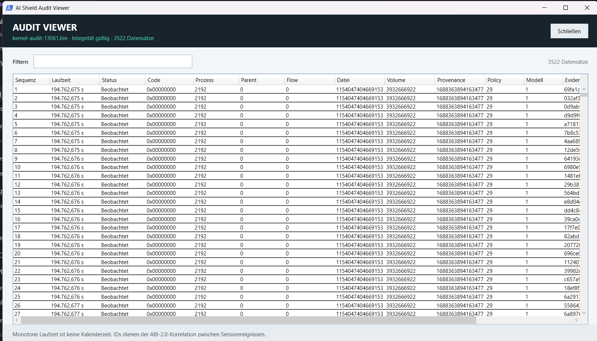

# AI Shield Audit Viewer

Stand: 13. Juli 2026

## Warum die Exportdateien binär sind

Die `.bin`-Dateien enthalten das authentisierte Format `AISHAD02`. Binärspeicherung erhält feste
Feldgrößen, Hashketten und eine deterministische Offlineprüfung. Das Exportmanifest beschreibt das
Paket; es ersetzt nicht die enthaltenen Auditdatensätze.

## Anzeige in Private Desktop

1. UI als Administrator starten und **Audit** öffnen.
2. Für eine lokale Datei eine Zeile auswählen und **Audit anzeigen** wählen.
3. Für einen Export **Exportierte Datei öffnen** wählen und eine `.bin`-Datei auswählen.
4. Über das Filterfeld nach Status, Grundmaske, IDs, Policy, Modell oder Evidenzhash suchen.

Der Viewer prüft die Datei vor der Anzeige. Beschädigte, unbekannte oder ältere Formate werden
abgelehnt. Angezeigt werden:



| Feld | Bedeutung |
|---|---|
| Sequenz | monotone Reihenfolge im Audit |
| Laufzeit | monotone Zeit seit Laufzeitbeginn, keine Kalenderzeit |
| Status | beobachtet oder aufgrund einer Grundmaske blockiert |
| Grund | hexadezimale `reason_mask` für die technische Entscheidung |
| Name | aktuell zu dieser PID aufgelöster Windows-Prozessname oder `Nicht mehr aktiv` |
| PID/Parent-PID | korrelierte Prozessidentitäten; für historische Auswertung maßgeblich |
| Flow/Datei/Volume/Provenance | End-to-End-Korrelation der beobachteten Objekte |
| Policy/Modell | aktive Runtime-Versionen der Entscheidung |
| Evidenz | SHA-256 der entscheidungsrelevanten Evidenz |

## Kommandozeile

Integrität prüfen:

```powershell
build_vs\Release\ai_shield_diag.exe audit-verify `
  "C:\ProgramData\AIShield\audit\kernel-audit-1.bin"
```

Als JSON dekodieren:

```powershell
build_vs\Release\ai_shield_diag.exe audit-dump-json `
  "C:\ProgramData\AIShield\audit\kernel-audit-1.bin" |
  Set-Content -Encoding utf8 .\audit-readable.json
```

Das Ergebnis verwendet Schema `AIShieldAuditView/1` und enthält `integrity=valid`, Segment- und
Datensatzanzahl sowie die korrelierten Datensätze. Das JSON ist eine lesbare Ableitung; die
originale `.bin`-Datei bleibt der Integritätsnachweis.

## Interpretation und Grenzen

Eine Grundmaske ist ein technischer Bitwert und nicht automatisch eine Malwareklassifikation.
`observed` bedeutet, dass kein Blockgrund in diesem Datensatz gesetzt wurde; es bedeutet nicht,
dass das Objekt allgemein vertrauenswürdig ist. Monotone Laufzeitwerte müssen für eine
Kalenderzeitdarstellung mit dem Export- oder Dienstkontext korreliert werden.

Der Prozessname wird beim Öffnen des Viewers aus der aktuellen Windows-Prozessliste ergänzt. Das
Auditformat speichert weiterhin die PID als stabile Korrelationsangabe. Bei beendeten Prozessen wird
`Nicht mehr aktiv` angezeigt; bei alten Exporten darf ein aktueller Name wegen möglicher PID-
Wiederverwendung nicht als historischer Beweis interpretiert werden.
