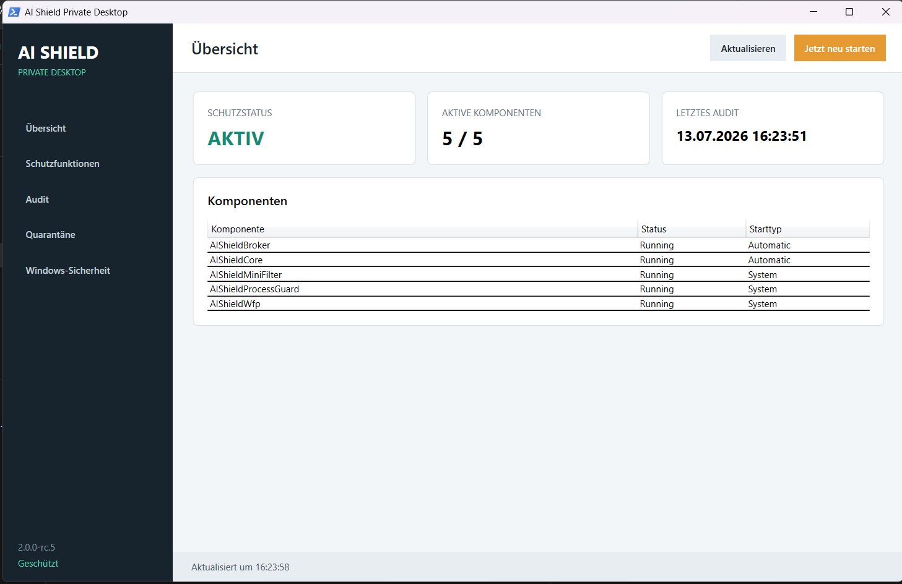
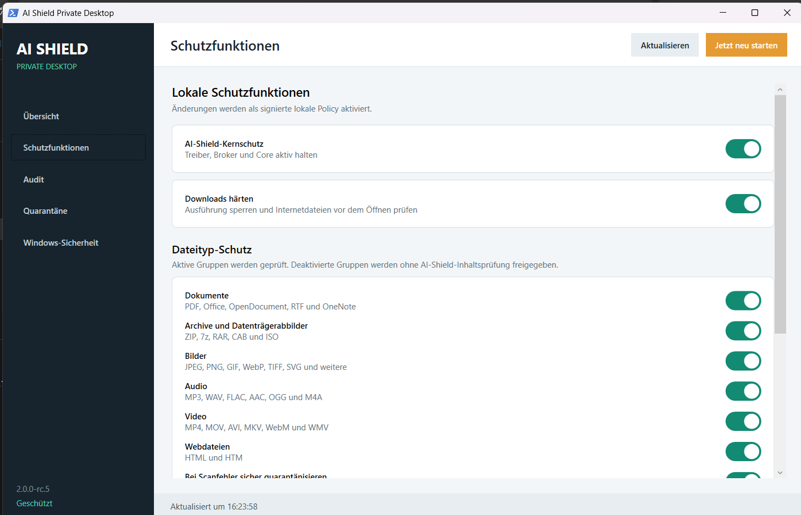
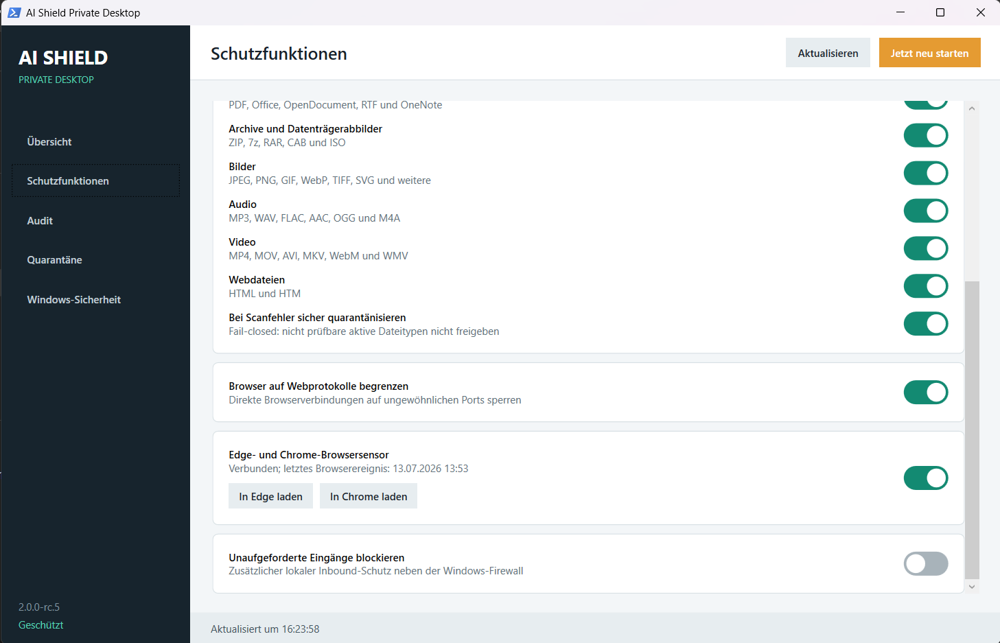
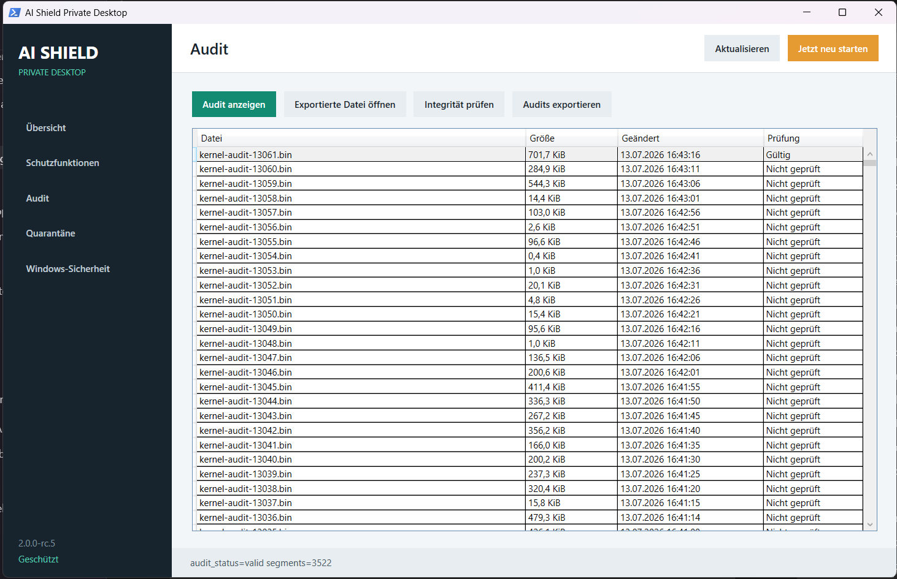
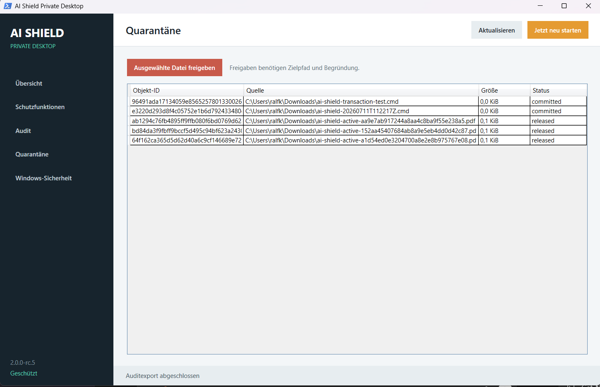
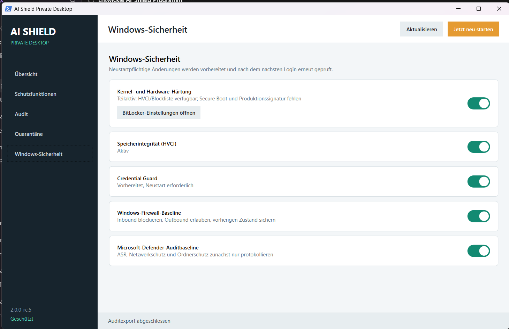

# AI Shield Private Desktop Handbuch

Stand: 14. Juli 2026, Release Candidate `2.0.0-rc.11`

## Zweck und Voraussetzungen

Private Desktop schützt einen einzelnen Windows-PC durch lokale Netzwerk-, Datei-, Prozess-,
Browser- und Windows-Härtungssensoren. Für den normalen Schutzbetrieb werden weder ein Testbackend
noch ein eigener HTTP-Listener benötigt.

Der aktuelle Prototyp verwendet lokal testsignierte Kernel-Treiber. Auf einem Testsystem müssen
daher Secure Boot im UEFI deaktiviert, `TESTSIGNING` aktiviert und Windows neu gestartet werden.
Dieser Zustand ist keine Produktionsfreigabe. Nach Microsoft-Signierung muss der Endanwenderbetrieb
mit aktivem Secure Boot und deaktiviertem Testsigning erfolgen.

## Installation und Start

Bevorzugt wird `AI_Shield_Private_Desktop.msi` mit UAC-Bestätigung installiert. Die Installation
richtet drei Treiber, `AIShieldBroker`, `AIShieldCore`, lokale Policy, Browser-Host, Startmenüeintrag,
UI und den Tray-Autostart ein. Der Eintrag unter **Installierte Apps** führt den vollständigen
Rückbau aus.

Nach der Installation startet **AI Shield Private Desktop** über das Startmenü. Die notwendige
Administratorbestätigung bleibt sichtbar; die PowerShell-Konsole läuft anschließend verborgen im
Hintergrund. Ein erforderlicher Neustart wird in der UI angeboten. Nach Zustimmung öffnet eine
einmalige erhöhte Anmeldeaufgabe die UI nach der Anmeldung erneut und liest den wirksamen Zustand.

Die fünf Schutzkomponenten starten als Windows-Dienste beziehungsweise Systemtreiber bereits beim
Booten. Die UI muss dafür nicht geöffnet bleiben. Nach jeder Benutzeranmeldung erscheint zusätzlich
der AI-Shield-Tray-Agent im Windows-Infobereich. Ein Doppelklick öffnet die UI. Das Kontextmenü zeigt
den Komponentenstatus, kann die Dienste nach UAC-Bestätigung neu starten und öffnet bei Bedarf
`services.msc`. Das Beenden des Tray-Agenten beendet ausdrücklich nicht den Schutzkern. Der Schalter
**AI Shield im Infobereich** aktiviert oder entfernt nur diesen Anmeldeautostart.

Wird das UI-Fenster minimiert oder über `X` geschlossen, verschwindet es aus der Taskleiste und
bleibt ausschließlich über das Tray-Symbol erreichbar. Ein Doppelklick stellt dieselbe UI-Instanz
wieder her; die Schutzdienste laufen währenddessen unverändert weiter.

## Übersicht



Die Übersicht zeigt den Zustand der drei Kernel-Treiber sowie von Broker und Core. **5 / 5** und
**AKTIV** bedeuten, dass alle fünf Komponenten laufen; dies ist keine Aussage, dass externe
Qualifikationsnachweise oder Microsoft-Signierung bereits abgeschlossen sind.

## Schutzfunktionen



Der Kernschutz aktiviert die signierte lokale Enforcement-Policy. Weitere Schalter steuern
Downloadhärtung, Browserports und unerwartete eingehende Verbindungen. Strenge Regeln können VPNs,
Spiele, lokale Entwicklungsdienste oder Installer beeinträchtigen und sollten einzeln aktiviert
und geprüft werden.

### Dateityp-Schutz



Dokumente, Archive, Bilder, Audio, Video, Webdateien, Programme/Installer, Windows-Skripte,
Entwickler-/Shell-Skripte sowie Verknüpfungen/Systemaktionen können separat geprüft oder
freigegeben werden. Die Ausführungsgruppen erfassen insbesondere `EXE`, `MSI`, `MSIX`, `APPX`,
`BAT`, `CMD`, `PS1`, `PSM1`, `VBS`, `JS`, `WSF`, `HTA`, `SH`, `PY`, `JAR`, `LNK`, `URL`, `REG`,
`INF` und `CHM`. Die Einstellung wird atomar und DPAPI-Machine-geschützt gespeichert und vom
Broker ohne Neustart neu geladen. Alte Policy-v1-/v2-Daten werden automatisch nach v3 migriert und
aktivieren beim Upgrade die neuen Ausführungsgruppen sowie die Freigabeschranke.

Neu angelegte Downloads mit Mark-of-the-Web werden an eine festgehaltene Dateiidentität gebunden
und in einem zeitlich begrenzten isolierten Scanner geprüft. Microsoft Defender/AMSI sowie lokale
PDF- und ZIP-Strukturprüfungen liefern die Entscheidung. Malware, aktive oder fehlerhafte PDFs,
gefährliche beziehungsweise verschlüsselte Archive und nicht prüfbare risikoreiche Formate werden
abhängig von der Policy quarantänisiert. **Freigabe vor dem Öffnen erzwingen** verschiebt auch
sauber geprüfte Dateien aktiver Gruppen in die Quarantäne. Die laufende UI meldet neue Downloads
innerhalb weniger Sekunden; auf der Seite **Quarantäne** kann der Benutzer sie mit Zielpfad und
Begründung freigeben. Ein deaktivierter Dateitypschalter bedeutet ausdrücklich: keine AI-Shield-
Inhaltsprüfung und keine Freigabeschranke für diese Gruppe.

Der eigenständige Schalter **Downloads härten** aktiviert zusätzlich die Kernel-Sperre. Sie
blockiert direkte Prozessstarts aus `Downloads` und Aufrufe heruntergeladener Dateien über
PowerShell, CMD, WSH, MSHTA, Shell-/Sprachinterpreter, Java/.NET sowie relevante Windows-
Systemlauncher. Die Dateitypschalter ersetzen diese Sperre nicht, sondern steuern die vorgelagerte
Prüfung und Quarantäne.

## Browser-Sensor

Der signierte Native-Messaging-Host unterstützt Edge und Chrome. Ohne Store- oder HTTPS-
Updatequelle muss die Manifest-V3-Erweiterung einmal je Browser über **Entpackte Erweiterung laden**
bestätigt werden. Im Dateidialog ist der Ordner selbst auszuwählen, nicht `manifest.json`.

Die UI unterscheidet **Host installiert**, **Erweiterung geladen** und **Verbunden**. Übertragen
werden nur minimierte Navigations- und Downloadmetadaten; Inhalte, Formulardaten, Cookies und
vollständige URLs werden nicht protokolliert.

## Audit und Audit Viewer



Die Auditseite listet AISHAD02-Dateien. **Integrität prüfen** validiert das Format und die
kryptografische Kette. **Audit anzeigen** dekodiert das ausgewählte lokale Audit. **Exportierte
Datei öffnen** liest eine zuvor exportierte `.bin`-Datei. Der Viewer zeigt Sequenz, Laufzeit,
Beobachtet/Blockiert, Grundmaske, aktuell aufgelösten Prozessnamen, PID/Parent-PID, Flow-, Datei-, Volume- und Provenance-ID,
Policy-/Modellversion und Evidenzhash. Die Tabelle kann über alle angezeigten Felder gefiltert
werden. Details enthält [AUDIT_VIEWER_DE.md](AUDIT_VIEWER_DE.md).


## Quarantäne



Quarantänisierte Objekte werden mit Ursprung, Größe und Zustand angezeigt. Eine Freigabe verlangt
einen neuen Zielpfad und eine Begründung und wird erneut auditiert. Dateien sollten nur freigegeben
werden, wenn Herkunft und Inhalt unabhängig geklärt wurden.

## Wiederherstellung bei Verschlüsselungs- oder Löschserien

Die Ansicht **Wiederherstellung** zeigt Größe und letzte Baseline des Versionsspeichers sowie
erkannte Vorfälle. **Jetzt sichern** legt bewusst einen neuen bekannten Stand an.
**Veränderungen prüfen** vergleicht die persönlichen Ordner mit der Baseline.
**Wiederherstellungsplan** ist eine Vorschau und verändert noch nichts. Die Rücksicherung verlangt
eine weitere Bestätigung und bewahrt den aktuell veränderten Stand im Konfliktspeicher auf.
**Extern sichern** gehört auf ein getrenntes oder unveränderliches Ziel.

Die Installation erstellt eine Baseline nur, wenn noch keine vorhanden ist. Systemdateien werden im
laufenden Windows nicht automatisch zurückgeschrieben. Details stehen in
[Ransomware-Schutz und Wiederherstellung](RANSOMWARE_SCHUTZ_UND_RECOVERY_DE.md).

Beim ersten interaktiven Start kann diese Baseline mehrere Minuten benötigen. Die Dauer hängt von
Anzahl und Größe der Dateien ab. AI Shield folgt dabei keinen Junctions oder symbolischen Links und
verlässt die geschützten Benutzerordner nicht. Auf dem Referenzrechner wurden `13.353` Dateien ohne
Überspringen versioniert. Ein bereits veröffentlichter Snapshot wird bei normalen UI-Starts nicht
erneut erzeugt.

## Windows-Sicherheit



Die UI verwaltet HVCI, Credential Guard, Firewall- und Defender-Auditbaseline transaktional. Sie
deaktiviert keine Einstellung, die sie nicht selbst aktiviert hat. BitLocker bleibt ein Assistent,
bis ein externer Wiederherstellungsschlüssel geprüft wurde. Secure Launch und DMA-Schutz sind von
Hardware, TPM und Secure Boot abhängig.

## Deinstallation und Rückkehr zum normalen Bootmodell

Nach vollständiger Deinstallation des Prototyps kann Testsigning in einer erhöhten PowerShell
deaktiviert werden:

```powershell
bcdedit.exe /set testsigning off
Restart-Computer
```

Danach Secure Boot im UEFI wieder aktivieren und mit `Confirm-SecureBootUEFI` prüfen. Audit- und
Quarantänedaten bleiben standardmäßig erhalten, damit eine unbeabsichtigte Beweislöschung vermieden
wird.
