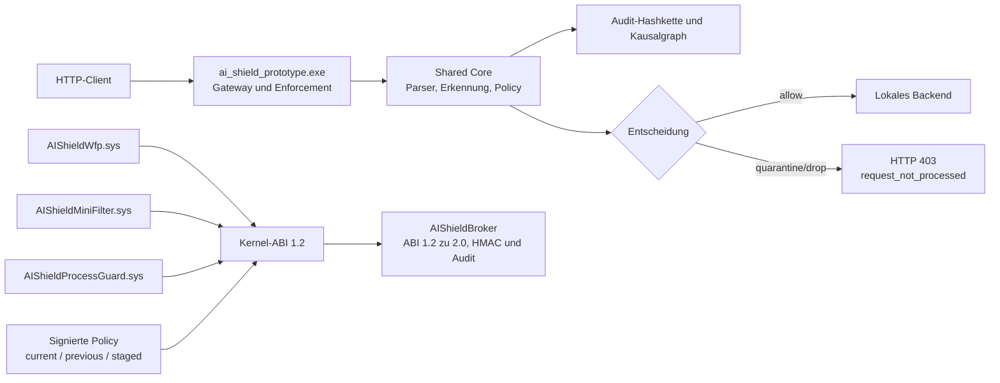

# AI Shield: Entwickler- und Betriebshandbuch des Windows-Prototyps

Stand: 13. Juli 2026

## 1. Ziel und Status

AI Shield ist ein in C++23 entwickelter Sicherheitsprototyp. Er untersucht eingehende Daten,
erzeugt reproduzierbare Risikoentscheidungen und kann riskante HTTP-Anfragen vor einem lokalen
Backend abweisen. Ergänzend enthält das Projekt drei ladbare Windows-Kernelmodule für Dual-Stack-
Netzwerk-Enforcement, Dateisystemkontrolle und Prozessbeobachtung.

Der aktuell praktisch nutzbare End-to-End-Pfad ist ein lokales HTTP-Gateway:

```text
Client -> Zielport 18081 -> WFP Redirect -> AI Shield 18080 -> Backend 18081
```

Eine normale Anfrage wird analysiert und weitergeleitet. Eine erkannte Path-Traversal-Anfrage wie
`/../../secret` wird vor dem Backend mit HTTP 403 und `request_not_processed` beendet.

### Reifegrad und Sicherheitsgrenze

Dies ist ein Forschungs- und Entwicklungsprototyp, kein produktionsfertiges Endpoint-Protection-
Produkt. Das Gateway führt die reale HTTP-Entscheidung und Blockierung aus. Die drei Treiber sind
reale, signierte und vom Kernel geladene `.sys`-Module mit gemeinsamem IOCTL-ABI 1.2:

- `AIShieldWfp.sys` registriert dynamische IPv4- und IPv6-Callouts für Auth Connect,
  Receive/Accept und Connect Redirect. Er kann einen ausdrücklich konfigurierten Backend-Port
  transparent zum lokalen Proxy umleiten oder einen einzelnen Eingangsport blockieren.
- `AIShieldMiniFilter.sys` kontrolliert `IRP_MJ_CREATE`, liefert Audit-Zähler und verhindert im
  Enforcement-Modus ausführende Opens aus Pfaden mit `AI_Shield_Quarantine`.
- `AIShieldProcessGuard.sys` registriert `PsSetCreateProcessNotifyRoutineEx`, liefert
  Prozess-Telemetrie und besitzt dieselbe Quarantäne-Ausführungsregel als zweite Schutzebene.

Alle Treiber sind als `SYSTEM_START` konfiguriert. Der verzögert automatisch startende Dienst
`AIShieldBroker` hängt explizit von allen drei Treibern ab, liest ihre begrenzten und sequenzierten
Ereignisqueues, übersetzt Kernel-ABI 1.2 an der Plattformgrenze auf das interne ABI 2.0 und schreibt
erst nach Größen-, Sequenz-, Zeit- und HMAC-Prüfung verifizierbare Auditsegmente. Enforcement wird im normalen Betrieb nur
über eine RSA-signierte, monotone Policy aktiviert. Bei einer fehlerhaften Aktivierung wird die
zuletzt gültige Policy automatisch wiederhergestellt.

Secure Boot sollte nur auf einem isolierten Entwicklungsrechner oder einer Test-VM deaktiviert
werden. Für eine produktive Auslieferung müssen die Treiber über Microsoft signiert werden; lokales
Testsigning ist kein Produktionsmodell.

## 2. Architektur



### Wichtige Komponenten

| Komponente | Aufgabe |
|---|---|
| `ai_shield_core` | Plattformneutraler Parser-, Erkennungs-, Policy-, Audit- und Provenance-Kern |
| `ai_shield_prototype.exe` | Lokaler HTTP-Listener, Analyse, Blockierung und Backend-Weiterleitung |
| `ai_shield_driverctl.exe` | Installation und Steuerung der drei Windows-Treiberdienste |
| `ai_shield_diag.exe` | Diagnose und Audit-Prüfung |
| `ai_shield_replay.exe` | Deterministisches Wiedergeben gespeicherter Szenarien |
| `AIShieldWfp.sys` | IPv4-/IPv6-ALE-Telemetrie, Portblock und transparenter Redirect |
| `AIShieldMiniFilter.sys` | Datei-Telemetrie und Quarantäne-Execute-Gate |
| `AIShieldProcessGuard.sys` | Prozess-Telemetrie und Quarantäne-Prozess-Gate |
| `ai_shield_kernelctl.exe` | gemeinsame Policy-Aktivierung und Kernelzähler für alle drei Treiber |
| `ai_shield_broker.exe` | LocalSystem-Dienst für ABI-2.0-Übersetzung, HMAC-/Sequenzprüfung und persistente Auditsegmente |
| `ai_shield_service.exe` | LocalSystem-Orchestrator für Health, Backoff, Safe Mode und Event-Log-Meldungen |
| `platform/windows/policy/ai_shield_policy.ps1` | RSA-Signierung, Anti-Replay, atomare Aktivierung und Recovery |

Der Broker übernimmt zusätzlich automatische Provenance-Klassifizierung für neue Dateien in
Benutzer-Downloads und Temp-Verzeichnissen. Er verarbeitet nur stabile Dateien mit Mark-of-the-Web
`ZoneId=3` oder `ZoneId=4` und ausführbarer beziehungsweise skriptfähiger Erweiterung. Eingebettet
vertrauenswürdig signierte Dateien werden protokolliert und belassen; nicht vertrauenswürdige
Dateien werden SHA-256-adressiert nach `C:\ProgramData\AIShield\quarantine\objects` verschoben.
Intent und Commit werden jeweils mit Write-Through journalisiert.

Seit dem Pilot-Hardening hält der Broker ein exklusiv gegen Schreiben und Umbenennen geschütztes
Datei-Handle während Identitätsprüfung, Hash, Signaturprüfung und Quarantäneverschiebung. Dateien mit
Reparse Point, mehreren Hardlinks, unbekannten Streams oder anderem Zielvolume werden nicht automatisch
verschoben. Die Umbenennung erfolgt relativ zum geöffneten Quarantäneverzeichnis per Handle.

Der interne Runtime-State liegt nicht mehr als rohe Schlüsseldatei vor. Windows DPAPI schützt
Kanalschlüssel, Schlüsselgeneration sowie Policy- und Modellversion maschinengebunden. Primär- und
Recovery-Slot erlauben Wiederherstellung; sind beide ungültig, startet der Broker fail-closed.

## 2.1 Core-Orchestrator und Administration

Installation in einer administrativen PowerShell:

```powershell
powershell -ExecutionPolicy Bypass -File platform\windows\installer\install_core_service.ps1
```

Status und administrative Operationen:

```powershell
powershell -ExecutionPolicy Bypass -File platform\windows\admin\ai_shield_admin.ps1 -Action health
powershell -ExecutionPolicy Bypass -File platform\windows\admin\ai_shield_admin.ps1 -Action runtime-status
powershell -ExecutionPolicy Bypass -File platform\windows\admin\ai_shield_admin.ps1 -Action rotate-key
powershell -ExecutionPolicy Bypass -File platform\windows\admin\ai_shield_admin.ps1 `
  -Action audit-export -OutputDirectory D:\AIShieldExports
```

`AIShieldCore` überwacht die drei Treiber und den Broker. Wiederholte Fehler führen nach begrenztem,
exponentiellem Neustart-Backoff in einen Audit-only Safe Mode. Der Zustand steht unter
`C:\ProgramData\AIShield\health.json`; Übergänge werden in das Windows Event Log geschrieben.

Eine Quarantänefreigabe benötigt Objekt-ID, neues Ziel und dokumentierten Grund:

```powershell
powershell -ExecutionPolicy Bypass -File platform\windows\admin\ai_shield_admin.ps1 `
  -Action quarantine-release -ObjectId <64-HEX> -Destination C:\Recovery\file.exe `
  -Reason "Vom SOC nach Analyse freigegeben"
```

## 2.2 Binärupdate und Deinstallation

Produktpakete verwenden `AIShieldUpdate/2`, eine detached CMS-Signatur `manifest.p7s`, einen
Publisher-Pin, Authenticode und SHA-256 pro Datei. Aktivierung erfolgt über A/B-Slots:

```powershell
powershell -ExecutionPolicy Bypass -File platform\windows\installer\binary_update.ps1 `
  -PackageDirectory D:\SignedPackages\AIShield-2.0
```

Eine offene Aktivierung wird beim nächsten Start über `recover_pending_update.ps1` zurückgerollt.
Die vollständige Deinstallation ist bestätigungspflichtig und bewahrt Audit-/Policy-/Quarantänedaten
standardmäßig:

```powershell
powershell -ExecutionPolicy Bypass -File platform\windows\installer\uninstall_product.ps1 `
  -Confirmation UNINSTALL-AI-SHIELD -AuditExportDirectory D:\AIShieldExports
```

Der Shared Core verarbeitet neben HTTP/1 unter anderem DNS, JSON, TLS-Metadaten, HTTP/2-Frames,
XML, ZIP, PDF und PE-Metadaten. Er enthält außerdem Risiko- und Richtlinienlogik, signaturbasierte
Erkennung, Sequenz- und Mutationsmodelle, Audit-Verkettung, Service-Identitäten, Provenance,
Backpressure, Recovery- und Release-Gates. Nicht jedes Core-Modul ist bereits in den kleinen
HTTP-Prototyp eingebunden; der Gateway-Pfad verwendet den integrierten Replay-/Analysepfad.

## 3. Entscheidungen verstehen

Das Gateway protokolliert beispielsweise:

```text
decision action=4 risk=245 reason=12 audit=1 graph=1
```

| Feld | Bedeutung im Beispiel |
|---|---|
| `action=4` | `quarantine`: Anfrage nicht an das Backend weitergeben |
| `risk=245` | aggregierter Risikowert der Analyse |
| `reason=12` | Bitmaske `0x0004 | 0x0008`: Signaturtreffer und Path Traversal |
| `audit=1` | die erzeugte Audit-Kette wurde erfolgreich verifiziert |
| `graph=1` | der erwartete Kausalpfad ist vollständig |

Die Aktionen sind: `0 allow`, `1 allow_monitored`, `2 rate_limit`, `3 redirect_sandbox`,
`4 quarantine`, `5 drop_flow`, `6 block_origin` und `7 suspend_target`.

## 4. Voraussetzungen

Benötigt werden:

- Windows 10 oder Windows 11 x64 auf einem nicht produktiven Testsystem
- Administratorrechte für Bootkonfiguration, Zertifikatsspeicher und Treiberdienste
- Visual Studio 2022 mit C++-Desktopentwicklung
- CMake unter `C:\Program Files\CMake\bin\cmake.exe`
- Windows SDK und WDK, im aktuellen Projekt gegen SDK/WDK `10.0.26100.0`
- PowerShell und optional Python 3 für das lokale Test-Backend
- deaktiviertes Secure Boot und aktivierter Windows-Testsigning-Modus für die lokalen Testtreiber

### Warum Secure Boot deaktiviert werden muss

Secure Boot schützt die Startkette und verhindert auf der getesteten Konfiguration die Änderung der
BCD-Option `TESTSIGNING`. Lokal selbstsignierte Kernelmodule werden dann mit Windows-Fehler 577
abgewiesen. Deshalb gilt für diesen Prototyp:

1. Secure Boot im UEFI/BIOS deaktivieren.
2. Windows starten und eine PowerShell als Administrator öffnen.
3. Testsigning aktivieren.
4. Windows neu starten.

Die genaue UEFI-Bedienung hängt vom Mainboard oder VM-Hypervisor ab. BitLocker kann vor einer
Firmwareänderung einen Wiederherstellungsschlüssel verlangen. Der Schlüssel muss vorab gesichert
sein. Die Änderung reduziert die Startketten-Absicherung des Rechners.

Prüfung nach dem Neustart:

```powershell
Confirm-SecureBootUEFI
bcdedit.exe /enum "{current}" | findstr /i testsigning
```

Erwartet werden `False` für Secure Boot und `testsigning Yes`. Auf BIOS-Systemen kann
`Confirm-SecureBootUEFI` statt `False` melden, dass das Cmdlet nicht unterstützt wird.

## 5. Benutzerprogramme bauen und testen

In einer normalen PowerShell:

```powershell
Set-Location D:\AI_Shield

$CMAKE_EXE = "C:\Program Files\CMake\bin\cmake.exe"
$CTEST_EXE = "C:\Program Files\CMake\bin\ctest.exe"

& $CMAKE_EXE -S . -B build_vs -G "Visual Studio 17 2022" -A x64 `
  -DAI_SHIELD_ENABLE_WINDOWS_PLATFORM=ON
& $CMAKE_EXE --build build_vs --config Release --parallel
& $CTEST_EXE --test-dir build_vs -C Release --output-on-failure
```

Ein erfolgreicher Lauf meldet zehn bestandene Tests. Die Testprogramme verwenden echte
Fehlerprüfungen und sind auch im Release-Build wirksam; sie hängen nicht von im Release-Modus
entfernten C-Assertions ab.

Vollständiger Austausch der laufenden lokalen Installation:

```powershell
powershell -ExecutionPolicy Bypass `
  -File platform\windows\installer\deploy_current_prototype.ps1
```

Der Ablauf baut und testet User Mode, baut und signiert alle drei Treiber, installiert Treiber,
Broker und Core-Orchestrator und aktiviert ohne laufendes Gateway eine neue signierte Audit-Policy.
Der zuletzt verifizierte Maschinenstatus steht in
[`AKTUELLER_INSTALLATIONSSTAND_DE.md`](AKTUELLER_INSTALLATIONSSTAND_DE.md).

## 6. Treiber bauen: `.sys` und `.inf`

Die Treiber werden absichtlich außerhalb des CMake-Builds mit WDK/MSBuild erzeugt:

```powershell
Set-Location D:\AI_Shield
powershell -ExecutionPolicy Bypass `
  -File platform\windows\build_drivers.ps1 `
  -Configuration Release
```

Der Build kompiliert drei WDK-Projekte und erstellt das Verzeichnis
`D:\AI_Shield\driver_package\Release` mit:

```text
AIShieldWfp.sys
AIShieldMiniFilter.sys
AIShieldProcessGuard.sys
ai_shield_wfp.inf
ai_shield_minifilter.inf
ai_shield_process_guard.inf
```

Eine `.sys`-Datei ist das ausführbare Kernelmodul. Eine `.inf`-Datei beschreibt Treiberklasse,
Diensttyp, Binärpfad, Startart und beim Minifilter zusätzlich Load-Order-Gruppe, Instanz und
Altitude. Das aktuelle Service-Control-Tool installiert direkt aus den `.sys`-Pfaden und bildet die
notwendigen INF-Metadaten nach. Die INF-Dateien sind zugleich die Grundlage für ein späteres
vollständiges PnP-/Katalogpaket.

Vor einem erneuten Treiber-Build sollten laufende Treiber gestoppt werden, da Windows geladene
`.sys`-Dateien sperrt:

```powershell
build_vs\Release\ai_shield_driverctl.exe stop
```

## 7. Testzertifikat und Treibersignatur

Einmalig Testsigning aktivieren, danach neu starten:

```powershell
Set-Location D:\AI_Shield
powershell -ExecutionPolicy Bypass `
  -File platform\windows\installer\enable_testsigning.ps1 `
  -State on
Restart-Computer
```

Nach dem Neustart die `.sys`-Dateien in einer administrativen PowerShell signieren:

```powershell
Set-Location D:\AI_Shield
powershell -ExecutionPolicy Bypass `
  -File platform\windows\installer\sign_driver_package.ps1 `
  -PackageDir D:\AI_Shield\driver_package\Release
```

Das Skript erzeugt oder verwendet das Zertifikat `AI Shield Prototype Test Signing`, importiert
seinen öffentlichen Teil in `LocalMachine\Root` und `LocalMachine\TrustedPublisher`, signiert alle
`.sys`-Dateien mit SHA-256 und prüft anschließend jede Signatur. Neu gebaute Treiber müssen erneut
signiert werden, weil jeder Build den signierten Dateiinhalt verändern kann.

## 8. Treiber installieren, starten und prüfen

Der aktuelle WFP-Treiber arbeitet im Dual-Stack-Betrieb mit getrennten IPv4- und IPv6-Callouts und
startet immer im Auditmodus. Seine echte Callout-Telemetrie kann nach dem
Laden administrativ abgefragt werden:

```powershell
build_vs\Release\ai_shield_kernelctl.exe status
```

Portgebundenes Enforcement muss ausdrücklich bestätigt werden. Beispiel: Verbindungen, die lokal
an Port 18081 adressiert sind, transparent zum Gateway auf Port 18080 umleiten:

```powershell
build_vs\Release\ai_shield_kernelctl.exe enforce `
  --redirect-port 18081 --proxy-port 18080 `
  --exempt-pid <Gateway-PID> --confirm-enforcement
```

Zur sicheren Rückkehr in den reinen Beobachtungsmodus:

```powershell
build_vs\Release\ai_shield_kernelctl.exe audit
```

Der Ein-Klick-Starter bindet das Gateway über `localhost` gleichzeitig an `127.0.0.1` und `::1`.
Manuelle Dual-Stack-Prüfung:

```powershell
curl.exe http://127.0.0.1:18080/safe
curl.exe -g http://[::1]:18080/safe
```

`AI_Shield_Start.cmd` ermittelt die Gateway-PID automatisch, nimmt ausschließlich diesen Prozess
von der Redirect-Regel aus und aktiviert zusätzlich das Datei-/Prozess-Enforcement für Pfade mit
dem Segment `AI_Shield_Quarantine`. Der Starter erzeugt den Ordner
`D:\AI_Shield\AI_Shield_Quarantine`. Ausführungsversuche daraus werden bereits beim Datei-Open und
zusätzlich beim Prozessstart kontrolliert. Eine automatische Verschiebung verdächtiger Dateien in
diesen Ordner ist noch nicht Teil dieses Prototyps.

Installation und Start erfolgen in einer PowerShell als Administrator:

```powershell
Set-Location D:\AI_Shield
powershell -ExecutionPolicy Bypass `
  -File platform\windows\installer\install_drivers.ps1 `
  -PackageDir D:\AI_Shield\driver_package\Release

build_vs\Release\ai_shield_driverctl.exe status
```

`state=4` bedeutet `SERVICE_RUNNING`, `win32_exit=0` bedeutet fehlerfreier Start:

```text
AIShieldWfp: state=4 win32_exit=0
AIShieldMiniFilter: state=4 win32_exit=0
AIShieldProcessGuard: state=4 win32_exit=0
```

Zusätzliche administrative Prüfung:

```powershell
fltmc.exe filters | findstr /i AIShield
fltmc.exe instances AIShieldMiniFilter
sc.exe query AIShieldWfp
sc.exe query AIShieldMiniFilter
sc.exe query AIShieldProcessGuard
```

## 9. Vollständiger Prototypstart in drei PowerShell-Fenstern

### Ein-Klick-Start

Nach dem einmaligen Build, Testsigning und der Treiberinstallation stehen im Projektstamm drei
Starter zur Verfügung:

```text
AI_Shield_Start.cmd       Treiber plus Gateway für Backend 127.0.0.1:18081
AI_Shield_Start_Demo.cmd  Treiber plus Gateway im integrierten Demo-Modus
AI_Shield_Stop.cmd        Gateway und alle drei Treiber stoppen
```

Der Starter fordert bei Bedarf automatisch Administratorrechte an. Er prüft Backend und Ports,
installiert fehlende Treiberdienste aus `driver_package\Release`, startet die Treiber, verlangt für
alle drei `state=4`, setzt zunächst Audit, startet das Gateway verborgen und aktiviert erst danach
die PID-abgesicherte WFP-Umleitung sowie das Quarantäne-Enforcement. Laufzeitdateien und Logs liegen
unter `runtime`. Die Umleitung gilt ausschließlich für den konfigurierten Backend-Port 18081;
anderer Desktopverkehr bleibt unverändert.

Das Backend muss vor `AI_Shield_Start.cmd` laufen. Für einen Test ohne Backend genügt ein Doppelklick
auf `AI_Shield_Start_Demo.cmd`.

Die Ports haben unterschiedliche Rollen:

- `18081`: internes Backend, nur an `127.0.0.1` gebunden
- `18080`: geschützter AI-Shield-Eingang, den der Client verwendet

Port 8080 wird bewusst nicht verwendet, weil auf dem getesteten Rechner dort EnterpriseDB läuft.
Ein belegter Port ist nicht durch AI Shield blockiert; zwei Prozesse können lediglich nicht denselben
Listener-Port gleichzeitig belegen.

### Fenster 1: isoliertes Backend

Nie `python -m http.server` direkt im Projektstamm starten, da sonst Quellcode und Build-Artefakte
abrufbar werden. Stattdessen:

```powershell
Set-Location D:\AI_Shield
New-Item -ItemType Directory -Force test_backend
Set-Content test_backend\index.html "<h1>AI Shield Backend aktiv</h1>"
python -m http.server 18081 --bind 127.0.0.1 `
  --directory D:\AI_Shield\test_backend
```

### Fenster 2: AI-Shield-Gateway

```powershell
Set-Location D:\AI_Shield
build_vs\Release\ai_shield_prototype.exe `
  --listen 127.0.0.1:18080 `
  --backend 127.0.0.1:18081
```

### Fenster 3: Funktionstest

```powershell
Set-Location D:\AI_Shield
curl.exe http://127.0.0.1:18080/
curl.exe --path-as-is http://127.0.0.1:18080/../../secret
build_vs\Release\ai_shield_driverctl.exe status
```

`--path-as-is` ist erforderlich, weil curl den Pfad andernfalls vor dem Versand normalisieren kann.

## 10. Vollständige Ergebnisse der drei PowerShell-Fenster

Die folgenden Protokolle stammen aus dem erfolgreichen End-to-End-Lauf vom 11. Juli 2026.

### Ergebnis Fenster 1: Backend

```text
PS D:\AI_Shield> Set-Location D:\AI_Shield
PS D:\AI_Shield> New-Item -ItemType Directory -Force test_backend

    Directory: D:\AI_Shield

Mode                 LastWriteTime         Length Name
----                 -------------         ------ ----
d----          11.07.2026    10:52                test_backend

PS D:\AI_Shield> Set-Content test_backend\index.html "<h1>AI Shield Backend aktiv</h1>"
PS D:\AI_Shield>
PS D:\AI_Shield> python -m http.server 18081 `
>>   --bind 127.0.0.1 `
>>   --directory D:\AI_Shield\test_backend
Serving HTTP on 127.0.0.1 port 18081 (http://127.0.0.1:18081/) ...
127.0.0.1 - - [11/Jul/2026 10:53:07] "GET / HTTP/1.1" 200 -
```

### Ergebnis Fenster 2: Gateway

```text
PS D:\AI_Shield> build_vs\Release\ai_shield_prototype.exe `
>>   --listen 127.0.0.1:18080 `
>>   --backend 127.0.0.1:18081
ai_shield_prototype listening on 127.0.0.1:18080 forwarding to 127.0.0.1:18081
decision action=0 risk=0 reason=0 audit=1 graph=1
decision action=4 risk=245 reason=12 audit=1 graph=1
```

### Ergebnis Fenster 3: Client und Treiberstatus

```text
PS D:\AI_Shield> curl.exe http://127.0.0.1:18080/
<h1>AI Shield Backend aktiv</h1>
PS D:\AI_Shield> curl.exe --path-as-is http://127.0.0.1:18080/../../secret
request_not_processed
PS D:\AI_Shield> build_vs\Release\ai_shield_driverctl.exe status
AIShieldWfp: state=4 win32_exit=0
AIShieldMiniFilter: state=4 win32_exit=0
AIShieldProcessGuard: state=4 win32_exit=0
PS D:\AI_Shield>
```

Diese Ergebnisse beweisen für den Prototyp: Das Backend antwortet, der Gateway-Pfad leitet erlaubte
Anfragen weiter, der Angriff erreicht das Backend nicht und alle drei Kernelmodule sind geladen.

## 11. Neueste PowerShell-Ergebnisse: Kernel-Enforcement

Die folgenden Ausgaben stammen aus dem integrierten Lauf nach Einführung von ABI 1.2,
Dual-Stack-WFP, Minifilter- und ProcessGuard-Kanälen.

### Treiberpaket, Signierung und Installation

```text
package updated: AIShieldMiniFilter.sys
package updated: AIShieldProcessGuard.sys
package updated: AIShieldWfp.sys
driver package: D:\AI_Shield\driver_package\Release
Successfully verified: D:\AI_Shield\driver_package\Release\AIShieldMiniFilter.sys
Successfully verified: D:\AI_Shield\driver_package\Release\AIShieldProcessGuard.sys
Successfully verified: D:\AI_Shield\driver_package\Release\AIShieldWfp.sys
signed package: D:\AI_Shield\driver_package\Release
certificate thumbprint: 125D756E7666534CDF4558A2B9E96E96907B3FFC
AIShieldWfp already installed
AIShieldMiniFilter already installed
AIShieldProcessGuard already installed
started AIShieldWfp
started AIShieldMiniFilter
started AIShieldProcessGuard
audit policy active on all kernel sensors
AIShieldWfp: state=4 win32_exit=0
AIShieldMiniFilter: state=4 win32_exit=0
AIShieldProcessGuard: state=4 win32_exit=0
wfp mode=audit observed=0 allowed=0 blocked=0 redirected=0 telemetry_dropped=0
minifilter mode=audit observed=338 allowed=338 blocked=0 redirected=0 telemetry_dropped=0
process_guard mode=audit observed=3 allowed=3 blocked=0 redirected=0 telemetry_dropped=0
```

### Transparente IPv4-/IPv6-Umleitung

Der Client verwendete direkt den ursprünglichen Backend-Port 18081. WFP leitete beide
Adressfamilien ohne Client-Proxykonfiguration zum Gateway um:

```text
PS D:\AI_Shield> build_vs\Release\ai_shield_kernelctl.exe enforce --redirect-port 18081 --proxy-port 18080 --exempt-pid 13456 --block-quarantine-execution --confirm-enforcement
enforcement policy active on all kernel sensors

PS D:\AI_Shield> curl.exe http://127.0.0.1:18081/
<h1>AI Shield Backend aktiv</h1>

PS D:\AI_Shield> curl.exe -g http://[::1]:18081/
<h1>AI Shield Backend aktiv</h1>

PS D:\AI_Shield> curl.exe --path-as-is http://127.0.0.1:18081/../../secret
request_not_processed

PS D:\AI_Shield> build_vs\Release\ai_shield_kernelctl.exe status
wfp mode=enforce observed=30 allowed=22 blocked=0 redirected=3 telemetry_dropped=0
minifilter mode=enforce observed=32909 allowed=32909 blocked=0 redirected=0 telemetry_dropped=0
process_guard mode=enforce observed=39 allowed=39 blocked=0 redirected=0 telemetry_dropped=0
```

### Quarantäne-Ausführungsschutz

Eine harmlose Kopie von `whoami.exe` wurde aus einem Pfad mit `AI_Shield_Quarantine` gestartet. Der
Minifilter stoppte den ausführenden Datei-Open, bevor ein Prozess entstehen konnte. Deshalb blieb
der ProcessGuard-Blockzähler bei diesem konkreten Test null; sein Prozesssensor war aktiv.

```text
PS D:\AI_Shield> build_vs\Release\ai_shield_kernelctl.exe enforce --block-quarantine-execution --confirm-enforcement
enforcement policy active on all kernel sensors

PS D:\AI_Shield> & $env:TEMP\AI_Shield_Quarantine\whoami.exe
Program 'whoami.exe' failed to run: Zugriff verweigert

PS D:\AI_Shield> build_vs\Release\ai_shield_kernelctl.exe status
wfp mode=enforce observed=123 allowed=112 blocked=0 redirected=0 telemetry_dropped=0
minifilter mode=enforce observed=84658 allowed=84654 blocked=4 redirected=0 telemetry_dropped=0
process_guard mode=enforce observed=87 allowed=87 blocked=0 redirected=0 telemetry_dropped=0

PS D:\AI_Shield> build_vs\Release\ai_shield_kernelctl.exe audit
audit policy active on all kernel sensors
```

Diese Ausgaben belegen echte Kerneltelemetrie, erfolgreiches Dual-Stack-Redirect und ein eng
begrenztes Datei-Enforcement. Sie belegen keinen universellen Schutz aller Ports oder Angriffsarten.

## 12. Signierte Policy, Auditdienst und Recovery

Beim ersten Ein-Klick-Start wird in `Cert:\LocalMachine\My` ein nicht exportierbarer RSA-3072-
Schlüssel erzeugt. Sein Fingerprint wird im ausschließlich für `SYSTEM` und Administratoren
zugänglichen Verzeichnis `C:\ProgramData\AIShield\policy` gepinnt. Eine Policy enthält eine
kanonische Nutzlast, den Signer-Fingerprint und eine RSA-PSS/SHA-256-Signatur.

Die Aktivierung verwendet drei persistente Slots:

- `current.aipolicy`: aktuell bestätigte Konfiguration
- `previous.aipolicy`: letzte bekannte funktionierende Konfiguration
- `staged.aipolicy`: noch nicht bestätigte Transaktion

`security_version` muss streng steigen. Wiederholung und Downgrade werden vor dem Kernelzugriff
abgewiesen. Nach Signaturprüfung wird die Policy auf alle drei Sensoren angewendet und der Zustand
aller Treiberdienste geprüft. Scheitert einer dieser Schritte, wird `current` erneut aktiviert. Ist
`current` beschädigt, wird das ebenfalls signierte `previous` verwendet. Sind beide ungültig, wird
kein fremder Inhalt geladen; das System wechselt in einen markierten Audit-Recovery-Zustand.

Status administrativ prüfen:

```powershell
powershell -ExecutionPolicy Bypass `
  -File platform\windows\policy\ai_shield_policy.ps1 `
  -Action status

Get-Service AIShieldBroker
build_vs\Release\ai_shield_driverctl.exe status
```

Verifiziertes Ergebnis:

```text
policy signature=valid security_version=5 mode=enforce
recovery_required=False last_result=active
AIShieldBroker Running Automatic
AIShieldWfp: state=4 win32_exit=0
AIShieldMiniFilter: state=4 win32_exit=0
AIShieldProcessGuard: state=4 win32_exit=0
```

Der aktuelle aktive Stand nach Erweiterung der Prozessregeln ist Policy Version 5. Konfigurierbare
ProcessGuard-Gates decken Quarantänepfade, Benutzer-Temp, Downloads, riskante PowerShell-/Script-
Host-/LOLBIN-Kommandozeilen und Office-Child-Prozesse ab. Download-Blockierung bleibt standardmäßig
aus, weil die automatische Provenance-Pipeline bereits den hochkonfidenten MOTW-Fall behandelt.

Die Negativtests wiesen eine wiederverwendete Version und eine manipulierte Hülle ab. Eine gültig
signierte, aber vom Kernel aus Sicherheitsgründen abgelehnte Enforcement-Konfiguration führte
automatisch zu `last_result=rolled-back`. In einem weiteren Test wurde `current.aipolicy`
beschädigt; `recover` stellte Version 2 aus `previous` wieder her, bevor die damalige Version 3
erneut aktiviert wurde. Der aktuelle Regelstand verwendet Version 5.

Auditsegmente liegen unter `C:\ProgramData\AIShield\audit`. Der Broker schreibt spätestens alle
fünf Sekunden oder nach 4096 Datensätzen atomar ein neues Segment. `ai_shield_diag audit-verify`
bestätigte die erzeugten Dateien mit `audit_status=valid`. Nicht erhöhte Prozesse erhalten auf
Treibergeräte, Policyzustand und Auditverzeichnis keinen Zugriff.

## 13. Demo-Modus ohne Backend

Für einen schnellen Core-Test ist kein Python-Prozess nötig:

```powershell
build_vs\Release\ai_shield_prototype.exe --listen 127.0.0.1:18080 --demo
```

Der Demo-Modus analysiert genauso, erzeugt für erlaubte Anfragen aber selbst eine Testantwort.

## 14. Stoppen, Neustarten und Entfernen

Gateway und Python-Backend werden in ihren Fenstern mit `Strg+C` beendet. Die Treiber bleiben dabei
geladen.

```powershell
# Treiber stoppen
build_vs\Release\ai_shield_driverctl.exe stop

# Treiber erneut starten
build_vs\Release\ai_shield_driverctl.exe start

# Treiber stoppen und Dienste entfernen
powershell -ExecutionPolicy Bypass `
  -File platform\windows\installer\uninstall_drivers.ps1
```

Nach Abschluss der Treiberentwicklung kann der Testmodus wieder deaktiviert werden:

```powershell
powershell -ExecutionPolicy Bypass `
  -File platform\windows\installer\enable_testsigning.ps1 `
  -State off
Restart-Computer
```

Anschließend kann Secure Boot im UEFI wieder aktiviert werden.

## 15. Fehlerdiagnose

| Symptom | Ursache | Maßnahme |
|---|---|---|
| `could not bind listener ... wsa_error=10048` | Listener-Port wird bereits verwendet | Vorhandenen Gateway-Prozess beenden oder anderen `--listen`-Port wählen |
| EnterpriseDB-Seite auf `/` | Backend-Port 8080 gehört EnterpriseDB | Eigenes Backend auf 18081 starten und `--backend 127.0.0.1:18081` verwenden |
| `backend_unavailable` | Backend läuft nicht oder falscher Port | Fenster 1 starten und Bind-Adresse/Port prüfen |
| `OpenSCManager failed error=5` | PowerShell nicht als Administrator gestartet | Administrative PowerShell verwenden |
| `StartService failed error=577` | Kernel lehnt lokale Signatur ab | Secure Boot deaktivieren, Testsigning aktivieren, neu starten und neu signieren |
| Minifilter `win32_exit=2` | Instanz-/Altitude-Registrywerte fehlen | Aktuelles `install_drivers.ps1` erneut administrativ ausführen |
| ProcessGuard `win32_exit=5` | Image ohne Integrity-Flag oder alte Binärdatei | Neu bauen, `/INTEGRITYCHECK` prüfen, Paket neu signieren und starten |
| `fltmc` meldet Zugriff verweigert | Konsole nicht erhöht | `fltmc` in administrativer PowerShell ausführen |
| Angriff wird als normale Anfrage behandelt | curl normalisiert den Pfad | `curl.exe --path-as-is ...` verwenden |
| Projektdateien erscheinen im Browser | Python-Server wurde im Projektstamm gestartet | Server stoppen und `--directory D:\AI_Shield\test_backend` verwenden |
| Policy wird als Replay abgewiesen | `security_version` ist nicht größer als der aktive Stand | Neue Policy mit monoton erhöhter Version signieren |
| `recovery_required=True` | Aktivierung wurde unterbrochen oder beide Slots sind ungültig | Administrativ `ai_shield_policy.ps1 -Action recover` ausführen und Signaturstatus prüfen |

Portbelegung untersuchen:

```powershell
Get-NetTCPConnection -State Listen |
  Sort-Object LocalPort |
  Select-Object LocalAddress, LocalPort, OwningProcess
```

Signatur prüfen:

```powershell
Get-AuthenticodeSignature D:\AI_Shield\driver_package\Release\*.sys |
  Format-Table Path, Status, StatusMessage
```

## 16. Verzeichnisorientierung für neue Entwickler

```text
include/ai_shield/               öffentliche Shared-Core-Schnittstellen
src/                             Shared-Core-Implementierungen
tests/                           Unit- und Windows-Plattformtests
tools/ai_shield_prototype/       HTTP-Gateway
tools/ai_shield_driverctl/       Treiberdienst-Steuerung
tools/ai_shield_broker/          persistenter Kernel/User-Mode-Telemetriedienst
tools/ai_shield_diag/            Diagnosewerkzeug
tools/ai_shield_replay/          Replay-Werkzeug
platform/windows/wfp/            WFP-Adapter und WDK-Treiber
platform/windows/minifilter/     Minifilter-Adapter und WDK-Treiber
platform/windows/process_guard/  Prozesssensor und WDK-Treiber
platform/windows/installer/      INF-, Signatur-, Installations- und Recovery-Skripte
platform/windows/policy/         signierte Policyverwaltung und Transaktions-Recovery
driver_package/Release/          gebautes und signierbares Treiberpaket
build_vs/Release/                Benutzerprogramme und Tests
```

## 17. Empfohlener Entwicklungsablauf

1. Änderung im Shared Core oder Plattformadapter implementieren.
2. CMake-Release- und Debug-Tests ausführen.
3. Bei Treiberänderungen die Treiber stoppen, WDK-Projekte bauen und Paket neu signieren.
4. Treiber starten und Status sowie Minifilterinstanz prüfen.
5. Backend, Gateway und Client in drei Fenstern starten.
6. Erlaubte und blockierte Pfade prüfen und Gateway-Entscheidungen dokumentieren.
7. Änderungen nur mit aktualisierten Tests und ohne eingebettete Geheimnisse einchecken.

Der aktuelle Quellstand enthält inzwischen automatische Provenance-Klassifikation, handle-basierte
Quarantäne, erweiterte ProcessGuard-Regeln, CAT-/CAB- und Microsoft-Submission-Vorbereitung,
Private-Desktop-MSI, WPF-Oberfläche, Edge-/Chrome-Sensor, isolierte Download-Inhaltsprüfung und einen
AISHAD02-Audit-Viewer. Diese Funktionen sind in
[`PRIVATE_DESKTOP_HANDBUCH_DE.md`](PRIVATE_DESKTOP_HANDBUCH_DE.md) und
[`AUDIT_VIEWER_DE.md`](AUDIT_VIEWER_DE.md) dokumentiert.

Vor produktiver Nutzung fehlen weiterhin Microsoft-Produktionssignierung, reale
HVCI-/Driver-Verifier-/HLK- und Langzeitläufe auf der Zielmatrix, repräsentative Fehlalarm- und
Kompatibilitätsmessung sowie eine unabhängige Sicherheitsprüfung. Das Qualifikationsharness deckt
Last, Missbrauch, Remove/Reinstall, Broker-Recovery und eine neustartfähige SYSTEM-Fortsetzung ab;
kurze lokale Läufe ersetzen keine protokollierten 24-Stunden-/30-Tage- und Neustartnachweise.
