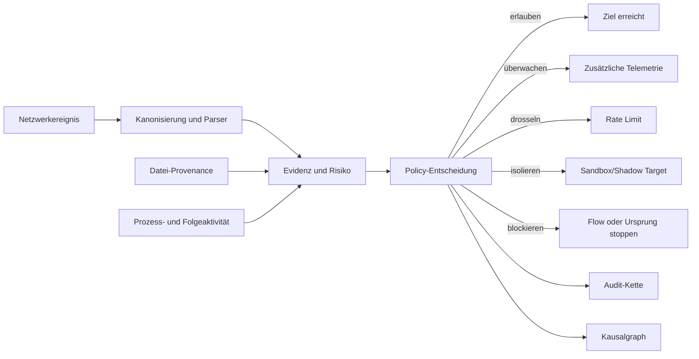

# AI Shield

## Eine verhaltens- und kausalitätsbasierte Schutzarchitektur für Windows-Desktops

Whitepaper, Stand 15. Juli 2026

## RC13: Transaktionale Rückkehr aus der Quarantäne

Die Schutzentscheidung endet nicht beim Blockieren einer Datei. Eine kontrollierte Freigabe muss
dieselbe Objektidentität erhalten, darf keine ProcessGuard-Regel umgehen und muss den Kernelzustand
atomar mit dem Benutzerzustand synchronisieren. RC13 führt diesen Rückweg als privilegierte
Transaktion aus: Die UI übergibt ID, Ziel und Begründung direkt an den Broker. Dieser verifiziert
Quarantäneobjekt, Linkanzahl, Volume- und File-ID, verschiebt write-through, prüft am Ziel erneut
dieselbe Identität und schreibt erst dann den dauerhaften Commit. Ein administrativer Minifilter-
IOCTL setzt anschließend ausschließlich diese Datei auf `clean`.

Scheitert die Kernelbestätigung, wird das Objekt in den geschützten Speicher zurückverschoben und
der Vorgang als Rollback dokumentiert. Cross-Volume-Restores werden bewusst verweigert, solange
Windows dabei keine identische File-ID garantieren kann. Damit schließt RC13 sowohl den früheren
ProcessGuard-Selbstblock als auch das Risiko, dass eine verschobene Datei im Kernel weiterhin als
quarantänisiert gilt.

## RC12: Entscheidung vor dem ersten Zugriff

RC12 schließt die zeitliche Lücke zwischen abgeschlossenem Dateischreiben und periodischer
Verzeichnisprüfung. Der Minifilter markiert externe Schreibvorgänge anhand von Volume- und File-ID
als `pending`. Beim Cleanup übermittelt er Request-ID, normalisierten NT-Pfad und Dateiidentität über
einen nur für den registrierten Broker zugänglichen Filter-Manager-Port. Der Empfangsthread
bestätigt die Warteschlangenaufnahme innerhalb einer 250-ms-Kerneldeadline. Ein separater Worker
öffnet das Objekt ohne Reparse-Auflösung, verifiziert dieselbe Identität und setzt das endgültige
Urteil per Broker-IOCTL. Fehlender Broker, Timeout, Identitätswechsel, Warteschlangenüberlauf oder
eine ungültige Antwort lassen die betroffene Datei gesperrt, ohne den Desktop-I/O-Pfad für die
Dauer der Inhaltsanalyse anzuhalten.

Die ZIP-Prüfung wertet Central Directory, lokale Header, Data Descriptor, ZIP64-Felder, UTF-8-Namen
und CRC-32 konsistent aus. Stored- und DEFLATE-Inhalte werden rekursiv analysiert. Gemeinsame Budgets
begrenzen Tiefe, Eintragszahl, Einzel- und Gesamtgröße sowie Kompressionsverhältnis. Verschlüsselung,
nicht unterstützte Methoden und Budgetüberschreitungen führen nicht zu einer Positivfreigabe.

## RC11: Dateiinhalt statt Dateiendung

RC11 führt eine universelle Preflight-Stufe vor der formatspezifischen Analyse ein. Sie vergleicht
Dateinamen, Endung und echte Magic-Signatur, erkennt Tarnung, Polyglots, eingebettete Formate,
Trailing-Data, externe Referenzen, automatische Aktionen und Befehlsindikatoren. Unbekannte oder
nicht tief interpretierbare Formate werden nicht als harmlos angenommen, sondern bleiben bei
aktiver Freigabeschranke in Quarantäne.

Analyse und Entscheidung referenzieren dasselbe gesperrte Datei-Handle. Volume-/File-ID, Größe,
Änderungszeit und SHA-256 verbinden Provenienz, Befund und Quarantäne und reduzieren damit
Race-/TOCTOU-Angriffe. Der Minimalworker läuft mit Prozess-, Speicher- und Deadline-Grenzen im
AppContainer oder einem auditierten Low-Integrity-Fallback. Der WFP-Treiber sperrt für ihn
unabhängig vom übrigen Policy-Modus alle IPv4-/IPv6-Verbindungen.

## RC10: Schutz ohne dauerhaft geöffnetes Administrationsfenster

Die Schutzwirkung hängt nicht vom sichtbaren Desktopfenster ab. WFP, Minifilter, ProcessGuard,
Broker und Core starten als Windows-Systemkomponenten. Ein schlanker Tray-Agent stellt den Zustand
im Benutzerkontext dar und öffnet die administrative Oberfläche nur bei Bedarf. Minimieren und
Schließen verbergen die UI aus der Taskleiste, lassen aber dieselbe abgesicherte Einzelinstanz und
den Schutzkern weiterlaufen. Diese Trennung reduziert unnötige privilegierte Interaktion und macht
den Prototyp für den dauerhaften Einzelplatzbetrieb bedienbarer.

## RC9: Download ist nicht gleich Vertrauen

Content-Policy v3 schloss erstmals eine praktische Lücke zwischen erfolgreichem Scan und Benutzeröffnung.
Auch ein formal sauberes Bild, Audioformat, Video oder Dokument kann einen unbekannten Parserfehler
des zugeordneten Programms erreichen. Deshalb kann die Private-Desktop-Ausgabe alle aktivierten
Dateigruppen nach dem Scan zunächst in eine TOCTOU-gehärtete Quarantäne verschieben. Die UI meldet
das neue Objekt; erst eine begründete Freigabe stellt es wieder bereit. Schadsoftware- und
Strukturbefunde bleiben von dieser neutralen Freigabewarteschlange unterscheidbar.

Diese Kontrolle ist bewusst keine Behauptung, jedes Dateiformat semantisch vollständig analysieren
zu können. Sie reduziert stattdessen die automatische Vertrauensannahme und schafft einen sichtbaren,
protokollierten Entscheidungspunkt zwischen Netzwerkherkunft und lokaler Verarbeitung.

## Systemweite Netzwerkabdeckung

Der aktuelle WFP-Sensor ist nicht auf den HTTP-Port beschraenkt. Seine ALE-Callouts erfassen
ausgehende Verbindungsaufbauten und eingehende Verbindungsannahmen fuer IPv4 und IPv6 sowie TCP und
UDP. Eine signierte Enforcement-Policy kann typische Wurm- und Lateral-Movement-Pfade sperren; ein
optionaler strenger Modus begrenzt Browser auf DNS- und Webprotokolle und blockiert unaufgeforderte
eingehende Verbindungen. Der HTTP-Gateway bleibt die Inhaltskontrolle fuer unverschluesseltes HTTP.

HTTPS und QUIC werden ohne TLS-Interception auf Flow- und Metadatenebene kontrolliert. Das System
installiert keine lokale MITM-CA und behauptet daher keine Einsicht in verschluesselte Nutzdaten.
Details, Betriebsmodi und Kompatibilitaetsfolgen stehen in `NETZWERKSCHUTZ_DE.md`.

Vor jeder systemweiten Aktivierung erfasst ein nicht-invasiver Posture-Controller den tatsaechlichen
Zustand von Secure Boot, TESTSIGNING, TPM, HVCI, Credential Guard, Defender, Firewall,
Vulnerable-Driver-Blockliste, ASR und Volumeverschluesselung. AI Shield veraendert diese kritischen
Windows-Einstellungen nicht ungefragt, sondern trennt automatische Erkennung von einer getesteten,
reversiblen Administratorfreigabe. Dadurch wird ein Sicherheitsgewinn nicht mit einem unkontrollierten
Boot- oder Anwendungsausfall erkauft.

Die Windows-Dienste laufen aus einem ACL-geschuetzten Program-Files-Verzeichnis; Kopien werden vor
Aktivierung per SHA-256 gegen den Build verifiziert und die Service-DACL trennt Statusabfrage von
Steuerungs- und Konfigurationsrechten. Eine transaktionale Defender-Auditbaseline erfasst reale
ASR-, Network-Protection-, Controlled-Folder-Access- und PUA-Telemetrie, ohne im ersten Schritt
Anwendungen zu blockieren. Backup und Rollback verhindern eine irreversible Baseline-Aktivierung.

Enterprise-Integrationen erweitern diese Grenze ohne verdeckte Inhaltsueberwachung: Der Browser
liefert minimierte Navigations- und Downloadmetadaten ueber einen publisher-gepinnten Native Host;
WEF und der PowerShell-Metadatenforwarder verlangen HTTPS-Zertifikatpins. WDAC bleibt waehrend der
Kompatibilitaetsmessung im Auditmodus. Firewall und Defender besitzen transaktionale Rollbacks,
waehrend UAC- und ASR-Komponenten nur pruefen und Empfehlungen erzeugen. Blockierende Aktivierung
bleibt dadurch eine evidenzbasierte Administratorentscheidung.

## Kurzfassung

AI Shield ist als zusätzliche Schutzschicht für Windows-Desktops konzipiert. Das System soll nicht
nur einzelne Dateien oder bekannte Schadsoftware-Signaturen bewerten, sondern den gesamten Weg
einer Aktion betrachten: Netzwerkverbindung, Protokollinhalt, übertragene Datei, gestarteter Prozess,
Folgeverhalten und daraus entstehende Auswirkungen.

Der Leitgedanke lautet: Moderne Angriffe sind selten ein einzelnes bösartiges Objekt. Sie sind eine
Kette scheinbar legitimer Einzelschritte. Ein Browser lädt Inhalt, ein Benutzer führt einen Befehl
aus, ein Windows-Werkzeug lädt weitere Daten, ein Prozess erzeugt eine Datei, und diese Datei startet
einen weiteren Prozess. Jeder Schritt für sich kann unauffällig wirken. Erst der Zusammenhang zeigt
die Angriffsabsicht.

AI Shield soll diese Zusammenhänge in einem einheitlichen Entscheidungsmodell erfassen. Dafür
verbindet die Architektur Netzwerk-, Datei- und Prozesssensoren mit Protokollparsern,
Risikoanalyse, Richtlinien, einer manipulationssichtbaren Audit-Kette und einem Kausalgraphen. Der
aktuelle Windows-Prototyp demonstriert diesen Ansatz bereits für HTTP-Verkehr: Sichere Anfragen
werden an ein lokales Backend weitergeleitet, während eine Path-Traversal-Anfrage erkannt und vor
dem Zielsystem blockiert wird. Drei reale Windows-Kernelmodule lassen sich zusätzlich bauen,
signieren, installieren und laden. Inzwischen sind alle drei über ein gemeinsames, versioniertes
Kernel/User-Mode-ABI angebunden. Der WFP-Treiber setzt portgebundene Dual-Stack-Umleitung durch;
Minifilter und ProcessGuard kontrollieren Ausführung aus einem expliziten Quarantänepfad. An der
Kernel/User-Mode-Grenze bleibt das kompatible Treiberprotokoll ABI 1.2 bestehen; der Broker übersetzt
jedes validierte Ereignis in den internen ABI-2.0-Vertrag und authentisiert es mit HMAC-SHA-256.
Parserprozesse können als AppContainer gestartet und vor ihrer Freigabe durch Job-Object-Grenzen für
Speicher, Prozessanzahl und Lebenszyklus eingeschränkt werden.

Der aktuelle Hardening-Stand führt diese Verträge durch den gesamten forensischen Pfad. Datei- und
Volume-Identität, Provenance, Prozessbeziehungen sowie Policy- und Modellversion bleiben im
versionierten Auditcontainer `AISHAD02`, im Incident-Paket, im Kausalgraphen und im Replay erhalten.
Maschinengebundener DPAPI-Schutz ersetzt die frühere rohe Kanalschlüsseldatei; Rotation und Recovery
sind transaktional. Ein eigener Core-Orchestrator überwacht Kernel- und User-Mode-Komponenten und
reduziert Enforcement bei wiederholten Integritätsfehlern kontrolliert auf einen sichtbaren Safe Mode.

Der integrierte Stand wurde anschließend praktisch ausgerollt: alle drei neu gebauten und lokal
test-signierten Kernelmodule laufen, `AIShieldBroker` und `AIShieldCore` sind als automatische
LocalSystem-Dienste aktiv, der DPAPI-Runtime-State trägt Policyversion 7 und Modellversion 1. Der
Orchestrator meldet keinen Safe Mode, keine ungesunde Komponente und ein schreibbares Auditvolume.
Dieser Nachweis bestätigt den lokalen Prototypbetrieb, ersetzt aber weder Microsoft-Signierung noch
HLK-, Secure-Boot-, HVCI- oder Langzeitqualifikation.

Die Schutzabdeckung umfasst außerdem ETW- und AMSI-Adapter im ABI-2.0-Vertrag,
IPv6-Extension-/Fragment- und ICMPv6-Metadaten sowie QUIC-Long-Header. ProcessGuard bewertet
zusätzliche Credential-Access- und Persistence-Kombinationen. Riskante Parser laufen über einen
begrenzten AppContainer-Pool mit isoliertem Result-Kanal und Deadline-Wächter. Optional bindet ein
nicht exportierbarer Schlüssel des Microsoft Platform Crypto Providers den Trust Anchor an das TPM.
Für den Betrieb stehen CEF-, LEEF- und JSON-SIEM-Ausgaben, Dual-Stack-Syslog und eine erhöhte,
loopback-only SOC-Konsole zur Verfügung.

## 1. Das Problem: Schutz vor Angriffsketten statt nur vor Dateien

Klassischer Endgeräteschutz prüft häufig bekannte Dateimuster, Reputation, Prozessmerkmale oder
einzelne Netzwerkziele. Diese Kontrollen bleiben wichtig, decken aber nicht jede moderne Angriffskette
ab. Angreifer nutzen zunehmend legitime Betriebssystemwerkzeuge, verschleierte Skripte, kurzlebige
Infrastruktur und Benutzerinteraktion. Dadurch kann eine Aktivität in einer einzelnen Sensordomäne
harmlos erscheinen.

Microsoft beschreibt ClickFix-Kampagnen, bei denen Benutzer durch gefälschte CAPTCHA- oder
Fehlermeldungen zum Ausführen kopierter Befehle in Run, Terminal oder PowerShell gebracht werden.
Dabei werden legitime Windows-Komponenten und Living-off-the-Land-Binaries für Download,
Ausführung und Verschleierung missbraucht. Microsoft beobachtete Anfang 2025 monatlich Tausende
betroffene Geräte sogar in Umgebungen mit EDR. Die Kampagnen lieferten unter anderem Infostealer,
Remote-Access-Tools, Loader und Rootkits. [Microsoft Threat Intelligence: ClickFix](https://www.microsoft.com/en-us/security/blog/2025/08/21/think-before-you-clickfix-analyzing-the-clickfix-social-engineering-technique/)

Eine 2026 dokumentierte Weiterentwicklung namens CrashFix kombinierte Browser-Manipulation,
Social Engineering, den Missbrauch von `finger.exe`, verschleierte PowerShell, Netzwerkabrufe,
Python-Payloads und geplante Tasks. Das Beispiel zeigt, warum Prozess-, Netzwerk- und
Folgeverhaltensdaten gemeinsam bewertet werden müssen. [Microsoft Security Research: CrashFix](https://www.microsoft.com/en-us/security/blog/2026/02/05/clickfix-variant-crashfix-deploying-python-rat-trojan/)

Auch Path Traversal ist kein theoretisches Altproblem. CISA dokumentierte 2025 eine
Ransomware-Aktivität, bei der Angreifer vermutlich eine Path-Traversal-Schwachstelle in einer
Remote-Management-Software ausnutzten. [CISA Advisory AA25-163A](https://www.cisa.gov/news-events/cybersecurity-advisories/aa25-163a)

Diese Beispiele führen zu vier Anforderungen:

1. Schutz muss mehrere Stationen einer Angriffskette korrelieren.
2. Entscheidungen müssen auch unbekannte Varianten anhand von Struktur und Verhalten erfassen.
3. Kritische Entscheidungen müssen schnell und möglichst nah an der jeweiligen Ressource greifen.
4. Jede Entscheidung muss später technisch nachvollziehbar sein.

## 2. Sinn und Zweck von AI Shield

AI Shield soll die Lücke zwischen punktueller Erkennung und systemweiter Kausalität schließen. Das
Projekt verfolgt fünf konkrete Ziele.

### 2.1 Angriffe vor ihrer Wirkung stoppen

Eine riskante Anfrage soll nicht erst nach einem erfolgreichen Exploit gemeldet werden. Sie soll vor
dem geschützten Dienst analysiert und bei ausreichender Evidenz verworfen, gedrosselt, isoliert oder
in eine Sandbox umgeleitet werden. Der aktuelle Gateway-Prototyp setzt dieses Prinzip für
HTTP-Anfragen bereits real um.

### 2.2 Unbekannte Varianten erkennen

Eine starre Signatur erkennt nur, was vorher beschrieben wurde. AI Shield kombiniert deshalb
Signaturen mit Protokollvalidierung, kanonischer Darstellung, statistischen Baselines,
Sequenzmodellen, Mutationsähnlichkeit und deterministischer Anomaliebewertung. Das Ziel ist nicht,
jede Abweichung zu blockieren, sondern mehrere unabhängige Evidenzen zu einer belastbaren
Risikoentscheidung zusammenzuführen.

### 2.3 Netzwerk, Datei und Prozess verbinden

Ein Download erhält eine Herkunft. Eine kopierte oder umbenannte Datei behält diese Provenance. Ein
späterer Prozessstart kann dadurch auf die ursprüngliche Netzwerkaktivität zurückgeführt werden.
Genau diese Verbindung ist für Infostealer-, Loader- und Ransomware-Ketten relevant.

### 2.4 Erklärbare Entscheidungen erzeugen

Jede Entscheidung enthält Aktion, Risikowert, Konfidenz, Reason-Bitmaske, Evidenz-Hash und
Gültigkeitsdauer. Eine kryptografisch verkettete Audit-Struktur macht nachträgliche Veränderungen
sichtbar. Der Kausalgraph beantwortet nicht nur, was blockiert wurde, sondern auch, welche
vorherigen Ereignisse zu dieser Entscheidung führten.

### 2.5 Kontrolliert ausfallen

Sicherheitssoftware kann selbst unter Last geraten oder Sensoren verlieren. AI Shield modelliert
Queue-Limits, Backpressure, Zeitüberschreitungen, Sensorzustand und dienstabhängige Fail-Policies.
Ein kritischer Dienst kann bei fehlender Entscheidungsfähigkeit anders behandelt werden als ein
unkritischer Entwicklungsdienst. Dieses Verhalten soll explizit konfiguriert und auditiert werden.

## 3. Schutzmodell



### Netzwerkebene

Der aktuelle Prototyp nutzt Windows Filtering Platform (WFP), um IPv4- und IPv6-Flows zu beobachten
und portgebundene Entscheidungen auf Netzwerkebene durchzusetzen. Er registriert dynamische
Callouts für Auth Connect, Receive/Accept und Connect Redirect. Protokollparser prüfen Struktur und Mehrdeutigkeit,
bevor nachgelagerte Anwendungen riskante Daten verarbeiten. Unterstützte Core-Analysen umfassen
HTTP/1, HTTP/2, DNS, JSON, TLS-Metadaten, XML, ZIP, PDF und PE-Metadaten.

### Dateisystemebene

Der Minifilter beobachtet Datei-Opens und blockiert im bestätigten Enforcement-Modus ausführende
Opens aus Pfaden mit `AI_Shield_Quarantine`. Im weiteren Ausbau soll er externe Herkunft vermerken und diese Information
über Kopieren oder Umbenennen hinweg erhalten. Archive können ihre Herkunft auf extrahierte Inhalte
übertragen. Dateien mit ungeklärter externer Herkunft können vor Ausführung geprüft oder
quarantänisiert werden.

### Prozessebene

Der ProcessGuard erfasst Prozessstarts über einen Kernel-Callback und besitzt dieselbe eng begrenzte
Quarantäneregel als zweite Schutzebene. Die weiterführende Policy soll dabei
Signaturzustand, Elternprozess, Dateiprovenance, Sandbox-Ergebnis und vorherige Netzwerkaktivität
berücksichtigen. Damit richtet sich das Modell insbesondere gegen Ketten, in denen legitime
Windows-Werkzeuge als Ausführungsvehikel dienen.

### Entscheidungs- und Auditebene

Die Policy kennt abgestufte Aktionen: erlauben, überwacht erlauben, drosseln, in eine Sandbox
umleiten, quarantänisieren, Flow verwerfen, Ursprung blockieren oder Zielprozess suspendieren. Die
Entscheidung entsteht deterministisch aus Evidenz und Kontext. Audit und Kausalgraph dienen
Betrieb, Forensik, Regressionstests und Governance.

## 4. Warum das Modell gegen aktuelle Windows-Angriffswege gerichtet ist

AI Shield behauptet nicht, pauschal jeden aktuellen Windows-Angriff zu verhindern. Die Architektur
ist gezielt gegen wiederkehrende technische Muster heutiger Angriffsketten ausgerichtet.

| Angriffsmuster | Geplanter Beitrag von AI Shield | Aktueller Stand |
|---|---|---|
| Path Traversal und Protokollmehrdeutigkeit | Kanonisierung, Parser-Evidenz und Blockierung vor dem Backend | Im HTTP-Prototyp funktionsfähig |
| Maliziöser Download und Loader-Kette | Netzwerkereignis mit Datei-Provenance und Prozessstart verbinden | MOTW-Klassifizierung und Quarantäne aktiv; vollständige Netz-Datei-Korrelation im Ausbau |
| PowerShell-/LOLBIN-Missbrauch | Prozesskontext, Eltern-Kind-Beziehung, Netzwerkabruf und Folgeverhalten korrelieren | konfigurierbare Kommandozeilen- und Office-Child-Gates aktiv |
| Infostealer und Datenabfluss | Egress-Gate, ungewöhnliche Sequenzen und Konsequenzsignale kombinieren | Core-Komponenten vorhanden, Gatewayintegration teilweise |
| Ransomware-Vorbereitung | externe Dateien, Prozessfolgen, Änderungsserien und Canary-Manipulation bewerten | Quarantäne, prozesskorrelierte Minifilter-Signale, Recovery-Vault, bestätigte Rücksicherung und externe Hash-Backups aktiv |
| Archive und aktive Dokumentinhalte | ZIP-Pfadflucht, Archivbomben, PDF-Aktivinhalt und PE-Anomalien prüfen | Parser-/Preflight-Core vorhanden |
| Verschleierte und mutierte Varianten | Signaturen mit N-Grammen, SimHash, Baselines und Isolation-Forest ergänzen | deterministische Core-Implementierung vorhanden |
| Sensor- oder Parserausfall | Health-Modell, Backpressure, Timeout und Fail-Policy | Core-Implementierung vorhanden |

Der besondere Nutzen liegt in der Korrelation. Ein einzelner `powershell.exe`-Start ist nicht
automatisch bösartig. Verdächtiger wird die Kette, wenn eine unbekannte externe Quelle unmittelbar
zuvor verschleierten Inhalt geliefert hat, daraus eine Datei entstanden ist, deren Provenance
ungeklärt ist, und der Prozess anschließend neue Netzwerkziele kontaktiert. AI Shield soll diese
Ereignisse nicht als isolierte Alarmflut behandeln, sondern als zusammenhängenden Vorgang.

Der Recovery-Pfad wurde zusätzlich auf einem realen Benutzerprofil ausgeführt. Die Erstbaseline
erfasste 13.353 Dateien ohne übersprungene Einträge. Eine native .NET-Verzeichnisiteration folgt
weder Junctions noch symbolischen Links und toleriert gleichzeitig verschwindende oder
unzugängliche Einträge. Ein negativer Regressionstest mit defektem Junction-Ziel verhindert, dass
diese Windows-spezifische Fehlerklasse erneut als erfolgreicher UI-Start durchrutscht.

## 5. Verbesserung des Desktop-Schutzes

### Früheres Eingreifen

Ein vorgeschalteter Gateway kann riskante Eingaben stoppen, bevor sie einen verwundbaren lokalen
Dienst erreichen. Das reduziert die Abhängigkeit davon, dass jede Anwendung jede ungewöhnliche
Eingabe korrekt verarbeitet.

### Tiefere Sichtbarkeit

WFP, Minifilter und Prozesssensor liegen an drei zentralen Übergängen eines Windows-Systems. Alle
drei liefern über ABI 1.2 neben Aggregatzählern begrenzte, sequenzierte Einzelereignisse. Der unter
`LocalSystem` betriebene Broker validiert Version, Größe, Sensoridentität und Sequenz, verwirft
inkonsistente Daten und persistiert akzeptierte Evidenz in kryptografisch verketteten Segmenten.
Die weiterführende semantische Korrelation von Kommunikation, Dateientstehung und Ausführung bleibt
ein Ausbaupunkt.

### Weniger blinde Flecken zwischen Produkten

Netzwerk-, Datei- und Prozessschutz werden häufig getrennt ausgewertet. Ein gemeinsames ABI und ein
einheitliches Evidenzmodell vermeiden Übersetzungsverluste zwischen diesen Ebenen.

### Nachvollziehbare statt rein probabilistischer Blockierung

Statistische Modelle dürfen eine Entscheidung beeinflussen, aber harte Protokollverletzungen,
Signaturtreffer, Policy-Grenzen und Reason-Codes bleiben explizit. Produktionsmodelle sind
unveränderlich registriert; unkontrolliertes Online-Lernen ist gesperrt. Dadurch sollen Drift und
nicht reproduzierbare Entscheidungen vermieden werden.

### Datenschutz und Datenminimierung

Der Core sieht Hashes, Redaktionsregeln, Retention und ausdrückliche Freigaben für Payload-Exporte
vor. Cloud-Übertragung ist optional. Ziel ist lokale Analyse mit möglichst wenig dauerhaft
gespeichertem Klartext.

## 6. Der funktionsfähige Prototyp

Der nachgewiesene End-to-End-Aufbau verwendet drei Prozesse beziehungsweise Ebenen:

```text
Client -> Backend-Port 18081 -> IPv4/IPv6 WFP Redirect -> AI Shield 18080 -> Backend 18081
```

Für eine normale Anfrage protokolliert AI Shield:

```text
decision action=0 risk=0 reason=0 audit=1 graph=1
```

Die Anfrage erreicht das Backend. Für `/../../secret` entsteht:

```text
decision action=4 risk=245 reason=12 audit=1 graph=1
```

Die Kombination `reason=12` entspricht Signaturtreffer und Path Traversal. Der Client erhält
`request_not_processed`, und das Backend sieht diese Anfrage nicht. Parallel wurden die drei
testsignierten Kernelmodule erfolgreich mit `state=4` und `win32_exit=0` geladen.

Der aktuelle Nachweis umfasst zusätzlich eine transparente IPv4- und IPv6-Umleitung mit
Proxy-PID-Ausnahme sowie eine verweigerte Testausführung aus `AI_Shield_Quarantine`. Alle drei
Treiber meldeten `state=4`, gültige Testsignaturen und aktive Kernelzähler. Dieser Nachweis belegt
noch keine vollständige systemweite Blockierung beliebiger Programme, Ports oder Protokolle.

Hinzu kommen ein automatisch startender Telemetrie-Broker und eine persistente, RSA-signierte
Policyverwaltung. Treibergeräte, Policyzustand und Auditablage sind auf `SYSTEM` und lokale
Administratoren beschränkt. Die aktive Policy verwendet eine streng steigende Security-Version;
Downgrades, Wiederholungen und veränderte Signaturhüllen wurden im Negativtest abgewiesen.

### Nachgewiesener Kernelstatus

```text
AIShieldWfp: state=4 win32_exit=0
AIShieldMiniFilter: state=4 win32_exit=0
AIShieldProcessGuard: state=4 win32_exit=0
wfp mode=enforce observed=30 allowed=22 blocked=0 redirected=3 telemetry_dropped=0
minifilter mode=enforce observed=84658 allowed=84654 blocked=4 redirected=0 telemetry_dropped=0
process_guard mode=enforce observed=87 allowed=87 blocked=0 redirected=0 telemetry_dropped=0
policy signature=valid security_version=5 mode=enforce
recovery_required=False last_result=active
AIShieldBroker Running Automatic
```

Die Zähler stammen aus zwei getrennten Abnahmetests. `redirected=3` belegt transparente sichere,
schädliche und IPv6-Testverbindungen über den Proxy. `blocked=4` belegt verweigerte ausführende
Datei-Opens im Quarantänepfad. Der ProcessGuard sah Prozessstarts, musste beim Quarantänetest aber
nicht mehr blockieren, weil der Minifilter die Ausführung früher stoppte.

### Vertrauenswürdige Policyaktivierung und Recovery

Eine Policy wird als kanonische Nutzlast mit RSA-PSS/SHA-256 signiert. Der lokale RSA-3072-
Schlüssel ist nicht exportierbar; sein Zertifikat wird über einen geschützten Fingerprint gepinnt.
Die Aktivierung arbeitet mit `staged`, `current` und `previous` und gilt erst nach erfolgreicher
Kernelanwendung und Healthcheck aller drei Treiber als abgeschlossen. Ein Fehler reaktiviert die
letzte gültige Konfiguration. Ist `current` beschädigt, wird `previous` nur nach erneuter
Signaturprüfung verwendet. Sind beide Slots ungültig, wird keine unbekannte Policy geladen.

Dieses Verfahren wurde mit vier Negativfällen geprüft: Replay derselben Security-Version,
manipulierte Hülle, vom Kernel abgelehnte Enforcement-Regel und beschädigter aktiver Slot. In allen
Fällen wurde die unzulässige Konfiguration nicht aktiv; beim beschädigten Slot stellte Recovery die
vorherige signierte Version wieder her.

Die drei Treiberdienste sind als `SYSTEM_START` konfiguriert. `AIShieldBroker` startet verzögert
automatisch und deklariert alle Treiber als Dienstabhängigkeiten. Damit ist die Ladereihenfolge auch
nach einem Neustart definiert. Für den Entwicklungsprototyp gilt weiterhin die Testsigning-Grenze:
Ohne Microsoft-vertrauenswürdige Produktionssignatur setzt der getestete Betrieb deaktiviertes
Secure Boot voraus.

Der Broker klassifiziert inzwischen neue, aus externen Zonen stammende ausführbare und
skriptfähige Dateien automatisch. Er wartet auf einen stabilen Dateizustand, berechnet SHA-256,
prüft eingebettetes Authenticode-Vertrauen und schreibt Provenance. Nicht vertrauenswürdige externe
Dateien werden transaktional mit Intent-/Commit-Journal in einen ACL-geschützten, objektadressierten
Quarantänespeicher verschoben. Eine administrative Wiederherstellung verlangt die Objekt-ID und ein
explizites, noch nicht vorhandenes Ziel.

ProcessGuard ergänzt dies durch signiert schaltbare Regeln für Ausführung aus Benutzer-Temp und
Downloads, riskante PowerShell-/Script-Host-/LOLBIN-Argumente sowie gefährliche Office-Child-
Prozesse. Hochriskante Gruppen sind standardmäßig aktiv; die breitere Download-Ausführungssperre
bleibt wegen möglicher legitimer Installer separat steuerbar.

## 7. Verhältnis zu Windows-Sicherheitsfunktionen

AI Shield ist als Ergänzung zu Microsoft Defender, Firewall, SmartScreen, Attack Surface Reduction,
App Control, BitLocker, Secure Boot und EDR gedacht, nicht als Ersatz.

Secure Boot und Trusted Boot bilden eine Vertrauenskette vom UEFI bis zum Windows-Kernel und zu
Starttreibern. Microsoft beschreibt sie ausdrücklich als Schutz gegen manipulierte Bootkomponenten
und Rootkits. [Microsoft Learn: Secure Boot and Trusted Boot](https://learn.microsoft.com/en-us/windows/security/operating-system-security/system-security/trusted-boot)

Für die aktuelle lokale Treiberentwicklung muss Secure Boot deaktiviert und Windows-Testsigning
aktiviert werden, weil lokal selbstsignierte Kernelmodule sonst nicht geladen werden. Microsoft
dokumentiert dieses Vorgehen für Entwicklungstests, warnt aber zugleich davor, Testcode mit einer
Produktionssignatur auszuliefern. [Microsoft Driver Security Checklist](https://learn.microsoft.com/en-us/windows-hardware/drivers/driversecurity/driver-security-checklist)

Diese Ausnahme gilt ausschließlich für den Prototyp. Eine produktive AI-Shield-Version muss mit
aktivem Secure Boot betrieben werden. Dafür sind ein vollständiges INF-/CAT-Paket, HLK-/WHCP- oder
Attestation-Prozesse und eine Microsoft-vertrauenswürdige Signatur erforderlich. Microsoft nennt
Attestation Signing und Preproduction Signing als aktuelle Optionen; Preproduction Signing erlaubt
kontrollierte Tests mit aktiviertem Secure Boot. [Microsoft Learn: Driver Signing Options](https://learn.microsoft.com/en-us/windows-hardware/drivers/dashboard/driver-signing-offerings)

## 8. Sicherheits- und Qualitätsprinzipien

AI Shield folgt mehreren technischen Leitplanken:

- deterministische Entscheidungen und reproduzierbare Replay-Szenarien
- explizite ABI-Versionen und validierte Nachrichtenstrukturen
- begrenzte Queues, geprüfte Arithmetik und definierte Fehlerzustände
- kryptografische SHA-256-Evidenz und verkettete Auditsegmente
- RSA-signierte, monotone Policyaktivierung mit gepinntem lokalem Vertrauensanker
- Trennung von Shared Core und plattformspezifischen Kerneladaptern
- Sandbox- und Worker-Isolation für riskante Parser
- Datenschutzregeln für Export, Retention und Payload-Redaktion
- persistente Policy-Slots, Boot-Reihenfolge, Healthcheck und automatisches Rollback
- Release-Gates für Korpusabdeckung, Fehlblockrate, Leistung und Recovery

Da Kernelcode eine besonders hohe Vertrauensposition besitzt, muss die weitere Entwicklung zusätzlich
Driver Verifier, statische WDK-Analyse, Fuzzing, HVCI-Kompatibilität, Least-Privilege-Schnittstellen
und unabhängige Codeprüfung umfassen. Microsoft empfiehlt ausdrücklich, zunächst zu prüfen, ob ein
Kernelmodul überhaupt erforderlich ist und gefährliche Treiberfunktionen zu minimieren.
[Microsoft Driver Security Checklist](https://learn.microsoft.com/en-us/windows-hardware/drivers/driversecurity/driver-security-checklist)

## 9. Einsatzszenarien

### Entwicklerarbeitsplätze

Lokale APIs, Modellserver, Datenbanken und Automationsdienste können hinter dem Gateway betrieben
werden. AI Shield prüft eingehende Anfragen, während der Entwickler weiterhin den vertrauten Dienst
verwendet.

### Unternehmensdesktops

In der Zielarchitektur korreliert AI Shield Downloads, Dateioperationen und Prozessstarts. Dadurch
kann ein SOC eine verdächtige Kette mit weniger manueller Rekonstruktion untersuchen.

### KI- und Agentensysteme

Lokale Agenten verarbeiten oft Inhalte aus E-Mail, Web, Dokumenten, APIs und Archiven und können
Werkzeuge oder Prozesse auslösen. AI Shield soll die Grenze zwischen nicht vertrauenswürdigem Inhalt
und wirkungsvollen Aktionen kontrollieren. Daher der Name: Geschützt wird nicht nur ein KI-Modell,
sondern die Wirkungskette eines automatisierten Systems auf dem Desktop.

### Hochwertige lokale Dienste

Entwicklungsdatenbanken, Admin-Oberflächen oder interne HTTP-Dienste können durch einen lokalen
Enforcement-Punkt vor strukturell riskanten Anfragen geschützt werden, auch wenn die Anwendung
selbst nicht verändert werden kann.

## 10. Grenzen und notwendige Weiterentwicklung

Ein seriöses Sicherheitsprodukt muss seine Grenzen benennen. Für Produktionsreife fehlen derzeit
insbesondere:

- Microsoft-Treibersignierung und Betrieb unter aktivem Secure Boot; INF-, SYS-, CAT- und
  CAB-Vorbereitung sind vorhanden
- produktspezifische SIEM-TLS-/mTLS-Profile, Rollenmodelle und reale externe Vertrauensanker
- HVCI-, Driver-Verifier-, HLK- und Fuzztests sowie längere Ausführung des vorhandenen Soak-Harness
- reale Langzeitnachweise für Binärupdate, Deinstallation, Vollplatte und Stromausfall
- unabhängiges Threat Modeling, Penetrationstest und Datenschutzprüfung
- Messung von Fehlalarmen und Schutzwirkung auf repräsentativen Angriffskorpora

AI Shield schützt zudem nicht gegen jede Angriffsklasse. Firmware-Kompromittierung, gestohlene
Identitäten, physischer Zugriff, bereits vorhandene Kernelkontrolle und Angriffe außerhalb der
beobachteten Datenpfade benötigen andere Kontrollen. Defense in Depth bleibt zwingend.

## 11. Entwicklungsweg zur Produktreife

Die nächste sinnvolle Reihenfolge ist:

1. Die erweiterten Sensor- und ProcessGuard-Regeln mit repräsentativen Gut-/Bösartig-Korpora messen.
2. Die SIEM- und Helpdesk-Profile für die konkrete Zielumgebung härten.
3. Das vorhandene Last-/Recovery-Harness über 24 Stunden und einen echten Neustart ausführen und
   Fehlalarmgrenzen mit realistischen Korpora validieren.
4. Treiber für Secure-Boot-kompatible Tests und anschließend Microsoft-Vertrauen paketieren.
5. Unabhängige Sicherheitsprüfung vor jedem produktiven Rollout durchführen.

## Fazit

AI Shield adressiert ein reales Problem moderner Windows-Sicherheit: Angriffe entstehen aus Ketten,
während Schutzentscheidungen häufig auf isolierten Einzelereignissen beruhen. Das Projekt verbindet
Protokollverständnis, Dateiherkunft, Prozessfolgen, deterministische Risikoentscheidungen und
forensische Nachvollziehbarkeit in einer gemeinsamen Architektur.

Der aktuelle Prototyp beweist mehrere wesentliche Grundlagen: riskante HTTP-Anfragen werden vor
einem lokalen Backend analysiert und blockiert; WFP erfasst systemweit IPv4-/IPv6-TCP- und
UDP-Metadaten und setzt die freigegebenen Flowregeln durch; drei Kernelmodule sind über ABI 1.2
steuerbar; ProcessGuard und Minifilter erzwingen Prozess- und Quarantäneregeln. Ein LocalSystem-
Broker übersetzt sequenzierte Kernelereignisse auf ABI 2.0 und persistiert korrelierte Evidenz in
AISHAD02. Downloadinhalte mit Mark-of-the-Web können über feste Dateiidentität, isoliertes AMSI und
PDF-/ZIP-Preflight geprüft und quarantänisiert werden. Die Private-Desktop-UI stellt Schutzschalter,
Neustartfortsetzung, Browserkopplung, Quarantäne und Audit Viewer bereit. Der nächste Wertzuwachs
entsteht daher primär durch Microsoft-Vertrauen, systematische Last-/Kompatibilitätsmessung und
unabhängige Sicherheitsqualifikation, nicht durch weitere unbestätigte Vollständigkeitsbehauptungen.

Das langfristige Ziel ist kein weiterer isolierter Malware-Scanner. AI Shield soll eine lokale,
erklärbare Kontrollschicht sein, die erkennt, wie Netzwerkdaten zu Dateien, Prozesse zu Wirkungen und
Einzelereignisse zu Angriffsketten werden. Genau diese Kausalität verbessert die Chance, aktuelle und
neu variierte Windows-Angriffe früh zu unterbrechen, ohne bestehende Windows-Sicherheitsfunktionen zu
ersetzen.

## Quellen

- [Microsoft: Think before you Click(Fix)](https://www.microsoft.com/en-us/security/blog/2025/08/21/think-before-you-clickfix-analyzing-the-clickfix-social-engineering-technique/)
- [Microsoft: CrashFix deploying Python RAT](https://www.microsoft.com/en-us/security/blog/2026/02/05/clickfix-variant-crashfix-deploying-python-rat-trojan/)
- [Microsoft: Lumma Stealer](https://www.microsoft.com/en-us/security/blog/2025/05/21/lumma-stealer-breaking-down-the-delivery-techniques-and-capabilities-of-a-prolific-infostealer/)
- [CISA: Ransomware actors exploit SimpleHelp](https://www.cisa.gov/news-events/cybersecurity-advisories/aa25-163a)
- [CISA: Eliminating Directory Traversal Vulnerabilities](https://www.cisa.gov/resources-tools/resources/secure-design-alert-eliminating-directory-traversal-vulnerabilities-software)
- [Microsoft Learn: Secure Boot and Trusted Boot](https://learn.microsoft.com/en-us/windows/security/operating-system-security/system-security/trusted-boot)
- [Microsoft Learn: Driver Signing](https://learn.microsoft.com/en-us/windows-hardware/drivers/install/driver-signing)
- [Microsoft Learn: Driver Signing Options](https://learn.microsoft.com/en-us/windows-hardware/drivers/dashboard/driver-signing-offerings)
- [Microsoft Learn: Driver Security Checklist](https://learn.microsoft.com/en-us/windows-hardware/drivers/driversecurity/driver-security-checklist)
